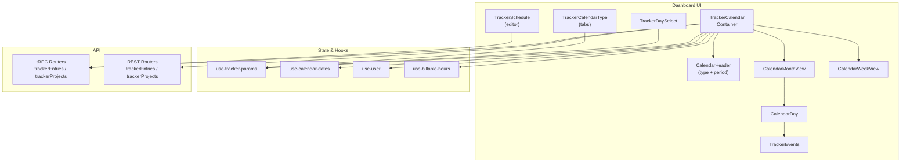
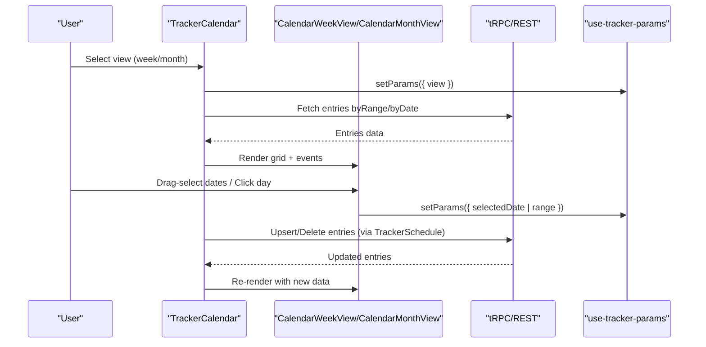
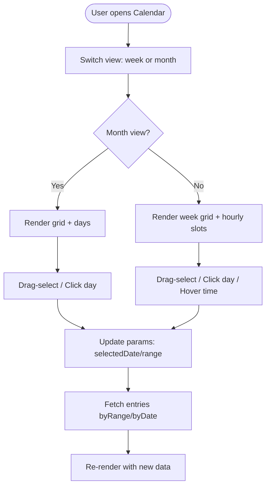
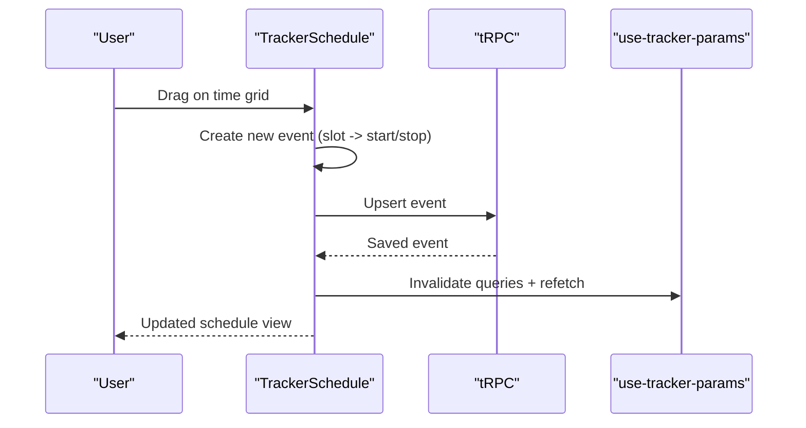
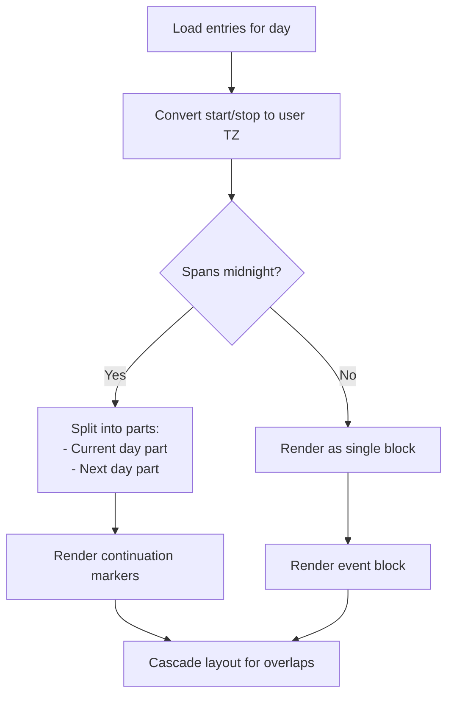
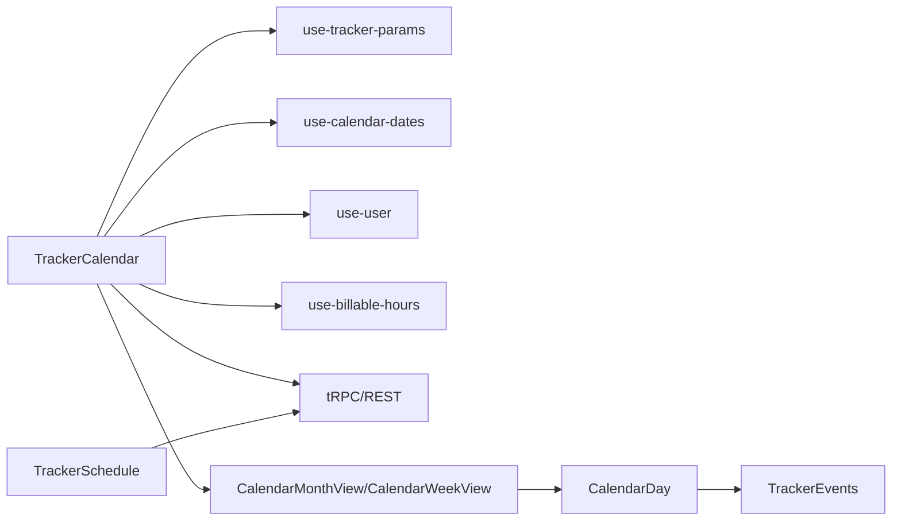

# Calendar & Scheduling

<cite>
**Referenced Files in This Document**
- [tracker-calendar.tsx](file://apps/dashboard/src/components/tracker-calendar.tsx)
- [calendar-month-view.tsx](file://apps/dashboard/src/components/tracker/calendar-month-view.tsx)
- [calendar-week-view.tsx](file://apps/dashboard/src/components/tracker/calendar-week-view.tsx)
- [calendar-day.tsx](file://apps/dashboard/src/components/tracker/calendar-day.tsx)
- [events.tsx](file://apps/dashboard/src/components/tracker/events.tsx)
- [tracker-calendar-type.tsx](file://apps/dashboard/src/components/tracker-calendar-type.tsx)
- [tracker-day-select.tsx](file://apps/dashboard/src/components/tracker-day-select.tsx)
- [tracker-schedule.tsx](file://apps/dashboard/src/components/tracker-schedule.tsx)
- [page.tsx](file://apps/dashboard/src/app/[locale]/(app)/(sidebar)/tracker/page.tsx)
- [time-tracking-calendar-animation.tsx](file://apps/website/src/components/time-tracking-calendar-animation.tsx)
- [set-weekly-calendar-action.ts](file://apps/dashboard/src/actions/set-weekly-calendar-action.ts)
- [use-tracker-params.ts](file://apps/dashboard/src/hooks/use-tracker-params.ts)
- [use-calendar-dates.ts](file://apps/dashboard/src/hooks/use-calendar-dates.ts)
- [use-user.ts](file://apps/dashboard/src/hooks/use-user.ts)
- [use-billable-hours.ts](file://apps/dashboard/src/hooks/use-billable-hours.ts)
- [tracker-entries-form.tsx](file://apps/dashboard/src/components/forms/tracker-entries-form.tsx)
- [tracker-create-sheet.tsx](file://apps/dashboard/src/components/sheets/tracker-create-sheet.tsx)
- [tracker-update-sheet.tsx](file://apps/dashboard/src/components/sheets/tracker-update-sheet.tsx)
- [tracker-schedule-sheet.tsx](file://apps/dashboard/src/components/sheets/tracker-schedule-sheet.tsx)
- [open-tracker-sheet.tsx](file://apps/dashboard/src/components/open-tracker-sheet.tsx)
- [tracker-projects.ts](file://apps/api/src/rest/routers/tracker/projects.ts)
- [tracker-entries.ts](file://apps/api/src/rest/routers/tracker/entries.ts)
- [tracker-entries.ts](file://apps/api/src/trpc/routers/tracker/entries.ts)
- [tracker-projects.ts](file://apps/api/src/trpc/routers/tracker/projects.ts)
- [tracker-entries.ts](file://apps/api/src/schemas/tracker-entries.ts)
- [tracker-projects.ts](file://apps/api/src/schemas/tracker-projects.ts)
</cite>

## Table of Contents
1. [Introduction](#introduction)
2. [Project Structure](#project-structure)
3. [Core Components](#core-components)
4. [Architecture Overview](#architecture-overview)
5. [Detailed Component Analysis](#detailed-component-analysis)
6. [Dependency Analysis](#dependency-analysis)
7. [Performance Considerations](#performance-considerations)
8. [Troubleshooting Guide](#troubleshooting-guide)
9. [Conclusion](#conclusion)
10. [Appendices](#appendices)

## Introduction
This document explains Faworra’s calendar and scheduling features integrated with time tracking. It covers calendar views (day, week, month), navigation and selection, scheduling workflows, time slot management, midnight-spanning event handling, recurring and repeated scheduling concepts, filtering and categorization, and collaboration via shared time tracking. It also outlines integration touchpoints with backend APIs and highlights UI animations that demonstrate calendar usage.

## Project Structure
The calendar and scheduling system is primarily implemented in the Dashboard application. Key modules include:
- Calendar container and navigation
- Month and week views with drag-selection and event rendering
- Day-level event display and interaction
- Schedule editor for time slots and event creation/update
- Parameter and state management for views and selections
- API integrations for tracker entries and projects

**Diagram sources**
- [tracker-calendar.tsx](file://apps/dashboard/src/components/tracker-calendar.tsx#L33-L247)
- [calendar-month-view.tsx](file://apps/dashboard/src/components/tracker/calendar-month-view.tsx#L22-L65)
- [calendar-week-view.tsx](file://apps/dashboard/src/components/tracker/calendar-week-view.tsx#L540-L684)
- [calendar-day.tsx](file://apps/dashboard/src/components/tracker/calendar-day.tsx#L31-L122)
- [events.tsx](file://apps/dashboard/src/components/tracker/events.tsx#L20-L229)
- [tracker-calendar-type.tsx](file://apps/dashboard/src/components/tracker-calendar-type.tsx#L24-L58)
- [tracker-day-select.tsx](file://apps/dashboard/src/components/tracker-day-select.tsx#L15-L75)
- [tracker-schedule.tsx](file://apps/dashboard/src/components/tracker-schedule.tsx#L576-L1533)

**Section sources**
- [tracker-calendar.tsx](file://apps/dashboard/src/components/tracker-calendar.tsx#L33-L247)
- [page.tsx](file://apps/dashboard/src/app/[locale]/(app)/(sidebar)/tracker/page.tsx#L26-L59)

## Core Components
- TrackerCalendar: orchestrates view selection, date ranges, drag-selection, and integrates with billable hours.
- CalendarMonthView and CalendarWeekView: render month and week grids with events and time slots.
- CalendarDay and TrackerEvents: render individual day cells and event rows with midnight-spanning logic.
- TrackerSchedule: manages time-slot editing, event creation, drag-resize/move, and cascade layout for overlapping events.
- TrackerCalendarType and TrackerDaySelect: view switching and keyboard-driven navigation.
- use-tracker-params, use-calendar-dates, use-user, use-billable-hours: state and utilities for calendar behavior.

**Section sources**
- [tracker-calendar.tsx](file://apps/dashboard/src/components/tracker-calendar.tsx#L33-L247)
- [calendar-month-view.tsx](file://apps/dashboard/src/components/tracker/calendar-month-view.tsx#L22-L65)
- [calendar-week-view.tsx](file://apps/dashboard/src/components/tracker/calendar-week-view.tsx#L540-L684)
- [calendar-day.tsx](file://apps/dashboard/src/components/tracker/calendar-day.tsx#L31-L122)
- [events.tsx](file://apps/dashboard/src/components/tracker/events.tsx#L20-L229)
- [tracker-schedule.tsx](file://apps/dashboard/src/components/tracker-schedule.tsx#L576-L1533)
- [tracker-calendar-type.tsx](file://apps/dashboard/src/components/tracker-calendar-type.tsx#L24-L58)
- [tracker-day-select.tsx](file://apps/dashboard/src/components/tracker-day-select.tsx#L15-L75)

## Architecture Overview
The calendar integrates frontend UI with backend APIs for tracker entries and projects. The UI supports:
- View switching between week and month
- Drag-selection across dates
- Click-to-select single dates
- Keyboard shortcuts for navigation
- Time-slot editing with cascade layout for overlapping events
- Midnight-spanning event rendering across day boundaries
- Billable hours computation and display

**Diagram sources**
- [tracker-calendar.tsx](file://apps/dashboard/src/components/tracker-calendar.tsx#L110-L112)
- [tracker-schedule.tsx](file://apps/dashboard/src/components/tracker-schedule.tsx#L492-L527)
- [tracker-calendar-type.tsx](file://apps/dashboard/src/components/tracker-calendar-type.tsx#L24-L58)
- [tracker-day-select.tsx](file://apps/dashboard/src/components/tracker-day-select.tsx#L15-L75)

## Detailed Component Analysis

### Calendar Views and Navigation
- Month view grid displays weekday headers and calendar days. Each cell renders events for that date and supports drag-selection and click-to-select.
- Week view displays hourly slots with cascade layout for overlapping events. Midnight-spanning events are split across day boundaries and rendered consistently.
- Navigation supports keyboard arrows and explicit controls for moving between periods.

**Diagram sources**
- [tracker-calendar.tsx](file://apps/dashboard/src/components/tracker-calendar.tsx#L121-L140)
- [calendar-month-view.tsx](file://apps/dashboard/src/components/tracker/calendar-month-view.tsx#L22-L65)
- [calendar-week-view.tsx](file://apps/dashboard/src/components/tracker/calendar-week-view.tsx#L540-L684)
- [tracker-day-select.tsx](file://apps/dashboard/src/components/tracker-day-select.tsx#L15-L75)

**Section sources**
- [tracker-calendar.tsx](file://apps/dashboard/src/components/tracker-calendar.tsx#L33-L247)
- [calendar-month-view.tsx](file://apps/dashboard/src/components/tracker/calendar-month-view.tsx#L22-L65)
- [calendar-week-view.tsx](file://apps/dashboard/src/components/tracker/calendar-week-view.tsx#L540-L684)
- [calendar-day.tsx](file://apps/dashboard/src/components/tracker/calendar-day.tsx#L31-L122)
- [events.tsx](file://apps/dashboard/src/components/tracker/events.tsx#L20-L229)
- [tracker-day-select.tsx](file://apps/dashboard/src/components/tracker-day-select.tsx#L15-L75)

### Scheduling Workflows and Time Slot Management
- Drag-selection allows quick date range selection for scheduling.
- Click-to-select focuses on a single date for detailed editing.
- The schedule editor supports:
  - Creating new events from a time slot
  - Resizing and moving existing events
  - Deleting events
  - Handling next-day stop times (e.g., 23:00–01:00)
- Overlapping events are laid out with a cascade algorithm to avoid overlap.

**Diagram sources**
- [tracker-schedule.tsx](file://apps/dashboard/src/components/tracker-schedule.tsx#L740-L800)
- [tracker-schedule.tsx](file://apps/dashboard/src/components/tracker-schedule.tsx#L492-L527)

**Section sources**
- [tracker-schedule.tsx](file://apps/dashboard/src/components/tracker-schedule.tsx#L576-L1533)

### Midnight-Spanning Events and Cascade Layout
- Events spanning midnight are detected by comparing the event’s start and end dates in the user’s timezone.
- Weekly and monthly views split these events across day boundaries and render continuation indicators.
- Overlapping events are grouped and positioned with a cascading layout to improve readability.

**Diagram sources**
- [calendar-week-view.tsx](file://apps/dashboard/src/components/tracker/calendar-week-view.tsx#L211-L382)
- [events.tsx](file://apps/dashboard/src/components/tracker/events.tsx#L27-L142)

**Section sources**
- [calendar-week-view.tsx](file://apps/dashboard/src/components/tracker/calendar-week-view.tsx#L211-L382)
- [events.tsx](file://apps/dashboard/src/components/tracker/events.tsx#L27-L142)

### Recurring Events and Repeated Scheduling
- The current calendar UI does not expose a dedicated “recurring” editor. Recurrence is not rendered in the calendar views.
- The scheduler page in the workbench demonstrates repeatable/delayed jobs, which is separate from calendar event recurrence.

**Section sources**
- [schedulers.tsx](file://packages/workbench/src/ui/pages/schedulers.tsx#L1-L307)

### Filtering, Color Coding, and Event Categorization
- Projects serve as the primary categorization for tracked time. Each event references a project with optional customer and rate.
- UI components render project names and durations; no explicit color coding or category filters are present in the calendar UI.

**Section sources**
- [tracker-schedule.tsx](file://apps/dashboard/src/components/tracker-schedule.tsx#L440-L460)
- [tracker-entries-form.tsx](file://apps/dashboard/src/components/forms/tracker-entries-form.tsx)

### Calendar Sharing and Team Visibility
- The calendar UI aggregates entries for the current user/team context. There is no explicit sharing toggle or per-event visibility control in the calendar components.
- Project association implies team-level categorization; deeper sharing permissions would depend on backend access controls.

**Section sources**
- [tracker-calendar.tsx](file://apps/dashboard/src/components/tracker-calendar.tsx#L110-L112)

### Examples and Usage Scenarios
- Example 1: Schedule a meeting across two days (e.g., 23:00–01:00) by selecting the start time slot and letting the system split the event across day boundaries.
- Example 2: Drag-select a date range to quickly apply a time block to a project.
- Example 3: Switch to week view to review overlapping tasks and adjust durations or move events to free up time.

[No sources needed since this section provides general usage guidance]

## Dependency Analysis
The calendar depends on:
- State management via use-tracker-params for view, date, and selection state
- User preferences for timezone and time format
- Backend APIs for tracker entries and projects
- Utility hooks for calendar date generation and billable hours

**Diagram sources**
- [tracker-calendar.tsx](file://apps/dashboard/src/components/tracker-calendar.tsx#L33-L247)
- [use-tracker-params.ts](file://apps/dashboard/src/hooks/use-tracker-params.ts)
- [use-calendar-dates.ts](file://apps/dashboard/src/hooks/use-calendar-dates.ts)
- [use-user.ts](file://apps/dashboard/src/hooks/use-user.ts)
- [use-billable-hours.ts](file://apps/dashboard/src/hooks/use-billable-hours.ts)

**Section sources**
- [tracker-calendar.tsx](file://apps/dashboard/src/components/tracker-calendar.tsx#L33-L247)

## Performance Considerations
- Memoization and stable references are used in week/day rendering to minimize re-renders.
- Running timers trigger periodic updates only when present, reducing unnecessary renders.
- Drag-selection and hover interactions are optimized with event delegation and minimal DOM updates.

[No sources needed since this section provides general guidance]

## Troubleshooting Guide
- If events do not appear on the correct day, verify timezone conversion and midnight-span logic.
- If drag-selection does not register, ensure mouse events propagate correctly and the calendar is not in a read-only mode.
- If overlapping events overlap visually, confirm cascade layout is applied and slots are calculated correctly.

**Section sources**
- [calendar-week-view.tsx](file://apps/dashboard/src/components/tracker/calendar-week-view.tsx#L540-L684)
- [events.tsx](file://apps/dashboard/src/components/tracker/events.tsx#L20-L229)

## Conclusion
Faworra’s calendar and scheduling system provides a robust foundation for time tracking across day, week, and month views. It supports drag-selection, precise time-slot editing, midnight-spanning events, and cascade layouts for overlapping entries. While recurrence is not exposed in the calendar UI, the underlying project and entry models support categorization and team-level organization. Future enhancements could include explicit recurring event editors, color coding, and sharing controls.

## Appendices

### API Definitions
- Tracker entries endpoint (REST/TRPC): fetch by date/range, upsert, delete
- Tracker projects endpoint (REST/TRPC): list projects for selection

**Section sources**
- [tracker-entries.ts](file://apps/api/src/rest/routers/tracker/entries.ts)
- [tracker-entries.ts](file://apps/api/src/trpc/routers/tracker/entries.ts)
- [tracker-projects.ts](file://apps/api/src/rest/routers/tracker/projects.ts)
- [tracker-projects.ts](file://apps/api/src/trpc/routers/tracker/projects.ts)

### UI Animation Reference
- A time-tracking calendar animation demonstrates month navigation and event visualization.

**Section sources**
- [time-tracking-calendar-animation.tsx](file://apps/website/src/components/time-tracking-calendar-animation.tsx#L79-L122)