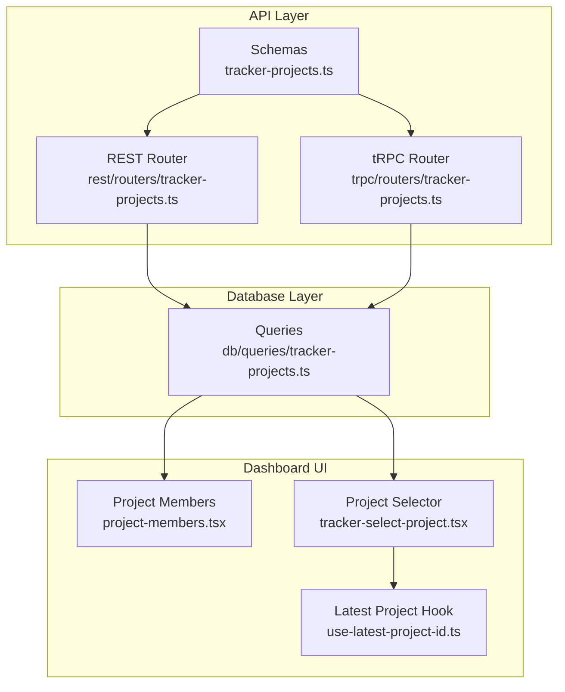
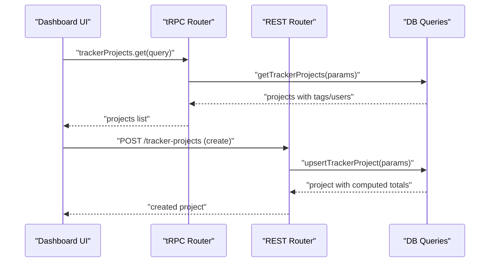
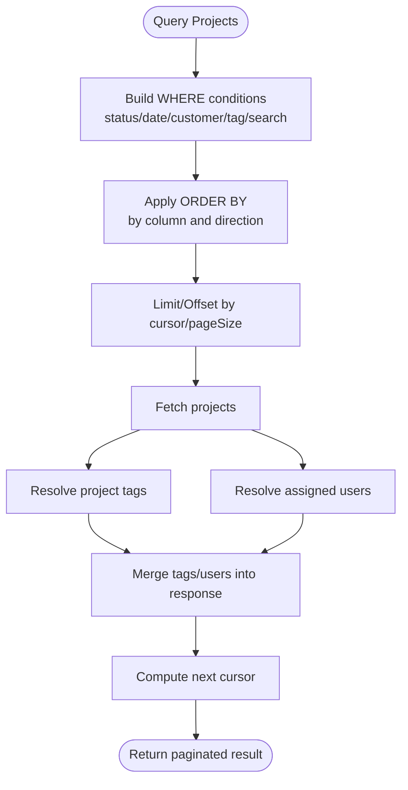
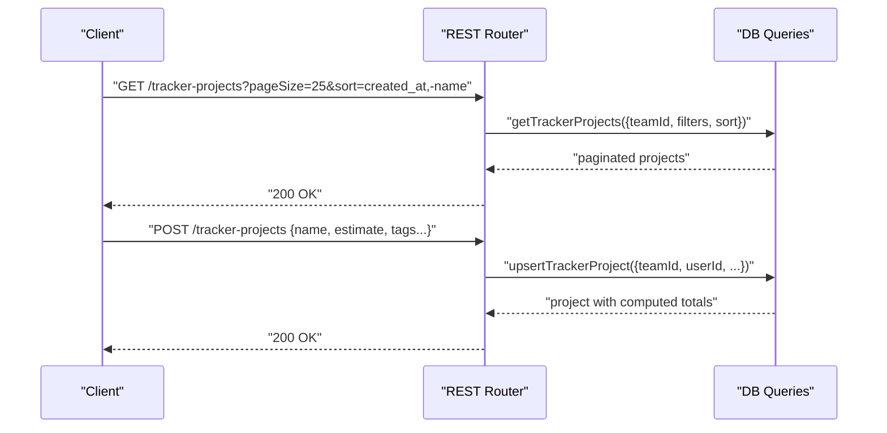
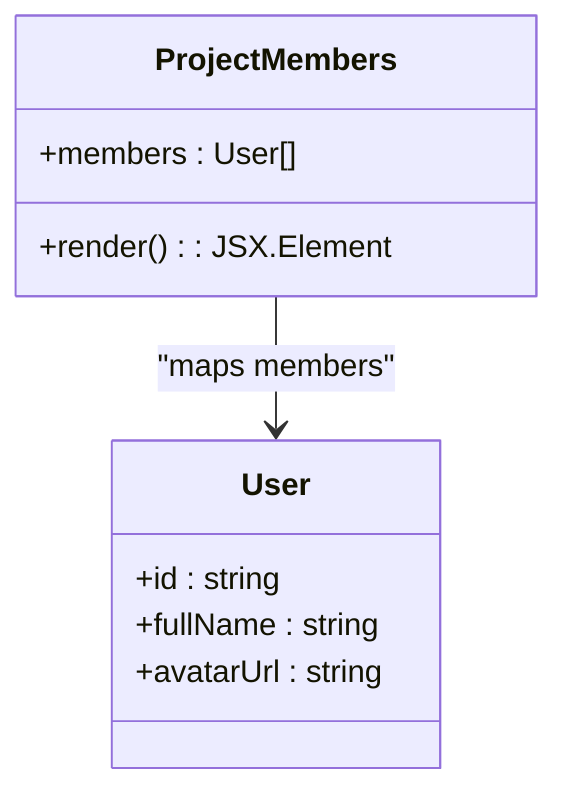
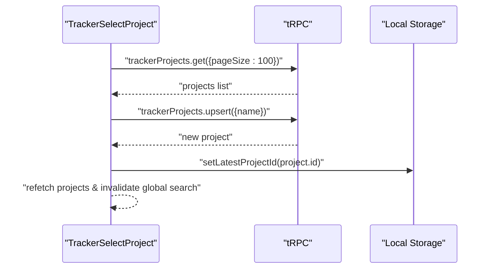
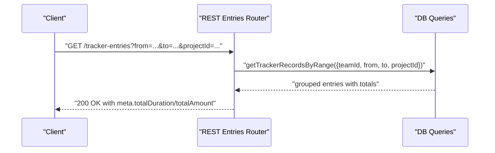
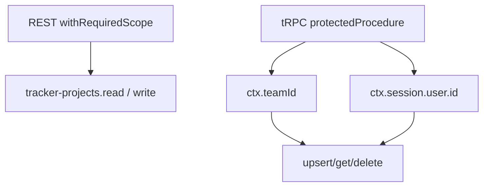
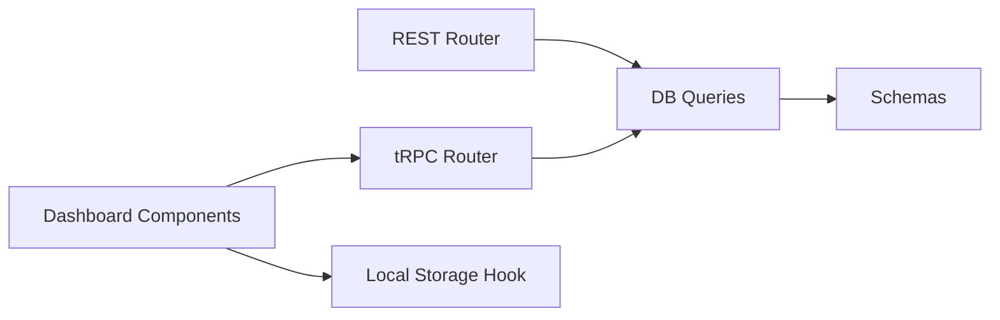

# Project Management

<cite>
**Referenced Files in This Document**
- [tracker-projects.ts](file://midday/apps/api/src/schemas/tracker-projects.ts)
- [tracker-projects.ts](file://midday/apps/api/src/rest/routers/tracker-projects.ts)
- [tracker-projects.ts](file://midday/apps/api/src/trpc/routers/tracker-projects.ts)
- [tracker-projects.ts](file://midday/packages/db/src/queries/tracker-projects.ts)
- [project-members.tsx](file://midday/apps/dashboard/src/components/project-members.tsx)
- [tracker-select-project.tsx](file://midday/apps/dashboard/src/components/tracker-select-project.tsx)
- [use-latest-project-id.ts](file://midday/apps/dashboard/src/hooks/use-latest-project-id.ts)
- [tracker-entries.ts](file://midday/apps/api/src/schemas/tracker-entries.ts)
- [tracker-entries.ts](file://midday/apps/api/src/rest/routers/tracker-entries.ts)
- [team.ts](file://midday/apps/api/src/schemas/team.ts)
</cite>

## Table of Contents
1. [Introduction](#introduction)
2. [Project Structure](#project-structure)
3. [Core Components](#core-components)
4. [Architecture Overview](#architecture-overview)
5. [Detailed Component Analysis](#detailed-component-analysis)
6. [Dependency Analysis](#dependency-analysis)
7. [Performance Considerations](#performance-considerations)
8. [Troubleshooting Guide](#troubleshooting-guide)
9. [Conclusion](#conclusion)
10. [Appendices](#appendices)

## Introduction
This document explains Faworra’s project management capabilities within the time tracking system. It covers how projects are created, configured, and managed, how team members are assigned, how time tracking integrates with projects, and how reporting and progress metrics are derived. It also outlines permission controls, visibility-related behaviors, and practical workflows for setting up projects, assigning members, scheduling time, and generating reports.

## Project Structure
Faworra organizes project management around three layers:
- API schemas define request/response contracts for projects and entries.
- REST and tRPC routers expose CRUD and query endpoints for projects and time tracking.
- Database queries encapsulate data access, filtering, sorting, aggregation, and computed fields.
- Dashboard components provide user-facing UI for selecting projects and displaying assigned members.

**Diagram sources**
- [tracker-projects.ts](file://midday/apps/api/src/schemas/tracker-projects.ts#L1-L314)
- [tracker-projects.ts](file://midday/apps/api/src/rest/routers/tracker-projects.ts#L1-L240)
- [tracker-projects.ts](file://midday/apps/api/src/trpc/routers/tracker-projects.ts#L1-L53)
- [tracker-projects.ts](file://midday/packages/db/src/queries/tracker-projects.ts#L1-L484)
- [project-members.tsx](file://midday/apps/dashboard/src/components/project-members.tsx#L1-L31)
- [tracker-select-project.tsx](file://midday/apps/dashboard/src/components/tracker-select-project.tsx#L1-L131)
- [use-latest-project-id.ts](file://midday/apps/dashboard/src/hooks/use-latest-project-id.ts#L1-L19)

**Section sources**
- [tracker-projects.ts](file://midday/apps/api/src/schemas/tracker-projects.ts#L1-L314)
- [tracker-projects.ts](file://midday/apps/api/src/rest/routers/tracker-projects.ts#L1-L240)
- [tracker-projects.ts](file://midday/apps/api/src/trpc/routers/tracker-projects.ts#L1-L53)
- [tracker-projects.ts](file://midday/packages/db/src/queries/tracker-projects.ts#L1-L484)
- [project-members.tsx](file://midday/apps/dashboard/src/components/project-members.tsx#L1-L31)
- [tracker-select-project.tsx](file://midday/apps/dashboard/src/components/tracker-select-project.tsx#L1-L131)
- [use-latest-project-id.ts](file://midday/apps/dashboard/src/hooks/use-latest-project-id.ts#L1-L19)

## Core Components
- Project schema and endpoints: Define project fields, filters, sorting, and CRUD operations via REST and tRPC.
- Project queries: Implement filtering by status/date/customer/tags, search, pagination, and computed aggregates (duration, amount).
- Project members display: Render avatars for assigned users.
- Project selector: Search or create projects with local persistence of the last selected project.
- Time tracking integration: Entries reference projects and compute totals per day/period.

**Section sources**
- [tracker-projects.ts](file://midday/apps/api/src/schemas/tracker-projects.ts#L1-L314)
- [tracker-projects.ts](file://midday/apps/api/src/rest/routers/tracker-projects.ts#L1-L240)
- [tracker-projects.ts](file://midday/apps/api/src/trpc/routers/tracker-projects.ts#L1-L53)
- [tracker-projects.ts](file://midday/packages/db/src/queries/tracker-projects.ts#L1-L484)
- [project-members.tsx](file://midday/apps/dashboard/src/components/project-members.tsx#L1-L31)
- [tracker-select-project.tsx](file://midday/apps/dashboard/src/components/tracker-select-project.tsx#L1-L131)

## Architecture Overview
The project management flow connects UI, API, and database layers:

**Diagram sources**
- [tracker-projects.ts](file://midday/apps/api/src/trpc/routers/tracker-projects.ts#L15-L52)
- [tracker-projects.ts](file://midday/apps/api/src/rest/routers/tracker-projects.ts#L64-L111)
- [tracker-projects.ts](file://midday/packages/db/src/queries/tracker-projects.ts#L33-L245)

## Detailed Component Analysis

### Project Schema and Filtering
- Filters supported: search term, creation date range, status, customer IDs, tag IDs, and sort by multiple fields.
- Sorting includes time, amount, assigned count, customer, tags, created_at, and name.
- Pagination uses a numeric cursor and pageSize.

**Diagram sources**
- [tracker-projects.ts](file://midday/packages/db/src/queries/tracker-projects.ts#L33-L245)

**Section sources**
- [tracker-projects.ts](file://midday/apps/api/src/schemas/tracker-projects.ts#L3-L110)
- [tracker-projects.ts](file://midday/packages/db/src/queries/tracker-projects.ts#L14-L25)
- [tracker-projects.ts](file://midday/packages/db/src/queries/tracker-projects.ts#L87-L172)

### Project CRUD Endpoints
- List projects: REST GET /tracker-projects with query parameters; tRPC query wrapper.
- Create/update project: REST POST/PATCH with upsert payload; tRPC mutation wrapper.
- Retrieve by ID: REST GET /tracker-projects/{id}; tRPC getById.
- Delete project: REST DELETE /tracker-projects/{id}; tRPC delete.

**Diagram sources**
- [tracker-projects.ts](file://midday/apps/api/src/rest/routers/tracker-projects.ts#L22-L111)
- [tracker-projects.ts](file://midday/apps/api/src/trpc/routers/tracker-projects.ts#L16-L33)
- [tracker-projects.ts](file://midday/packages/db/src/queries/tracker-projects.ts#L33-L245)

**Section sources**
- [tracker-projects.ts](file://midday/apps/api/src/rest/routers/tracker-projects.ts#L22-L239)
- [tracker-projects.ts](file://midday/apps/api/src/trpc/routers/tracker-projects.ts#L15-L52)

### Project Members Rendering
- Displays avatars for assigned users with fallback initials.
- Receives users array from project queries.

**Diagram sources**
- [project-members.tsx](file://midday/apps/dashboard/src/components/project-members.tsx#L4-L30)

**Section sources**
- [project-members.tsx](file://midday/apps/dashboard/src/components/project-members.tsx#L1-L31)

### Project Selector and Persistence
- Provides a combobox to search or create projects.
- On create, persists the latest project ID in local storage scoped by team.
- Invalidates queries to refresh lists and global search.

**Diagram sources**
- [tracker-select-project.tsx](file://midday/apps/dashboard/src/components/tracker-select-project.tsx#L22-L130)
- [use-latest-project-id.ts](file://midday/apps/dashboard/src/hooks/use-latest-project-id.ts#L3-L18)

**Section sources**
- [tracker-select-project.tsx](file://midday/apps/dashboard/src/components/tracker-select-project.tsx#L1-L131)
- [use-latest-project-id.ts](file://midday/apps/dashboard/src/hooks/use-latest-project-id.ts#L1-L19)

### Time Tracking Integration
- Entries reference projects and users, and include computed rate/currency and billed flag.
- REST endpoints support listing entries by date range and project, and timer controls.
- Project queries compute total duration and amount per project via database functions.

**Diagram sources**
- [tracker-entries.ts](file://midday/apps/api/src/rest/routers/tracker-entries.ts#L33-L68)
- [tracker-entries.ts](file://midday/apps/api/src/schemas/tracker-entries.ts#L13-L40)
- [tracker-entries.ts](file://midday/apps/api/src/schemas/tracker-entries.ts#L255-L285)

**Section sources**
- [tracker-entries.ts](file://midday/apps/api/src/schemas/tracker-entries.ts#L1-L409)
- [tracker-entries.ts](file://midday/apps/api/src/rest/routers/tracker-entries.ts#L1-L460)
- [tracker-projects.ts](file://midday/packages/db/src/queries/tracker-projects.ts#L421-L427)

### Permission Controls and Team Context
- REST endpoints enforce scopes for read/write operations on projects and entries.
- tRPC procedures attach teamId and session user id to all operations.
- Team schemas define roles and membership operations.

**Diagram sources**
- [tracker-projects.ts](file://midday/apps/api/src/rest/routers/tracker-projects.ts#L44-L222)
- [tracker-projects.ts](file://midday/apps/api/src/trpc/routers/tracker-projects.ts#L16-L33)
- [team.ts](file://midday/apps/api/src/schemas/team.ts#L262-L276)

**Section sources**
- [tracker-projects.ts](file://midday/apps/api/src/rest/routers/tracker-projects.ts#L18-L222)
- [tracker-projects.ts](file://midday/apps/api/src/trpc/routers/tracker-projects.ts#L7-L33)
- [team.ts](file://midday/apps/api/src/schemas/team.ts#L262-L276)

## Dependency Analysis
- REST and tRPC routers depend on database queries for data access.
- Database queries depend on schema tables and Postgres functions for aggregations.
- Dashboard components depend on tRPC queries and local storage hooks.

**Diagram sources**
- [tracker-projects.ts](file://midday/apps/api/src/rest/routers/tracker-projects.ts#L1-L240)
- [tracker-projects.ts](file://midday/apps/api/src/trpc/routers/tracker-projects.ts#L1-L53)
- [tracker-projects.ts](file://midday/packages/db/src/queries/tracker-projects.ts#L1-L12)
- [tracker-select-project.tsx](file://midday/apps/dashboard/src/components/tracker-select-project.tsx#L1-L131)
- [use-latest-project-id.ts](file://midday/apps/dashboard/src/hooks/use-latest-project-id.ts#L1-L19)

**Section sources**
- [tracker-projects.ts](file://midday/apps/api/src/rest/routers/tracker-projects.ts#L1-L240)
- [tracker-projects.ts](file://midday/apps/api/src/trpc/routers/tracker-projects.ts#L1-L53)
- [tracker-projects.ts](file://midday/packages/db/src/queries/tracker-projects.ts#L1-L12)
- [tracker-select-project.tsx](file://midday/apps/dashboard/src/components/tracker-select-project.tsx#L1-L131)
- [use-latest-project-id.ts](file://midday/apps/dashboard/src/hooks/use-latest-project-id.ts#L1-L19)

## Performance Considerations
- Efficient filtering: Date range, status, customer IDs, tag existence, and full-text search are applied at the database level.
- Sorting by computed fields: Total duration and amount leverage database functions; sorting by assigned count and tag counts uses subqueries.
- Pagination: Cursor-based pagination with configurable pageSize prevents large result sets.
- Aggregation reuse: Project queries compute totals and user assignments in a single pass to minimize round trips.

[No sources needed since this section provides general guidance]

## Troubleshooting Guide
- Project not appearing in lists: Verify filters (status, date range, customer/tag) and search term; confirm team context.
- Sorting anomalies: Ensure sort arrays conform to supported columns and directions.
- Member avatars missing: Confirm users are assigned to the project and avatars are present.
- Timer totals mismatch: Check that entries are linked to the intended project and date range.

[No sources needed since this section provides general guidance]

## Conclusion
Faworra’s project management layer integrates tightly with time tracking. Projects support rich filtering, sorting, and pagination, while computed fields (duration, amount) enable meaningful reporting. Team scoping and permission checks ensure secure access. The UI provides convenient project selection and member visualization, and seamless integration with time tracking enables accurate progress and billing insights.

[No sources needed since this section summarizes without analyzing specific files]

## Appendices

### Example Workflows

- Create a project
  - Call the create endpoint with name, optional description, estimate, billable flag, rate, currency, and tags.
  - Persist the latest project ID locally for quick selection.

- Assign team members to a project
  - Assign users to time entries linked to the project; members render via the project members component.

- Schedule and track time against a project
  - Start/stop timers or create entries with a specific project ID and date range.
  - Use the entries router to list by date range and filter by project.

- Generate progress and reporting metrics
  - Use project queries to compute total duration and amount per project.
  - Use entries queries to compute totals across a date range.

**Section sources**
- [tracker-projects.ts](file://midday/apps/api/src/rest/routers/tracker-projects.ts#L64-L111)
- [tracker-select-project.tsx](file://midday/apps/dashboard/src/components/tracker-select-project.tsx#L41-L69)
- [tracker-entries.ts](file://midday/apps/api/src/rest/routers/tracker-entries.ts#L33-L68)
- [tracker-projects.ts](file://midday/packages/db/src/queries/tracker-projects.ts#L421-L427)
- [tracker-entries.ts](file://midday/apps/api/src/schemas/tracker-entries.ts#L255-L285)