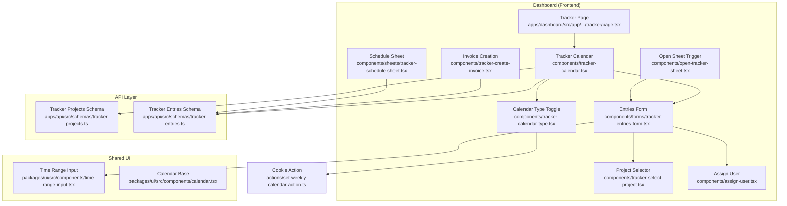
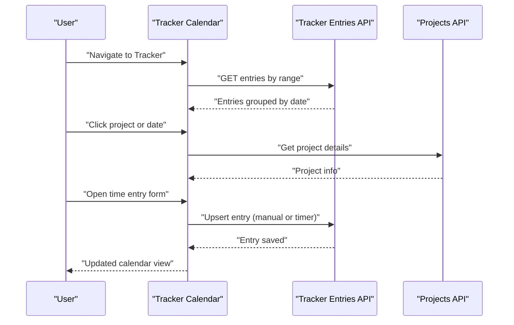
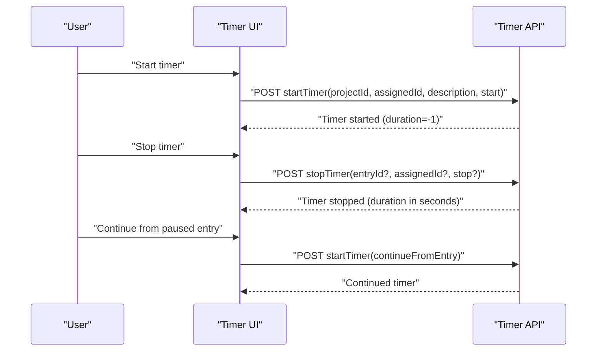
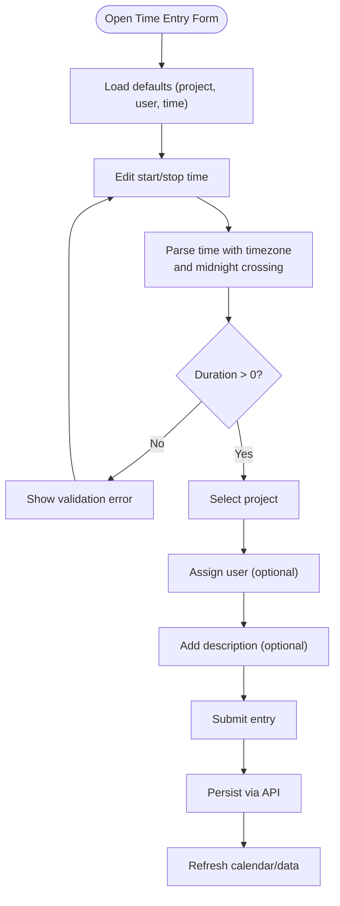
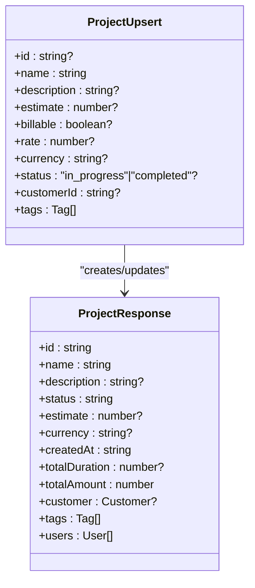
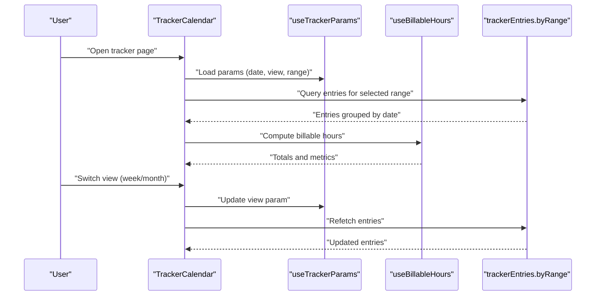
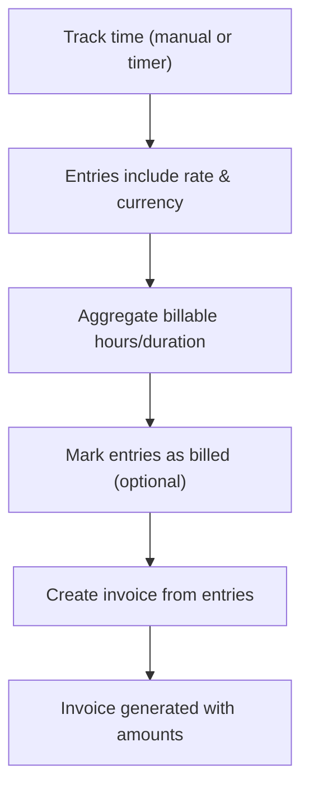
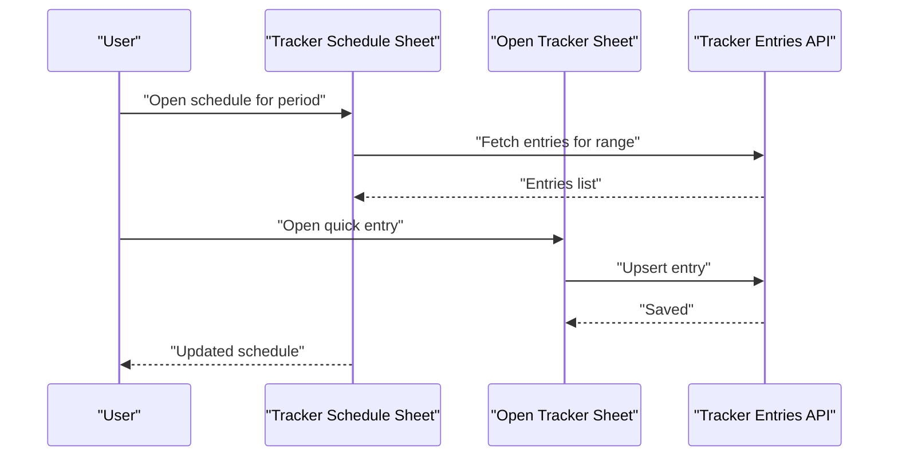
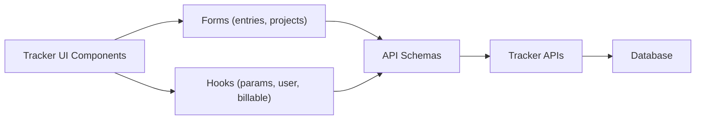

# Time Tracking & Project Management

<cite>
**Referenced Files in This Document**
- [page.tsx](file://apps/dashboard/src/app/[locale]/(app)/(sidebar)/tracker/page.tsx)
- [tracker-calendar.tsx](file://apps/dashboard/src/components/tracker-calendar.tsx)
- [tracker-calendar-type.tsx](file://apps/dashboard/src/components/tracker-calendar-type.tsx)
- [tracker-entries-form.tsx](file://apps/dashboard/src/components/forms/tracker-entries-form.tsx)
- [tracker-projects.ts](file://apps/api/src/schemas/tracker-projects.ts)
- [tracker-entries.ts](file://apps/api/src/schemas/tracker-entries.ts)
- [tracker-create-invoice.tsx](file://apps/dashboard/src/components/tracker-create-invoice.tsx)
- [tracker-schedule-sheet.tsx](file://apps/dashboard/src/components/sheets/tracker-schedule-sheet.tsx)
- [tracker-select-project.tsx](file://apps/dashboard/src/components/tracker-select-project.tsx)
- [assign-user.tsx](file://apps/dashboard/src/components/assign-user.tsx)
- [open-tracker-sheet.tsx](file://apps/dashboard/src/components/open-tracker-sheet.tsx)
- [set-weekly-calendar-action.ts](file://apps/dashboard/src/actions/set-weekly-calendar-action.ts)
- [use-billable-hours.ts](file://apps/dashboard/src/hooks/use-billable-hours.ts)
- [use-tracker-params.ts](file://apps/dashboard/src/hooks/use-tracker-params.ts)
- [use-user.ts](file://apps/dashboard/src/hooks/use-user.ts)
- [time-range-input.tsx](file://packages/ui/src/components/time-range-input.tsx)
- [calendar.tsx](file://packages/ui/src/components/calendar.tsx)
</cite>

## Table of Contents
1. [Introduction](#introduction)
2. [Project Structure](#project-structure)
3. [Core Components](#core-components)
4. [Architecture Overview](#architecture-overview)
5. [Detailed Component Analysis](#detailed-component-analysis)
6. [Dependency Analysis](#dependency-analysis)
7. [Performance Considerations](#performance-considerations)
8. [Troubleshooting Guide](#troubleshooting-guide)
9. [Conclusion](#conclusion)
10. [Appendices](#appendices)

## Introduction
This document explains Faworra’s time tracking and project management capabilities. It covers the timer workflow (start, stop, continue), manual time entry, project allocation, calendar integration, weekly/monthly views, billable hours tracking, invoicing integration, productivity analytics, team collaboration, approvals, and reporting. It also documents timer controls, stopwatch behavior, time entry validation, and integrations with external calendar systems and project management tools.

## Project Structure
Faworra’s time tracking spans three layers:
- Frontend (Next.js Dashboard): UI components for calendar, forms, project selection, invoicing, and scheduling.
- API (Hono + Zod schemas): Strongly typed endpoints and schemas for tracker entries and projects.
- Shared UI (Packages): Reusable components like time-range input and calendar.

**Diagram sources**
- [page.tsx](file://apps/dashboard/src/app/[locale]/(app)/(sidebar)/tracker/page.tsx#L26-L59)
- [tracker-calendar.tsx](file://apps/dashboard/src/components/tracker-calendar.tsx#L33-L247)
- [tracker-calendar-type.tsx](file://apps/dashboard/src/components/tracker-calendar-type.tsx#L24-L58)
- [tracker-entries-form.tsx](file://apps/dashboard/src/components/forms/tracker-entries-form.tsx#L44-L225)
- [tracker-projects.ts](file://apps/api/src/schemas/tracker-projects.ts#L1-L314)
- [tracker-entries.ts](file://apps/api/src/schemas/tracker-entries.ts#L1-L409)
- [tracker-create-invoice.tsx](file://apps/dashboard/src/components/tracker-create-invoice.tsx)
- [tracker-schedule-sheet.tsx](file://apps/dashboard/src/components/sheets/tracker-schedule-sheet.tsx)
- [tracker-select-project.tsx](file://apps/dashboard/src/components/tracker-select-project.tsx)
- [assign-user.tsx](file://apps/dashboard/src/components/assign-user.tsx)
- [open-tracker-sheet.tsx](file://apps/dashboard/src/components/open-tracker-sheet.tsx)
- [set-weekly-calendar-action.ts](file://apps/dashboard/src/actions/set-weekly-calendar-action.ts)
- [time-range-input.tsx](file://packages/ui/src/components/time-range-input.tsx)
- [calendar.tsx](file://packages/ui/src/components/calendar.tsx)

**Section sources**
- [page.tsx](file://apps/dashboard/src/app/[locale]/(app)/(sidebar)/tracker/page.tsx#L18-L59)
- [tracker-calendar.tsx](file://apps/dashboard/src/components/tracker-calendar.tsx#L33-L247)
- [tracker-entries-form.tsx](file://apps/dashboard/src/components/forms/tracker-entries-form.tsx#L44-L225)
- [tracker-projects.ts](file://apps/api/src/schemas/tracker-projects.ts#L1-L314)
- [tracker-entries.ts](file://apps/api/src/schemas/tracker-entries.ts#L1-L409)

## Core Components
- Tracker Calendar: Renders week or month view, supports drag-to-select date ranges, hotkeys navigation, and integrates with billable hours computation.
- Timer Controls: Start/stop/continue timer via dedicated schemas and responses; supports continuing from a paused entry and assigning timers to users.
- Manual Entry Form: Validates time ranges, handles midnight crossing, assigns projects/users, and persists entries.
- Project Management: CRUD for projects with rates, estimates, billable flags, tags, and customer associations.
- Invoicing Integration: Creates invoices from tracked time entries.
- Reporting & Analytics: Billable hours aggregation and productivity metrics surfaced in calendar UI.

**Section sources**
- [tracker-calendar.tsx](file://apps/dashboard/src/components/tracker-calendar.tsx#L33-L247)
- [tracker-entries.ts](file://apps/api/src/schemas/tracker-entries.ts#L297-L391)
- [tracker-entries-form.tsx](file://apps/dashboard/src/components/forms/tracker-entries-form.tsx#L44-L225)
- [tracker-projects.ts](file://apps/api/src/schemas/tracker-projects.ts#L112-L176)
- [tracker-create-invoice.tsx](file://apps/dashboard/src/components/tracker-create-invoice.tsx)

## Architecture Overview
The time tracking architecture connects UI components to API schemas and shared UI primitives. The calendar drives data queries and displays time entries, while forms validate and submit entries. Timer operations leverage dedicated schemas for start/stop/continue and status checks.

**Diagram sources**
- [tracker-calendar.tsx](file://apps/dashboard/src/components/tracker-calendar.tsx#L110-L112)
- [tracker-entries.ts](file://apps/api/src/schemas/tracker-entries.ts#L42-L90)
- [tracker-projects.ts](file://apps/api/src/schemas/tracker-projects.ts#L185-L190)

## Detailed Component Analysis

### Timer Workflow
The timer supports:
- Start timer with project assignment and optional description.
- Stop timer for a specific entry or current running timer.
- Continue from a paused entry.
- Retrieve current timer status and elapsed time.

Key schema references:
- Start timer: [startTimerSchema](file://apps/api/src/schemas/tracker-entries.ts#L297-L325)
- Stop timer: [stopTimerSchema](file://apps/api/src/schemas/tracker-entries.ts#L327-L343)
- Current timer status: [timerStatusSchema](file://apps/api/src/schemas/tracker-entries.ts#L367-L391)
- Timer response: [timerResponseSchema](file://apps/api/src/schemas/tracker-entries.ts#L354-L365)

**Diagram sources**
- [tracker-entries.ts](file://apps/api/src/schemas/tracker-entries.ts#L297-L391)

**Section sources**
- [tracker-entries.ts](file://apps/api/src/schemas/tracker-entries.ts#L297-L391)

### Manual Time Entry
Manual entry validates time ranges, handles midnight crossing, assigns project and user, and persists the entry.

Key references:
- Form validation and submission: [tracker-entries-form.tsx](file://apps/dashboard/src/components/forms/tracker-entries-form.tsx#L20-L225)
- Time range input component: [time-range-input.tsx](file://packages/ui/src/components/time-range-input.tsx)
- Project selector: [tracker-select-project.tsx](file://apps/dashboard/src/components/tracker-select-project.tsx)
- User assignment: [assign-user.tsx](file://apps/dashboard/src/components/assign-user.tsx)

**Diagram sources**
- [tracker-entries-form.tsx](file://apps/dashboard/src/components/forms/tracker-entries-form.tsx#L44-L225)
- [time-range-input.tsx](file://packages/ui/src/components/time-range-input.tsx)
- [tracker-select-project.tsx](file://apps/dashboard/src/components/tracker-select-project.tsx)
- [assign-user.tsx](file://apps/dashboard/src/components/assign-user.tsx)

**Section sources**
- [tracker-entries-form.tsx](file://apps/dashboard/src/components/forms/tracker-entries-form.tsx#L44-L225)

### Project Management
Projects support:
- Upsert operations with name, description, estimate, billable flag, rate, currency, status, customer, tags, and assigned users.
- Filtering by status, customer, tags, date range, and search query.
- Pagination and sorting.

References:
- Upsert schema: [upsertTrackerProjectSchema](file://apps/api/src/schemas/tracker-projects.ts#L112-L176)
- Response schema: [trackerProjectResponseSchema](file://apps/api/src/schemas/tracker-projects.ts#L192-L289)
- Filtering/search: [getTrackerProjectsSchema](file://apps/api/src/schemas/tracker-projects.ts#L3-L110)

**Diagram sources**
- [tracker-projects.ts](file://apps/api/src/schemas/tracker-projects.ts#L112-L289)

**Section sources**
- [tracker-projects.ts](file://apps/api/src/schemas/tracker-projects.ts#L3-L314)

### Calendar Integration and Views
The calendar supports:
- Week and month views, with configurable start-of-week based on user preferences.
- Drag-to-select date ranges and click-to-select single dates.
- Hotkeys for navigation and outside-click to clear selections.
- Fetching entries by range and rendering them in the calendar grid.

References:
- Calendar container: [tracker-calendar.tsx](file://apps/dashboard/src/components/tracker-calendar.tsx#L33-L247)
- View toggle: [tracker-calendar-type.tsx](file://apps/dashboard/src/components/tracker-calendar-type.tsx#L24-L58)
- Weekly preference action: [set-weekly-calendar-action.ts](file://apps/dashboard/src/actions/set-weekly-calendar-action.ts)
- Params hook: [use-tracker-params.ts](file://apps/dashboard/src/hooks/use-tracker-params.ts)
- Billable hours hook: [use-billable-hours.ts](file://apps/dashboard/src/hooks/use-billable-hours.ts)
- User preferences: [use-user.ts](file://apps/dashboard/src/hooks/use-user.ts)

**Diagram sources**
- [tracker-calendar.tsx](file://apps/dashboard/src/components/tracker-calendar.tsx#L33-L247)
- [tracker-calendar-type.tsx](file://apps/dashboard/src/components/tracker-calendar-type.tsx#L24-L58)
- [set-weekly-calendar-action.ts](file://apps/dashboard/src/actions/set-weekly-calendar-action.ts)
- [use-tracker-params.ts](file://apps/dashboard/src/hooks/use-tracker-params.ts)
- [use-billable-hours.ts](file://apps/dashboard/src/hooks/use-billable-hours.ts)
- [use-user.ts](file://apps/dashboard/src/hooks/use-user.ts)

**Section sources**
- [tracker-calendar.tsx](file://apps/dashboard/src/components/tracker-calendar.tsx#L33-L247)
- [tracker-calendar-type.tsx](file://apps/dashboard/src/components/tracker-calendar-type.tsx#L24-L58)

### Billing Calculation and Invoicing
- Each tracker entry carries an hourly rate, currency, and a billed flag.
- Billable hours are computed and displayed in the calendar header.
- Invoices can be created from tracked time entries.

References:
- Entry response with rate/currency/billed: [trackerEntryResponseSchema](file://apps/api/src/schemas/tracker-entries.ts#L130-L171)
- Billable hours hook: [use-billable-hours.ts](file://apps/dashboard/src/hooks/use-billable-hours.ts)
- Invoice creation: [tracker-create-invoice.tsx](file://apps/dashboard/src/components/tracker-create-invoice.tsx)

**Diagram sources**
- [tracker-entries.ts](file://apps/api/src/schemas/tracker-entries.ts#L130-L171)
- [use-billable-hours.ts](file://apps/dashboard/src/hooks/use-billable-hours.ts)
- [tracker-create-invoice.tsx](file://apps/dashboard/src/components/tracker-create-invoice.tsx)

**Section sources**
- [tracker-entries.ts](file://apps/api/src/schemas/tracker-entries.ts#L130-L171)
- [use-billable-hours.ts](file://apps/dashboard/src/hooks/use-billable-hours.ts)
- [tracker-create-invoice.tsx](file://apps/dashboard/src/components/tracker-create-invoice.tsx)

### Team Collaboration and Scheduling
- Users can be assigned to time entries and projects.
- Schedule sheet allows viewing and editing entries for selected periods.
- Open sheet triggers open the entry form for quick capture.

References:
- Schedule sheet: [tracker-schedule-sheet.tsx](file://apps/dashboard/src/components/sheets/tracker-schedule-sheet.tsx)
- Open sheet: [open-tracker-sheet.tsx](file://apps/dashboard/src/components/open-tracker-sheet.tsx)
- Project selection: [tracker-select-project.tsx](file://apps/dashboard/src/components/tracker-select-project.tsx)
- User assignment: [assign-user.tsx](file://apps/dashboard/src/components/assign-user.tsx)

**Diagram sources**
- [tracker-schedule-sheet.tsx](file://apps/dashboard/src/components/sheets/tracker-schedule-sheet.tsx)
- [open-tracker-sheet.tsx](file://apps/dashboard/src/components/open-tracker-sheet.tsx)
- [tracker-select-project.tsx](file://apps/dashboard/src/components/tracker-select-project.tsx)
- [assign-user.tsx](file://apps/dashboard/src/components/assign-user.tsx)

**Section sources**
- [tracker-schedule-sheet.tsx](file://apps/dashboard/src/components/sheets/tracker-schedule-sheet.tsx)
- [open-tracker-sheet.tsx](file://apps/dashboard/src/components/open-tracker-sheet.tsx)
- [tracker-select-project.tsx](file://apps/dashboard/src/components/tracker-select-project.tsx)
- [assign-user.tsx](file://apps/dashboard/src/components/assign-user.tsx)

### Reporting Capabilities
- Calendar aggregates total duration and amount for the selected period.
- Project pages show total tracked time and earnings.
- Filters support by customer, tags, status, and date ranges.

References:
- Calendar totals: [TrackerCalendar](file://apps/dashboard/src/components/tracker-calendar.tsx#L207-L211)
- Project totals: [trackerProjectResponseSchema](file://apps/api/src/schemas/tracker-projects.ts#L224-L231)
- Project filters: [getTrackerProjectsSchema](file://apps/api/src/schemas/tracker-projects.ts#L3-L110)

**Section sources**
- [tracker-calendar.tsx](file://apps/dashboard/src/components/tracker-calendar.tsx#L207-L211)
- [tracker-projects.ts](file://apps/api/src/schemas/tracker-projects.ts#L224-L231)
- [tracker-projects.ts](file://apps/api/src/schemas/tracker-projects.ts#L3-L110)

## Dependency Analysis
The tracker module exhibits clear separation of concerns:
- UI components depend on shared UI primitives and hooks.
- API schemas define strict contracts for requests and responses.
- Calendar depends on user preferences and billable hours computation.

**Diagram sources**
- [tracker-calendar.tsx](file://apps/dashboard/src/components/tracker-calendar.tsx#L33-L247)
- [tracker-entries-form.tsx](file://apps/dashboard/src/components/forms/tracker-entries-form.tsx#L44-L225)
- [tracker-entries.ts](file://apps/api/src/schemas/tracker-entries.ts#L1-L409)
- [tracker-projects.ts](file://apps/api/src/schemas/tracker-projects.ts#L1-L314)

**Section sources**
- [tracker-calendar.tsx](file://apps/dashboard/src/components/tracker-calendar.tsx#L33-L247)
- [tracker-entries-form.tsx](file://apps/dashboard/src/components/forms/tracker-entries-form.tsx#L44-L225)
- [tracker-entries.ts](file://apps/api/src/schemas/tracker-entries.ts#L1-L409)
- [tracker-projects.ts](file://apps/api/src/schemas/tracker-projects.ts#L1-L314)

## Performance Considerations
- Calendar range queries: Extend monthly range by one day before and after to handle midnight-spanning entries efficiently.
- Debounce or batch updates when dragging date ranges.
- Memoize derived values (e.g., week days) to avoid unnecessary recalculations.
- Use infinite query options for large datasets and apply server-side filtering.

[No sources needed since this section provides general guidance]

## Troubleshooting Guide
Common issues and resolutions:
- Timer does not start/stop: Verify project assignment and that the user matches the authenticated context.
- Midnight crossing time parsing errors: Ensure time inputs are parsed with the user’s timezone and a reference date.
- Calendar range mismatch: Confirm the selected view aligns with the cookie setting for weekly/monthly mode.
- Billable hours not updating: Check that entries have a valid rate and currency and that the billed flag is set appropriately.

**Section sources**
- [tracker-entries.ts](file://apps/api/src/schemas/tracker-entries.ts#L297-L391)
- [tracker-entries-form.tsx](file://apps/dashboard/src/components/forms/tracker-entries-form.tsx#L100-L127)
- [tracker-calendar-type.tsx](file://apps/dashboard/src/components/tracker-calendar-type.tsx#L24-L58)
- [use-billable-hours.ts](file://apps/dashboard/src/hooks/use-billable-hours.ts)

## Conclusion
Faworra’s time tracking and project management system combines robust frontend UI with strongly typed API schemas to deliver a seamless experience. The calendar-centric interface, flexible timer controls, manual entry validation, project management, and invoicing integration provide a complete solution for teams to track time, allocate resources, calculate billing, and generate insights.

[No sources needed since this section summarizes without analyzing specific files]

## Appendices

### Example Workflows
- Time entry example: Start timer for a project, log a description, then stop the timer. Alternatively, open the manual entry form, set start/stop times, select a project, assign a user, and save.
- Project assignment example: Create a project with a customer, tags, and hourly rate; assign users to the project; filter projects by status or customer.
- Billing calculation example: Track billable time entries with a rate and currency; mark entries as billed; create an invoice from those entries.
- Report generation example: Use the calendar to view aggregated duration and amount for a selected period; export or filter by customer/tags/status.

[No sources needed since this section provides general guidance]