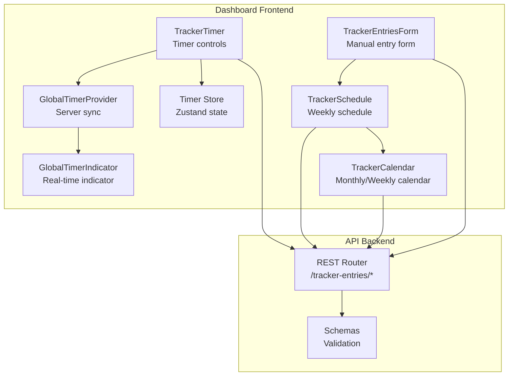
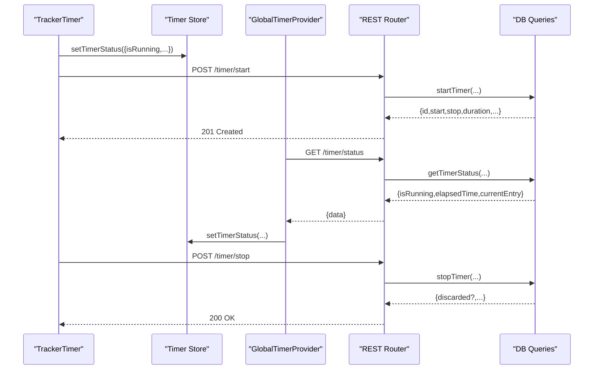
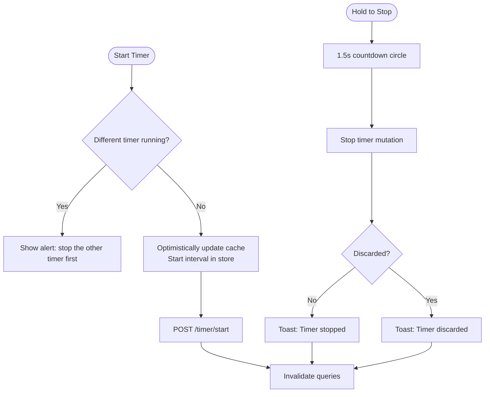
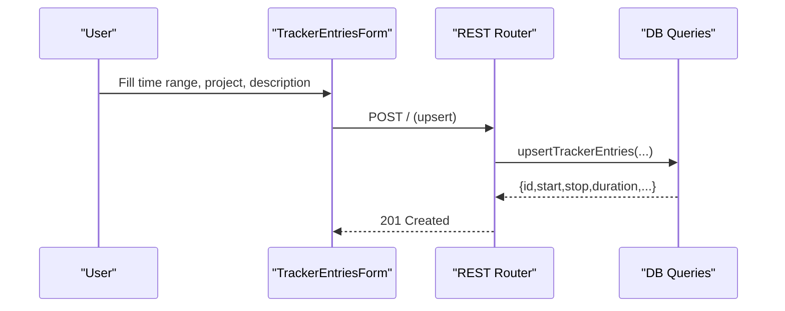
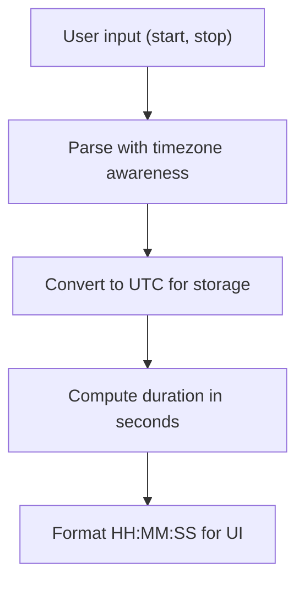
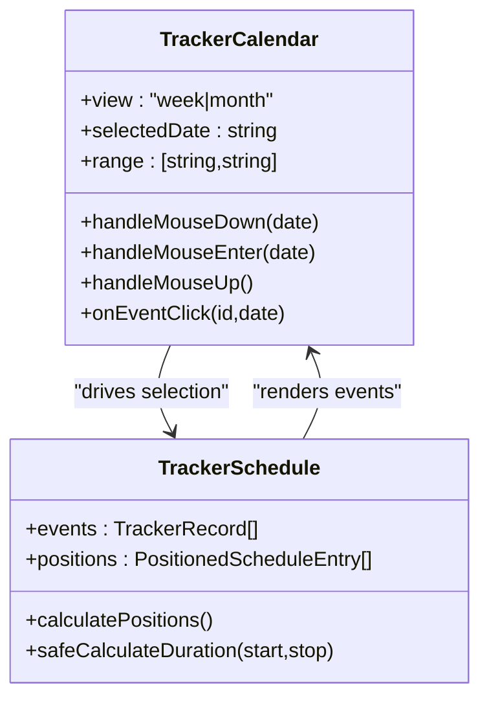
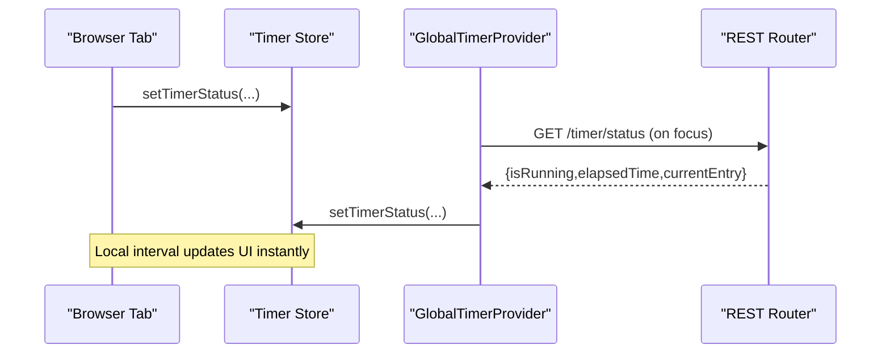
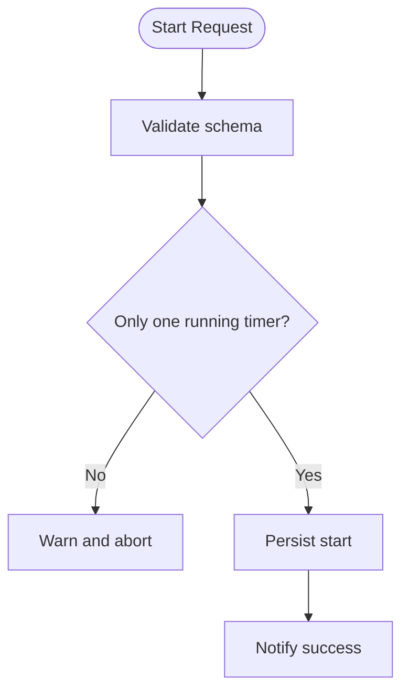
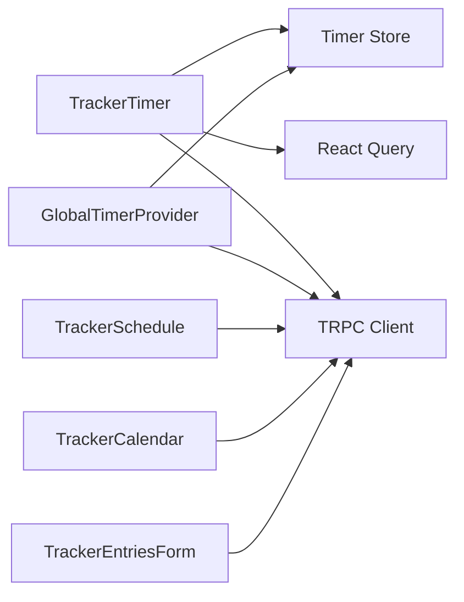

# Timer & Time Entry

<cite>
**Referenced Files in This Document**
- [tracker-timer.tsx](file://midday/apps/dashboard/src/components/tracker-timer.tsx)
- [global-timer-provider.tsx](file://midday/apps/dashboard/src/components/global-timer-provider.tsx)
- [global-timer-indicator.tsx](file://midday/apps/dashboard/src/components/global-timer-indicator.tsx)
- [timer.ts](file://midday/apps/dashboard/src/store/timer.ts)
- [use-global-timer-status.ts](file://midday/apps/dashboard/src/hooks/use-global-timer-status.ts)
- [tracker-entries.ts](file://midday/apps/api/src/rest/routers/tracker-entries.ts)
- [tracker-entries.ts](file://midday/apps/api/src/schemas/tracker-entries.ts)
- [tracker-calendar.tsx](file://midday/apps/dashboard/src/components/tracker-calendar.tsx)
- [tracker-schedule.tsx](file://midday/apps/dashboard/src/components/tracker-schedule.tsx)
- [tracker-entries-form.tsx](file://midday/apps/dashboard/src/components/forms/tracker-entries-form.tsx)
- [time-format-settings.tsx](file://midday/apps/dashboard/src/components/time-format-settings.tsx)
</cite>

## Table of Contents
1. [Introduction](#introduction)
2. [Project Structure](#project-structure)
3. [Core Components](#core-components)
4. [Architecture Overview](#architecture-overview)
5. [Detailed Component Analysis](#detailed-component-analysis)
6. [Dependency Analysis](#dependency-analysis)
7. [Performance Considerations](#performance-considerations)
8. [Troubleshooting Guide](#troubleshooting-guide)
9. [Conclusion](#conclusion)
10. [Appendices](#appendices)

## Introduction
This document explains Faworra’s timer functionality and time entry system. It covers timer controls (start, stop, pause, reset), manual time entry workflows, time format handling, duration calculations, global timer status management, timer indicators, and real-time updates. It also documents validation rules, duplicate detection, conflict resolution, cross-device synchronization, offline time tracking, data persistence, calendar integration, weekly scheduling, and time visualization. Finally, it addresses permissions, team member visibility, and approval workflows.

## Project Structure
The timer and time entry system spans the dashboard frontend and the API backend:
- Frontend components manage UI, state, and user interactions.
- Backend REST endpoints expose CRUD and timer operations with strict schemas.
- Shared state is coordinated via a global timer store and provider.

**Diagram sources**
- [tracker-timer.tsx](file://midday/apps/dashboard/src/components/tracker-timer.tsx#L1-L436)
- [global-timer-provider.tsx](file://midday/apps/dashboard/src/components/global-timer-provider.tsx#L1-L40)
- [global-timer-indicator.tsx](file://midday/apps/dashboard/src/components/global-timer-indicator.tsx#L1-L44)
- [timer.ts](file://midday/apps/dashboard/src/store/timer.ts#L1-L140)
- [tracker-schedule.tsx](file://midday/apps/dashboard/src/components/tracker-schedule.tsx#L1-L800)
- [tracker-calendar.tsx](file://midday/apps/dashboard/src/components/tracker-calendar.tsx#L1-L248)
- [tracker-entries.ts](file://midday/apps/api/src/rest/routers/tracker-entries.ts#L1-L460)
- [tracker-entries.ts](file://midday/apps/api/src/schemas/tracker-entries.ts#L1-L409)

**Section sources**
- [tracker-timer.tsx](file://midday/apps/dashboard/src/components/tracker-timer.tsx#L1-L436)
- [global-timer-provider.tsx](file://midday/apps/dashboard/src/components/global-timer-provider.tsx#L1-L40)
- [global-timer-indicator.tsx](file://midday/apps/dashboard/src/components/global-timer-indicator.tsx#L1-L44)
- [timer.ts](file://midday/apps/dashboard/src/store/timer.ts#L1-L140)
- [tracker-schedule.tsx](file://midday/apps/dashboard/src/components/tracker-schedule.tsx#L1-L800)
- [tracker-calendar.tsx](file://midday/apps/dashboard/src/components/tracker-calendar.tsx#L1-L248)
- [tracker-entries.ts](file://midday/apps/api/src/rest/routers/tracker-entries.ts#L1-L460)
- [tracker-entries.ts](file://midday/apps/api/src/schemas/tracker-entries.ts#L1-L409)

## Core Components
- Timer Controls: Start/pause/stop/reset with hold-to-stop and visual feedback.
- Global Timer Status: Centralized state synchronized from server.
- Manual Time Entry: Form with time range input, project assignment, and description.
- Calendar Integration: Monthly and weekly views with drag-to-select ranges and event visualization.
- Schemas and Endpoints: Strong validation for timer start/stop and time entries.

**Section sources**
- [tracker-timer.tsx](file://midday/apps/dashboard/src/components/tracker-timer.tsx#L1-L436)
- [global-timer-provider.tsx](file://midday/apps/dashboard/src/components/global-timer-provider.tsx#L1-L40)
- [timer.ts](file://midday/apps/dashboard/src/store/timer.ts#L1-L140)
- [tracker-entries-form.tsx](file://midday/apps/dashboard/src/components/forms/tracker-entries-form.tsx#L1-L226)
- [tracker-calendar.tsx](file://midday/apps/dashboard/src/components/tracker-calendar.tsx#L1-L248)
- [tracker-entries.ts](file://midday/apps/api/src/rest/routers/tracker-entries.ts#L280-L457)
- [tracker-entries.ts](file://midday/apps/api/src/schemas/tracker-entries.ts#L297-L391)

## Architecture Overview
The system uses a centralized timer store and provider to maintain a single source of truth for the running timer. Frontend components read from Zustand and react-query, while mutations call REST endpoints. The calendar and schedule components fetch and display time entries, and manual entries are validated by backend schemas.

**Diagram sources**
- [tracker-timer.tsx](file://midday/apps/dashboard/src/components/tracker-timer.tsx#L84-L198)
- [global-timer-provider.tsx](file://midday/apps/dashboard/src/components/global-timer-provider.tsx#L14-L36)
- [tracker-entries.ts](file://midday/apps/api/src/rest/routers/tracker-entries.ts#L280-L374)
- [tracker-entries.ts](file://midday/apps/api/src/schemas/tracker-entries.ts#L297-L391)

## Detailed Component Analysis

### Timer Controls and Global Status
- Start: Initiates a new timer or continues from a paused entry. Optimistic UI updates are followed by cache invalidation.
- Stop: Hold-to-stop triggers a controlled stop after a 1.5-second countdown. Short durations (<1 minute) may be discarded and not persisted.
- Pause/Reset: Controlled via stop with optional continuation from a specific paused entry.
- Global Status: A single interval runs in the store and updates the document title. The provider syncs server status to Zustand.

**Diagram sources**
- [tracker-timer.tsx](file://midday/apps/dashboard/src/components/tracker-timer.tsx#L200-L291)
- [tracker-entries.ts](file://midday/apps/api/src/rest/routers/tracker-entries.ts#L311-L373)
- [timer.ts](file://midday/apps/dashboard/src/store/timer.ts#L60-L138)

**Section sources**
- [tracker-timer.tsx](file://midday/apps/dashboard/src/components/tracker-timer.tsx#L1-L436)
- [global-timer-provider.tsx](file://midday/apps/dashboard/src/components/global-timer-provider.tsx#L1-L40)
- [timer.ts](file://midday/apps/dashboard/src/store/timer.ts#L1-L140)
- [use-global-timer-status.ts](file://midday/apps/dashboard/src/hooks/use-global-timer-status.ts#L1-L23)

### Manual Time Entry Workflows
- Form: TimeRangeInput enforces minimum duration, project selection, optional user assignment, and description.
- Validation: Backend schemas enforce ISO 8601 datetime fields, UUIDs, and arrays of dates for batch creation.
- Persistence: Upsert endpoint stores entries with calculated duration and date arrays.

**Diagram sources**
- [tracker-entries-form.tsx](file://midday/apps/dashboard/src/components/forms/tracker-entries-form.tsx#L1-L226)
- [tracker-entries.ts](file://midday/apps/api/src/rest/routers/tracker-entries.ts#L70-L125)
- [tracker-entries.ts](file://midday/apps/api/src/schemas/tracker-entries.ts#L42-L90)

**Section sources**
- [tracker-entries-form.tsx](file://midday/apps/dashboard/src/components/forms/tracker-entries-form.tsx#L1-L226)
- [tracker-entries.ts](file://midday/apps/api/src/rest/routers/tracker-entries.ts#L70-L125)
- [tracker-entries.ts](file://midday/apps/api/src/schemas/tracker-entries.ts#L42-L90)

### Time Format Handling and Duration Calculations
- Frontend: Seconds-to-HH:MM:SS formatting for display; NumberFlow renders digits with zero-padding.
- Backend: Durations are seconds; schemas define nullable duration for running entries.
- Schedule: Utilities convert user input to UTC, compute slots, and calculate durations safely.

**Diagram sources**
- [tracker-timer.tsx](file://midday/apps/dashboard/src/components/tracker-timer.tsx#L252-L263)
- [tracker-schedule.tsx](file://midday/apps/dashboard/src/components/tracker-schedule.tsx#L51-L73)
- [tracker-entries.ts](file://midday/apps/api/src/schemas/tracker-entries.ts#L86-L89)

**Section sources**
- [tracker-timer.tsx](file://midday/apps/dashboard/src/components/tracker-timer.tsx#L252-L263)
- [tracker-schedule.tsx](file://midday/apps/dashboard/src/components/tracker-schedule.tsx#L51-L73)
- [tracker-entries.ts](file://midday/apps/api/src/schemas/tracker-entries.ts#L86-L89)

### Calendar Integration and Weekly Scheduling
- Calendar: Monthly and weekly views with hotkeys, drag-to-select ranges, and event click handling.
- Schedule: Visualizes entries in 15-minute slots, computes overlaps, and positions events to avoid collisions.
- Real-time updates: Running timers refresh every 5 seconds for smoother UX.

**Diagram sources**
- [tracker-calendar.tsx](file://midday/apps/dashboard/src/components/tracker-calendar.tsx#L33-L247)
- [tracker-schedule.tsx](file://midday/apps/dashboard/src/components/tracker-schedule.tsx#L245-L381)

**Section sources**
- [tracker-calendar.tsx](file://midday/apps/dashboard/src/components/tracker-calendar.tsx#L1-L248)
- [tracker-schedule.tsx](file://midday/apps/dashboard/src/components/tracker-schedule.tsx#L1-L800)

### Timer Synchronization, Offline Tracking, and Persistence
- Synchronization: GlobalTimerProvider periodically syncs with server on window focus and avoids redundant updates.
- Offline tracking: Local interval and Zustand store keep UI responsive; server-side reconciliation ensures correctness.
- Persistence: REST endpoints persist timer sessions and manual entries; short durations may be discarded automatically.

**Diagram sources**
- [global-timer-provider.tsx](file://midday/apps/dashboard/src/components/global-timer-provider.tsx#L14-L36)
- [timer.ts](file://midday/apps/dashboard/src/store/timer.ts#L60-L138)

**Section sources**
- [global-timer-provider.tsx](file://midday/apps/dashboard/src/components/global-timer-provider.tsx#L1-L40)
- [timer.ts](file://midday/apps/dashboard/src/store/timer.ts#L1-L140)

### Validation Rules, Duplicate Detection, and Conflict Resolution
- Validation: Zod schemas enforce required fields, UUIDs, ISO 8601 datetimes, and array sizes.
- Duplicate detection: Not explicitly implemented in the timer endpoints; conflicts are resolved by ensuring only one running timer per user.
- Conflict resolution: Hold-to-stop prevents accidental double-start; UI warns when another timer is running.

**Diagram sources**
- [tracker-entries.ts](file://midday/apps/api/src/schemas/tracker-entries.ts#L297-L325)
- [tracker-timer.tsx](file://midday/apps/dashboard/src/components/tracker-timer.tsx#L265-L291)

**Section sources**
- [tracker-entries.ts](file://midday/apps/api/src/schemas/tracker-entries.ts#L297-L325)
- [tracker-timer.tsx](file://midday/apps/dashboard/src/components/tracker-timer.tsx#L265-L291)

### Examples

- Timer usage
  - Start a timer for a project; UI shows a pulsing dot and live HH:MM:SS counter.
  - Hold-to-stop to stop; short durations may be discarded silently.
  - Switch projects: UI prevents starting a new timer if one is already running for another project.

- Manual entry scenarios
  - Drag-select a date range in the calendar to prefill a form.
  - Enter a time range in the form; backend validates and persists the entry.
  - Edit an existing entry: open the sheet, adjust time/description, and save.

- Time entry editing
  - Select an event in the schedule or calendar; open the form and submit changes.
  - Deleting removes the entry and invalidates related caches.

**Section sources**
- [tracker-timer.tsx](file://midday/apps/dashboard/src/components/tracker-timer.tsx#L265-L291)
- [tracker-entries-form.tsx](file://midday/apps/dashboard/src/components/forms/tracker-entries-form.tsx#L1-L226)
- [tracker-schedule.tsx](file://midday/apps/dashboard/src/components/tracker-schedule.tsx#L492-L527)
- [tracker-calendar.tsx](file://midday/apps/dashboard/src/components/tracker-calendar.tsx#L155-L199)

### Permissions, Team Visibility, and Approval Workflows
- Scopes: REST endpoints require specific scopes for read/write operations on tracker entries.
- Team visibility: Endpoints operate within the authenticated user’s team context.
- Approval workflows: Not implemented in the timer endpoints; time entries are tracked without requiring approvals.

**Section sources**
- [tracker-entries.ts](file://midday/apps/api/src/rest/routers/tracker-entries.ts#L55-L267)

## Dependency Analysis
The frontend components depend on:
- Zustand store for timer state and interval management.
- React Query for caching and refetching.
- TRPC client for API calls.
- Utility modules for time parsing and formatting.

**Diagram sources**
- [tracker-timer.tsx](file://midday/apps/dashboard/src/components/tracker-timer.tsx#L1-L17)
- [global-timer-provider.tsx](file://midday/apps/dashboard/src/components/global-timer-provider.tsx#L1-L10)
- [timer.ts](file://midday/apps/dashboard/src/store/timer.ts#L1-L25)
- [tracker-schedule.tsx](file://midday/apps/dashboard/src/components/tracker-schedule.tsx#L1-L31)
- [tracker-calendar.tsx](file://midday/apps/dashboard/src/components/tracker-calendar.tsx#L1-L27)
- [tracker-entries-form.tsx](file://midday/apps/dashboard/src/components/forms/tracker-entries-form.tsx#L1-L18)

**Section sources**
- [tracker-timer.tsx](file://midday/apps/dashboard/src/components/tracker-timer.tsx#L1-L17)
- [global-timer-provider.tsx](file://midday/apps/dashboard/src/components/global-timer-provider.tsx#L1-L10)
- [timer.ts](file://midday/apps/dashboard/src/store/timer.ts#L1-L25)
- [tracker-schedule.tsx](file://midday/apps/dashboard/src/components/tracker-schedule.tsx#L1-L31)
- [tracker-calendar.tsx](file://midday/apps/dashboard/src/components/tracker-calendar.tsx#L1-L27)
- [tracker-entries-form.tsx](file://midday/apps/dashboard/src/components/forms/tracker-entries-form.tsx#L1-L18)

## Performance Considerations
- Reduced refetch frequency: Timer status is refetched every 60 seconds when running and invalidated on stop.
- Stale-time caching: Prevents unnecessary network requests.
- Centralized interval: Single interval in Zustand avoids redundant timers.
- Batch updates: Calendar and schedule invalidate multiple query keys to keep views consistent.

[No sources needed since this section provides general guidance]

## Troubleshooting Guide
- Timer does not start
  - Another timer is running; stop it first.
  - Check network connectivity and endpoint availability.

- Hold-to-stop does nothing
  - Ensure the correct project is running; the hold is only active for the currently running project.

- Timer stops unexpectedly
  - Short durations may be discarded; confirm the duration threshold.

- Calendar shows incorrect times
  - Verify user timezone settings and date formatting utilities.

- Conflicts in schedule
  - Overlapping events are cascaded; adjust time ranges to avoid overlaps.

**Section sources**
- [tracker-timer.tsx](file://midday/apps/dashboard/src/components/tracker-timer.tsx#L265-L291)
- [tracker-schedule.tsx](file://midday/apps/dashboard/src/components/tracker-schedule.tsx#L245-L381)
- [time-format-settings.tsx](file://midday/apps/dashboard/src/components/time-format-settings.tsx)

## Conclusion
Faworra’s timer and time entry system combines a centralized global timer state with robust frontend components and strict backend validation. It supports intuitive controls, accurate time formatting, flexible calendar and schedule views, and reliable synchronization. Manual entry workflows are validated and persisted securely, with clear UX signals for short durations and conflicts.

[No sources needed since this section summarizes without analyzing specific files]

## Appendices

### API Endpoints Summary
- List tracker entries by range
- Create/update/delete tracker entries
- Bulk create entries
- Start/stop timer
- Get current timer and timer status

**Section sources**
- [tracker-entries.ts](file://midday/apps/api/src/rest/routers/tracker-entries.ts#L33-L278)
- [tracker-entries.ts](file://midday/apps/api/src/rest/routers/tracker-entries.ts#L280-L457)