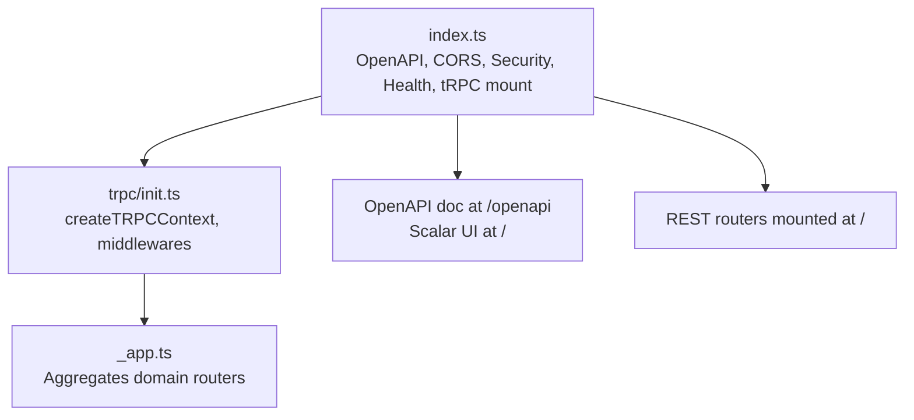
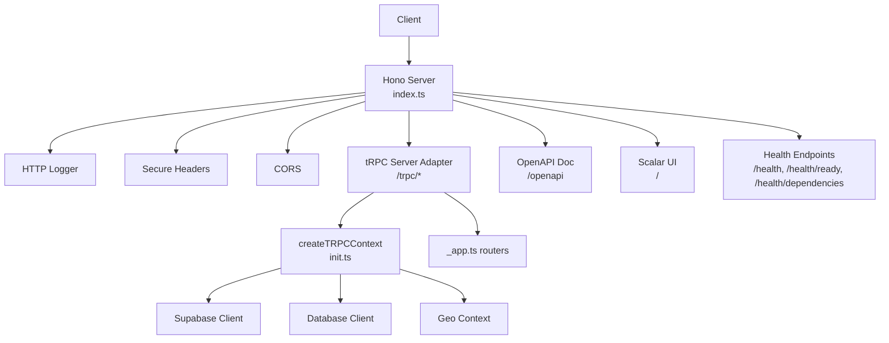
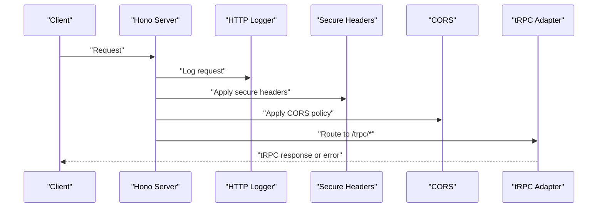
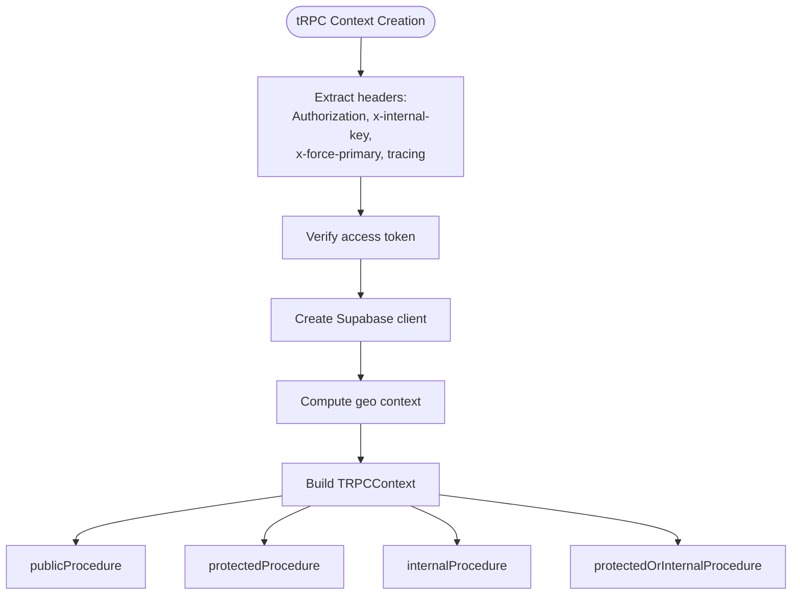
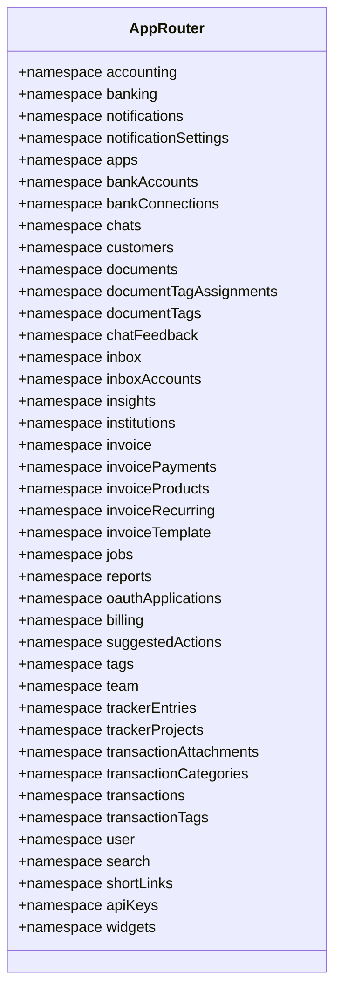
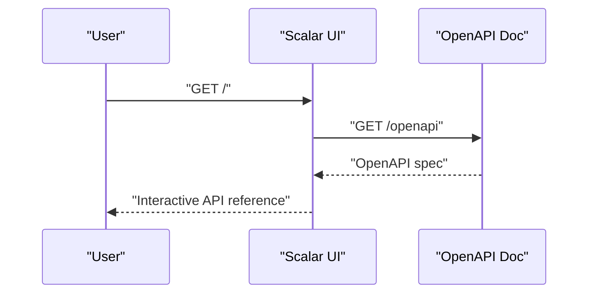
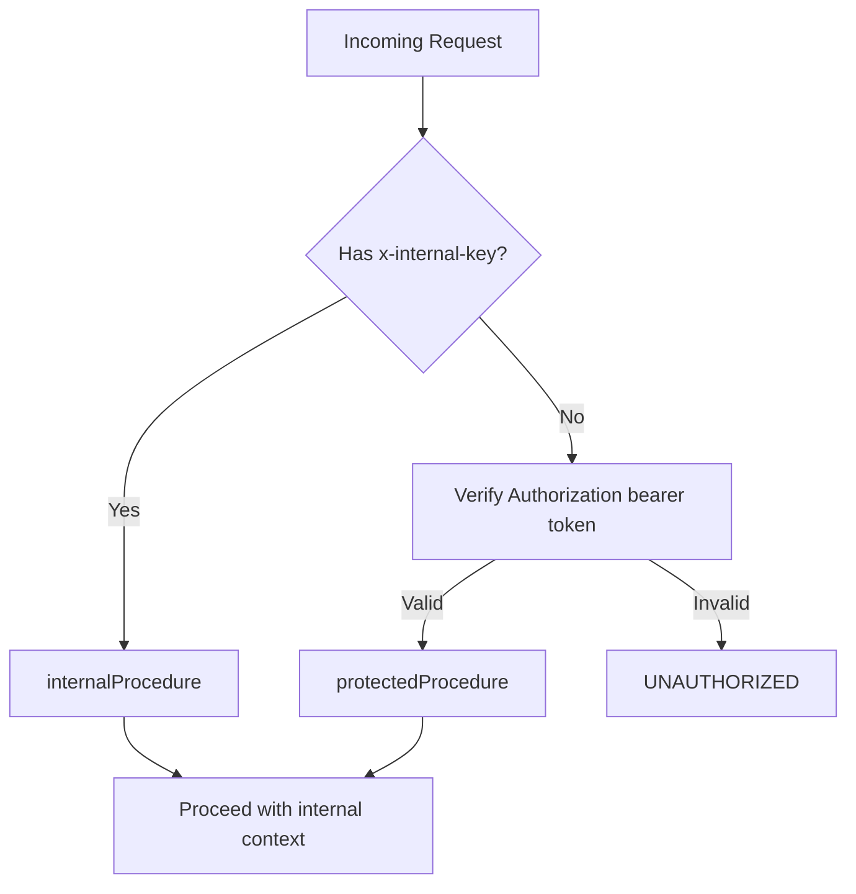
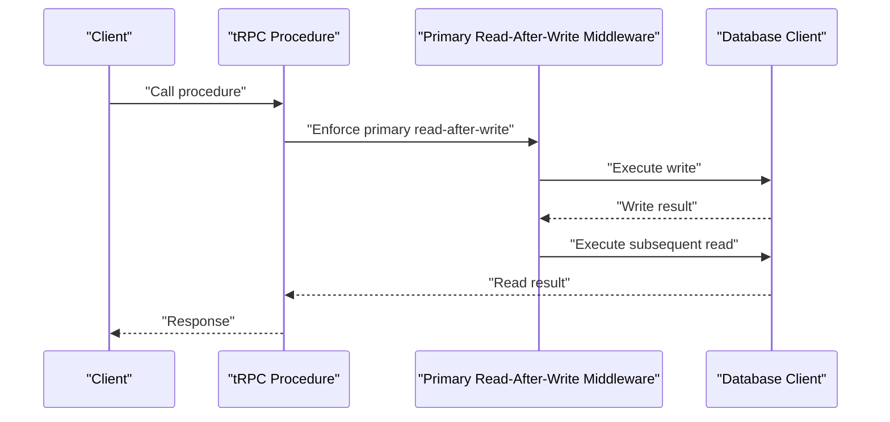
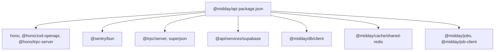

# API Application

<cite>
**Referenced Files in This Document**
- [index.ts](file://midday/apps/api/src/index.ts)
- [init.ts](file://midday/apps/api/src/trpc/init.ts)
- [_app.ts](file://midday/apps/api/src/trpc/routers/_app.ts)
- [package.json](file://midday/apps/api/package.json)
</cite>

## Table of Contents
1. [Introduction](#introduction)
2. [Project Structure](#project-structure)
3. [Core Components](#core-components)
4. [Architecture Overview](#architecture-overview)
5. [Detailed Component Analysis](#detailed-component-analysis)
6. [Dependency Analysis](#dependency-analysis)
7. [Performance Considerations](#performance-considerations)
8. [Troubleshooting Guide](#troubleshooting-guide)
9. [Conclusion](#conclusion)
10. [Appendices](#appendices)

## Introduction
This document describes the Faworra API Application built on Hono and tRPC. It covers the REST API surface, tRPC integration for strongly typed remote procedures, middleware stack, error handling, OpenAPI documentation generation, authentication and authorization, database and transaction management, background job integration, API versioning strategy, rate limiting, and security measures. It also outlines development setup, testing approaches, and production deployment considerations.

## Project Structure
The API application is organized around:
- An entrypoint that initializes the Hono server, registers OpenAPI documentation, sets up CORS and security headers, mounts tRPC, and exposes health endpoints.
- A tRPC initialization module that builds a typed context from incoming requests, verifies access tokens, creates a Supabase client, and injects geo, request tracing, and primary-read-after-write controls.
- A central tRPC router that aggregates domain-specific routers (e.g., accounting, banking, invoices, users, etc.).

**Diagram sources**
- [index.ts](file://midday/apps/api/src/index.ts#L26-L176)
- [init.ts](file://midday/apps/api/src/trpc/init.ts#L32-L80)
- [_app.ts](file://midday/apps/api/src/trpc/routers/_app.ts#L44-L85)

**Section sources**
- [index.ts](file://midday/apps/api/src/index.ts#L26-L176)
- [init.ts](file://midday/apps/api/src/trpc/init.ts#L32-L80)
- [_app.ts](file://midday/apps/api/src/trpc/routers/_app.ts#L44-L85)

## Core Components
- Hono server with OpenAPI integration and Scalar API reference.
- Middleware stack: HTTP logging, secure headers, CORS, and optional performance tracing.
- tRPC server adapter with context creation, error handling, and Sentry reporting.
- Health endpoints for readiness and dependency checks.
- Graceful shutdown with database and Redis cleanup and Sentry flush.

Key behaviors:
- OpenAPI endpoint at /openapi with bearer token and OAuth2 security schemes registered.
- Scalar API reference served at "/".
- Health endpoints at /health, /health/ready, and /health/dependencies.
- tRPC routes under /trpc/* with per-procedure timing and error reporting.

**Section sources**
- [index.ts](file://midday/apps/api/src/index.ts#L26-L176)
- [index.ts](file://midday/apps/api/src/index.ts#L202-L211)
- [index.ts](file://midday/apps/api/src/index.ts#L217-L254)

## Architecture Overview
The runtime architecture integrates Hono for routing and middleware with tRPC for typed remote procedures and OpenAPI for documentation.

**Diagram sources**
- [index.ts](file://midday/apps/api/src/index.ts#L26-L176)
- [init.ts](file://midday/apps/api/src/trpc/init.ts#L32-L80)
- [_app.ts](file://midday/apps/api/src/trpc/routers/_app.ts#L44-L85)

## Detailed Component Analysis

### Hono Entry and Middleware Stack
- Initializes OpenAPI and Scalar UI.
- Registers HTTP logging, secure headers, and CORS with configurable origins and exposed headers.
- Mounts tRPC server adapter with context creation and error handling.
- Exposes health endpoints and logs database pool stats periodically.
- Implements graceful shutdown with cleanup for DB, Redis, and Sentry.

**Diagram sources**
- [index.ts](file://midday/apps/api/src/index.ts#L28-L113)

**Section sources**
- [index.ts](file://midday/apps/api/src/index.ts#L28-L113)
- [index.ts](file://midday/apps/api/src/index.ts#L178-L199)
- [index.ts](file://midday/apps/api/src/index.ts#L202-L211)

### tRPC Context Creation and Procedures
- Context includes session, Supabase client, database handle, geo metadata, teamId, forcePrimary flag, internal request indicator, and request tracing identifiers.
- Authentication:
  - User session via Authorization header bearer token verified by access token verification.
  - Internal service authentication via x-internal-key header compared securely against environment variable.
- Middlewares:
  - Timing middleware for performance profiling.
  - Primary read-after-write middleware to ensure reads after writes consistency.
  - Team permission middleware for protected procedures.
- Procedures:
  - publicProcedure: timing + primary read-after-write.
  - protectedProcedure: timing + team permission + primary read-after-write + session guard.
  - internalProcedure: timing + primary read-after-write + internal key guard.
  - protectedOrInternalProcedure: timing + primary read-after-write + accepts either internal key or session.

**Diagram sources**
- [init.ts](file://midday/apps/api/src/trpc/init.ts#L32-L80)
- [init.ts](file://midday/apps/api/src/trpc/init.ts#L117-L187)

**Section sources**
- [init.ts](file://midday/apps/api/src/trpc/init.ts#L20-L80)
- [init.ts](file://midday/apps/api/src/trpc/init.ts#L117-L187)

### tRPC Router Composition
- Central router aggregates domain routers (accounting, banking, invoices, users, etc.) under namespaces.

**Diagram sources**
- [_app.ts](file://midday/apps/api/src/trpc/routers/_app.ts#L44-L85)

**Section sources**
- [_app.ts](file://midday/apps/api/src/trpc/routers/_app.ts#L44-L85)

### OpenAPI Documentation and Security
- OpenAPI endpoint at /openapi with info, servers, and security schemes.
- Security schemes include bearer token and OAuth2.
- Scalar UI served at "/" for interactive API reference.

**Diagram sources**
- [index.ts](file://midday/apps/api/src/index.ts#L132-L174)

**Section sources**
- [index.ts](file://midday/apps/api/src/index.ts#L132-L174)

### Authentication and Authorization Strategies
- User-facing authentication:
  - Authorization header bearer token verified to obtain session.
  - protectedProcedure enforces session presence and applies team permission middleware.
- Internal service authentication:
  - x-internal-key header validated securely against environment variable.
  - internalProcedure enforces internal key only.
- Hybrid authentication:
  - protectedOrInternalProcedure accepts either internal key or session.

**Diagram sources**
- [init.ts](file://midday/apps/api/src/trpc/init.ts#L38-L45)
- [init.ts](file://midday/apps/api/src/trpc/init.ts#L121-L138)
- [init.ts](file://midday/apps/api/src/trpc/init.ts#L146-L159)
- [init.ts](file://midday/apps/api/src/trpc/init.ts#L166-L186)

**Section sources**
- [init.ts](file://midday/apps/api/src/trpc/init.ts#L38-L45)
- [init.ts](file://midday/apps/api/src/trpc/init.ts#L121-L138)
- [init.ts](file://midday/apps/api/src/trpc/init.ts#L146-L159)
- [init.ts](file://midday/apps/api/src/trpc/init.ts#L166-L186)

### Database Connection Management and Transactions
- Shared database client is injected into tRPC context.
- Primary read-after-write middleware ensures reads follow writes for consistency.
- Database pool stats are logged periodically based on environment configuration.
- Graceful shutdown closes database connections cleanly.

**Diagram sources**
- [init.ts](file://midday/apps/api/src/trpc/init.ts#L101-L107)
- [index.ts](file://midday/apps/api/src/index.ts#L186-L193)

**Section sources**
- [init.ts](file://midday/apps/api/src/trpc/init.ts#L101-L107)
- [index.ts](file://midday/apps/api/src/index.ts#L186-L193)

### Background Job Integration
- The application depends on job-related packages and internal procedures designed for service-to-service calls via internal keys.
- Internal procedures are intended for workers and internal services.

**Section sources**
- [package.json](file://midday/apps/api/package.json#L42-L43)
- [init.ts](file://midday/apps/api/src/trpc/init.ts#L146-L159)

### API Versioning Strategy
- No explicit versioning strategy is present in the entrypoint or tRPC router composition.
- OpenAPI info includes a version field; however, no URL path or Accept-version negotiation is implemented.

Recommendation:
- Adopt a versioning strategy such as URL path versioning (/v1/) or media type with version in Accept headers to ensure backward compatibility.

**Section sources**
- [index.ts](file://midday/apps/api/src/index.ts#L132-L155)
- [_app.ts](file://midday/apps/api/src/trpc/routers/_app.ts#L44-L85)

### Rate Limiting
- No rate limiting middleware is configured in the Hono server stack.

Recommendation:
- Integrate a rate limiter (e.g., a Hono-compatible rate limiter) at the application level or behind a CDN/edge proxy.

**Section sources**
- [index.ts](file://midday/apps/api/src/index.ts#L28-L113)

### Security Measures
- Secure headers middleware applied globally.
- CORS configured with allowed methods, headers, and exposed headers; origin list comes from environment.
- OpenAPI security schemes define bearer token and OAuth2.
- Internal key validation uses constant-time comparison to mitigate timing attacks.
- Sentry integration for error capture and reporting.

**Section sources**
- [index.ts](file://midday/apps/api/src/index.ts#L28-L65)
- [index.ts](file://midday/apps/api/src/index.ts#L155-L169)
- [init.ts](file://midday/apps/api/src/trpc/init.ts#L42-L45)
- [index.ts](file://midday/apps/api/src/index.ts#L202-L211)

## Dependency Analysis
External and internal dependencies relevant to the API application include:
- Hono ecosystem for routing, middleware, OpenAPI, and tRPC server adapter.
- Sentry for error monitoring.
- Supabase client creation for authentication and authorization.
- Database client and caching clients managed via shared instances.
- Job and worker packages for background processing.

**Diagram sources**
- [package.json](file://midday/apps/api/package.json#L15-L72)

**Section sources**
- [package.json](file://midday/apps/api/package.json#L15-L72)

## Performance Considerations
- Optional performance logging for tRPC procedures and context creation can be enabled via environment variable.
- Database pool stats are logged periodically based on environment configuration.
- Consider enabling rate limiting and CDN caching for static assets.

**Section sources**
- [index.ts](file://midday/apps/api/src/index.ts#L67-L86)
- [index.ts](file://midday/apps/api/src/index.ts#L186-L193)

## Troubleshooting Guide
- Global error handler sends exceptions to Sentry and logs structured errors; returns generic 500 response.
- tRPC error handler logs errors and forwards internal server errors to Sentry.
- Health endpoints help diagnose readiness and dependency statuses.
- Graceful shutdown ensures clean closure of DB and Redis connections and flushes Sentry.

**Section sources**
- [index.ts](file://midday/apps/api/src/index.ts#L202-L211)
- [index.ts](file://midday/apps/api/src/index.ts#L93-L111)
- [index.ts](file://midday/apps/api/src/index.ts#L120-L130)
- [index.ts](file://midday/apps/api/src/index.ts#L217-L254)

## Conclusion
The API application leverages Hono for a modern, middleware-rich HTTP server and tRPC for strongly typed remote procedures. It includes OpenAPI documentation, robust authentication (user and internal), health checks, and graceful shutdown. Areas for improvement include explicit API versioning, rate limiting, and clearer separation of concerns across routers. The modular design supports scalable growth across domains such as accounting, banking, invoicing, and more.

## Appendices

### Development Setup
- Run the development server with hot reload.
- Lint, format, typecheck, and run tests via npm-style scripts.

**Section sources**
- [package.json](file://midday/apps/api/package.json#L3-L9)

### Testing Approaches
- Tests are discovered via a glob pattern targeting .test.ts and .spec.ts files under src; a simple pass-through echo is used when no tests exist.

**Section sources**
- [package.json](file://midday/apps/api/package.json#L9-L9)

### Production Deployment Considerations
- Environment variables for allowed origins, internal API key, debug flags, and database pool stats interval.
- Graceful shutdown with timeouts to align with platform drain windows.
- Sentry configured for error reporting; ensure DSN and environment are set.

**Section sources**
- [index.ts](file://midday/apps/api/src/index.ts#L37-L64)
- [index.ts](file://midday/apps/api/src/index.ts#L217-L254)
- [index.ts](file://midday/apps/api/src/index.ts#L262-L280)