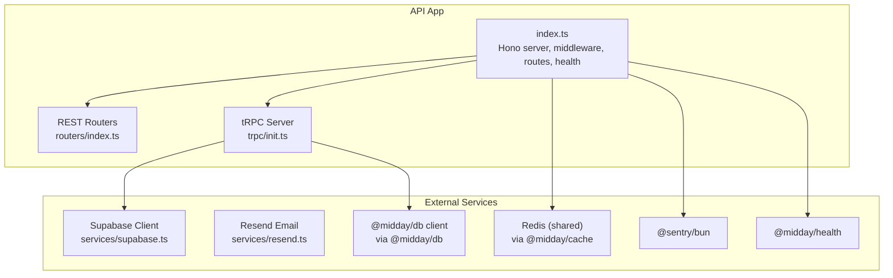
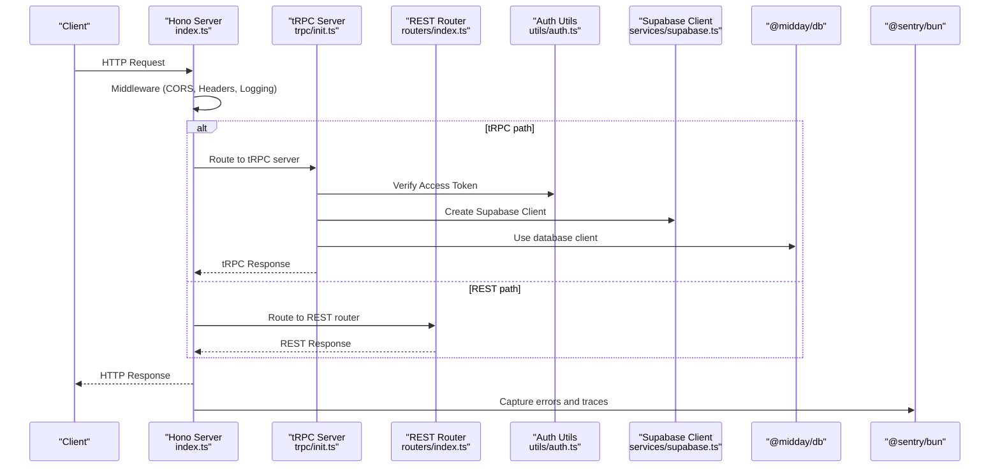
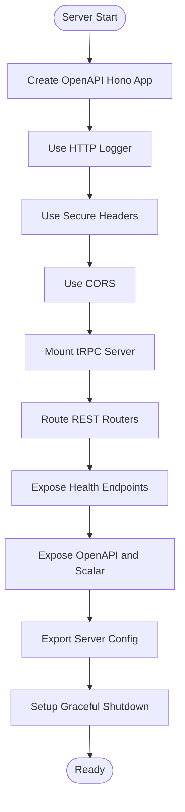
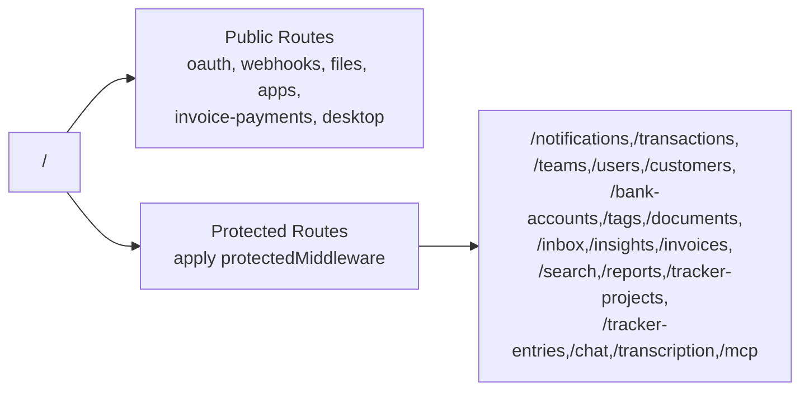
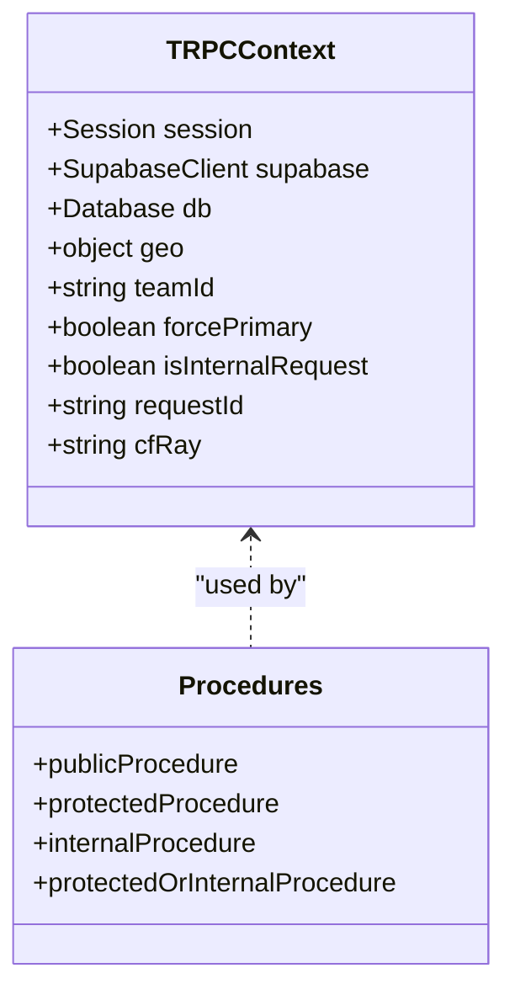
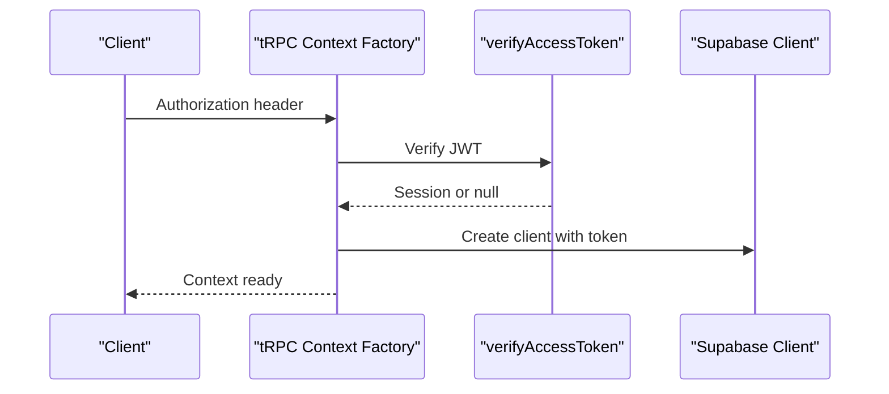
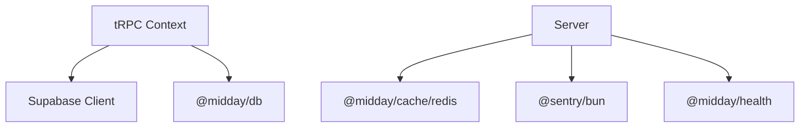
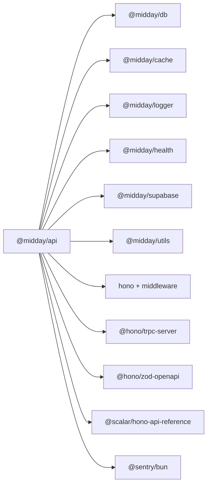

# API Overview

<cite>
**Referenced Files in This Document**
- [index.ts](file://midday/apps/api/src/index.ts)
- [package.json](file://midday/apps/api/package.json)
- [.env-template](file://midday/apps/api/.env-template)
- [routers/index.ts](file://midday/apps/api/src/rest/routers/index.ts)
- [trpc/init.ts](file://midday/apps/api/src/trpc/init.ts)
- [services/supabase.ts](file://midday/apps/api/src/services/supabase.ts)
- [services/resend.ts](file://midday/apps/api/src/services/resend.ts)
- [utils/auth.ts](file://midday/apps/api/src/utils/auth.ts)
- [utils/geo.ts](file://midday/apps/api/src/utils/geo.ts)
- [utils/request-trace.ts](file://midday/apps/api/src/utils/request-trace.ts)
</cite>

## Table of Contents
1. [Introduction](#introduction)
2. [Project Structure](#project-structure)
3. [Core Components](#core-components)
4. [Architecture Overview](#architecture-overview)
5. [Detailed Component Analysis](#detailed-component-analysis)
6. [Dependency Analysis](#dependency-analysis)
7. [Performance Considerations](#performance-considerations)
8. [Troubleshooting Guide](#troubleshooting-guide)
9. [Conclusion](#conclusion)
10. [Appendices](#appendices)

## Introduction
This document provides a comprehensive overview of the Faworra API Application built on the Hono framework. It explains the Hono-based architecture, the main entry point configuration, and the service initialization process. It also documents the overall API structure, routing organization, and core service dependencies. Additionally, it covers system requirements, environment variables, and basic configuration options, and outlines how the API integrates with other system components such as the dashboard, worker, and external services. Finally, it describes the API’s role within the Faworra ecosystem and its relationship to the monorepo structure.

## Project Structure
The API application is organized around a Hono server with two primary entry points:
- REST routes grouped under a single router composition
- tRPC procedures exposed via a dedicated tRPC server integration

Key areas:
- Entry point and middleware stack
- REST router composition and protection
- tRPC initialization and procedure types
- External service integrations (authentication, storage, analytics)
- Health checks and observability

**Diagram sources**
- [index.ts](file://midday/apps/api/src/index.ts#L26-L176)
- [routers/index.ts](file://midday/apps/api/src/rest/routers/index.ts#L28-L61)
- [trpc/init.ts](file://midday/apps/api/src/trpc/init.ts#L32-L80)
- [services/supabase.ts](file://midday/apps/api/src/services/supabase.ts#L4-L14)
- [services/resend.ts](file://midday/apps/api/src/services/resend.ts#L1-L4)

**Section sources**
- [index.ts](file://midday/apps/api/src/index.ts#L26-L176)
- [routers/index.ts](file://midday/apps/api/src/rest/routers/index.ts#L28-L61)
- [trpc/init.ts](file://midday/apps/api/src/trpc/init.ts#L32-L80)

## Core Components
- Hono server with OpenAPI integration and Scalar API reference
- CORS, secure headers, and structured logging middleware
- Health endpoints for readiness and dependency checks
- REST router composition with public and protected routes
- tRPC server with typed context, transformers, and procedure types
- Authentication verification against Supabase JWT
- Geo context propagation for regional-aware requests
- Request tracing via request ID and Cloudflare Ray ID
- External service clients (Supabase, Resend)
- Graceful shutdown with resource cleanup

**Section sources**
- [index.ts](file://midday/apps/api/src/index.ts#L26-L176)
- [index.ts](file://midday/apps/api/src/index.ts#L202-L280)
- [trpc/init.ts](file://midday/apps/api/src/trpc/init.ts#L20-L80)
- [utils/auth.ts](file://midday/apps/api/src/utils/auth.ts#L20-L43)
- [utils/geo.ts](file://midday/apps/api/src/utils/geo.ts#L3-L25)
- [utils/request-trace.ts](file://midday/apps/api/src/utils/request-trace.ts#L10-L16)
- [services/supabase.ts](file://midday/apps/api/src/services/supabase.ts#L4-L14)
- [services/resend.ts](file://midday/apps/api/src/services/resend.ts#L1-L4)

## Architecture Overview
The API is a Hono-based server that exposes:
- REST endpoints under a mounted router
- tRPC procedures integrated via @hono/trpc-server
- OpenAPI documentation and interactive API reference
- Health probes for readiness and dependency checks

**Diagram sources**
- [index.ts](file://midday/apps/api/src/index.ts#L26-L176)
- [trpc/init.ts](file://midday/apps/api/src/trpc/init.ts#L32-L80)
- [utils/auth.ts](file://midday/apps/api/src/utils/auth.ts#L20-L43)
- [services/supabase.ts](file://midday/apps/api/src/services/supabase.ts#L4-L14)

## Detailed Component Analysis

### Entry Point and Server Initialization
- Creates an OpenAPI-enabled Hono app
- Registers middleware for logging, secure headers, and CORS
- Integrates tRPC server with router, context factory, and error handling
- Exposes health endpoints and OpenAPI/Swagger reference
- Sets up graceful shutdown and global error handling
- Exports default server shape for hosting environments

**Diagram sources**
- [index.ts](file://midday/apps/api/src/index.ts#L26-L176)
- [index.ts](file://midday/apps/api/src/index.ts#L217-L280)

**Section sources**
- [index.ts](file://midday/apps/api/src/index.ts#L26-L176)
- [index.ts](file://midday/apps/api/src/index.ts#L217-L280)

### REST Routing Organization
- Public routes (mounted before middleware):
  - OAuth, webhooks, files, apps, invoice payments, desktop
- Protected routes (after middleware):
  - Notifications, transactions, teams, users, customers, bank accounts, tags, documents, inbox, insights, invoices, search, reports, tracker projects and entries, chat, transcription, MCP
- Middleware pipeline applies authentication and authorization to protected routes

**Diagram sources**
- [routers/index.ts](file://midday/apps/api/src/rest/routers/index.ts#L28-L61)

**Section sources**
- [routers/index.ts](file://midday/apps/api/src/rest/routers/index.ts#L28-L61)

### tRPC Context and Procedures
- Context creation:
  - Extracts Authorization token and internal key
  - Verifies access token against Supabase JWT secret
  - Builds Supabase client with optional bearer token
  - Captures geo context and request trace identifiers
  - Supports forcing primary database reads
- Procedure types:
  - publicProcedure: timing and primary-read-after-write middleware
  - protectedProcedure: team permission, primary-read-after-write, session enforcement
  - internalProcedure: internal-only key validation
  - protectedOrInternalProcedure: accepts either user session or internal key

**Diagram sources**
- [trpc/init.ts](file://midday/apps/api/src/trpc/init.ts#L20-L80)
- [trpc/init.ts](file://midday/apps/api/src/trpc/init.ts#L117-L187)

**Section sources**
- [trpc/init.ts](file://midday/apps/api/src/trpc/init.ts#L20-L80)
- [trpc/init.ts](file://midday/apps/api/src/trpc/init.ts#L117-L187)

### Authentication and Authorization
- Access token verification against Supabase JWT secret
- Session extraction with user metadata
- Internal key validation for service-to-service calls
- Safe comparison to prevent timing attacks

**Diagram sources**
- [utils/auth.ts](file://midday/apps/api/src/utils/auth.ts#L20-L43)
- [services/supabase.ts](file://midday/apps/api/src/services/supabase.ts#L4-L14)
- [trpc/init.ts](file://midday/apps/api/src/trpc/init.ts#L32-L80)

**Section sources**
- [utils/auth.ts](file://midday/apps/api/src/utils/auth.ts#L20-L43)
- [services/supabase.ts](file://midday/apps/api/src/services/supabase.ts#L4-L14)
- [trpc/init.ts](file://midday/apps/api/src/trpc/init.ts#L32-L80)

### External Service Integrations
- Supabase client creation with service key and optional bearer token
- Resend email client initialization
- Redis and database clients managed via shared packages

**Diagram sources**
- [services/supabase.ts](file://midday/apps/api/src/services/supabase.ts#L4-L14)
- [index.ts](file://midday/apps/api/src/index.ts#L6-L13)
- [index.ts](file://midday/apps/api/src/index.ts#L217-L280)

**Section sources**
- [services/supabase.ts](file://midday/apps/api/src/services/supabase.ts#L4-L14)
- [services/resend.ts](file://midday/apps/api/src/services/resend.ts#L1-L4)
- [index.ts](file://midday/apps/api/src/index.ts#L6-L13)

## Dependency Analysis
The API depends on a set of workspace packages and external libraries. The most relevant workspace dependencies include:
- @midday/db for database connectivity
- @midday/cache for Redis operations
- @midday/logger for structured logging
- @midday/health for readiness and dependency checks
- @midday/supabase for Supabase client utilities
- @midday/utils for shared utilities

External dependencies include:
- Hono and related middleware (CORS, secure headers, zod-openapi)
- @hono/trpc-server for tRPC integration
- @scalar/hono-api-reference for API docs
- @sentry/bun for error reporting
- Stripe, Resend, Supabase, and others for integrations

**Diagram sources**
- [package.json](file://midday/apps/api/package.json#L15-L72)

**Section sources**
- [package.json](file://midday/apps/api/package.json#L15-L72)

## Performance Considerations
- Optional tRPC performance logging with timings for context building, JWT verification, Supabase client creation, and procedure execution
- Optional periodic database pool statistics logging controlled by an environment variable
- Middleware timing and request tracing for observability

Recommendations:
- Enable DEBUG_PERF only in development or for targeted diagnostics
- Tune DB_POOL_STATS_INTERVAL_MS to balance insight and overhead
- Monitor pool stats and adjust connection pooling based on workload

**Section sources**
- [index.ts](file://midday/apps/api/src/index.ts#L67-L86)
- [index.ts](file://midday/apps/api/src/index.ts#L178-L199)
- [trpc/init.ts](file://midday/apps/api/src/trpc/init.ts#L17-L18)

## Troubleshooting Guide
Common operational issues and diagnostics:
- Health readiness failures: Use the readiness endpoint to inspect dependency statuses and adjust configuration accordingly
- CORS errors: Verify ALLOWED_API_ORIGINS and request headers
- Authentication failures: Confirm SUPABASE_JWT_SECRET and access token validity
- Database connectivity: Review pool stats logs and connection string configuration
- Internal service calls: Ensure INTERNAL_API_KEY matches the internal key header
- Sentry reporting: Confirm Sentry DSN and tags for error attribution

Operational hooks:
- Graceful shutdown closes database connections, Redis client, and flushes Sentry events
- Global error handler captures unhandled exceptions and rejections and sends them to Sentry

**Section sources**
- [index.ts](file://midday/apps/api/src/index.ts#L120-L130)
- [index.ts](file://midday/apps/api/src/index.ts#L202-L280)
- [utils/auth.ts](file://midday/apps/api/src/utils/auth.ts#L20-L43)
- [services/supabase.ts](file://midday/apps/api/src/services/supabase.ts#L4-L14)

## Conclusion
The Faworra API Application leverages Hono to deliver a modern, modular backend with strong integration points for authentication, database operations, and external services. Its architecture cleanly separates REST and tRPC concerns, enforces robust middleware for security and observability, and provides comprehensive health and diagnostic endpoints. Within the Faworra monorepo, the API acts as a central service consumed by the dashboard and worker, while integrating with Supabase, Stripe, Resend, and other third-party systems.

## Appendices

### System Requirements
- Node.js runtime via Bun
- Environment variables configured per .env-template
- Access to Supabase, database, Redis, and optional external services

**Section sources**
- [.env-template](file://midday/apps/api/.env-template#L1-L149)

### Environment Variables
Key variables include:
- Supabase: SUPABASE_URL, SUPABASE_SERVICE_KEY, SUPABASE_JWT_SECRET
- Database: DATABASE_* (primary and regional replicas)
- Storage: R2_* for cloud storage
- Authentication: ALLOWED_API_ORIGINS, INTERNAL_API_KEY
- Integrations: PLAID_*, GOCARDLESS_*, ENABLEBANKING_*, TELLER_*, OPENAI_API_KEY, GOOGLE_GENERATIVE_AI_API_KEY, STRIPE_*, RESEND_API_KEY, POLAR_*, SLACK_*, OUTLOOK_*, WHATSAPP_*, MISTRAL_*, XERO_*, QUICKBOOKS_*, FORTNOX_*
- Infrastructure: REDIS_URL, REDIS_QUEUE_URL, LOG_LEVEL, LOG_PRETTY
- URLs: MIDDAY_API_URL, MIDDAY_DASHBOARD_URL

**Section sources**
- [.env-template](file://midday/apps/api/.env-template#L1-L149)

### Basic Configuration Options
- Port and host binding are exported for hosting environments
- CORS allows configurable origins and headers
- OpenAPI and Scalar endpoints provide interactive documentation
- Health endpoints expose readiness and dependency status

**Section sources**
- [index.ts](file://midday/apps/api/src/index.ts#L282-L287)
- [index.ts](file://midday/apps/api/src/index.ts#L35-L65)
- [index.ts](file://midday/apps/api/src/index.ts#L132-L174)
- [index.ts](file://midday/apps/api/src/index.ts#L118-L130)