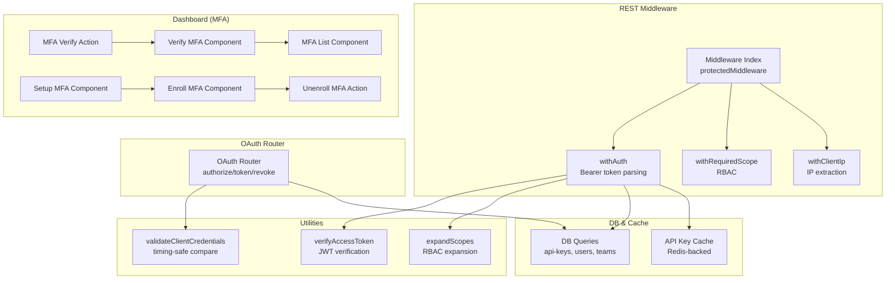
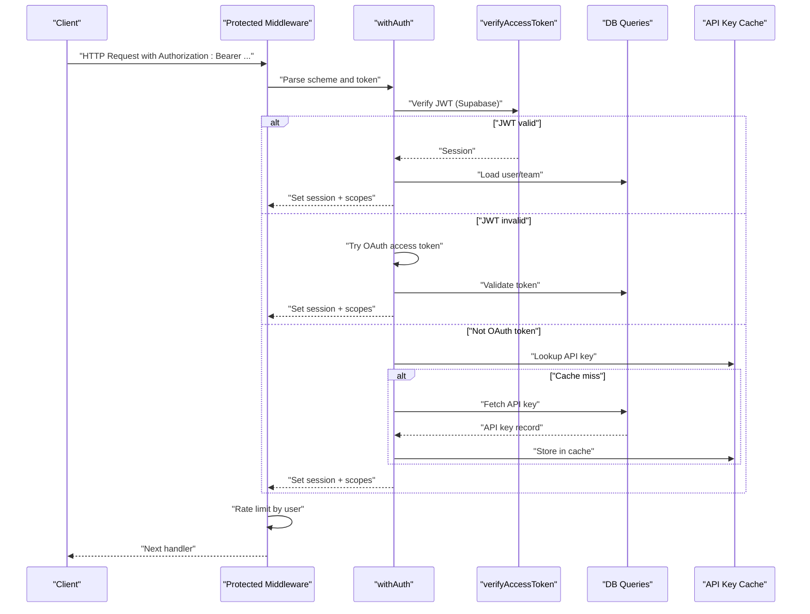
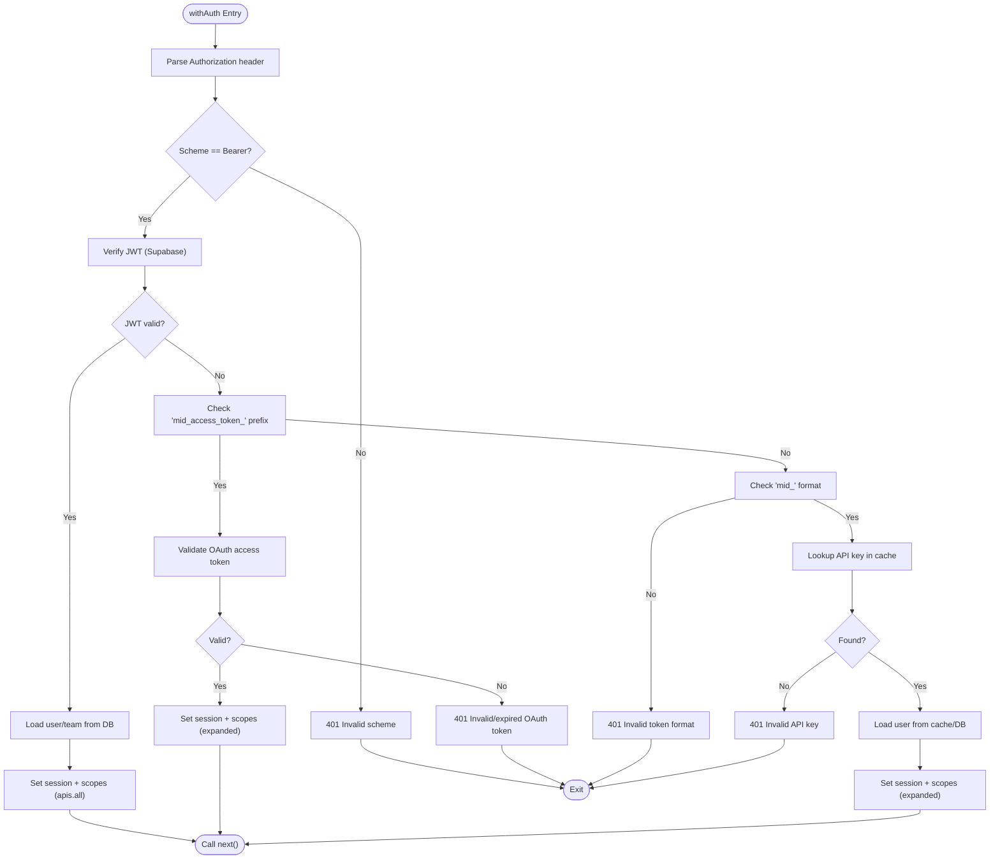
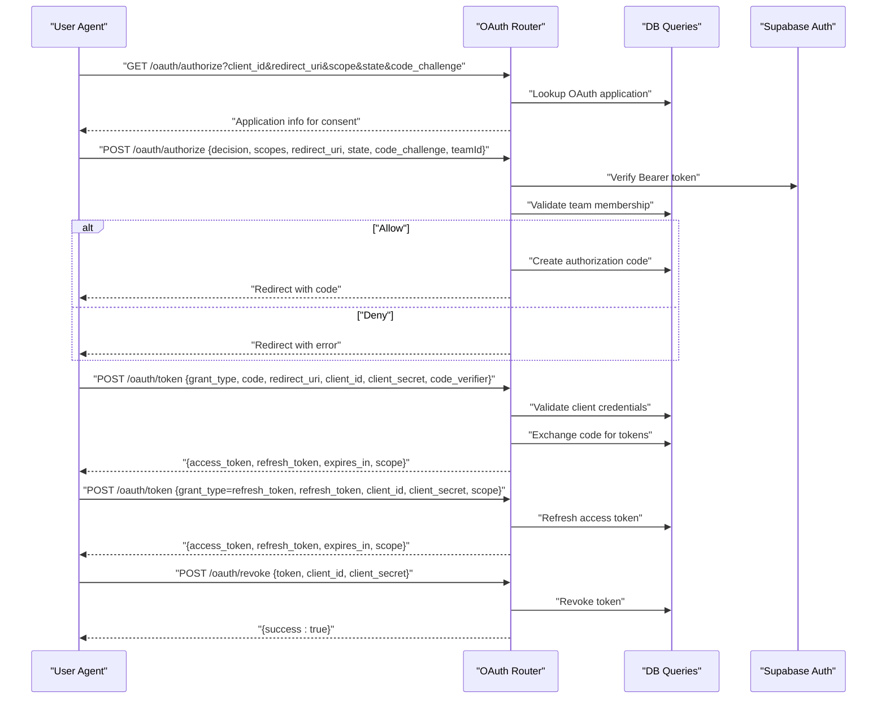
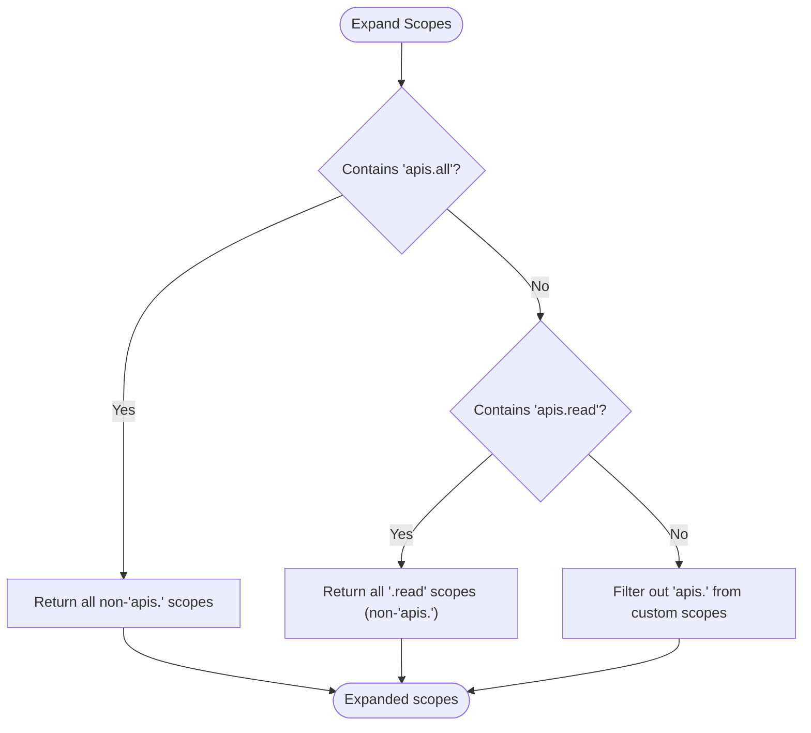
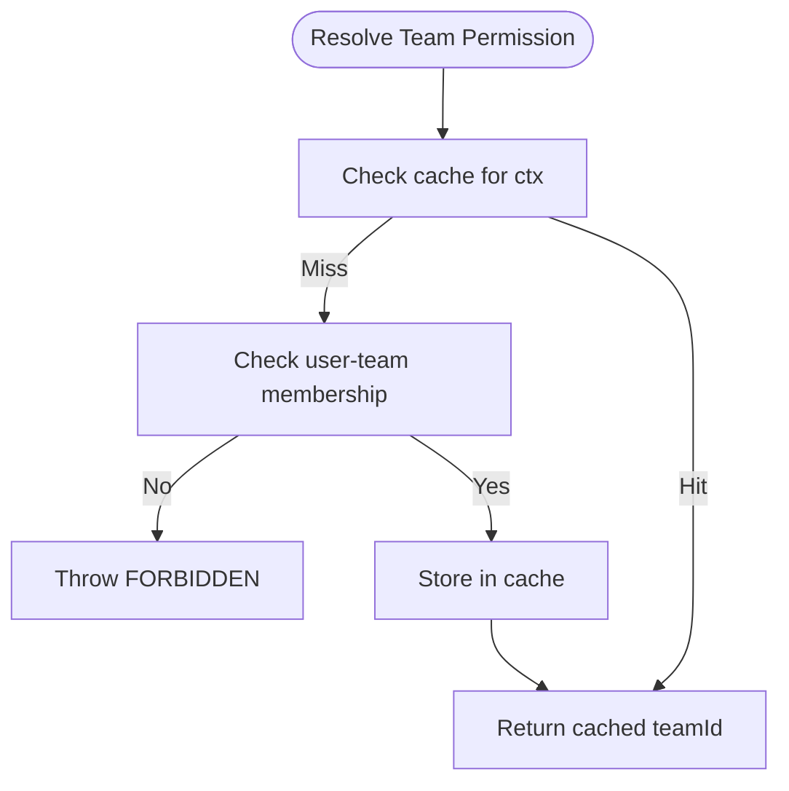
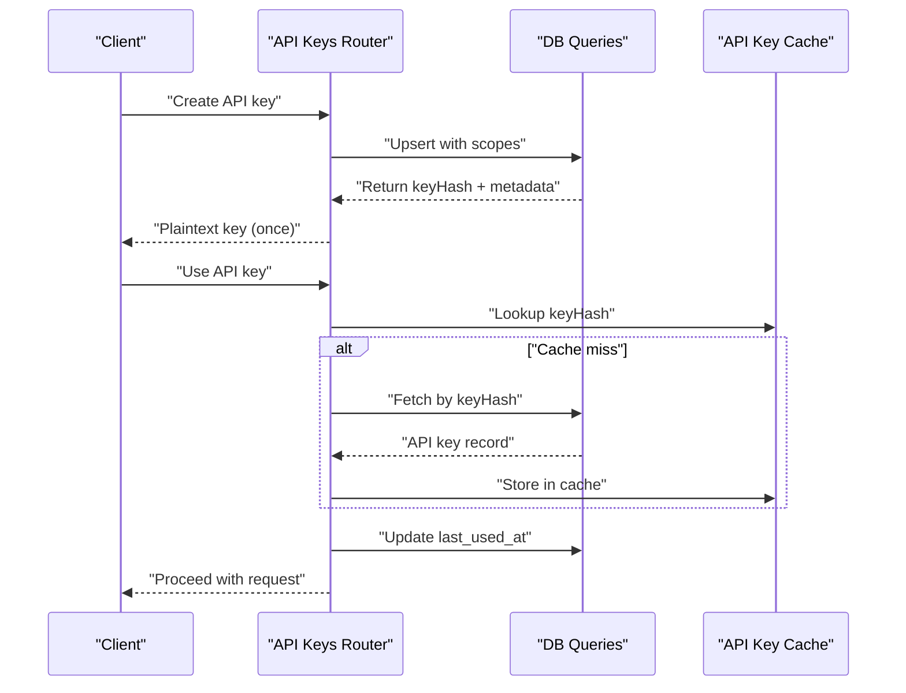
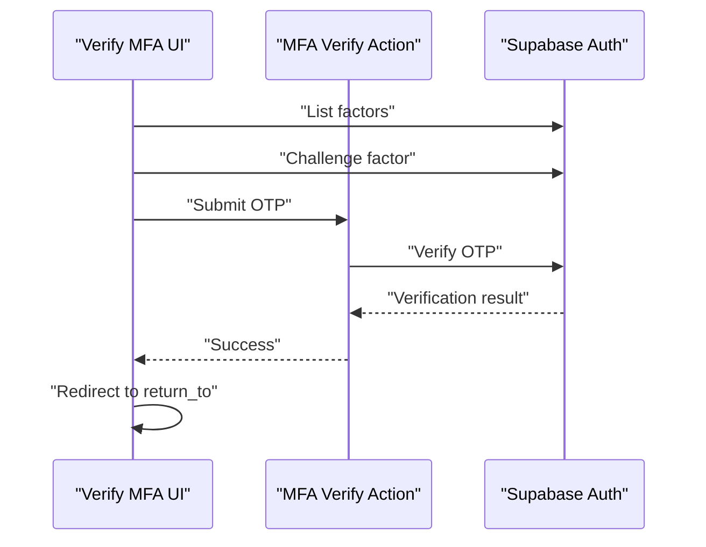
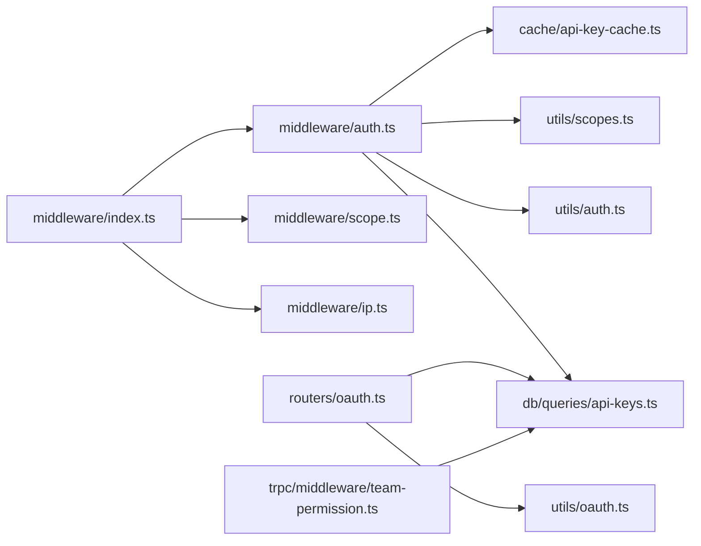

# Authentication & Authorization

<cite>
**Referenced Files in This Document**
- [auth.ts](file://apps/api/src/rest/middleware/auth.ts)
- [index.ts](file://apps/api/src/rest/middleware/index.ts)
- [scope.ts](file://apps/api/src/rest/middleware/scope.ts)
- [ip.ts](file://apps/api/src/rest/middleware/ip.ts)
- [oauth.ts](file://apps/api/src/rest/routers/oauth.ts)
- [auth-utils.ts](file://apps/api/src/utils/auth.ts)
- [oauth-utils.ts](file://apps/api/src/utils/oauth.ts)
- [scopes.ts](file://apps/api/src/utils/scopes.ts)
- [api-keys.ts](file://packages/db/src/queries/api-keys.ts)
- [api-key-cache.ts](file://packages/cache/src/api-key-cache.ts)
- [team-permission.ts](file://apps/api/src/trpc/middleware/team-permission.ts)
- [api-keys-router.ts](file://apps/api/src/trpc/routers/api-keys.ts)
- [mfa-verify-action.ts](file://apps/dashboard/src/actions/mfa-verify-action.ts)
- [verify-mfa.tsx](file://apps/dashboard/src/components/verify-mfa.tsx)
- [mfa-list.tsx](file://apps/dashboard/src/components/mfa-list.tsx)
- [setup-mfa.tsx](file://apps/dashboard/src/components/setup-mfa.tsx)
- [enroll-mfa.tsx](file://apps/dashboard/src/components/enroll-mfa.tsx)
- [unenroll-mfa-action.ts](file://apps/dashboard/src/actions/unenroll-mfa-action.ts)
</cite>

## Table of Contents
1. [Introduction](#introduction)
2. [Project Structure](#project-structure)
3. [Core Components](#core-components)
4. [Architecture Overview](#architecture-overview)
5. [Detailed Component Analysis](#detailed-component-analysis)
6. [Dependency Analysis](#dependency-analysis)
7. [Performance Considerations](#performance-considerations)
8. [Troubleshooting Guide](#troubleshooting-guide)
9. [Conclusion](#conclusion)

## Introduction
This document explains the authentication and authorization model for the API, covering:
- Unified bearer token handling for Supabase JWTs, OAuth access tokens, and API keys
- Permission scoping and RBAC via expandable scope sets
- Team-based resource access checks
- OAuth 2.0/PKCE integration, token exchange, refresh, and revocation
- API key lifecycle and caching
- MFA enforcement via Supabase Auth
- Request validation, rate limiting, and security headers
- Logout and token refresh strategies

## Project Structure
Authentication and authorization spans middleware, routers, utilities, and database queries:
- REST middleware enforces auth and scopes
- OAuth router implements authorization, token exchange, refresh, and revoke
- Utilities provide JWT verification, client secret validation, and scope expansion
- Database queries and caches manage API keys and user/team membership
- Dashboard components integrate MFA flows

**Diagram sources**
- [auth.ts](file://apps/api/src/rest/middleware/auth.ts#L16-L151)
- [index.ts](file://apps/api/src/rest/middleware/index.ts#L17-L42)
- [scope.ts](file://apps/api/src/rest/middleware/scope.ts#L4-L40)
- [ip.ts](file://apps/api/src/rest/middleware/ip.ts#L10-L15)
- [oauth.ts](file://apps/api/src/rest/routers/oauth.ts#L37-L629)
- [auth-utils.ts](file://apps/api/src/utils/auth.ts#L20-L43)
- [oauth-utils.ts](file://apps/api/src/utils/oauth.ts#L10-L23)
- [scopes.ts](file://apps/api/src/utils/scopes.ts#L80-L95)
- [api-keys.ts](file://packages/db/src/queries/api-keys.ts#L16-L130)
- [api-key-cache.ts](file://packages/cache/src/api-key-cache.ts#L7-L11)
- [mfa-verify-action.ts](file://apps/dashboard/src/actions/mfa-verify-action.ts#L8-L38)
- [verify-mfa.tsx](file://apps/dashboard/src/components/verify-mfa.tsx#L15-L71)
- [mfa-list.tsx](file://apps/dashboard/src/components/mfa-list.tsx#L15-L43)
- [setup-mfa.tsx](file://apps/dashboard/src/components/setup-mfa.ts#L13-L44)
- [enroll-mfa.tsx](file://apps/dashboard/src/components/enroll-mfa.tsx#L16-L39)
- [unenroll-mfa-action.ts](file://apps/dashboard/src/actions/unenroll-mfa-action.ts#L7-L28)

**Section sources**
- [auth.ts](file://apps/api/src/rest/middleware/auth.ts#L16-L151)
- [index.ts](file://apps/api/src/rest/middleware/index.ts#L17-L42)
- [oauth.ts](file://apps/api/src/rest/routers/oauth.ts#L37-L629)

## Core Components
- Unified Bearer Token Handler: Accepts Supabase JWTs, OAuth access tokens, and API keys; populates session and scopes
- OAuth 2.0/PKCE: Authorization endpoint, consent decision, token exchange, refresh, and revoke
- RBAC Scopes: Expandable scope sets with presets and resource-scoped permissions
- Team-Based Access Control: Validates team membership and caches decisions
- API Keys: Secure creation, hashing, caching, and usage tracking
- MFA: Supabase Auth MFA enrollment, verification, and removal

**Section sources**
- [auth.ts](file://apps/api/src/rest/middleware/auth.ts#L16-L151)
- [oauth.ts](file://apps/api/src/rest/routers/oauth.ts#L37-L629)
- [scopes.ts](file://apps/api/src/utils/scopes.ts#L1-L96)
- [team-permission.ts](file://apps/api/src/trpc/middleware/team-permission.ts#L125-L164)
- [api-keys.ts](file://packages/db/src/queries/api-keys.ts#L16-L130)
- [api-key-cache.ts](file://packages/cache/src/api-key-cache.ts#L7-L11)
- [mfa-verify-action.ts](file://apps/dashboard/src/actions/mfa-verify-action.ts#L8-L38)

## Architecture Overview
The system routes all protected requests through a unified middleware chain that:
- Extracts client IP
- Attaches database connection
- Authenticates via Bearer token
- Applies rate limiting keyed by user ID
- Ensures primary-read-after-write consistency
- Enforces required scopes
- Validates team membership

**Diagram sources**
- [index.ts](file://apps/api/src/rest/middleware/index.ts#L22-L36)
- [auth.ts](file://apps/api/src/rest/middleware/auth.ts#L16-L151)
- [auth-utils.ts](file://apps/api/src/utils/auth.ts#L20-L43)
- [api-key-cache.ts](file://packages/cache/src/api-key-cache.ts#L7-L11)
- [api-keys.ts](file://packages/db/src/queries/api-keys.ts#L16-L32)

## Detailed Component Analysis

### Unified Authentication Middleware
- Parses Authorization header and validates scheme
- Tries JWT verification first; falls back to OAuth access token validation; otherwise treats as API key
- Populates session with teamId and user metadata
- Expands scopes for RBAC

**Diagram sources**
- [auth.ts](file://apps/api/src/rest/middleware/auth.ts#L16-L151)
- [auth-utils.ts](file://apps/api/src/utils/auth.ts#L20-L43)
- [api-key-cache.ts](file://packages/cache/src/api-key-cache.ts#L7-L11)
- [api-keys.ts](file://packages/db/src/queries/api-keys.ts#L16-L32)

**Section sources**
- [auth.ts](file://apps/api/src/rest/middleware/auth.ts#L16-L151)

### OAuth 2.0/PKCE Integration
- Authorization endpoint validates client_id, PKCE for public clients, redirect_uri, and requested scopes
- Consent decision endpoint verifies user session, team membership, and builds redirect URL
- Token exchange supports authorization_code and refresh_token grants with PKCE code_verifier
- Revocation endpoint supports both public and confidential clients

**Diagram sources**
- [oauth.ts](file://apps/api/src/rest/routers/oauth.ts#L53-L629)
- [oauth-utils.ts](file://apps/api/src/utils/oauth.ts#L10-L23)
- [api-keys.ts](file://packages/db/src/queries/api-keys.ts#L16-L32)

**Section sources**
- [oauth.ts](file://apps/api/src/rest/routers/oauth.ts#L37-L629)
- [oauth-utils.ts](file://apps/api/src/utils/oauth.ts#L10-L23)

### Permission Scoping and RBAC
- Scope expansion converts presets (apis.all, apis.read) and aggregates resource scopes
- Required scope middleware enforces at least one matching scope
- Scope presets and resource mapping are defined centrally

**Diagram sources**
- [scopes.ts](file://apps/api/src/utils/scopes.ts#L80-L95)
- [scope.ts](file://apps/api/src/rest/middleware/scope.ts#L4-L40)

**Section sources**
- [scopes.ts](file://apps/api/src/utils/scopes.ts#L1-L96)
- [scope.ts](file://apps/api/src/rest/middleware/scope.ts#L4-L40)

### Team-Based Resource Permissions
- Team permission middleware resolves teamId and caches access decisions
- Logs performance and cache hits for debugging
- Throws FORBIDDEN when user lacks team access

**Diagram sources**
- [team-permission.ts](file://apps/api/src/trpc/middleware/team-permission.ts#L125-L164)

**Section sources**
- [team-permission.ts](file://apps/api/src/trpc/middleware/team-permission.ts#L87-L164)

### API Key Management
- Creation returns plaintext key once; subsequent retrieval returns masked key
- Storage hashes the key; DB stores keyHash and scopes
- Cache stores API key records for 30 minutes
- Last-used timestamps are updated per request

**Diagram sources**
- [api-keys-router.ts](file://apps/api/src/trpc/routers/api-keys.ts#L37-L75)
- [api-keys.ts](file://packages/db/src/queries/api-keys.ts#L16-L130)
- [api-key-cache.ts](file://packages/cache/src/api-key-cache.ts#L7-L11)

**Section sources**
- [api-keys-router.ts](file://apps/api/src/trpc/routers/api-keys.ts#L37-L75)
- [api-keys.ts](file://packages/db/src/queries/api-keys.ts#L16-L130)
- [api-key-cache.ts](file://packages/cache/src/api-key-cache.ts#L7-L11)

### MFA Enforcement
- Dashboard components orchestrate MFA enrollment, verification, and removal
- Actions call Supabase Auth MFA APIs and trigger revalidation
- UI components handle OTP input, challenges, and redirects

**Diagram sources**
- [mfa-verify-action.ts](file://apps/dashboard/src/actions/mfa-verify-action.ts#L8-L38)
- [verify-mfa.tsx](file://apps/dashboard/src/components/verify-mfa.tsx#L15-L71)
- [mfa-list.tsx](file://apps/dashboard/src/components/mfa-list.tsx#L15-L43)
- [setup-mfa.tsx](file://apps/dashboard/src/components/setup-mfa.ts#L13-L44)
- [enroll-mfa.tsx](file://apps/dashboard/src/components/enroll-mfa.tsx#L16-L39)
- [unenroll-mfa-action.ts](file://apps/dashboard/src/actions/unenroll-mfa-action.ts#L7-L28)

**Section sources**
- [mfa-verify-action.ts](file://apps/dashboard/src/actions/mfa-verify-action.ts#L8-L38)
- [verify-mfa.tsx](file://apps/dashboard/src/components/verify-mfa.tsx#L15-L71)
- [mfa-list.tsx](file://apps/dashboard/src/components/mfa-list.tsx#L15-L43)
- [setup-mfa.tsx](file://apps/dashboard/src/components/setup-mfa.tsx#L13-L44)
- [enroll-mfa.tsx](file://apps/dashboard/src/components/enroll-mfa.tsx#L16-L39)
- [unenroll-mfa-action.ts](file://apps/dashboard/src/actions/unenroll-mfa-action.ts#L7-L28)

## Dependency Analysis
- Middleware composition ensures consistent auth, IP extraction, rate limiting, and DB access
- OAuth router depends on client credential validation and DB queries for codes/tokens
- Auth middleware depends on JWT verification, scope expansion, and DB/cache for API keys
- Team permission middleware depends on DB and cache for access decisions

**Diagram sources**
- [index.ts](file://apps/api/src/rest/middleware/index.ts#L17-L42)
- [auth.ts](file://apps/api/src/rest/middleware/auth.ts#L1-L152)
- [scope.ts](file://apps/api/src/rest/middleware/scope.ts#L1-L41)
- [ip.ts](file://apps/api/src/rest/middleware/ip.ts#L1-L16)
- [auth-utils.ts](file://apps/api/src/utils/auth.ts#L1-L44)
- [oauth-utils.ts](file://apps/api/src/utils/oauth.ts#L1-L24)
- [scopes.ts](file://apps/api/src/utils/scopes.ts#L1-L96)
- [api-keys.ts](file://packages/db/src/queries/api-keys.ts#L1-L130)
- [api-key-cache.ts](file://packages/cache/src/api-key-cache.ts#L1-L11)
- [oauth.ts](file://apps/api/src/rest/routers/oauth.ts#L1-L630)
- [team-permission.ts](file://apps/api/src/trpc/middleware/team-permission.ts#L125-L164)

**Section sources**
- [index.ts](file://apps/api/src/rest/middleware/index.ts#L17-L42)
- [auth.ts](file://apps/api/src/rest/middleware/auth.ts#L1-L152)
- [oauth.ts](file://apps/api/src/rest/routers/oauth.ts#L1-L630)

## Performance Considerations
- API key cache TTL is 30 minutes; reduces DB load for repeated key validation
- Rate limiter uses user ID as key to throttle per-user requests
- Team permission resolution caches decisions to avoid repeated DB checks
- JWT verification is fast; OAuth token validation and DB lookups incur latency

[No sources needed since this section provides general guidance]

## Troubleshooting Guide
Common issues and resolutions:
- 401 Unauthorized
  - Missing or invalid Authorization header
  - Invalid token format or expired JWT/OAuth token
  - Invalid API key or missing required "mid_" prefix
- 403 Forbidden
  - Insufficient scopes for the endpoint
  - User not a member of the selected team
- OAuth Errors
  - Authorization code expired or already used
  - Redirect URI mismatch
  - Missing PKCE for public clients
- MFA Issues
  - Incorrect OTP or expired challenge
  - Missing verified factor

**Section sources**
- [auth.ts](file://apps/api/src/rest/middleware/auth.ts#L19-L31)
- [scope.ts](file://apps/api/src/rest/middleware/scope.ts#L10-L19)
- [oauth.ts](file://apps/api/src/rest/routers/oauth.ts#L448-L479)
- [verify-mfa.tsx](file://apps/dashboard/src/components/verify-mfa.tsx#L15-L71)

## Conclusion
The system provides a robust, layered authentication and authorization model:
- A single unified bearer token path supports JWTs, OAuth access tokens, and API keys
- RBAC scopes and team-based access control enforce least-privilege
- OAuth 2.0/PKCE ensures secure third-party integrations
- API keys are securely managed with hashing and caching
- MFA is integrated via Supabase Auth for strong identity verification
- Middleware applies consistent rate limiting, IP tracking, and request validation