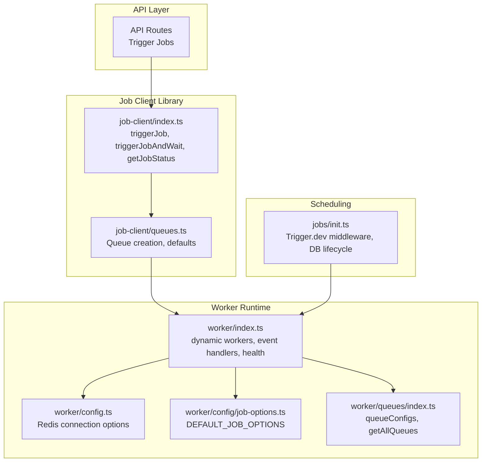
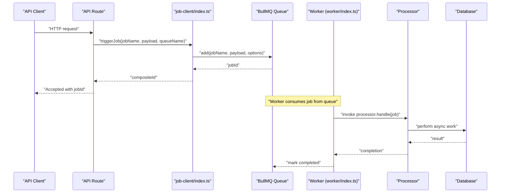
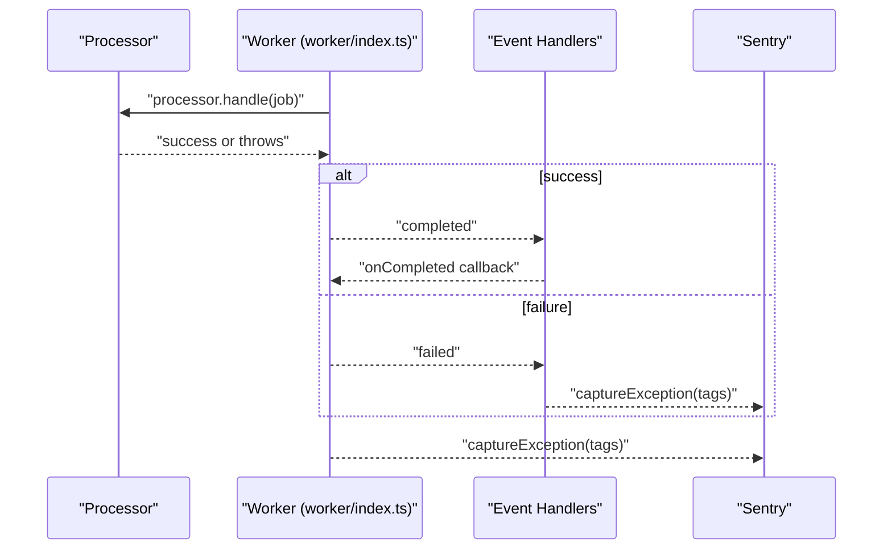
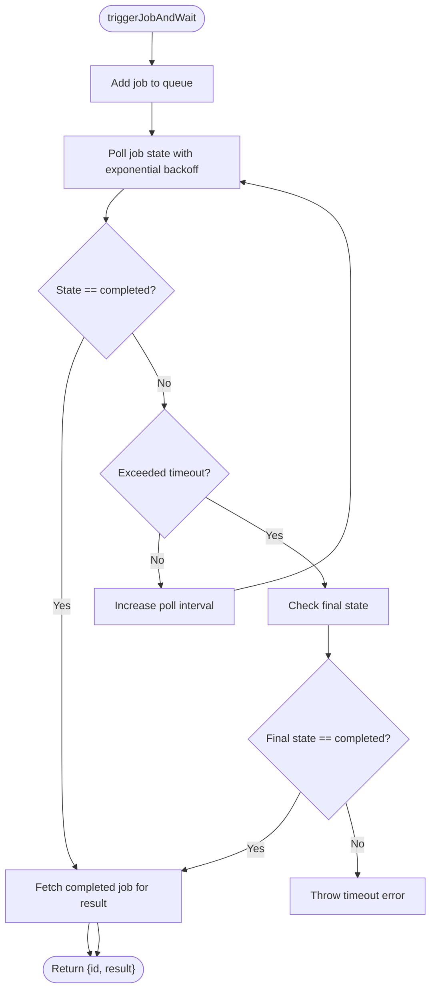
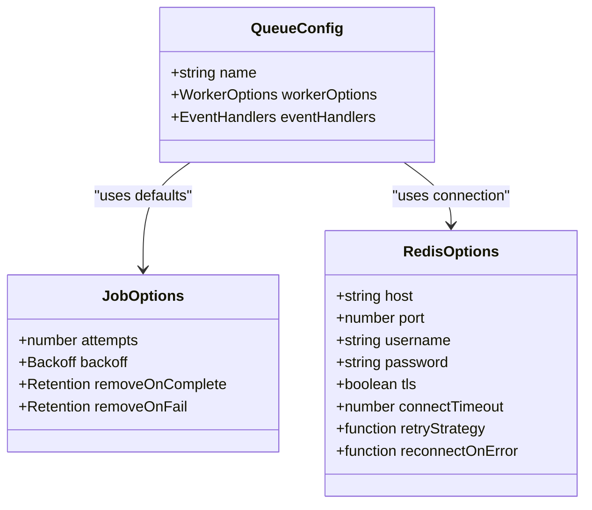
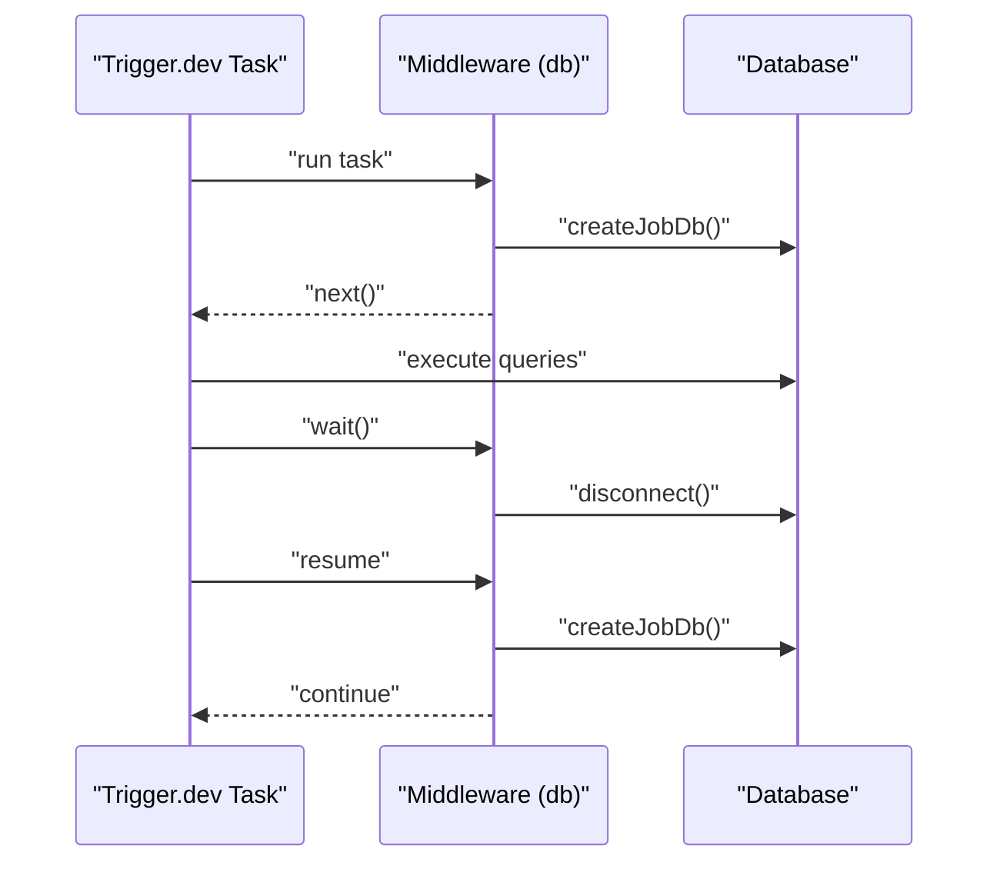
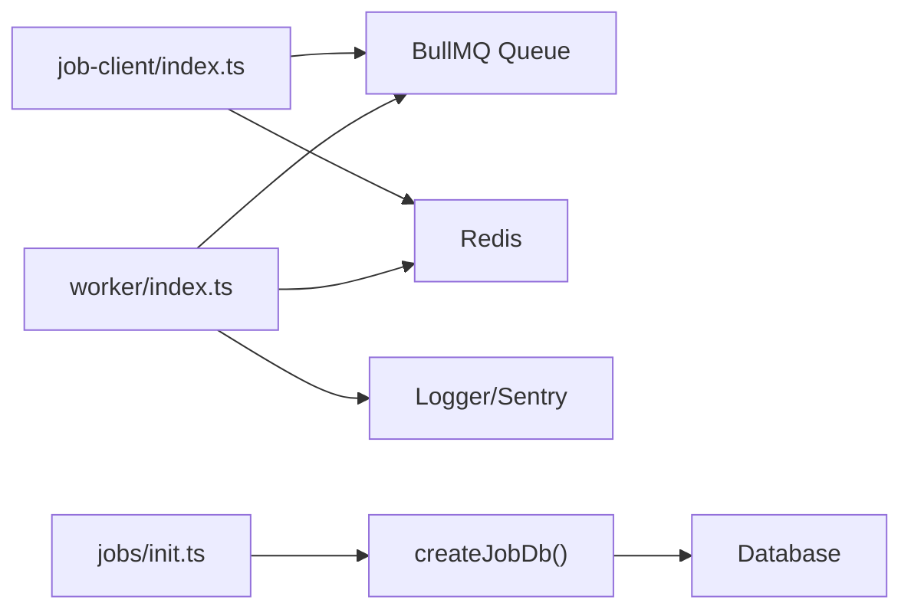

# Background Jobs Integration

<cite>
**Referenced Files in This Document**
- [worker/index.ts](file://apps/worker/src/index.ts)
- [worker/config.ts](file://apps/worker/src/config.ts)
- [worker/config/job-options.ts](file://apps/worker/src/config/job-options.ts)
- [worker/queues/index.ts](file://apps/worker/src/queues/index.ts)
- [job-client/index.ts](file://packages/job-client/src/index.ts)
- [job-client/queues.ts](file://packages/job-client/src/queues.ts)
- [jobs/init.ts](file://packages/jobs/src/init.ts)
</cite>

## Table of Contents
1. [Introduction](#introduction)
2. [Project Structure](#project-structure)
3. [Core Components](#core-components)
4. [Architecture Overview](#architecture-overview)
5. [Detailed Component Analysis](#detailed-component-analysis)
6. [Dependency Analysis](#dependency-analysis)
7. [Performance Considerations](#performance-considerations)
8. [Troubleshooting Guide](#troubleshooting-guide)
9. [Conclusion](#conclusion)

## Introduction
This document explains the background job integration and asynchronous processing within the API, focusing on how jobs are queued, processed, monitored, and recovered. It covers the integration with BullMQ, job scheduling, retry strategies, worker coordination, and operational observability. It also documents how API requests relate to background processing, including request tracing and correlation via job IDs, and provides guidance on job prioritization, rate limiting, and performance optimization for async operations.

## Project Structure
The background job system spans three primary areas:
- Worker runtime: dynamic worker creation, Redis connectivity, health checks, and Workbench dashboard
- Job client library: enqueueing jobs, waiting for completion, and querying job status
- Scheduling and database initialization: Trigger.dev SDK integration for scheduled jobs and database connection lifecycle

**Diagram sources**
- [worker/index.ts](file://apps/worker/src/index.ts#L25-L118)
- [worker/config.ts](file://apps/worker/src/config.ts#L46-L88)
- [worker/config/job-options.ts](file://apps/worker/src/config/job-options.ts#L7-L13)
- [worker/queues/index.ts](file://apps/worker/src/queues/index.ts#L30-L64)
- [job-client/index.ts](file://packages/job-client/src/index.ts#L31-L76)
- [job-client/queues.ts](file://packages/job-client/src/queues.ts#L54-L89)
- [jobs/init.ts](file://packages/jobs/src/init.ts#L26-L47)

**Section sources**
- [worker/index.ts](file://apps/worker/src/index.ts#L1-L312)
- [worker/config.ts](file://apps/worker/src/config.ts#L1-L98)
- [worker/config/job-options.ts](file://apps/worker/src/config/job-options.ts#L1-L14)
- [worker/queues/index.ts](file://apps/worker/src/queues/index.ts#L1-L65)
- [job-client/index.ts](file://packages/job-client/src/index.ts#L1-L324)
- [job-client/queues.ts](file://packages/job-client/src/queues.ts#L1-L102)
- [jobs/init.ts](file://packages/jobs/src/init.ts#L1-L48)

## Core Components
- Worker runtime: creates BullMQ workers per queue, registers centralized event handlers, exposes health/readiness endpoints, and mounts a dashboard for monitoring.
- Job client library: enqueues jobs, optionally waits for completion with polling, and retrieves job status with authorization checks.
- Queue configuration: shared default job options and Redis connection settings for both clients and workers.
- Scheduling integration: Trigger.dev SDK middleware initializes a database connection per job run and manages connection lifecycle across waits/resumes.

Key responsibilities:
- Enqueueing: API routes call the job client to add jobs to named queues.
- Processing: Workers consume jobs from queues and delegate to registered processors.
- Monitoring: Composite job IDs encode queue and job identifiers; status queries return normalized status, progress, and error details.
- Recovery: Built-in retries with exponential backoff; centralized failure handling with Sentry tagging.

**Section sources**
- [worker/index.ts](file://apps/worker/src/index.ts#L25-L118)
- [job-client/index.ts](file://packages/job-client/src/index.ts#L31-L76)
- [job-client/index.ts](file://packages/job-client/src/index.ts#L219-L323)
- [job-client/queues.ts](file://packages/job-client/src/queues.ts#L54-L89)
- [worker/config/job-options.ts](file://apps/worker/src/config/job-options.ts#L7-L13)
- [jobs/init.ts](file://packages/jobs/src/init.ts#L26-L47)

## Architecture Overview
The system uses BullMQ with Redis as the transport. The worker runtime dynamically creates workers for each queue, attaches error and completion handlers, and exposes a dashboard. The job client library handles enqueueing, optional waiting, and status retrieval. Scheduling integrates with Trigger.dev to run periodic tasks and manage database connections.

**Diagram sources**
- [job-client/index.ts](file://packages/job-client/src/index.ts#L31-L76)
- [worker/index.ts](file://apps/worker/src/index.ts#L25-L36)

## Detailed Component Analysis

### Worker Runtime and Event Handling
The worker runtime:
- Creates a Worker per queue configuration, attaching a processor lookup and centralized error/failed/completed handlers.
- Logs and tags errors for Sentry, ensuring visibility into worker and job failures.
- Exposes health and readiness endpoints and mounts a dashboard for queue inspection.
- Implements graceful shutdown with timeouts and resource cleanup.

**Diagram sources**
- [worker/index.ts](file://apps/worker/src/index.ts#L25-L118)

**Section sources**
- [worker/index.ts](file://apps/worker/src/index.ts#L25-L118)
- [worker/index.ts](file://apps/worker/src/index.ts#L167-L191)
- [worker/index.ts](file://apps/worker/src/index.ts#L232-L281)

### Job Client Library: Enqueueing, Waiting, and Status
The job client provides:
- triggerJob: enqueues a job with optional delay and custom jobId, logs enqueue duration, and returns a composite job ID.
- triggerJobAndWait: enqueues a job and polls for completion with exponential backoff, returning the result upon success.
- getJobStatus: decodes composite IDs, validates team authorization when provided, and returns normalized status, progress, and error details.

**Diagram sources**
- [job-client/index.ts](file://packages/job-client/src/index.ts#L88-L208)

**Section sources**
- [job-client/index.ts](file://packages/job-client/src/index.ts#L31-L76)
- [job-client/index.ts](file://packages/job-client/src/index.ts#L88-L208)
- [job-client/index.ts](file://packages/job-client/src/index.ts#L219-L323)

### Queue Configuration and Defaults
Shared queue configuration:
- Redis connection options are parsed from REDIS_QUEUE_URL with production-specific tuning.
- Default job options include attempts and exponential backoff.
- Queue instances are cached and created on demand with standardized default job options and retention policies.

**Diagram sources**
- [worker/config.ts](file://apps/worker/src/config.ts#L46-L88)
- [worker/config/job-options.ts](file://apps/worker/src/config/job-options.ts#L7-L13)
- [job-client/queues.ts](file://packages/job-client/src/queues.ts#L54-L89)

**Section sources**
- [worker/config.ts](file://apps/worker/src/config.ts#L13-L88)
- [worker/config/job-options.ts](file://apps/worker/src/config/job-options.ts#L7-L13)
- [job-client/queues.ts](file://packages/job-client/src/queues.ts#L54-L89)

### Scheduling Integration with Trigger.dev
Trigger.dev middleware:
- Initializes a database connection per job run and stores it in locals.
- Closes the connection on wait and recreates it on resume to optimize resource usage across asynchronous waits.

**Diagram sources**
- [jobs/init.ts](file://packages/jobs/src/init.ts#L26-L47)

**Section sources**
- [jobs/init.ts](file://packages/jobs/src/init.ts#L26-L47)

## Dependency Analysis
- Worker runtime depends on BullMQ, Redis connectivity, and local logging/Sentry for observability.
- Job client depends on BullMQ and Redis, with shared default job options and connection parsing logic.
- Scheduling integration depends on Trigger.dev SDK and database job client.

**Diagram sources**
- [worker/index.ts](file://apps/worker/src/index.ts#L1-L20)
- [job-client/index.ts](file://packages/job-client/src/index.ts#L1-L11)
- [jobs/init.ts](file://packages/jobs/src/init.ts#L1-L9)

**Section sources**
- [worker/index.ts](file://apps/worker/src/index.ts#L1-L20)
- [job-client/index.ts](file://packages/job-client/src/index.ts#L1-L11)
- [jobs/init.ts](file://packages/jobs/src/init.ts#L1-L9)

## Performance Considerations
- Retry strategy: Jobs are retried up to a fixed number of attempts with exponential backoff to reduce load during transient failures.
- Polling vs. waitUntilFinished: The job client uses polling to avoid blocking workers and stalling jobs when waiting for completion.
- Connection tuning: Redis connection options include keep-alive, connect timeout, and retry strategy tailored for production stability.
- Queue retention: Completed and failed jobs are retained for a limited time/number to balance observability and storage costs.
- Worker scaling: Multiple workers can be deployed; each listens to specific queues defined in queue configurations.

[No sources needed since this section provides general guidance]

## Troubleshooting Guide
Common scenarios and remedies:
- Job stuck or not processed:
  - Verify queue exists and worker is running for the target queue.
  - Check centralized failed handler logs and Sentry tags for error context.
- Job fails repeatedly:
  - Inspect attemptsMade and failedReason via getJobStatus; adjust processor logic or external dependencies.
  - Confirm retry backoff and attempts align with DEFAULT_JOB_OPTIONS.
- Unauthorized job access:
  - getJobStatus enforces teamId authorization; ensure composite ID decoding and team context are correct.
- Health and readiness:
  - Use /health and /health/ready endpoints to confirm service and dependency status.
- Dashboard access:
  - Access Workbench at /admin/queues with optional credentials; verify queue names and statuses.

**Section sources**
- [worker/index.ts](file://apps/worker/src/index.ts#L167-L191)
- [worker/index.ts](file://apps/worker/src/index.ts#L53-L103)
- [job-client/index.ts](file://packages/job-client/src/index.ts#L219-L323)
- [worker/queues/index.ts](file://apps/worker/src/queues/index.ts#L30-L64)

## Conclusion
The background job system leverages BullMQ with Redis for reliable asynchronous processing. The worker runtime provides robust error handling, monitoring, and graceful shutdown. The job client library offers flexible enqueueing, optional waiting with polling, and secure status queries. Shared default job options and Redis configuration ensure consistent behavior across environments. Together, these components deliver a scalable, observable, and resilient asynchronous processing pipeline integrated with API requests and scheduled tasks.