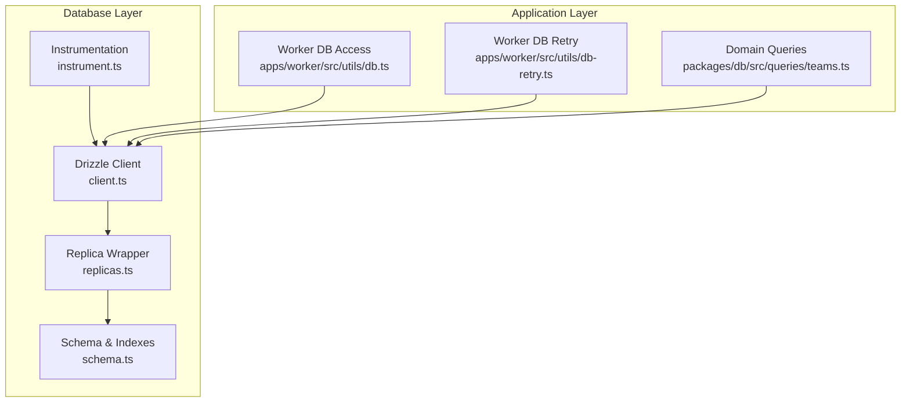
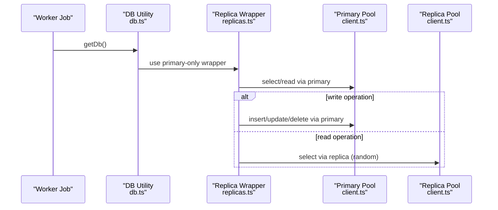
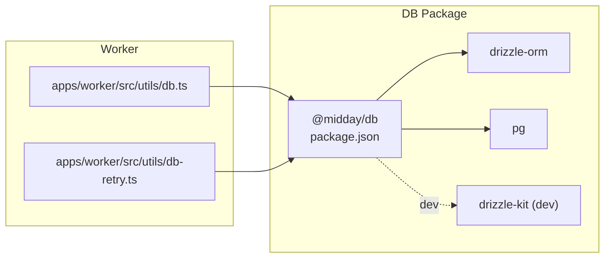

# Database Integration

<cite>
**Referenced Files in This Document**
- [client.ts](file://packages/db/src/client.ts)
- [replicas.ts](file://packages/db/src/replicas.ts)
- [instrument.ts](file://packages/db/src/instrument.ts)
- [schema.ts](file://packages/db/src/schema.ts)
- [teams.ts](file://packages/db/src/queries/teams.ts)
- [db.ts](file://apps/worker/src/utils/db.ts)
- [db-retry.ts](file://apps/worker/src/utils/db-retry.ts)
- [package.json](file://packages/db/package.json)
</cite>

## Table of Contents
1. [Introduction](#introduction)
2. [Project Structure](#project-structure)
3. [Core Components](#core-components)
4. [Architecture Overview](#architecture-overview)
5. [Detailed Component Analysis](#detailed-component-analysis)
6. [Dependency Analysis](#dependency-analysis)
7. [Performance Considerations](#performance-considerations)
8. [Troubleshooting Guide](#troubleshooting-guide)
9. [Conclusion](#conclusion)

## Introduction
This document explains the database integration for the Faworra project, focusing on Drizzle ORM configuration, connection pooling, transaction management, schema organization, and operational practices. It covers how connections are established, how read/write traffic is distributed across primary and replica databases, how transactions are executed, and how performance and reliability are ensured. It also outlines query patterns, indexing strategies, and operational guidance for maintenance, security, and monitoring.

## Project Structure
The database integration is primarily implemented in the @midday/db package and consumed by application workers and APIs. Key areas:
- Drizzle ORM client and connection pooling
- Replica-aware database wrapper
- Schema definitions and indexes
- Worker utilities for connection retry and DB access
- Query utilities for domain logic

**Diagram sources**
- [client.ts](file://packages/db/src/client.ts#L1-L219)
- [replicas.ts](file://packages/db/src/replicas.ts#L1-L117)
- [instrument.ts](file://packages/db/src/instrument.ts#L1-L88)
- [schema.ts](file://packages/db/src/schema.ts#L1-L800)
- [db.ts](file://apps/worker/src/utils/db.ts#L1-L30)
- [db-retry.ts](file://apps/worker/src/utils/db-retry.ts#L1-L99)
- [teams.ts](file://packages/db/src/queries/teams.ts#L1-L776)

**Section sources**
- [client.ts](file://packages/db/src/client.ts#L1-L219)
- [replicas.ts](file://packages/db/src/replicas.ts#L1-L117)
- [instrument.ts](file://packages/db/src/instrument.ts#L1-L88)
- [schema.ts](file://packages/db/src/schema.ts#L1-L800)
- [db.ts](file://apps/worker/src/utils/db.ts#L1-L30)
- [db-retry.ts](file://apps/worker/src/utils/db-retry.ts#L1-L99)
- [teams.ts](file://packages/db/src/queries/teams.ts#L1-L776)

## Core Components
- Drizzle client configured with a PostgreSQL connection pool
- Replica-aware database wrapper enabling read scaling and primary-only writes
- Instrumentation for slow query detection and logging
- Rich schema with enums, composite indexes, and row-level policies
- Worker utilities for robust DB access and transient failure handling

**Section sources**
- [client.ts](file://packages/db/src/client.ts#L1-L219)
- [replicas.ts](file://packages/db/src/replicas.ts#L1-L117)
- [instrument.ts](file://packages/db/src/instrument.ts#L1-L88)
- [schema.ts](file://packages/db/src/schema.ts#L1-L800)
- [db.ts](file://apps/worker/src/utils/db.ts#L1-L30)
- [db-retry.ts](file://apps/worker/src/utils/db-retry.ts#L1-L99)

## Architecture Overview
The system uses a primary database for writes and optional regional replicas for reads. Drizzle wraps a Node-Postgres pool, with optional instrumentation and pool event logging. A higher-level wrapper selects either primary or a randomly chosen replica for reads while forcing writes to the primary.

**Diagram sources**
- [db.ts](file://apps/worker/src/utils/db.ts#L1-L30)
- [replicas.ts](file://packages/db/src/replicas.ts#L16-L116)
- [client.ts](file://packages/db/src/client.ts#L103-L174)

## Detailed Component Analysis

### Drizzle Client and Connection Pooling
- Environment-driven pool sizing and timeouts
- SSL configuration disabled in development, enabled in production
- Pool event logging and statistics
- Drizzle logger integration for query tracing
- Graceful shutdown via pool.end()

Operational characteristics:
- Max/min connections, idle timeout, connection timeout, maxUses, keepAlive
- Region-aware replica URL mapping for Railway deployments
- Stats endpoint exposes primary and replica pool counts

**Section sources**
- [client.ts](file://packages/db/src/client.ts#L13-L28)
- [client.ts](file://packages/db/src/client.ts#L68-L101)
- [client.ts](file://packages/db/src/client.ts#L103-L116)
- [client.ts](file://packages/db/src/client.ts#L118-L174)
- [client.ts](file://packages/db/src/client.ts#L196-L218)

### Replica-Aware Database Wrapper
- Wraps Drizzle database with methods to force primary-only reads/writes
- Provides executeOnReplica for ad-hoc replica queries
- Binds methods to the correct underlying database to avoid accidental routing to primary

Design highlights:
- Selective read routing to replicas
- Forced write routing to primary
- Transparent transaction routing to primary

**Section sources**
- [replicas.ts](file://packages/db/src/replicas.ts#L16-L116)

### Instrumentation and Performance Logging
- Instruments pool.query to measure query durations
- Emits warnings for slow queries and errors for very slow queries
- Drizzle logger emits normalized query logs with operation and table metadata
- Optional debug flags for performance and pool event logging

**Section sources**
- [instrument.ts](file://packages/db/src/instrument.ts#L29-L73)
- [instrument.ts](file://packages/db/src/instrument.ts#L75-L87)
- [client.ts](file://packages/db/src/client.ts#L30-L30)

### Schema Organization and Indexing Strategies
The schema defines core entities and enforces access controls via row-level policies. Indexes are strategically placed for common query patterns:
- Transactions: composite indexes for date/name/team, FTS GIN/GIN trigram, merchant name trigram, and partial indexes for reporting
- Invoices: FTS GIN, composite indexes for team/status/paidAt, dueDate, customer_id, and recurring linkage
- Customers: FTS GIN, status/archived/enrichment fields, portal flags
- Exchange rates: unique base/target pair index
- Tags and relationships: composite indexes for tag/transaction/project/tag joins
- Institutions: country arrays, trigram name, status
- Tracker entries: team/date indexes for insights
- Vector embeddings: HNSW indexes for similarity search

Security:
- Row-level policies restrict access to authenticated users or team members
- Generated columns for full-text search improve search performance

**Section sources**
- [schema.ts](file://packages/db/src/schema.ts#L365-L535)
- [schema.ts](file://packages/db/src/schema.ts#L887-L1043)
- [schema.ts](file://packages/db/src/schema.ts#L1045-L1156)
- [schema.ts](file://packages/db/src/schema.ts#L1158-L1181)
- [schema.ts](file://packages/db/src/schema.ts#L1183-L1211)
- [schema.ts](file://packages/db/src/schema.ts#L1266-L1311)
- [schema.ts](file://packages/db/src/schema.ts#L1313-L1367)
- [schema.ts](file://packages/db/src/schema.ts#L1399-L1456)
- [schema.ts](file://packages/db/src/schema.ts#L1549-L1598)

### Transaction Management
- Domain operations use Drizzle transactions to ensure atomicity
- Example: createTeam performs team creation, membership insertion, category seeding, and optional user switch atomically
- Transactions are scoped to the primary database to maintain consistency

**Section sources**
- [teams.ts](file://packages/db/src/queries/teams.ts#L231-L359)

### Worker DB Access and Retry Logic
- Worker utilities expose a shared database instance with reconnection handling
- Dedicated retry wrapper for transient database connection errors with exponential backoff and jitter
- Classification of retryable vs non-retryable errors

**Section sources**
- [db.ts](file://apps/worker/src/utils/db.ts#L1-L30)
- [db-retry.ts](file://apps/worker/src/utils/db-retry.ts#L15-L55)
- [db-retry.ts](file://apps/worker/src/utils/db-retry.ts#L61-L99)

### Query Patterns and Best Practices
Common patterns observed:
- Cursor-based pagination for large datasets
- Composite indexes for multi-column filters and ordering
- FTS GIN indexes for text search across generated columns
- Partial indexes for reporting and analytics
- Trigram and GIST indexes for fuzzy matching and ranking
- Vector HNSW indexes for similarity search

**Section sources**
- [teams.ts](file://packages/db/src/queries/teams.ts#L634-L715)
- [schema.ts](file://packages/db/src/schema.ts#L412-L488)
- [schema.ts](file://packages/db/src/schema.ts#L962-L1035)
- [schema.ts](file://packages/db/src/schema.ts#L1131-L1143)

## Dependency Analysis
The database package depends on Drizzle ORM and the Node Postgres driver, with dev tooling for schema migrations. The worker utilities depend on the database client and logger packages.

**Diagram sources**
- [package.json](file://packages/db/package.json#L37-L57)
- [db.ts](file://apps/worker/src/utils/db.ts#L1-L3)
- [db-retry.ts](file://apps/worker/src/utils/db-retry.ts#L1-L3)

**Section sources**
- [package.json](file://packages/db/package.json#L37-L57)
- [db.ts](file://apps/worker/src/utils/db.ts#L1-L3)
- [db-retry.ts](file://apps/worker/src/utils/db-retry.ts#L1-L3)

## Performance Considerations
- Pool tuning: adjust max/min connections, idle timeout, and maxUses based on workload and environment
- Read scaling: leverage replica wrapper for read-heavy queries; force primary-only for writes
- Slow query detection: rely on instrumentation logs; investigate queries flagged as slow or very slow
- Index coverage: ensure queries leverage composite and partial indexes; monitor query plans
- Vector similarity: use HNSW indexes for embedding-based similarity; tune m and ef_construction
- FTS: leverage generated tsvector columns and GIN indexes for text search
- KeepAlive and SSL: ensure appropriate settings for production environments

[No sources needed since this section provides general guidance]

## Troubleshooting Guide
Common issues and remedies:
- Transient connection failures: use the worker DB retry utility with exponential backoff and jitter
- Pool exhaustion or timeouts: review pool configuration and increase limits cautiously; monitor wait queue
- Slow queries: inspect instrumentation logs; add missing indexes or rewrite queries
- Authentication or permission errors: verify row-level policies and team membership checks
- Graceful shutdown: ensure pools are closed during application teardown

**Section sources**
- [db-retry.ts](file://apps/worker/src/utils/db-retry.ts#L61-L99)
- [client.ts](file://packages/db/src/client.ts#L68-L101)
- [client.ts](file://packages/db/src/client.ts#L216-L218)

## Conclusion
The database integration leverages Drizzle ORM with a robust connection pool, replica-aware routing, and strong instrumentation. The schema is designed with performance and security in mind, using composite and partial indexes, FTS, and vector similarity. Operational practices around retry logic, graceful shutdown, and observability ensure reliability under real-world loads.