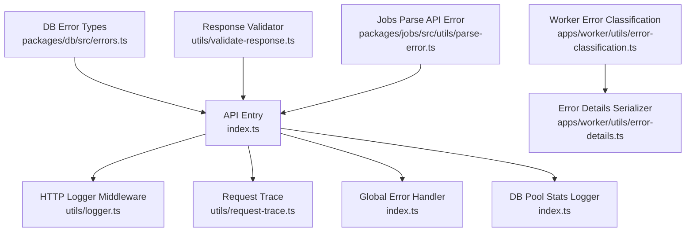
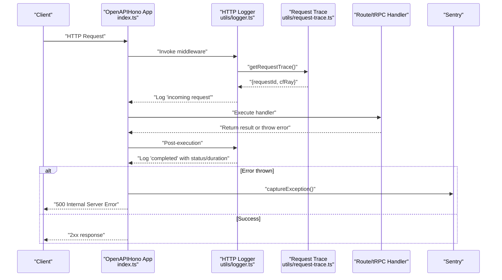
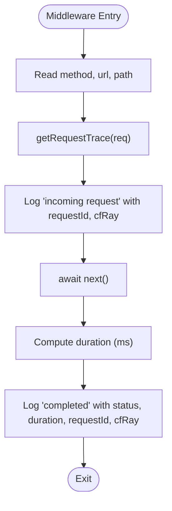
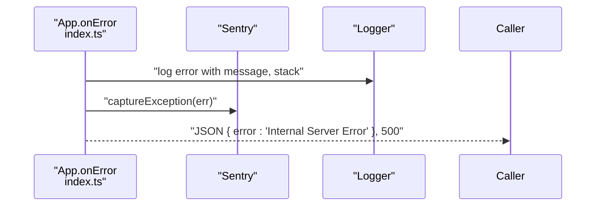
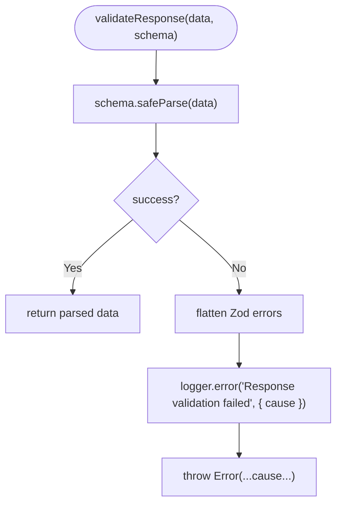
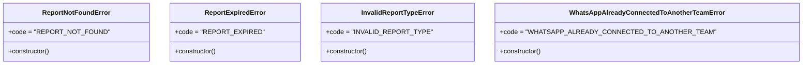
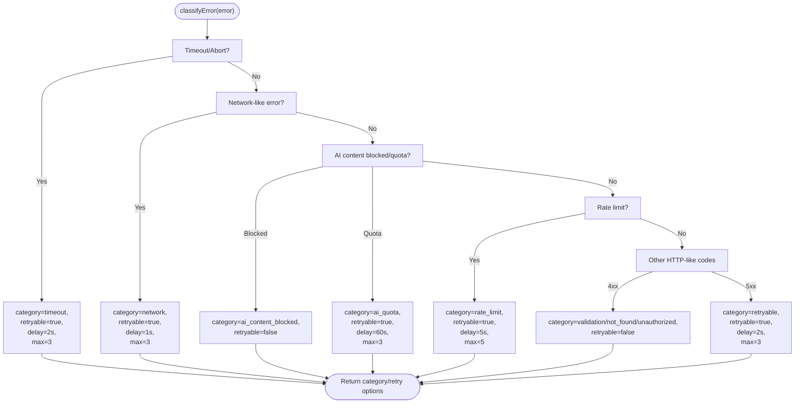
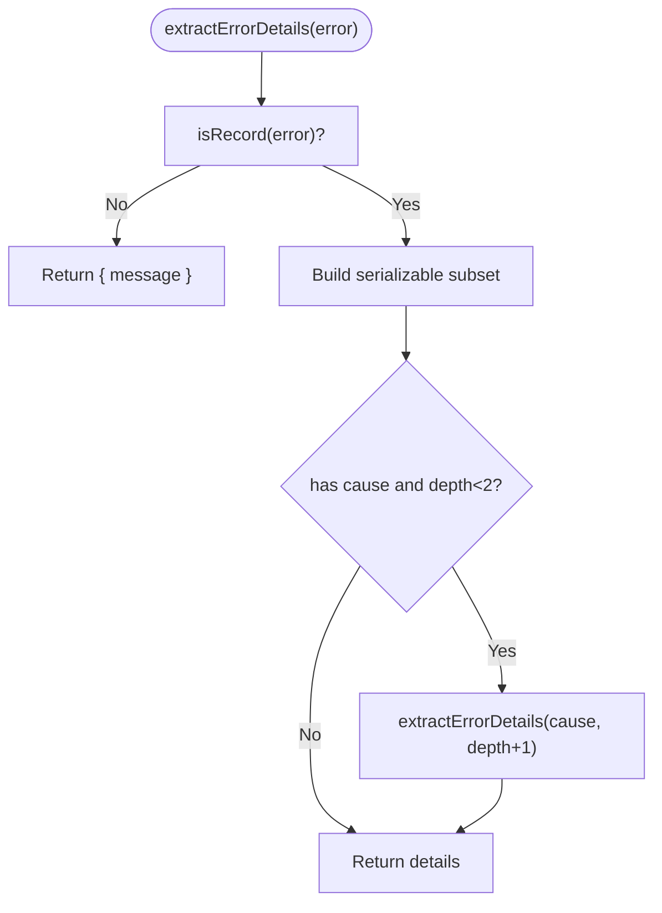
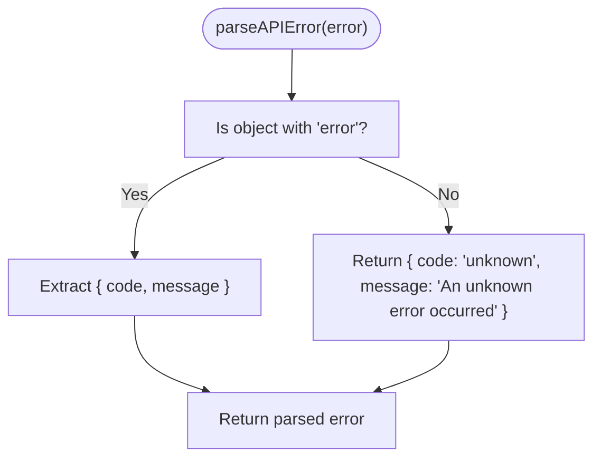
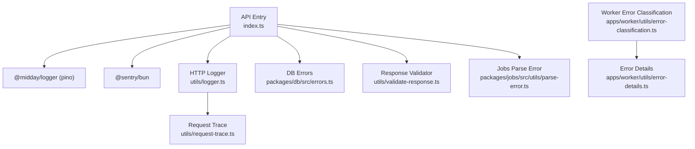

# Error Handling & Logging

<cite>
**Referenced Files in This Document**
- [index.ts](file://midday/apps/api/src/index.ts)
- [logger.ts](file://midday/apps/api/src/utils/logger.ts)
- [request-trace.ts](file://midday/apps/api/src/utils/request-trace.ts)
- [error-classification.ts](file://midday/apps/worker/src/utils/error-classification.ts)
- [error-details.ts](file://midday/apps/worker/src/utils/error-details.ts)
- [errors.ts](file://midday/packages/db/src/errors.ts)
- [validate-response.ts](file://midday/apps/api/src/utils/validate-response.ts)
- [parse-error.ts](file://midday/packages/jobs/src/utils/parse-error.ts)
- [package.json](file://midday/packages/logger/package.json)
</cite>

## Table of Contents
1. [Introduction](#introduction)
2. [Project Structure](#project-structure)
3. [Core Components](#core-components)
4. [Architecture Overview](#architecture-overview)
5. [Detailed Component Analysis](#detailed-component-analysis)
6. [Dependency Analysis](#dependency-analysis)
7. [Performance Considerations](#performance-considerations)
8. [Troubleshooting Guide](#troubleshooting-guide)
9. [Conclusion](#conclusion)

## Introduction
This document defines error handling and logging standards for the API service. It covers error response formats, status code conventions, structured logging patterns, request tracing and correlation via correlation IDs, distributed logging strategies, error classification and retry mechanisms, graceful degradation, logging levels, audit trails, and security considerations for error reporting. It also outlines debugging techniques, monitoring integration, and alerting strategies for production environments.

## Project Structure
The API service integrates logging, request tracing, and error handling across the application entry point, middleware, and shared utilities. Worker utilities provide error classification and serialization for resilient job processing. Database-specific errors are modeled as typed exceptions. Response validation logs and fails fast to prevent propagating malformed data.

**Diagram sources**
- [index.ts](file://midday/apps/api/src/index.ts#L26-L288)
- [logger.ts](file://midday/apps/api/src/utils/logger.ts#L1-L33)
- [request-trace.ts](file://midday/apps/api/src/utils/request-trace.ts#L1-L17)
- [error-classification.ts](file://midday/apps/worker/src/utils/error-classification.ts#L1-L349)
- [error-details.ts](file://midday/apps/worker/src/utils/error-details.ts#L1-L82)
- [errors.ts](file://midday/packages/db/src/errors.ts#L1-L36)
- [validate-response.ts](file://midday/apps/api/src/utils/validate-response.ts#L1-L19)
- [parse-error.ts](file://midday/packages/jobs/src/utils/parse-error.ts#L1-L12)

**Section sources**
- [index.ts](file://midday/apps/api/src/index.ts#L26-L288)
- [logger.ts](file://midday/apps/api/src/utils/logger.ts#L1-L33)
- [request-trace.ts](file://midday/apps/api/src/utils/request-trace.ts#L1-L17)
- [error-classification.ts](file://midday/apps/worker/src/utils/error-classification.ts#L1-L349)
- [error-details.ts](file://midday/apps/worker/src/utils/error-details.ts#L1-L82)
- [errors.ts](file://midday/packages/db/src/errors.ts#L1-L36)
- [validate-response.ts](file://midday/apps/api/src/utils/validate-response.ts#L1-L19)
- [parse-error.ts](file://midday/packages/jobs/src/utils/parse-error.ts#L1-L12)

## Core Components
- Structured HTTP logging with request tracing and timing
- Request correlation via x-request-id or cf-ray
- Centralized global error handling with Sentry capture
- Typed database error classes
- Response validation with structured logging
- Worker-side error classification and retry options
- Error details serialization for safe transport
- Jobs error parsing for downstream consumers

**Section sources**
- [index.ts](file://midday/apps/api/src/index.ts#L28-L211)
- [logger.ts](file://midday/apps/api/src/utils/logger.ts#L5-L32)
- [request-trace.ts](file://midday/apps/api/src/utils/request-trace.ts#L10-L16)
- [errors.ts](file://midday/packages/db/src/errors.ts#L1-L36)
- [validate-response.ts](file://midday/apps/api/src/utils/validate-response.ts#L7-L19)
- [error-classification.ts](file://midday/apps/worker/src/utils/error-classification.ts#L66-L243)
- [error-details.ts](file://midday/apps/worker/src/utils/error-details.ts#L47-L82)
- [parse-error.ts](file://midday/packages/jobs/src/utils/parse-error.ts#L1-L12)

## Architecture Overview
The API service establishes a consistent error and logging pipeline:
- Incoming requests are logged with correlation metadata.
- Route handlers and tRPC procedures log errors and forward them to Sentry for production monitoring.
- Response validation ensures data integrity and logs failures.
- Worker utilities classify transient vs non-transient errors and suggest retry/backoff strategies.
- Shutdown and unhandled error handlers ensure graceful degradation and observability.

**Diagram sources**
- [index.ts](file://midday/apps/api/src/index.ts#L28-L211)
- [logger.ts](file://midday/apps/api/src/utils/logger.ts#L5-L32)
- [request-trace.ts](file://midday/apps/api/src/utils/request-trace.ts#L10-L16)

## Detailed Component Analysis

### Structured HTTP Logging and Request Tracing
- Logs include HTTP method, path, status code, and duration.
- Correlation identifiers are extracted from x-request-id or cf-ray; otherwise a random UUID is generated.
- Timing is computed using high-resolution time to avoid precision loss.

**Diagram sources**
- [logger.ts](file://midday/apps/api/src/utils/logger.ts#L5-L32)
- [request-trace.ts](file://midday/apps/api/src/utils/request-trace.ts#L10-L16)

**Section sources**
- [logger.ts](file://midday/apps/api/src/utils/logger.ts#L5-L32)
- [request-trace.ts](file://midday/apps/api/src/utils/request-trace.ts#L10-L16)

### Global Error Handling and Sentry Integration
- Unhandled route errors are captured by the global onError handler and sent to Sentry.
- tRPC error handler logs structured details and forwards internal server errors to Sentry.
- Both handlers include correlation IDs for traceability.

**Diagram sources**
- [index.ts](file://midday/apps/api/src/index.ts#L202-L211)
- [index.ts](file://midday/apps/api/src/index.ts#L93-L112)

**Section sources**
- [index.ts](file://midday/apps/api/src/index.ts#L202-L211)
- [index.ts](file://midday/apps/api/src/index.ts#L93-L112)

### Response Validation and Audit Trails
- Response validation logs structured failures and throws to prevent malformed data.
- This creates an audit trail for data quality issues.

**Diagram sources**
- [validate-response.ts](file://midday/apps/api/src/utils/validate-response.ts#L7-L19)

**Section sources**
- [validate-response.ts](file://midday/apps/api/src/utils/validate-response.ts#L7-L19)

### Database Error Types
- Typed error classes encapsulate domain-specific failure modes (e.g., report not found/expired/invalid type).
- These can be caught and mapped to appropriate HTTP responses with structured logging.

**Diagram sources**
- [errors.ts](file://midday/packages/db/src/errors.ts#L1-L36)

**Section sources**
- [errors.ts](file://midday/packages/db/src/errors.ts#L1-L36)

### Worker Error Classification, Retry, and Graceful Degradation
- Errors are categorized (retryable, non_retryable, rate_limit, timeout, network, validation, not_found, unauthorized, ai_content_blocked, ai_quota, unsupported_file_type).
- Provides suggested retry delays and max retries per category.
- Offers job retry options tailored for queue backends (e.g., exponential or fixed backoff).
- Includes a NonRetryableError variant to signal immediate failure.

**Diagram sources**
- [error-classification.ts](file://midday/apps/worker/src/utils/error-classification.ts#L66-L243)

**Section sources**
- [error-classification.ts](file://midday/apps/worker/src/utils/error-classification.ts#L6-L24)
- [error-classification.ts](file://midday/apps/worker/src/utils/error-classification.ts#L30-L43)
- [error-classification.ts](file://midday/apps/worker/src/utils/error-classification.ts#L279-L348)

### Error Details Serialization for Transport
- Extracts a safe subset of error properties (name, message, stack, code, errno, syscall, address, port, constraint, severity, detail, hint, cause).
- Prevents leaking sensitive data while preserving diagnostic context.

**Diagram sources**
- [error-details.ts](file://midday/apps/worker/src/utils/error-details.ts#L47-L82)

**Section sources**
- [error-details.ts](file://midday/apps/worker/src/utils/error-details.ts#L1-L82)

### Jobs Error Parsing for Downstream Consumers
- Parses API error payloads into a normalized shape for downstream systems.
- Defaults to a generic unknown error when the payload does not match expectations.

**Diagram sources**
- [parse-error.ts](file://midday/packages/jobs/src/utils/parse-error.ts#L1-L12)

**Section sources**
- [parse-error.ts](file://midday/packages/jobs/src/utils/parse-error.ts#L1-L12)

## Dependency Analysis
- The API entry depends on the logger package for structured logging and Sentry for error capture.
- The HTTP logger middleware depends on request tracing utilities.
- Worker error classification utilities are independent and can be reused across job processing.
- Database error types are shared across services.

**Diagram sources**
- [index.ts](file://midday/apps/api/src/index.ts#L1-L26)
- [logger.ts](file://midday/apps/api/src/utils/logger.ts#L1-L3)
- [request-trace.ts](file://midday/apps/api/src/utils/request-trace.ts#L1-L3)
- [errors.ts](file://midday/packages/db/src/errors.ts#L1-L36)
- [validate-response.ts](file://midday/apps/api/src/utils/validate-response.ts#L1-L3)
- [parse-error.ts](file://midday/packages/jobs/src/utils/parse-error.ts#L1-L3)
- [error-classification.ts](file://midday/apps/worker/src/utils/error-classification.ts#L1-L3)
- [error-details.ts](file://midday/apps/worker/src/utils/error-details.ts#L1-L3)
- [package.json](file://midday/packages/logger/package.json#L13-L16)

**Section sources**
- [index.ts](file://midday/apps/api/src/index.ts#L1-L26)
- [package.json](file://midday/packages/logger/package.json#L13-L16)

## Performance Considerations
- Logging overhead is minimized by computing durations after next() and avoiding heavy JSON serialization in hot paths.
- Optional performance logging for tRPC routes can be enabled via an environment flag.
- Database pool statistics are periodically logged at a configurable interval to monitor resource utilization.

**Section sources**
- [logger.ts](file://midday/apps/api/src/utils/logger.ts#L21-L30)
- [index.ts](file://midday/apps/api/src/index.ts#L67-L86)
- [index.ts](file://midday/apps/api/src/index.ts#L186-L199)

## Troubleshooting Guide
- Use correlation IDs to trace requests across services:
  - Prefer x-request-id; otherwise cf-ray is used; otherwise a random UUID is generated.
- For tRPC errors:
  - Inspect logs for structured fields (message, code, cause, stack).
  - Verify Sentry capture for INTERNAL_SERVER_ERROR.
- For response validation failures:
  - Review flattened Zod errors and ensure upstream data conforms to schemas.
- For worker job failures:
  - Classify errors to determine retry behavior and adjust backoff.
  - Use error details serializer to safely transport diagnostics without leaking secrets.
- For API consumers:
  - Parse standardized error payloads to present actionable messages.

**Section sources**
- [request-trace.ts](file://midday/apps/api/src/utils/request-trace.ts#L10-L16)
- [index.ts](file://midday/apps/api/src/index.ts#L93-L112)
- [validate-response.ts](file://midday/apps/api/src/utils/validate-response.ts#L10-L16)
- [error-classification.ts](file://midday/apps/worker/src/utils/error-classification.ts#L66-L243)
- [error-details.ts](file://midday/apps/worker/src/utils/error-details.ts#L47-L82)
- [parse-error.ts](file://midday/packages/jobs/src/utils/parse-error.ts#L1-L12)

## Conclusion
The API service employs structured logging, robust request tracing, centralized error handling with Sentry, typed database errors, and strict response validation. Worker utilities provide intelligent error classification and retry strategies. Together, these practices enable effective debugging, monitoring, and graceful degradation in production.