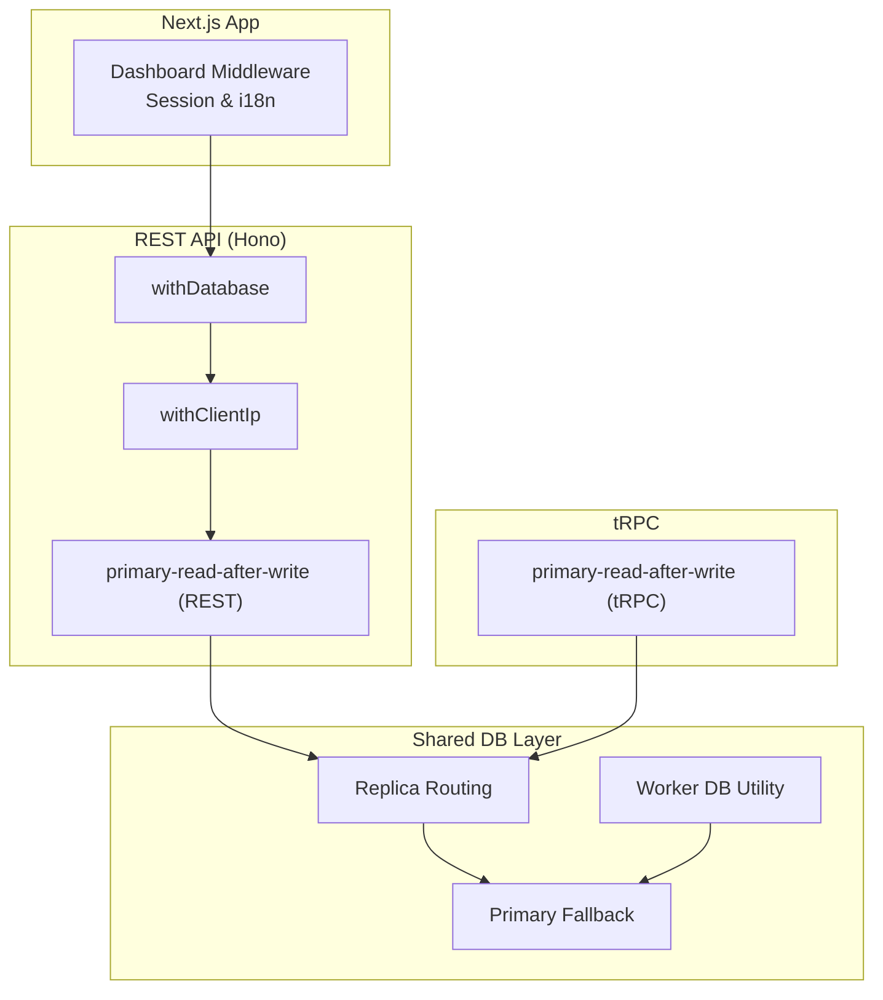
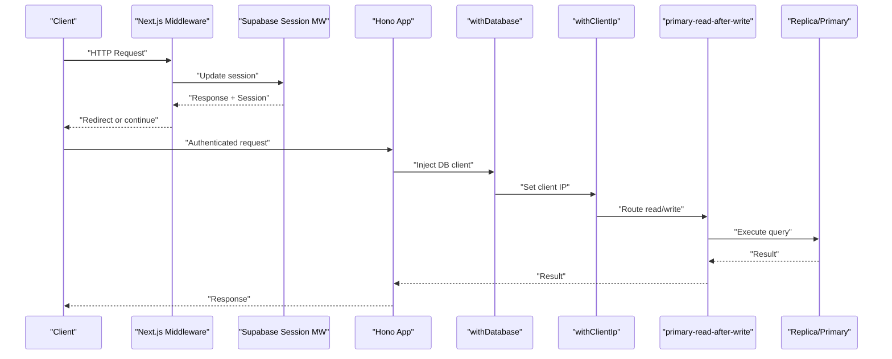
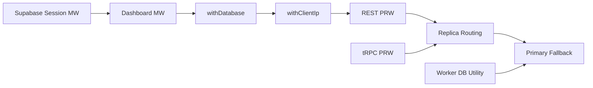

# Middleware Pipeline

<cite>
**Referenced Files in This Document**
- [middleware.ts](file://midday/apps/dashboard/src/middleware.ts)
- [middleware.ts](file://midday/packages/supabase/src/client/middleware.ts)
- [db.ts](file://midday/apps/api/src/rest/middleware/db.ts)
- [primary-read-after-write.ts](file://midday/apps/api/src/rest/middleware/primary-read-after-write.ts)
- [primary-read-after-write.ts](file://midday/apps/api/src/trpc/middleware/primary-read-after-write.ts)
- [db-retry.ts](file://midday/apps/api/src/utils/db-retry.ts)
- [logger.ts](file://midday/apps/api/src/utils/logger.ts)
- [replicas.ts](file://midday/packages/db/src/replicas.ts)
- [db.ts](file://midday/apps/worker/src/utils/db.ts)
- [setup.ts](file://midday/apps/api/src/__tests__/setup.ts)
</cite>

## Table of Contents
1. [Introduction](#introduction)
2. [Project Structure](#project-structure)
3. [Core Components](#core-components)
4. [Architecture Overview](#architecture-overview)
5. [Detailed Component Analysis](#detailed-component-analysis)
6. [Dependency Analysis](#dependency-analysis)
7. [Performance Considerations](#performance-considerations)
8. [Troubleshooting Guide](#troubleshooting-guide)
9. [Conclusion](#conclusion)
10. [Appendices](#appendices)

## Introduction
This document explains the middleware pipeline used to process requests across the Midday platform. It covers the execution order, purpose, configuration, and behavior of middleware components, including database connection management, scope validation, IP extraction, and primary-read-after-write routing. It also provides guidance for building custom middleware, handling errors in middleware chains, optimizing performance, composing middleware effectively, and debugging request flows.

## Project Structure
The middleware pipeline spans several layers:
- Next.js application middleware for session management and internationalization
- REST API middleware stack for Hono-based routes
- tRPC middleware for procedure-level routing and replication policies
- Shared database client with replica routing and primary fallback
- Worker utilities for database connections in background jobs

**Diagram sources**
- [middleware.ts](file://midday/apps/dashboard/src/middleware.ts#L1-L86)
- [middleware.ts](file://midday/packages/supabase/src/client/middleware.ts#L1-L44)
- [db.ts](file://midday/apps/api/src/rest/middleware/db.ts#L1-L13)
- [primary-read-after-write.ts](file://midday/apps/api/src/rest/middleware/primary-read-after-write.ts#L33-L73)
- [primary-read-after-write.ts](file://midday/apps/api/src/trpc/middleware/primary-read-after-write.ts#L1-L83)
- [replicas.ts](file://midday/packages/db/src/replicas.ts#L37-L116)
- [db.ts](file://midday/apps/worker/src/utils/db.ts#L1-L30)

**Section sources**
- [middleware.ts](file://midday/apps/dashboard/src/middleware.ts#L1-L86)
- [db.ts](file://midday/apps/api/src/rest/middleware/db.ts#L1-L13)
- [primary-read-after-write.ts](file://midday/apps/api/src/rest/middleware/primary-read-after-write.ts#L33-L73)
- [primary-read-after-write.ts](file://midday/apps/api/src/trpc/middleware/primary-read-after-write.ts#L1-L83)
- [replicas.ts](file://midday/packages/db/src/replicas.ts#L37-L116)
- [db.ts](file://midday/apps/worker/src/utils/db.ts#L1-L30)

## Core Components
- Dashboard middleware: Manages Supabase session updates, applies i18n rewriting, enforces authentication redirects, and handles MFA redirection.
- Database middleware: Injects a shared database client into the Hono context.
- IP extraction middleware: Extracts the real client IP from headers or Hono’s connection info.
- Primary-read-after-write middleware (REST and tRPC): Routes reads to replicas or primary depending on mutation history and operation type.
- Database retry utility: Retries queries on primary when replicas return null/undefined, with exponential backoff.
- Worker database utility: Provides a singleton worker DB client with reconnection logging.
- HTTP logger middleware: Logs request lifecycle with timing and tracing metadata.

**Section sources**
- [middleware.ts](file://midday/apps/dashboard/src/middleware.ts#L1-L86)
- [middleware.ts](file://midday/packages/supabase/src/client/middleware.ts#L1-L44)
- [db.ts](file://midday/apps/api/src/rest/middleware/db.ts#L1-L13)
- [primary-read-after-write.ts](file://midday/apps/api/src/rest/middleware/primary-read-after-write.ts#L33-L73)
- [primary-read-after-write.ts](file://midday/apps/api/src/trpc/middleware/primary-read-after-write.ts#L1-L83)
- [db-retry.ts](file://midday/apps/api/src/utils/db-retry.ts#L32-L74)
- [db.ts](file://midday/apps/worker/src/utils/db.ts#L1-L30)
- [logger.ts](file://midday/apps/api/src/utils/logger.ts#L1-L32)

## Architecture Overview
The middleware pipeline ensures that:
- Authentication and session state are established early in the request lifecycle.
- Request context is enriched with database clients and client IP.
- Reads are routed to replicas unless recent writes or forced primary usage require otherwise.
- Errors are handled gracefully with retries and logging.

**Diagram sources**
- [middleware.ts](file://midday/apps/dashboard/src/middleware.ts#L13-L81)
- [middleware.ts](file://midday/packages/supabase/src/client/middleware.ts#L4-L43)
- [db.ts](file://midday/apps/api/src/rest/middleware/db.ts#L7-L12)
- [primary-read-after-write.ts](file://midday/apps/api/src/rest/middleware/primary-read-after-write.ts#L53-L81)
- [replicas.ts](file://midday/packages/db/src/replicas.ts#L52-L112)

## Detailed Component Analysis

### Dashboard Middleware (Session, i18n, Redirects)
Purpose:
- Updates Supabase session state and attaches it to the response.
- Applies internationalization rewriting and strips locale prefix for internal routing.
- Enforces authentication redirects for protected paths.
- Redirects to MFA verification when required.

Execution order:
- Runs before page rendering and API routes.
- Uses a matcher to exclude static assets and API routes.

Configuration options:
- Locale strategy via i18n middleware.
- Origin URL for redirect generation.
- Path exceptions for login, invites, OAuth callbacks, and desktop search.

Behavior highlights:
- Redirects unauthenticated users to login with a return-to parameter.
- Redirects to MFA verification when session requires AAL2 progression.

**Section sources**
- [middleware.ts](file://midday/apps/dashboard/src/middleware.ts#L1-L86)
- [middleware.ts](file://midday/packages/supabase/src/client/middleware.ts#L1-L44)

### Database Connection Middleware (Hono)
Purpose:
- Injects a singleton database client into the Hono context for downstream handlers.

Execution order:
- Typically runs after authentication/IP extraction.
- Ensures all handlers operate with a consistent DB instance.

Configuration options:
- None at runtime; relies on the shared client initialization.

Behavior highlights:
- Sets the DB client on context for subsequent middleware and handlers.

**Section sources**
- [db.ts](file://midday/apps/api/src/rest/middleware/db.ts#L1-L13)

### IP Filtering Middleware (Hono)
Purpose:
- Extracts the real client IP address, accounting for proxies/load balancers.
- Falls back to Hono’s connection info when headers are unavailable.

Execution order:
- Usually placed early after authentication and before DB injection.
- Makes the client IP available in context for logging and rate limiting.

Configuration options:
- Depends on request headers and Hono’s connection info.

Behavior highlights:
- Stores client IP on context for later middleware or handlers.

**Section sources**
- [primary-read-after-write.ts](file://midday/apps/api/src/rest/middleware/primary-read-after-write.ts#L33-L73)

### Primary-Read-After-Write (REST)
Purpose:
- Route reads to replicas or primary based on recent mutations and operation type.
- Force primary usage when explicitly requested.

Execution order:
- Runs after DB middleware and IP middleware.
- Uses a replication cache keyed by team ID.

Routing logic:
- Mutations: set a timestamp in the replication cache and route to primary.
- Queries: if a recent mutation timestamp exists and is within a threshold, route to primary.
- Forced primary: overrides normal routing when explicitly requested.

Error handling:
- Catches errors when resolving team membership and logs warnings.

**Section sources**
- [primary-read-after-write.ts](file://midday/apps/api/src/rest/middleware/primary-read-after-write.ts#L33-L73)

### Primary-Read-After-Write (tRPC)
Purpose:
- Same routing policy as REST but integrated into tRPC procedure execution.

Execution order:
- Wraps tRPC procedures to decide whether to use primary or replica.
- Supports forcing primary usage per procedure context.

Routing logic:
- Mutations: set replication cache and route to primary.
- Queries: check replication cache timestamp and route accordingly.
- Forced primary: switch to primary-only mode when requested.

Performance diagnostics:
- Optional performance logging for cache set/get operations.

**Section sources**
- [primary-read-after-write.ts](file://midday/apps/api/src/trpc/middleware/primary-read-after-write.ts#L1-L83)

### Database Retry Utility
Purpose:
- Retry read operations on primary when replicas return null/undefined.
- Apply exponential backoff with jitter across attempts.

Execution order:
- Used around query execution to improve read consistency for sensitive reads.

Behavior highlights:
- If primary-only is not supported, returns the original result.
- On last attempt failure, throws the last error encountered.

**Section sources**
- [db-retry.ts](file://midday/apps/api/src/utils/db-retry.ts#L32-L74)

### Worker Database Utility
Purpose:
- Provide a singleton database client for worker jobs with reconnection handling.

Execution order:
- Called during worker initialization and job execution.

Behavior highlights:
- Lazily initializes the worker DB client.
- Logs and rethrows initialization errors for observability.

**Section sources**
- [db.ts](file://midday/apps/worker/src/utils/db.ts#L1-L30)

### HTTP Logger Middleware (Hono)
Purpose:
- Log request lifecycle with method, path, status code, and duration.
- Attach request tracing identifiers for correlation.

Execution order:
- Runs near the start of the Hono pipeline to capture end-to-end latency.

Behavior highlights:
- Measures wall-clock time and logs completion with status and tracing metadata.

**Section sources**
- [logger.ts](file://midday/apps/api/src/utils/logger.ts#L1-L32)

## Dependency Analysis
The middleware stack depends on:
- Supabase client for session management in the dashboard.
- Shared database client with replica routing and primary fallback.
- Replication cache for coordinating read-after-write routing.
- Worker utilities for background job DB connections.

**Diagram sources**
- [middleware.ts](file://midday/apps/dashboard/src/middleware.ts#L13-L81)
- [middleware.ts](file://midday/packages/supabase/src/client/middleware.ts#L4-L43)
- [db.ts](file://midday/apps/api/src/rest/middleware/db.ts#L7-L12)
- [primary-read-after-write.ts](file://midday/apps/api/src/rest/middleware/primary-read-after-write.ts#L53-L81)
- [replicas.ts](file://midday/packages/db/src/replicas.ts#L52-L112)
- [db.ts](file://midday/apps/worker/src/utils/db.ts#L17-L30)

**Section sources**
- [replicas.ts](file://midday/packages/db/src/replicas.ts#L37-L116)
- [primary-read-after-write.ts](file://midday/apps/api/src/rest/middleware/primary-read-after-write.ts#L33-L73)
- [primary-read-after-write.ts](file://midday/apps/api/src/trpc/middleware/primary-read-after-write.ts#L1-L83)
- [db.ts](file://midday/apps/worker/src/utils/db.ts#L1-L30)

## Performance Considerations
- Replica-first reads reduce primary load; use primary-read-after-write to balance freshness and throughput.
- Enable performance logging for PRW cache operations when diagnosing routing delays.
- Use retry-on-null for sensitive reads that must reflect recent writes.
- Prefer HTTP logger to monitor request durations and identify hotspots.
- Worker DB utility avoids repeated connection overhead by caching a single instance.

[No sources needed since this section provides general guidance]

## Troubleshooting Guide
Common issues and remedies:
- Authentication redirects loop:
  - Verify matcher exclusions and origin configuration in dashboard middleware.
  - Ensure session cookie handling is intact.
- Stale reads after write:
  - Confirm replication cache is being set on mutations and queried on reads.
  - Check forced primary usage when necessary.
- Database connection failures in workers:
  - Inspect worker DB initialization logs and rethrow behavior.
- Unexpected primary usage:
  - Review PRW logic for team ID resolution and cache timestamps.
- Null results on replicas:
  - Use retry utility to fall back to primary with exponential backoff.

**Section sources**
- [middleware.ts](file://midday/apps/dashboard/src/middleware.ts#L33-L51)
- [primary-read-after-write.ts](file://midday/apps/api/src/rest/middleware/primary-read-after-write.ts#L53-L81)
- [primary-read-after-write.ts](file://midday/apps/api/src/trpc/middleware/primary-read-after-write.ts#L25-L83)
- [db-retry.ts](file://midday/apps/api/src/utils/db-retry.ts#L32-L74)
- [db.ts](file://midday/apps/worker/src/utils/db.ts#L17-L30)

## Conclusion
The middleware pipeline integrates session management, request enrichment, and intelligent database routing to deliver secure, performant, and consistent request processing. By leveraging replica-first reads, primary fallback on demand, and robust retry mechanisms, the system balances scalability with correctness. Proper composition and logging enable effective debugging and optimization.

[No sources needed since this section summarizes without analyzing specific files]

## Appendices

### Middleware Composition Patterns
- Chain order: authentication/session → i18n rewrite → DB injection → IP extraction → PRW → handlers.
- Use early exits for redirects and authentication checks to minimize downstream work.
- Wrap tRPC procedures with PRW to enforce consistent routing policy across the API.

[No sources needed since this section provides general guidance]

### Debugging Techniques for Request Flow Analysis
- Enable HTTP logging to track request lifecycle timings.
- Use PRW performance logs to inspect cache set/get operations.
- Instrument worker DB initialization to detect connectivity issues.
- Leverage request tracing identifiers to correlate logs across services.

**Section sources**
- [logger.ts](file://midday/apps/api/src/utils/logger.ts#L5-L31)
- [primary-read-after-write.ts](file://midday/apps/api/src/trpc/middleware/primary-read-after-write.ts#L6-L8)
- [db.ts](file://midday/apps/worker/src/utils/db.ts#L17-L28)

### Custom Middleware Development Guidelines
- Keep middleware single-purpose and composable.
- Store context values consistently (e.g., db, clientIp, session).
- Handle errors gracefully and log meaningful metadata.
- Respect ordering constraints (authentication before DB, IP before routing).
- Provide optional performance diagnostics for production troubleshooting.

[No sources needed since this section provides general guidance]