# Authentication & OAuth Endpoints

<cite>
**Referenced Files in This Document**
- [oauth.ts](file://midday/apps/api/src/rest/routers/oauth.ts)
- [auth.ts](file://midday/apps/api/src/utils/auth.ts)
- [oauth.ts](file://midday/apps/api/src/utils/oauth.ts)
- [auth.ts](file://midday/apps/api/src/rest/middleware/auth.ts)
- [index.ts](file://midday/apps/api/src/rest/middleware/index.ts)
- [oauth-flow.ts](file://midday/apps/api/src/schemas/oauth-flow.ts)
- [api-keys.ts](file://midday/apps/api/src/trpc/routers/api-keys.ts)
- [api-keys.ts](file://midday/packages/db/src/queries/api-keys.ts)
- [api-key-cache.ts](file://midday/packages/cache/src/api-key-cache.ts)
- [user-cache.ts](file://midday/packages/cache/src/user-cache.ts)
- [session.ts](file://midday/apps/dashboard/src/utils/session.ts)
- [oauth-consent-screen.tsx](file://midday/apps/dashboard/src/components/oauth/oauth-consent-screen.tsx)
- [page.tsx](file://midday/apps/dashboard/src/app/[locale]/(app)/oauth/authorize/page.tsx)
- [use-app-oauth.ts](file://midday/apps/dashboard/src/hooks/use-app-oauth.ts)
- [verify-mfa.tsx](file://midday/apps/dashboard/src/components/verify-mfa.tsx)
- [enroll-mfa.tsx](file://midday/apps/dashboard/src/components/enroll-mfa.tsx)
- [add-new-device.tsx](file://midday/apps/dashboard/src/components/modals/add-new-device.tsx)
- [mfa-verify-action.ts](file://midday/apps/dashboard/src/actions/mfa-verify-action.ts)
- [middleware.ts](file://midday/packages/supabase/src/client/middleware.ts)
- [oauth-api-endpoints.mdx](file://midday/apps/website/src/app/docs/content/oauth-api-endpoints.mdx)
</cite>

## Table of Contents
1. [Introduction](#introduction)
2. [Project Structure](#project-structure)
3. [Core Components](#core-components)
4. [Architecture Overview](#architecture-overview)
5. [Detailed Component Analysis](#detailed-component-analysis)
6. [Dependency Analysis](#dependency-analysis)
7. [Performance Considerations](#performance-considerations)
8. [Troubleshooting Guide](#troubleshooting-guide)
9. [Conclusion](#conclusion)

## Introduction
This document provides comprehensive API documentation for authentication and OAuth endpoints in the system. It covers:
- Login and logout flows (via Supabase JWT and OAuth access tokens)
- OAuth authorization, token exchange, and revocation endpoints
- API key management for server-side integrations
- User session handling and middleware
- Authentication flow diagrams, token refresh mechanisms, and MFA verification endpoints
- OAuth provider integrations and consent screen handling
- JWT token structure, expiration policies, and refresh token management
- Security considerations, rate limiting, and common authentication error scenarios

## Project Structure
The authentication and OAuth functionality spans several layers:
- REST API routers for OAuth endpoints
- Utilities for JWT verification and client credential validation
- Middleware for unified authentication (Supabase JWT, OAuth access tokens, API keys)
- Frontend consent screens and OAuth callback handling
- MFA enrollment and verification components
- API key creation, retrieval, and deletion via tRPC

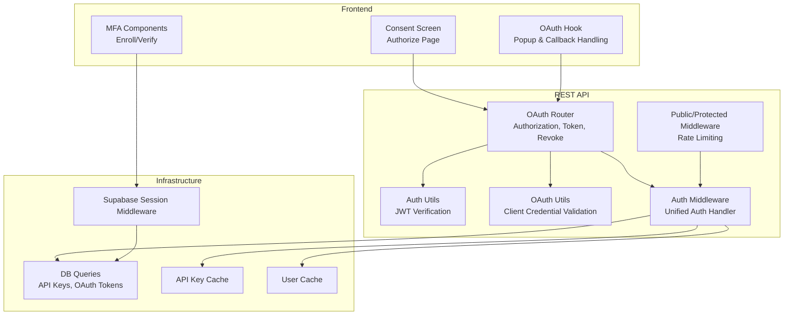

**Diagram sources**
- [oauth.ts](file://midday/apps/api/src/rest/routers/oauth.ts#L1-L630)
- [auth.ts](file://midday/apps/api/src/utils/auth.ts#L1-L44)
- [oauth.ts](file://midday/apps/api/src/utils/oauth.ts#L1-L24)
- [auth.ts](file://midday/apps/api/src/rest/middleware/auth.ts#L1-L152)
- [index.ts](file://midday/apps/api/src/rest/middleware/index.ts#L1-L44)
- [api-keys.ts](file://midday/packages/db/src/queries/api-keys.ts#L1-L130)
- [api-key-cache.ts](file://midday/packages/cache/src/api-key-cache.ts#L1-L11)
- [user-cache.ts](file://midday/packages/cache/src/user-cache.ts#L1-L10)
- [middleware.ts](file://midday/packages/supabase/src/client/middleware.ts#L1-L43)

**Section sources**
- [oauth.ts](file://midday/apps/api/src/rest/routers/oauth.ts#L1-L630)
- [auth.ts](file://midday/apps/api/src/utils/auth.ts#L1-L44)
- [oauth.ts](file://midday/apps/api/src/utils/oauth.ts#L1-L24)
- [auth.ts](file://midday/apps/api/src/rest/middleware/auth.ts#L1-L152)
- [index.ts](file://midday/apps/api/src/rest/middleware/index.ts#L1-L44)

## Core Components
- OAuth Router: Implements authorization, token exchange, and revocation endpoints with PKCE and state validation.
- Auth Utils: Verifies Supabase JWT tokens and extracts session claims.
- OAuth Utils: Validates confidential client credentials using secure hashing and timing-safe comparison.
- Auth Middleware: Unified handler supporting Supabase JWT, OAuth access tokens, and API keys with caching and scope expansion.
- Consent Screen: Frontend component for user authorization decisions with team selection and scope display.
- MFA Components: Enroll, verify, and add new device flows using TOTP factors.
- API Key Management: tRPC router for creating, listing, updating, and deleting API keys with encrypted storage and cache invalidation.

**Section sources**
- [oauth.ts](file://midday/apps/api/src/rest/routers/oauth.ts#L53-L318)
- [auth.ts](file://midday/apps/api/src/utils/auth.ts#L20-L43)
- [oauth.ts](file://midday/apps/api/src/utils/oauth.ts#L10-L23)
- [auth.ts](file://midday/apps/api/src/rest/middleware/auth.ts#L16-L151)
- [oauth-consent-screen.tsx](file://midday/apps/dashboard/src/components/oauth/oauth-consent-screen.tsx#L1-L48)
- [verify-mfa.tsx](file://midday/apps/dashboard/src/components/verify-mfa.tsx#L1-L91)
- [enroll-mfa.tsx](file://midday/apps/dashboard/src/components/enroll-mfa.tsx#L34-L96)
- [api-keys.ts](file://midday/apps/api/src/trpc/routers/api-keys.ts#L37-L75)

## Architecture Overview
The authentication architecture integrates three token types:
- Supabase JWT: Used for browser sessions and verified server-side.
- OAuth Access Token: Short-lived token issued after user consent.
- API Key: Long-lived server-to-server credential with scoped permissions.

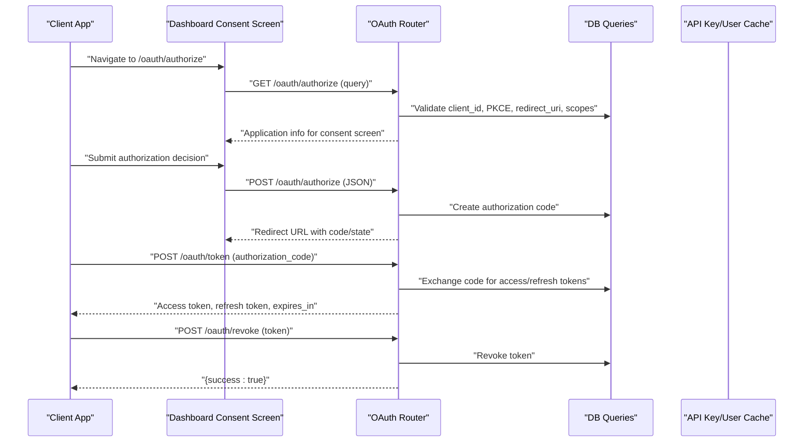

**Diagram sources**
- [oauth.ts](file://midday/apps/api/src/rest/routers/oauth.ts#L53-L318)
- [oauth.ts](file://midday/apps/api/src/rest/routers/oauth.ts#L320-L627)
- [api-keys.ts](file://midday/packages/db/src/queries/api-keys.ts#L16-L32)
- [api-key-cache.ts](file://midday/packages/cache/src/api-key-cache.ts#L1-L11)
- [user-cache.ts](file://midday/packages/cache/src/user-cache.ts#L1-L10)

## Detailed Component Analysis

### OAuth Authorization Endpoint
- Purpose: Initiate OAuth flow and return application metadata for the consent screen.
- Validation: Checks client_id, PKCE for public clients, redirect_uri, and scope validity.
- Response: Application info including name, description, logo, website, clientId, scopes, redirectUri, and optional state.

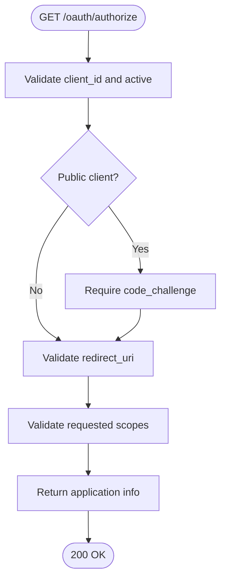

**Diagram sources**
- [oauth.ts](file://midday/apps/api/src/rest/routers/oauth.ts#L53-L141)
- [oauth-flow.ts](file://midday/apps/api/src/schemas/oauth-flow.ts#L4-L40)

**Section sources**
- [oauth.ts](file://midday/apps/api/src/rest/routers/oauth.ts#L53-L141)
- [oauth-flow.ts](file://midday/apps/api/src/schemas/oauth-flow.ts#L4-L40)

### OAuth Authorization Decision Endpoint
- Purpose: Process user’s allow/deny decision and issue an authorization code.
- Authentication: Requires Bearer token; verifies JWT and resolves session.
- Team Validation: Ensures user belongs to the selected team.
- Denial: Returns redirect with error code and description.
- Allow: Creates authorization code with PKCE challenge and redirects with code and state.

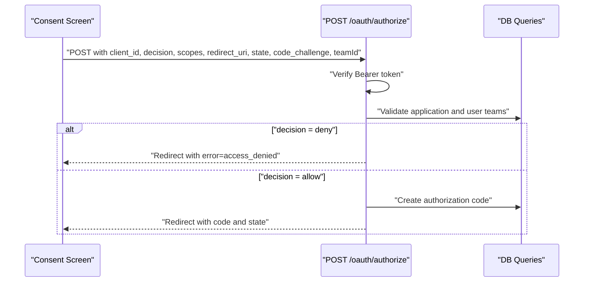

**Diagram sources**
- [oauth.ts](file://midday/apps/api/src/rest/routers/oauth.ts#L143-L318)
- [page.tsx](file://midday/apps/dashboard/src/app/[locale]/(app)/oauth/authorize/page.tsx#L36-L90)
- [oauth-consent-screen.tsx](file://midday/apps/dashboard/src/components/oauth/oauth-consent-screen.tsx#L32-L48)

**Section sources**
- [oauth.ts](file://midday/apps/api/src/rest/routers/oauth.ts#L143-L318)
- [page.tsx](file://midday/apps/dashboard/src/app/[locale]/(app)/oauth/authorize/page.tsx#L36-L90)
- [oauth-consent-screen.tsx](file://midday/apps/dashboard/src/components/oauth/oauth-consent-screen.tsx#L32-L48)

### OAuth Token Exchange Endpoint
- Purpose: Exchange authorization code for access/refresh tokens or refresh existing access token.
- Supported Grants:
  - authorization_code: Exchanges code for tokens; validates redirect_uri and PKCE code_verifier.
  - refresh_token: Issues new access/refresh tokens; supports optional scope narrowing.
- Error Handling: Provides granular error messages for expired/used/invalid codes and mismatched redirect_uri.

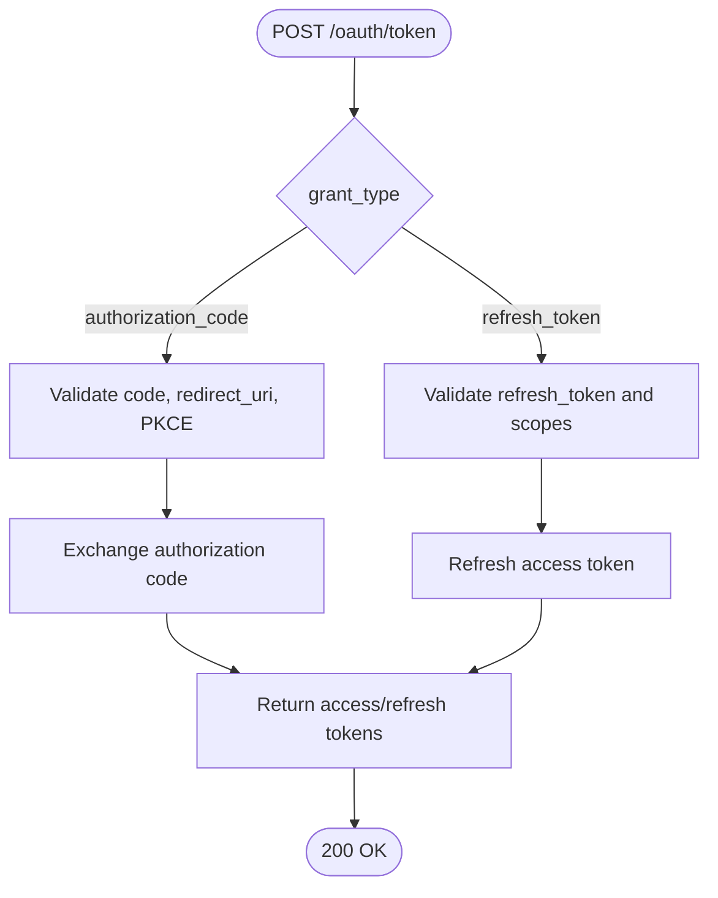

**Diagram sources**
- [oauth.ts](file://midday/apps/api/src/rest/routers/oauth.ts#L320-L546)
- [oauth-flow.ts](file://midday/apps/api/src/schemas/oauth-flow.ts#L51-L108)

**Section sources**
- [oauth.ts](file://midday/apps/api/src/rest/routers/oauth.ts#L320-L546)
- [oauth-flow.ts](file://midday/apps/api/src/schemas/oauth-flow.ts#L51-L108)

### OAuth Token Revocation Endpoint
- Purpose: Revoke access or refresh tokens for a client application.
- Client Validation: Enforces public vs. confidential client rules for client_secret.
- Effect: Marks token as revoked in the database.

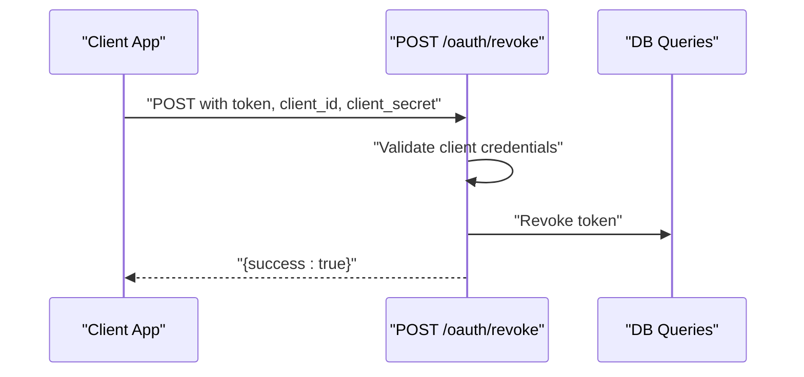

**Diagram sources**
- [oauth.ts](file://midday/apps/api/src/rest/routers/oauth.ts#L548-L627)

**Section sources**
- [oauth.ts](file://midday/apps/api/src/rest/routers/oauth.ts#L548-L627)

### API Key Management
- Creation: Generates a unique API key, stores encrypted value and hash, and returns plaintext key once.
- Retrieval: Lists keys for a team with user metadata and last used timestamps.
- Update: Modifies key name and scopes.
- Deletion: Removes key and invalidates cache by returning keyHash for cache deletion.
- Email Notification: Sends an email upon key creation.

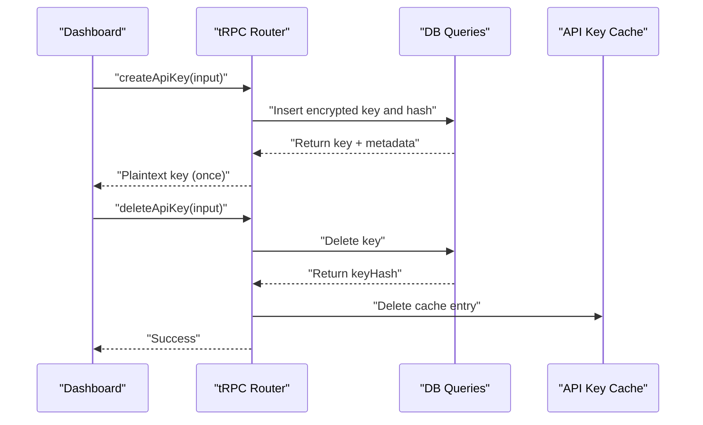

**Diagram sources**
- [api-keys.ts](file://midday/apps/api/src/trpc/routers/api-keys.ts#L37-L75)
- [api-keys.ts](file://midday/packages/db/src/queries/api-keys.ts#L42-L86)
- [api-key-cache.ts](file://midday/packages/cache/src/api-key-cache.ts#L1-L11)

**Section sources**
- [api-keys.ts](file://midday/apps/api/src/trpc/routers/api-keys.ts#L37-L75)
- [api-keys.ts](file://midday/packages/db/src/queries/api-keys.ts#L16-L130)
- [api-key-cache.ts](file://midday/packages/cache/src/api-key-cache.ts#L1-L11)

### User Session Handling and Middleware
- Supabase JWT: Verified via jose; session includes user metadata and resolved teamId.
- OAuth Access Tokens: Validated against DB; includes application context and expanded scopes.
- API Keys: Hashed and cached; user profile cached for performance; last used timestamp updated.
- Rate Limiting: Per-user rate limiter applied to protected routes.

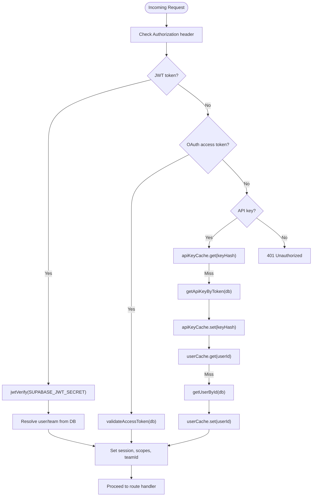

**Diagram sources**
- [auth.ts](file://midday/apps/api/src/rest/middleware/auth.ts#L16-L151)
- [auth.ts](file://midday/apps/api/src/utils/auth.ts#L20-L43)
- [oauth.ts](file://midday/apps/api/src/utils/oauth.ts#L10-L23)
- [api-key-cache.ts](file://midday/packages/cache/src/api-key-cache.ts#L1-L11)
- [user-cache.ts](file://midday/packages/cache/src/user-cache.ts#L1-L10)
- [index.ts](file://midday/apps/api/src/rest/middleware/index.ts#L26-L36)

**Section sources**
- [auth.ts](file://midday/apps/api/src/rest/middleware/auth.ts#L16-L151)
- [auth.ts](file://midday/apps/api/src/utils/auth.ts#L20-L43)
- [oauth.ts](file://midday/apps/api/src/utils/oauth.ts#L10-L23)
- [index.ts](file://midday/apps/api/src/rest/middleware/index.ts#L17-L36)

### MFA Verification Endpoints
- Enrollment: Creates a TOTP factor and QR code for setup.
- Challenge/Verify: Issues a challenge, then verifies the submitted code.
- Add New Device: Enrolls a new TOTP factor and cleans up on cancel.

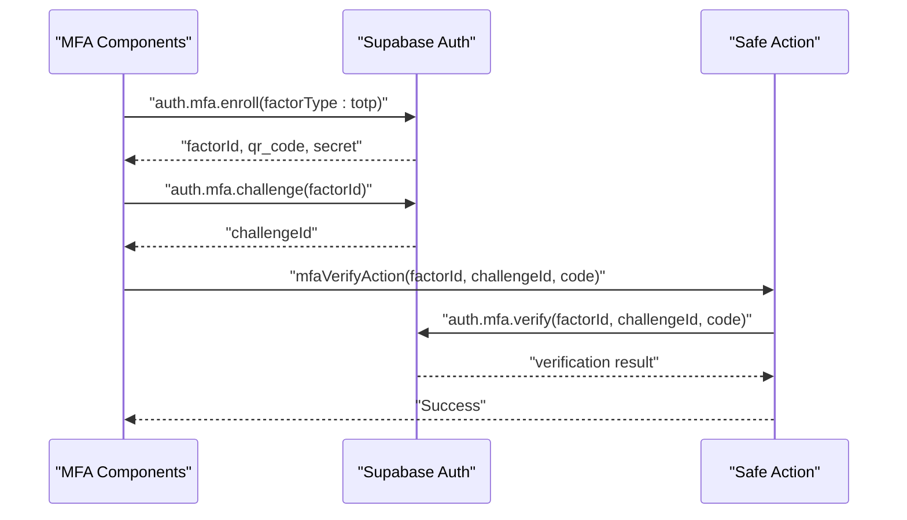

**Diagram sources**
- [enroll-mfa.tsx](file://midday/apps/dashboard/src/components/enroll-mfa.tsx#L34-L96)
- [verify-mfa.tsx](file://midday/apps/dashboard/src/components/verify-mfa.tsx#L15-L71)
- [add-new-device.tsx](file://midday/apps/dashboard/src/components/modals/add-new-device.tsx#L33-L50)
- [mfa-verify-action.ts](file://midday/apps/dashboard/src/actions/mfa-verify-action.ts#L23-L38)

**Section sources**
- [enroll-mfa.tsx](file://midday/apps/dashboard/src/components/enroll-mfa.tsx#L34-L96)
- [verify-mfa.tsx](file://midday/apps/dashboard/src/components/verify-mfa.tsx#L15-L71)
- [add-new-device.tsx](file://midday/apps/dashboard/src/components/modals/add-new-device.tsx#L33-L50)
- [mfa-verify-action.ts](file://midday/apps/dashboard/src/actions/mfa-verify-action.ts#L23-L38)

### Frontend OAuth Callback and Consent Handling
- Consent Screen: Renders application info and scope list; allows team selection.
- Popup Flow: Opens OAuth URL in a popup, monitors completion/error, handles timeouts, and closes popup appropriately.
- State Parameter: Enforced for CSRF protection and echoed back on redirect.

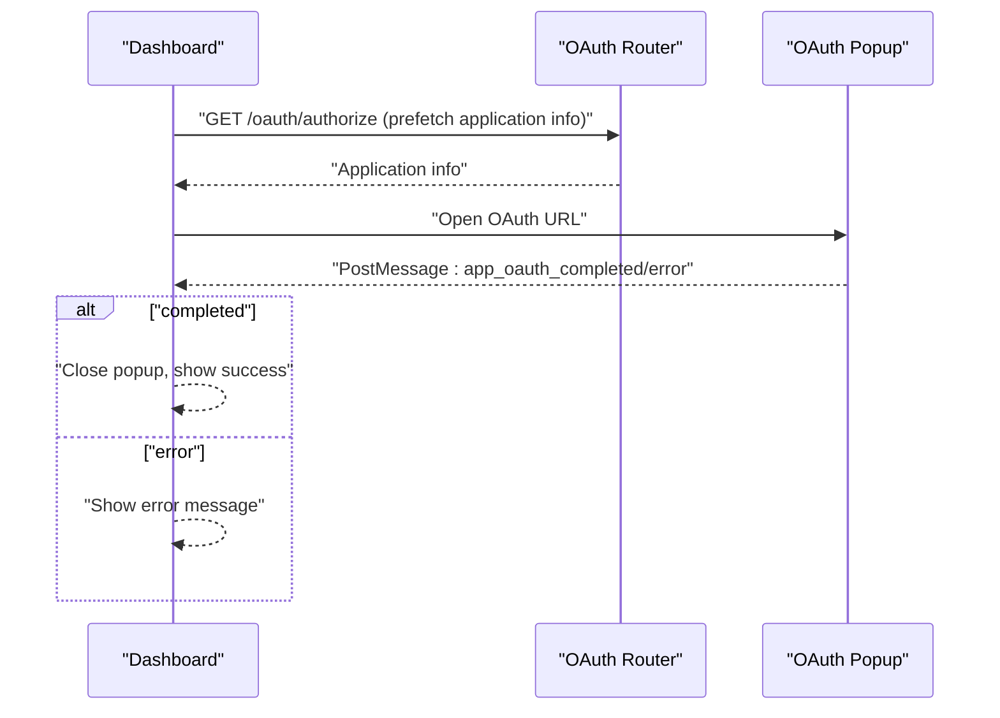

**Diagram sources**
- [page.tsx](file://midday/apps/dashboard/src/app/[locale]/(app)/oauth/authorize/page.tsx#L36-L90)
- [oauth-consent-screen.tsx](file://midday/apps/dashboard/src/components/oauth/oauth-consent-screen.tsx#L32-L48)
- [use-app-oauth.ts](file://midday/apps/dashboard/src/hooks/use-app-oauth.ts#L49-L166)

**Section sources**
- [page.tsx](file://midday/apps/dashboard/src/app/[locale]/(app)/oauth/authorize/page.tsx#L36-L90)
- [oauth-consent-screen.tsx](file://midday/apps/dashboard/src/components/oauth/oauth-consent-screen.tsx#L32-L48)
- [use-app-oauth.ts](file://midday/apps/dashboard/src/hooks/use-app-oauth.ts#L49-L166)

## Dependency Analysis
- Router depends on:
  - Auth utils for JWT verification
  - OAuth utils for client credential validation
  - DB queries for authorization codes, tokens, and application metadata
  - Caches for API key and user data
- Middleware composes:
  - Public middleware for unauthenticated routes
  - Protected middleware with rate limiting and unified auth
- Frontend components depend on:
  - Supabase client for MFA operations
  - tRPC for API key management
  - Session caching to avoid concurrent token refresh locks

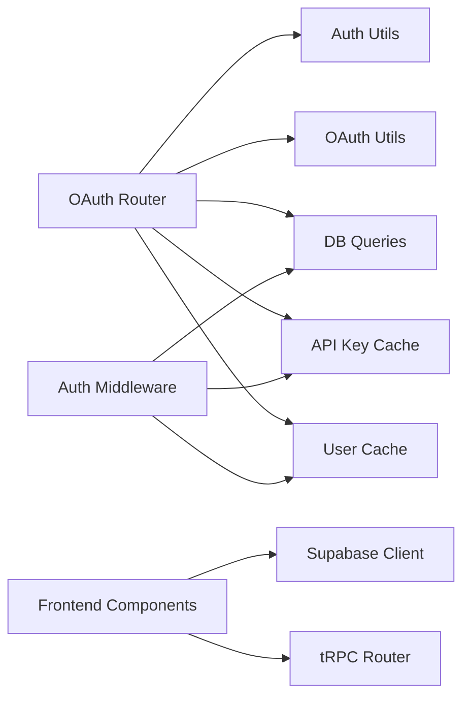

**Diagram sources**
- [oauth.ts](file://midday/apps/api/src/rest/routers/oauth.ts#L1-L630)
- [auth.ts](file://midday/apps/api/src/rest/middleware/auth.ts#L1-L152)
- [api-keys.ts](file://midday/apps/api/src/trpc/routers/api-keys.ts#L37-L75)
- [middleware.ts](file://midday/packages/supabase/src/client/middleware.ts#L1-L43)

**Section sources**
- [oauth.ts](file://midday/apps/api/src/rest/routers/oauth.ts#L1-L630)
- [auth.ts](file://midday/apps/api/src/rest/middleware/auth.ts#L1-L152)
- [middleware.ts](file://midday/packages/supabase/src/client/middleware.ts#L1-L43)

## Performance Considerations
- Caching:
  - API key cache: 30-minute TTL to reduce DB lookups.
  - User cache: 30-minute TTL for user profiles accessed via API keys.
- Supabase Session Caching:
  - Single subscription to onAuthStateChange to avoid concurrent token refresh locks.
- Rate Limiting:
  - 100 requests per 10 minutes per user on protected routes.
  - 20 requests per 15 minutes per IP on OAuth endpoints.

**Section sources**
- [api-key-cache.ts](file://midday/packages/cache/src/api-key-cache.ts#L1-L11)
- [user-cache.ts](file://midday/packages/cache/src/user-cache.ts#L1-L10)
- [session.ts](file://midday/apps/dashboard/src/utils/session.ts#L1-L42)
- [index.ts](file://midday/apps/api/src/rest/middleware/index.ts#L26-L36)
- [oauth.ts](file://midday/apps/api/src/rest/routers/oauth.ts#L41-L51)

## Troubleshooting Guide
- OAuth Authorization:
  - Invalid client_id or inactive application: Ensure application registration and activation.
  - PKCE requirement for public clients: Provide code_challenge and code_verifier during token exchange.
  - Redirect URI mismatch: Ensure redirect_uri matches registered URIs.
  - Authorization code expired/already used: Restart OAuth flow.
- Token Exchange:
  - Invalid refresh token/expired/revoked: Re-authenticate user and obtain a new refresh token.
  - Unsupported grant type: Use authorization_code or refresh_token.
- Token Revocation:
  - Invalid client credentials: Confirm client_secret for confidential clients; omit for public clients.
- API Keys:
  - Invalid API key: Verify key format and existence; check cache invalidation after deletion.
  - Rate limit exceeded: Reduce request frequency or adjust limits.
- MFA:
  - Challenge failure: Ensure correct factorId and challengeId pairing.
  - Verification error: Confirm code freshness and authenticator app synchronization.

**Section sources**
- [oauth.ts](file://midday/apps/api/src/rest/routers/oauth.ts#L413-L479)
- [oauth.ts](file://midday/apps/api/src/rest/routers/oauth.ts#L482-L540)
- [oauth.ts](file://midday/apps/api/src/rest/routers/oauth.ts#L595-L626)
- [auth.ts](file://midday/apps/api/src/rest/middleware/auth.ts#L96-L151)
- [verify-mfa.tsx](file://midday/apps/dashboard/src/components/verify-mfa.tsx#L44-L64)

## Conclusion
The system provides a robust, standards-compliant authentication and OAuth framework with:
- Secure PKCE-enabled authorization flows
- Unified token handling for JWT, OAuth access tokens, and API keys
- Comprehensive MFA support
- Strong security measures including rate limiting, state validation, and cache-backed lookups
- Clear error handling and frontend integration for consent and callbacks