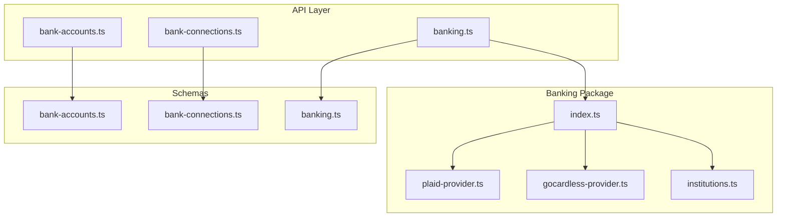
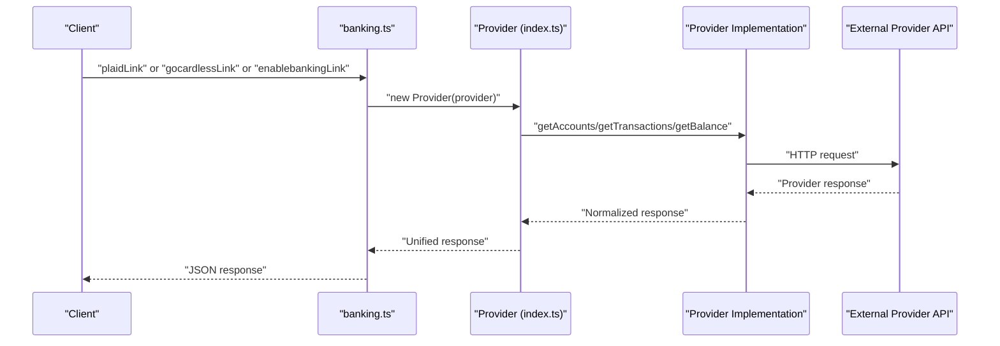
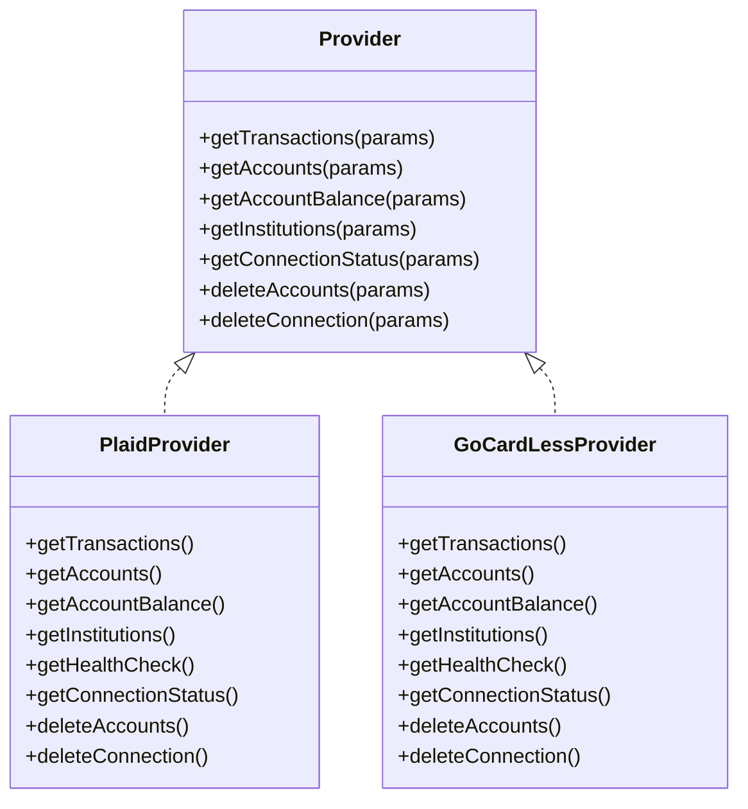

# Bank Account Management Endpoints

<cite>
**Referenced Files in This Document**
- [bank-accounts.ts](file://midday/apps/api/src/trpc/routers/bank-accounts.ts)
- [bank-connections.ts](file://midday/apps/api/src/trpc/routers/bank-connections.ts)
- [banking.ts](file://midday/apps/api/src/trpc/routers/banking.ts)
- [bank-accounts.ts](file://midday/apps/api/src/schemas/bank-accounts.ts)
- [bank-connections.ts](file://midday/apps/api/src/schemas/bank-connections.ts)
- [banking.ts](file://midday/apps/api/src/schemas/banking.ts)
- [index.ts](file://midday/packages/banking/src/index.ts)
- [institutions.ts](file://midday/packages/banking/src/institutions.ts)
- [plaid-provider.ts](file://midday/packages/banking/src/providers/plaid/plaid-provider.ts)
- [gocardless-provider.ts](file://midday/packages/banking/src/providers/gocardless/gocardless-provider.ts)
- [enablebanking-link route.ts](file://midday/apps/dashboard/src/app/api/enablebanking/session/route.ts)
- [format-bank-details.ts](file://midday/apps/dashboard/src/components/invoice/utils/format-bank-details.ts)
</cite>

## Table of Contents
1. [Introduction](#introduction)
2. [Project Structure](#project-structure)
3. [Core Components](#core-components)
4. [Architecture Overview](#architecture-overview)
5. [Detailed Component Analysis](#detailed-component-analysis)
6. [Dependency Analysis](#dependency-analysis)
7. [Performance Considerations](#performance-considerations)
8. [Troubleshooting Guide](#troubleshooting-guide)
9. [Conclusion](#conclusion)
10. [Appendices](#appendices)

## Introduction
This document provides comprehensive API documentation for bank account management, covering bank connection setup, account linking, credential management, synchronization, transaction fetching, and balance updates. It documents integrations with Plaid, GoCardless (Yodlee), Enable Banking, and Teller, along with multi-account management, consolidated reporting, verification, switching, and troubleshooting. Security and compliance considerations, including encrypted credentials, are addressed alongside practical examples for onboarding, automated reconciliation, and financial institution integrations.

## Project Structure
The bank account management system spans three primary areas:
- API Layer: tRPC routers exposing bank account, connection, and provider orchestration endpoints
- Schemas: OpenAPI/Zod schemas defining request/response contracts
- Banking Package: Provider abstraction and implementations for Plaid, GoCardless, Enable Banking, and Teller

**Diagram sources**
- [bank-accounts.ts](file://midday/apps/api/src/trpc/routers/bank-accounts.ts#L1-L124)
- [bank-connections.ts](file://midday/apps/api/src/trpc/routers/bank-connections.ts#L1-L124)
- [banking.ts](file://midday/apps/api/src/trpc/routers/banking.ts#L1-L381)
- [bank-accounts.ts](file://midday/apps/api/src/schemas/bank-accounts.ts#L1-L193)
- [bank-connections.ts](file://midday/apps/api/src/schemas/bank-connections.ts#L1-L83)
- [banking.ts](file://midday/apps/api/src/schemas/banking.ts#L1-L92)
- [index.ts](file://midday/packages/banking/src/index.ts#L1-L157)
- [institutions.ts](file://midday/packages/banking/src/institutions.ts#L1-L196)
- [plaid-provider.ts](file://midday/packages/banking/src/providers/plaid/plaid-provider.ts#L1-L125)
- [gocardless-provider.ts](file://midday/packages/banking/src/providers/gocardless/gocardless-provider.ts#L1-L113)

**Section sources**
- [bank-accounts.ts](file://midday/apps/api/src/trpc/routers/bank-accounts.ts#L1-L124)
- [bank-connections.ts](file://midday/apps/api/src/trpc/routers/bank-connections.ts#L1-L124)
- [banking.ts](file://midday/apps/api/src/trpc/routers/banking.ts#L1-L381)
- [bank-accounts.ts](file://midday/apps/api/src/schemas/bank-accounts.ts#L1-L193)
- [bank-connections.ts](file://midday/apps/api/src/schemas/bank-connections.ts#L1-L83)
- [banking.ts](file://midday/apps/api/src/schemas/banking.ts#L1-L92)
- [index.ts](file://midday/packages/banking/src/index.ts#L1-L157)
- [institutions.ts](file://midday/packages/banking/src/institutions.ts#L1-L196)
- [plaid-provider.ts](file://midday/packages/banking/src/providers/plaid/plaid-provider.ts#L1-L125)
- [gocardless-provider.ts](file://midday/packages/banking/src/providers/gocardless/gocardless-provider.ts#L1-L113)

## Core Components
- Bank Accounts Router: CRUD and metadata queries for bank accounts, including balances, currencies, and transaction counts
- Bank Connections Router: Create, delete, reconnect, and add provider accounts to connections
- Banking Router: Provider orchestration for Plaid, GoCardless, Enable Banking, and Teller; institution discovery; health checks; transaction and balance retrieval
- Provider Abstraction: Unified interface for provider operations with provider-specific implementations
- Schemas: Strongly typed request/response contracts for all endpoints

Key responsibilities:
- Onboarding: Create connections, build provider links, exchange tokens, and add accounts
- Synchronization: Retrieve accounts, balances, and transactions via provider APIs
- Multi-account management: List, update, and delete accounts; reconcile balances
- Reporting: Consolidated balances and currencies per team
- Security: Provider token handling and encrypted credential storage

**Section sources**
- [bank-accounts.ts](file://midday/apps/api/src/trpc/routers/bank-accounts.ts#L23-L123)
- [bank-connections.ts](file://midday/apps/api/src/trpc/routers/bank-connections.ts#L24-L123)
- [banking.ts](file://midday/apps/api/src/trpc/routers/banking.ts#L35-L380)
- [index.ts](file://midday/packages/banking/src/index.ts#L18-L136)
- [bank-accounts.ts](file://midday/apps/api/src/schemas/bank-accounts.ts#L3-L29)
- [bank-connections.ts](file://midday/apps/api/src/schemas/bank-connections.ts#L7-L45)
- [banking.ts](file://midday/apps/api/src/schemas/banking.ts#L19-L91)

## Architecture Overview
The system uses a provider-agnostic router that delegates to provider-specific implementations. The banking router orchestrates provider operations, while the accounts and connections routers manage local records and lifecycle events.

**Diagram sources**
- [banking.ts](file://midday/apps/api/src/trpc/routers/banking.ts#L36-L211)
- [index.ts](file://midday/packages/banking/src/index.ts#L18-L136)
- [plaid-provider.ts](file://midday/packages/banking/src/providers/plaid/plaid-provider.ts#L20-L124)
- [gocardless-provider.ts](file://midday/packages/banking/src/providers/gocardless/gocardless-provider.ts#L20-L112)

## Detailed Component Analysis

### Bank Accounts Endpoints
Purpose: Manage local bank account records and related metadata.

Endpoints:
- GET /bank-accounts
  - Filters: enabled, manual
  - Response: Array of bank accounts with id, name, currency, type, enabled, balance, manual
- GET /bank-accounts/{id}/details
  - Returns decrypted account details (IBAN, account numbers) when explicitly requested
- GET /bank-accounts/with-payment-info
  - Returns accounts with at least one payment field populated
- GET /bank-accounts/currencies
  - Returns distinct currencies for team accounts
- GET /bank-accounts/balances
  - Returns consolidated balances per account
- GET /bank-accounts/{id}/transactions/count
  - Returns transaction count for a specific account
- POST /bank-accounts
  - Creates a new bank account (manual or linked)
- PUT /bank-accounts/{id}
  - Updates name, enabled flag, balance, currency, type
- DELETE /bank-accounts/{id}
  - Deletes an account and invalidates cached team context

Security and compliance:
- Protected procedures enforce team scoping
- Decrypted details are only exposed on explicit request
- Manual accounts supported for custom integrations

Operational notes:
- Balances and currencies are derived from local records; provider balances are refreshed via provider endpoints
- Transaction counts are computed locally

**Section sources**
- [bank-accounts.ts](file://midday/apps/api/src/trpc/routers/bank-accounts.ts#L24-L122)
- [bank-accounts.ts](file://midday/apps/api/src/schemas/bank-accounts.ts#L3-L29)
- [bank-accounts.ts](file://midday/apps/api/src/schemas/bank-accounts.ts#L31-L83)
- [bank-accounts.ts](file://midday/apps/api/src/schemas/bank-accounts.ts#L129-L193)

### Bank Connections Endpoints
Purpose: Manage provider connections and lifecycle operations.

Endpoints:
- GET /bank-connections
  - Filters: enabled
  - Response: Array of connections with provider, reference IDs, and account summaries
- POST /bank-connections
  - Creates a connection record and triggers initial setup job
- DELETE /bank-connections/{id}
  - Deletes connection and triggers provider-side deletion via job
- POST /bank-connections/add-accounts
  - Adds provider accounts to an existing connection
- POST /bank-connections/reconnect
  - Updates reference IDs and expiry for reconnect scenarios

Provider-specific fields:
- Plaid/Teller: accessToken, enrollmentId
- GoCardless: referenceId
- Enable Banking: accountReference, expiresAt

Operational notes:
- Jobs are triggered for initial setup and connection deletion
- Reconnect updates reference IDs and expiry for continuity

**Section sources**
- [bank-connections.ts](file://midday/apps/api/src/trpc/routers/bank-connections.ts#L25-L122)
- [bank-connections.ts](file://midday/apps/api/src/schemas/bank-connections.ts#L7-L45)
- [bank-connections.ts](file://midday/apps/api/src/schemas/bank-connections.ts#L49-L82)

### Banking Provider Orchestration
Purpose: Unified access to provider operations across Plaid, GoCardless, Enable Banking, and Teller.

Key endpoints:
- Plaid
  - plaidLink: Create Plaid Link session token
  - plaidExchange: Exchange public token for access token
- GoCardless
  - gocardlessLink: Build consent link with institution and agreement
  - gocardlessAgreement: Create end-user agreement
- Enable Banking
  - enablebankingLink: Build authentication URL with institution, country, and validity
  - enablebankingExchange: Exchange authorization code for session details
- Provider Operations
  - getProviderAccounts: Retrieve accounts from provider
  - getBalance: Retrieve account balance
  - getProviderTransactions: Fetch transactions
  - connectionStatus: Check connection health
  - deleteConnection: Remove provider connection
  - connectionByReference: Resolve GoCardless requisition by reference
  - rates: Retrieve exchange rates

Provider abstraction:
- Provider class routes calls to specific implementations
- Health checks performed in parallel across providers
- Institution discovery aggregates across providers

**Section sources**
- [banking.ts](file://midday/apps/api/src/trpc/routers/banking.ts#L36-L380)
- [banking.ts](file://midday/apps/api/src/schemas/banking.ts#L19-L91)
- [index.ts](file://midday/packages/banking/src/index.ts#L18-L136)
- [institutions.ts](file://midday/packages/banking/src/institutions.ts#L163-L195)

### Provider Implementations

#### Plaid Provider
Capabilities:
- Transactions: Fetch transactions with optional latest-only
- Accounts: Retrieve accounts for an institution
- Balances: Fetch balances and infer account type
- Institutions: Discover institutions with logos and metadata
- Health check: Verify provider availability
- Connection management: Delete accounts and connection status

Security:
- Uses provider access tokens and account IDs
- Validates required parameters before API calls

**Section sources**
- [plaid-provider.ts](file://midday/packages/banking/src/providers/plaid/plaid-provider.ts#L20-L124)

#### GoCardless Provider
Capabilities:
- Transactions: Fetch transactions by account ID
- Accounts: Retrieve accounts by requisition ID
- Balances: Fetch primary and detailed balances
- Institutions: Discover institutions by country code
- Health check: Verify provider availability
- Connection management: Delete requisition and fetch status

**Section sources**
- [gocardless-provider.ts](file://midday/packages/banking/src/providers/gocardless/gocardless-provider.ts#L20-L112)

### Institution Discovery and Aggregation
- fetchAllInstitutions: Concurrently fetches institutions from all providers
- Merges provider responses with normalized fields (id, name, logo, provider, countries, popularity)
- Provides success/failure tracking per provider

Supported providers:
- Enable Banking
- GoCardless
- Plaid
- Teller

**Section sources**
- [institutions.ts](file://midday/packages/banking/src/institutions.ts#L163-L195)

### Enable Banking Integration
- Authentication URL building with institution, country, and consent validity
- Authorization code exchange for session details (accounts, expiry)
- Country selection logic based on institution’s supported countries
- Consent validity defaults applied when provider does not specify

**Section sources**
- [banking.ts](file://midday/apps/api/src/trpc/routers/banking.ts#L128-L185)
- [banking.ts](file://midday/apps/api/src/trpc/routers/banking.ts#L187-L211)
- [institutions.ts](file://midday/packages/banking/src/institutions.ts#L30-L55)

### Dashboard Enable Banking Session Route
- Backend route to establish Enable Banking sessions for the UI
- Integrates with the Enable Banking API to generate session URLs

**Section sources**
- [enablebanking-link route.ts](file://midday/apps/dashboard/src/app/api/enablebanking/session/route.ts)

### Bank Account Verification and Payment Details
- Payment info retrieval filters accounts with populated payment fields
- Invoice-related bank details formatting utilities support payment workflows

**Section sources**
- [bank-accounts.ts](file://midday/apps/api/src/trpc/routers/bank-accounts.ts#L62-L67)
- [format-bank-details.ts](file://midday/apps/dashboard/src/components/invoice/utils/format-bank-details.ts)

## Dependency Analysis

**Diagram sources**
- [index.ts](file://midday/packages/banking/src/index.ts#L18-L136)
- [plaid-provider.ts](file://midday/packages/banking/src/providers/plaid/plaid-provider.ts#L20-L124)
- [gocardless-provider.ts](file://midday/packages/banking/src/providers/gocardless/gocardless-provider.ts#L20-L112)

**Section sources**
- [index.ts](file://midday/packages/banking/src/index.ts#L18-L136)
- [plaid-provider.ts](file://midday/packages/banking/src/providers/plaid/plaid-provider.ts#L20-L124)
- [gocardless-provider.ts](file://midday/packages/banking/src/providers/gocardless/gocardless-provider.ts#L20-L112)

## Performance Considerations
- Parallel health checks across providers reduce latency for monitoring
- Sorting accounts by balance in provider accounts endpoint improves UX ordering
- Caching invalidated after account/connection changes to prevent stale data
- Batch institution fetching reduces repeated provider calls

## Troubleshooting Guide
Common issues and resolutions:
- Provider token errors
  - Ensure accessToken and accountId are present for provider operations
  - Verify token exchange completed successfully for Plaid and Enable Banking
- Institution lookup failures
  - Confirm institution ID exists and matches provider
  - Check country selection logic for Enable Banking
- Connection deletion
  - Trigger delete job with correct provider and reference/access tokens
- Transaction and balance retrieval
  - Validate account type and latest flag for transaction fetch
  - Confirm account ownership and enabled state

**Section sources**
- [plaid-provider.ts](file://midday/packages/banking/src/providers/plaid/plaid-provider.ts#L32-L48)
- [gocardless-provider.ts](file://midday/packages/banking/src/providers/gocardless/gocardless-provider.ts#L31-L47)
- [banking.ts](file://midday/apps/api/src/trpc/routers/banking.ts#L236-L257)

## Conclusion
The bank account management system provides a robust, provider-agnostic API for onboarding, synchronization, and reporting. It supports multiple integrations, secure credential handling, and operational controls for multi-account management and reconciliation workflows.

## Appendices

### API Reference Summary

- Bank Accounts
  - GET /bank-accounts
  - GET /bank-accounts/{id}/details
  - GET /bank-accounts/with-payment-info
  - GET /bank-accounts/currencies
  - GET /bank-accounts/balances
  - GET /bank-accounts/{id}/transactions/count
  - POST /bank-accounts
  - PUT /bank-accounts/{id}
  - DELETE /bank-accounts/{id}

- Bank Connections
  - GET /bank-connections
  - POST /bank-connections
  - DELETE /bank-connections/{id}
  - POST /bank-connections/add-accounts
  - POST /bank-connections/reconnect

- Banking (Provider Orchestration)
  - POST /banking/plaid-link
  - POST /banking/plaid-exchange
  - POST /banking/gocardless-link
  - POST /banking/gocardless-agreement
  - POST /banking/enablebanking-link
  - POST /banking/enablebanking-exchange
  - GET /banking/connection-status
  - DELETE /banking/delete-connection
  - GET /banking/connection-by-reference
  - GET /banking/provider-accounts
  - GET /banking/balance
  - GET /banking/provider-transactions
  - GET /banking/rates

**Section sources**
- [bank-accounts.ts](file://midday/apps/api/src/trpc/routers/bank-accounts.ts#L24-L122)
- [bank-connections.ts](file://midday/apps/api/src/trpc/routers/bank-connections.ts#L25-L122)
- [banking.ts](file://midday/apps/api/src/trpc/routers/banking.ts#L36-L380)