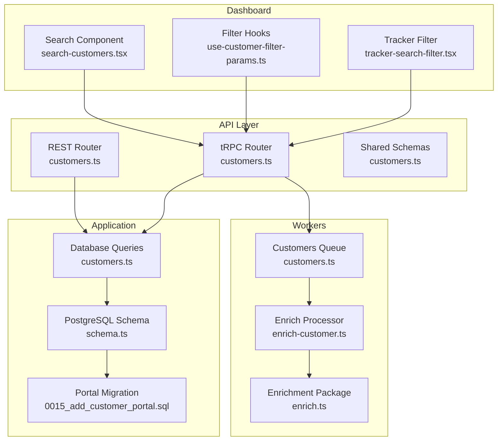
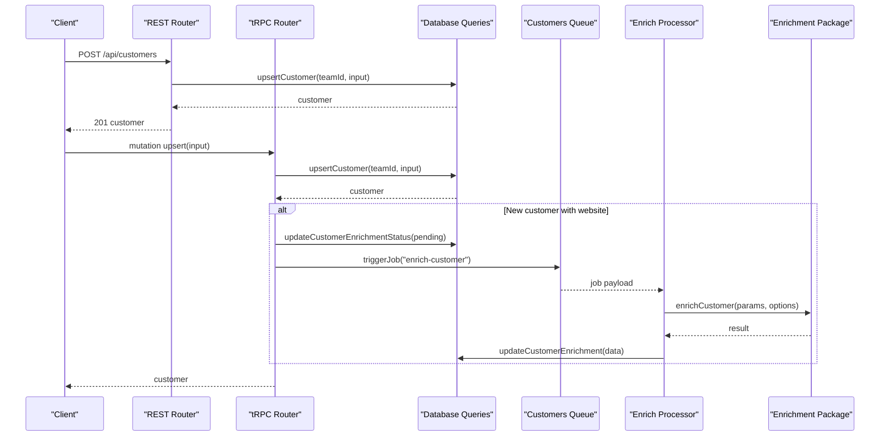
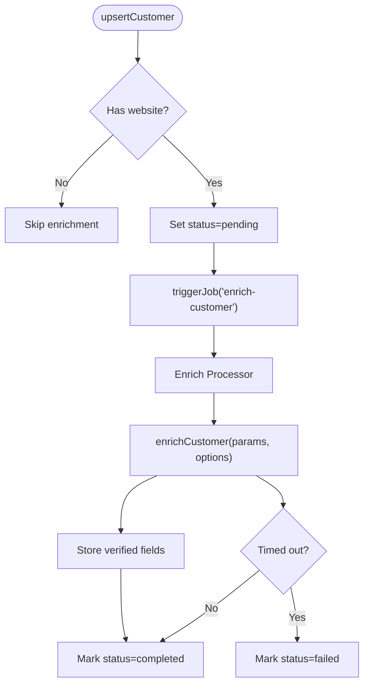
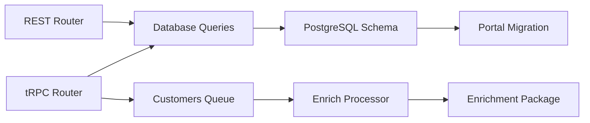

# Customer Management Endpoints

<cite>
**Referenced Files in This Document**
- [customers.ts](file://apps/api/src/rest/routers/customers.ts)
- [customers.ts](file://apps/api/src/trpc/routers/customers.ts)
- [customers.ts](file://apps/api/src/schemas/customers.ts)
- [customers.ts](file://apps/api/src/mcp/tools/customers.ts)
- [customers.ts](file://packages/db/src/queries/customers.ts)
- [schema.ts](file://packages/db/src/schema.ts)
- [0015_add_customer_portal.sql](file://packages/db/migrations/0015_add_customer_portal.sql)
- [enrich-customer.ts](file://apps/worker/src/processors/customers/enrich-customer.ts)
- [customers.ts](file://apps/worker/src/queues/customers.ts)
- [customers.config.ts](file://apps/worker/src/queues/customers.config.ts)
- [enrich.ts](file://packages/customers/src/enrichment/enrich.ts)
- [schema.ts](file://packages/customers/src/enrichment/schema.ts)
- [search-customers.tsx](file://apps/dashboard/src/components/search-customers.tsx)
- [use-customer-filter-params.ts](file://apps/dashboard/src/hooks/use-customer-filter-params.ts)
- [tracker-search-filter.tsx](file://apps/dashboard/src/components/tracker-search-filter.tsx)
</cite>

## Table of Contents
1. [Introduction](#introduction)
2. [Project Structure](#project-structure)
3. [Core Components](#core-components)
4. [Architecture Overview](#architecture-overview)
5. [Detailed Component Analysis](#detailed-component-analysis)
6. [Dependency Analysis](#dependency-analysis)
7. [Performance Considerations](#performance-considerations)
8. [Troubleshooting Guide](#troubleshooting-guide)
9. [Conclusion](#conclusion)
10. [Appendices](#appendices)

## Introduction
This document provides comprehensive API documentation for customer management endpoints. It covers customer creation, profile updates, contact management, segmentation via tags, relationship management, search and filtering, portal access, enrichment, lifecycle management, activity tracking, and value calculations. It also outlines portal integration, self-service features, and support workflows, along with examples for onboarding, relationship management, and automated workflows.

## Project Structure
The customer management system spans REST and tRPC routers, shared schemas, database queries, worker-based enrichment, and dashboard integrations:
- REST endpoints under the API service expose CRUD and portal operations.
- tRPC procedures centralize business logic, including enrichment orchestration and portal access.
- Shared schemas define request/response contracts for validation and OpenAPI generation.
- Database queries encapsulate data access and aggregation (metrics, tags, portal fields).
- Worker queues handle asynchronous enrichment tasks.
- Dashboard components integrate search, filters, and customer selection.

**Diagram sources**
- [customers.ts](file://apps/api/src/rest/routers/customers.ts#L1-L222)
- [customers.ts](file://apps/api/src/trpc/routers/customers.ts#L1-L263)
- [customers.ts](file://apps/api/src/schemas/customers.ts#L1-L513)
- [customers.ts](file://packages/db/src/queries/customers.ts#L75-L516)
- [schema.ts](file://packages/db/src/schema.ts#L603-L625)
- [0015_add_customer_portal.sql](file://packages/db/migrations/0015_add_customer_portal.sql#L1-L13)
- [customers.ts](file://apps/worker/src/queues/customers.ts#L1-L13)
- [enrich-customer.ts](file://apps/worker/src/processors/customers/enrich-customer.ts#L1-L159)
- [enrich.ts](file://packages/customers/src/enrichment/enrich.ts#L1-L127)
- [search-customers.tsx](file://apps/dashboard/src/components/search-customers.tsx#L1-L75)
- [use-customer-filter-params.ts](file://apps/dashboard/src/hooks/use-customer-filter-params.ts#L1-L23)
- [tracker-search-filter.tsx](file://apps/dashboard/src/components/tracker-search-filter.tsx#L243-L279)

**Section sources**
- [customers.ts](file://apps/api/src/rest/routers/customers.ts#L1-L222)
- [customers.ts](file://apps/api/src/trpc/routers/customers.ts#L1-L263)
- [customers.ts](file://apps/api/src/schemas/customers.ts#L1-L513)
- [customers.ts](file://packages/db/src/queries/customers.ts#L75-L516)
- [schema.ts](file://packages/db/src/schema.ts#L603-L625)
- [0015_add_customer_portal.sql](file://packages/db/migrations/0015_add_customer_portal.sql#L1-L13)
- [customers.ts](file://apps/worker/src/queues/customers.ts#L1-L13)
- [enrich-customer.ts](file://apps/worker/src/processors/customers/enrich-customer.ts#L1-L159)
- [enrich.ts](file://packages/customers/src/enrichment/enrich.ts#L1-L127)
- [search-customers.tsx](file://apps/dashboard/src/components/search-customers.tsx#L1-L75)
- [use-customer-filter-params.ts](file://apps/dashboard/src/hooks/use-customer-filter-params.ts#L1-L23)
- [tracker-search-filter.tsx](file://apps/dashboard/src/components/tracker-search-filter.tsx#L243-L279)

## Core Components
- REST customer endpoints: list, create, retrieve, update, delete.
- tRPC customer procedures: list, get, upsert, delete, enrich, portal toggling, portal retrieval, portal invoices.
- Shared schemas: customer input/output, list/query parameters, portal toggling, portal invoice retrieval.
- Database queries: customer aggregation with metrics, tags, portal fields; upsert with tag reconciliation; portal lookups.
- Worker-based enrichment: orchestration, timeouts, retries, verification.
- Dashboard integrations: customer search, filters, and tracker filter integration.

**Section sources**
- [customers.ts](file://apps/api/src/rest/routers/customers.ts#L21-L219)
- [customers.ts](file://apps/api/src/trpc/routers/customers.ts#L35-L262)
- [customers.ts](file://apps/api/src/schemas/customers.ts#L4-L306)
- [customers.ts](file://packages/db/src/queries/customers.ts#L75-L516)
- [enrich-customer.ts](file://apps/worker/src/processors/customers/enrich-customer.ts#L31-L159)

## Architecture Overview
The system exposes REST endpoints for admin clients and tRPC procedures for internal use and the dashboard. tRPC procedures coordinate enrichment jobs and portal access, while database queries aggregate metrics and manage tags. Workers asynchronously enrich customer data using an agent-based pipeline.

**Diagram sources**
- [customers.ts](file://apps/api/src/rest/routers/customers.ts#L60-L102)
- [customers.ts](file://apps/api/src/trpc/routers/customers.ts#L63-L105)
- [customers.ts](file://packages/db/src/queries/customers.ts#L420-L509)
- [enrich-customer.ts](file://apps/worker/src/processors/customers/enrich-customer.ts#L31-L127)
- [enrich.ts](file://packages/customers/src/enrichment/enrich.ts#L119-L127)

## Detailed Component Analysis

### REST Customer Endpoints
- List customers: GET /api/customers with query parameters for search, sorting, pagination.
- Create customer: POST /api/customers with upsert schema payload.
- Retrieve customer: GET /api/customers/{id}.
- Update customer: PATCH /api/customers/{id}.
- Delete customer: DELETE /api/customers/{id}.

Validation and OpenAPI schemas are defined centrally and reused across routes.

**Section sources**
- [customers.ts](file://apps/api/src/rest/routers/customers.ts#L21-L219)
- [customers.ts](file://apps/api/src/schemas/customers.ts#L4-L61)
- [customers.ts](file://apps/api/src/schemas/customers.ts#L378-L475)

### tRPC Customer Procedures
- get: protected query to fetch paginated customers.
- getById: protected query to fetch a single customer by ID.
- delete: protected mutation to delete a customer.
- upsert: protected mutation to create/update customer; auto-enriches new customers with website.
- getInvoiceSummary: protected query to compute invoice totals and counts.
- enrich/cancelEnrichment/clearEnrichment: enrichment lifecycle controls.
- togglePortal: enable/disable customer portal and generate portalId.
- getByPortalId: public lookup by portalId with invoice summary.
- getPortalInvoices: public pagination of invoices for portal.

tRPC procedures enforce scopes and team isolation, and coordinate with workers and database.

**Section sources**
- [customers.ts](file://apps/api/src/trpc/routers/customers.ts#L35-L262)
- [customers.ts](file://apps/api/src/schemas/customers.ts#L107-L154)
- [customers.ts](file://apps/api/src/schemas/customers.ts#L477-L512)

### Customer Data Model and Aggregation
- Core fields: identifiers, contact info, address, VAT, notes, tags, enrichment metadata, portal flags.
- Aggregated metrics: invoiceCount, projectCount, financial summaries (revenue, outstanding, lastInvoiceDate, currency).
- Tag association via customer_tags join table with cascading deletes.
- Portal fields: portal_enabled, portal_id with unique index for fast lookups.

**Section sources**
- [customers.ts](file://apps/api/src/schemas/customers.ts#L63-L279)
- [customers.ts](file://packages/db/src/queries/customers.ts#L75-L106)
- [schema.ts](file://packages/db/src/schema.ts#L603-L625)
- [0015_add_customer_portal.sql](file://packages/db/migrations/0015_add_customer_portal.sql#L1-L13)

### Enrichment Workflow
- Triggered automatically for new customers with website via tRPC upsert.
- Worker sets status to pending, runs agent-based pipeline, stores verified data, and marks completion or failure.
- Supports timeout, retry, and manual re-run/cancel/clear via tRPC.

**Diagram sources**
- [customers.ts](file://apps/api/src/trpc/routers/customers.ts#L74-L102)
- [enrich-customer.ts](file://apps/worker/src/processors/customers/enrich-customer.ts#L31-L159)
- [enrich.ts](file://packages/customers/src/enrichment/enrich.ts#L119-L127)

**Section sources**
- [enrich-customer.ts](file://apps/worker/src/processors/customers/enrich-customer.ts#L31-L159)
- [enrich.ts](file://packages/customers/src/enrichment/enrich.ts#L1-L127)

### Portal Access and Self-Service
- Toggle portal: enable/disable portal and generate portalId.
- Public portal lookup: getByPortalId returns customer plus invoice summary.
- Public portal invoices: getPortalInvoices with cursor pagination.
- Portal fields persisted in customers table with unique index.

**Section sources**
- [customers.ts](file://apps/api/src/trpc/routers/customers.ts#L204-L262)
- [customers.ts](file://apps/api/src/schemas/customers.ts#L477-L512)
- [0015_add_customer_portal.sql](file://packages/db/migrations/0015_add_customer_portal.sql#L1-L13)

### Search, Filtering, and Pagination
- REST list supports q=search, sort=[field,direction], cursor, pageSize.
- tRPC get supports the same parameters.
- Dashboard components integrate search and filters for UI-driven workflows.

**Section sources**
- [customers.ts](file://apps/api/src/schemas/customers.ts#L4-L61)
- [customers.ts](file://apps/api/src/rest/routers/customers.ts#L21-L58)
- [use-customer-filter-params.ts](file://apps/dashboard/src/hooks/use-customer-filter-params.ts#L1-L23)
- [search-customers.tsx](file://apps/dashboard/src/components/search-customers.tsx#L1-L75)
- [tracker-search-filter.tsx](file://apps/dashboard/src/components/tracker-search-filter.tsx#L243-L279)

### Tagging and Segmentation
- Upsert supports tags array with id/name.
- Database reconciliation inserts new associations and removes obsolete ones.
- Aggregation returns tags per customer for list and detail views.

**Section sources**
- [customers.ts](file://apps/api/src/schemas/customers.ts#L453-L475)
- [customers.ts](file://packages/db/src/queries/customers.ts#L420-L509)
- [schema.ts](file://packages/db/src/schema.ts#L603-L625)

### Relationship Management and Activity Tracking
- invoiceCount and projectCount are aggregated per customer.
- getInvoiceSummary provides totals and counts for a customer.
- Tracker projects link to customers for time-tracking relationships.

**Section sources**
- [customers.ts](file://apps/api/src/schemas/customers.ts#L140-L168)
- [customers.ts](file://packages/db/src/queries/customers.ts#L75-L106)
- [schema.ts](file://packages/db/src/schema.ts#L3224-L3232)

### Bulk Operations
- REST endpoints support list and pagination; bulk mutations are not exposed as dedicated endpoints.
- Enrichment is triggered per customer via tRPC upsert and job queue.

**Section sources**
- [customers.ts](file://apps/api/src/rest/routers/customers.ts#L21-L58)
- [customers.ts](file://apps/api/src/trpc/routers/customers.ts#L74-L102)

### Preferences, Communication Settings, and GDPR
- No explicit customer preferences or communication settings endpoints were identified in the customer module.
- GDPR-related data portability features are not present in the customer endpoints; enrichment and portal features do not imply export APIs.

**Section sources**
- [customers.ts](file://apps/api/src/schemas/customers.ts#L63-L279)
- [customers.ts](file://apps/api/src/trpc/routers/customers.ts#L116-L202)

### Examples

#### Customer Onboarding
- Create a new customer with name, email, website, and optional contact/address fields.
- If website is provided, enrichment is auto-triggered; otherwise, creation completes immediately.

**Section sources**
- [customers.ts](file://apps/api/src/rest/routers/customers.ts#L60-L102)
- [customers.ts](file://apps/api/src/trpc/routers/customers.ts#L63-L105)

#### Relationship Management
- Link projects to a customer via tracker projects; metrics include projectCount.
- Use getByPortalId to surface customer+summary for portal consumption.

**Section sources**
- [customers.ts](file://apps/api/src/schemas/customers.ts#L144-L168)
- [customers.ts](file://apps/api/src/trpc/routers/customers.ts#L214-L235)

#### Automated Workflows
- Enrichment pipeline runs asynchronously after customer creation or manual trigger.
- Portal toggling enables self-service access with secure portalId.

**Section sources**
- [enrich-customer.ts](file://apps/worker/src/processors/customers/enrich-customer.ts#L31-L159)
- [customers.ts](file://apps/api/src/trpc/routers/customers.ts#L204-L212)

## Dependency Analysis
- REST router depends on shared schemas and database queries.
- tRPC router depends on database queries, job client, and triggers enrichment jobs.
- Database schema defines customer_tags join table and portal columns with unique index.
- Worker queue and processor depend on enrichment package and database queries.

**Diagram sources**
- [customers.ts](file://apps/api/src/rest/routers/customers.ts#L1-L222)
- [customers.ts](file://apps/api/src/trpc/routers/customers.ts#L1-L263)
- [customers.ts](file://packages/db/src/queries/customers.ts#L75-L516)
- [schema.ts](file://packages/db/src/schema.ts#L603-L625)
- [0015_add_customer_portal.sql](file://packages/db/migrations/0015_add_customer_portal.sql#L1-L13)
- [customers.ts](file://apps/worker/src/queues/customers.ts#L1-L13)
- [enrich-customer.ts](file://apps/worker/src/processors/customers/enrich-customer.ts#L1-L159)
- [enrich.ts](file://packages/customers/src/enrichment/enrich.ts#L1-L127)

**Section sources**
- [customers.ts](file://apps/api/src/rest/routers/customers.ts#L1-L222)
- [customers.ts](file://apps/api/src/trpc/routers/customers.ts#L1-L263)
- [customers.ts](file://packages/db/src/queries/customers.ts#L75-L516)
- [schema.ts](file://packages/db/src/schema.ts#L603-L625)
- [0015_add_customer_portal.sql](file://packages/db/migrations/0015_add_customer_portal.sql#L1-L13)
- [customers.ts](file://apps/worker/src/queues/customers.ts#L1-L13)
- [enrich-customer.ts](file://apps/worker/src/processors/customers/enrich-customer.ts#L1-L159)
- [enrich.ts](file://packages/customers/src/enrichment/enrich.ts#L1-L127)

## Performance Considerations
- Pagination: Use cursor-based pagination to avoid deep offset scans.
- Sorting: Limit sort fields to indexed columns; composite sorts may require careful indexing.
- Aggregation: Financial metrics and counts are computed via joins; ensure appropriate indexes on foreign keys.
- Enrichment: Asynchronous processing prevents blocking; timeouts and retries prevent resource starvation.
- Portal lookups: Unique index on portal_id ensures O(1) retrieval.

[No sources needed since this section provides general guidance]

## Troubleshooting Guide
- Enrichment failures: Check worker logs for timeout or cancellation; use cancelEnrichment or clearEnrichment to reset state.
- Portal access: Verify portal_enabled and portal_id; ensure unique index integrity.
- Deletion constraints: Deleting a customer fails if associated records exist; reconcile dependencies first.
- Validation errors: Ensure billingEmail list validity and proper sort tuples.

**Section sources**
- [enrich-customer.ts](file://apps/worker/src/processors/customers/enrich-customer.ts#L127-L156)
- [customers.ts](file://apps/api/src/trpc/routers/customers.ts#L156-L202)
- [customers.ts](file://apps/api/src/trpc/routers/customers.ts#L54-L61)

## Conclusion
The customer management system provides robust REST and tRPC endpoints for full lifecycle management, integrates portal access for self-service, and leverages asynchronous enrichment for data quality. Aggregation queries deliver meaningful metrics, while tagging and filtering enable segmentation and search. The architecture cleanly separates concerns across routers, queries, workers, and UI components.

[No sources needed since this section summarizes without analyzing specific files]

## Appendices

### API Definitions

- List customers
  - Method: GET
  - Path: /api/customers
  - Query: q, sort, cursor, pageSize
  - Response: customersResponseSchema

- Create customer
  - Method: POST
  - Path: /api/customers
  - Body: upsertCustomerSchema
  - Response: customerResponseSchema

- Retrieve customer
  - Method: GET
  - Path: /api/customers/{id}
  - Response: customerResponseSchema

- Update customer
  - Method: PATCH
  - Path: /api/customers/{id}
  - Body: upsertCustomerSchema
  - Response: customerResponseSchema

- Delete customer
  - Method: DELETE
  - Path: /api/customers/{id}
  - Response: customerResponseSchema

- Enrich customer
  - Method: tRPC mutation
  - Procedure: customers.enrich
  - Input: enrichCustomerSchema
  - Output: { queued: boolean }

- Toggle customer portal
  - Method: tRPC mutation
  - Procedure: customers.togglePortal
  - Input: toggleCustomerPortalSchema
  - Output: customerResponseSchema

- Get customer by portalId
  - Method: tRPC query
  - Procedure: customers.getByPortalId
  - Input: getCustomerByPortalIdSchema
  - Output: { customer, summary }

- Get portal invoices
  - Method: tRPC query
  - Procedure: customers.getPortalInvoices
  - Input: getPortalInvoicesSchema
  - Output: { data, meta: { cursor } }

**Section sources**
- [customers.ts](file://apps/api/src/rest/routers/customers.ts#L21-L219)
- [customers.ts](file://apps/api/src/trpc/routers/customers.ts#L116-L262)
- [customers.ts](file://apps/api/src/schemas/customers.ts#L4-L306)
- [customers.ts](file://apps/api/src/schemas/customers.ts#L477-L512)