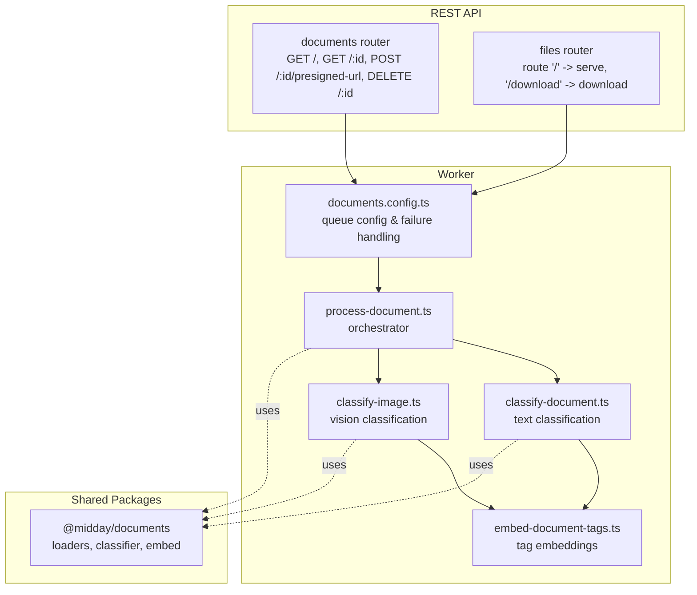
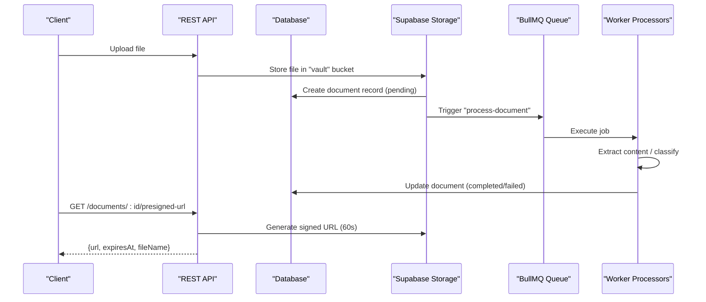
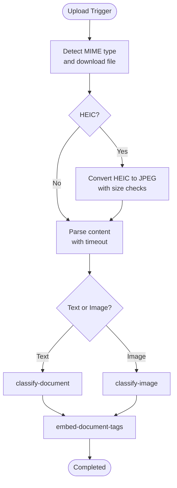
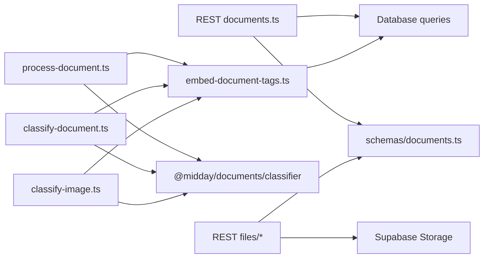

# Document Management Endpoints

<cite>
**Referenced Files in This Document**
- [documents.ts](file://apps/api/src/rest/routers/documents.ts)
- [files/index.ts](file://apps/api/src/rest/routers/files/index.ts)
- [files/serve.ts](file://apps/api/src/rest/routers/files/serve.ts)
- [files/download.ts](file://apps/api/src/rest/routers/files/download.ts)
- [schemas/documents.ts](file://apps/api/src/schemas/documents.ts)
- [schemas/files.ts](file://apps/api/src/schemas/files.ts)
- [document-processing.md](file://docs/document-processing.md)
- [process-document.ts](file://apps/worker/src/processors/documents/process-document.ts)
- [classify-document.ts](file://apps/worker/src/processors/documents/classify-document.ts)
- [classify-image.ts](file://apps/worker/src/processors/documents/classify-image.ts)
- [embed-document-tags.ts](file://apps/worker/src/processors/documents/embed-document-tags.ts)
- [classifier.ts](file://packages/documents/src/classifier/classifier.ts)
- [documents.config.ts](file://apps/worker/src/queues/documents.config.ts)
- [image-processing.ts](file://apps/worker/src/utils/image-processing.ts)
- [documents.ts](file://packages/documents/src/index.ts)
</cite>

## Table of Contents
1. [Introduction](#introduction)
2. [Project Structure](#project-structure)
3. [Core Components](#core-components)
4. [Architecture Overview](#architecture-overview)
5. [Detailed Component Analysis](#detailed-component-analysis)
6. [Dependency Analysis](#dependency-analysis)
7. [Performance Considerations](#performance-considerations)
8. [Troubleshooting Guide](#troubleshooting-guide)
9. [Conclusion](#conclusion)
10. [Appendices](#appendices)

## Introduction
This document provides comprehensive API documentation for the document management system. It covers file upload, download, and storage endpoints, document classification, metadata extraction, and OCR processing. It also documents search, tagging, and organization features, secure file serving and URL generation with access control, document versioning and audit trails, retention policies, processing pipelines, quality assurance, error handling, supported formats, size limits, compression options, sharing and collaboration features, and permission management. Examples demonstrate ingestion workflows, automated processing, and integration with external systems.

## Project Structure
The document management system spans three primary layers:
- REST API layer: exposes endpoints for listing, retrieving, deleting, and generating pre-signed URLs for documents; serves and proxies files securely.
- Worker layer: orchestrates document processing, classification, and enrichment via BullMQ queues.
- Shared packages: provide document loaders, classifiers, embeddings, and utilities used across APIs and workers.

**Diagram sources**
- [documents.ts](file://apps/api/src/rest/routers/documents.ts#L1-L257)
- [files/index.ts](file://apps/api/src/rest/routers/files/index.ts#L1-L13)
- [files/serve.ts](file://apps/api/src/rest/routers/files/serve.ts#L1-L108)
- [files/download.ts](file://apps/api/src/rest/routers/files/download.ts#L1-L316)
- [documents.config.ts](file://apps/worker/src/queues/documents.config.ts#L1-L200)
- [process-document.ts](file://apps/worker/src/processors/documents/process-document.ts#L1-L542)
- [classify-document.ts](file://apps/worker/src/processors/documents/classify-document.ts#L1-L189)
- [classify-image.ts](file://apps/worker/src/processors/documents/classify-image.ts#L1-L218)
- [embed-document-tags.ts](file://apps/worker/src/processors/documents/embed-document-tags.ts#L1-L141)
- [documents.ts](file://packages/documents/src/index.ts#L1-L200)

**Section sources**
- [documents.ts](file://apps/api/src/rest/routers/documents.ts#L1-L257)
- [files/index.ts](file://apps/api/src/rest/routers/files/index.ts#L1-L13)
- [files/serve.ts](file://apps/api/src/rest/routers/files/serve.ts#L1-L108)
- [files/download.ts](file://apps/api/src/rest/routers/files/download.ts#L1-L316)
- [document-processing.md](file://docs/document-processing.md#L1-L617)

## Core Components
- Document endpoints: list, retrieve, delete, and generate pre-signed URLs for secure access.
- File serving endpoints: proxy and download files with authentication and access control.
- Worker processors: orchestrate document processing, classification, and tag embedding.
- Classifier and embeddings: AI-powered classification and semantic tag embeddings.
- Schema definitions: OpenAPI-compatible request/response schemas for validation and documentation.

**Section sources**
- [schemas/documents.ts](file://apps/api/src/schemas/documents.ts#L1-L269)
- [schemas/files.ts](file://apps/api/src/schemas/files.ts#L1-L200)
- [classifier.ts](file://packages/documents/src/classifier/classifier.ts#L1-L139)

## Architecture Overview
The system integrates REST endpoints with a worker-driven processing pipeline:
- REST routes validate scopes and delegate to database queries or storage operations.
- On document upload, a storage trigger initiates processing via BullMQ queues.
- Workers perform content extraction, classification, and enrichment with graceful degradation.
- Pre-signed URLs enable secure, time-limited access to stored files.

**Diagram sources**
- [document-processing.md](file://docs/document-processing.md#L127-L177)
- [documents.ts](file://apps/api/src/rest/routers/documents.ts#L160-L217)
- [process-document.ts](file://apps/worker/src/processors/documents/process-document.ts#L29-L542)

## Detailed Component Analysis

### Document Endpoints
- List documents: GET /documents with pagination, sorting, search, date range, and tag filters.
- Retrieve document: GET /documents/{id}.
- Delete document: DELETE /documents/{id}.
- Generate pre-signed URL: POST /documents/{id}/presigned-url with optional download flag.

Access control:
- Requires scope "documents.read" for listing/retrieving/deleting and pre-signed URL generation.
- Deletion requires "documents.write".

Response schemas define document metadata, processing status, and optional title/summary/date.

**Section sources**
- [documents.ts](file://apps/api/src/rest/routers/documents.ts#L30-L254)
- [schemas/documents.ts](file://apps/api/src/schemas/documents.ts#L3-L269)

### File Serving and Download Endpoints
- Proxy file: GET /files/proxy with filePath query and team file key authentication.
- Download file: GET /files/download with path and filename query parameters.
- Download invoice: GET /files/download/invoice with either id+team file key or token for public access.

Security:
- File access requires a valid team file key (fk) query parameter.
- Invoice downloads support public access via token or authenticated access via id+fk.

Content handling:
- Sets appropriate Content-Type and Content-Disposition headers.
- Images receive long-term caching headers for immutable content.

**Section sources**
- [files/serve.ts](file://apps/api/src/rest/routers/files/serve.ts#L17-L105)
- [files/download.ts](file://apps/api/src/rest/routers/files/download.ts#L24-L316)
- [schemas/files.ts](file://apps/api/src/schemas/files.ts#L1-L200)

### Document Processing Pipeline
The pipeline performs automatic classification and metadata extraction with graceful degradation:
- Orchestration: process-document downloads, detects type, handles HEIC conversion, extracts content, and triggers classification.
- Classification: classify-document for text-based documents; classify-image for images.
- Enrichment: embed-document-tags generates semantic embeddings for tags and assigns them to documents.
- Status tracking: pending, completed, failed states with UI indicators and retry mechanisms.

**Diagram sources**
- [process-document.ts](file://apps/worker/src/processors/documents/process-document.ts#L65-L331)
- [classify-document.ts](file://apps/worker/src/processors/documents/classify-document.ts#L27-L189)
- [classify-image.ts](file://apps/worker/src/processors/documents/classify-image.ts#L31-L218)
- [embed-document-tags.ts](file://apps/worker/src/processors/documents/embed-document-tags.ts#L19-L141)

**Section sources**
- [document-processing.md](file://docs/document-processing.md#L125-L177)
- [process-document.ts](file://apps/worker/src/processors/documents/process-document.ts#L29-L542)
- [classify-document.ts](file://apps/worker/src/processors/documents/classify-document.ts#L27-L189)
- [classify-image.ts](file://apps/worker/src/processors/documents/classify-image.ts#L31-L218)
- [embed-document-tags.ts](file://apps/worker/src/processors/documents/embed-document-tags.ts#L19-L141)

### Metadata Extraction and OCR
- Content extraction: loads and parses documents, with timeouts to prevent hangs.
- OCR and vision: resizes images to 2048px max dimension, converts HEIC to JPEG, and classifies images using vision models.
- Classification: AI extracts title, summary, date, language, and tags; falls back gracefully if AI fails.
- Tag embeddings: generates semantic embeddings for tags and creates tag assignments for improved search.

**Section sources**
- [process-document.ts](file://apps/worker/src/processors/documents/process-document.ts#L333-L455)
- [classify-document.ts](file://apps/worker/src/processors/documents/classify-document.ts#L47-L144)
- [classify-image.ts](file://apps/worker/src/processors/documents/classify-image.ts#L67-L178)
- [embed-document-tags.ts](file://apps/worker/src/processors/documents/embed-document-tags.ts#L30-L138)
- [image-processing.ts](file://apps/worker/src/utils/image-processing.ts#L416-L492)

### Search, Tagging, and Organization
- Search: query parameter q enables text-based filtering across documents.
- Tagging: tags are extracted during classification and stored with embeddings; documents can be filtered by tag IDs.
- Organization: documents are organized by pathTokens in the storage bucket and represented in the database.

**Section sources**
- [schemas/documents.ts](file://apps/api/src/schemas/documents.ts#L27-L47)
- [embed-document-tags.ts](file://apps/worker/src/processors/documents/embed-document-tags.ts#L97-L138)

### Secure File Serving and Access Control
- Pre-signed URLs: generated with 60-second expiration for secure, time-limited access.
- File keys: team file key (fk) required for authenticated access to files and invoices.
- Token-based access: invoice token enables public access to rendered PDFs.

**Section sources**
- [documents.ts](file://apps/api/src/rest/routers/documents.ts#L160-L217)
- [files/download.ts](file://apps/api/src/rest/routers/files/download.ts#L122-L316)

### Document Versioning, Audit Trails, and Retention Policies
- Versioning: document records track processingStatus and metadata; reprocessing updates status and content.
- Audit trails: worker processors log progress milestones and outcomes; notifications are triggered for document uploads and successful processing.
- Retention: job IDs include timestamps to prevent duplicate processing; failed jobs are marked appropriately after retries.

**Section sources**
- [process-document.ts](file://apps/worker/src/processors/documents/process-document.ts#L43-L63)
- [process-document.ts](file://apps/worker/src/processors/documents/process-document.ts#L496-L518)
- [documents.config.ts](file://apps/worker/src/queues/documents.config.ts#L280-L293)

### Supported Formats, Size Limits, and Compression Options
- Supported images: JPEG, PNG, WebP, GIF, TIFF, HEIC/HEIF (converted to JPEG).
- HEIC conversion: two-stage conversion with Sharp and fallback to heic-convert; large HEIC files (>15MB) skip AI classification.
- Image optimization: resize to 2048px max dimension for OCR quality and cost efficiency.
- Timeouts: processing, classification, embedding, and file operations configured with timeouts.

**Section sources**
- [document-processing.md](file://docs/document-processing.md#L494-L505)
- [process-document.ts](file://apps/worker/src/processors/documents/process-document.ts#L105-L130)
- [image-processing.ts](file://apps/worker/src/utils/image-processing.ts#L416-L492)
- [document-processing.md](file://docs/document-processing.md#L506-L530)

### Sharing, Collaboration, and Permission Management
- Scope-based access control: endpoints require "documents.read" or "documents.write".
- Team file key: required for authenticated file access; enforced via middleware.
- Invoice sharing: token-based public access for rendered PDFs; authenticated access via id+fk.

**Section sources**
- [documents.ts](file://apps/api/src/rest/routers/documents.ts#L52-L243)
- [files/download.ts](file://apps/api/src/rest/routers/files/download.ts#L132-L159)

### Examples: Ingestion Workflows and Integration
- Automated ingestion: upload to storage bucket triggers processing; classification and embedding occur asynchronously.
- Manual reprocessing: user-initiated retry updates status and re-triggers processing.
- External integrations: invoice rendering and PDF generation integrated with file serving; classifier uses AI models via environment configuration.

**Section sources**
- [document-processing.md](file://docs/document-processing.md#L295-L332)
- [classifier.ts](file://packages/documents/src/classifier/classifier.ts#L16-L139)

## Dependency Analysis
The following diagram shows key dependencies among components:

**Diagram sources**
- [documents.ts](file://apps/api/src/rest/routers/documents.ts#L1-L257)
- [files/serve.ts](file://apps/api/src/rest/routers/files/serve.ts#L1-L108)
- [files/download.ts](file://apps/api/src/rest/routers/files/download.ts#L1-L316)
- [schemas/documents.ts](file://apps/api/src/schemas/documents.ts#L1-L269)
- [process-document.ts](file://apps/worker/src/processors/documents/process-document.ts#L1-L542)
- [classify-document.ts](file://apps/worker/src/processors/documents/classify-document.ts#L1-L189)
- [classify-image.ts](file://apps/worker/src/processors/documents/classify-image.ts#L1-L218)
- [embed-document-tags.ts](file://apps/worker/src/processors/documents/embed-document-tags.ts#L1-L141)
- [classifier.ts](file://packages/documents/src/classifier/classifier.ts#L1-L139)

**Section sources**
- [documents.ts](file://apps/api/src/rest/routers/documents.ts#L1-L257)
- [files/index.ts](file://apps/api/src/rest/routers/files/index.ts#L1-L13)
- [process-document.ts](file://apps/worker/src/processors/documents/process-document.ts#L1-L542)
- [classifier.ts](file://packages/documents/src/classifier/classifier.ts#L1-L139)

## Performance Considerations
- Concurrency and rate limiting: BullMQ queue configured with conservative concurrency and limiter to avoid API rate limits and memory pressure.
- Memory optimization: Sharp cache and concurrency limits for image processing; HEIC file size thresholds to prevent out-of-memory scenarios.
- Timeouts: centralized timeout constants ensure parent jobs wait for child jobs without premature termination.
- Caching: images receive long-term caching headers for immutable content.

**Section sources**
- [document-processing.md](file://docs/document-processing.md#L207-L234)
- [document-processing.md](file://docs/document-processing.md#L506-L530)
- [image-processing.ts](file://apps/worker/src/utils/image-processing.ts#L221-L227)

## Troubleshooting Guide
Common issues and resolutions:
- Unsupported file type: processing completes with graceful fallback; UI shows retry option.
- AI classification failure: document marked completed with null title; user can retry.
- Stale processing: documents pending >10 minutes show retry option in UI.
- File not found: storage download errors result in 404 responses; verify pathTokens and file existence.
- Authentication errors: missing or invalid file key (fk) results in 401 responses.

**Section sources**
- [document-processing.md](file://docs/document-processing.md#L235-L293)
- [process-document.ts](file://apps/worker/src/processors/documents/process-document.ts#L105-L130)
- [files/download.ts](file://apps/api/src/rest/routers/files/download.ts#L132-L159)

## Conclusion
The document management system provides robust, scalable endpoints for uploading, serving, and organizing documents with automated classification, metadata extraction, and OCR processing. Its worker-driven pipeline ensures reliability through graceful degradation, retry mechanisms, and comprehensive error handling. Access control, pre-signed URLs, and tag embeddings enhance security, usability, and discoverability.

## Appendices

### API Definitions

- List documents
  - Method: GET
  - Path: /documents
  - Query parameters: cursor, sort, pageSize, q, tags, start, end
  - Scopes: documents.read
  - Responses: 200 OK with paginated documents

- Retrieve document
  - Method: GET
  - Path: /documents/{id}
  - Scopes: documents.read
  - Responses: 200 OK with document

- Delete document
  - Method: DELETE
  - Path: /documents/{id}
  - Scopes: documents.write
  - Responses: 200 OK with deletion result

- Generate pre-signed URL
  - Method: POST
  - Path: /documents/{id}/presigned-url
  - Query parameters: download (boolean)
  - Scopes: documents.read
  - Responses: 200 OK with {url, expiresAt, fileName}; 400/404/500 on error

- Proxy file
  - Method: GET
  - Path: /files/proxy
  - Query parameters: filePath, fk (team file key)
  - Responses: 200 OK with file content; 400/404/500 on error

- Download file
  - Method: GET
  - Path: /files/download
  - Query parameters: path, filename, fk (team file key)
  - Responses: 200 OK with file content; 400/401/404/500 on error

- Download invoice
  - Method: GET
  - Path: /files/download/invoice
  - Query parameters: id (optional), token (optional), preview (optional), type (optional)
  - Responses: 200 OK with PDF; 400/401/404/500 on error

**Section sources**
- [documents.ts](file://apps/api/src/rest/routers/documents.ts#L30-L254)
- [files/serve.ts](file://apps/api/src/rest/routers/files/serve.ts#L17-L105)
- [files/download.ts](file://apps/api/src/rest/routers/files/download.ts#L24-L316)
- [schemas/documents.ts](file://apps/api/src/schemas/documents.ts#L3-L269)
- [schemas/files.ts](file://apps/api/src/schemas/files.ts#L1-L200)