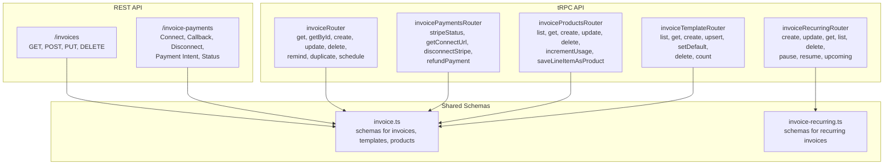
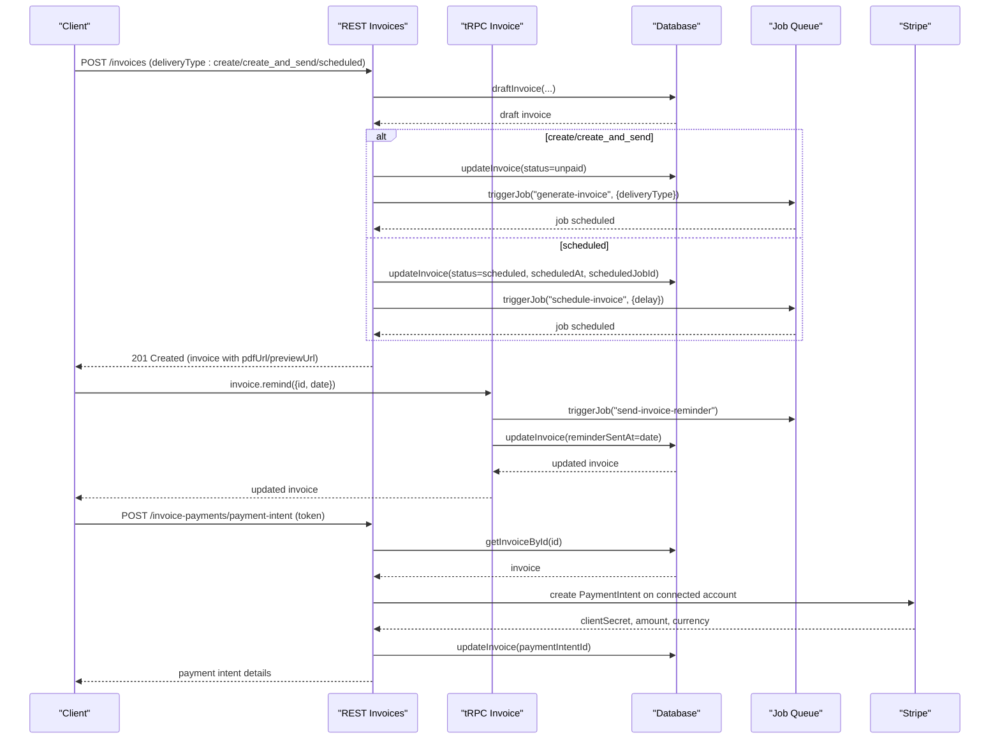
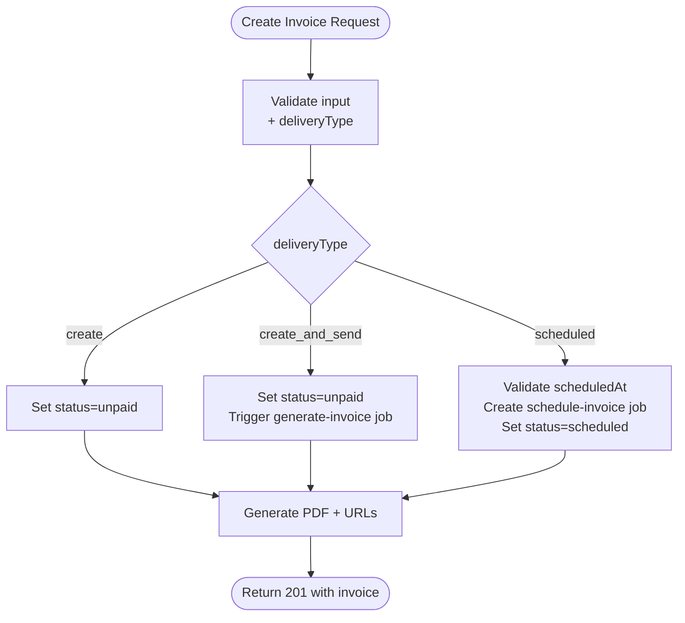
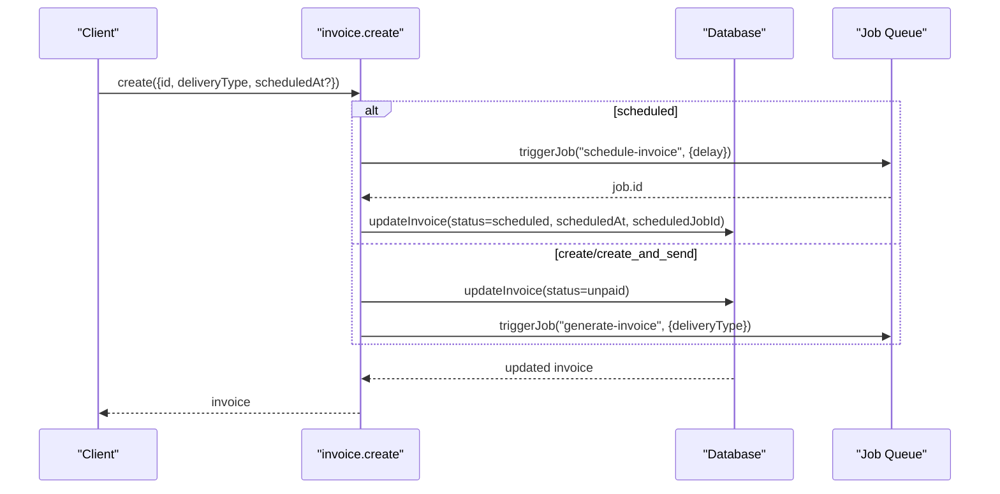
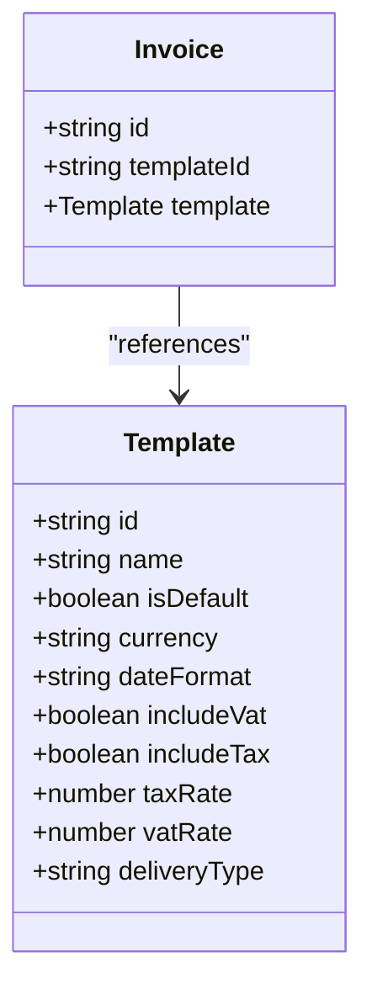
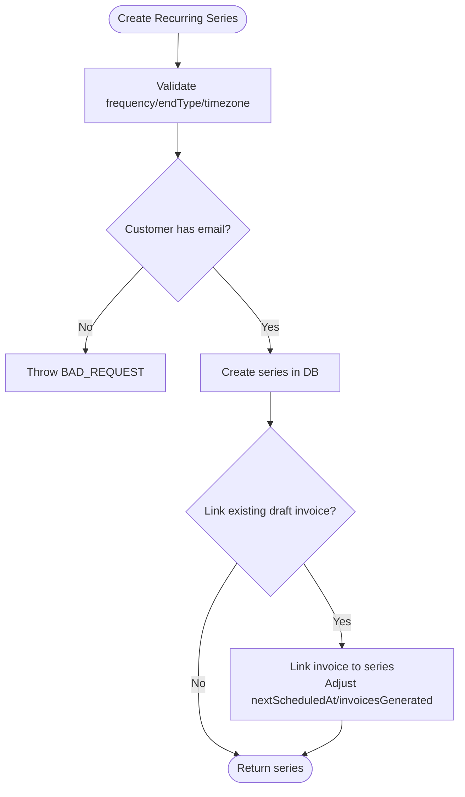
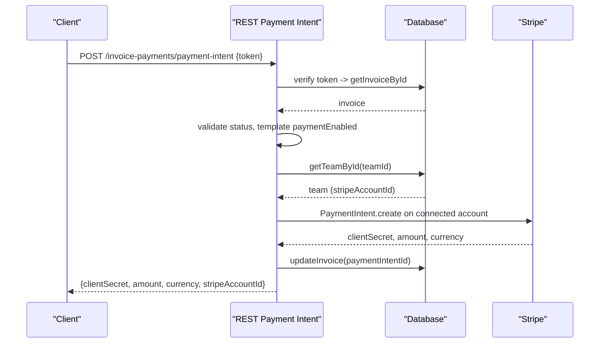
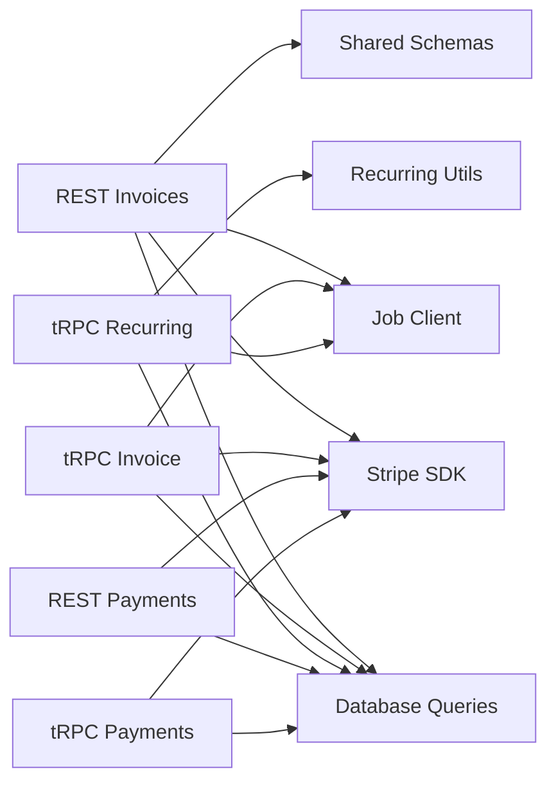

# Invoice Management Endpoints

<cite>
**Referenced Files in This Document**
- [invoices.ts](file://midday/apps/api/src/rest/routers/invoices.ts)
- [invoice.ts](file://midday/apps/api/src/schemas/invoice.ts)
- [invoice.ts](file://midday/apps/api/src/trpc/routers/invoice.ts)
- [invoice-payments.ts](file://midday/apps/api/src/rest/routers/invoice-payments.ts)
- [invoice-payments.ts](file://midday/apps/api/src/trpc/routers/invoice-payments.ts)
- [invoice-recurring.ts](file://midday/apps/api/src/schemas/invoice-recurring.ts)
- [invoice-recurring.ts](file://midday/apps/api/src/trpc/routers/invoice-recurring.ts)
- [invoice-products.ts](file://midday/apps/api/src/trpc/routers/invoice-products.ts)
- [invoice-template.ts](file://midday/apps/api/src/trpc/routers/invoice-template.ts)
- [invoices.test.ts](file://midday/apps/api/src/__tests__/routers/invoices.test.ts)
</cite>

## Table of Contents
1. [Introduction](#introduction)
2. [Project Structure](#project-structure)
3. [Core Components](#core-components)
4. [Architecture Overview](#architecture-overview)
5. [Detailed Component Analysis](#detailed-component-analysis)
6. [Dependency Analysis](#dependency-analysis)
7. [Performance Considerations](#performance-considerations)
8. [Troubleshooting Guide](#troubleshooting-guide)
9. [Conclusion](#conclusion)

## Introduction
This document provides comprehensive API documentation for invoice management endpoints in the Faworra system. It covers invoice lifecycle operations (create, retrieve, update, delete), invoice templates, recurring invoices, payment tracking, status management, line item handling, tax and discount calculations, currency conversion, PDF generation, email sending, and webhook notifications. It also documents bulk operations, search and filtering, pagination, sorting, status transitions, reminders, and late payment handling, with practical examples for common workflows.

## Project Structure
The invoice management functionality spans REST and tRPC routers, shared schemas, and supporting modules for payments, templates, products, and recurring invoices. The REST router exposes HTTP endpoints, while tRPC provides internal procedures used by workers and the dashboard.

**Diagram sources**
- [invoices.ts](file://midday/apps/api/src/rest/routers/invoices.ts#L45-L759)
- [invoice-payments.ts](file://midday/apps/api/src/rest/routers/invoice-payments.ts#L45-L629)
- [invoice.ts](file://midday/apps/api/src/trpc/routers/invoice.ts#L62-L800)
- [invoice-recurring.ts](file://midday/apps/api/src/trpc/routers/invoice-recurring.ts#L32-L689)
- [invoice-payments.ts](file://midday/apps/api/src/trpc/routers/invoice-payments.ts#L13-L194)
- [invoice-products.ts](file://midday/apps/api/src/trpc/routers/invoice-products.ts#L23-L127)
- [invoice-template.ts](file://midday/apps/api/src/trpc/routers/invoice-template.ts#L15-L83)
- [invoice.ts](file://midday/apps/api/src/schemas/invoice.ts#L520-L1502)
- [invoice-recurring.ts](file://midday/apps/api/src/schemas/invoice-recurring.ts#L34-L767)

**Section sources**
- [invoices.ts](file://midday/apps/api/src/rest/routers/invoices.ts#L1-L760)
- [invoice.ts](file://midday/apps/api/src/trpc/routers/invoice.ts#L1-L812)

## Core Components
- REST Invoice Router: Provides HTTP endpoints for listing, retrieving, creating, updating, and deleting invoices, plus payment status and summary endpoints.
- tRPC Invoice Router: Offers internal procedures for invoice operations, reminders, duplicates, scheduling, and analytics.
- Invoice Payment Router (REST/tRPC): Handles Stripe Connect OAuth, payment intent creation, status checks, and refund processing.
- Invoice Recurring Router: Manages recurring invoice series, scheduling, pausing/resuming, and upcoming invoice previews.
- Invoice Products Router: Manages reusable products for line items.
- Invoice Template Router: Manages invoice templates for branding and defaults.

**Section sources**
- [invoices.ts](file://midday/apps/api/src/rest/routers/invoices.ts#L45-L759)
- [invoice.ts](file://midday/apps/api/src/trpc/routers/invoice.ts#L62-L800)
- [invoice-payments.ts](file://midday/apps/api/src/rest/routers/invoice-payments.ts#L45-L629)
- [invoice-payments.ts](file://midday/apps/api/src/trpc/routers/invoice-payments.ts#L13-L194)
- [invoice-recurring.ts](file://midday/apps/api/src/trpc/routers/invoice-recurring.ts#L32-L689)
- [invoice-products.ts](file://midday/apps/api/src/trpc/routers/invoice-products.ts#L23-L127)
- [invoice-template.ts](file://midday/apps/api/src/trpc/routers/invoice-template.ts#L15-L83)

## Architecture Overview
The system separates concerns between REST and tRPC APIs, with shared schemas ensuring consistent validation and serialization. Payment processing integrates with Stripe via REST endpoints and tRPC procedures. Recurring invoices leverage job queues for scheduling and notifications.

**Diagram sources**
- [invoices.ts](file://midday/apps/api/src/rest/routers/invoices.ts#L326-L635)
- [invoice.ts](file://midday/apps/api/src/trpc/routers/invoice.ts#L611-L627)
- [invoice-payments.ts](file://midday/apps/api/src/rest/routers/invoice-payments.ts#L352-L575)

## Detailed Component Analysis

### REST Invoice Endpoints
- List invoices: GET /invoices with pagination, sorting, and filtering by date range, statuses, customers, IDs, recurring filters.
- Retrieve invoice by ID: GET /invoices/{id}.
- Create invoice: POST /invoices with deliveryType controls processing behavior.
- Update invoice: PUT /invoices/{id} for status changes and notes.
- Delete invoice: DELETE /invoices/{id} (draft/canceled only).

**Diagram sources**
- [invoices.ts](file://midday/apps/api/src/rest/routers/invoices.ts#L326-L635)

**Section sources**
- [invoices.ts](file://midday/apps/api/src/rest/routers/invoices.ts#L45-L759)
- [invoice.ts](file://midday/apps/api/src/schemas/invoice.ts#L520-L851)

### tRPC Invoice Procedures
- get, getById: Retrieve invoices with team scoping.
- create: Handle scheduled vs immediate processing with job scheduling and notifications.
- update: Update status, paidAt, internal notes.
- delete: Soft-delete logic respecting status constraints.
- remind: Trigger reminder job and update reminderSentAt.
- duplicate: Clone invoice with new number.
- updateSchedule, cancelSchedule: Manage scheduled invoices.

**Diagram sources**
- [invoice.ts](file://midday/apps/api/src/trpc/routers/invoice.ts#L448-L609)

**Section sources**
- [invoice.ts](file://midday/apps/api/src/trpc/routers/invoice.ts#L62-L800)

### Invoice Templates
- List/get templates: Retrieve team templates.
- Create/upsert template: Supports default template management.
- Set default template: Switch default for the team.
- Count templates: Team template count.

**Diagram sources**
- [invoice-template.ts](file://midday/apps/api/src/trpc/routers/invoice-template.ts#L15-L83)
- [invoice.ts](file://midday/apps/api/src/schemas/invoice.ts#L480-L518)

**Section sources**
- [invoice-template.ts](file://midday/apps/api/src/trpc/routers/invoice-template.ts#L15-L83)
- [invoice.ts](file://midday/apps/api/src/schemas/invoice.ts#L480-L518)

### Recurring Invoices
- Create recurring series with frequency, end conditions, timezone, and payment terms.
- Update series with cross-field validation and customer email requirement.
- Pause/resume series and cancel scheduling jobs.
- List upcoming invoices with preview data.

**Diagram sources**
- [invoice-recurring.ts](file://midday/apps/api/src/trpc/routers/invoice-recurring.ts#L33-L211)
- [invoice-recurring.ts](file://midday/apps/api/src/schemas/invoice-recurring.ts#L34-L159)

**Section sources**
- [invoice-recurring.ts](file://midday/apps/api/src/trpc/routers/invoice-recurring.ts#L32-L689)
- [invoice-recurring.ts](file://midday/apps/api/src/schemas/invoice-recurring.ts#L34-L767)

### Payment Tracking and Currency Conversion
- REST payment-intent endpoint: Creates Stripe PaymentIntents with idempotency keys, validates invoice state, and stores paymentIntentId.
- tRPC refundPayment: Processes refunds on connected accounts and updates invoice status.
- Currency conversion: Summary endpoints aggregate totals across currencies and convert to team base currency.

**Diagram sources**
- [invoice-payments.ts](file://midday/apps/api/src/rest/routers/invoice-payments.ts#L352-L575)
- [invoice-payments.ts](file://midday/apps/api/src/trpc/routers/invoice-payments.ts#L96-L194)

**Section sources**
- [invoice-payments.ts](file://midday/apps/api/src/rest/routers/invoice-payments.ts#L45-L629)
- [invoice-payments.ts](file://midday/apps/api/src/trpc/routers/invoice-payments.ts#L13-L194)
- [invoice.ts](file://midday/apps/api/src/schemas/invoice.ts#L1414-L1482)

### Line Items, Taxes, Discounts, and Calculations
- Line items support quantity, unit, price, tax/vat rates, and optional product linkage.
- Tax/discount calculation: REST endpoints compute subTotal, total, VAT, and tax based on template settings and line items.
- Product catalog: Save line items as products and reuse across invoices.

**Section sources**
- [invoice.ts](file://midday/apps/api/src/schemas/invoice.ts#L151-L479)
- [invoice.ts](file://midday/apps/api/src/schemas/invoice.ts#L838-L841)
- [invoice-products.ts](file://midday/apps/api/src/trpc/routers/invoice-products.ts#L23-L127)

### Search, Filtering, Pagination, and Sorting
- REST invoices endpoint supports:
  - Cursor-based pagination
  - Sort by [field, direction] tuples
  - Text search (q)
  - Date range filters (start, end)
  - Statuses, customer IDs, invoice IDs, recurring series filters
- Summary endpoint aggregates totals across filtered invoices.

**Section sources**
- [invoice.ts](file://midday/apps/api/src/schemas/invoice.ts#L520-L630)
- [invoices.ts](file://midday/apps/api/src/rest/routers/invoices.ts#L45-L151)

### Status Management and Reminders
- Supported statuses: draft, overdue, paid, unpaid, canceled, scheduled.
- Status transitions:
  - draft → unpaid (finalize)
  - unpaid → paid (via payment)
  - scheduled → paid/unpaid (processed)
  - canceled → draft (revert)
- Reminder system: tRPC procedure triggers reminder job and records reminderSentAt.

**Section sources**
- [invoice.ts](file://midday/apps/api/src/schemas/invoice.ts#L645-L675)
- [invoice.ts](file://midday/apps/api/src/trpc/routers/invoice.ts#L611-L627)

### PDF Generation, Email Sending, and Webhooks
- PDF generation: REST endpoints attach pdfUrl and previewUrl using invoice tokens.
- Email sending: Scheduled and create_and_send flows trigger invoice generation jobs.
- Webhooks: Payment processing uses Stripe webhooks to reconcile payments and update invoice status.

**Section sources**
- [invoices.ts](file://midday/apps/api/src/rest/routers/invoices.ts#L139-L145)
- [invoices.ts](file://midday/apps/api/src/rest/routers/invoices.ts#L508-L515)
- [invoice-payments.ts](file://midday/apps/api/src/rest/routers/invoice-payments.ts#L528-L549)

### Examples

#### Invoice Creation Workflow
- Create a draft invoice with deliveryType "create" to finalize immediately.
- Create with deliveryType "create_and_send" to finalize and send automatically.
- Create with deliveryType "scheduled" to set a future processing date.

**Section sources**
- [invoices.ts](file://midday/apps/api/src/rest/routers/invoices.ts#L326-L635)
- [invoice.ts](file://midday/apps/api/src/trpc/routers/invoice.ts#L448-L609)

#### Payment Reconciliation
- Use REST payment-intent endpoint to create PaymentIntents with idempotency.
- Process refunds via tRPC refundPayment when needed.

**Section sources**
- [invoice-payments.ts](file://midday/apps/api/src/rest/routers/invoice-payments.ts#L352-L575)
- [invoice-payments.ts](file://midday/apps/api/src/trpc/routers/invoice-payments.ts#L96-L194)

#### Reporting Integration
- Use summary endpoint to aggregate totals across currencies and convert to base currency.

**Section sources**
- [invoice.ts](file://midday/apps/api/src/schemas/invoice.ts#L1425-L1482)

## Dependency Analysis
The REST and tRPC layers share schemas and database queries. Payment processing depends on Stripe SDK and job queues. Recurring invoices depend on scheduling utilities and job clients.

**Diagram sources**
- [invoices.ts](file://midday/apps/api/src/rest/routers/invoices.ts#L1-L760)
- [invoice.ts](file://midday/apps/api/src/trpc/routers/invoice.ts#L1-L812)
- [invoice-recurring.ts](file://midday/apps/api/src/trpc/routers/invoice-recurring.ts#L1-L690)
- [invoice-payments.ts](file://midday/apps/api/src/rest/routers/invoice-payments.ts#L1-L630)
- [invoice-payments.ts](file://midday/apps/api/src/trpc/routers/invoice-payments.ts#L1-L194)

**Section sources**
- [invoices.ts](file://midday/apps/api/src/rest/routers/invoices.ts#L1-L760)
- [invoice.ts](file://midday/apps/api/src/trpc/routers/invoice.ts#L1-L812)
- [invoice-recurring.ts](file://midday/apps/api/src/trpc/routers/invoice-recurring.ts#L1-L690)
- [invoice-payments.ts](file://midday/apps/api/src/rest/routers/invoice-payments.ts#L1-L630)
- [invoice-payments.ts](file://midday/apps/api/src/trpc/routers/invoice-payments.ts#L1-L194)

## Performance Considerations
- Pagination: Use cursor-based pagination to handle large datasets efficiently.
- Sorting: Limit sort fields and directions to reduce query complexity.
- Filtering: Apply date ranges and status filters early to minimize result sets.
- Job scheduling: Use delays and idempotency keys to prevent duplicate processing.
- Currency conversion: Aggregate summaries in batch to minimize repeated conversions.

## Troubleshooting Guide
- Validation errors: Review request payloads against shared schemas for required fields and constraints.
- Payment errors: Check Stripe Connect configuration, account status, and payment intent state.
- Recurring series: Ensure customer emails are present and frequency parameters match end conditions.
- Scheduled invoices: Verify job queue availability and scheduledAt is in the future.

**Section sources**
- [invoices.test.ts](file://midday/apps/api/src/__tests__/routers/invoices.test.ts#L1-L97)
- [invoice.ts](file://midday/apps/api/src/schemas/invoice.ts#L520-L851)
- [invoice-recurring.ts](file://midday/apps/api/src/schemas/invoice-recurring.ts#L34-L159)

## Conclusion
The invoice management system provides robust REST and tRPC APIs for end-to-end invoice lifecycle management, integrated payment processing, recurring invoicing, and comprehensive reporting. The modular design with shared schemas and job-based processing ensures scalability and maintainability.