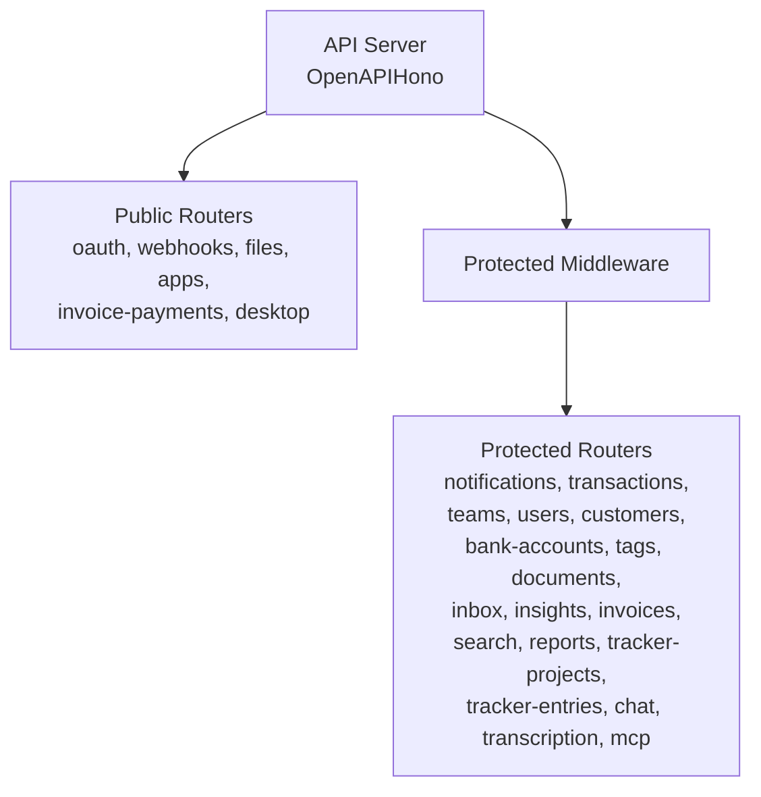
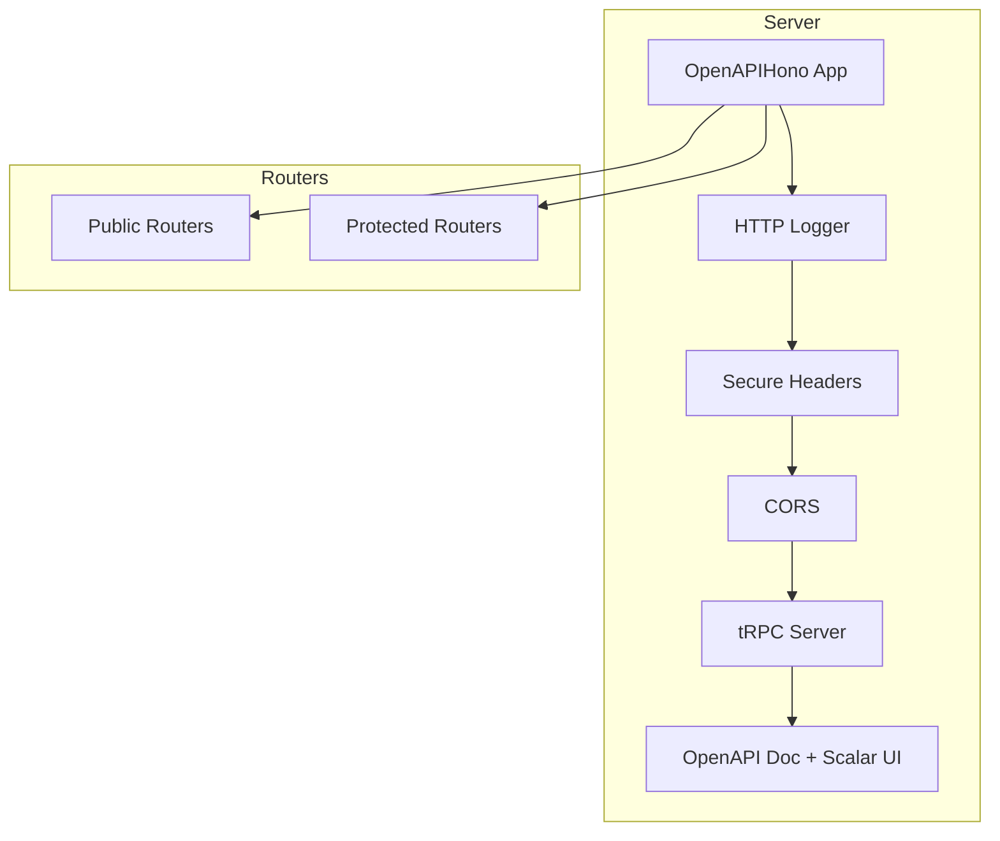
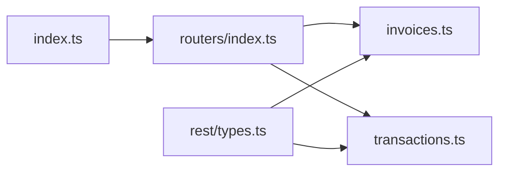

# REST API Endpoints

<cite>
**Referenced Files in This Document**
- [index.ts](file://midday/apps/api/src/index.ts)
- [routers/index.ts](file://midday/apps/api/src/rest/routers/index.ts)
- [rest/types.ts](file://midday/apps/api/src/rest/types.ts)
- [invoices.ts](file://midday/apps/api/src/rest/routers/invoices.ts)
- [transactions.ts](file://midday/apps/api/src/rest/routers/transactions.ts)
- [schemas/invoice.ts](file://midday/apps/api/src/schemas/invoice.ts)
- [schemas/transactions.ts](file://midday/apps/api/src/schemas/transactions.ts)
</cite>

## Table of Contents
1. [Introduction](#introduction)
2. [Project Structure](#project-structure)
3. [Core Components](#core-components)
4. [Architecture Overview](#architecture-overview)
5. [Detailed Component Analysis](#detailed-component-analysis)
6. [Dependency Analysis](#dependency-analysis)
7. [Performance Considerations](#performance-considerations)
8. [Troubleshooting Guide](#troubleshooting-guide)
9. [Conclusion](#conclusion)
10. [Appendices](#appendices)

## Introduction
This document provides comprehensive REST API documentation for the Faworra API (also referred to as Midday API). It covers all HTTP endpoints exposed under the REST router hierarchy, including HTTP methods, URL patterns, request/response schemas, authentication and authorization requirements, query parameter handling, pagination strategies, error response formats, and practical client integration guidance. The API is built with Hono and OpenAPI integration, and exposes both public and protected endpoints grouped by resource.

## Project Structure
The API server initializes middleware and registers routers. Public endpoints (OAuth, webhooks, files, apps, invoices payments, desktop) are mounted without authentication. Protected endpoints require bearer tokens scoped per resource.

**Diagram sources**
- [index.ts](file://midday/apps/api/src/index.ts#L26-L176)
- [routers/index.ts](file://midday/apps/api/src/rest/routers/index.ts#L28-L59)

**Section sources**
- [index.ts](file://midday/apps/api/src/index.ts#L26-L176)
- [routers/index.ts](file://midday/apps/api/src/rest/routers/index.ts#L28-L59)

## Core Components
- Authentication and Security
  - Security schemes include OAuth2 and bearer token. The bearer token is the default mechanism.
  - Secure headers middleware is enabled with cross-origin resource policy configuration.
  - CORS is configured to allow selected origins and headers, with preflight caching.
- Context and Scopes
  - Request context provides database handle, session, teamId, optional userId, client IP, and optional scopes.
  - Protected routes apply scope checks via middleware (e.g., invoices.read, invoices.write).
- OpenAPI and Documentation
  - OpenAPI spec is served at /openapi with server URL and security schemes.
  - Scalar UI is available at the root path for interactive documentation.

**Section sources**
- [index.ts](file://midday/apps/api/src/index.ts#L28-L65)
- [index.ts](file://midday/apps/api/src/index.ts#L132-L174)
- [rest/types.ts](file://midday/apps/api/src/rest/types.ts#L5-L14)

## Architecture Overview
The API uses a layered approach:
- Server initialization sets up logging, security headers, CORS, and health endpoints.
- tRPC integration is available under /trpc/* with request tracing and error reporting.
- REST routers are mounted under "/" and grouped by domain resources.

**Diagram sources**
- [index.ts](file://midday/apps/api/src/index.ts#L26-L176)
- [routers/index.ts](file://midday/apps/api/src/rest/routers/index.ts#L28-L59)

**Section sources**
- [index.ts](file://midday/apps/api/src/index.ts#L26-L176)
- [routers/index.ts](file://midday/apps/api/src/rest/routers/index.ts#L28-L59)

## Detailed Component Analysis

### Authentication and Authorization
- Security schemes:
  - OAuth2: [] (empty scopes list indicates application-level flows)
  - Bearer token: default HTTP bearer scheme
- Protected routes:
  - Require bearer token with appropriate scopes (e.g., invoices.read, invoices.write).
  - Scope enforcement is applied via middleware on each route.
- CORS:
  - Allowed origins come from environment variable ALLOWED_API_ORIGINS.
  - Methods: GET, POST, PUT, DELETE, OPTIONS, PATCH
  - Allowed headers include Content-Type, Authorization, User-Agent, accept-language, cf-ray, trpc-accept, x-request-id, x-trpc-source, x-user-locale, x-user-timezone, x-user-country, x-force-primary, plus Slack webhook headers.
  - Exposed headers include Content-Length, Content-Type, Cache-Control, Cross-Origin-Resource-Policy.
  - Preflight max age: 86400 seconds.
- Rate limiting:
  - Not implemented in the server code reviewed here.

**Section sources**
- [index.ts](file://midday/apps/api/src/index.ts#L155-L169)
- [index.ts](file://midday/apps/api/src/index.ts#L35-L65)
- [routers/index.ts](file://midday/apps/api/src/rest/routers/index.ts#L38-L39)

### Health and Readiness
- GET /health: Returns {"status":"ok"} with 200.
- GET /health/ready: Probes dependencies and returns readiness status with 200 or 503.
- GET /health/dependencies: Returns dependency health details with 200 or 503.

**Section sources**
- [index.ts](file://midday/apps/api/src/index.ts#L118-L130)

### OpenAPI and Scalar UI
- GET /openapi: Serves OpenAPI 3.1 spec with server URL and security schemes.
- GET /: Serves Scalar API reference pointing to /openapi.

**Section sources**
- [index.ts](file://midday/apps/api/src/index.ts#L132-L174)

### Invoices Resource
Endpoints:
- GET /
  - Description: List invoices for the authenticated team.
  - Query parameters: Defined by getInvoicesSchema (pagination, sorting, filters).
  - Responses: 200 with invoicesResponseSchema.
  - Scopes: invoices.read
- GET /payment-status
  - Description: Payment status for the authenticated team.
  - Responses: 200 with getPaymentStatusResponseSchema.
  - Scopes: invoices.read
- GET /summary
  - Description: Invoice summary for the authenticated team.
  - Query parameters: Defined by invoiceSummarySchema.
  - Responses: 200 with invoiceSummaryResponseSchema.
  - Scopes: invoices.read
- GET /{id}
  - Description: Retrieve a single invoice by ID for the authenticated team.
  - Path parameters: id (UUID).
  - Responses: 200 with invoiceResponseSchema; 404 if not found.
  - Scopes: invoices.read
- POST /
  - Description: Create an invoice. Behavior depends on deliveryType:
    - create: generate and finalize immediately.
    - create_and_send: also send to customer.
    - scheduled: schedule for future processing.
  - Request body: draftInvoiceRequestSchema.
  - Responses:
    - 201 with draftInvoiceResponseSchema.
    - 400 for validation errors (e.g., missing scheduledAt, invalid date).
    - 404 if customer not found.
    - 409 if invoice number already used.
    - 500 for internal server errors.
  - Scopes: invoices.write
- PUT /{id}
  - Description: Update an invoice by ID.
  - Path parameters: id (UUID).
  - Request body: updateInvoiceRequestSchema.
  - Responses: 200 with updateInvoiceResponseSchema.
  - Scopes: invoices.write
- DELETE /{id}
  - Description: Delete an invoice by ID. Only draft or canceled invoices can be deleted directly.
  - Path parameters: id (UUID).
  - Responses: 200 with deleteInvoiceResponseSchema.
  - Scopes: invoices.write

Pagination and filtering:
- Pagination uses pageSize and cursor (cursor-based pagination).
- Sorting and additional filters are passed via query parameters defined by getInvoicesSchema.

Validation and error scenarios:
- Validation errors return 400 with a message field.
- Conflicting invoice numbers return 409.
- Not found returns 404.
- Internal errors return 500.

Example curl (conceptual):
- List invoices:
  - curl -H "Authorization: Bearer YOUR_TOKEN" "https://api.midday.ai/invoices?page_size=20&cursor=abc&sort=-created_at"
- Create invoice (conceptual):
  - curl -X POST "https://api.midday.ai/invoices" -H "Authorization: Bearer YOUR_TOKEN" -H "Content-Type: application/json" -d '{...}'
- Update invoice (conceptual):
  - curl -X PUT "https://api.midday.ai/invoices/<id>" -H "Authorization: Bearer YOUR_TOKEN" -H "Content-Type: application/json" -d '{...}'
- Delete invoice (conceptual):
  - curl -X DELETE "https://api.midday.ai/invoices/<id>" -H "Authorization: Bearer YOUR_TOKEN"

**Section sources**
- [invoices.ts](file://midday/apps/api/src/rest/routers/invoices.ts#L45-L151)
- [invoices.ts](file://midday/apps/api/src/rest/routers/invoices.ts#L153-L180)
- [invoices.ts](file://midday/apps/api/src/rest/routers/invoices.ts#L182-L218)
- [invoices.ts](file://midday/apps/api/src/rest/routers/invoices.ts#L220-L324)
- [invoices.ts](file://midday/apps/api/src/rest/routers/invoices.ts#L326-L634)
- [invoices.ts](file://midday/apps/api/src/rest/routers/invoices.ts#L637-L716)
- [invoices.ts](file://midday/apps/api/src/rest/routers/invoices.ts#L719-L756)
- [schemas/invoice.ts](file://midday/apps/api/src/schemas/invoice.ts)

### Transactions Resource
Endpoints:
- GET /
  - Description: List transactions for the authenticated team.
  - Query parameters: Defined by getTransactionsSchema.
  - Responses: 200 with transactionsResponseSchema.
  - Scopes: transactions.read
- GET /{id}
  - Description: Retrieve a single transaction by ID for the authenticated team.
  - Path parameters: id (UUID).
  - Responses: 200 with transactionResponseSchema.
  - Scopes: transactions.read
- POST /{transactionId}/attachments/{attachmentId}/presigned-url
  - Description: Generate a pre-signed URL for accessing a transaction attachment. URL valid for 60 seconds.
  - Path parameters: transactionId (UUID), attachmentId (UUID).
  - Query parameters: download (boolean, default true).
  - Responses:
    - 200 with transactionAttachmentPreSignedUrlResponseSchema.
    - 400 if attachment file path not available.
    - 404 if transaction or attachment not found.
    - 500 if pre-signed URL generation fails.
  - Scopes: transactions.read
- POST /
  - Description: Create a single transaction.
  - Request body: createTransactionSchema.
  - Responses: 200 with transactionResponseSchema.
  - Scopes: transactions.write
- PATCH /{id}
  - Description: Update a single transaction.
  - Path parameters: id (UUID).
  - Request body: updateTransactionSchema (excluding id).
  - Responses: 200 with transactionResponseSchema.
  - Scopes: transactions.write
- PATCH /bulk
  - Description: Bulk update transactions.
  - Request body: updateTransactionsSchema.
  - Responses: 200 with transactionsResponseSchema.
  - Scopes: transactions.write
- POST /bulk
  - Description: Bulk create transactions.
  - Request body: createTransactionsSchema.
  - Responses: 200 with createTransactionsResponseSchema.
  - Scopes: transactions.write
- DELETE /bulk
  - Description: Bulk delete transactions. Only manually created transactions can be deleted via this endpoint.
  - Request body: array of transaction IDs.
  - Responses: 200 with deleteTransactionsResponseSchema.
  - Scopes: transactions.write
- DELETE /{id}
  - Description: Delete a single transaction. Only manually created transactions can be deleted via this endpoint.
  - Path parameters: id (UUID).
  - Responses: 200 with deleteTransactionResponseSchema.
  - Scopes: transactions.write

Validation and error scenarios:
- Pre-signed URL endpoint returns 400/404/500 depending on attachment availability and generation outcome.
- Bulk endpoints accept arrays of IDs or items; validation errors return 400.
- Not found returns 404.
- Internal errors return 500.

Example curl (conceptual):
- List transactions:
  - curl -H "Authorization: Bearer YOUR_TOKEN" "https://api.midday.ai/transactions?pageSize=50&cursor=..."
- Get presigned URL (conceptual):
  - curl "https://api.midday.ai/transactions/<txId>/attachments/<attId>/presigned-url?download=true" -H "Authorization: Bearer YOUR_TOKEN"
- Bulk create (conceptual):
  - curl -X POST "https://api.midday.ai/transactions/bulk" -H "Authorization: Bearer YOUR_TOKEN" -H "Content-Type: application/json" -d '[...]'

**Section sources**
- [transactions.ts](file://midday/apps/api/src/rest/routers/transactions.ts#L37-L74)
- [transactions.ts](file://midday/apps/api/src/rest/routers/transactions.ts#L76-L109)
- [transactions.ts](file://midday/apps/api/src/rest/routers/transactions.ts#L111-L227)
- [transactions.ts](file://midday/apps/api/src/rest/routers/transactions.ts#L230-L264)
- [transactions.ts](file://midday/apps/api/src/rest/routers/transactions.ts#L267-L314)
- [transactions.ts](file://midday/apps/api/src/rest/routers/transactions.ts#L317-L361)
- [transactions.ts](file://midday/apps/api/src/rest/routers/transactions.ts#L364-L403)
- [transactions.ts](file://midday/apps/api/src/rest/routers/transactions.ts#L406-L450)
- [transactions.ts](file://midday/apps/api/src/rest/routers/transactions.ts#L452-L485)
- [schemas/transactions.ts](file://midday/apps/api/src/schemas/transactions.ts)

### Additional Public Endpoints
Public routes mounted at the root level include:
- /oauth/*
- /webhook/*
- /files/*
- /apps/*
- /invoice-payments/*
- /desktop/*

These endpoints are not protected by bearer tokens and are intended for public access patterns such as OAuth callbacks, webhooks, file uploads/downloads, app integrations, invoice payment webhooks, and desktop client endpoints.

**Section sources**
- [routers/index.ts](file://midday/apps/api/src/rest/routers/index.ts#L30-L36)

## Dependency Analysis
The API server composes middleware and routers as follows:
- Server initialization:
  - Logging, secure headers, CORS, tRPC integration, health endpoints, OpenAPI doc, Scalar UI, and router mounting.
- Router composition:
  - Public routers mounted before protected middleware.
  - Protected middleware applied globally to subsequent routes.
- Context dependencies:
  - Each route receives a context with db, session, teamId, optional userId, client IP, and optional scopes.

**Diagram sources**
- [index.ts](file://midday/apps/api/src/index.ts#L26-L176)
- [routers/index.ts](file://midday/apps/api/src/rest/routers/index.ts#L28-L59)
- [rest/types.ts](file://midday/apps/api/src/rest/types.ts#L5-L14)

**Section sources**
- [index.ts](file://midday/apps/api/src/index.ts#L26-L176)
- [routers/index.ts](file://midday/apps/api/src/rest/routers/index.ts#L28-L59)
- [rest/types.ts](file://midday/apps/api/src/rest/types.ts#L5-L14)

## Performance Considerations
- Database pool statistics logging can be enabled via environment variable to monitor pool usage periodically.
- Optional performance logging for tRPC requests is available when DEBUG_PERF is set, emitting timing and pool metrics.

Recommendations:
- Monitor pool stats logs to tune concurrency and connection limits.
- Use pagination (cursor-based) for large lists to avoid heavy payloads.
- Prefer bulk endpoints for batch operations to reduce round trips.

**Section sources**
- [index.ts](file://midday/apps/api/src/index.ts#L178-L199)
- [index.ts](file://midday/apps/api/src/index.ts#L67-L86)

## Troubleshooting Guide
Common issues and resolutions:
- 401 Unauthorized:
  - Ensure a valid bearer token is included in the Authorization header.
- 403 Forbidden:
  - Verify the token’s scopes match the endpoint requirements (e.g., invoices.read, invoices.write).
- 404 Not Found:
  - Confirm resource IDs exist and belong to the authenticated team.
- 409 Conflict (invoices):
  - Resolve duplicate invoice numbers; either change the number or omit to auto-generate.
- 400 Bad Request:
  - Validate request bodies against schemas and ensure required fields (e.g., scheduledAt for scheduled invoices) are present and correct.
- 500 Internal Server Error:
  - Inspect server logs and Sentry events for exceptions; retry after verifying input.

**Section sources**
- [invoices.ts](file://midday/apps/api/src/rest/routers/invoices.ts#L355-L411)
- [invoices.ts](file://midday/apps/api/src/rest/routers/invoices.ts#L426-L434)
- [transactions.ts](file://midday/apps/api/src/rest/routers/transactions.ts#L139-L169)

## Conclusion
The Faworra API provides a well-structured REST interface organized by domain resources, with robust OpenAPI documentation, explicit authentication and authorization, and clear error handling. Public endpoints support integrations such as OAuth, webhooks, and file access, while protected endpoints enforce scope-based access control. Pagination is cursor-based, and bulk operations are supported for improved efficiency. Clients should integrate bearer tokens, adhere to schema validations, and leverage the OpenAPI/Swagger UI for endpoint discovery.

## Appendices

### Endpoint Reference Summary
- Invoices
  - GET /invoices
  - GET /invoices/payment-status
  - GET /invoices/summary
  - GET /invoices/{id}
  - POST /invoices
  - PUT /invoices/{id}
  - DELETE /invoices/{id}
- Transactions
  - GET /transactions
  - GET /transactions/{id}
  - POST /transactions/{transactionId}/attachments/{attachmentId}/presigned-url
  - POST /transactions
  - PATCH /transactions/{id}
  - PATCH /transactions/bulk
  - POST /transactions/bulk
  - DELETE /transactions/bulk
  - DELETE /transactions/{id}

### Client Integration Guidelines
- Authentication:
  - Use Authorization: Bearer YOUR_TOKEN for protected endpoints.
  - Configure allowed origins via ALLOWED_API_ORIGINS for CORS.
- Pagination:
  - Use pageSize and cursor query parameters; maintain cursor across pages.
- Bulk Operations:
  - Prefer bulk endpoints for multiple items to minimize latency.
- Error Handling:
  - Inspect response status and message fields; implement retries for transient failures.