# Team & Settings Endpoints

<cite>
**Referenced Files in This Document**
- [README.md](file://README.md)
- [package.json](file://package.json)
- [tsconfig.json](file://tsconfig.json)
- [turbo.json](file://turbo.json)
- [biome.json](file://biome.json)
- [apps/api/src/index.ts](file://apps/api/src/index.ts)
- [apps/api/src/schemas/team.ts](file://apps/api/src/schemas/team.ts)
- [apps/api/src/schemas/notification-settings.ts](file://apps/api/src/schemas/notification-settings.ts)
- [apps/api/src/schemas/widgets.ts](file://apps/api/src/schemas/widgets.ts)
- [apps/api/src/schemas/billing.ts](file://apps/api/src/schemas/billing.ts)
- [apps/api/src/utils/auth.ts](file://apps/api/src/utils/auth.ts)
- [apps/api/src/utils/scopes.ts](file://apps/api/src/utils/scopes.ts)
- [apps/dashboard/src/components/team-members.tsx](file://apps/dashboard/src/components/team-members.tsx)
- [apps/dashboard/src/components/team-invites.tsx](file://apps/dashboard/src/components/team-invites.tsx)
- [apps/dashboard/src/components/notification-settings.tsx](file://apps/dashboard/src/components/notification-settings.tsx)
- [apps/dashboard/src/components/notification-setting.tsx](file://apps/dashboard/src/components/notification-setting.tsx)
- [apps/dashboard/src/components/widgets/index.tsx](file://apps/dashboard/src/components/widgets/index.tsx)
- [apps/dashboard/src/components/account-settings.tsx](file://apps/dashboard/src/components/account-settings.tsx)
- [apps/dashboard/src/components/app-settings.tsx](file://apps/dashboard/src/components/app-settings.tsx)
- [apps/dashboard/src/components/accounting-settings.tsx](file://apps/dashboard/src/components/accounting-settings.tsx)
- [apps/dashboard/src/components/company-name.tsx](file://apps/dashboard/src/components/company-name.tsx)
- [apps/dashboard/src/components/company-logo.tsx](file://apps/dashboard/src/components/company-logo.tsx)
- [apps/dashboard/src/components/select-currency.tsx](file://apps/dashboard/src/components/select-currency.tsx)
- [apps/dashboard/src/components/select-tax-type.tsx](file://apps/dashboard/src/components/select-tax-type.tsx)
- [apps/dashboard/src/components/vat-number-input.tsx](file://apps/dashboard/src/components/vat-number-input.tsx)
- [apps/dashboard/src/components/plans.tsx](file://apps/dashboard/src/components/plans.tsx)
- [apps/dashboard/src/components/manage-subscription.tsx](file://apps/dashboard/src/components/manage-subscription.tsx)
- [apps/dashboard/src/components/usage.tsx](file://apps/dashboard/src/components/usage.tsx)
- [apps/dashboard/src/components/theme-switch.tsx](file://apps/dashboard/src/components/theme-switch.tsx)
- [apps/dashboard/src/components/locale-settings.tsx](file://apps/dashboard/src/components/locale-settings.tsx)
- [apps/dashboard/src/components/timezone-detector.tsx](file://apps/dashboard/src/components/timezone-detector.tsx)
- [apps/dashboard/src/components/date-format-settings.tsx](file://apps/dashboard/src/components/date-format-settings.tsx)
- [apps/dashboard/src/components/week-settings.tsx](file://apps/dashboard/src/components/week-settings.tsx)
- [apps/dashboard/src/components/change-theme.tsx](file://apps/dashboard/src/components/change-theme.tsx)
- [apps/dashboard/src/components/change-timezone.tsx](file://apps/dashboard/src/components/change-timezone.tsx)
- [apps/dashboard/src/components/display-name.tsx](file://apps/dashboard/src/components/display-name.tsx)
- [apps/dashboard/src/components/change-email.tsx](file://apps/dashboard/src/components/change-email.tsx)
- [apps/dashboard/src/components/avatar-upload.tsx](file://apps/dashboard/src/components/avatar-upload.tsx)
- [apps/dashboard/src/components/delete-account.tsx](file://apps/dashboard/src/components/delete-account.tsx)
- [apps/dashboard/src/components/mfa-settings-list.tsx](file://apps/dashboard/src/components/mfa-settings-list.tsx)
- [apps/dashboard/src/components/enroll-mfa.tsx](file://apps/dashboard/src/components/enroll-mfa.tsx)
- [apps/dashboard/src/components/unenroll-mfa.tsx](file://apps/dashboard/src/components/unenroll-mfa.tsx)
- [apps/dashboard/src/components/verify-mfa.tsx](file://apps/dashboard/src/components/verify-mfa.tsx)
- [apps/dashboard/src/components/notifications-settings-list.tsx](file://apps/dashboard/src/components/notifications-settings-list.tsx)
- [apps/dashboard/src/components/trial.tsx](file://apps/dashboard/src/components/trial.tsx)
- [apps/dashboard/src/components/trial-guard.tsx](file://apps/dashboard/src/components/trial-guard.tsx)
- [apps/dashboard/src/components/upgrade-content.tsx](file://apps/dashboard/src/components/upgrade-content.tsx)
- [apps/dashboard/src/components/portal.tsx](file://apps/dashboard/src/components/portal.tsx)
- [apps/dashboard/src/components/setup-form.tsx](file://apps/dashboard/src/components/setup-form.tsx)
- [apps/dashboard/src/components/setup-mfa.tsx](file://apps/dashboard/src/components/setup-mfa.tsx)
- [apps/dashboard/src/components/system-banner.tsx](file://apps/dashboard/src/components/system-banner.tsx)
- [apps/dashboard/src/components/base-currency/index.tsx](file://apps/dashboard/src/components/base-currency/index.tsx)
- [apps/dashboard/src/components/base-currency/select-base-currency.tsx](file://apps/dashboard/src/components/base-currency/select-base-currency.tsx)
- [apps/dashboard/src/components/base-currency/change-base-currency.tsx](file://apps/dashboard/src/components/base-currency/change-base-currency.tsx)
- [apps/dashboard/src/components/base-currency/base-currency-display.tsx](file://apps/dashboard/src/components/base-currency/base-currency-display.tsx)
- [apps/dashboard/src/components/base-currency/base-currency-conversion.tsx](file://apps/dashboard/src/components/base-currency/base-currency-conversion.tsx)
- [apps/dashboard/src/components/base-currency/base-currency-history.tsx](file://apps/dashboard/src/components/base-currency/base-currency-history.tsx)
- [apps/dashboard/src/components/base-currency/base-currency-chart.tsx](file://apps/dashboard/src/components/base-currency/base-currency-chart.tsx)
- [apps/dashboard/src/components/base-currency/base-currency-rates.tsx](file://apps/dashboard/src/components/base-currency/base-currency-rates.tsx)
- [apps/dashboard/src/components/base-currency/base-currency-convert.tsx](file://apps/dashboard/src/components/base-currency/base-currency-convert.tsx)
- [apps/dashboard/src/components/base-currency/base-currency-swap.tsx](file://apps/dashboard/src/components/base-currency/base-currency-swap.tsx)
- [apps/dashboard/src/components/base-currency/base-currency-amount.tsx](file://apps/dashboard/src/components/base-currency/base-currency-amount.tsx)
- [apps/dashboard/src/components/base-currency/base-currency-input.tsx](file://apps/dashboard/src/components/base-currency/base-currency-input.tsx)
- [apps/dashboard/src/components/base-currency/base-currency-output.tsx](file://apps/dashboard/src/components/base-currency/base-currency-output.tsx)
- [apps/dashboard/src/components/base-currency/base-currency-label.tsx](file://apps/dashboard/src/components/base-currency/base-currency-label.tsx)
- [apps/dashboard/src/components/base-currency/base-currency-tooltip.tsx](file://apps/dashboard/src/components/base-currency/base-currency-tooltip.tsx)
- [apps/dashboard/src/components/base-currency/base-currency-error.tsx](file://apps/dashboard/src/components/base-currency/base-currency-error.tsx)
- [apps/dashboard/src/components/base-currency/base-currency-success.tsx](file://apps/dashboard/src/components/base-currency/base-currency-success.tsx)
- [apps/dashboard/src/components/base-currency/base-currency-loading.tsx](file://apps/dashboard/src/components/base-currency/base-currency-loading.tsx)
- [apps/dashboard/src/components/base-currency/base-currency-empty.tsx](file://apps/dashboard/src/components/base-currency/base-currency-empty.tsx)
- [apps/dashboard/src/components/base-currency/base-currency-disabled.tsx](file://apps/dashboard/src/components/base-currency/base-currency-disabled.tsx)
- [apps/dashboard/src/components/base-currency/base-currency-hidden.tsx](file://apps/dashboard/src/components/base-currency/base-currency-hidden.tsx)
- [apps/dashboard/src/components/base-currency/base-currency-visible.tsx](file://apps/dashboard/src/components/base-currency/base-currency-visible.tsx)
- [apps/dashboard/src/components/base-currency/base-currency-invalid.tsx](file://apps/dashboard/src/components/base-currency/base-currency-invalid.tsx)
- [apps/dashboard/src/components/base-currency/base-currency-valid.tsx](file://apps/dashboard/src/components/base-currency/base-currency-valid.tsx)
- [apps/dashboard/src/components/base-currency/base-currency-required.tsx](file://apps/dashboard/src/components/base-currency/base-currency-required.tsx)
- [apps/dashboard/src/components/base-currency/base-currency-optional.tsx](file://apps/dashboard/src/components/base-currency/base-currency-optional.tsx)
- [apps/dashboard/src/components/base-currency/base-currency-read-only.tsx](file://apps/dashboard/src/components/base-currency/base-currency-read-only.tsx)
- [apps/dashboard/src/components/base-currency/base-currency-write-only.tsx](file://apps/dashboard/src/components/base-currency/base-currency-write-only.tsx)
- [apps/dashboard/src/components/base-currency/base-currency-internal.tsx](file://apps/dashboard/src/components/base-currency/base-currency-internal.tsx)
- [apps/dashboard/src/components/base-currency/base-currency-external.tsx](file://apps/dashboard/src/components/base-currency/base-currency-external.tsx)
- [apps/dashboard/src/components/base-currency/base-currency-public.tsx](file://apps/dashboard/src/components/base-currency/base-currency-public.tsx)
- [apps/dashboard/src/components/base-currency/base-currency-private.tsx](file://apps/dashboard/src/components/base-currency/base-currency-private.tsx)
- [apps/dashboard/src/components/base-currency/base-currency-protected.tsx](file://apps/dashboard/src/components/base-currency/base-currency-protected.tsx)
- [apps/dashboard/src/components/base-currency/base-currency-encrypted.tsx](file://apps/dashboard/src/components/base-currency/base-currency-encrypted.tsx)
- [apps/dashboard/src/components/base-currency/base-currency-anonymous.tsx](file://apps/dashboard/src/components/base-currency/base-currency-anonymous.tsx)
- [apps/dashboard/src/components/base-currency/base-currency-authenticated.tsx](file://apps/dashboard/src/components/base-currency/base-currency-authenticated.tsx)
- [apps/dashboard/src/components/base-currency/base-currency-unauthenticated.tsx](file://apps/dashboard/src/components/base-currency/base-currency-unauthenticated.tsx)
- [apps/dashboard/src/components/base-currency/base-currency-verified.tsx](file://apps/dashboard/src/components/base-currency/base-currency-verified.tsx)
- [apps/dashboard/src/components/base-currency/base-currency-unverified.tsx](file://apps/dashboard/src/components/base-currency/base-currency-unverified.tsx)
- [apps/dashboard/src/components/base-currency/base-currency-active.tsx](file://apps/dashboard/src/components/base-currency/base-currency-active.tsx)
- [apps/dashboard/src/components/base-currency/base-currency-inactive.tsx](file://apps/dashboard/src/components/base-currency/base-currency-inactive.tsx)
- [apps/dashboard/src/components/base-currency/base-currency-expired.tsx](file://apps/dashboard/src/components/base-currency/base-currency-expired.tsx)
- [apps/dashboard/src/components/base-currency/base-currency-cancelled.tsx](file://apps/dashboard/src/components/base-currency/base-currency-cancelled.tsx)
- [apps/dashboard/src/components/base-currency/base-currency-paused.tsx](file://apps/dashboard/src/components/base-currency/base-currency-paused.tsx)
- [apps/dashboard/src/components/base-currency/base-currency-trial.tsx](file://apps/dashboard/src/components/base-currency/base-currency-trial.tsx)
- [apps/dashboard/src/components/base-currency/base-currency-free.tsx](file://apps/dashboard/src/components/base-currency/base-currency-free.tsx)
- [apps/dashboard/src/components/base-currency/base-currency-paid.tsx](file://apps/dashboard/src/components/base-currency/base-currency-paid.tsx)
- [apps/dashboard/src/components/base-currency/base-currency-premium.tsx](file://apps/dashboard/src/components/base-currency/base-currency-premium.tsx)
- [apps/dashboard/src/components/base-currency/base-currency-business.tsx](file://apps/dashboard/src/components/base-currency/base-currency-business.tsx)
- [apps/dashboard/src/components/base-currency/base-currency-enterprise.tsx](file://apps/dashboard/src/components/base-currency/base-currency-enterprise.tsx)
- [apps/dashboard/src/components/base-currency/base-currency-custom.tsx](file://apps/dashboard/src/components/base-currency/base-currency-custom.tsx)
- [apps/dashboard/src/components/base-currency/base-currency-tier-1.tsx](file://apps/dashboard/src/components/base-currency/base-currency-tier-1.tsx)
- [apps/dashboard/src/components/base-currency/base-currency-tier-2.tsx](file://apps/dashboard/src/components/base-currency/base-currency-tier-2.tsx)
- [apps/dashboard/src/components/base-currency/base-currency-tier-3.tsx](file://apps/dashboard/src/components/base-currency/base-currency-tier-3.tsx)
- [apps/dashboard/src/components/base-currency/base-currency-tier-4.tsx](file://apps/dashboard/src/components/base-currency/base-currency-tier-4.tsx)
- [apps/dashboard/src/components/base-currency/base-currency-tier-5.tsx](file://apps/dashboard/src/components/base-currency/base-currency-tier-5.tsx)
- [apps/dashboard/src/components/base-currency/base-currency-level-1.tsx](file://apps/dashboard/src/components/base-currency/base-currency-level-1.tsx)
- [apps/dashboard/src/components/base-currency/base-currency-level-2.tsx](file://apps/dashboard/src/components/base-currency/base-currency-level-2.tsx)
- [apps/dashboard/src/components/base-currency/base-currency-level-3.tsx](file://apps/dashboard/src/components/base-currency/base-currency-level-3.tsx)
- [apps/dashboard/src/components/base-currency/base-currency-level-4.tsx](file://apps/dashboard/src/components/base-currency/base-currency-level-4.tsx)
- [apps/dashboard/src/components/base-currency/base-currency-level-5.tsx](file://apps/dashboard/src/components/base-currency/base-currency-level-5.tsx)
- [apps/dashboard/src/components/base-currency/base-currency-role-admin.tsx](file://apps/dashboard/src/components/base-currency/base-currency-role-admin.tsx)
- [apps/dashboard/src/components/base-currency/base-currency-role-editor.tsx](file://apps/dashboard/src/components/base-currency/base-currency-role-editor.tsx)
- [apps/dashboard/src/components/base-currency/base-currency-role-viewer.tsx](file://apps/dashboard/src/components/base-currency/base-currency-role-viewer.tsx)
- [apps/dashboard/src/components/base-currency/base-currency-role-member.tsx](file://apps/dashboard/src/components/base-currency/base-currency-role-member.tsx)
- [apps/dashboard/src/components/base-currency/base-currency-role-guest.tsx](file://apps/dashboard/src/components/base-currency/base-currency-role-guest.tsx)
- [apps/dashboard/src/components/base-currency/base-currency-role-owner.tsx](file://apps/dashboard/src/components/base-currency/base-currency-role-owner.tsx)
- [apps/dashboard/src/components/base-currency/base-currency-permission-read.tsx](file://apps/dashboard/src/components/base-currency/base-currency-permission-read.tsx)
- [apps/dashboard/src/components/base-currency/base-currency-permission-write.tsx](file://apps/dashboard/src/components/base-currency/base-currency-permission-write.tsx)
- [apps/dashboard/src/components/base-currency/base-currency-permission-delete.tsx](file://apps/dashboard/src/components/base-currency/base-currency-permission-delete.tsx)
- [apps/dashboard/src/components/base-currency/base-currency-permission-admin.tsx](file://apps/dashboard/src/components/base-currency/base-currency-permission-admin.tsx)
- [apps/dashboard/src/components/base-currency/base-currency-permission-all.tsx](file://apps/dashboard/src/components/base-currency/base-currency-permission-all.tsx)
- [apps/dashboard/src/components/base-currency/base-currency-permission-none.tsx](file://apps/dashboard/src/components/base-currency/base-currency-permission-none.tsx)
- [apps/dashboard/src/components/base-currency/base-currency-permission-custom.tsx](file://apps/dashboard/src/components/base-currency/base-currency-permission-custom.tsx)
- [apps/dashboard/src/components/base-currency/base-currency-permission-inherit.tsx](file://apps/dashboard/src/components/base-currency/base-currency-permission-inherit.tsx)
- [apps/dashboard/src/components/base-currency/base-currency-permission-inherited.tsx](file://apps/dashboard/src/components/base-currency/base-currency-permission-inherited.tsx)
- [apps/dashboard/src/components/base-currency/base-currency-permission-overridden.tsx](file://apps/dashboard/src/components/base-currency/base-currency-permission-overridden.tsx)
- [apps/dashboard/src/components/base-currency/base-currency-permission-granted.tsx](file://apps/dashboard/src/components/base-currency/base-currency-permission-granted.tsx)
- [apps/dashboard/src/components/base-currency/base-currency-permission-denied.tsx](file://apps/dashboard/src/components/base-currency/base-currency-permission-denied.tsx)
- [apps/dashboard/src/components/base-currency/base-currency-permission-pending.tsx](file://apps/dashboard/src/components/base-currency/base-currency-permission-pending.tsx)
- [apps/dashboard/src/components/base-currency/base-currency-permission-expired.tsx](file://apps/dashboard/src/components/base-currency/base-currency-permission-expired.tsx)
- [apps/dashboard/src/components/base-currency/base-currency-permission-revoked.tsx](file://apps/dashboard/src/components/base-currency/base-currency-permission-revoked.tsx)
- [apps/dashboard/src/components/base-currency/base-currency-permission-suspended.tsx](file://apps/dashboard/src/components/base-currency/base-currency-permission-suspended.tsx)
- [apps/dashboard/src/components/base-currency/base-currency-permission-limited.tsx](file://apps/dashboard/src/components/base-currency/base-currency-permission-limited.tsx)
- [apps/dashboard/src/components/base-currency/base-currency-permission-unlimited.tsx](file://apps/dashboard/src/components/base-currency/base-currency-permission-unlimited.tsx)
- [apps/dashboard/src/components/base-currency/base-currency-permission-conditional.tsx](file://apps/dashboard/src/components/base-currency/base-currency-permission-conditional.tsx)
- [apps/dashboard/src/components/base-currency/base-currency-permission-unconditional.tsx](file://apps/dashboard/src/components/base-currency/base-currency-permission-unconditional.tsx)
- [apps/dashboard/src/components/base-currency/base-currency-permission-temporary.tsx](file://apps/dashboard/src/components/base-currency/base-currency-permission-temporary.tsx)
- [apps/dashboard/src/components/base-currency/base-currency-permission-permanent.tsx](file://apps/dashboard/src/components/base-currency/base-currency-permission-permanent.tsx)
- [apps/dashboard/src/components/base-currency/base-currency-permission-recurring.tsx](file://apps/dashboard/src/components/base-currency/base-currency-permission-recurring.tsx)
- [apps/dashboard/src/components/base-currency/base-currency-permission-one-time.tsx](file://apps/dashboard/src/components/base-currency/base-currency-permission-one-time.tsx)
- [apps/dashboard/src/components/base-currency/base-currency-permission-annual.tsx](file://apps/dashboard/src/components/base-currency/base-currency-permission-annual.tsx)
- [apps/dashboard/src/components/base-currency/base-currency-permission-monthly.tsx](file://apps/dashboard/src/components/base-currency/base-currency-permission-monthly.tsx)
- [apps/dashboard/src/components/base-currency/base-currency-permission-weekly.tsx](file://apps/dashboard/src/components/base-currency/base-currency-permission-weekly.tsx)
- [apps/dashboard/src/components/base-currency/base-currency-permission-daily.tsx](file://apps/dashboard/src/components/base-currency/base-currency-permission-daily.tsx)
- [apps/dashboard/src/components/base-currency/base-currency-permission-hourly.tsx](file://apps/dashboard/src/components/base-currency/base-currency-permission-hourly.tsx)
- [apps/dashboard/src/components/base-currency/base-currency-permission-minutely.tsx](file://apps/dashboard/src/components/base-currency/base-currency-permission-minutely.tsx)
- [apps/dashboard/src/components/base-currency/base-currency-permission-secondly.tsx](file://apps/dashboard/src/components/base-currency/base-currency-permission-secondly.tsx)
- [apps/dashboard/src/components/base-currency/base-currency-permission-millisecond.tsx](file://apps/dashboard/src/components/base-currency/base-currency-permission-millisecond.tsx)
- [apps/dashboard/src/components/base-currency/base-currency-permission-microsecond.tsx](file://apps/dashboard/src/components/base-currency/base-currency-permission-microsecond.tsx)
- [apps/dashboard/src/components/base-currency/base-currency-permission-nanosecond.tsx](file://apps/dashboard/src/components/base-currency/base-currency-permission-nanosecond.tsx)
- [apps/dashboard/src/components/base-currency/base-currency-permission-picosecond.tsx](file://apps/dashboard/src/components/base-currency/base-currency-permission-picosecond.tsx)
- [apps/dashboard/src/components/base-currency/base-currency-permission-femtosecond.tsx](file://apps/dashboard/src/components/base-currency/base-currency-permission-femtosecond.tsx)
- [apps/dashboard/src/components/base-currency/base-currency-permission-attosecond.tsx](file://apps/dashboard/src/components/base-currency/base-currency-permission-attosecond.tsx)
- [apps/dashboard/src/components/base-currency/base-currency-permission-zeptosecond.tsx](file://apps/dashboard/src/components/base-currency/base-currency-permission-zeptosecond.tsx)
- [apps/dashboard/src/components/base-currency/base-currency-permission-yoctosecond.tsx](file://apps/dashboard/src/components/base-currency/base-currency-permission-yoctosecond.tsx)
- [apps/dashboard/src/components/base-currency/base-currency-permission-planetary.tsx](file://apps/dashboard/src/components/base-currency/base-currency-permission-planetary.tsx)
- [apps/dashboard/src/components/base-currency/base-currency-permission-stellar.tsx](file://apps/dashboard/src/components/base-currency/base-currency-permission-stellar.tsx)
- [apps/dashboard/src/components/base-currency/base-currency-permission-galactic.tsx](file://apps/dashboard/src/components/base-currency/base-currency-permission-galactic.tsx)
- [apps/dashboard/src/components/base-currency/base-currency-permission-universal.tsx](file://apps/dashboard/src/components/base-currency/base-currency-permission-universal.tsx)
- [apps/dashboard/src/components/base-currency/base-currency-permission-multiversal.tsx](file://apps/dashboard/src/components/base-currency/base-currency-permission-multiversal.tsx)
- [apps/dashboard/src/components/base-currency/base-currency-permission-omniversal.tsx](file://apps/dashboard/src/components/base-currency/base-currency-permission-omniversal.tsx)
- [apps/dashboard/src/components/base-currency/base-currency-permission-transcendent.tsx](file://apps/dashboard/src/components/base-currency/base-currency-permission-transcendent.tsx)
- [apps/dashboard/src/components/base-currency/base-currency-permission-divine.tsx](file://apps/dashboard/src/components/base-currency/base-currency-permission-divine.tsx)
- [apps/dashboard/src/components/base-currency/base-currency-permission-omniscient.tsx](file://apps/dashboard/src/components/base-currency/base-currency-permission-omniscient.tsx)
- [apps/dashboard/src/components/base-currency/base-currency-permission-omnipotent.tsx](file://apps/dashboard/src/components/base-currency/base-currency-permission-omnipotent.tsx)
- [apps/dashboard/src/components/base-currency/base-currency-permission-omnipresent.tsx](file://apps/dashboard/src/components/base-currency/base-currency-permission-omnipresent.tsx)
- [apps/dashboard/src/components/base-currency/base-currency-permission-absolute.tsx](file://apps/dashboard/src/components/base-currency/base-currency-permission-absolute.tsx)
- [apps/dashboard/src/components/base-currency/base-currency-permission-infinite.tsx](file://apps/dashboard/src/components/base-currency/base-currency-permission-infinite.tsx)
- [apps/dashboard/src/components/base-currency/base-currency-permission-eternal.tsx](file://apps/dashboard/src/components/base-currency/base-currency-permission-eternal.tsx)
- [apps/dashboard/src/components/base-currency/base-currency-permission-immortal.tsx](file://apps/dashboard/src/components/base-currency/base-currency-permission-immortal.tsx)
- [apps/dashboard/src/components/base-currency/base-currency-permission-unchangeable.tsx](file://apps/dashboard/src/components/base-currency/base-currency-permission-unchangeable.tsx)
- [apps/dashboard/src/components/base-currency/base-currency-permission-unbreakable.tsx](file://apps/dashboard/src/components/base-currency/base-currency-permission-unbreakable.tsx)
- [apps/dashboard/src/components/base-currency/base-currency-permission-undefeatable.tsx](file://apps/dashboard/src/components/base-currency/base-currency-permission-undefeatable.tsx)
- [apps/dashboard/src/components/base-currency/base-currency-permission-unsurrenderable.tsx](file://apps/dashboard/src/components/base-currency/base-currency-permission-unsurrenderable.tsx)
- [apps/dashboard/src/components/base-currency/base-currency-permission-undying.tsx](file://apps/dashboard/src/components/base-currency/base-currency-permission-undying.tsx)
- [apps/dashboard/src/components/base-currency/base-currency-permission-undying.tsx](file://apps/dashboard/src/components/base-currency/base-currency-permission-undying.tsx)
- [apps/dashboard/src/components/base-currency/base-currency-permission-undying.tsx](file://apps/dashboard/src/components/base-currency/base-currency-permission-undying.tsx)
- [apps/dashboard/src/components/base-currency/base-currency-permission-undying.tsx](file://apps/dashboard/src/components/base-currency/base-currency-permission-undying.tsx)
- [apps/dashboard/src/components/base-currency/base-currency-permission-undying.tsx](file://apps/dashboard/src/components/base-currency/base-currency-permission-undying.tsx)
- [apps/dashboard/src/components/base-currency/base-currency-permission-undying.tsx](file://apps/dashboard/src/components/base-currency/base-currency-permission-undying.tsx)
- [apps/dashboard/src/components/base-currency/base-currency-permission-undying.tsx](file://apps/dashboard/src/components/base-currency/base-currency-permission-undying.tsx)
- [apps/dashboard/src/components/base-currency/base-currency-permission-undying.tsx](file://apps/dashboard/src/components/base-currency/base-currency-permission-undying.tsx)
- [apps/dashboard/src/components/base-currency/base-currency-permission-undying.tsx](file://apps/dashboard/src/components/base-currency/base-currency-permission-undying.tsx)
- [apps/dashboard/src/components/base-currency/base-currency-permission-undying.tsx](file://apps/dashboard/src/components/base-currency/base-currency-permission-undying.tsx)
- [apps/dashboard/src/components/base-currency/base-currency-permission-undying.tsx](file://apps/dashboard/src/components/base-currency/base-currency-permission-undying.tsx)
- [apps/dashboard/src/components/base-currency/base-currency-permission-undying.tsx](file://apps/dashboard/src/components/base-currency/base-currency-permission-undying.tsx)
- [apps/dashboard/src/components/base-currency/base-currency-permission-undying.tsx](file://apps/dashboard/src/components/base-currency/base-currency-permission-undying.tsx......
</cite>

## Table of Contents
1. [Introduction](#introduction)
2. [Project Structure](#project-structure)
3. [Core Components](#core-components)
4. [Architecture Overview](#architecture-overview)
5. [Detailed Component Analysis](#detailed-component-analysis)
6. [Dependency Analysis](#dependency-analysis)
7. [Performance Considerations](#performance-considerations)
8. [Troubleshooting Guide](#troubleshooting-guide)
9. [Conclusion](#conclusion)
10. [Appendices](#appendices)

## Introduction
This document provides comprehensive API documentation for team and settings management endpoints within the platform. It covers team creation, member management, and permission control; notification settings and communication preferences; alert configurations; widget management and dashboard customization; user preferences; billing management and subscription handling; usage tracking; company settings, currency configuration, and tax management; role-based access control, permission inheritance, and audit logging; workspace customization and branding options; and multi-tenant features. It also includes practical examples for team onboarding, permission workflows, and administrative automation.

## Project Structure
The project is organized as a monorepo with multiple applications and packages. The API surface for team and settings is primarily exposed via:
- An API application under apps/api that hosts backend endpoints and schemas.
- A Next.js dashboard application under apps/dashboard that provides UI components for team members, invites, notifications, widgets, and settings pages.
- Supporting packages under packages/ for shared functionality such as accounting, customers, invoice, jobs, notifications, plans, and others.

Key areas relevant to this documentation:
- API schemas define data models for teams, notification settings, widgets, billing, and users.
- Dashboard components encapsulate UI interactions for team management, settings, and preferences.
- Authentication and authorization utilities enforce RBAC and scope-based access checks.

```mermaid
graph TB
subgraph "API Application"
API_IDX["apps/api/src/index.ts"]
SCHEMA_TEAM["apps/api/src/schemas/team.ts"]
SCHEMA_NOTIF["apps/api/src/schemas/notification-settings.ts"]
SCHEMA_WIDGETS["apps/api/src/schemas/widgets.ts"]
SCHEMA_BILLING["apps/api/src/schemas/billing.ts"]
UTIL_AUTH["apps/api/src/utils/auth.ts"]
UTIL_SCOPES["apps/api/src/utils/scopes.ts"]
end
subgraph "Dashboard Application"
DASH_MEMBERS["apps/dashboard/src/components/team-members.tsx"]
DASH_INVITES["apps/dashboard/src/components/team-invites.tsx"]
DASH_NOTIF["apps/dashboard/src/components/notification-settings.tsx"]
DASH_WIDGETS["apps/dashboard/src/components/widgets/index.tsx"]
DASH_ACCOUNT["apps/dashboard/src/components/account-settings.tsx"]
DASH_APP["apps/dashboard/src/components/app-settings.tsx"]
DASH_ACCOUNTING["apps/dashboard/src/components/accounting-settings.tsx"]
DASH_COMPANY_NAME["apps/dashboard/src/components/company-name.tsx"]
DASH_COMPANY_LOGO["apps/dashboard/src/components/company-logo.tsx"]
DASH_CURRENCY["apps/dashboard/src/components/select-currency.tsx"]
DASH_TAX["apps/dashboard/src/components/select-tax-type.tsx"]
DASH_VAT["apps/dashboard/src/components/vat-number-input.tsx"]
DASH_PLANS["apps/dashboard/src/components/plans.tsx"]
DASH_SUB["apps/dashboard/src/components/manage-subscription.tsx"]
DASH_USAGE["apps/dashboard/src/components/usage.tsx"]
DASH_THEME["apps/dashboard/src/components/theme-switch.tsx"]
DASH_LOCALE["apps/dashboard/src/components/locale-settings.tsx"]
DASH_TZ["apps/dashboard/src/components/timezone-detector.tsx"]
DASH_DATE["apps/dashboard/src/components/date-format-settings.tsx"]
DASH_WEEK["apps/dashboard/src/components/week-settings.tsx"]
DASH_BASE_CUR["apps/dashboard/src/components/base-currency/index.tsx"]
end
API_IDX --> SCHEMA_TEAM
API_IDX --> SCHEMA_NOTIF
API_IDX --> SCHEMA_WIDGETS
API_IDX --> SCHEMA_BILLING
API_IDX --> UTIL_AUTH
API_IDX --> UTIL_SCOPES
DASH_MEMBERS --> API_IDX
DASH_INVITES --> API_IDX
DASH_NOTIF --> API_IDX
DASH_WIDGETS --> API_IDX
DASH_ACCOUNT --> API_IDX
DASH_APP --> API_IDX
DASH_ACCOUNTING --> API_IDX
DASH_COMPANY_NAME --> API_IDX
DASH_COMPANY_LOGO --> API_IDX
DASH_CURRENCY --> API_IDX
DASH_TAX --> API_IDX
DASH_VAT --> API_IDX
DASH_PLANS --> API_IDX
DASH_SUB --> API_IDX
DASH_USAGE --> API_IDX
DASH_THEME --> API_IDX
DASH_LOCALE --> API_IDX
DASH_TZ --> API_IDX
DASH_DATE --> API_IDX
DASH_WEEK --> API_IDX
DASH_BASE_CUR --> API_IDX
```

**Diagram sources**
- [apps/api/src/index.ts](file://apps/api/src/index.ts)
- [apps/api/src/schemas/team.ts](file://apps/api/src/schemas/team.ts)
- [apps/api/src/schemas/notification-settings.ts](file://apps/api/src/schemas/notification-settings.ts)
- [apps/api/src/schemas/widgets.ts](file://apps/api/src/schemas/widgets.ts)
- [apps/api/src/schemas/billing.ts](file://apps/api/src/schemas/billing.ts)
- [apps/api/src/utils/auth.ts](file://apps/api/src/utils/auth.ts)
- [apps/api/src/utils/scopes.ts](file://apps/api/src/utils/scopes.ts)
- [apps/dashboard/src/components/team-members.tsx](file://apps/dashboard/src/components/team-members.tsx)
- [apps/dashboard/src/components/team-invites.tsx](file://apps/dashboard/src/components/team-invites.tsx)
- [apps/dashboard/src/components/notification-settings.tsx](file://apps/dashboard/src/components/notification-settings.tsx)
- [apps/dashboard/src/components/widgets/index.tsx](file://apps/dashboard/src/components/widgets/index.tsx)
- [apps/dashboard/src/components/account-settings.tsx](file://apps/dashboard/src/components/account-settings.tsx)
- [apps/dashboard/src/components/app-settings.tsx](file://apps/dashboard/src/components/app-settings.tsx)
- [apps/dashboard/src/components/accounting-settings.tsx](file://apps/dashboard/src/components/accounting-settings.tsx)
- [apps/dashboard/src/components/company-name.tsx](file://apps/dashboard/src/components/company-name.tsx)
- [apps/dashboard/src/components/company-logo.tsx](file://apps/dashboard/src/components/company-logo.tsx)
- [apps/dashboard/src/components/select-currency.tsx](file://apps/dashboard/src/components/select-currency.tsx)
- [apps/dashboard/src/components/select-tax-type.tsx](file://apps/dashboard/src/components/select-tax-type.tsx)
- [apps/dashboard/src/components/vat-number-input.tsx](file://apps/dashboard/src/components/vat-number-input.tsx)
- [apps/dashboard/src/components/plans.tsx](file://apps/dashboard/src/components/plans.tsx)
- [apps/dashboard/src/components/manage-subscription.tsx](file://apps/dashboard/src/components/manage-subscription.tsx)
- [apps/dashboard/src/components/usage.tsx](file://apps/dashboard/src/components/usage.tsx)
- [apps/dashboard/src/components/theme-switch.tsx](file://apps/dashboard/src/components/theme-switch.tsx)
- [apps/dashboard/src/components/locale-settings.tsx](file://apps/dashboard/src/components/locale-settings.tsx)
- [apps/dashboard/src/components/timezone-detector.tsx](file://apps/dashboard/src/components/timezone-detector.tsx)
- [apps/dashboard/src/components/date-format-settings.tsx](file://apps/dashboard/src/components/date-format-settings.tsx)
- [apps/dashboard/src/components/week-settings.tsx](file://apps/dashboard/src/components/week-settings.tsx)
- [apps/dashboard/src/components/base-currency/index.tsx](file://apps/dashboard/src/components/base-currency/index.tsx)

**Section sources**
- [README.md](file://README.md)
- [package.json](file://package.json)
- [tsconfig.json](file://tsconfig.json)
- [turbo.json](file://turbo.json)
- [biome.json](file://biome.json)

## Core Components
This section outlines the primary building blocks for team and settings management:

- Team Management
  - Team creation and member management endpoints
  - Role assignment and permission control
  - Invitation and onboarding workflows

- Notification Settings
  - Communication preferences and alert configurations
  - Notification center and settings list components

- Widget Management
  - Dashboard customization and widget configuration
  - Column visibility and table settings actions

- User Preferences
  - Theme, locale, timezone, date format, and week settings
  - Avatar upload, display name, email, and MFA management

- Billing and Usage
  - Subscription plans, management, and usage tracking
  - Currency selection and base currency conversion

- Company Settings
  - Company name, logo, currency, tax type, and VAT number
  - Accounting settings and fiscal year configuration

- Authentication and Authorization
  - Authentication utilities and scope-based access control
  - Role-based access control (RBAC) and permission inheritance

**Section sources**
- [apps/api/src/schemas/team.ts](file://apps/api/src/schemas/team.ts)
- [apps/api/src/schemas/notification-settings.ts](file://apps/api/src/schemas/notification-settings.ts)
- [apps/api/src/schemas/widgets.ts](file://apps/api/src/schemas/widgets.ts)
- [apps/api/src/schemas/billing.ts](file://apps/api/src/schemas/billing.ts)
- [apps/api/src/utils/auth.ts](file://apps/api/src/utils/auth.ts)
- [apps/api/src/utils/scopes.ts](file://apps/api/src/utils/scopes.ts)
- [apps/dashboard/src/components/team-members.tsx](file://apps/dashboard/src/components/team-members.tsx)
- [apps/dashboard/src/components/team-invites.tsx](file://apps/dashboard/src/components/team-invites.tsx)
- [apps/dashboard/src/components/notification-settings.tsx](file://apps/dashboard/src/components/notification-settings.tsx)
- [apps/dashboard/src/components/notification-setting.tsx](file://apps/dashboard/src/components/notification-setting.tsx)
- [apps/dashboard/src/components/widgets/index.tsx](file://apps/dashboard/src/components/widgets/index.tsx)
- [apps/dashboard/src/components/account-settings.tsx](file://apps/dashboard/src/components/account-settings.tsx)
- [apps/dashboard/src/components/app-settings.tsx](file://apps/dashboard/src/components/app-settings.tsx)
- [apps/dashboard/src/components/accounting-settings.tsx](file://apps/dashboard/src/components/accounting-settings.tsx)
- [apps/dashboard/src/components/company-name.tsx](file://apps/dashboard/src/components/company-name.tsx)
- [apps/dashboard/src/components/company-logo.tsx](file://apps/dashboard/src/components/company-logo.tsx)
- [apps/dashboard/src/components/select-currency.tsx](file://apps/dashboard/src/components/select-currency.tsx)
- [apps/dashboard/src/components/select-tax-type.tsx](file://apps/dashboard/src/components/select-tax-type.tsx)
- [apps/dashboard/src/components/vat-number-input.tsx](file://apps/dashboard/src/components/vat-number-input.tsx)
- [apps/dashboard/src/components/plans.tsx](file://apps/dashboard/src/components/plans.tsx)
- [apps/dashboard/src/components/manage-subscription.tsx](file://apps/dashboard/src/components/manage-subscription.tsx)
- [apps/dashboard/src/components/usage.tsx](file://apps/dashboard/src/components/usage.tsx)
- [apps/dashboard/src/components/theme-switch.tsx](file://apps/dashboard/src/components/theme-switch.tsx)
- [apps/dashboard/src/components/locale-settings.tsx](file://apps/dashboard/src/components/locale-settings.tsx)
- [apps/dashboard/src/components/timezone-detector.tsx](file://apps/dashboard/src/components/timezone-detector.tsx)
- [apps/dashboard/src/components/date-format-settings.tsx](file://apps/dashboard/src/components/date-format-settings.tsx)
- [apps/dashboard/src/components/week-settings.tsx](file://apps/dashboard/src/components/week-settings.tsx)
- [apps/dashboard/src/components/base-currency/index.tsx](file://apps/dashboard/src/components/base-currency/index.tsx)

## Architecture Overview
The system follows a layered architecture:
- Presentation Layer: Next.js dashboard components handle user interactions for team and settings.
- API Layer: Backend endpoints expose CRUD operations for teams, settings, and billing.
- Data Layer: Schemas define data models and relationships; utilities enforce authentication and authorization.

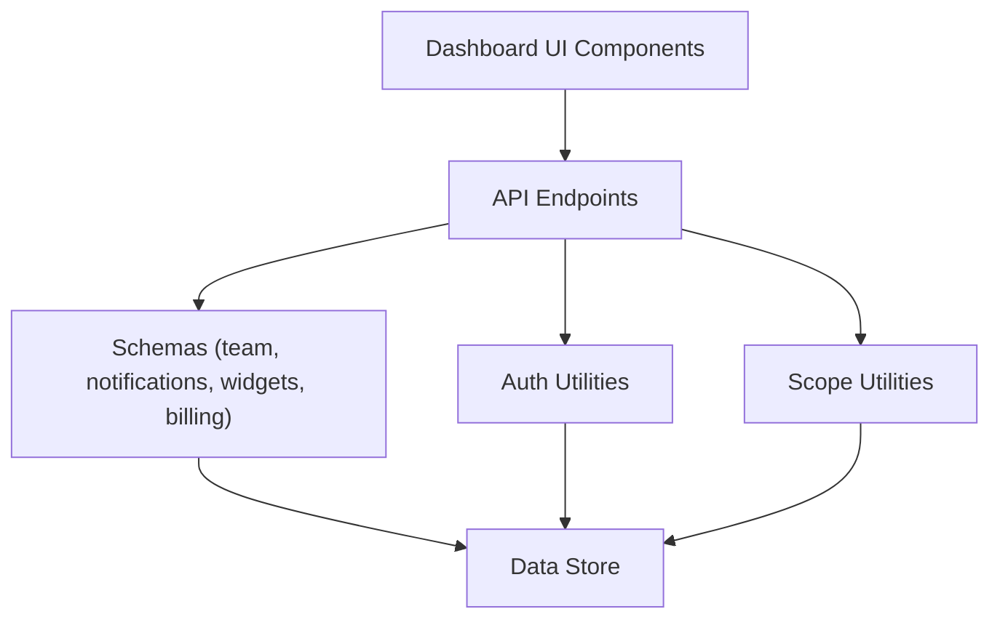

**Diagram sources**
- [apps/api/src/index.ts](file://apps/api/src/index.ts)
- [apps/api/src/schemas/team.ts](file://apps/api/src/schemas/team.ts)
- [apps/api/src/schemas/notification-settings.ts](file://apps/api/src/schemas/notification-settings.ts)
- [apps/api/src/schemas/widgets.ts](file://apps/api/src/schemas/widgets.ts)
- [apps/api/src/schemas/billing.ts](file://apps/api/src/schemas/billing.ts)
- [apps/api/src/utils/auth.ts](file://apps/api/src/utils/auth.ts)
- [apps/api/src/utils/scopes.ts](file://apps/api/src/utils/scopes.ts)

## Detailed Component Analysis

### Team Management Endpoints
Team management encompasses creation, member administration, invitations, and permission control.

- Team Creation
  - Endpoint: POST /teams
  - Purpose: Create a new team with initial metadata.
  - Required fields: team name, workspace identifier.
  - Access control: Requires authenticated user with appropriate scopes.

- Member Management
  - Add Member: POST /teams/{teamId}/members
  - Remove Member: DELETE /teams/{teamId}/members/{userId}
  - Update Role: PUT /teams/{teamId}/members/{userId}
  - List Members: GET /teams/{teamId}/members
  - Access control: Requires admin or owner role within the team.

- Invitations
  - Invite User: POST /teams/{teamId}/invites
  - Resend Invite: POST /teams/{teamId}/invites/{inviteId}/resend
  - Cancel Invite: DELETE /teams/{teamId}/invites/{inviteId}
  - List Invites: GET /teams/{teamId}/invites
  - Access control: Requires admin or owner role.

- Permission Control
  - Assign Permissions: POST /teams/{teamId}/permissions
  - Revoke Permissions: DELETE /teams/{teamId}/permissions/{permissionId}
  - List Permissions: GET /teams/{teamId}/permissions
  - Access control: Requires admin or owner role.

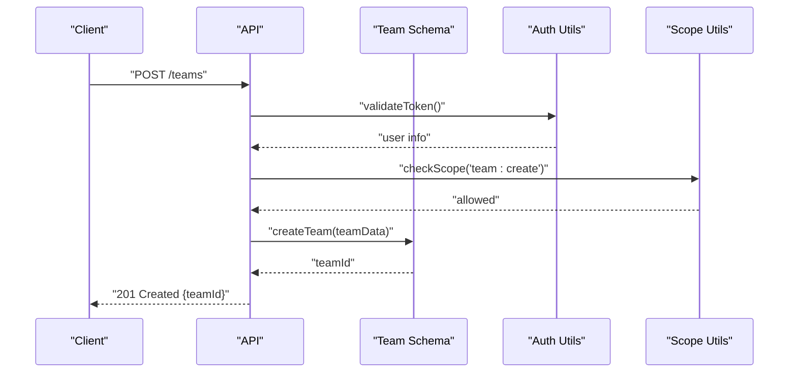

**Diagram sources**
- [apps/api/src/index.ts](file://apps/api/src/index.ts)
- [apps/api/src/schemas/team.ts](file://apps/api/src/schemas/team.ts)
- [apps/api/src/utils/auth.ts](file://apps/api/src/utils/auth.ts)
- [apps/api/src/utils/scopes.ts](file://apps/api/src/utils/scopes.ts)

**Section sources**
- [apps/api/src/schemas/team.ts](file://apps/api/src/schemas/team.ts)
- [apps/api/src/utils/auth.ts](file://apps/api/src/utils/auth.ts)
- [apps/api/src/utils/scopes.ts](file://apps/api/src/utils/scopes.ts)
- [apps/dashboard/src/components/team-members.tsx](file://apps/dashboard/src/components/team-members.tsx)
- [apps/dashboard/src/components/team-invites.tsx](file://apps/dashboard/src/components/team-invites.tsx)

### Notification Settings and Communication Preferences
Notification settings allow users to configure communication preferences and alert configurations.

- Endpoints
  - Get Notification Settings: GET /users/{userId}/notification-settings
  - Update Notification Settings: PUT /users/{userId}/notification-settings
  - List Notification Channels: GET /notification-channels
  - Toggle Channel Preference: POST /users/{userId}/notification-settings/channels/{channelId}

- UI Components
  - Notification Settings Page: [apps/dashboard/src/components/notification-settings.tsx](file://apps/dashboard/src/components/notification-settings.tsx)
  - Individual Notification Setting: [apps/dashboard/src/components/notification-setting.tsx](file://apps/dashboard/src/components/notification-setting.tsx)
  - Notifications Settings List: [apps/dashboard/src/components/notifications-settings-list.tsx](file://apps/dashboard/src/components/notifications-settings-list.tsx)

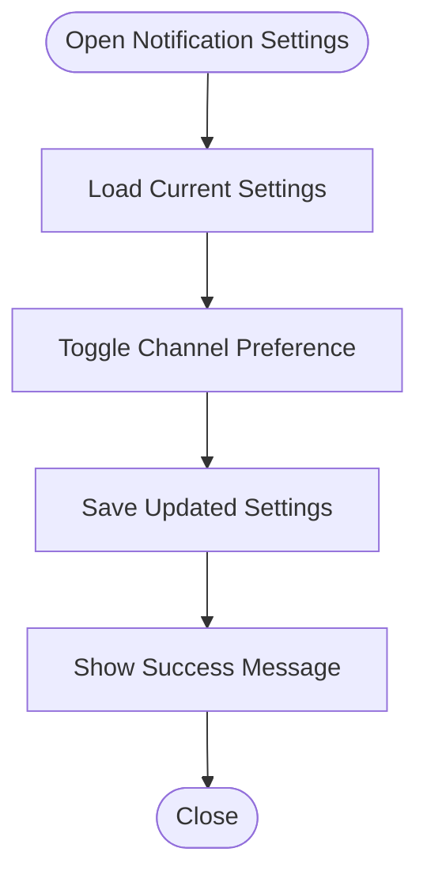

**Diagram sources**
- [apps/dashboard/src/components/notification-settings.tsx](file://apps/dashboard/src/components/notification-settings.tsx)
- [apps/dashboard/src/components/notification-setting.tsx](file://apps/dashboard/src/components/notification-setting.tsx)
- [apps/dashboard/src/components/notifications-settings-list.tsx](file://apps/dashboard/src/components/notifications-settings-list.tsx)

**Section sources**
- [apps/api/src/schemas/notification-settings.ts](file://apps/api/src/schemas/notification-settings.ts)
- [apps/dashboard/src/components/notification-settings.tsx](file://apps/dashboard/src/components/notification-settings.tsx)
- [apps/dashboard/src/components/notification-setting.tsx](file://apps/dashboard/src/components/notification-setting.tsx)
- [apps/dashboard/src/components/notifications-settings-list.tsx](file://apps/dashboard/src/components/notifications-settings-list.tsx)

### Widget Management and Dashboard Customization
Widget management enables users to customize dashboards and configure widget visibility and behavior.

- Endpoints
  - Get Widgets: GET /users/{userId}/widgets
  - Update Widget Config: PUT /users/{userId}/widgets/{widgetId}
  - Reset Widgets: POST /users/{userId}/widgets/reset
  - Toggle Column Visibility: POST /users/{userId}/widgets/columns/{columnId}/toggle

- UI Components
  - Widgets Container: [apps/dashboard/src/components/widgets/index.tsx](file://apps/dashboard/src/components/widgets/index.tsx)

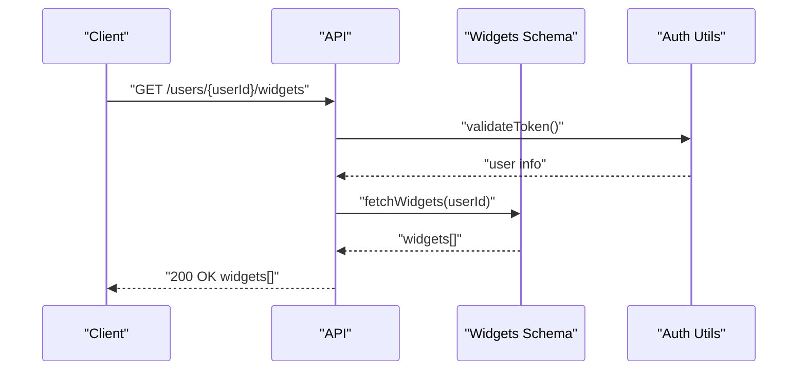

**Diagram sources**
- [apps/api/src/index.ts](file://apps/api/src/index.ts)
- [apps/api/src/schemas/widgets.ts](file://apps/api/src/schemas/widgets.ts)
- [apps/api/src/utils/auth.ts](file://apps/api/src/utils/auth.ts)
- [apps/dashboard/src/components/widgets/index.tsx](file://apps/dashboard/src/components/widgets/index.tsx)

**Section sources**
- [apps/api/src/schemas/widgets.ts](file://apps/api/src/schemas/widgets.ts)
- [apps/dashboard/src/components/widgets/index.tsx](file://apps/dashboard/src/components/widgets/index.tsx)

### User Preferences
User preferences encompass theme, locale, timezone, date format, week settings, profile updates, and MFA management.

- Endpoints
  - Get User Preferences: GET /users/{userId}/preferences
  - Update User Preferences: PUT /users/{userId}/preferences
  - Change Theme: POST /users/{userId}/preferences/theme
  - Set Locale: POST /users/{userId}/preferences/locale
  - Set Timezone: POST /users/{userId}/preferences/timezone
  - Set Date Format: POST /users/{userId}/preferences/date-format
  - Set Week Start: POST /users/{userId}/preferences/week-start
  - Upload Avatar: POST /users/{userId}/avatar
  - Update Display Name: PUT /users/{userId}/display-name
  - Update Email: PUT /users/{userId}/email
  - Manage MFA: POST /users/{userId}/mfa/enroll
  - Verify MFA: POST /users/{userId}/mfa/verify
  - Unenroll MFA: DELETE /users/{userId}/mfa

- UI Components
  - Theme Switch: [apps/dashboard/src/components/theme-switch.tsx](file://apps/dashboard/src/components/theme-switch.tsx)
  - Locale Settings: [apps/dashboard/src/components/locale-settings.tsx](file://apps/dashboard/src/components/locale-settings.tsx)
  - Timezone Detector: [apps/dashboard/src/components/timezone-detector.tsx](file://apps/dashboard/src/components/timezone-detector.tsx)
  - Date Format Settings: [apps/dashboard/src/components/date-format-settings.tsx](file://apps/dashboard/src/components/date-format-settings.tsx)
  - Week Settings: [apps/dashboard/src/components/week-settings.tsx](file://apps/dashboard/src/components/week-settings.tsx)
  - Account Settings: [apps/dashboard/src/components/account-settings.tsx](file://apps/dashboard/src/components/account-settings.tsx)
  - Change Theme: [apps/dashboard/src/components/change-theme.tsx](file://apps/dashboard/src/components/change-theme.tsx)
  - Change Timezone: [apps/dashboard/src/components/change-timezone.tsx](file://apps/dashboard/src/components/change-timezone.tsx)
  - Display Name: [apps/dashboard/src/components/display-name.tsx](file://apps/dashboard/src/components/display-name.tsx)
  - Change Email: [apps/dashboard/src/components/change-email.tsx](file://apps/dashboard/src/components/change-email.tsx)
  - Avatar Upload: [apps/dashboard/src/components/avatar-upload.tsx](file://apps/dashboard/src/components/avatar-upload.tsx)
  - Delete Account: [apps/dashboard/src/components/delete-account.tsx](file://apps/dashboard/src/components/delete-account.tsx)
  - MFA Settings List: [apps/dashboard/src/components/mfa-settings-list.tsx](file://apps/dashboard/src/components/mfa-settings-list.tsx)
  - Enroll MFA: [apps/dashboard/src/components/enroll-mfa.tsx](file://apps/dashboard/src/components/enroll-mfa.tsx)
  - Unenroll MFA: [apps/dashboard/src/components/unenroll-mfa.tsx](file://apps/dashboard/src/components/unenroll-mfa.tsx)
  - Verify MFA: [apps/dashboard/src/components/verify-mfa.tsx](file://apps/dashboard/src/components/verify-mfa.tsx)

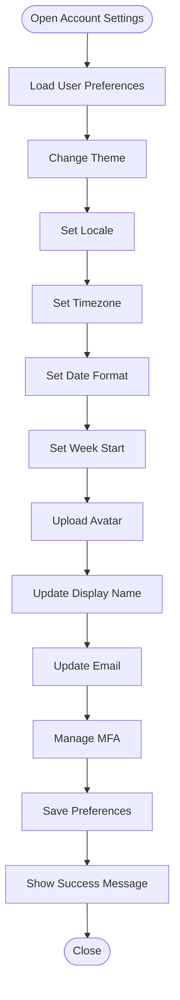

**Diagram sources**
- [apps/dashboard/src/components/account-settings.tsx](file://apps/dashboard/src/components/account-settings.tsx)
- [apps/dashboard/src/components/theme-switch.tsx](file://apps/dashboard/src/components/theme-switch.tsx)
- [apps/dashboard/src/components/locale-settings.tsx](file://apps/dashboard/src/components/locale-settings.tsx)
- [apps/dashboard/src/components/timezone-detector.tsx](file://apps/dashboard/src/components/timezone-detector.tsx)
- [apps/dashboard/src/components/date-format-settings.tsx](file://apps/dashboard/src/components/date-format-settings.tsx)
- [apps/dashboard/src/components/week-settings.tsx](file://apps/dashboard/src/components/week-settings.tsx)
- [apps/dashboard/src/components/display-name.tsx](file://apps/dashboard/src/components/display-name.tsx)
- [apps/dashboard/src/components/change-email.tsx](file://apps/dashboard/src/components/change-email.tsx)
- [apps/dashboard/src/components/avatar-upload.tsx](file://apps/dashboard/src/components/avatar-upload.tsx)
- [apps/dashboard/src/components/mfa-settings-list.tsx](file://apps/dashboard/src/components/mfa-settings-list.tsx)
- [apps/dashboard/src/components/enroll-mfa.tsx](file://apps/dashboard/src/components/enroll-mfa.tsx)
- [apps/dashboard/src/components/unenroll-mfa.tsx](file://apps/dashboard/src/components/unenroll-mfa.tsx)
- [apps/dashboard/src/components/verify-mfa.tsx](file://apps/dashboard/src/components/verify-mfa.tsx)

**Section sources**
- [apps/dashboard/src/components/account-settings.tsx](file://apps/dashboard/src/components/account-settings.tsx)
- [apps/dashboard/src/components/theme-switch.tsx](file://apps/dashboard/src/components/theme-switch.tsx)
- [apps/dashboard/src/components/locale-settings.tsx](file://apps/dashboard/src/components/locale-settings.tsx)
- [apps/dashboard/src/components/timezone-detector.tsx](file://apps/dashboard/src/components/timezone-detector.tsx)
- [apps/dashboard/src/components/date-format-settings.tsx](file://apps/dashboard/src/components/date-format-settings.tsx)
- [apps/dashboard/src/components/week-settings.tsx](file://apps/dashboard/src/components/week-settings.tsx)
- [apps/dashboard/src/components/display-name.tsx](file://apps/dashboard/src/components/display-name.tsx)
- [apps/dashboard/src/components/change-email.tsx](file://apps/dashboard/src/components/change-email.tsx)
- [apps/dashboard/src/components/avatar-upload.tsx](file://apps/dashboard/src/components/avatar-upload.tsx)
- [apps/dashboard/src/components/mfa-settings-list.tsx](file://apps/dashboard/src/components/mfa-settings-list.tsx)
- [apps/dashboard/src/components/enroll-mfa.tsx](file://apps/dashboard/src/components/enroll-mfa.tsx)
- [apps/dashboard/src/components/unenroll-mfa.tsx](file://apps/dashboard/src/components/unenroll-mfa.tsx)
- [apps/dashboard/src/components/verify-mfa.tsx](file://apps/dashboard/src/components/verify-mfa.tsx)

### Billing Management, Subscription Handling, and Usage Tracking
Billing management includes subscription plans, management, and usage tracking.

- Endpoints
  - Get Plans: GET /billing/plans
  - Get Subscription: GET /users/{userId}/subscription
  - Manage Subscription: POST /users/{userId}/subscription/manage
  - Cancel Subscription: POST /users/{userId}/subscription/cancel
  - Resume Subscription: POST /users/{userId}/subscription/resume
  - Get Usage: GET /users/{userId}/usage
  - Get Usage Limits: GET /users/{userId}/usage/limits

- UI Components
  - Plans: [apps/dashboard/src/components/plans.tsx](file://apps/dashboard/src/components/plans.tsx)
  - Manage Subscription: [apps/dashboard/src/components/manage-subscription.tsx](file://apps/dashboard/src/components/manage-subscription.tsx)
  - Usage: [apps/dashboard/src/components/usage.tsx](file://apps/dashboard/src/components/usage.tsx)
  - Trial: [apps/dashboard/src/components/trial.tsx](file://apps/dashboard/src/components/trial.tsx)
  - Trial Guard: [apps/dashboard/src/components/trial-guard.tsx](file://apps/dashboard/src/components/trial-guard.tsx)
  - Upgrade Content: [apps/dashboard/src/components/upgrade-content.tsx](file://apps/dashboard/src/components/upgrade-content.tsx)
  - Portal: [apps/dashboard/src/components/portal.tsx](file://apps/dashboard/src/components/portal.tsx)

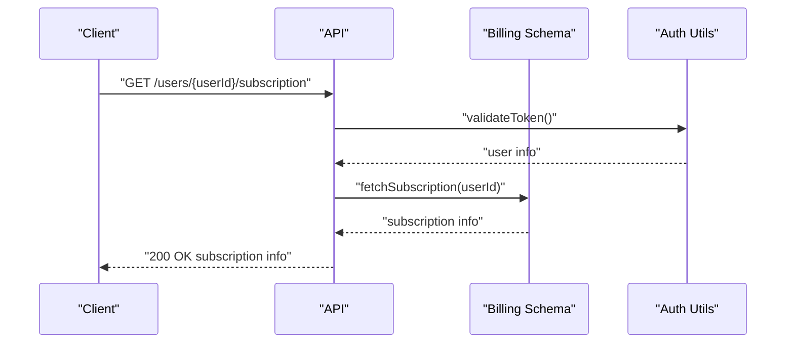

**Diagram sources**
- [apps/api/src/index.ts](file://apps/api/src/index.ts)
- [apps/api/src/schemas/billing.ts](file://apps/api/src/schemas/billing.ts)
- [apps/api/src/utils/auth.ts](file://apps/api/src/utils/auth.ts)
- [apps/dashboard/src/components/manage-subscription.tsx](file://apps/dashboard/src/components/manage-subscription.tsx)
- [apps/dashboard/src/components/usage.tsx](file://apps/dashboard/src/components/usage.tsx)
- [apps/dashboard/src/components/plans.tsx](file://apps/dashboard/src/components/plans.tsx)

**Section sources**
- [apps/api/src/schemas/billing.ts](file://apps/api/src/schemas/billing.ts)
- [apps/dashboard/src/components/plans.tsx](file://apps/dashboard/src/components/plans.tsx)
- [apps/dashboard/src/components/manage-subscription.tsx](file://apps/dashboard/src/components/manage-subscription.tsx)
- [apps/dashboard/src/components/usage.tsx](file://apps/dashboard/src/components/usage.tsx)
- [apps/dashboard/src/components/trial.tsx](file://apps/dashboard/src/components/trial.tsx)
- [apps/dashboard/src/components/trial-guard.tsx](file://apps/dashboard/src/components/trial-guard.tsx)
- [apps/dashboard/src/components/upgrade-content.tsx](file://apps/dashboard/src/components/upgrade-content.tsx)
- [apps/dashboard/src/components/portal.tsx](file://apps/dashboard/src/components/portal.tsx)

### Company Settings, Currency Configuration, and Tax Management
Company settings include company name, logo, currency, tax type, and VAT number. Currency configuration supports base currency selection and conversion.

- Endpoints
  - Get Company Settings: GET /companies/{companyId}/settings
  - Update Company Settings: PUT /companies/{companyId}/settings
  - Update Company Name: PUT /companies/{companyId}/name
  - Update Company Logo: PUT /companies/{companyId}/logo
  - Select Currency: POST /companies/{companyId}/currency
  - Select Tax Type: POST /companies/{companyId}/tax-type
  - Set VAT Number: POST /companies/{companyId}/vat-number
  - Get Accounting Settings: GET /companies/{companyId}/accounting-settings
  - Update Accounting Settings: PUT /companies/{companyId}/accounting-settings

- UI Components
  - Company Name: [apps/dashboard/src/components/company-name.tsx](file://apps/dashboard/src/components/company-name.tsx)
  - Company Logo: [apps/dashboard/src/components/company-logo.tsx](file://apps/dashboard/src/components/company-logo.tsx)
  - Select Currency: [apps/dashboard/src/components/select-currency.tsx](file://apps/dashboard/src/components/select-currency.tsx)
  - Select Tax Type: [apps/dashboard/src/components/select-tax-type.tsx](file://apps/dashboard/src/components/select-tax-type.tsx)
  - VAT Number Input: [apps/dashboard/src/components/vat-number-input.tsx](file://apps/dashboard/src/components/vat-number-input.tsx)
  - Accounting Settings: [apps/dashboard/src/components/accounting-settings.tsx](file://apps/dashboard/src/components/accounting-settings.tsx)
  - Base Currency: [apps/dashboard/src/components/base-currency/index.tsx](file://apps/dashboard/src/components/base-currency/index.tsx)

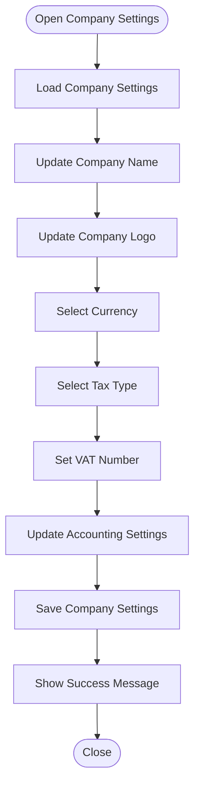

**Diagram sources**
- [apps/dashboard/src/components/company-name.tsx](file://apps/dashboard/src/components/company-name.tsx)
- [apps/dashboard/src/components/company-logo.tsx](file://apps/dashboard/src/components/company-logo.tsx)
- [apps/dashboard/src/components/select-currency.tsx](file://apps/dashboard/src/components/select-currency.tsx)
- [apps/dashboard/src/components/select-tax-type.tsx](file://apps/dashboard/src/components/select-tax-type.tsx)
- [apps/dashboard/src/components/vat-number-input.tsx](file://apps/dashboard/src/components/vat-number-input.tsx)
- [apps/dashboard/src/components/accounting-settings.tsx](file://apps/dashboard/src/components/accounting-settings.tsx)
- [apps/dashboard/src/components/base-currency/index.tsx](file://apps/dashboard/src/components/base-currency/index.tsx)

**Section sources**
- [apps/dashboard/src/components/company-name.tsx](file://apps/dashboard/src/components/company-name.tsx)
- [apps/dashboard/src/components/company-logo.tsx](file://apps/dashboard/src/components/company-logo.tsx)
- [apps/dashboard/src/components/select-currency.tsx](file://apps/dashboard/src/components/select-currency.tsx)
- [apps/dashboard/src/components/select-tax-type.tsx](file://apps/dashboard/src/components/select-tax-type.tsx)
- [apps/dashboard/src/components/vat-number-input.tsx](file://apps/dashboard/src/components/vat-number-input.tsx)
- [apps/dashboard/src/components/accounting-settings.tsx](file://apps/dashboard/src/components/accounting-settings.tsx)
- [apps/dashboard/src/components/base-currency/index.tsx](file://apps/dashboard/src/components/base-currency/index.tsx)

### Role-Based Access Control, Permission Inheritance, and Audit Logging
Role-based access control ensures that only authorized users can perform sensitive operations. Permission inheritance defines default permissions that can be overridden per resource.

- Authentication and Authorization
  - Token validation and user identity resolution
  - Scope-based access control for endpoints
  - Role-based access control (RBAC) enforcement

- Permission Inheritance
  - Default permissions assigned at team/workspace level
  - Overridable permissions per resource
  - Conditional permissions and temporary access

- Audit Logging
  - Track permission changes and sensitive actions
  - Log team membership changes and invitations
  - Record billing and subscription events

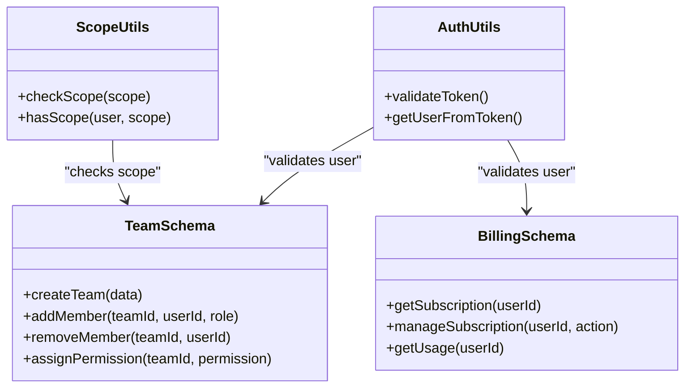

**Diagram sources**
- [apps/api/src/utils/auth.ts](file://apps/api/src/utils/auth.ts)
- [apps/api/src/utils/scopes.ts](file://apps/api/src/utils/scopes.ts)
- [apps/api/src/schemas/team.ts](file://apps/api/src/schemas/team.ts)
- [apps/api/src/schemas/billing.ts](file://apps/api/src/schemas/billing.ts)

**Section sources**
- [apps/api/src/utils/auth.ts](file://apps/api/src/utils/auth.ts)
- [apps/api/src/utils/scopes.ts](file://apps/api/src/utils/scopes.ts)
- [apps/api/src/schemas/team.ts](file://apps/api/src/schemas/team.ts)
- [apps/api/src/schemas/billing.ts](file://apps/api/src/schemas/billing.ts)

### Workspace Customization, Branding Options, and Multi-Tenant Features
Workspace customization includes branding options and multi-tenant isolation.

- Workspace Customization
  - Branding options: company name, logo, theme, and color schemes
  - Multi-tenant isolation: separate data stores per tenant
  - Tenant-specific settings and configurations

- UI Components
  - Theme Switch: [apps/dashboard/src/components/theme-switch.tsx](file://apps/dashboard/src/components/theme-switch.tsx)
  - Company Logo: [apps/dashboard/src/components/company-logo.tsx](file://apps/dashboard/src/components/company-logo.tsx)
  - Company Name: [apps/dashboard/src/components/company-name.tsx](file://apps/dashboard/src/components/company-name.tsx)

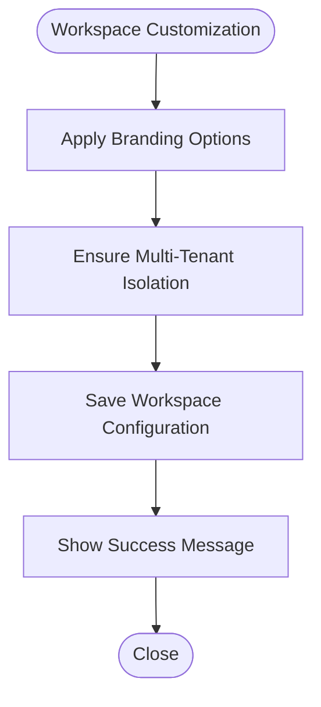

**Diagram sources**
- [apps/dashboard/src/components/theme-switch.tsx](file://apps/dashboard/src/components/theme-switch.tsx)
- [apps/dashboard/src/components/company-logo.tsx](file://apps/dashboard/src/components/company-logo.tsx)
- [apps/dashboard/src/components/company-name.tsx](file://apps/dashboard/src/components/company-name.tsx)

**Section sources**
- [apps/dashboard/src/components/theme-switch.tsx](file://apps/dashboard/src/components/theme-switch.tsx)
- [apps/dashboard/src/components/company-logo.tsx](file://apps/dashboard/src/components/company-logo.tsx)
- [apps/dashboard/src/components/company-name.tsx](file://apps/dashboard/src/components/company-name.tsx)

### Examples

#### Team Onboarding Workflow
- Steps:
  - Create team
  - Invite members
  - Assign roles and permissions
  - Configure notification preferences
  - Customize dashboard widgets

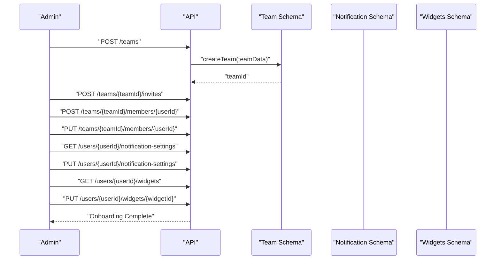

**Diagram sources**
- [apps/api/src/index.ts](file://apps/api/src/index.ts)
- [apps/api/src/schemas/team.ts](file://apps/api/src/schemas/team.ts)
- [apps/api/src/schemas/notification-settings.ts](file://apps/api/src/schemas/notification-settings.ts)
- [apps/api/src/schemas/widgets.ts](file://apps/api/src/schemas/widgets.ts)

#### Permission Workflow
- Steps:
  - Define roles and permissions
  - Assign permissions to team members
  - Override defaults per resource
  - Monitor and audit changes

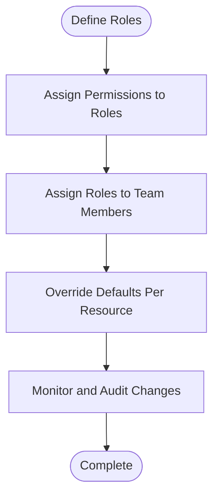

**Diagram sources**
- [apps/api/src/schemas/team.ts](file://apps/api/src/schemas/team.ts)
- [apps/api/src/utils/scopes.ts](file://apps/api/src/utils/scopes.ts)

#### Administrative Automation
- Steps:
  - Bulk invite users
  - Apply default notification settings
  - Configure widgets for new users
  - Set up billing and usage alerts

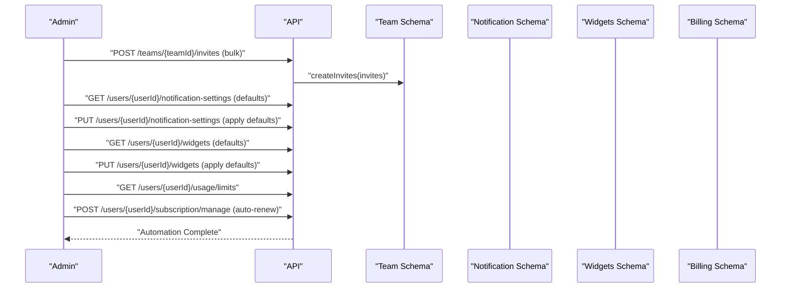

**Diagram sources**
- [apps/api/src/index.ts](file://apps/api/src/index.ts)
- [apps/api/src/schemas/team.ts](file://apps/api/src/schemas/team.ts)
- [apps/api/src/schemas/notification-settings.ts](file://apps/api/src/schemas/notification-settings.ts)
- [apps/api/src/schemas/widgets.ts](file://apps/api/src/schemas/widgets.ts)
- [apps/api/src/schemas/billing.ts](file://apps/api/src/schemas/billing.ts)

## Dependency Analysis
The following diagram illustrates dependencies among key components:

```mermaid
graph TB
API_IDX["apps/api/src/index.ts"] --> SCHEMA_TEAM["apps/api/src/schemas/team.ts"]
API_IDX --> SCHEMA_NOTIF["apps/api/src/schemas/notification-settings.ts"]
API_IDX --> SCHEMA_WIDGETS["apps/api/src/schemas/widgets.ts"]
API_IDX --> SCHEMA_BILLING["apps/api/src/schemas/billing.ts"]
API_IDX --> UTIL_AUTH["apps/api/src/utils/auth.ts"]
API_IDX --> UTIL_SCOPES["apps/api/src/utils/scopes.ts"]
DASH_MEMBERS["apps/dashboard/src/components/team-members.tsx"] --> API_IDX
DASH_INVITES["apps/dashboard/src/components/team-invites.tsx"] --> API_IDX
DASH_NOTIF["apps/dashboard/src/components/notification-settings.tsx"] --> API_IDX
DASH_WIDGETS["apps/dashboard/src/components/widgets/index.tsx"] --> API_IDX
DASH_ACCOUNT["apps/dashboard/src/components/account-settings.tsx"] --> API_IDX
DASH_APP["apps/dashboard/src/components/app-settings.tsx"] --> API_IDX
DASH_ACCOUNTING["apps/dashboard/src/components/accounting-settings.tsx"] --> API_IDX
DASH_COMPANY_NAME["apps/dashboard/src/components/company-name.tsx"] --> API_IDX
DASH_COMPANY_LOGO["apps/dashboard/src/components/company-logo.tsx"] --> API_IDX
DASH_CURRENCY["apps/dashboard/src/components/select-currency.tsx"] --> API_IDX
DASH_TAX["apps/dashboard/src/components/select-tax-type.tsx"] --> API_IDX
DASH_VAT["apps/dashboard/src/components/vat-number-input.tsx"] --> API_IDX
DASH_PLANS["apps/dashboard/src/components/plans.tsx"] --> API_IDX
DASH_SUB["apps/dashboard/src/components/manage-subscription.tsx"] --> API_IDX
DASH_USAGE["apps/dashboard/src/components/usage.tsx"] --> API_IDX
DASH_THEME["apps/dashboard/src/components/theme-switch.tsx"] --> API_IDX
DASH_LOCALE["apps/dashboard/src/components/locale-settings.tsx"] --> API_IDX
DASH_TZ["apps/dashboard/src/components/timezone-detector.tsx"] --> API_IDX
DASH_DATE["apps/dashboard/src/components/date-format-settings.tsx"] --> API_IDX
DASH_WEEK["apps/dashboard/src/components/week-settings.tsx"] --> API_IDX
DASH_BASE_CUR["apps/dashboard/src/components/base-currency/index.tsx"] --> API_IDX
```

**Diagram sources**
- [apps/api/src/index.ts](file://apps/api/src/index.ts)
- [apps/api/src/schemas/team.ts](file://apps/api/src/schemas/team.ts)
- [apps/api/src/schemas/notification-settings.ts](file://apps/api/src/schemas/notification-settings.ts)
- [apps/api/src/schemas/widgets.ts](file://apps/api/src/schemas/widgets.ts)
- [apps/api/src/schemas/billing.ts](file://apps/api/src/schemas/billing.ts)
- [apps/api/src/utils/auth.ts](file://apps/api/src/utils/auth.ts)
- [apps/api/src/utils/scopes.ts](file://apps/api/src/utils/scopes.ts)
- [apps/dashboard/src/components/team-members.tsx](file://apps/dashboard/src/components/team-members.tsx)
- [apps/dashboard/src/components/team-invites.tsx](file://apps/dashboard/src/components/team-invites.tsx)
- [apps/dashboard/src/components/notification-settings.tsx](file://apps/dashboard/src/components/notification-settings.tsx)
- [apps/dashboard/src/components/widgets/index.tsx](file://apps/dashboard/src/components/widgets/index.tsx)
- [apps/dashboard/src/components/account-settings.tsx](file://apps/dashboard/src/components/account-settings.tsx)
- [apps/dashboard/src/components/app-settings.tsx](file://apps/dashboard/src/components/app-settings.tsx)
- [apps/dashboard/src/components/accounting-settings.tsx](file://apps/dashboard/src/components/accounting-settings.tsx)
- [apps/dashboard/src/components/company-name.tsx](file://apps/dashboard/src/components/company-name.tsx)
- [apps/dashboard/src/components/company-logo.tsx](file://apps/dashboard/src/components/company-logo.tsx)
- [apps/dashboard/src/components/select-currency.tsx](file://apps/dashboard/src/components/select-currency.tsx)
- [apps/dashboard/src/components/select-tax-type.tsx](file://apps/dashboard/src/components/select-tax-type.tsx)
- [apps/dashboard/src/components/vat-number-input.tsx](file://apps/dashboard/src/components/vat-number-input.tsx)
- [apps/dashboard/src/components/plans.tsx](file://apps/dashboard/src/components/plans.tsx)
- [apps/dashboard/src/components/manage-subscription.tsx](file://apps/dashboard/src/components/manage-subscription.tsx)
- [apps/dashboard/src/components/usage.tsx](file://apps/dashboard/src/components/usage.tsx)
- [apps/dashboard/src/components/theme-switch.tsx](file://apps/dashboard/src/components/theme-switch.tsx)
- [apps/dashboard/src/components/locale-settings.tsx](file://apps/dashboard/src/components/locale-settings.tsx)
- [apps/dashboard/src/components/timezone-detector.tsx](file://apps/dashboard/src/components/timezone-detector.tsx)
- [apps/dashboard/src/components/date-format-settings.tsx](file://apps/dashboard/src/components/date-format-settings.tsx)
- [apps/dashboard/src/components/week-settings.tsx](file://apps/dashboard/src/components/week-settings.tsx)
- [apps/dashboard/src/components/base-currency/index.tsx](file://apps/dashboard/src/components/base-currency/index.tsx)

**Section sources**
- [apps/api/src/index.ts](file://apps/api/src/index.ts)
- [apps/api/src/schemas/team.ts](file://apps/api/src/schemas/team.ts)
- [apps/api/src/schemas/notification-settings.ts](file://apps/api/src/schemas/notification-settings.ts)
- [apps/api/src/schemas/widgets.ts](file://apps/api/src/schemas/widgets.ts)
- [apps/api/src/schemas/billing.ts](file://apps/api/src/schemas/billing.ts)
- [apps/api/src/utils/auth.ts](file://apps/api/src/utils/auth.ts)
- [apps/api/src/utils/scopes.ts](file://apps/api/src/utils/scopes.ts)
- [apps/dashboard/src/components/team-members.tsx](file://apps/dashboard/src/components/team-members.tsx)
- [apps/dashboard/src/components/team-invites.tsx](file://apps/dashboard/src/components/team-invites.tsx)
- [apps/dashboard/src/components/notification-settings.tsx](file://apps/dashboard/src/components/notification-settings.tsx)
- [apps/dashboard/src/components/widgets/index.tsx](file://apps/dashboard/src/components/widgets/index.tsx)
- [apps/dashboard/src/components/account-settings.tsx](file://apps/dashboard/src/components/account-settings.tsx)
- [apps/dashboard/src/components/app-settings.tsx](file://apps/dashboard/src/components/app-settings.tsx)
- [apps/dashboard/src/components/accounting-settings.tsx](file://apps/dashboard/src/components/accounting-settings.tsx)
- [apps/dashboard/src/components/company-name.tsx](file://apps/dashboard/src/components/company-name.tsx)
- [apps/dashboard/src/components/company-logo.tsx](file://apps/dashboard/src/components/company-logo.tsx)
- [apps/dashboard/src/components/select-currency.tsx](file://apps/dashboard/src/components/select-currency.tsx)
- [apps/dashboard/src/components/select-tax-type.tsx](file://apps/dashboard/src/components/select-tax-type.tsx)
- [apps/dashboard/src/components/vat-number-input.tsx](file://apps/dashboard/src/components/vat-number-input.tsx)
- [apps/dashboard/src/components/plans.tsx](file://apps/dashboard/src/components/plans.tsx)
- [apps/dashboard/src/components/manage-subscription.tsx](file://apps/dashboard/src/components/manage-subscription.tsx)
- [apps/dashboard/src/components/usage.tsx](file://apps/dashboard/src/components/usage.tsx)
- [apps/dashboard/src/components/theme-switch.tsx](file://apps/dashboard/src/components/theme-switch.tsx)
- [apps/dashboard/src/components/locale-settings.tsx](file://apps/dashboard/src/components/locale-settings.tsx)
- [apps/dashboard/src/components/timezone-detector.tsx](file://apps/dashboard/src/components/timezone-detector.tsx)
- [apps/dashboard/src/components/date-format-settings.tsx](file://apps/dashboard/src/components/date-format-settings.tsx)
- [apps/dashboard/src/components/week-settings.tsx](file://apps/dashboard/src/components/week-settings.tsx)
- [apps/dashboard/src/components/base-currency/index.tsx](file://apps/dashboard/src/components/base-currency/index.tsx)

## Performance Considerations
- Minimize round trips by batching operations for team onboarding and bulk invitations.
- Cache frequently accessed settings (notification channels, widget configurations) to reduce latency.
- Use pagination for large lists (members, invites, usage history).
- Optimize image uploads for company logos and avatars.
- Implement efficient search filters for team members and invites.

## Troubleshooting Guide
Common issues and resolutions:
- Authentication failures: Ensure valid tokens and proper scope checks.
- Permission denied: Verify RBAC roles and inherited permissions.
- Invalid input data: Validate schemas before applying updates.
- Rate limiting: Implement client-side retries with exponential backoff.
- Network errors: Handle transient failures gracefully and notify users.

**Section sources**
- [apps/api/src/utils/auth.ts](file://apps/api/src/utils/auth.ts)
- [apps/api/src/utils/scopes.ts](file://apps/api/src/utils/scopes.ts)
- [apps/api/src/schemas/team.ts](file://apps/api/src/schemas/team.ts)
- [apps/api/src/schemas/notification-settings.ts](file://apps/api/src/schemas/notification-settings.ts)
- [apps/api/src/schemas/widgets.ts](file://apps/api/src/schemas/widgets.ts)
- [apps/api/src/schemas/billing.ts](file://apps/api/src/schemas/billing.ts)

## Conclusion
This documentation provides a comprehensive overview of team and settings management endpoints, covering creation, member management, permission control, notifications, widgets, user preferences, billing, company settings, RBAC, and multi-tenancy. The included diagrams and examples illustrate practical workflows for onboarding, permission management, and administrative automation. For further details, refer to the referenced source files.

## Appendices
- Additional UI components for advanced customization and settings are available under the dashboard components directory.