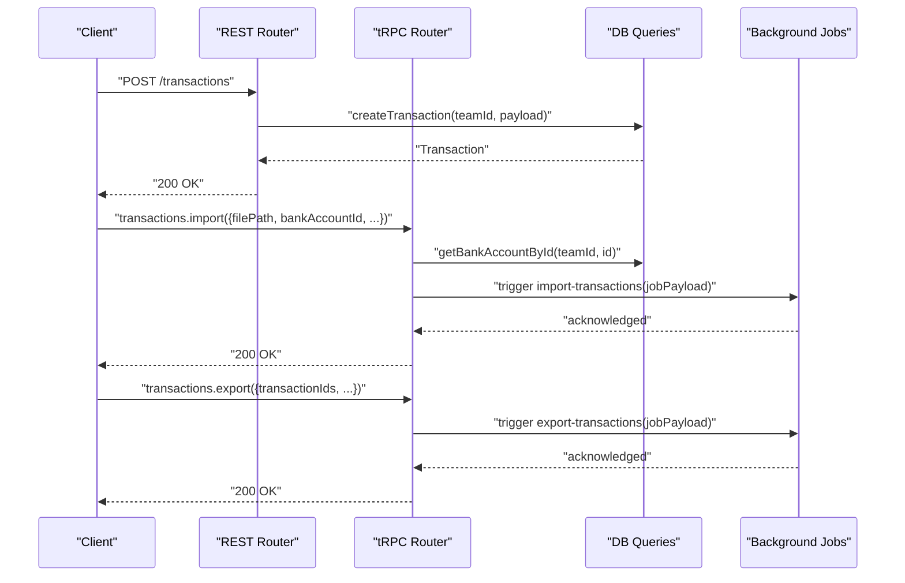
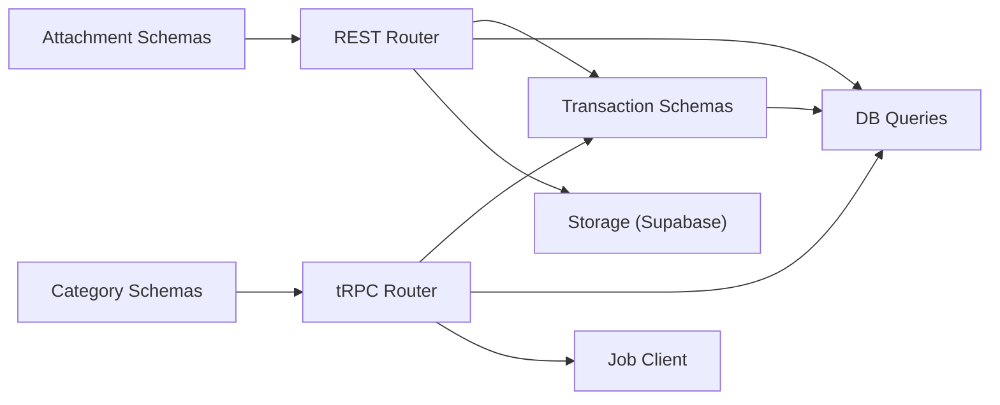

# Transaction Management Endpoints

<cite>
**Referenced Files in This Document**
- [transactions.ts](file://midday/apps/api/src/rest/routers/transactions.ts)
- [transactions.ts](file://midday/apps/api/src/trpc/routers/transactions.ts)
- [transactions.ts](file://midday/apps/api/src/schemas/transactions.ts)
- [transaction-attachments.ts](file://midday/apps/api/src/schemas/transaction-attachments.ts)
- [transaction-categories.ts](file://midday/apps/api/src/schemas/transaction-categories.ts)
- [transactions.ts](file://midday/packages/db/src/queries/transactions.ts)
- [transactions.test.ts](file://midday/apps/api/src/__tests__/routers/transactions.test.ts)
- [transactions.test.ts](file://midday/apps/api/src/__tests__/trpc/transactions.test.ts)
</cite>

## Table of Contents
1. [Introduction](#introduction)
2. [Project Structure](#project-structure)
3. [Core Components](#core-components)
4. [Architecture Overview](#architecture-overview)
5. [Detailed Component Analysis](#detailed-component-analysis)
6. [Dependency Analysis](#dependency-analysis)
7. [Performance Considerations](#performance-considerations)
8. [Troubleshooting Guide](#troubleshooting-guide)
9. [Conclusion](#conclusion)
10. [Appendices](#appendices)

## Introduction
This document provides comprehensive API documentation for transaction management endpoints. It covers transaction CRUD operations, bulk operations, search and filtering, categorization, reconciliation, bank import workflows, CSV upload processing, manual entry APIs, attachment handling, OCR and receipt management, transaction matching and auto-categorization, export functionality, status tracking, approval workflows, and audit trail. Examples illustrate bank synchronization, expense tracking, and financial reporting scenarios.

## Project Structure
The transaction management functionality spans REST and tRPC routers, shared schemas, database queries, and tests. The REST router exposes HTTP endpoints under the /transactions path. The tRPC router exposes procedures for programmatic clients. Shared schemas define request/response shapes. Database queries encapsulate complex filtering, sorting, and aggregation logic.

```mermaid
graph TB
subgraph "API Layer"
REST["REST Router<br/>GET /transactions/*"]
TRPC["tRPC Router<br/>transactions.*"]
end
subgraph "Schemas"
Schemas["Shared Transaction Schemas"]
Attachments["Attachment Schemas"]
Categories["Category Schemas"]
end
subgraph "Domain Layer"
Queries["DB Queries<br/>getTransactions, update, create, delete"]
end
Tests["Unit Tests"]
REST --> Schemas
TRPC --> Schemas
REST --> Queries
TRPC --> Queries
Schemas --> Queries
Attachments --> REST
Categories --> TRPC
Tests --> REST
Tests --> TRPC
```

**Diagram sources**
- [transactions.ts](file://midday/apps/api/src/rest/routers/transactions.ts#L1-L489)
- [transactions.ts](file://midday/apps/api/src/trpc/routers/transactions.ts#L1-L299)
- [transactions.ts](file://midday/apps/api/src/schemas/transactions.ts#L1-L938)
- [transaction-attachments.ts](file://midday/apps/api/src/schemas/transaction-attachments.ts#L1-L22)
- [transaction-categories.ts](file://midday/apps/api/src/schemas/transaction-categories.ts#L1-L47)
- [transactions.ts](file://midday/packages/db/src/queries/transactions.ts#L91-L793)

**Section sources**
- [transactions.ts](file://midday/apps/api/src/rest/routers/transactions.ts#L1-L489)
- [transactions.ts](file://midday/apps/api/src/trpc/routers/transactions.ts#L1-L299)
- [transactions.ts](file://midday/apps/api/src/schemas/transactions.ts#L1-L938)
- [transaction-attachments.ts](file://midday/apps/api/src/schemas/transaction-attachments.ts#L1-L22)
- [transaction-categories.ts](file://midday/apps/api/src/schemas/transaction-categories.ts#L1-L47)
- [transactions.ts](file://midday/packages/db/src/queries/transactions.ts#L91-L793)

## Core Components
- REST Transactions Router: Exposes endpoints for listing, retrieving, creating, updating, bulk updating, bulk creating, and deleting transactions. Includes attachment pre-signed URL generation for secure access.
- tRPC Transactions Router: Provides programmatic procedures for listing, retrieving, creating, updating, bulk updates, deletion, similarity search, match search, moving to review, CSV mapping generation, import, and export triggers.
- Shared Transaction Schemas: Define request/response shapes for transactions, including pagination, filtering, sorting, and bulk operations.
- Transaction Attachments Schemas: Define attachment creation, deletion, and processing schemas.
- Transaction Categories Schemas: Define category creation, update, deletion, and retrieval schemas.
- Database Queries: Implement complex filtering, search, aggregation, and computed fields for status tracking, export readiness, and fulfillment indicators.

**Section sources**
- [transactions.ts](file://midday/apps/api/src/rest/routers/transactions.ts#L37-L486)
- [transactions.ts](file://midday/apps/api/src/trpc/routers/transactions.ts#L54-L299)
- [transactions.ts](file://midday/apps/api/src/schemas/transactions.ts#L3-L243)
- [transaction-attachments.ts](file://midday/apps/api/src/schemas/transaction-attachments.ts#L3-L21)
- [transaction-categories.ts](file://midday/apps/api/src/schemas/transaction-categories.ts#L3-L46)
- [transactions.ts](file://midday/packages/db/src/queries/transactions.ts#L91-L793)

## Architecture Overview
The system separates concerns across API, schemas, domain, and persistence layers. REST and tRPC routers validate inputs using shared schemas, delegate to database queries, and trigger background jobs for heavy operations like import/export/mapping. Attachment pre-signed URLs integrate with storage infrastructure.



**Diagram sources**
- [transactions.ts](file://midday/apps/api/src/rest/routers/transactions.ts#L230-L265)
- [transactions.ts](file://midday/apps/api/src/trpc/routers/transactions.ts#L183-L233)
- [transactions.ts](file://midday/apps/api/src/trpc/routers/transactions.ts#L161-L181)

## Detailed Component Analysis

### REST Transactions Endpoints
- List transactions
  - Method: GET
  - Path: /
  - Query parameters: cursor, sort, pageSize, q, categories, tags, start, end, accounts, assignees, statuses, recurring, attachments, amountRange, amount, type, manual, exported, fulfilled
  - Response: transactionsResponseSchema with pagination metadata
  - Scope: transactions.read
- Retrieve transaction by ID
  - Method: GET
  - Path: /{id}
  - Path parameters: id
  - Response: transactionResponseSchema
  - Scope: transactions.read
- Generate pre-signed URL for transaction attachment
  - Method: POST
  - Path: /{transactionId}/attachments/{attachmentId}/presigned-url
  - Path parameters: transactionId, attachmentId
  - Query parameters: download (boolean)
  - Response: pre-signed URL with expiry and filename
  - Scope: transactions.read
- Create transaction
  - Method: POST
  - Path: /
  - Request body: createTransactionSchema
  - Response: transactionResponseSchema
  - Scope: transactions.write
- Update transaction
  - Method: PATCH
  - Path: /{id}
  - Path parameters: id
  - Request body: updateTransactionSchema (excluding id)
  - Response: transactionResponseSchema
  - Scope: transactions.write
- Bulk update transactions
  - Method: PATCH
  - Path: /bulk
  - Request body: updateTransactionsSchema
  - Response: transactionsResponseSchema
  - Scope: transactions.write
- Bulk create transactions
  - Method: POST
  - Path: /bulk
  - Request body: createTransactionsSchema
  - Response: createTransactionsResponseSchema
  - Scope: transactions.write
- Bulk delete transactions
  - Method: DELETE
  - Path: /bulk
  - Request body: array of transaction IDs
  - Response: array of deleted transaction IDs
  - Scope: transactions.write
- Delete transaction
  - Method: DELETE
  - Path: /{id}
  - Path parameters: id
  - Response: deleted transaction ID
  - Scope: transactions.write

Notes:
- Bulk delete excludes bank-imported transactions; manual-only deletions are supported.
- Pre-signed URL generation validates attachment ownership and path availability, then creates a short-lived URL for secure access.

**Section sources**
- [transactions.ts](file://midday/apps/api/src/rest/routers/transactions.ts#L37-L486)
- [transactions.ts](file://midday/apps/api/src/schemas/transactions.ts#L748-L800)

### tRPC Transactions Procedures
- transactions.get
  - Input: getTransactionsSchema
  - Output: transactionsResponseSchema
  - Behavior: applies filters, pagination, and computed fields; maps UI statuses to DB states
- transactions.getById
  - Input: getTransactionByIdSchema
  - Output: transactionResponseSchema or null
- transactions.create
  - Input: createTransactionSchema
  - Output: transactionResponseSchema
  - Side effects: triggers enrichment and bidirectional matching jobs
- transactions.update
  - Input: updateTransactionSchema
  - Output: transactionResponseSchema
- transactions.updateMany
  - Input: updateTransactionsSchema
  - Output: transactionsResponseSchema
- transactions.deleteMany
  - Input: array of transaction IDs
  - Output: array of deleted IDs
- transactions.getReviewCount
  - Input: none
  - Output: number (ready-for-export count)
- transactions.getSimilarTransactions
  - Input: getSimilarTransactionsSchema
  - Output: array of transactions
- transactions.searchTransactionMatch
  - Input: searchTransactionMatchSchema
  - Output: array of { transaction, score }
- transactions.moveToReview
  - Input: moveToReviewSchema
  - Output: { success: true }
- transactions.import
  - Input: importTransactionsSchema
  - Output: job acknowledgment
  - Behavior: validates bank account, updates manual account balance/currency if applicable, triggers import job
- transactions.export
  - Input: exportTransactionsSchema
  - Output: job acknowledgment
  - Behavior: triggers export job with locale, date format, and export settings
- transactions.generateCsvMapping
  - Input: generateCsvMappingSchema
  - Output: mapping suggestion object
  - Behavior: uses AI to suggest CSV column mappings; deduplicates concurrent requests

**Section sources**
- [transactions.ts](file://midday/apps/api/src/trpc/routers/transactions.ts#L55-L299)
- [transactions.ts](file://midday/apps/api/src/schemas/transactions.ts#L669-L746)

### Transaction Search, Filtering, and Bulk Operations
- Search and filtering
  - Text search supports exact amount match and full-text search across name, description, and amount.
  - Status filters map UI states to computed database states (blank, receipt_match, in_review, export_error, exported, excluded, archived).
  - Category filters expand parent categories to children; "uncategorized" handled separately.
  - Tag, account, assignee, recurring, amount range, specific amount operator, type (income/expense), manual flag, exported, and fulfilled filters are supported.
- Sorting
  - Supports multiple sortable fields: attachment, assigned, bank_account, category, tags, date, amount, name, status, counterparty.
- Bulk operations
  - Bulk update supports setting category, status, frequency, internal flag, note, assigned user, recurring flag, and tag.
  - Bulk delete accepts arrays of IDs with validation.

**Section sources**
- [transactions.ts](file://midday/apps/api/src/schemas/transactions.ts#L3-L243)
- [transactions.ts](file://midday/packages/db/src/queries/transactions.ts#L91-L793)

### Bank Import Workflows and CSV Upload Processing
- Import procedure
  - Validates bank account existence and manual flag.
  - Updates currency and optional balance for manual accounts.
  - Triggers import job with mappings and inversion flag.
- CSV mapping generation
  - Uses AI to suggest column mappings based on sample rows and selected prompt columns.
  - Deduplicates concurrent mapping requests by request key.

**Section sources**
- [transactions.ts](file://midday/apps/api/src/trpc/routers/transactions.ts#L183-L233)
- [transactions.ts](file://midday/apps/api/src/trpc/routers/transactions.ts#L250-L297)

### Manual Entry APIs
- Manual transaction creation via REST POST /transactions and tRPC transactions.create.
- Manual transaction updates via REST PATCH /transactions/{id} and tRPC transactions.update.
- Manual bulk operations via REST PATCH /transactions/bulk and tRPC transactions.updateMany.

**Section sources**
- [transactions.ts](file://midday/apps/api/src/rest/routers/transactions.ts#L230-L362)
- [transactions.ts](file://midday/apps/api/src/trpc/routers/transactions.ts#L130-L159)

### Attachment Handling, OCR, and Receipt Management
- Pre-signed URL endpoint for secure, time-limited access to attachments.
- Attachment schema defines path segments, filename, size, MIME type, and transaction association.
- Receipts are stored in a vault-like structure; pre-signed URLs enable download or inline viewing.

**Section sources**
- [transactions.ts](file://midday/apps/api/src/rest/routers/transactions.ts#L111-L227)
- [transaction-attachments.ts](file://midday/apps/api/src/schemas/transaction-attachments.ts#L3-L21)

### Transaction Matching Algorithms and Auto-Categorization
- Similarity search and match scoring leverage name, amount, currency, and date heuristics.
- Pending match suggestions tracked via dedicated table; UI status "receipt_match" reflects pending suggestions.
- Auto-categorization and enrichment triggered post-creation via background jobs.

**Section sources**
- [transactions.ts](file://midday/packages/db/src/queries/transactions.ts#L41-L46)
- [transactions.ts](file://midday/apps/api/src/trpc/routers/transactions.ts#L105-L128)
- [transactions.ts](file://midday/apps/api/src/trpc/routers/transactions.ts#L138-L156)

### Reconciliation and Export Functionality
- Export readiness computed from attachment presence and status.
- Export status determined by transaction status or accounting sync records.
- Export job triggered via tRPC transactions.export with locale, date format, and export settings.
- Review count exposed via tRPC transactions.getReviewCount.

**Section sources**
- [transactions.ts](file://midday/packages/db/src/queries/transactions.ts#L148-L173)
- [transactions.ts](file://midday/apps/api/src/trpc/routers/transactions.ts#L81-L83)
- [transactions.ts](file://midday/apps/api/src/trpc/routers/transactions.ts#L161-L181)

### Transaction Status Tracking, Approval Workflows, and Audit Trail
- Computed fields indicate fulfillment, export status, provider, exported timestamp, export errors, and pending suggestions.
- Status values include pending, archived, completed, posted, excluded, exported.
- Audit trail integration via activity creation in queries module.

**Section sources**
- [transactions.ts](file://midday/packages/db/src/queries/transactions.ts#L532-L579)
- [transactions.ts](file://midday/packages/db/src/queries/transactions.ts#L47-L48)

### Examples

#### Bank Synchronization
- Trigger import job with mappings and inversion flag.
- For manual accounts, update currency and optional balance prior to import.

**Section sources**
- [transactions.ts](file://midday/apps/api/src/trpc/routers/transactions.ts#L183-L233)

#### Expense Tracking
- Filter by type=expense, apply category slugs, and use amountRange for cost control.
- Mark fulfilled by adding receipts or posting transactions.

**Section sources**
- [transactions.ts](file://midday/apps/api/src/schemas/transactions.ts#L195-L243)
- [transactions.ts](file://midday/packages/db/src/queries/transactions.ts#L366-L377)

#### Financial Reporting
- Export transactions with locale and date format preferences.
- Use exported=true/false filters to report on sync-ready vs. exported sets.

**Section sources**
- [transactions.ts](file://midday/apps/api/src/trpc/routers/transactions.ts#L161-L181)
- [transactions.ts](file://midday/packages/db/src/queries/transactions.ts#L463-L491)

## Dependency Analysis


**Diagram sources**
- [transactions.ts](file://midday/apps/api/src/rest/routers/transactions.ts#L1-L35)
- [transactions.ts](file://midday/apps/api/src/trpc/routers/transactions.ts#L1-L40)
- [transactions.ts](file://midday/apps/api/src/schemas/transactions.ts#L1-L20)
- [transaction-attachments.ts](file://midday/apps/api/src/schemas/transaction-attachments.ts#L1-L22)
- [transaction-categories.ts](file://midday/apps/api/src/schemas/transaction-categories.ts#L1-L47)

**Section sources**
- [transactions.ts](file://midday/apps/api/src/rest/routers/transactions.ts#L1-L35)
- [transactions.ts](file://midday/apps/api/src/trpc/routers/transactions.ts#L1-L40)
- [transactions.ts](file://midday/apps/api/src/schemas/transactions.ts#L1-L20)

## Performance Considerations
- Pagination with cursor-based offsets reduces memory overhead for large datasets.
- Full-text search leverages vectorized indexing; numeric queries optimize to equality checks.
- Computed fields (fulfillment, export status) are derived via efficient EXISTS subqueries.
- Bulk operations minimize round trips by batching updates and deletes.
- CSV mapping generation caches concurrent requests to avoid redundant AI calls.

[No sources needed since this section provides general guidance]

## Troubleshooting Guide
- Validation failures
  - REST endpoints return 400 for malformed payloads; ensure required fields and correct types.
- Attachment pre-signed URL errors
  - 400 indicates missing file path; 404 indicates missing attachment; 500 indicates failure to generate URL.
- Deletion restrictions
  - Bulk delete excludes bank-imported transactions; use status updates to exclude rather than delete.
- Test coverage
  - Unit tests validate successful flows, pagination, filtering, and error responses.

**Section sources**
- [transactions.ts](file://midday/apps/api/src/rest/routers/transactions.ts#L111-L172)
- [transactions.ts](file://midday/apps/api/src/rest/routers/transactions.ts#L406-L450)
- [transactions.test.ts](file://midday/apps/api/src/__tests__/routers/transactions.test.ts#L250-L274)
- [transactions.test.ts](file://midday/apps/api/src/__tests__/routers/transactions.test.ts#L448-L456)

## Conclusion
The transaction management API provides robust CRUD, search, filtering, bulk operations, import/export, and attachment handling. It integrates with background jobs for heavy tasks, offers computed status tracking, and supports both REST and tRPC clients. The schemas and database queries enforce strong typing and efficient querying, while tests validate key behaviors.

[No sources needed since this section summarizes without analyzing specific files]

## Appendices

### Endpoint Reference Summary
- REST
  - GET / -> List transactions
  - GET /{id} -> Retrieve transaction
  - POST /{transactionId}/attachments/{attachmentId}/presigned-url -> Pre-signed URL
  - POST / -> Create transaction
  - PATCH /{id} -> Update transaction
  - PATCH /bulk -> Bulk update
  - POST /bulk -> Bulk create
  - DELETE /bulk -> Bulk delete
  - DELETE /{id} -> Delete transaction
- tRPC
  - transactions.get, transactions.getById, transactions.create, transactions.update, transactions.updateMany, transactions.deleteMany
  - transactions.getReviewCount, transactions.getSimilarTransactions, transactions.searchTransactionMatch
  - transactions.moveToReview, transactions.import, transactions.export, transactions.generateCsvMapping

**Section sources**
- [transactions.ts](file://midday/apps/api/src/rest/routers/transactions.ts#L37-L486)
- [transactions.ts](file://midday/apps/api/src/trpc/routers/transactions.ts#L54-L299)