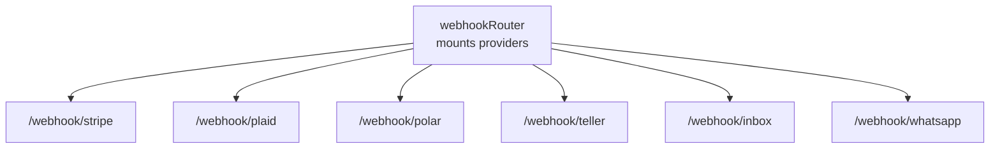
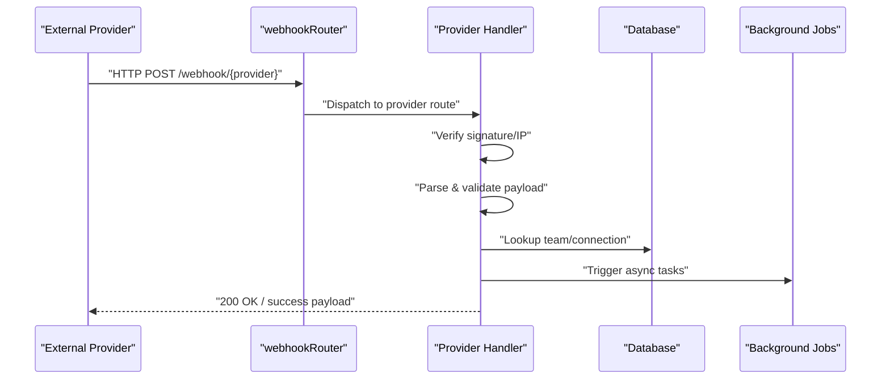
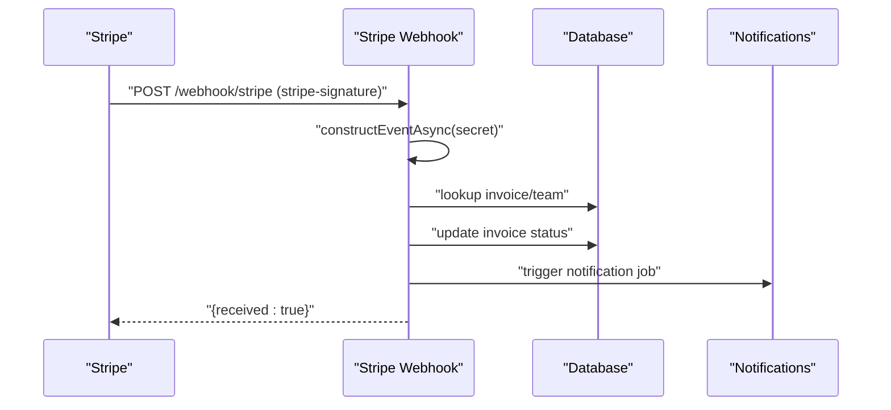
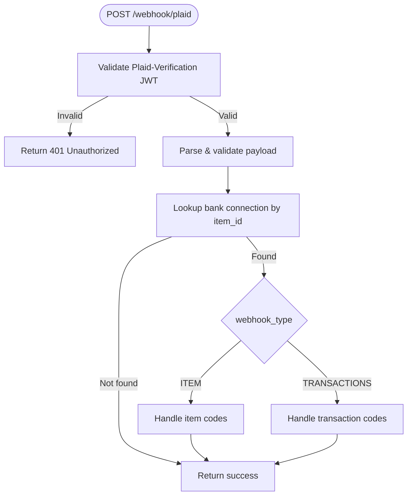
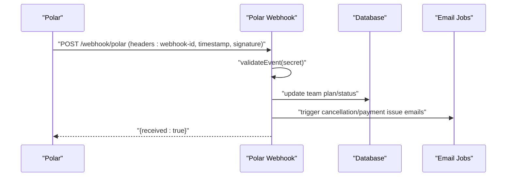
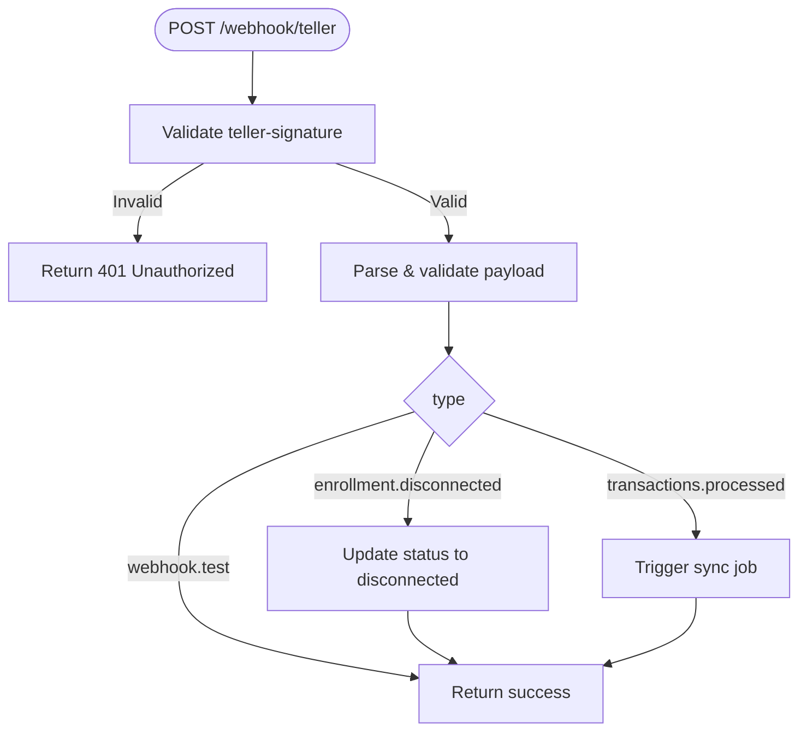
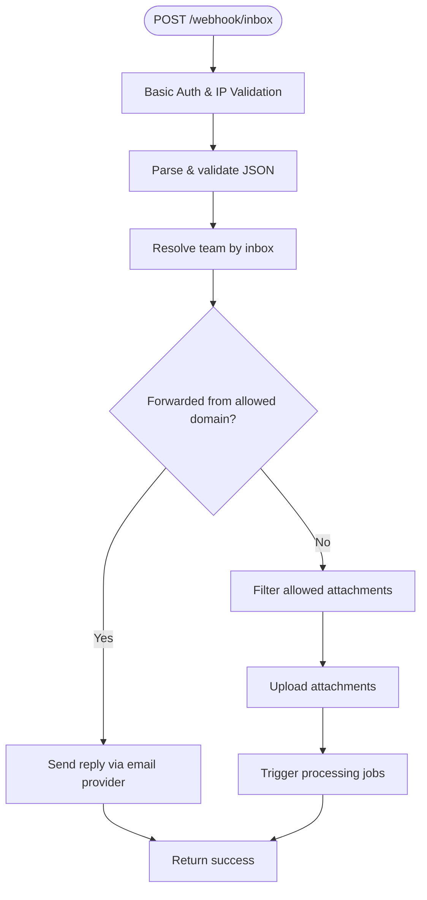
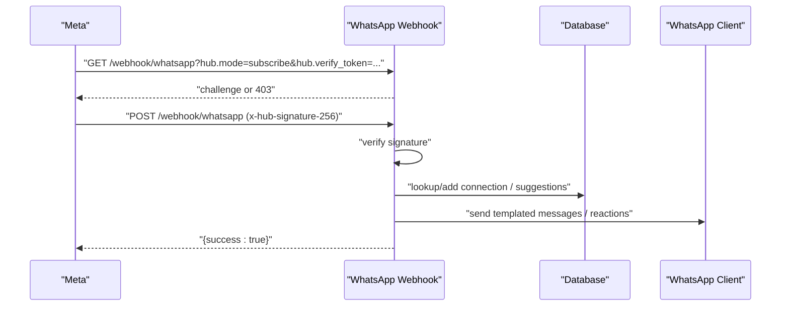
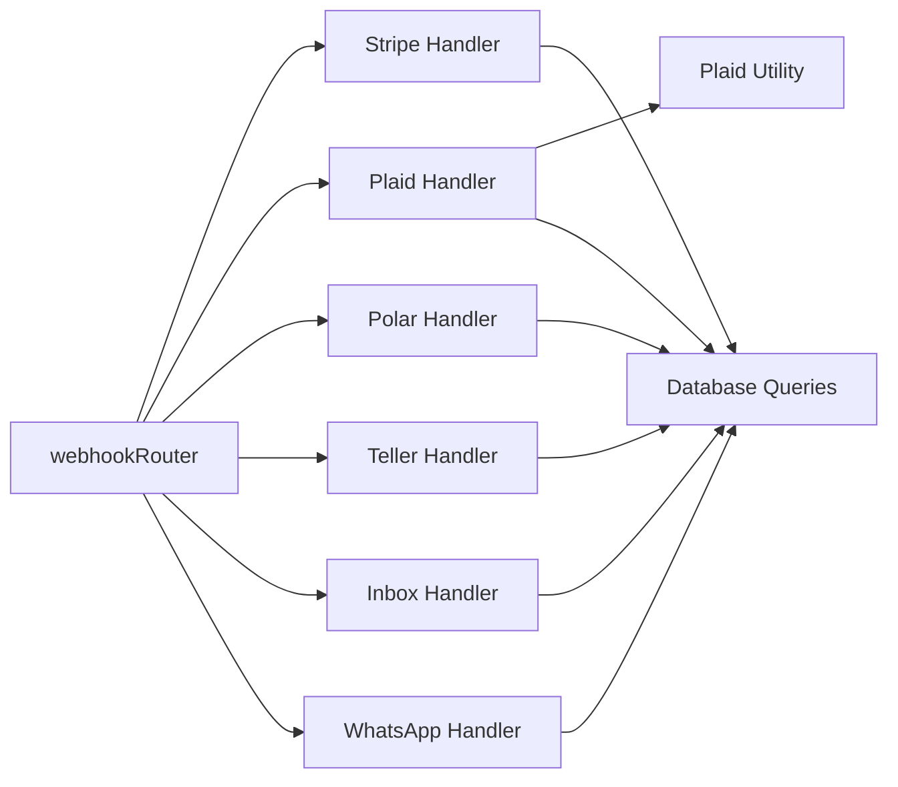

# Webhook & Integration Endpoints

<cite>
**Referenced Files in This Document**
- [webhookRouter (index)](file://midday/apps/api/src/rest/routers/webhooks/index.ts)
- [Stripe webhook](file://midday/apps/api/src/rest/routers/webhooks/stripe/index.ts)
- [Plaid webhook](file://midday/apps/api/src/rest/routers/webhooks/plaid/index.ts)
- [Polar webhook](file://midday/apps/api/src/rest/routers/webhooks/polar/index.ts)
- [Teller webhook](file://midday/apps/api/src/rest/routers/webhooks/teller/index.ts)
- [Inbox (Postmark) webhook](file://midday/apps/api/src/rest/routers/webhooks/inbox/index.ts)
- [WhatsApp webhook](file://midday/apps/api/src/rest/routers/webhooks/whatsapp/index.ts)
- [Plaid signature utility](file://midday/apps/api/src/utils/plaid.ts)
- [Plaid provider](file://midday/packages/banking/src/providers/plaid/plaid-api.ts)
</cite>

## Table of Contents
1. [Introduction](#introduction)
2. [Project Structure](#project-structure)
3. [Core Components](#core-components)
4. [Architecture Overview](#architecture-overview)
5. [Detailed Component Analysis](#detailed-component-analysis)
6. [Dependency Analysis](#dependency-analysis)
7. [Performance Considerations](#performance-considerations)
8. [Troubleshooting Guide](#troubleshooting-guide)
9. [Conclusion](#conclusion)
10. [Appendices](#appendices)

## Introduction
This document describes the webhook and integration endpoints powering event-driven integrations in the system. It covers registration, delivery, verification, and retry behavior for:
- Stripe payment webhooks
- Plaid transaction and bank connection webhooks
- Polar subscription webhooks
- Teller bank connection webhooks
- Inbox (Postmark) email ingestion
- WhatsApp Business API webhooks

It also documents supported webhook types, payload formats, security measures (signatures and replay protection), integration patterns, asynchronous processing, testing utilities, and monitoring capabilities.

## Project Structure
Webhook endpoints are mounted under a single router that applies public middleware and routes to provider-specific handlers.

**Diagram sources**
- [webhookRouter (index)](file://midday/apps/api/src/rest/routers/webhooks/index.ts#L1-L25)

**Section sources**
- [webhookRouter (index)](file://midday/apps/api/src/rest/routers/webhooks/index.ts#L1-L25)

## Core Components
- Webhook router: central mount for all providers, applies public middleware to all routes.
- Provider handlers: Stripe, Plaid, Polar, Teller, Inbox, and WhatsApp.
- Security utilities: Plaid JWT verification and signature validators.
- Asynchronous processing: jobs and task triggers for background work.

Key responsibilities:
- Validate signatures and headers
- Parse and sanitize payloads
- Map to internal connections and teams
- Trigger background jobs for heavy work
- Return appropriate HTTP responses to upstream providers

**Section sources**
- [webhookRouter (index)](file://midday/apps/api/src/rest/routers/webhooks/index.ts#L1-L25)
- [Plaid signature utility](file://midday/apps/api/src/utils/plaid.ts#L1-L122)

## Architecture Overview
End-to-end flow for incoming webhooks:
- Provider delivers webhook to public endpoint
- Signature and IP checks are performed
- Payload is validated and parsed
- Internal mapping resolves team/connection
- Background jobs are scheduled for heavy processing
- Acknowledgement is returned to the provider

**Diagram sources**
- [webhookRouter (index)](file://midday/apps/api/src/rest/routers/webhooks/index.ts#L1-L25)
- [Stripe webhook](file://midday/apps/api/src/rest/routers/webhooks/stripe/index.ts#L44-L301)
- [Plaid webhook](file://midday/apps/api/src/rest/routers/webhooks/plaid/index.ts#L79-L239)
- [Polar webhook](file://midday/apps/api/src/rest/routers/webhooks/polar/index.ts#L50-L272)
- [Teller webhook](file://midday/apps/api/src/rest/routers/webhooks/teller/index.ts#L62-L156)
- [Inbox (Postmark) webhook](file://midday/apps/api/src/rest/routers/webhooks/inbox/index.ts#L140-L368)
- [WhatsApp webhook](file://midday/apps/api/src/rest/routers/webhooks/whatsapp/index.ts#L136-L247)

## Detailed Component Analysis

### Stripe Payment Webhooks
- Endpoint: POST /webhook/stripe
- Purpose: Handle invoice payment events and connected account status changes
- Security: Uses Stripe signature header and webhook secret
- Supported events:
  - payment_intent.succeeded
  - payment_intent.payment_failed
  - charge.refunded
  - account.updated
- Behavior:
  - Verifies signature using Stripe SDK
  - Updates invoice state and team status
  - Triggers notification jobs for paid/refunded events
  - Returns 200 even on partial failures to avoid unnecessary retries

**Diagram sources**
- [Stripe webhook](file://midday/apps/api/src/rest/routers/webhooks/stripe/index.ts#L44-L301)

**Section sources**
- [Stripe webhook](file://midday/apps/api/src/rest/routers/webhooks/stripe/index.ts#L1-L305)

### Plaid Transaction & Bank Connection Webhooks
- Endpoint: POST /webhook/plaid
- Purpose: Handle transaction updates and item status changes
- Security: Validates Plaid-Verification JWT and request body hash
- Supported webhook types/codes:
  - ITEM: ERROR, PENDING_DISCONNECT, USER_PERMISSION_REVOKED, LOGIN_REPAIRED
  - TRANSACTIONS: SYNC_UPDATES_AVAILABLE, DEFAULT_UPDATE, INITIAL_UPDATE, HISTORICAL_UPDATE, TRANSACTIONS_REMOVED
- Behavior:
  - Verifies JWT signature and body hash
  - Parses payload and maps to bank connection
  - Updates connection status or triggers sync jobs
  - Removes transactions when flagged as removed

**Diagram sources**
- [Plaid webhook](file://midday/apps/api/src/rest/routers/webhooks/plaid/index.ts#L79-L239)
- [Plaid signature utility](file://midday/apps/api/src/utils/plaid.ts#L54-L121)

**Section sources**
- [Plaid webhook](file://midday/apps/api/src/rest/routers/webhooks/plaid/index.ts#L1-L243)
- [Plaid signature utility](file://midday/apps/api/src/utils/plaid.ts#L1-L122)
- [Plaid provider](file://midday/packages/banking/src/providers/plaid/plaid-api.ts#L59-L65)

### Polar Subscription Webhooks
- Endpoint: POST /webhook/polar
- Purpose: Handle subscription lifecycle events
- Security: Validates Polar webhook signature using SDK
- Supported events:
  - subscription.active
  - subscription.canceled
  - subscription.past_due
  - subscription.revoked
- Behavior:
  - Verifies signature and parses event
  - Updates team plan and status
  - Triggers cancellation/payment issue emails
  - Returns 500 on processing errors to allow retries

**Diagram sources**
- [Polar webhook](file://midday/apps/api/src/rest/routers/webhooks/polar/index.ts#L50-L272)

**Section sources**
- [Polar webhook](file://midday/apps/api/src/rest/routers/webhooks/polar/index.ts#L1-L276)

### Teller Bank Connection Webhooks
- Endpoint: POST /webhook/teller
- Purpose: Handle enrollment disconnections and transaction processing
- Security: Validates Teller signature header
- Supported types:
  - enrollment.disconnected
  - transactions.processed
  - account.number_verification.processed
  - webhook.test
- Behavior:
  - Validates signature and payload
  - Updates connection status or triggers sync jobs
  - Ignores test events

**Diagram sources**
- [Teller webhook](file://midday/apps/api/src/rest/routers/webhooks/teller/index.ts#L62-L156)

**Section sources**
- [Teller webhook](file://midday/apps/api/src/rest/routers/webhooks/teller/index.ts#L1-L160)

### Inbox (Postmark) Webhooks
- Endpoint: POST /webhook/inbox
- Purpose: Ingest inbound emails and process attachments
- Security: Optional Basic Auth and IP allowlist for production
- Behavior:
  - Validates request body against schema
  - Resolves team by inbox email
  - Filters and uploads attachments
  - Triggers processing jobs
  - Supports forwarding for Google Workspace

**Diagram sources**
- [Inbox (Postmark) webhook](file://midday/apps/api/src/rest/routers/webhooks/inbox/index.ts#L140-L368)

**Section sources**
- [Inbox (Postmark) webhook](file://midday/apps/api/src/rest/routers/webhooks/inbox/index.ts#L1-L372)

### WhatsApp Business API Webhooks
- Endpoints:
  - GET /webhook/whatsapp (verification)
  - POST /webhook/whatsapp (events)
- Purpose: Receive messages, media, and button replies; manage connections
- Security:
  - Verification via verify_token
  - Production signature verification using x-hub-signature-256
- Supported message types:
  - text
  - image
  - document
  - interactive (button replies)
- Behavior:
  - Verifies signature in production
  - Extracts inbox ID from text to create connections
  - Handles media uploads asynchronously
  - Processes match suggestions via button replies

**Diagram sources**
- [WhatsApp webhook](file://midday/apps/api/src/rest/routers/webhooks/whatsapp/index.ts#L136-L247)

**Section sources**
- [WhatsApp webhook](file://midday/apps/api/src/rest/routers/webhooks/whatsapp/index.ts#L1-L518)

## Dependency Analysis
- Central router composes provider-specific routers.
- Provider handlers depend on:
  - Signature verification utilities (Plaid, Teller, WhatsApp)
  - Database queries for mapping and updates
  - Job/task systems for asynchronous processing
- Plaid provider sets webhook URLs and uses health checks.

**Diagram sources**
- [webhookRouter (index)](file://midday/apps/api/src/rest/routers/webhooks/index.ts#L1-L25)
- [Plaid webhook](file://midday/apps/api/src/rest/routers/webhooks/plaid/index.ts#L1-L243)
- [Plaid signature utility](file://midday/apps/api/src/utils/plaid.ts#L1-L122)
- [WhatsApp webhook](file://midday/apps/api/src/rest/routers/webhooks/whatsapp/index.ts#L1-L518)

**Section sources**
- [webhookRouter (index)](file://midday/apps/api/src/rest/routers/webhooks/index.ts#L1-L25)
- [Plaid provider](file://midday/packages/banking/src/providers/plaid/plaid-api.ts#L59-L65)

## Performance Considerations
- Prefer returning 200 quickly after initiating async work to avoid upstream retries (Stripe handler).
- Use parallel uploads for multiple attachments (Inbox handler).
- Cache JWK keys for Plaid verification to reduce external requests.
- Limit heavy operations to background jobs; keep webhook handlers lightweight.
- Monitor logs for slow or failing jobs and adjust concurrency accordingly.

[No sources needed since this section provides general guidance]

## Troubleshooting Guide
Common issues and resolutions:
- Invalid signature
  - Stripe: ensure webhook secret and signature header are configured and correct.
  - Plaid: verify Plaid-Verification JWT and request body hash.
  - Teller: confirm teller-signature header is present and valid.
  - WhatsApp: verify verify_token and x-hub-signature-256 in production.
  - Inbox: ensure Basic Auth credentials and IP allowlist are set.
- Missing or invalid payload
  - Validate request body against expected schema; log parsing errors.
- Connection not found
  - Ensure the webhook’s identifier (item_id, enrollment_id, inbox email) maps to an existing connection/team.
- Retry behavior
  - Stripe handler returns 200 even on partial failures to prevent retries.
  - Polar handler returns 500 to allow upstream retries on transient errors.
- Testing
  - Use provider dashboards to send test webhooks.
  - For WhatsApp, use the verification endpoint and simulate message events.
  - For Inbox, send test emails to the configured inbound address.

**Section sources**
- [Stripe webhook](file://midday/apps/api/src/rest/routers/webhooks/stripe/index.ts#L73-L78)
- [Plaid webhook](file://midday/apps/api/src/rest/routers/webhooks/plaid/index.ts#L87-L94)
- [Teller webhook](file://midday/apps/api/src/rest/routers/webhooks/teller/index.ts#L71-L75)
- [WhatsApp webhook](file://midday/apps/api/src/rest/routers/webhooks/whatsapp/index.ts#L151-L154)
- [Inbox (Postmark) webhook](file://midday/apps/api/src/rest/routers/webhooks/inbox/index.ts#L52-L70)

## Conclusion
The webhook system provides secure, event-driven integrations with multiple providers. It enforces strong verification, handles diverse payload formats, and delegates heavy work to background jobs. Proper configuration of secrets and allowlists, combined with robust logging and retry policies, ensures reliable event processing.

[No sources needed since this section summarizes without analyzing specific files]

## Appendices

### Endpoint Reference

- Stripe
  - Method: POST
  - Path: /webhook/stripe
  - Headers: stripe-signature
  - Events: payment_intent.succeeded, payment_intent.payment_failed, charge.refunded, account.updated
  - Notes: Returns 200 even on partial failures

- Plaid
  - Method: POST
  - Path: /webhook/plaid
  - Headers: plaid-verification
  - Types/Codes: ITEM (ERROR, PENDING_DISCONNECT, USER_PERMISSION_REVOKED, LOGIN_REPAIRED), TRANSACTIONS (SYNC_UPDATES_AVAILABLE, DEFAULT_UPDATE, INITIAL_UPDATE, HISTORICAL_UPDATE, TRANSACTIONS_REMOVED)

- Polar
  - Method: POST
  - Path: /webhook/polar
  - Headers: webhook-id, webhook-timestamp, webhook-signature
  - Events: subscription.active, subscription.canceled, subscription.past_due, subscription.revoked
  - Notes: Returns 500 to allow retries on processing errors

- Teller
  - Method: POST
  - Path: /webhook/teller
  - Headers: teller-signature
  - Types: enrollment.disconnected, transactions.processed, account.number_verification.processed, webhook.test

- Inbox (Postmark)
  - Method: POST
  - Path: /webhook/inbox
  - Auth: Basic Auth (optional), IP allowlist enforced outside dev
  - Fields: MessageID, FromFull, Subject, Attachments, OriginalRecipient, TextBody, HtmlBody

- WhatsApp
  - Methods:
    - GET /webhook/whatsapp (verification)
    - POST /webhook/whatsapp (events)
  - Headers: x-hub-signature-256 (production), verify_token (verification)
  - Types: text, image, document, interactive (button replies)

**Section sources**
- [Stripe webhook](file://midday/apps/api/src/rest/routers/webhooks/stripe/index.ts#L21-L43)
- [Plaid webhook](file://midday/apps/api/src/rest/routers/webhooks/plaid/index.ts#L53-L78)
- [Polar webhook](file://midday/apps/api/src/rest/routers/webhooks/polar/index.ts#L24-L49)
- [Teller webhook](file://midday/apps/api/src/rest/routers/webhooks/teller/index.ts#L36-L61)
- [Inbox (Postmark) webhook](file://midday/apps/api/src/rest/routers/webhooks/inbox/index.ts#L79-L139)
- [WhatsApp webhook](file://midday/apps/api/src/rest/routers/webhooks/whatsapp/index.ts#L39-L95)

### Security and Replay Protection
- Signature verification
  - Stripe: stripe-signature with webhook secret
  - Plaid: ES256 JWT with JWK retrieval and body hash comparison
  - Teller: custom signature header
  - WhatsApp: x-hub-signature-256 with app secret (production)
  - Inbox: Basic Auth and IP allowlist
- Replay protection
  - Use provider-side replay windows and idempotency
  - Log event IDs and deduplicate processing
  - For providers without built-in replay, maintain an in-memory or storage cache of recent event IDs

**Section sources**
- [Plaid signature utility](file://midday/apps/api/src/utils/plaid.ts#L54-L121)
- [Plaid webhook](file://midday/apps/api/src/rest/routers/webhooks/plaid/index.ts#L82-L94)
- [WhatsApp webhook](file://midday/apps/api/src/rest/routers/webhooks/whatsapp/index.ts#L138-L154)
- [Inbox (Postmark) webhook](file://midday/apps/api/src/rest/routers/webhooks/inbox/index.ts#L24-L35)

### Integration Patterns and Asynchronous Processing
- Event-driven architecture
  - Handlers validate and acknowledge immediately
  - Heavy work delegated to background jobs/tasks
- Idempotency
  - Use event IDs and dedupe logic
- Monitoring
  - Log successes and failures per event type
  - Track latency and retry counts

[No sources needed since this section provides general guidance]

### Testing Tools and Utilities
- Stripe
  - Use Stripe CLI to send test events
- Plaid
  - Use sandbox environment and simulate webhook events
- Polar
  - Use Polar dashboard to send test subscription events
- Teller
  - Use Teller sandbox and send test enrollment/disconnect events
- Inbox
  - Send test emails to the inbound address; verify Basic Auth and IP allowlist
- WhatsApp
  - Use Meta’s verification flow and simulate message events

[No sources needed since this section provides general guidance]