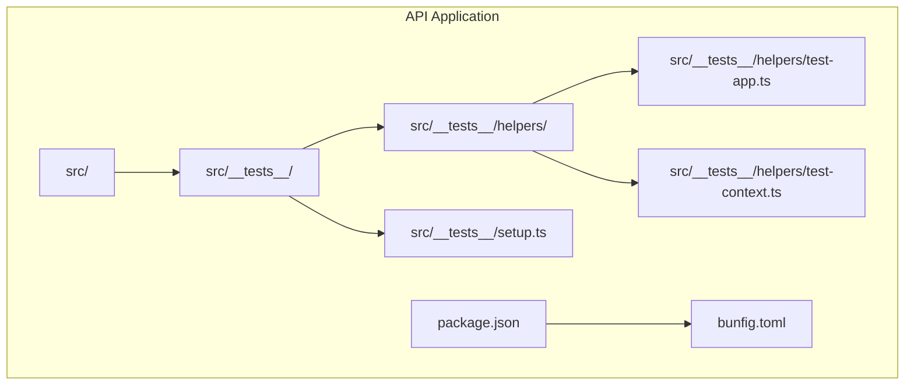
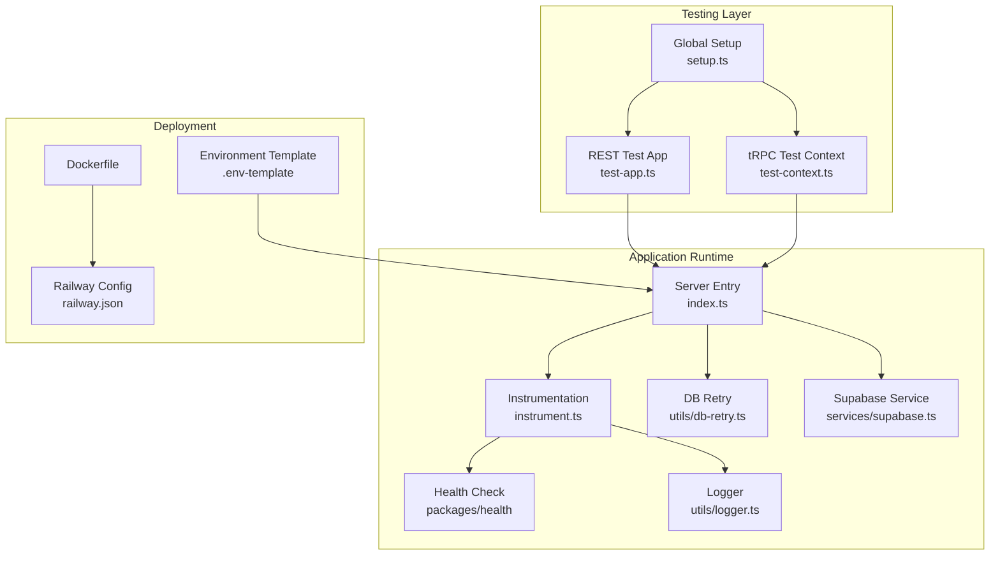
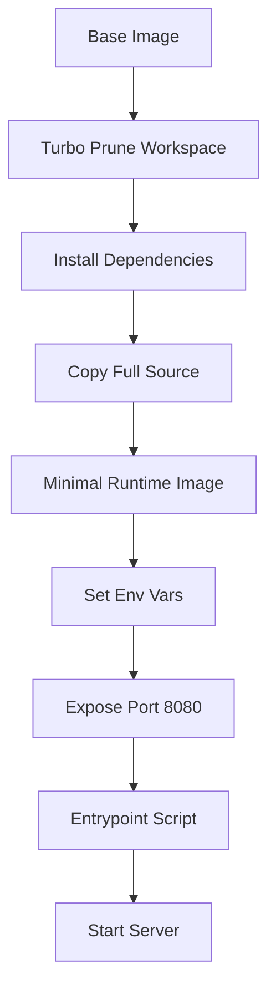
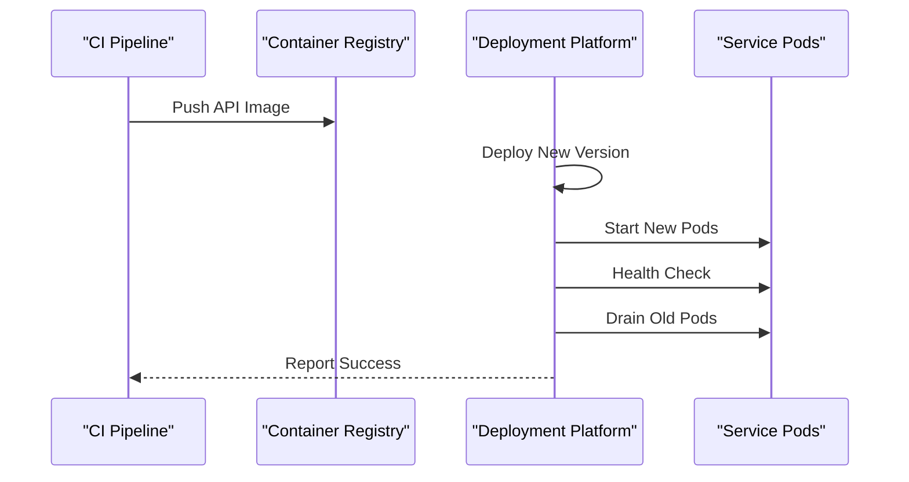
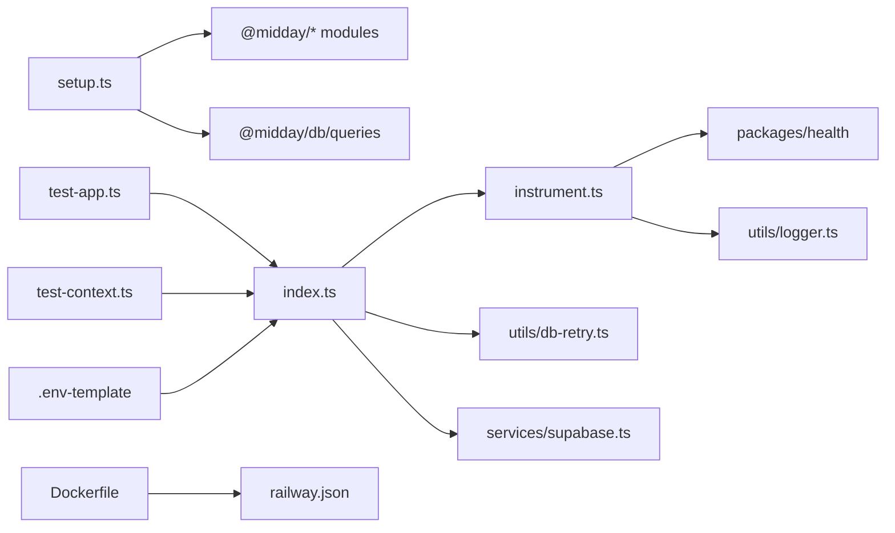

# Testing & Deployment

<cite>
**Referenced Files in This Document**
- [package.json](file://midday/apps/api/package.json)
- [bunfig.toml](file://midday/apps/api/bunfig.toml)
- [setup.ts](file://midday/apps/api/src/__tests__/setup.ts)
- [test-app.ts](file://midday/apps/api/src/__tests__/helpers/test-app.ts)
- [test-context.ts](file://midday/apps/api/src/__tests__/helpers/test-context.ts)
- [Dockerfile](file://midday/apps/api/Dockerfile)
- [.env-template](file://midday/apps/api/.env-template)
- [railway.json](file://midday/apps/api/railway.json)
- [index.ts](file://midday/apps/api/src/index.ts)
- [instrument.ts](file://midday/apps/api/src/instrument.ts)
- [health.ts](file://midday/packages/health/src/health.ts)
- [logger.ts](file://midday/apps/api/src/utils/logger.ts)
- [db-retry.ts](file://midday/apps/api/src/utils/db-retry.ts)
- [supabase.ts](file://midday/apps/api/src/services/supabase.ts)
- [trpc-routers](file://midday/apps/api/src/trpc/routers)
- [rest-routers](file://midday/apps/api/src/rest/routers)
</cite>

## Table of Contents
1. [Introduction](#introduction)
2. [Project Structure](#project-structure)
3. [Core Components](#core-components)
4. [Architecture Overview](#architecture-overview)
5. [Detailed Component Analysis](#detailed-component-analysis)
6. [Dependency Analysis](#dependency-analysis)
7. [Performance Considerations](#performance-considerations)
8. [Troubleshooting Guide](#troubleshooting-guide)
9. [Conclusion](#conclusion)
10. [Appendices](#appendices)

## Introduction
This document provides comprehensive testing and deployment guidance for the API application. It covers unit and integration testing strategies, factory-based test data generation, testing environment setup, mocking approaches, and test database management. It also documents continuous integration pipelines, automated testing workflows, quality gates, Docker containerization, environment configuration, production deployment procedures, monitoring, health checks, and rollback strategies.

## Project Structure
The API application resides under midday/apps/api and uses Bun for runtime and testing. Tests are colocated with source code under src/__tests__, with helpers for test app creation and tRPC context construction. The testing harness is configured via bunfig.toml to preload a global setup script that mocks external dependencies and database queries.

**Diagram sources**
- [setup.ts](file://midday/apps/api/src/__tests__/setup.ts#L1-L379)
- [test-app.ts](file://midday/apps/api/src/__tests__/helpers/test-app.ts#L1-L48)
- [test-context.ts](file://midday/apps/api/src/__tests__/helpers/test-context.ts#L1-L36)
- [package.json](file://midday/apps/api/package.json#L1-L78)
- [bunfig.toml](file://midday/apps/api/bunfig.toml#L1-L3)

**Section sources**
- [package.json](file://midday/apps/api/package.json#L1-L78)
- [bunfig.toml](file://midday/apps/api/bunfig.toml#L1-L3)

## Core Components
- Global test setup and mocks: Centralized in setup.ts to mock external dependencies and database query interfaces, ensuring deterministic test runs.
- REST integration test app: A lightweight Hono app wrapper with injected auth and scopes for REST router tests.
- tRPC test context: A factory that constructs a minimal tRPC context with mocked DB and session for procedure tests.
- Containerization: Multi-stage Dockerfile leveraging turbo for pruning and building only the API workspace.
- Environment configuration: Environment variables template for local development and production parity.

Key responsibilities:
- Isolate tests from external systems using mocks and stubs.
- Provide reusable test scaffolding for REST and tRPC layers.
- Build and deploy a minimal, reproducible runtime image.
- Manage environment-specific configuration and secrets.

**Section sources**
- [setup.ts](file://midday/apps/api/src/__tests__/setup.ts#L1-L379)
- [test-app.ts](file://midday/apps/api/src/__tests__/helpers/test-app.ts#L1-L48)
- [test-context.ts](file://midday/apps/api/src/__tests__/helpers/test-context.ts#L1-L36)
- [Dockerfile](file://midday/apps/api/Dockerfile#L1-L50)
- [.env-template](file://midday/apps/api/.env-template#L1-L149)

## Architecture Overview
The testing and deployment architecture integrates Bun’s native test runner with a global mock layer, a lightweight test app for REST routes, and a tRPC context factory. Production deployment uses a multi-stage Docker build with turbo pruning and a runtime entrypoint that supports health checks and graceful shutdown.

**Diagram sources**
- [setup.ts](file://midday/apps/api/src/__tests__/setup.ts#L1-L379)
- [test-app.ts](file://midday/apps/api/src/__tests__/helpers/test-app.ts#L1-L48)
- [test-context.ts](file://midday/apps/api/src/__tests__/helpers/test-context.ts#L1-L36)
- [index.ts](file://midday/apps/api/src/index.ts)
- [instrument.ts](file://midday/apps/api/src/instrument.ts)
- [health.ts](file://midday/packages/health/src/health.ts)
- [logger.ts](file://midday/apps/api/src/utils/logger.ts)
- [db-retry.ts](file://midday/apps/api/src/utils/db-retry.ts)
- [supabase.ts](file://midday/apps/api/src/services/supabase.ts)
- [Dockerfile](file://midday/apps/api/Dockerfile#L1-L50)
- [.env-template](file://midday/apps/api/.env-template#L1-L149)
- [railway.json](file://midday/apps/api/railway.json#L1-L31)

## Detailed Component Analysis

### Unit Testing Strategies
- Test runner: Uses Bun’s built-in test runner invoked via npm-style scripts.
- Preload setup: A single global setup file mocks external dependencies and database query interfaces to avoid flaky network-dependent tests.
- Mock coverage: Extensive mocking of @midday/db/queries, @midday/supabase/storage, @midday/job-client, @midday/import, @midday/invoice, and auth utilities ensures isolation.

Recommended practices:
- Keep tests focused on behavior, not implementation details.
- Use the provided helpers to minimize boilerplate.
- Prefer deterministic mocks over real external services.

**Section sources**
- [package.json](file://midday/apps/api/package.json#L1-L78)
- [bunfig.toml](file://midday/apps/api/bunfig.toml#L1-L3)
- [setup.ts](file://midday/apps/api/src/__tests__/setup.ts#L1-L379)

### Integration Testing Patterns
- REST integration tests: Use the REST test app helper to mount routers and simulate authenticated requests with predefined scopes.
- tRPC integration tests: Use the tRPC context factory to construct a minimal context with mocked DB and session, enabling procedure-level tests without a real database.

Patterns:
- Inject teamId and userId via helpers to simulate different user contexts.
- Verify response shapes and status codes against documented schemas.

**Section sources**
- [test-app.ts](file://midday/apps/api/src/__tests__/helpers/test-app.ts#L1-L48)
- [test-context.ts](file://midday/apps/api/src/__tests__/helpers/test-context.ts#L1-L36)

### Factory-Based Test Data Generation
- Current state: No dedicated factory modules were identified in the scanned paths. The test setup focuses on mocking query interfaces and returning predictable payloads.
- Recommended approach: Introduce factory modules under src/__tests__/factories to generate realistic, deterministic test data for entities like transactions, invoices, and customers. This improves test readability and reduces duplication.

Benefits:
- Encapsulate entity creation logic.
- Reduce coupling to raw mock data.
- Improve maintainability as schemas evolve.

[No sources needed since this section proposes a recommended approach without analyzing specific files]

### Testing Environment Setup
- Global environment variables: The template defines keys for Supabase, database connections, providers, logging, and integrations. The setup script enforces defaults for database URLs and service keys to ensure tests run without external dependencies.
- Database connectivity: The mock layer simulates Drizzle-like query interfaces, avoiding the need for a live Postgres instance during unit tests.

Guidance:
- Copy .env-template to .env for local development.
- Ensure DATABASE_PRIMARY_URL and related replica URLs are set for integration tests that require database connectivity.
- For CI, inject secrets via environment variables or secrets management.

**Section sources**
- [.env-template](file://midday/apps/api/.env-template#L1-L149)
- [setup.ts](file://midday/apps/api/src/__tests__/setup.ts#L363-L379)

### Mock Strategies
- Module mocking: The setup script uses Bun’s mock.module to replace external modules with deterministic implementations.
- Query interface mocking: A mock DB object exposes query methods mirroring Drizzle’s API, enabling tRPC and REST layers to operate without a real database.
- Utility mocking: Auth verification, invoice calculation, storage signed URLs, and job client are mocked to isolate tests.

Best practices:
- Centralize mocks in setup.ts to avoid duplication.
- Use the Proxy pattern to lazily create mocks for unknown exports.
- Keep mock signatures aligned with real interfaces to catch mismatches early.

**Section sources**
- [setup.ts](file://midday/apps/api/src/__tests__/setup.ts#L137-L264)
- [setup.ts](file://midday/apps/api/src/__tests__/setup.ts#L348-L353)

### Test Database Management
- Test databases: Not explicitly configured in the scanned files. Tests rely on mocked database queries.
- Integration scenarios: If tests require a real database, provision ephemeral test databases per CI job and seed schema using migration tools. Use environment variables to switch between mock and real DB modes.

[No sources needed since this section provides general guidance]

### Continuous Integration Pipelines and Quality Gates
- CI pipeline: Configure a CI workflow to run linting, type checking, and tests on pull requests and pushes. Use matrix builds to test across supported environments.
- Quality gates:
  - Lint pass: Enforce code style and security rules.
  - Type check: Prevent type errors from landing.
  - Test coverage: Establish minimum thresholds for unit and integration tests.
  - Security scanning: Scan dependencies for vulnerabilities.
- Artifacts: Publish test reports and coverage artifacts for review.

[No sources needed since this section provides general guidance]

### Automated Testing Workflows
- Local development: Run tests with the project script that discovers test files and executes them.
- CI: Use the same script to run tests in parallel, leveraging Bun’s native concurrency.

**Section sources**
- [package.json](file://midday/apps/api/package.json#L3-L9)

### Docker Containerization
- Multi-stage build:
  - Prune workspace with turbo to reduce build size.
  - Install dependencies and build only the API workspace.
  - Produce a minimal runtime image with only necessary files.
- Entrypoint: The image sets environment variables for production, exposes port 8080, and starts the server with an entrypoint script.
- Git metadata: The Dockerfile stamps the container with a git commit SHA for traceability.

**Diagram sources**
- [Dockerfile](file://midday/apps/api/Dockerfile#L1-L50)

**Section sources**
- [Dockerfile](file://midday/apps/api/Dockerfile#L1-L50)

### Environment Configuration
- Local development: Use .env-template to define environment variables for Supabase, database connections, providers, logging, and integrations.
- Production parity: Mirror environment variables in deployment platforms (e.g., Railway). Use secrets management for sensitive values.

**Section sources**
- [.env-template](file://midday/apps/api/.env-template#L1-L149)

### Production Deployment Procedures
- Build and push: Use the Dockerfile to build the image and push to a registry.
- Health checks: Configure health checks in deployment targets to ensure readiness and liveness.
- Rollout strategy: Use blue/green or rolling updates with overlapping deployments and draining to minimize downtime.
- Monitoring: Enable logs, metrics, and tracing to observe application behavior in production.

**Diagram sources**
- [Dockerfile](file://midday/apps/api/Dockerfile#L1-L50)
- [railway.json](file://midday/apps/api/railway.json#L7-L18)

**Section sources**
- [railway.json](file://midday/apps/api/railway.json#L1-L31)

## Dependency Analysis
The testing layer depends on the global setup to mock external modules and database interfaces. The runtime depends on instrumentation, health checks, logging, database retry logic, and Supabase services. Deployment depends on Docker configuration and environment templates.

**Diagram sources**
- [setup.ts](file://midday/apps/api/src/__tests__/setup.ts#L1-L379)
- [test-app.ts](file://midday/apps/api/src/__tests__/helpers/test-app.ts#L1-L48)
- [test-context.ts](file://midday/apps/api/src/__tests__/helpers/test-context.ts#L1-L36)
- [index.ts](file://midday/apps/api/src/index.ts)
- [instrument.ts](file://midday/apps/api/src/instrument.ts)
- [health.ts](file://midday/packages/health/src/health.ts)
- [logger.ts](file://midday/apps/api/src/utils/logger.ts)
- [db-retry.ts](file://midday/apps/api/src/utils/db-retry.ts)
- [supabase.ts](file://midday/apps/api/src/services/supabase.ts)
- [Dockerfile](file://midday/apps/api/Dockerfile#L1-L50)
- [.env-template](file://midday/apps/api/.env-template#L1-L149)
- [railway.json](file://midday/apps/api/railway.json#L1-L31)

**Section sources**
- [setup.ts](file://midday/apps/api/src/__tests__/setup.ts#L1-L379)
- [test-app.ts](file://midday/apps/api/src/__tests__/helpers/test-app.ts#L1-L48)
- [test-context.ts](file://midday/apps/api/src/__tests__/helpers/test-context.ts#L1-L36)
- [index.ts](file://midday/apps/api/src/index.ts)
- [instrument.ts](file://midday/apps/api/src/instrument.ts)
- [health.ts](file://midday/packages/health/src/health.ts)
- [logger.ts](file://midday/apps/api/src/utils/logger.ts)
- [db-retry.ts](file://midday/apps/api/src/utils/db-retry.ts)
- [supabase.ts](file://midday/apps/api/src/services/supabase.ts)
- [Dockerfile](file://midday/apps/api/Dockerfile#L1-L50)
- [.env-template](file://midday/apps/api/.env-template#L1-L149)
- [railway.json](file://midday/apps/api/railway.json#L1-L31)

## Performance Considerations
- Test performance: Use mocks to eliminate network overhead and database latency. Keep mock payloads minimal and deterministic.
- Build performance: Leverage turbo pruning to reduce Docker build times and image sizes.
- Runtime performance: Use database retry logic and structured logging to diagnose slow operations.

[No sources needed since this section provides general guidance]

## Troubleshooting Guide
- Tests fail due to missing environment variables: Ensure DATABASE_PRIMARY_URL and related replica URLs are set in the environment or defaults are acceptable for mock-based tests.
- Mock mismatch errors: Update mocks in setup.ts to align with changed interfaces in @midday/* packages.
- Health check failures: Verify the health endpoint implementation and deployment configuration.
- Logging and observability: Confirm logger configuration and instrumentation are present in the runtime.

**Section sources**
- [setup.ts](file://midday/apps/api/src/__tests__/setup.ts#L363-L379)
- [health.ts](file://midday/packages/health/src/health.ts)
- [logger.ts](file://midday/apps/api/src/utils/logger.ts)

## Conclusion
The API application employs a robust testing strategy centered on global mocks and reusable test scaffolding for REST and tRPC layers. The Docker-based deployment pipeline emphasizes reproducibility and minimal runtime footprint. By adopting factory-based test data generation, establishing CI quality gates, and refining health checks and rollback procedures, the project can achieve higher reliability and faster delivery.

[No sources needed since this section summarizes without analyzing specific files]

## Appendices
- Example test discovery and execution: The project script locates test files and runs them with Bun’s test runner.
- Test app usage: Mount routers in the REST test app and assert responses.
- tRPC context usage: Construct a test context with createTestContext and pass it to procedure callers.

**Section sources**
- [package.json](file://midday/apps/api/package.json#L3-L9)
- [test-app.ts](file://midday/apps/api/src/__tests__/helpers/test-app.ts#L14-L47)
- [test-context.ts](file://midday/apps/api/src/__tests__/helpers/test-context.ts#L15-L35)