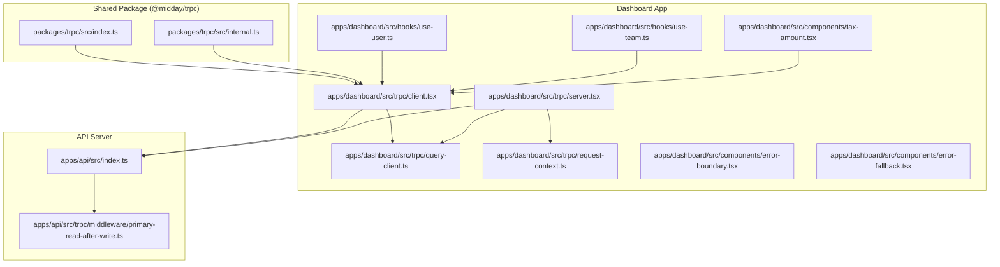
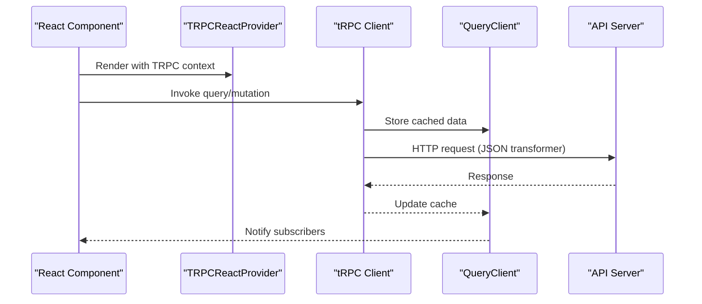
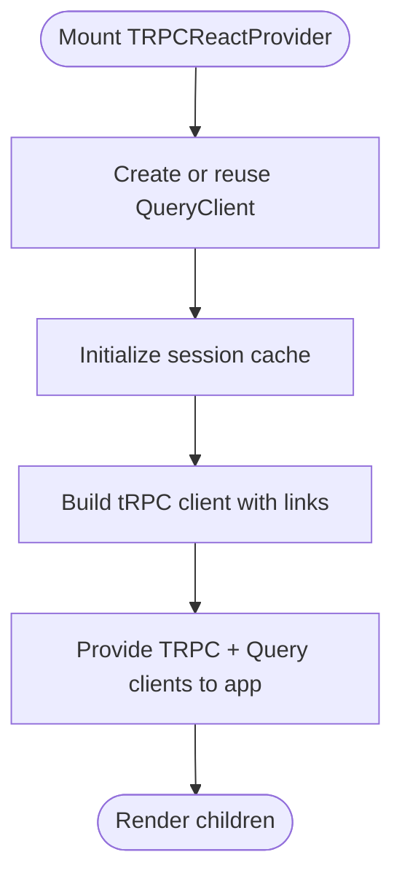
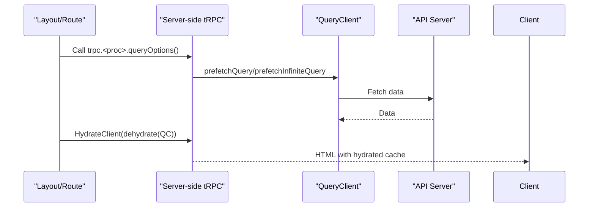
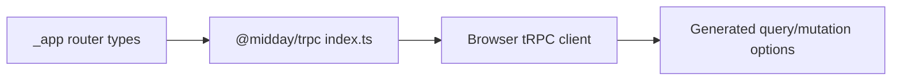
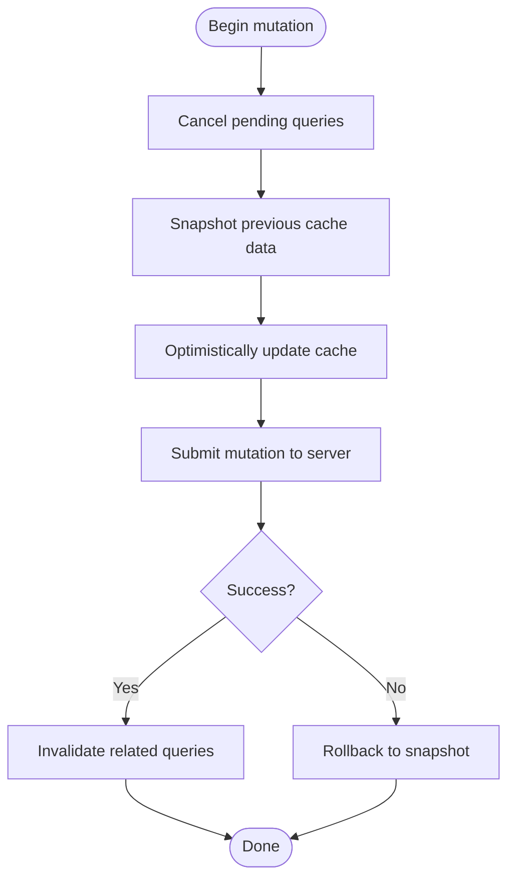
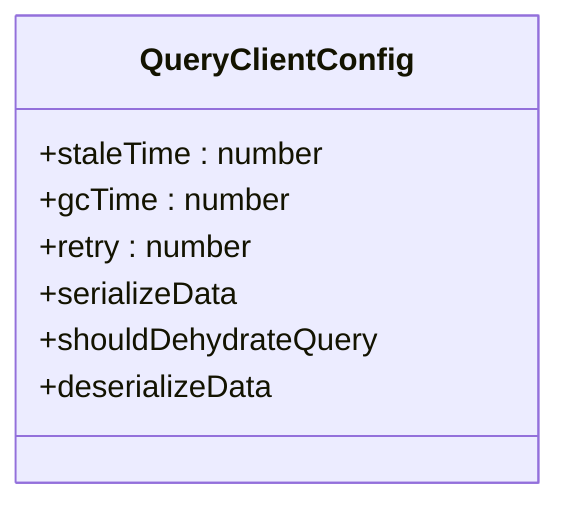
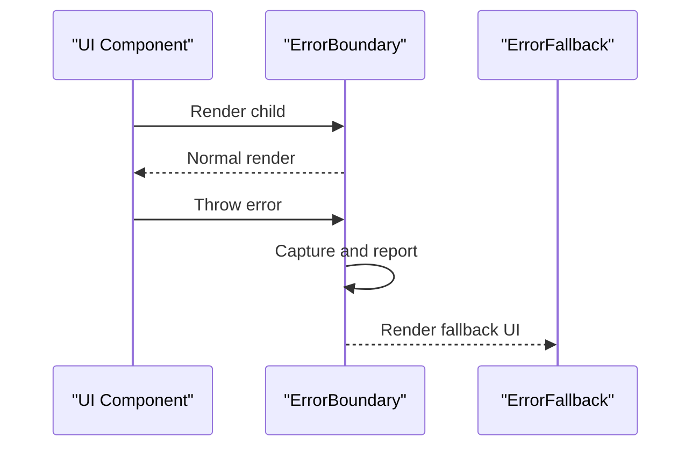
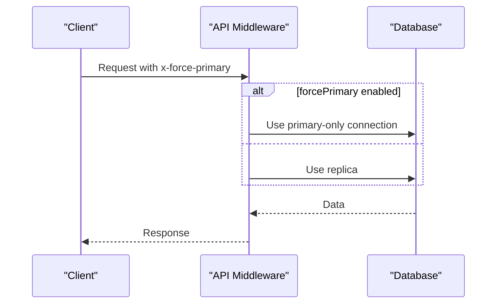
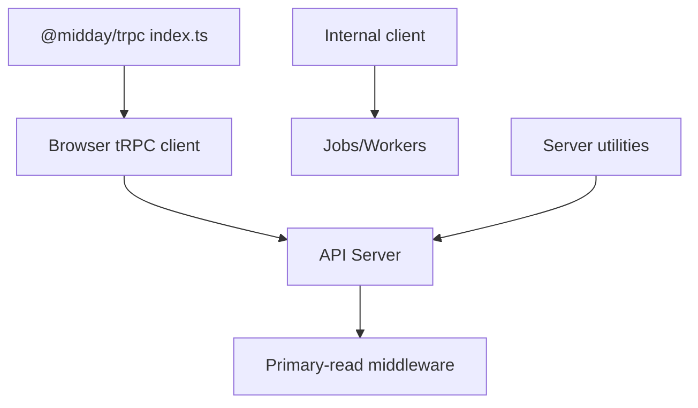

# Client-Side Integration

<cite>
**Referenced Files in This Document**
- [packages/trpc/src/index.ts](file://packages/trpc/src/index.ts)
- [packages/trpc/src/internal.ts](file://packages/trpc/src/internal.ts)
- [apps/dashboard/src/trpc/client.tsx](file://apps/dashboard/src/trpc/client.tsx)
- [apps/dashboard/src/trpc/server.tsx](file://apps/dashboard/src/trpc/server.tsx)
- [apps/dashboard/src/trpc/query-client.ts](file://apps/dashboard/src/trpc/query-client.ts)
- [apps/dashboard/src/trpc/request-context.ts](file://apps/dashboard/src/trpc/request-context.ts)
- [apps/dashboard/src/hooks/use-user.ts](file://apps/dashboard/src/hooks/use-user.ts)
- [apps/dashboard/src/hooks/use-team.ts](file://apps/dashboard/src/hooks/use-team.ts)
- [apps/dashboard/src/components/error-boundary.tsx](file://apps/dashboard/src/components/error-boundary.tsx)
- [apps/dashboard/src/components/error-fallback.tsx](file://apps/dashboard/src/components/error-fallback.tsx)
- [apps/dashboard/src/components/tax-amount.tsx](file://apps/dashboard/src/components/tax-amount.tsx)
- [apps/api/src/trpc/middleware/primary-read-after-write.ts](file://apps/api/src/trpc/middleware/primary-read-after-write.ts)
- [apps/api/src/index.ts](file://apps/api/src/index.ts)
</cite>

## Table of Contents
1. [Introduction](#introduction)
2. [Project Structure](#project-structure)
3. [Core Components](#core-components)
4. [Architecture Overview](#architecture-overview)
5. [Detailed Component Analysis](#detailed-component-analysis)
6. [Dependency Analysis](#dependency-analysis)
7. [Performance Considerations](#performance-considerations)
8. [Troubleshooting Guide](#troubleshooting-guide)
9. [Conclusion](#conclusion)
10. [Appendices](#appendices)

## Introduction
This document explains how the frontend integrates with tRPC on the client side, focusing on React integration, TanStack Query configuration, automatic type inference, mutation handling with optimistic updates, query invalidation strategies, client-side caching, error boundary integration, and real-time-like synchronization patterns. It also covers performance optimization, concurrent request handling, and debugging client-side tRPC operations.

## Project Structure
The client-side tRPC integration spans three main areas:
- A shared package that exports the typed tRPC client and types for internal use.
- A dashboard application that configures the browser tRPC client and React Query provider.
- Server-side utilities for SSR hydration, prefetching, and request context building.

**Diagram sources**
- [packages/trpc/src/index.ts](file://packages/trpc/src/index.ts#L1-L19)
- [packages/trpc/src/internal.ts](file://packages/trpc/src/internal.ts#L1-L62)
- [apps/dashboard/src/trpc/client.tsx](file://apps/dashboard/src/trpc/client.tsx#L1-L85)
- [apps/dashboard/src/trpc/server.tsx](file://apps/dashboard/src/trpc/server.tsx#L1-L161)
- [apps/dashboard/src/trpc/query-client.ts](file://apps/dashboard/src/trpc/query-client.ts#L1-L31)
- [apps/dashboard/src/trpc/request-context.ts](file://apps/dashboard/src/trpc/request-context.ts#L1-L63)
- [apps/dashboard/src/hooks/use-user.ts](file://apps/dashboard/src/hooks/use-user.ts#L1-L56)
- [apps/dashboard/src/hooks/use-team.ts](file://apps/dashboard/src/hooks/use-team.ts#L1-L55)
- [apps/dashboard/src/components/error-boundary.tsx](file://apps/dashboard/src/components/error-boundary.tsx#L1-L63)
- [apps/dashboard/src/components/error-fallback.tsx](file://apps/dashboard/src/components/error-fallback.tsx#L1-L20)
- [apps/dashboard/src/components/tax-amount.tsx](file://apps/dashboard/src/components/tax-amount.tsx#L48-L89)
- [apps/api/src/trpc/middleware/primary-read-after-write.ts](file://apps/api/src/trpc/middleware/primary-read-after-write.ts#L1-L45)
- [apps/api/src/index.ts](file://apps/api/src/index.ts#L39-L92)

**Section sources**
- [packages/trpc/src/index.ts](file://packages/trpc/src/index.ts#L1-L19)
- [apps/dashboard/src/trpc/client.tsx](file://apps/dashboard/src/trpc/client.tsx#L1-L85)
- [apps/dashboard/src/trpc/server.tsx](file://apps/dashboard/src/trpc/server.tsx#L1-L161)

## Core Components
- Shared tRPC client and types:
  - Typed exports for the router and inferred inputs/outputs.
  - A pre-configured internal client singleton for service-to-service calls.
- Browser tRPC provider:
  - React Query provider configured with a tRPC context.
  - HTTP link with JSON transformer and logging link.
  - Dynamic Authorization header and optional primary-read consistency header.
- Server-side tRPC utilities:
  - Stable query client per request with SSR dehydration.
  - Prefetch helpers for single and batched queries.
  - Request context builder for session, location, and tracing headers.
- Hook patterns:
  - Query and mutation hooks leveraging tRPC’s generated options.
  - Optimistic updates with rollback on error and subsequent invalidation.

**Section sources**
- [packages/trpc/src/index.ts](file://packages/trpc/src/index.ts#L1-L19)
- [packages/trpc/src/internal.ts](file://packages/trpc/src/internal.ts#L1-L62)
- [apps/dashboard/src/trpc/client.tsx](file://apps/dashboard/src/trpc/client.tsx#L1-L85)
- [apps/dashboard/src/trpc/server.tsx](file://apps/dashboard/src/trpc/server.tsx#L1-L161)
- [apps/dashboard/src/trpc/query-client.ts](file://apps/dashboard/src/trpc/query-client.ts#L1-L31)
- [apps/dashboard/src/trpc/request-context.ts](file://apps/dashboard/src/trpc/request-context.ts#L1-L63)
- [apps/dashboard/src/hooks/use-user.ts](file://apps/dashboard/src/hooks/use-user.ts#L1-L56)
- [apps/dashboard/src/hooks/use-team.ts](file://apps/dashboard/src/hooks/use-team.ts#L1-L55)

## Architecture Overview
The client initializes a tRPC React context backed by a TanStack Query client. Requests are transported via HTTP with a JSON transformer. On the server, hydration and prefetching are coordinated to minimize client-side fetching. The API enforces read-after-write consistency when requested.

**Diagram sources**
- [apps/dashboard/src/trpc/client.tsx](file://apps/dashboard/src/trpc/client.tsx#L36-L84)
- [apps/dashboard/src/trpc/query-client.ts](file://apps/dashboard/src/trpc/query-client.ts#L8-L30)
- [apps/api/src/index.ts](file://apps/api/src/index.ts#L88-L92)

## Detailed Component Analysis

### tRPC React Provider and Query Client
- Provider setup:
  - Creates a tRPC context and wraps the app with a QueryClientProvider.
  - Uses a stable query client instance per environment (server vs. browser).
- HTTP link configuration:
  - Transformer: JSON serialization/deserialization.
  - Headers: Authorization token and optional primary-read flag.
  - Logger link enabled in development or when errors bubble down.
- Session cache initialization:
  - Initializes session cache on mount to support consistent auth state.

**Diagram sources**
- [apps/dashboard/src/trpc/client.tsx](file://apps/dashboard/src/trpc/client.tsx#L36-L84)
- [apps/dashboard/src/trpc/query-client.ts](file://apps/dashboard/src/trpc/query-client.ts#L8-L30)

**Section sources**
- [apps/dashboard/src/trpc/client.tsx](file://apps/dashboard/src/trpc/client.tsx#L1-L85)
- [apps/dashboard/src/trpc/query-client.ts](file://apps/dashboard/src/trpc/query-client.ts#L1-L31)

### Server-Side Hydration and Prefetching
- Stable query client per request:
  - Ensures cache consistency across the lifecycle of a single request.
- Prefetch helpers:
  - Single and batch prefetch for both finite and infinite queries.
  - Fire-and-forget prefetches with error suppression to avoid unhandled rejections.
- SSR dehydration:
  - Hydration boundary serializes cache state for the client.

**Diagram sources**
- [apps/dashboard/src/trpc/server.tsx](file://apps/dashboard/src/trpc/server.tsx#L94-L126)
- [apps/dashboard/src/trpc/server.tsx](file://apps/dashboard/src/trpc/server.tsx#L84-L92)

**Section sources**
- [apps/dashboard/src/trpc/server.tsx](file://apps/dashboard/src/trpc/server.tsx#L1-L161)

### Automatic Type Inference and Shared Types
- The shared package re-exports the AppRouter type and generated inputs/outputs.
- The browser client consumes the same AppRouter type, enabling full type safety for queries, mutations, and subscriptions.

**Diagram sources**
- [packages/trpc/src/index.ts](file://packages/trpc/src/index.ts#L1-L19)
- [apps/dashboard/src/trpc/client.tsx](file://apps/dashboard/src/trpc/client.tsx#L3-L6)

**Section sources**
- [packages/trpc/src/index.ts](file://packages/trpc/src/index.ts#L1-L19)

### Mutation Handling with Optimistic Updates and Invalidation
- Optimistic updates:
  - Cancel pending queries, snapshot previous data, update cache immediately, and roll back on error.
- Invalidation:
  - Invalidate queries on settle to reconcile with server state.
- Examples:
  - User profile updates and team updates demonstrate the pattern.
  - Transaction list and detail views show multi-target optimistic updates and cancellations.

**Diagram sources**
- [apps/dashboard/src/hooks/use-user.ts](file://apps/dashboard/src/hooks/use-user.ts#L18-L55)
- [apps/dashboard/src/hooks/use-team.ts](file://apps/dashboard/src/hooks/use-team.ts#L15-L54)
- [apps/dashboard/src/components/tax-amount.tsx](file://apps/dashboard/src/components/tax-amount.tsx#L48-L89)

**Section sources**
- [apps/dashboard/src/hooks/use-user.ts](file://apps/dashboard/src/hooks/use-user.ts#L1-L56)
- [apps/dashboard/src/hooks/use-team.ts](file://apps/dashboard/src/hooks/use-team.ts#L1-L55)
- [apps/dashboard/src/components/tax-amount.tsx](file://apps/dashboard/src/components/tax-amount.tsx#L48-L89)

### Client-Side Caching and Stale-Time Strategy
- Default cache policy:
  - Stale time of a few minutes to reduce unnecessary refetches.
  - GC time to keep unused data around briefly.
  - Retry policy differs between server and client.
- Serialization:
  - SuperJSON is used for both dehydration and hydration to preserve types.

**Diagram sources**
- [apps/dashboard/src/trpc/query-client.ts](file://apps/dashboard/src/trpc/query-client.ts#L8-L30)

**Section sources**
- [apps/dashboard/src/trpc/query-client.ts](file://apps/dashboard/src/trpc/query-client.ts#L1-L31)

### Error Boundary Integration
- Error boundary:
  - Captures runtime errors, optionally forwards to monitoring, and renders a minimal fallback.
- Fallback UI:
  - Provides a friendly “Try again” action to refresh the page.

**Diagram sources**
- [apps/dashboard/src/components/error-boundary.tsx](file://apps/dashboard/src/components/error-boundary.tsx#L15-L62)
- [apps/dashboard/src/components/error-fallback.tsx](file://apps/dashboard/src/components/error-fallback.tsx#L6-L19)

**Section sources**
- [apps/dashboard/src/components/error-boundary.tsx](file://apps/dashboard/src/components/error-boundary.tsx#L1-L63)
- [apps/dashboard/src/components/error-fallback.tsx](file://apps/dashboard/src/components/error-fallback.tsx#L1-L20)

### Real-Time Data Synchronization Patterns
- Read-after-write consistency:
  - The API middleware can force reads to the primary database when requested, reducing replication lag.
- Client-side invalidation:
  - After mutations, invalidate queries to ensure the UI reflects the latest server state.
- Example usage:
  - Transaction detail and list updates demonstrate simultaneous invalidation across views.

**Diagram sources**
- [apps/api/src/trpc/middleware/primary-read-after-write.ts](file://apps/api/src/trpc/middleware/primary-read-after-write.ts#L9-L45)
- [apps/api/src/index.ts](file://apps/api/src/index.ts#L39-L64)

**Section sources**
- [apps/api/src/trpc/middleware/primary-read-after-write.ts](file://apps/api/src/trpc/middleware/primary-read-after-write.ts#L1-L45)
- [apps/dashboard/src/components/tax-amount.tsx](file://apps/dashboard/src/components/tax-amount.tsx#L48-L89)

## Dependency Analysis
- Shared package dependency:
  - The browser client depends on the shared package for typed router definitions.
- Internal client:
  - A separate internal client is provided for service-to-service communication with batched HTTP links and internal keys.
- Server-side dependencies:
  - Server utilities depend on Supabase for session retrieval and request tracing for observability.

**Diagram sources**
- [packages/trpc/src/index.ts](file://packages/trpc/src/index.ts#L1-L19)
- [packages/trpc/src/internal.ts](file://packages/trpc/src/internal.ts#L1-L62)
- [apps/dashboard/src/trpc/client.tsx](file://apps/dashboard/src/trpc/client.tsx#L1-L85)
- [apps/dashboard/src/trpc/server.tsx](file://apps/dashboard/src/trpc/server.tsx#L1-L161)
- [apps/api/src/trpc/middleware/primary-read-after-write.ts](file://apps/api/src/trpc/middleware/primary-read-after-write.ts#L1-L45)

**Section sources**
- [packages/trpc/src/index.ts](file://packages/trpc/src/index.ts#L1-L19)
- [packages/trpc/src/internal.ts](file://packages/trpc/src/internal.ts#L1-L62)
- [apps/dashboard/src/trpc/client.tsx](file://apps/dashboard/src/trpc/client.tsx#L1-L85)
- [apps/dashboard/src/trpc/server.tsx](file://apps/dashboard/src/trpc/server.tsx#L1-L161)

## Performance Considerations
- Default cache policy:
  - Tune staleTime and gcTime for your data characteristics.
  - Adjust retry counts for server vs. client environments.
- Request timeouts and connection handling:
  - Server-side fetch uses a timeout and sets connection-close for internal networking to avoid stale connections.
- Logging:
  - Enable logger link in development to surface errors early.
- Batched internal requests:
  - Internal client uses batched HTTP links to reduce overhead for service-to-service calls.

[No sources needed since this section provides general guidance]

## Troubleshooting Guide
- Debugging client-side operations:
  - Enable logger link in development to capture request/response logs.
  - Inspect network tab for tRPC requests and response payloads.
- Error boundaries:
  - Wrap critical sections with the error boundary to gracefully handle rendering errors.
  - Use the fallback component to offer a refresh action.
- Read-after-write consistency:
  - If you observe stale reads after writes, ensure the appropriate headers or middleware are in place to force primary reads.
- Prefetch failures:
  - Prefetch helpers suppress unhandled rejections; verify hydration and SSR behavior if data does not appear.

**Section sources**
- [apps/dashboard/src/trpc/client.tsx](file://apps/dashboard/src/trpc/client.tsx#L68-L73)
- [apps/dashboard/src/components/error-boundary.tsx](file://apps/dashboard/src/components/error-boundary.tsx#L24-L44)
- [apps/dashboard/src/components/error-fallback.tsx](file://apps/dashboard/src/components/error-fallback.tsx#L6-L19)
- [apps/dashboard/src/trpc/server.tsx](file://apps/dashboard/src/trpc/server.tsx#L94-L126)

## Conclusion
The client-side tRPC integration leverages a typed, shared router definition, a robust React Query configuration, and consistent request context building. It supports optimistic updates, query invalidation, SSR hydration, and read-after-write consistency. With proper caching policies, logging, and error boundaries, the system delivers responsive and resilient user experiences.

## Appendices
- Request headers:
  - Authorization, x-user-timezone, x-user-locale, x-user-country, x-request-id, cf-ray, x-force-primary.
- Environment variables:
  - NEXT_PUBLIC_API_URL, API_INTERNAL_URL, INTERNAL_API_KEY.

**Section sources**
- [apps/dashboard/src/trpc/request-context.ts](file://apps/dashboard/src/trpc/request-context.ts#L29-L56)
- [apps/api/src/index.ts](file://apps/api/src/index.ts#L39-L64)
- [packages/trpc/src/internal.ts](file://packages/trpc/src/internal.ts#L10-L48)