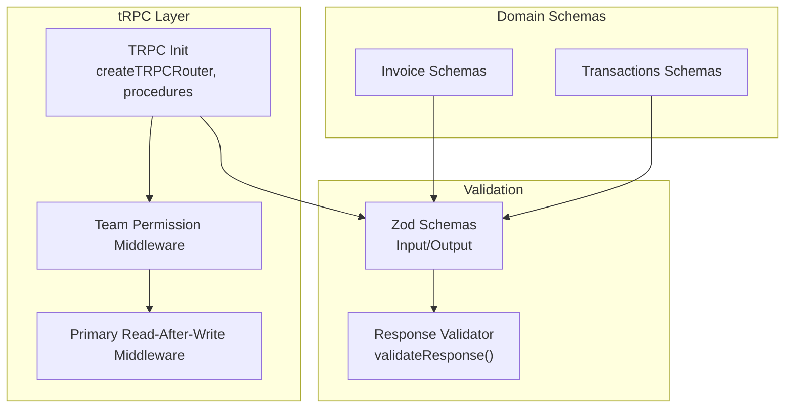
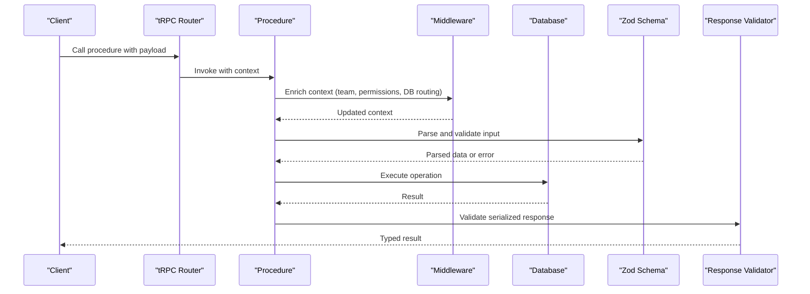
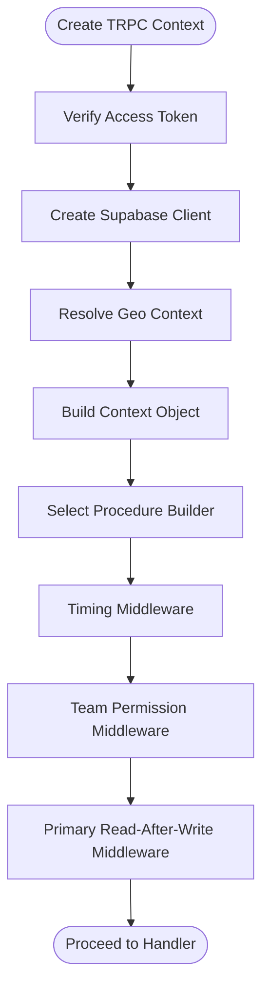
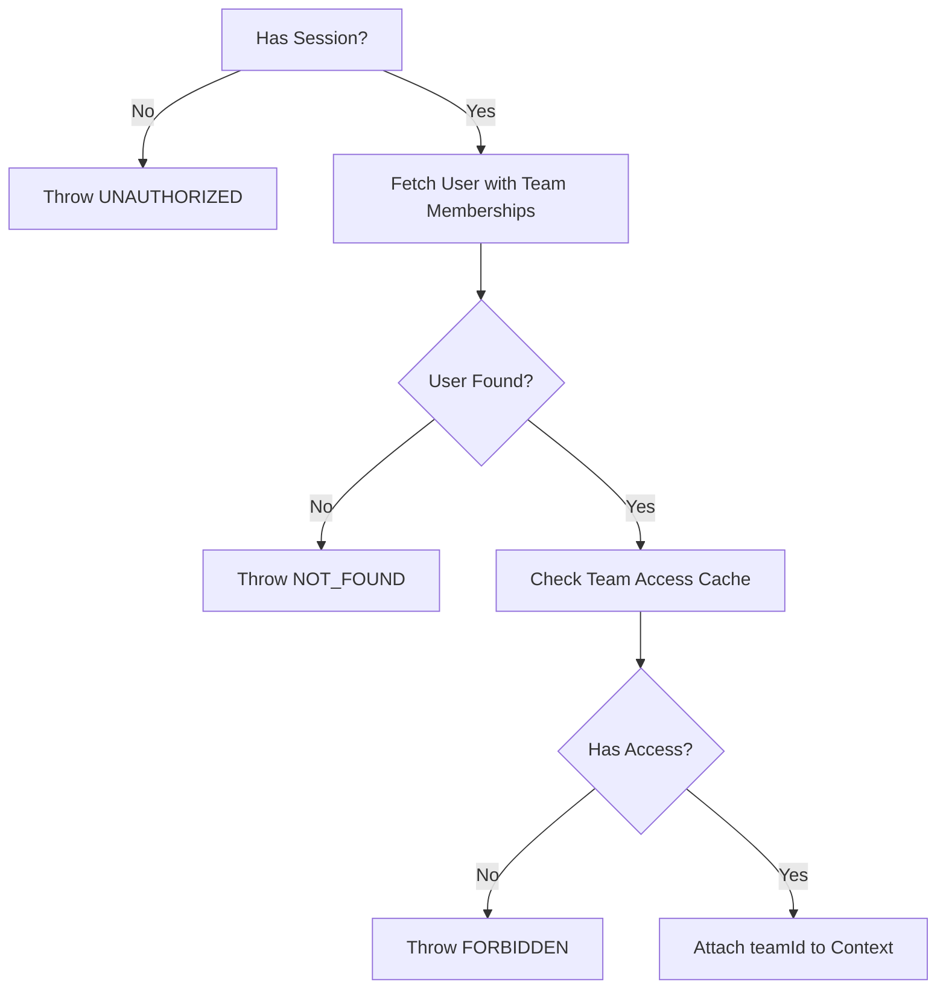
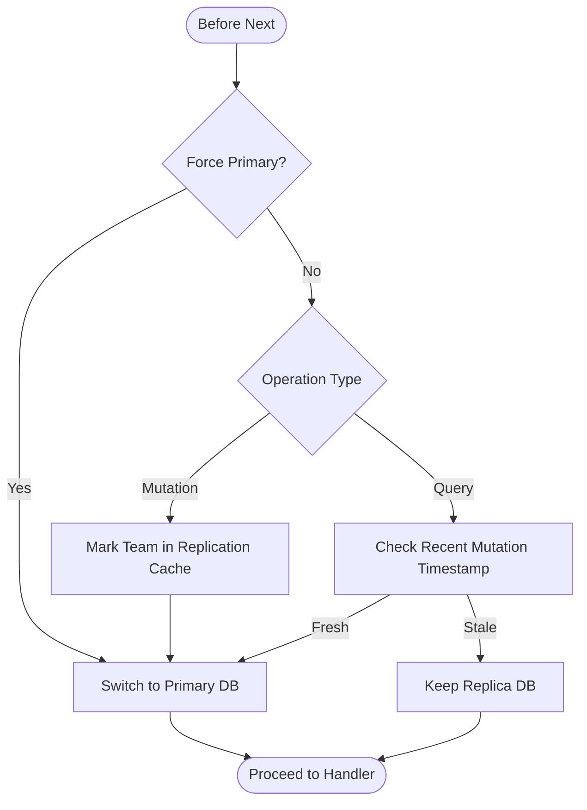
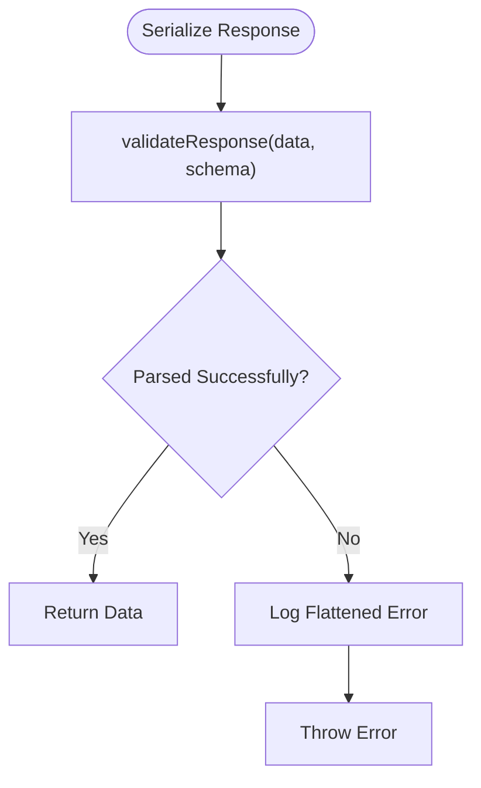
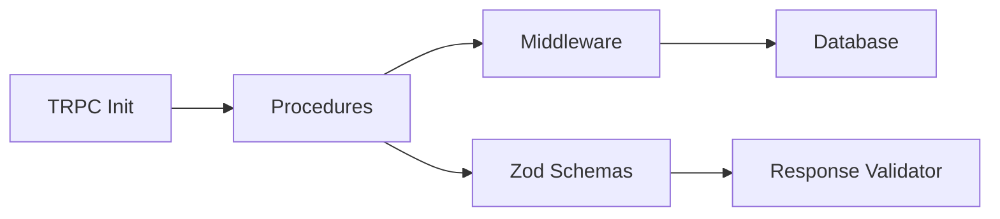

# Procedure Validation & Types

<cite>
**Referenced Files in This Document**
- [init.ts](file://apps/api/src/trpc/init.ts)
- [team-permission.ts](file://apps/api/src/trpc/middleware/team-permission.ts)
- [primary-read-after-write.ts](file://apps/api/src/trpc/middleware/primary-read-after-write.ts)
- [validate-response.ts](file://apps/api/src/utils/validate-response.ts)
- [invoice.ts](file://apps/api/src/schemas/invoice.ts)
- [transactions.ts](file://apps/api/src/schemas/transactions.ts)
- [inbox.test.ts](file://apps/api/src/__tests__/trpc/inbox.test.ts)
</cite>

## Table of Contents
1. [Introduction](#introduction)
2. [Project Structure](#project-structure)
3. [Core Components](#core-components)
4. [Architecture Overview](#architecture-overview)
5. [Detailed Component Analysis](#detailed-component-analysis)
6. [Dependency Analysis](#dependency-analysis)
7. [Performance Considerations](#performance-considerations)
8. [Troubleshooting Guide](#troubleshooting-guide)
9. [Conclusion](#conclusion)

## Introduction
This document explains how tRPC procedures are validated and typed across the backend, focusing on:
- Input validation schemas and their integration with tRPC procedures
- Output serialization and response validation
- Type inference and schema-driven typing
- Zod schema usage, validation error handling, and custom validators
- Complex validation scenarios: nested objects, conditional rules, and cross-field constraints
- Performance implications, error message customization, and debugging strategies

## Project Structure
The validation and typing pipeline centers around:
- tRPC initialization and procedure builders
- Middleware for context enrichment and permissions
- Zod schemas for input and output validation
- Response validation utilities for runtime safety

**Diagram sources**
- [init.ts](file://apps/api/src/trpc/init.ts#L82-L186)
- [team-permission.ts](file://apps/api/src/trpc/middleware/team-permission.ts#L125-L165)
- [primary-read-after-write.ts](file://apps/api/src/trpc/middleware/primary-read-after-write.ts#L9-L101)
- [validate-response.ts](file://apps/api/src/utils/validate-response.ts#L7-L19)
- [invoice.ts](file://apps/api/src/schemas/invoice.ts#L1-L120)
- [transactions.ts](file://apps/api/src/schemas/transactions.ts#L1-L120)

**Section sources**
- [init.ts](file://apps/api/src/trpc/init.ts#L82-L186)
- [invoice.ts](file://apps/api/src/schemas/invoice.ts#L1-L120)
- [transactions.ts](file://apps/api/src/schemas/transactions.ts#L1-L120)

## Core Components
- TRPC initialization defines:
  - Context factory and transformers
  - Public, protected, internal, and hybrid procedures
  - Performance timing and middleware composition
- Middleware:
  - Team permission resolution and caching
  - Primary database routing after writes
- Zod schemas:
  - Strongly typed input and output shapes
  - OpenAPI annotations for documentation
- Response validation:
  - Runtime validation of serialized responses

**Section sources**
- [init.ts](file://apps/api/src/trpc/init.ts#L20-L84)
- [team-permission.ts](file://apps/api/src/trpc/middleware/team-permission.ts#L125-L165)
- [primary-read-after-write.ts](file://apps/api/src/trpc/middleware/primary-read-after-write.ts#L9-L101)
- [validate-response.ts](file://apps/api/src/utils/validate-response.ts#L7-L19)
- [invoice.ts](file://apps/api/src/schemas/invoice.ts#L1-L120)
- [transactions.ts](file://apps/api/src/schemas/transactions.ts#L1-L120)

## Architecture Overview
The validation and typing architecture integrates tRPC procedures with Zod schemas and response validation:

**Diagram sources**
- [init.ts](file://apps/api/src/trpc/init.ts#L117-L186)
- [team-permission.ts](file://apps/api/src/trpc/middleware/team-permission.ts#L125-L165)
- [primary-read-after-write.ts](file://apps/api/src/trpc/middleware/primary-read-after-write.ts#L9-L101)
- [validate-response.ts](file://apps/api/src/utils/validate-response.ts#L7-L19)
- [invoice.ts](file://apps/api/src/schemas/invoice.ts#L686-L800)

## Detailed Component Analysis

### TRPC Initialization and Procedure Builders
- Context creation enriches requests with session, database client, geolocation, and tracing headers.
- Procedure builders compose middleware:
  - Timing for performance logging
  - Team permission checks
  - Primary database routing for consistency
- Public vs protected vs internal vs hybrid procedures enforce authentication and authorization.

**Diagram sources**
- [init.ts](file://apps/api/src/trpc/init.ts#L32-L80)
- [init.ts](file://apps/api/src/trpc/init.ts#L117-L186)
- [team-permission.ts](file://apps/api/src/trpc/middleware/team-permission.ts#L125-L165)
- [primary-read-after-write.ts](file://apps/api/src/trpc/middleware/primary-read-after-write.ts#L9-L101)

**Section sources**
- [init.ts](file://apps/api/src/trpc/init.ts#L20-L84)
- [init.ts](file://apps/api/src/trpc/init.ts#L117-L186)

### Middleware: Team Permission Resolution
- Resolves team membership from session and caches access decisions.
- Throws appropriate tRPC errors when unauthorized or user not found.
- Logs performance and cache hits for observability.

**Diagram sources**
- [team-permission.ts](file://apps/api/src/trpc/middleware/team-permission.ts#L18-L123)

**Section sources**
- [team-permission.ts](file://apps/api/src/trpc/middleware/team-permission.ts#L125-L165)

### Middleware: Primary Read-After-Write Routing
- Routes queries after mutations to the primary database to ensure read-after-write consistency.
- Uses replication cache timestamps keyed by teamId.
- Supports forced primary mode for specific requests.

**Diagram sources**
- [primary-read-after-write.ts](file://apps/api/src/trpc/middleware/primary-read-after-write.ts#L9-L101)

**Section sources**
- [primary-read-after-write.ts](file://apps/api/src/trpc/middleware/primary-read-after-write.ts#L9-L101)

### Zod Schema Usage and Type Inference
- Input schemas define strict shapes for procedure parameters.
- Output schemas define response structures for serialization.
- OpenAPI annotations document endpoints and parameters.
- Editor fields use specialized schemas for nested TipTap content.

Examples of schema patterns:
- Nested objects: invoice templates and line items
- Enum constraints: invoice status, transaction status
- Conditional refinement: timezone validation, numeric bounds
- Cross-field constraints: optional fields with nullable variants

**Section sources**
- [invoice.ts](file://apps/api/src/schemas/invoice.ts#L77-L149)
- [invoice.ts](file://apps/api/src/schemas/invoice.ts#L151-L190)
- [invoice.ts](file://apps/api/src/schemas/invoice.ts#L192-L335)
- [transactions.ts](file://apps/api/src/schemas/transactions.ts#L3-L243)
- [transactions.ts](file://apps/api/src/schemas/transactions.ts#L245-L506)

### Response Serialization and Validation
- Responses are serialized using a transformer configured at TRPC initialization.
- A dedicated validator performs runtime parsing of serialized data against output schemas.
- On failure, logs structured error details and throws a descriptive error.

**Diagram sources**
- [validate-response.ts](file://apps/api/src/utils/validate-response.ts#L7-L19)
- [init.ts](file://apps/api/src/trpc/init.ts#L82-L84)

**Section sources**
- [validate-response.ts](file://apps/api/src/utils/validate-response.ts#L7-L19)
- [init.ts](file://apps/api/src/trpc/init.ts#L82-L84)

### Complex Validation Scenarios
- Nested object validation:
  - Templates and line items include nested TipTap content schemas.
  - REST vs tRPC variants differentiate editor field types.
- Conditional validation:
  - Enums restrict values to predefined sets.
  - Numeric refinements constrain ranges.
  - Optional/nullable fields allow flexible shapes.
- Cross-field constraints:
  - Editor fields accept either stringified content or parsed structures depending on transport.

**Section sources**
- [invoice.ts](file://apps/api/src/schemas/invoice.ts#L686-L800)
- [transactions.ts](file://apps/api/src/schemas/transactions.ts#L552-L622)

### Custom Validators and Error Handling
- Custom refinements enforce domain-specific rules (e.g., timezone validation).
- Middleware throws tRPC errors with standardized codes and messages.
- Response validation centralizes error reporting and prevents malformed payloads from reaching clients.

**Section sources**
- [invoice.ts](file://apps/api/src/schemas/invoice.ts#L93-L99)
- [team-permission.ts](file://apps/api/src/trpc/middleware/team-permission.ts#L35-L107)
- [validate-response.ts](file://apps/api/src/utils/validate-response.ts#L10-L16)

### Testing Validation Behavior
- Tests exercise valid inputs and confirm expected outcomes.
- They demonstrate that invalid enums or missing fields trigger validation failures.

**Section sources**
- [inbox.test.ts](file://apps/api/src/__tests__/trpc/inbox.test.ts#L120-L160)

## Dependency Analysis
The validation pipeline depends on:
- TRPC initialization for context and procedure composition
- Middleware for authentication, authorization, and database routing
- Zod schemas for input and output validation
- Response validator for runtime safety

**Diagram sources**
- [init.ts](file://apps/api/src/trpc/init.ts#L82-L186)
- [team-permission.ts](file://apps/api/src/trpc/middleware/team-permission.ts#L125-L165)
- [primary-read-after-write.ts](file://apps/api/src/trpc/middleware/primary-read-after-write.ts#L9-L101)
- [validate-response.ts](file://apps/api/src/utils/validate-response.ts#L7-L19)

**Section sources**
- [init.ts](file://apps/api/src/trpc/init.ts#L82-L186)
- [team-permission.ts](file://apps/api/src/trpc/middleware/team-permission.ts#L125-L165)
- [primary-read-after-write.ts](file://apps/api/src/trpc/middleware/primary-read-after-write.ts#L9-L101)
- [validate-response.ts](file://apps/api/src/utils/validate-response.ts#L7-L19)

## Performance Considerations
- Middleware timing logs help identify slow procedures and bottlenecks.
- Team permission middleware caches access decisions to reduce repeated lookups.
- Primary read-after-write routing avoids stale reads after mutations while minimizing unnecessary primary usage.
- Transformer configuration impacts serialization overhead; keep payloads lean.

[No sources needed since this section provides general guidance]

## Troubleshooting Guide
Common issues and remedies:
- Unauthorized or forbidden errors from team permission middleware indicate missing or invalid session or lack of team access.
- Validation failures during response serialization suggest schema mismatches or unexpected shapes; inspect flattened error details logged by the response validator.
- Debugging tips:
  - Enable performance logging to trace middleware and procedure durations.
  - Verify enum values and numeric ranges match schema constraints.
  - Confirm nested editor fields use the correct type for the transport (stringified vs parsed).

**Section sources**
- [team-permission.ts](file://apps/api/src/trpc/middleware/team-permission.ts#L28-L107)
- [validate-response.ts](file://apps/api/src/utils/validate-response.ts#L10-L16)
- [init.ts](file://apps/api/src/trpc/init.ts#L89-L99)

## Conclusion
The codebase employs a robust, schema-first approach to tRPC validation:
- Strongly typed input and output schemas ensure correctness and documentation.
- Middleware enforces authentication, authorization, and read-after-write consistency.
- Response validation adds a safety net for serialized payloads.
- Complex validations leverage Zod’s refinement and conditional features, with clear error reporting and performance monitoring.