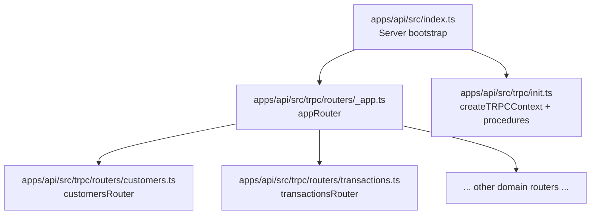
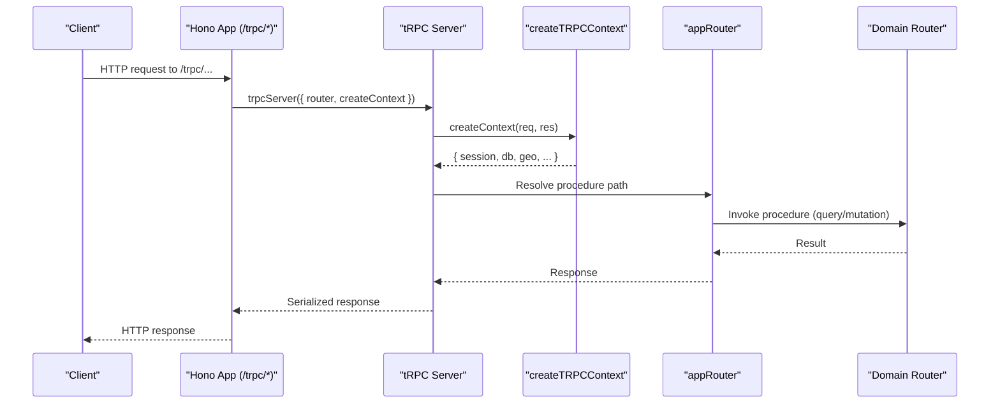
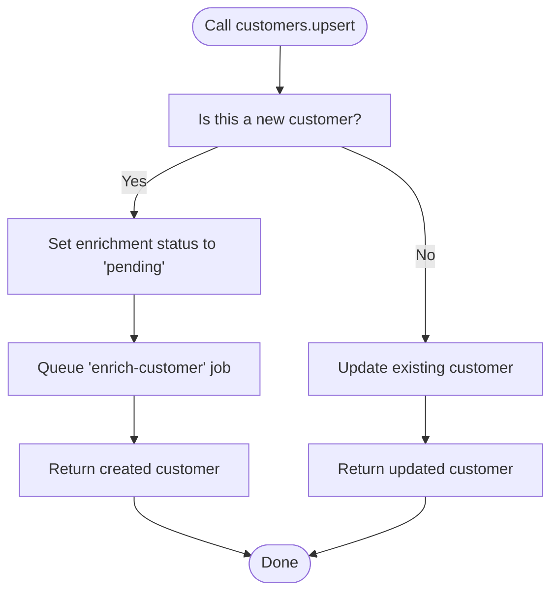
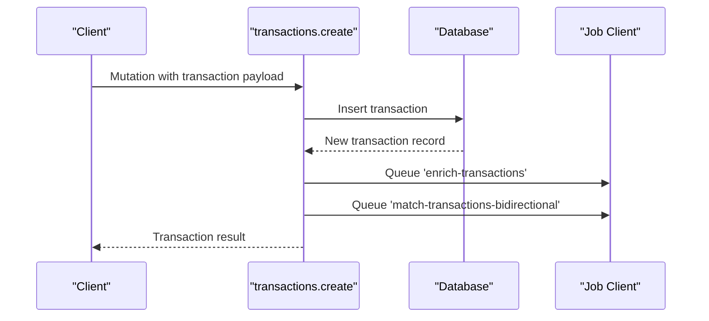
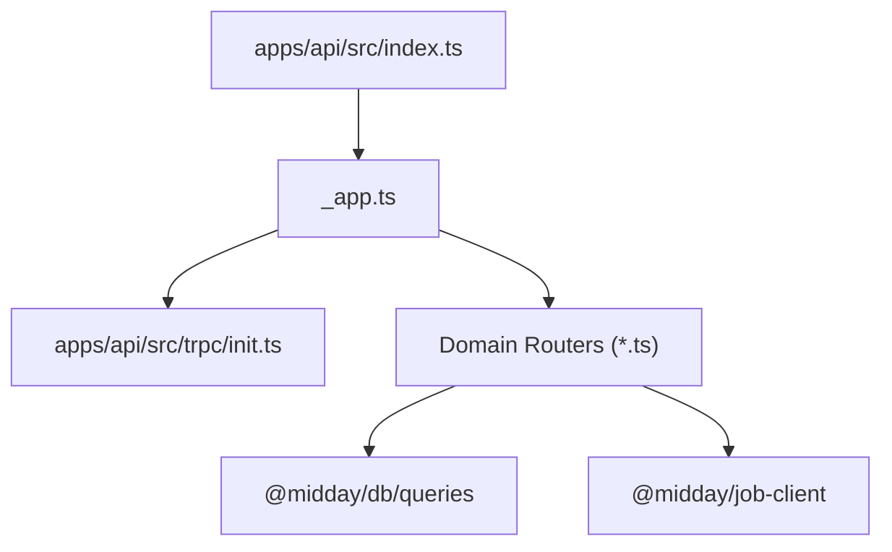

# Router Organization

<cite>
**Referenced Files in This Document**
- [index.ts](file://apps/api/src/index.ts)
- [_app.ts](file://apps/api/src/trpc/routers/_app.ts)
- [init.ts](file://apps/api/src/trpc/init.ts)
- [customers.ts](file://apps/api/src/trpc/routers/customers.ts)
- [transactions.ts](file://apps/api/src/trpc/routers/transactions.ts)
</cite>

## Table of Contents
1. [Introduction](#introduction)
2. [Project Structure](#project-structure)
3. [Core Components](#core-components)
4. [Architecture Overview](#architecture-overview)
5. [Detailed Component Analysis](#detailed-component-analysis)
6. [Dependency Analysis](#dependency-analysis)
7. [Performance Considerations](#performance-considerations)
8. [Troubleshooting Guide](#troubleshooting-guide)
9. [Conclusion](#conclusion)

## Introduction
This document explains the tRPC router organization and structure used in the Midday API application. It focuses on the _app router as the main entry point, individual domain routers (such as customers and transactions), and router composition patterns. It also documents naming conventions, file organization, modular router architecture, procedure grouping, inter-router communication, performance optimization, lazy-loading strategies, and maintenance best practices.

## Project Structure
The tRPC layer is organized under the API application’s source tree. The primary entry point wires the Hono server to tRPC, and the _app router composes all domain-specific routers.

**Diagram sources**
- [index.ts](file://apps/api/src/index.ts#L21-L113)
- [_app.ts](file://apps/api/src/trpc/routers/_app.ts#L1-L91)
- [init.ts](file://apps/api/src/trpc/init.ts#L20-L187)
- [customers.ts](file://apps/api/src/trpc/routers/customers.ts#L35-L263)
- [transactions.ts](file://apps/api/src/trpc/routers/transactions.ts#L54-L299)

**Section sources**
- [index.ts](file://apps/api/src/index.ts#L21-L113)
- [_app.ts](file://apps/api/src/trpc/routers/_app.ts#L1-L91)

## Core Components
- _app router: Central composition of all domain routers. It imports each domain router and exposes them as nested namespaces on the appRouter.
- Domain routers: Feature-focused routers grouped by business domain (e.g., customers, transactions). They define procedures (queries, mutations) and encapsulate domain logic.
- tRPC initialization: Provides context creation, shared transformers, and reusable procedure builders (public, protected, internal, protected-or-internal).

Key responsibilities:
- _app router: Exposes a single, typed API surface composed from domain routers.
- Domain routers: Define procedures with explicit input schemas, enforce permissions, and orchestrate database queries and side effects.
- Initialization: Standardizes context, middleware, and procedure types across the application.

**Section sources**
- [_app.ts](file://apps/api/src/trpc/routers/_app.ts#L1-L91)
- [init.ts](file://apps/api/src/trpc/init.ts#L20-L187)

## Architecture Overview
The API server integrates tRPC via @hono/trpc-server. The Hono app mounts the tRPC endpoint at /trpc and delegates routing to appRouter. The initialization module defines the tRPC context and reusable procedure builders.

**Diagram sources**
- [index.ts](file://apps/api/src/index.ts#L88-L113)
- [init.ts](file://apps/api/src/trpc/init.ts#L32-L80)
- [_app.ts](file://apps/api/src/trpc/routers/_app.ts#L44-L85)

## Detailed Component Analysis

### _app Router Composition
The _app router composes all domain routers into a single API namespace. Each domain router is imported and attached under a descriptive key (e.g., customers, transactions). This creates a hierarchical API shape that mirrors the domain model.

```mermaid
graph LR
Root["appRouter"] --> Acc["accounting"]
Root --> Apps["apps"]
Root --> BankAcc["bankAccounts"]
Root --> BankConn["bankConnections"]
Root --> Banking["banking"]
Root --> Billing["billing"]
Root --> Chats["chats"]
Root --> Cust["customers"]
Root --> Docs["documents"]
Root --> DocAss["documentTagAssignments"]
Root --> DocTags["documentTags"]
Root --> Inbox["inbox"]
Root --> InboxAcc["inboxAccounts"]
Root --> Insights["insights"]
Root --> Inst["institutions"]
Root --> Inv["invoice"]
Root --> InvPay["invoicePayments"]
Root --> InvProd["invoiceProducts"]
Root --> InvRec["invoiceRecurring"]
Root --> InvTpl["invoiceTemplate"]
Root --> Jobs["jobs"]
Root --> Notif["notifications"]
Root --> NotifSet["notificationSettings"]
Root --> OAuth["oauthApplications"]
Root --> Reports["reports"]
Root --> Search["search"]
Root --> Short["shortLinks"]
Root --> Sugg["suggestedActions"]
Root --> Tags["tags"]
Root --> Team["team"]
Root --> TrackerEnt["trackerEntries"]
Root --> TrackerProj["trackerProjects"]
Root --> TransAtt["transactionAttachments"]
Root --> TransCat["transactionCategories"]
Root --> Trans["transactions"]
Root --> TransTags["transactionTags"]
Root --> User["user"]
Root --> Widgets["widgets"]
```

**Diagram sources**
- [_app.ts](file://apps/api/src/trpc/routers/_app.ts#L3-L85)

**Section sources**
- [_app.ts](file://apps/api/src/trpc/routers/_app.ts#L1-L91)

### Domain Router Example: Customers
The customers router demonstrates:
- Input validation via zod schemas
- Protected procedures requiring authentication and team scoping
- Queries for listing/getting customers
- Mutations for upsert/delete/enrichment
- Public procedures for portal-based lookups

**Diagram sources**
- [customers.ts](file://apps/api/src/trpc/routers/customers.ts#L63-L105)

**Section sources**
- [customers.ts](file://apps/api/src/trpc/routers/customers.ts#L35-L263)

### Domain Router Example: Transactions
The transactions router demonstrates:
- Rich set of procedures for CRUD, enrichment, matching, import/export
- Use of AI generation for CSV mapping with in-flight request deduplication
- Side-effect orchestration via job triggers

**Diagram sources**
- [transactions.ts](file://apps/api/src/trpc/routers/transactions.ts#L130-L159)

**Section sources**
- [transactions.ts](file://apps/api/src/trpc/routers/transactions.ts#L54-L299)

### Router Naming Conventions and File Organization
- Router files are named after the domain they represent (e.g., customers.ts, transactions.ts).
- Each router exports a single router constant suffixed with Router (e.g., customersRouter).
- The _app router imports and attaches each domain router under a descriptive key that matches the domain name.

**Section sources**
- [_app.ts](file://apps/api/src/trpc/routers/_app.ts#L1-L91)
- [customers.ts](file://apps/api/src/trpc/routers/customers.ts#L35-L263)
- [transactions.ts](file://apps/api/src/trpc/routers/transactions.ts#L54-L299)

### Procedure Grouping and Inter-Router Communication
- Procedures are grouped by domain and operation type (query, mutation).
- Inter-router communication is achieved via job queues and shared services. For example, the transactions router triggers enrichment and matching jobs after creating a transaction.
- The initialization module centralizes middleware and procedure builders, ensuring consistent behavior across routers.

**Section sources**
- [transactions.ts](file://apps/api/src/trpc/routers/transactions.ts#L139-L155)
- [init.ts](file://apps/api/src/trpc/init.ts#L117-L187)

## Dependency Analysis
The API server depends on the _app router, which in turn depends on all domain routers. The initialization module provides shared context and procedure builders used by all routers.

**Diagram sources**
- [index.ts](file://apps/api/src/index.ts#L21-L113)
- [_app.ts](file://apps/api/src/trpc/routers/_app.ts#L1-L91)
- [init.ts](file://apps/api/src/trpc/init.ts#L1-L187)
- [customers.ts](file://apps/api/src/trpc/routers/customers.ts#L17-L29)
- [transactions.ts](file://apps/api/src/trpc/routers/transactions.ts#L18-L39)

**Section sources**
- [index.ts](file://apps/api/src/index.ts#L21-L113)
- [_app.ts](file://apps/api/src/trpc/routers/_app.ts#L1-L91)
- [init.ts](file://apps/api/src/trpc/init.ts#L1-L187)

## Performance Considerations
- Context creation and middleware timing: The initialization module measures JWT verification, Supabase client creation, and overall context build time when performance debugging is enabled.
- Procedure timing: Middleware logs procedure durations when performance debugging is enabled.
- Request tracing: The server logs request IDs and Cloudflare Ray IDs for correlating logs across services.
- Database pool monitoring: Periodic logging of database pool statistics is configurable via environment variables.

Recommendations:
- Keep context lightweight; avoid heavy synchronous work in createContext.
- Use protectedProcedure for authenticated endpoints to leverage built-in permission checks.
- Enable performance debugging in staging to identify slow procedures and context bottlenecks.
- Monitor database pool usage and tune intervals for production environments.

**Section sources**
- [init.ts](file://apps/api/src/trpc/init.ts#L17-L80)
- [init.ts](file://apps/api/src/trpc/init.ts#L89-L99)
- [index.ts](file://apps/api/src/index.ts#L67-L86)
- [index.ts](file://apps/api/src/index.ts#L178-L199)

## Troubleshooting Guide
Common areas to inspect:
- Authentication and authorization: Verify that protected procedures are throwing UNAUTHORIZED when missing a valid session.
- Internal vs external requests: Ensure internalProcedure is only used for service-to-service calls via the internal key header.
- Context availability: Confirm that teamId and session are present in context for protected endpoints.
- Error reporting: The server logs tRPC errors and forwards internal errors to Sentry, excluding client-side errors.

Operational tips:
- Review performance logs for slow procedures and context builds.
- Use request tracing to correlate backend operations.
- Check database pool stats to prevent saturation.

**Section sources**
- [init.ts](file://apps/api/src/trpc/init.ts#L121-L138)
- [init.ts](file://apps/api/src/trpc/init.ts#L146-L159)
- [index.ts](file://apps/api/src/index.ts#L93-L111)
- [index.ts](file://apps/api/src/index.ts#L202-L211)

## Conclusion
The Midday API employs a clean, modular tRPC architecture centered around the _app router. Domain routers encapsulate business logic and are composed into a single API surface. The initialization module standardizes context, middleware, and procedure types, enabling consistent behavior and maintainability. By following the naming conventions, grouping procedures by domain, and leveraging job-based inter-router communication, the system remains scalable and easy to evolve.