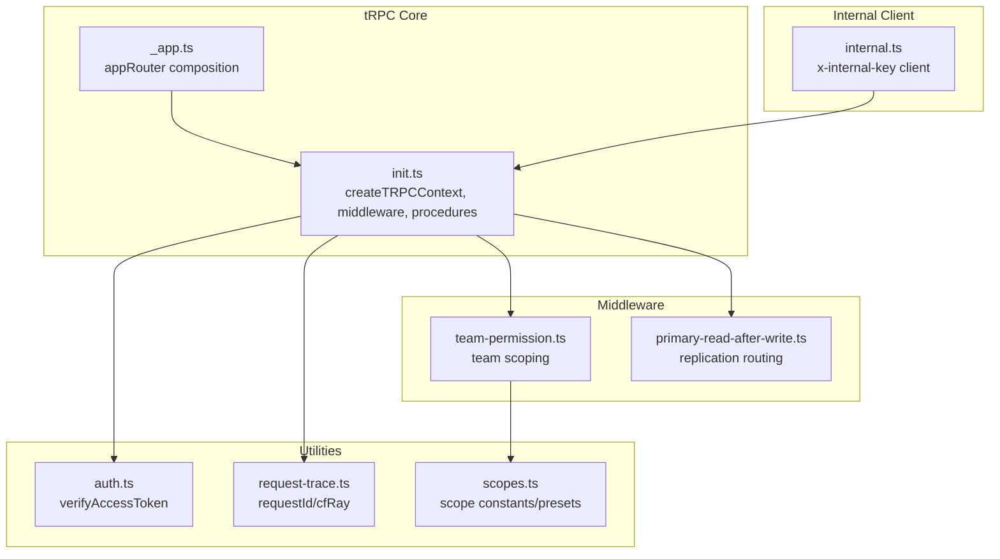
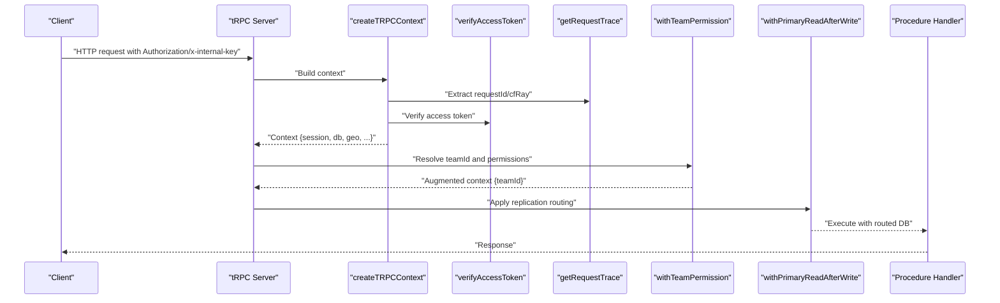
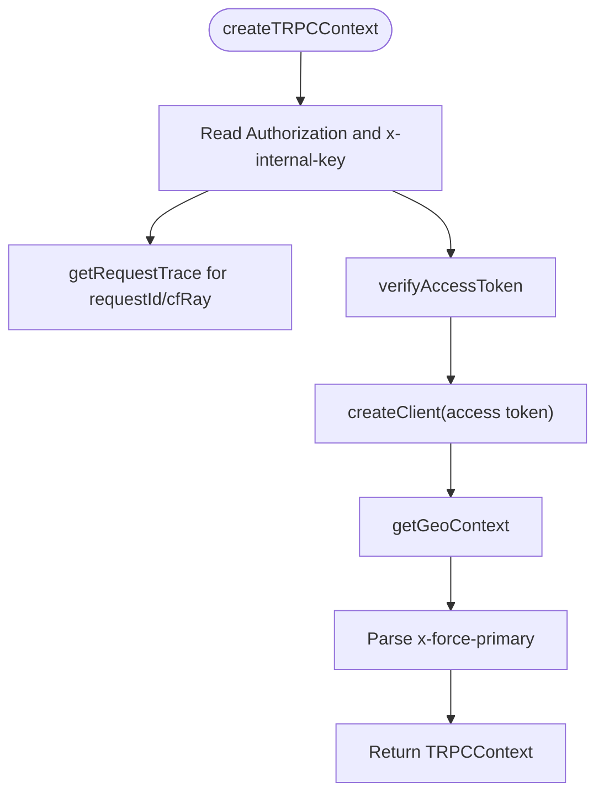
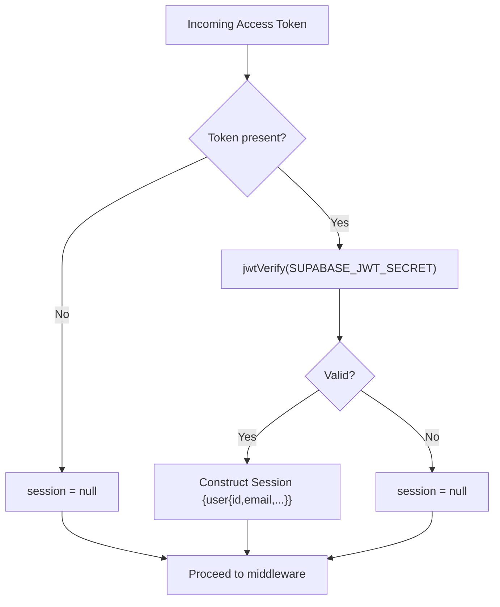
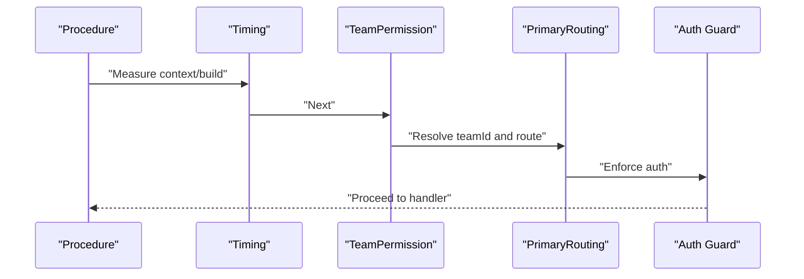
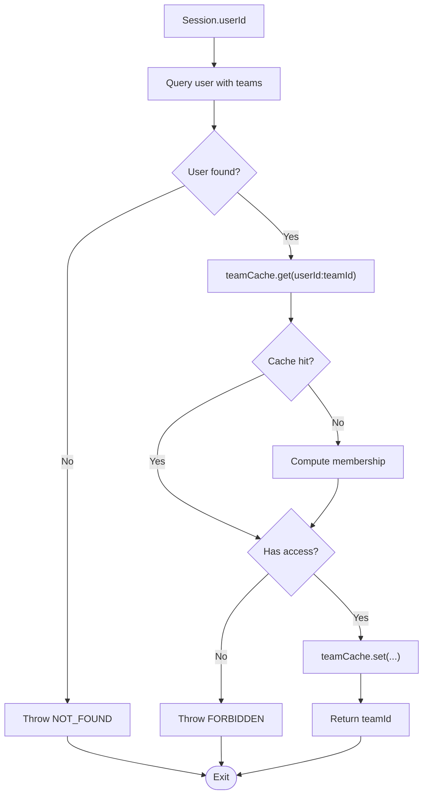
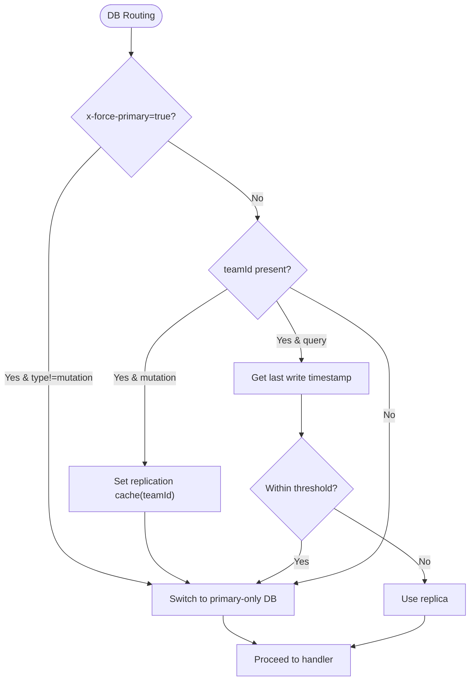
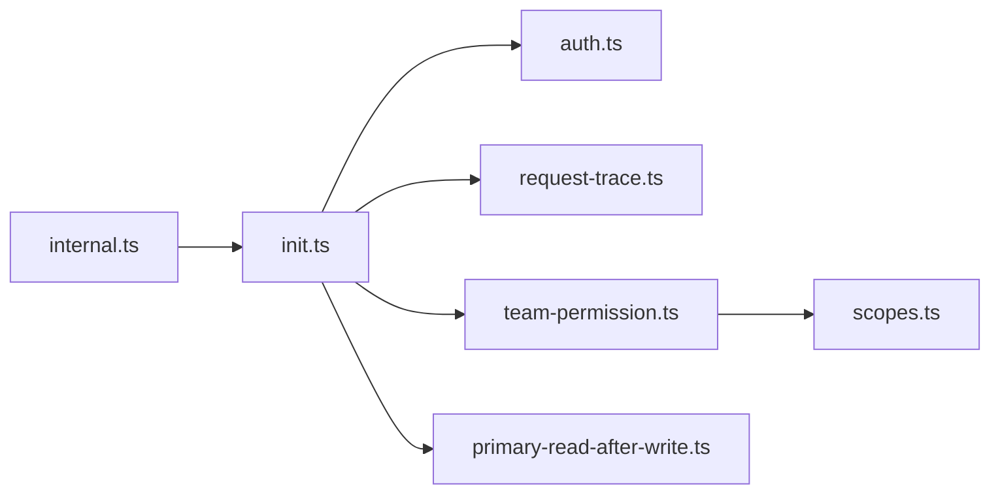

# tRPC Context & Middleware

<cite>
**Referenced Files in This Document**
- [init.ts](file://midday/apps/api/src/trpc/init.ts)
- [primary-read-after-write.ts](file://midday/apps/api/src/trpc/middleware/primary-read-after-write.ts)
- [team-permission.ts](file://midday/apps/api/src/trpc/middleware/team-permission.ts)
- [auth.ts](file://midday/apps/api/src/utils/auth.ts)
- [request-trace.ts](file://midday/apps/api/src/utils/request-trace.ts)
- [_app.ts](file://midday/apps/api/src/trpc/routers/_app.ts)
- [internal.ts](file://midday/packages/trpc/src/internal.ts)
- [scopes.ts](file://midday/apps/api/src/utils/scopes.ts)
</cite>

## Table of Contents
1. [Introduction](#introduction)
2. [Project Structure](#project-structure)
3. [Core Components](#core-components)
4. [Architecture Overview](#architecture-overview)
5. [Detailed Component Analysis](#detailed-component-analysis)
6. [Dependency Analysis](#dependency-analysis)
7. [Performance Considerations](#performance-considerations)
8. [Troubleshooting Guide](#troubleshooting-guide)
9. [Conclusion](#conclusion)
10. [Appendices](#appendices)

## Introduction
This document explains how tRPC context is initialized and how the middleware stack enforces authentication, builds request context, and scopes operations to a team. It covers:
- The createContext function and request context building
- Authentication flow and session verification
- Middleware execution order and permission checking
- Team scoping mechanisms and database routing
- Examples of custom middleware implementation
- Error handling in middleware and context augmentation patterns
- Performance considerations, caching strategies, and debugging techniques

## Project Structure
The tRPC setup centers around a single initialization module that defines context, middleware, and procedure builders. Routers compose features under a single app router.

**Diagram sources**
- [init.ts](file://midday/apps/api/src/trpc/init.ts#L32-L80)
- [_app.ts](file://midday/apps/api/src/trpc/routers/_app.ts#L44-L85)
- [team-permission.ts](file://midday/apps/api/src/trpc/middleware/team-permission.ts#L125-L165)
- [primary-read-after-write.ts](file://midday/apps/api/src/trpc/middleware/primary-read-after-write.ts#L9-L101)
- [auth.ts](file://midday/apps/api/src/utils/auth.ts#L20-L43)
- [request-trace.ts](file://midday/apps/api/src/utils/request-trace.ts#L10-L17)
- [internal.ts](file://midday/packages/trpc/src/internal.ts#L10-L48)
- [scopes.ts](file://midday/apps/api/src/utils/scopes.ts#L1-L96)

**Section sources**
- [init.ts](file://midday/apps/api/src/trpc/init.ts#L1-L187)
- [_app.ts](file://midday/apps/api/src/trpc/routers/_app.ts#L1-L91)

## Core Components
- Context builder: Creates a typed context with session, Supabase client, database handle, geolocation, team scoping hints, and tracing identifiers.
- Middleware chain: Timing, team permission, primary DB routing, and authentication guards.
- Procedure builders: Public, protected, internal, and hybrid procedures with preconfigured middleware.

Key responsibilities:
- Authentication: JWT verification and session extraction
- Context augmentation: Adds teamId, request tracing, and flags
- Permission enforcement: Validates team membership and access
- Database routing: Ensures reads after writes consistency via primary DB when needed
- Observability: Optional performance logging for context building and procedure execution

**Section sources**
- [init.ts](file://midday/apps/api/src/trpc/init.ts#L20-L80)
- [init.ts](file://midday/apps/api/src/trpc/init.ts#L89-L187)
- [auth.ts](file://midday/apps/api/src/utils/auth.ts#L3-L10)
- [auth.ts](file://midday/apps/api/src/utils/auth.ts#L20-L43)
- [request-trace.ts](file://midday/apps/api/src/utils/request-trace.ts#L5-L17)

## Architecture Overview
The tRPC server initializes context from incoming requests, then applies middleware in a fixed order per procedure type. Protected and hybrid procedures enforce authentication and team scoping. The middleware also manages database routing to maintain consistency after mutations.

**Diagram sources**
- [init.ts](file://midday/apps/api/src/trpc/init.ts#L32-L80)
- [auth.ts](file://midday/apps/api/src/utils/auth.ts#L20-L43)
- [request-trace.ts](file://midday/apps/api/src/utils/request-trace.ts#L10-L17)
- [team-permission.ts](file://midday/apps/api/src/trpc/middleware/team-permission.ts#L125-L165)
- [primary-read-after-write.ts](file://midday/apps/api/src/trpc/middleware/primary-read-after-write.ts#L9-L101)

## Detailed Component Analysis

### Context Initialization and Request Context Building
- Extracts Authorization bearer token and optional internal key header
- Verifies JWT and constructs a session object
- Builds a Supabase client using the access token
- Adds geolocation context and request tracing identifiers
- Supports forcing primary DB reads via a dedicated header
- Augments context with flags indicating internal requests

**Diagram sources**
- [init.ts](file://midday/apps/api/src/trpc/init.ts#L32-L80)
- [auth.ts](file://midday/apps/api/src/utils/auth.ts#L20-L43)
- [request-trace.ts](file://midday/apps/api/src/utils/request-trace.ts#L10-L17)

**Section sources**
- [init.ts](file://midday/apps/api/src/trpc/init.ts#L20-L80)
- [auth.ts](file://midday/apps/api/src/utils/auth.ts#L20-L43)
- [request-trace.ts](file://midday/apps/api/src/utils/request-trace.ts#L10-L17)

### Authentication Flow
- Uses a JWT verification utility to derive a lightweight session object
- Treats missing or invalid tokens as anonymous sessions
- Enforced at the procedure level for protected/internal/hybrid procedures

**Diagram sources**
- [auth.ts](file://midday/apps/api/src/utils/auth.ts#L20-L43)

**Section sources**
- [auth.ts](file://midday/apps/api/src/utils/auth.ts#L3-L10)
- [auth.ts](file://midday/apps/api/src/utils/auth.ts#L20-L43)
- [init.ts](file://midday/apps/api/src/trpc/init.ts#L121-L138)
- [init.ts](file://midday/apps/api/src/trpc/init.ts#L146-L159)
- [init.ts](file://midday/apps/api/src/trpc/init.ts#L166-L186)

### Middleware Execution Order
- Timing middleware: Measures context building and procedure execution durations when enabled
- Team permission middleware: Resolves teamId and validates access
- Primary read-after-write middleware: Routes to primary DB for mutations and recent writes
- Authentication guards: Enforce UNAUTHORIZED for missing sessions or internal keys

**Diagram sources**
- [init.ts](file://midday/apps/api/src/trpc/init.ts#L89-L187)
- [team-permission.ts](file://midday/apps/api/src/trpc/middleware/team-permission.ts#L125-L165)
- [primary-read-after-write.ts](file://midday/apps/api/src/trpc/middleware/primary-read-after-write.ts#L9-L101)

**Section sources**
- [init.ts](file://midday/apps/api/src/trpc/init.ts#L89-L187)

### Permission Checking and Team Scoping
- Resolves teamId from the user’s memberships
- Uses a retry-on-primary wrapper for robustness
- Caches team membership checks to reduce DB load
- Emits structured logs for debugging and observability

**Diagram sources**
- [team-permission.ts](file://midday/apps/api/src/trpc/middleware/team-permission.ts#L18-L123)

**Section sources**
- [team-permission.ts](file://midday/apps/api/src/trpc/middleware/team-permission.ts#L125-L165)
- [team-permission.ts](file://midday/apps/api/src/trpc/middleware/team-permission.ts#L18-L123)

### Database Routing and Replication Consistency
- Mutations always route to the primary DB
- Recent write detection uses a replication cache keyed by teamId
- Optional override via x-force-primary header forces primary for non-mutations
- Logs routing decisions for diagnostics

**Diagram sources**
- [primary-read-after-write.ts](file://midday/apps/api/src/trpc/middleware/primary-read-after-write.ts#L9-L101)

**Section sources**
- [primary-read-after-write.ts](file://midday/apps/api/src/trpc/middleware/primary-read-after-write.ts#L9-L101)

### Procedure Builders and Context Augmentation
- publicProcedure: Adds timing and primary routing
- protectedProcedure: Adds team permission, primary routing, and session guard
- internalProcedure: Enforces internal key only
- protectedOrInternalProcedure: Accepts either internal key or valid session

Each builder augments context with relevant fields (e.g., teamId) and throws TRPCError on failure.

**Section sources**
- [init.ts](file://midday/apps/api/src/trpc/init.ts#L117-L187)

### Internal Service-to-Service Calls
- Internal client authenticates via x-internal-key header
- Provides a singleton client for workers and internal services
- Uses batch links with retry-aware fetch

**Section sources**
- [internal.ts](file://midday/packages/trpc/src/internal.ts#L10-L62)

### Scope-Based Permissions (Optional Layer)
- Scope presets and expansion logic define resource access
- Can be integrated into middleware or handlers to gate fine-grained operations

**Section sources**
- [scopes.ts](file://midday/apps/api/src/utils/scopes.ts#L1-L96)

## Dependency Analysis
The tRPC initialization depends on authentication utilities, request tracing, and caching layers. Middleware modules encapsulate cross-cutting concerns and are reused across procedure builders.

**Diagram sources**
- [init.ts](file://midday/apps/api/src/trpc/init.ts#L1-L187)
- [auth.ts](file://midday/apps/api/src/utils/auth.ts#L1-L44)
- [request-trace.ts](file://midday/apps/api/src/utils/request-trace.ts#L1-L17)
- [team-permission.ts](file://midday/apps/api/src/trpc/middleware/team-permission.ts#L1-L165)
- [primary-read-after-write.ts](file://midday/apps/api/src/trpc/middleware/primary-read-after-write.ts#L1-L101)
- [scopes.ts](file://midday/apps/api/src/utils/scopes.ts#L1-L96)
- [internal.ts](file://midday/packages/trpc/src/internal.ts#L1-L62)

**Section sources**
- [init.ts](file://midday/apps/api/src/trpc/init.ts#L1-L187)
- [_app.ts](file://midday/apps/api/src/trpc/routers/_app.ts#L1-L91)

## Performance Considerations
- Enable DEBUG_PERF to log context building and procedure timings
- Team permission and replication routing include optional performance logs
- Prefer caching for team membership checks and recent write timestamps
- Use primary DB routing judiciously; rely on replica for reads when safe

[No sources needed since this section provides general guidance]

## Troubleshooting Guide
Common issues and remedies:
- Unauthorized errors: Verify Authorization header presence and validity; confirm internal key for internal procedures
- Team access denied: Ensure user belongs to the target team; check cache invalidation and retry behavior
- Stale reads after mutation: Confirm replication cache is updated; consider x-force-primary for debugging
- Missing request tracing: Ensure x-request-id or cf-ray headers are forwarded

Operational tips:
- Inspect performance logs for context building and procedure execution
- Review team permission logs for cache hits/misses and routing decisions
- Validate internal client configuration and API URL resolution

**Section sources**
- [init.ts](file://midday/apps/api/src/trpc/init.ts#L121-L187)
- [team-permission.ts](file://midday/apps/api/src/trpc/middleware/team-permission.ts#L18-L123)
- [primary-read-after-write.ts](file://midday/apps/api/src/trpc/middleware/primary-read-after-write.ts#L9-L101)
- [internal.ts](file://midday/packages/trpc/src/internal.ts#L10-L62)

## Conclusion
The tRPC setup centralizes context building, authentication, and team scoping in a predictable middleware chain. It balances correctness (team scoping and replication routing) with performance (caching and selective primary routing) while providing strong observability through structured logs. Integrating additional scope-based checks or custom middleware follows the established patterns.

[No sources needed since this section summarizes without analyzing specific files]

## Appendices

### Example: Custom Middleware Implementation
- Pattern: Wrap next() with pre/post logic
- Use-case: Add correlation IDs, rate limiting, or audit logging
- Placement: Insert early in the chain for request-scoped data; late for response shaping

[No sources needed since this section provides general guidance]

### Example: Context Augmentation Patterns
- Add derived fields (e.g., teamId) from session or headers
- Attach tracing metadata for distributed tracing
- Inject feature flags or environment-specific clients

[No sources needed since this section provides general guidance]