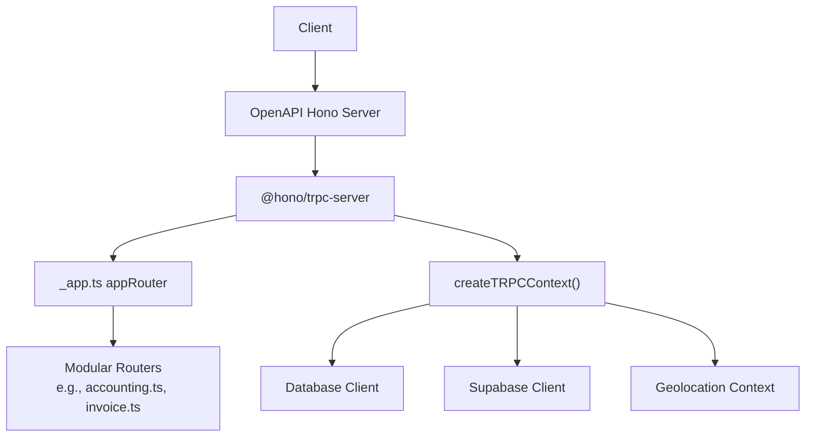
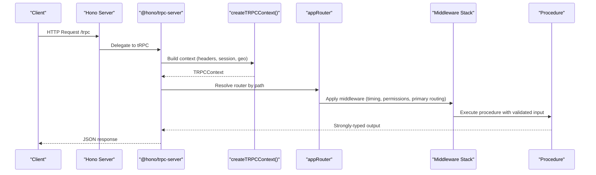
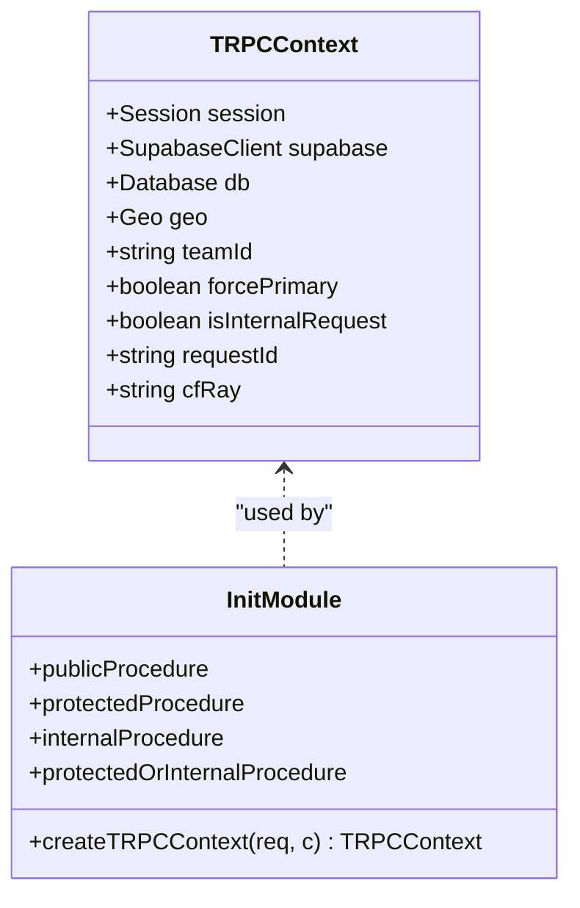
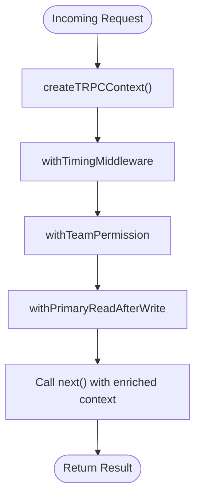
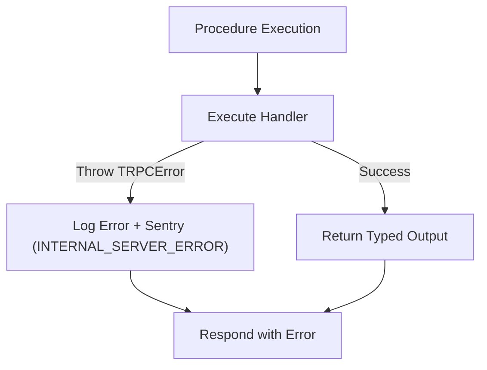
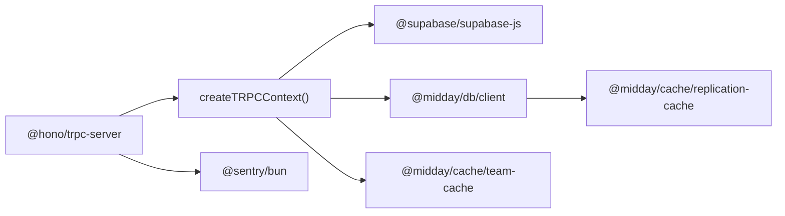

# tRPC Procedures

<cite>
**Referenced Files in This Document**
- [index.ts](file://apps/api/src/index.ts)
- [init.ts](file://apps/api/src/trpc/init.ts)
- [_app.ts](file://apps/api/src/trpc/routers/_app.ts)
- [primary-read-after-write.ts](file://apps/api/src/trpc/middleware/primary-read-after-write.ts)
- [team-permission.ts](file://apps/api/src/trpc/middleware/team-permission.ts)
- [accounting.ts](file://apps/api/src/trpc/routers/accounting.ts)
- [invoice.ts](file://apps/api/src/trpc/routers/invoice.ts)
</cite>

## Table of Contents
1. [Introduction](#introduction)
2. [Project Structure](#project-structure)
3. [Core Components](#core-components)
4. [Architecture Overview](#architecture-overview)
5. [Detailed Component Analysis](#detailed-component-analysis)
6. [Dependency Analysis](#dependency-analysis)
7. [Performance Considerations](#performance-considerations)
8. [Troubleshooting Guide](#troubleshooting-guide)
9. [Conclusion](#conclusion)

## Introduction
This document explains the tRPC implementation in the Midday API application. It covers context creation, middleware stacks, procedure validation patterns, router organization, type safety, and error handling. It also outlines client-side integration considerations, query invalidation patterns, and real-time subscription handling. Performance optimizations, caching strategies, and debugging techniques are included to help you build reliable, scalable tRPC procedures.

## Project Structure
The tRPC runtime is initialized in the API server and exposed via a Hono-based OpenAPI server. The router tree is composed of modular sub-routers grouped under a root app router. Middleware enforces authentication, permissions, and database routing policies.

**Diagram sources**
- [index.ts](file://apps/api/src/index.ts#L88-L113)
- [_app.ts](file://apps/api/src/trpc/routers/_app.ts#L44-L85)
- [init.ts](file://apps/api/src/trpc/init.ts#L32-L80)

**Section sources**
- [index.ts](file://apps/api/src/index.ts#L26-L113)
- [_app.ts](file://apps/api/src/trpc/routers/_app.ts#L44-L85)

## Core Components
- Context factory: Creates a typed tRPC context with session, Supabase client, database handle, geolocation, and request tracing metadata.
- Procedure builders: Public, protected, internal, and protected-or-internal procedures with standardized middleware.
- Middleware: Timing, primary-read-after-write routing, and team permission enforcement.
- Router composition: Root router aggregates feature-specific routers.

Key responsibilities:
- Authentication and authorization via session verification and team membership checks.
- Database routing to primary after mutations and recent writes to ensure read-your-writes consistency.
- Structured error reporting and Sentry integration for server errors.

**Section sources**
- [init.ts](file://apps/api/src/trpc/init.ts#L20-L80)
- [init.ts](file://apps/api/src/trpc/init.ts#L117-L187)
- [primary-read-after-write.ts](file://apps/api/src/trpc/middleware/primary-read-after-write.ts#L9-L100)
- [team-permission.ts](file://apps/api/src/trpc/middleware/team-permission.ts#L18-L123)

## Architecture Overview
The tRPC server integrates with Hono’s OpenAPI server. Requests are authenticated, contextualized, and routed through middleware before reaching feature routers. Procedures return strongly-typed outputs inferred from the router tree.

**Diagram sources**
- [index.ts](file://apps/api/src/index.ts#L88-L113)
- [init.ts](file://apps/api/src/trpc/init.ts#L32-L80)
- [_app.ts](file://apps/api/src/trpc/routers/_app.ts#L44-L85)

## Detailed Component Analysis

### Context Creation and Type Safety
- Context shape includes session, Supabase client, database handle, geolocation, teamId, primary-force flags, and request identifiers.
- Transformer: superjson enables robust serialization of dates, BigInt, and other non-JSON-native values.
- Timing middleware logs procedure durations when enabled.

**Diagram sources**
- [init.ts](file://apps/api/src/trpc/init.ts#L20-L80)
- [init.ts](file://apps/api/src/trpc/init.ts#L82-L187)

**Section sources**
- [init.ts](file://apps/api/src/trpc/init.ts#L20-L80)
- [init.ts](file://apps/api/src/trpc/init.ts#L89-L99)

### Middleware Stack
- Timing middleware: Measures and logs procedure execution time when debug mode is enabled.
- Primary-read-after-write: Routes queries/mutations to primary database when appropriate (mutations, recent writes, forced primary).
- Team permission: Resolves team membership, caches access decisions, and enforces authorization.

**Diagram sources**
- [init.ts](file://apps/api/src/trpc/init.ts#L89-L115)
- [team-permission.ts](file://apps/api/src/trpc/middleware/team-permission.ts#L125-L164)
- [primary-read-after-write.ts](file://apps/api/src/trpc/middleware/primary-read-after-write.ts#L9-L100)

**Section sources**
- [init.ts](file://apps/api/src/trpc/init.ts#L89-L115)
- [team-permission.ts](file://apps/api/src/trpc/middleware/team-permission.ts#L18-L123)
- [primary-read-after-write.ts](file://apps/api/src/trpc/middleware/primary-read-after-write.ts#L25-L97)

### Router Organization and Procedure Validation Patterns
- Root router composes feature routers (e.g., accounting, invoice).
- Feature routers define strongly-typed procedures with Zod schemas for input validation and return types inferred from the router tree.
- Procedures use protected/public/internal builders to enforce auth and routing policies.

Example patterns:
- Protected mutation with input schema and database updates.
- Public query for token-verified invoice retrieval.
- Computed analytics queries with optional filters.

**Section sources**
- [_app.ts](file://apps/api/src/trpc/routers/_app.ts#L44-L85)
- [accounting.ts](file://apps/api/src/trpc/routers/accounting.ts#L27-L61)
- [invoice.ts](file://apps/api/src/trpc/routers/invoice.ts#L81-L102)
- [invoice.ts](file://apps/api/src/trpc/routers/invoice.ts#L410-L446)

### Error Handling and Observability
- Centralized error hook logs structured errors and forwards internal server errors to Sentry.
- TRPCError is used consistently to signal client errors (UNAUTHORIZED, FORBIDDEN, BAD_REQUEST, etc.) and server errors.
- Debug performance logging is available via environment flag.

**Diagram sources**
- [index.ts](file://apps/api/src/index.ts#L93-L111)
- [team-permission.ts](file://apps/api/src/trpc/middleware/team-permission.ts#L35-L107)

**Section sources**
- [index.ts](file://apps/api/src/index.ts#L93-L111)
- [team-permission.ts](file://apps/api/src/trpc/middleware/team-permission.ts#L35-L107)

### Client-Side Integration and Real-Time Subscriptions
- Client setup: Use the generated types and tRPC client bindings to call procedures. Inputs and outputs are strongly typed from the router tree.
- Query invalidation: After mutations, invalidate related queries to keep the UI in sync with the server.
- Subscriptions: Define subscription procedures to receive real-time updates. Use the tRPC subscriptions transport compatible with your client.

Note: The repository demonstrates robust mutation and query patterns; subscription handling follows standard tRPC patterns and is not explicitly implemented in the analyzed files.

[No sources needed since this section provides general guidance]

### Examples of Procedure Definitions, Input/Output Schemas, and Error Handling
- Example: Export to accounting provider
  - Protected mutation with input schema for transaction IDs and provider ID.
  - Validates team context and provider connectivity; triggers background job.
  - Returns job result or throws TRPCError on validation or provider errors.

- Example: Invoice creation with scheduling
  - Validates scheduled delivery timing and creates/removes BullMQ jobs safely.
  - Updates invoice status and cleans up orphaned jobs on failure.
  - Throws TRPCError for bad requests and service unavailability.

**Section sources**
- [accounting.ts](file://apps/api/src/trpc/routers/accounting.ts#L27-L61)
- [invoice.ts](file://apps/api/src/trpc/routers/invoice.ts#L448-L609)
- [invoice.ts](file://apps/api/src/trpc/routers/invoice.ts#L642-L774)

## Dependency Analysis
tRPC depends on:
- Hono for HTTP routing and OpenAPI integration.
- Supabase client for auth and database access.
- Database client with primary/replica routing.
- Caching layers for replication and team permissions.
- Sentry for error reporting.

**Diagram sources**
- [index.ts](file://apps/api/src/index.ts#L4-L24)
- [init.ts](file://apps/api/src/trpc/init.ts#L1-L15)
- [primary-read-after-write.ts](file://apps/api/src/trpc/middleware/primary-read-after-write.ts#L1-L7)
- [team-permission.ts](file://apps/api/src/trpc/middleware/team-permission.ts#L1-L6)

**Section sources**
- [index.ts](file://apps/api/src/index.ts#L4-L24)
- [init.ts](file://apps/api/src/trpc/init.ts#L1-L15)

## Performance Considerations
- Enable DEBUG_PERF to log context building, procedure timings, replication routing, and team permission resolution.
- Use primary-read-after-write to minimize replica lag for reads immediately following writes.
- Cache team membership decisions and recent write timestamps to reduce repeated database lookups.
- Prefer batched queries and concurrent execution where appropriate to reduce round trips.

[No sources needed since this section provides general guidance]

## Troubleshooting Guide
Common issues and resolutions:
- Unauthorized access: Ensure Authorization header is present and valid; verify team membership when using protected procedures.
- Internal server errors: Check Sentry for exceptions and review structured logs emitted by the error hook.
- Stale reads after write: Confirm that mutations are routed to primary and that recent-write cache is populated.
- Permission denied: Validate user-to-team membership and cached access flags.

**Section sources**
- [index.ts](file://apps/api/src/index.ts#L93-L111)
- [team-permission.ts](file://apps/api/src/trpc/middleware/team-permission.ts#L28-L107)
- [primary-read-after-write.ts](file://apps/api/src/trpc/middleware/primary-read-after-write.ts#L42-L89)

## Conclusion
The Midday API implements a robust, strongly-typed tRPC layer with clear context creation, comprehensive middleware, and modular router organization. By leveraging protected procedures, primary-read-after-write routing, and team permission caching, the system achieves correctness, performance, and maintainability. Extending the system with subscriptions and advanced client-side invalidation patterns follows standard tRPC practices demonstrated by the existing procedure designs.