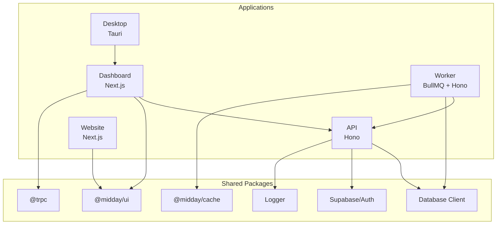
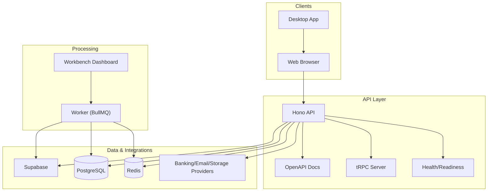
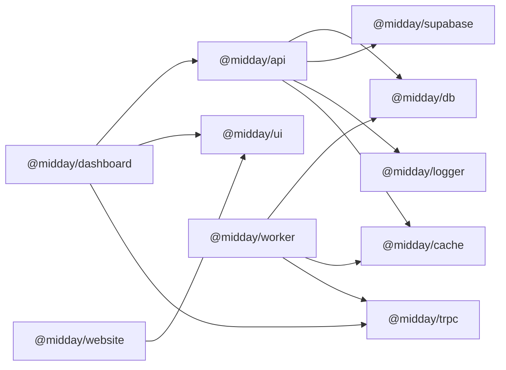

# Core Applications

<cite>
**Referenced Files in This Document**
- [apps/dashboard/package.json](file://apps/dashboard/package.json)
- [apps/dashboard/next.config.ts](file://apps/dashboard/next.config.ts)
- [apps/dashboard/.env-example](file://apps/dashboard/.env-example)
- [apps/api/package.json](file://apps/api/package.json)
- [apps/api/src/index.ts](file://apps/api/src/index.ts)
- [apps/api/.env-template](file://apps/api/.env-template)
- [apps/desktop/package.json](file://apps/desktop/package.json)
- [apps/desktop/src/main.tsx](file://apps/desktop/src/main.tsx)
- [apps/desktop/src-tauri/tauri.conf.json](file://apps/desktop/src-tauri/tauri.conf.json)
- [apps/worker/package.json](file://apps/worker/package.json)
- [apps/worker/src/index.ts](file://apps/worker/src/index.ts)
- [apps/worker/.env-template](file://apps/worker/.env-template)
- [apps/website/package.json](file://apps/website/package.json)
- [apps/website/next.config.ts](file://apps/website/next.config.ts)
- [apps/website/.env-template](file://apps/website/.env-template)
</cite>

## Table of Contents
1. [Introduction](#introduction)
2. [Project Structure](#project-structure)
3. [Core Components](#core-components)
4. [Architecture Overview](#architecture-overview)
5. [Detailed Component Analysis](#detailed-component-analysis)
6. [Dependency Analysis](#dependency-analysis)
7. [Performance Considerations](#performance-considerations)
8. [Troubleshooting Guide](#troubleshooting-guide)
9. [Conclusion](#conclusion)
10. [Appendices](#appendices)

## Introduction
This document describes Faworra’s five core applications and their roles within the platform:
- Next.js dashboard for the web interface
- Hono-based API service
- Tauri desktop application
- Background worker for asynchronous job processing
- Marketing website

It explains each application’s purpose, technology stack, configuration requirements, deployment considerations, inter-application communication patterns, shared dependencies, development workflows, build processes, testing strategies, and cross-platform deployment architectures.

## Project Structure
The repository organizes applications under midday/apps with a monorepo approach using workspace dependencies. Each application has its own package.json, configuration files, and environment templates. Shared packages exist under midday/packages for cross-cutting concerns.

**Diagram sources**
- [apps/dashboard/package.json](file://apps/dashboard/package.json#L16-L98)
- [apps/api/package.json](file://apps/api/package.json#L15-L73)
- [apps/worker/package.json](file://apps/worker/package.json#L13-L49)
- [apps/website/package.json](file://apps/website/package.json#L13-L33)

**Section sources**
- [apps/dashboard/package.json](file://apps/dashboard/package.json#L1-L112)
- [apps/api/package.json](file://apps/api/package.json#L1-L78)
- [apps/worker/package.json](file://apps/worker/package.json#L1-L57)
- [apps/website/package.json](file://apps/website/package.json#L1-L40)

## Core Components
- Dashboard (Next.js): Full-featured web UI for invoicing, time tracking, document reconciliation, financial insights, and assistant integrations. It consumes the API via tRPC and REST routes and integrates with Supabase for auth/storage.
- API (Hono): HTTP API gateway built with Hono, OpenAPI, tRPC server, rate limiting, CORS, secure headers, health checks, and Sentry error reporting. Routes are organized under REST routers and tRPC procedures.
- Desktop (Tauri): Native desktop client for Windows/macOS/Linux using React and Tauri. Supports deep links, auto-updates, and native plugins.
- Worker (Background Job Processor): Asynchronous job processing using BullMQ queues, Hono admin dashboard (Workbench), health/readiness probes, and Sentry monitoring. Processes jobs with centralized error handling and graceful shutdown.
- Website (Marketing Site): Next.js marketing site with optimized images, MDX content, analytics, and performance features.

**Section sources**
- [apps/dashboard/package.json](file://apps/dashboard/package.json#L16-L98)
- [apps/api/src/index.ts](file://apps/api/src/index.ts#L1-L288)
- [apps/desktop/src/main.tsx](file://apps/desktop/src/main.tsx#L1-L9)
- [apps/worker/src/index.ts](file://apps/worker/src/index.ts#L1-L312)
- [apps/website/package.json](file://apps/website/package.json#L13-L33)

## Architecture Overview
The system follows a client-service-worker pattern:
- Clients (web and desktop) communicate with the API.
- The API orchestrates business logic, interacts with Supabase, databases, external providers, and queues jobs into Redis-backed BullMQ.
- The Worker processes jobs asynchronously and emits outcomes back to the API or storage systems.
- The Dashboard renders the UI and integrates with the API via tRPC and REST.
- The Website serves marketing and product pages.

**Diagram sources**
- [apps/api/src/index.ts](file://apps/api/src/index.ts#L26-L177)
- [apps/worker/src/index.ts](file://apps/worker/src/index.ts#L128-L201)

## Detailed Component Analysis

### Dashboard (Next.js Web Application)
Purpose:
- Primary user interface for managing invoices, transactions, documents, teams, and integrations.

Technology stack:
- Next.js 16 with Turbopack, Sentry for edge/server-side monitoring, tRPC client, TanStack Query, React Hook Form, Recharts, PDF rendering, drag-and-drop, and localization.

Key configuration highlights:
- Standalone output for containerization.
- Custom image loader and optimized imports.
- Transpiled shared packages for faster builds.
- Strict mode and hardened headers.

Development workflow:
- Scripts include dev, build, lint, typecheck, and test discovery.
- Environment variables for Supabase, Stripe, OpenAI, and OAuth providers.

Deployment considerations:
- Standalone output enables minimal Docker images.
- Build ID derived from Git SHA to ensure multi-region consistency.
- Sentry integration for source maps and releases.

Inter-application communication:
- Calls API endpoints (REST/tRPC) hosted at MIDDAY_API_URL.
- Uses Supabase for authentication and storage.

Testing strategy:
- Test discovery script runs existing tests if present.

**Section sources**
- [apps/dashboard/package.json](file://apps/dashboard/package.json#L5-L14)
- [apps/dashboard/next.config.ts](file://apps/dashboard/next.config.ts#L4-L61)
- [apps/dashboard/.env-example](file://apps/dashboard/.env-example#L1-L87)

### API (Hono HTTP Service)
Purpose:
- Central HTTP API gateway exposing REST endpoints and tRPC procedures, OpenAPI documentation, health/readiness probes, and security middleware.

Technology stack:
- Hono, @hono/zod-openapi, @hono/trpc-server, Sentry (Bun), rate limiter, secure headers, CORS, and scalar API reference.

Key configuration highlights:
- OpenAPI spec registration and Scalar UI.
- Health endpoints (/health, /health/ready, /health/dependencies).
- tRPC server with request tracing and Sentry capture for internal errors.
- Graceful shutdown with DB and Redis cleanup.

Development workflow:
- Dev server with hot reload on port 3003.
- Linting, formatting, type checking, and test discovery.

Deployment considerations:
- Listens on 0.0.0.0 with configurable port and idle timeout.
- Graceful shutdown on SIGTERM/SIGINT.
- Sentry source maps uploaded in production.

Inter-application communication:
- Internal clients call the API via MIDDAY_API_URL.
- Integrates with Supabase, external banking providers, storage, and Redis queues.

**Section sources**
- [apps/api/package.json](file://apps/api/package.json#L3-L10)
- [apps/api/src/index.ts](file://apps/api/src/index.ts#L26-L288)
- [apps/api/.env-template](file://apps/api/.env-template#L46-L66)

### Desktop (Tauri Native App)
Purpose:
- Cross-platform desktop client leveraging Tauri for native performance and OS integration.

Technology stack:
- React 19, Tauri CLI/plugins, deep-link, dialog, fs, global shortcut, opener, process, updater, upload.

Key configuration highlights:
- Tauri configuration defines product name, identifier, bundling targets, updater endpoint, and deep link schemes.
- Multiple Tauri dev/build commands for dev/staging/prod environments.

Development workflow:
- Vite-based dev server and Tauri CLI commands for building and previewing.
- Environment-specific Tauri configs.

Deployment considerations:
- Bundles installers for major platforms with auto-updater integration.
- Deep link schemes enabled for seamless web-to-desktop transitions.

**Section sources**
- [apps/desktop/package.json](file://apps/desktop/package.json#L6-L17)
- [apps/desktop/src-tauri/tauri.conf.json](file://apps/desktop/src-tauri/tauri.conf.json#L1-L46)

### Worker (Background Job Processor)
Purpose:
- Asynchronous job processing using BullMQ queues, Hono admin dashboard (Workbench), and health checks.

Technology stack:
- BullMQ, Hono, Workbench dashboard, Sentry (Bun), shared DB client, health probes.

Key configuration highlights:
- Dynamically creates workers per queue configuration.
- Centralized error handling and Sentry capture for worker and job failures.
- Workbench mounted under /admin with optional basic auth.
- Health endpoints and readiness checks.

Development workflow:
- Dev and start scripts with hot reload.
- Linting, type checking, and a helper to generate test insights.

Deployment considerations:
- Graceful shutdown with worker closure and DB connection cleanup.
- Sentry flush before exit.
- Optional admin credentials for Workbench.

Inter-application communication:
- Submits jobs to Redis-backed BullMQ queues.
- Processes jobs and updates statuses via API or storage.

**Section sources**
- [apps/worker/package.json](file://apps/worker/package.json#L5-L12)
- [apps/worker/src/index.ts](file://apps/worker/src/index.ts#L25-L201)
- [apps/worker/.env-template](file://apps/worker/.env-template#L59-L64)

### Website (Marketing Site)
Purpose:
- Marketing and product landing page built with Next.js and MDX.

Technology stack:
- Next.js 16, AI SDK, motion primitives, Upstash Redis for rate limiting, OpenPanel analytics, and MDX rendering.

Key configuration highlights:
- Inline CSS optimization and optimized package imports.
- Custom image loader and reduced device sizes for performance.
- Redirects to canonical root path.

Development workflow:
- Dev, build, lint, and start scripts.
- Environment variables for analytics and email provider.

**Section sources**
- [apps/website/package.json](file://apps/website/package.json#L5-L12)
- [apps/website/next.config.ts](file://apps/website/next.config.ts#L1-L51)
- [apps/website/.env-template](file://apps/website/.env-template#L1-L5)

## Dependency Analysis
Shared dependencies and relationships:
- Workspace packages are consumed across applications (e.g., @midday/ui, @midday/trpc, @midday/supabase, @midday/db, @midday/cache).
- The Dashboard depends on the API for data and on Supabase for auth.
- The Worker depends on Redis queues and DB clients; it also exposes an admin dashboard via Hono.
- The API integrates with Supabase, external providers, and queues jobs for the Worker.
- The Website consumes shared UI packages and analytics providers.

**Diagram sources**
- [apps/dashboard/package.json](file://apps/dashboard/package.json#L28-L40)
- [apps/api/package.json](file://apps/api/package.json#L28-L49)
- [apps/worker/package.json](file://apps/worker/package.json#L17-L35)
- [apps/website/package.json](file://apps/website/package.json#L13-L19)

**Section sources**
- [apps/dashboard/package.json](file://apps/dashboard/package.json#L28-L40)
- [apps/api/package.json](file://apps/api/package.json#L28-L49)
- [apps/worker/package.json](file://apps/worker/package.json#L17-L35)
- [apps/website/package.json](file://apps/website/package.json#L13-L19)

## Performance Considerations
- Dashboard
  - Standalone output reduces container size and improves cold-start behavior.
  - Optimized imports and transpiled shared packages reduce build times.
  - Custom image loader and device sizes improve image delivery performance.
- API
  - Secure headers and CORS configured for safety and performance.
  - Optional performance logging for tRPC procedures.
  - Health endpoints help monitor readiness and dependency status.
- Worker
  - Centralized error handling and Sentry capture prevent cascading failures.
  - Graceful shutdown ensures in-flight jobs complete before exit.
  - DB pool stats logging helps tune connection pooling.
- Website
  - Inline CSS and optimized imports reduce bundle size.
  - Reduced image device sizes and quality settings improve load times.

[No sources needed since this section provides general guidance]

## Troubleshooting Guide
Common operational issues and remedies:
- Dashboard “Failed to find Server Action” errors
  - Ensure NEXT_SERVER_ACTIONS_ENCRYPTION_KEY is set consistently across replicas to align build IDs.
- API readiness and dependency checks
  - Use /health/ready and /health/dependencies endpoints to diagnose DB and Redis connectivity.
- Worker job failures
  - Review Workbench dashboard under /admin for failed jobs and error details.
  - Verify Redis queue connectivity and queue configurations.
- Sentry reporting
  - Confirm Sentry environment variables and release tagging for accurate stack traces.
- Tauri deep links and updater
  - Validate deep link schemes and updater endpoints in Tauri configuration.

**Section sources**
- [apps/dashboard/next.config.ts](file://apps/dashboard/next.config.ts#L9-L13)
- [apps/dashboard/.env-example](file://apps/dashboard/.env-example#L84-L87)
- [apps/api/src/index.ts](file://apps/api/src/index.ts#L120-L130)
- [apps/worker/src/index.ts](file://apps/worker/src/index.ts#L167-L182)
- [apps/desktop/src-tauri/tauri.conf.json](file://apps/desktop/src-tauri/tauri.conf.json#L32-L44)

## Conclusion
Faworra’s core applications form a cohesive platform:
- The Dashboard delivers a modern web UI with robust integrations.
- The API provides a secure, documented, and monitored HTTP surface.
- The Desktop app offers a native experience with deep linking and updates.
- The Worker handles asynchronous tasks reliably with observability and resilience.
- The Website supports marketing and product awareness.

Each application follows consistent development workflows, leverages shared packages, and integrates through well-defined endpoints and queues.

[No sources needed since this section summarizes without analyzing specific files]

## Appendices

### Development Workflow Summary
- Dashboard
  - Scripts: dev, build, lint, typecheck, test.
  - Environment: Supabase, Stripe, OpenAI, OAuth providers.
- API
  - Scripts: dev, lint, typecheck, test.
  - Environment: Supabase, DB, Redis, providers, Sentry.
- Desktop
  - Scripts: dev, build, preview, tauri commands for dev/staging/prod.
  - Environment: Tauri configs and updater endpoints.
- Worker
  - Scripts: dev, start, lint, typecheck, generate-insight.
  - Environment: DB pooler, Redis queue, providers, Sentry.
- Website
  - Scripts: dev, build, lint, start.
  - Environment: Analytics, email provider, rate limiting.

**Section sources**
- [apps/dashboard/package.json](file://apps/dashboard/package.json#L5-L14)
- [apps/api/package.json](file://apps/api/package.json#L3-L9)
- [apps/desktop/package.json](file://apps/desktop/package.json#L6-L17)
- [apps/worker/package.json](file://apps/worker/package.json#L5-L12)
- [apps/website/package.json](file://apps/website/package.json#L5-L12)

### Deployment Architectures
- Dashboard
  - Standalone output for containerized deployments; multi-region replicas require consistent build IDs.
- API
  - Runs on 0.0.0.0 with configurable port; graceful shutdown for platform lifecycles.
- Desktop
  - Bundled installers with auto-updater; deep link schemes for OS integration.
- Worker
  - Hono admin dashboard under /admin; readiness checks; graceful shutdown.
- Website
  - Next.js static-friendly configuration with redirects and optimized images.

**Section sources**
- [apps/dashboard/next.config.ts](file://apps/dashboard/next.config.ts#L5-L13)
- [apps/api/src/index.ts](file://apps/api/src/index.ts#L282-L288)
- [apps/desktop/src-tauri/tauri.conf.json](file://apps/desktop/src-tauri/tauri.conf.json#L15-L31)
- [apps/worker/src/index.ts](file://apps/worker/src/index.ts#L194-L201)
- [apps/website/next.config.ts](file://apps/website/next.config.ts#L3-L14)