# Component Architecture

<cite>
**Referenced Files in This Document**
- [package.json](file://midday/package.json)
- [tailwind.config.ts](file://midday/apps/dashboard/tailwind.config.ts)
- [postcss.config.cjs](file://midday/apps/dashboard/postcss.config.cjs)
- [theme-provider.tsx](file://midday/apps/dashboard/src/components/theme-provider.tsx)
- [theme-switch.tsx](file://midday/apps/dashboard/src/components/theme-switch.tsx)
- [canvas/index.tsx](file://midday/apps/dashboard/src/components/canvas/index.tsx)
- [canvas/canvas-context.tsx](file://midday/apps/dashboard/src/components/canvas/canvas-context.tsx)
- [canvas/canvas-grid.tsx](file://midday/apps/dashboard/src/components/canvas/canvas-grid.tsx)
- [canvas/canvas-item.tsx](file://midday/apps/dashboard/src/components/canvas/canvas-item.tsx)
- [canvas/canvas-resize-handle.tsx](file://midday/apps/dashboard/src/components/canvas/canvas-resize-handle.tsx)
- [charts/chart-container.tsx](file://midday/apps/dashboard/src/components/charts/chart-container.tsx)
- [charts/chart-types.ts](file://midday/apps/dashboard/src/components/charts/chart-types.ts)
- [charts/line-chart.tsx](file://midday/apps/dashboard/src/components/charts/line-chart.tsx)
- [charts/bar-chart.tsx](file://midday/apps/dashboard/src/components/charts/bar-chart.tsx)
- [charts/pie-chart.tsx](file://midday/apps/dashboard/src/components/charts/pie-chart.tsx)
- [charts/area-chart.tsx](file://midday/apps/dashboard/src/components/charts/area-chart.tsx)
- [forms/input.tsx](file://midday/apps/dashboard/src/components/forms/input.tsx)
- [forms/select.tsx](file://midday/apps/dashboard/src/components/forms/select.tsx)
- [forms/textarea.tsx](file://midday/apps/dashboard/src/components/forms/textarea.tsx)
- [forms/checkbox.tsx](file://midday/apps/dashboard/src/components/forms/checkbox.tsx)
- [forms/radio.tsx](file://midday/apps/dashboard/src/components/forms/radio.tsx)
- [forms/date-picker.tsx](file://midday/apps/dashboard/src/components/forms/date-picker.tsx)
- [forms/color-picker.tsx](file://midday/apps/dashboard/src/components/forms/color-picker.tsx)
- [modals/base-modal.tsx](file://midday/apps/dashboard/src/components/modals/base-modal.tsx)
- [modals/modal-trigger.tsx](file://midday/apps/dashboard/src/components/modals/modal-trigger.tsx)
- [modals/modal-overlay.tsx](file://midday/apps/dashboard/src/components/modals/modal-overlay.tsx)
- [sheets/base-sheet.tsx](file://midday/apps/dashboard/src/components/sheets/base-sheet.tsx)
- [sheets/sheet-trigger.tsx](file://midday/apps/dashboard/src/components/sheets/sheet-trigger.tsx)
- [sheets/sheet-overlay.tsx](file://midday/apps/dashboard/src/components/sheets/sheet-overlay.tsx)
- [tables/table.tsx](file://midday/apps/dashboard/src/components/tables/table.tsx)
- [tables/table-head.tsx](file://midday/apps/dashboard/src/components/tables/table-head.tsx)
- [tables/table-row.tsx](file://midday/apps/dashboard/src/components/tables/table-row.tsx)
- [tables/table-cell.tsx](file://midday/apps/dashboard/src/components/tables/table-cell.tsx)
- [widgets/widget.tsx](file://midday/apps/dashboard/src/components/widgets/widget.tsx)
- [widgets/widget-grid.tsx](file://midday/apps/dashboard/src/components/widgets/widget-grid.tsx)
- [widgets/widget-context.tsx](file://midday/apps/dashboard/src/components/widgets/widget-context.tsx)
- [metrics/animated-number.tsx](file://midday/apps/dashboard/src/components/metrics/animated-number.tsx)
- [store/dashboard-store.ts](file://midday/apps/dashboard/src/store/dashboard-store.ts)
- [hooks/use-dashboard-store.ts](file://midday/apps/dashboard/src/hooks/use-dashboard-store.ts)
- [hooks/use-local-storage.ts](file://midday/apps/dashboard/src/hooks/use-local-storage.ts)
- [utils/responsive.ts](file://midday/apps/dashboard/src/utils/responsive.ts)
- [utils/styling.ts](file://midday/apps/dashboard/src/utils/styling.ts)
- [lib/design-system.ts](file://midday/apps/dashboard/src/lib/design-system.ts)
</cite>

## Table of Contents
1. [Introduction](#introduction)
2. [Project Structure](#project-structure)
3. [Core Components](#core-components)
4. [Architecture Overview](#architecture-overview)
5. [Detailed Component Analysis](#detailed-component-analysis)
6. [Dependency Analysis](#dependency-analysis)
7. [Performance Considerations](#performance-considerations)
8. [Troubleshooting Guide](#troubleshooting-guide)
9. [Conclusion](#conclusion)

## Introduction
This document describes the Faworra Dashboard component architecture with a focus on the reusable component library, base components for canvases and charts, form components, modals, data tables, and the widget system. It explains composition patterns, prop interfaces, state management integration, and design system implementation. The goal is to help developers understand how to use, customize, and extend the dashboard components effectively while maintaining consistent styling and responsive behavior.

## Project Structure
The dashboard application organizes components under a central components directory with feature-based grouping:
- Canvas components for drag-and-drop layout building
- Charts for data visualization
- Forms for user input
- Modals and Sheets for overlays
- Tables for tabular data presentation
- Widgets for dashboard metrics
- Metrics for animated displays
- Store and hooks for state management
- Utilities for responsive behavior and styling
- Design system configuration for themes and tokens

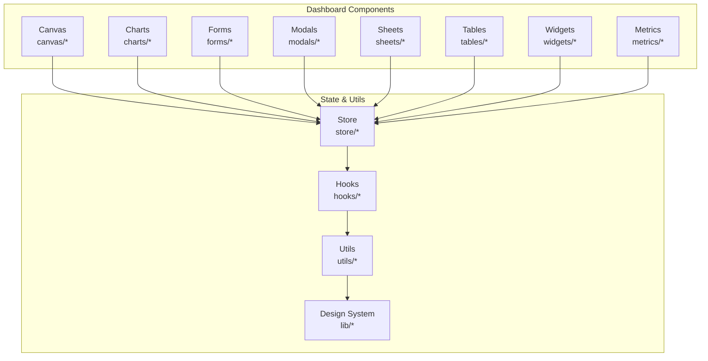

**Section sources**
- [package.json](file://midday/package.json#L1-L50)
- [tailwind.config.ts](file://midday/apps/dashboard/tailwind.config.ts#L1-L100)
- [postcss.config.cjs](file://midday/apps/dashboard/postcss.config.cjs#L1-L50)

## Core Components
This section outlines the primary reusable component families and their roles in the dashboard.

- Canvas components provide a grid-based layout system with draggable items and resize handles for building dashboard pages.
- Charts offer multiple chart types (line, bar, pie, area) with a shared container and type-specific renderers.
- Forms encapsulate input controls (text, select, textarea, checkbox, radio, date picker, color picker) with consistent styling and validation patterns.
- Modals and Sheets implement overlay patterns with triggers, overlays, and close mechanisms for dialogs and bottom sheets.
- Tables define a flexible table structure with head, rows, and cells for displaying datasets.
- Widgets power the dashboard metric grid with context-aware rendering and layout constraints.
- Metrics provide specialized numeric displays with animations and formatting.
- Store and hooks integrate state management for layout, settings, and persistence.
- Utilities and design system enforce responsive behavior and consistent styling.

**Section sources**
- [canvas/index.tsx](file://midday/apps/dashboard/src/components/canvas/index.tsx#L1-L200)
- [charts/chart-container.tsx](file://midday/apps/dashboard/src/components/charts/chart-container.tsx#L1-L200)
- [forms/input.tsx](file://midday/apps/dashboard/src/components/forms/input.tsx#L1-L200)
- [modals/base-modal.tsx](file://midday/apps/dashboard/src/components/modals/base-modal.tsx#L1-L200)
- [sheets/base-sheet.tsx](file://midday/apps/dashboard/src/components/sheets/base-sheet.tsx#L1-L200)
- [tables/table.tsx](file://midday/apps/dashboard/src/components/tables/table.tsx#L1-L200)
- [widgets/widget.tsx](file://midday/apps/dashboard/src/components/widgets/widget.tsx#L1-L200)
- [metrics/animated-number.tsx](file://midday/apps/dashboard/src/components/metrics/animated-number.tsx#L1-L200)
- [store/dashboard-store.ts](file://midday/apps/dashboard/src/store/dashboard-store.ts#L1-L200)
- [hooks/use-dashboard-store.ts](file://midday/apps/dashboard/src/hooks/use-dashboard-store.ts#L1-L200)
- [utils/responsive.ts](file://midday/apps/dashboard/src/utils/responsive.ts#L1-L200)
- [utils/styling.ts](file://midday/apps/dashboard/src/utils/styling.ts#L1-L200)
- [lib/design-system.ts](file://midday/apps/dashboard/src/lib/design-system.ts#L1-L200)

## Architecture Overview
The component architecture follows a layered pattern:
- Presentation layer: Reusable UI components (canvas, charts, forms, modals, sheets, tables, widgets, metrics)
- Composition layer: Higher-order components orchestrating layout and data flow
- State layer: Store and hooks managing persistent settings and reactive updates
- Utility layer: Responsive utilities and design system integrations
- Theme layer: Theme provider and switcher coordinating light/dark modes

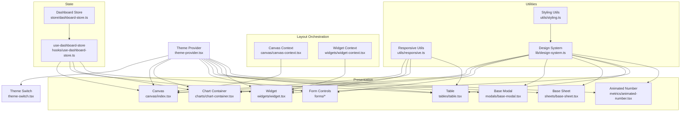

**Diagram sources**
- [theme-provider.tsx](file://midday/apps/dashboard/src/components/theme-provider.tsx#L1-L200)
- [theme-switch.tsx](file://midday/apps/dashboard/src/components/theme-switch.tsx#L1-L200)
- [canvas/canvas-context.tsx](file://midday/apps/dashboard/src/components/canvas/canvas-context.tsx#L1-L200)
- [widgets/widget-context.tsx](file://midday/apps/dashboard/src/components/widgets/widget-context.tsx#L1-L200)
- [canvas/index.tsx](file://midday/apps/dashboard/src/components/canvas/index.tsx#L1-L200)
- [charts/chart-container.tsx](file://midday/apps/dashboard/src/components/charts/chart-container.tsx#L1-L200)
- [forms/input.tsx](file://midday/apps/dashboard/src/components/forms/input.tsx#L1-L200)
- [modals/base-modal.tsx](file://midday/apps/dashboard/src/components/modals/base-modal.tsx#L1-L200)
- [sheets/base-sheet.tsx](file://midday/apps/dashboard/src/components/sheets/base-sheet.tsx#L1-L200)
- [tables/table.tsx](file://midday/apps/dashboard/src/components/tables/table.tsx#L1-L200)
- [widgets/widget.tsx](file://midday/apps/dashboard/src/components/widgets/widget.tsx#L1-L200)
- [metrics/animated-number.tsx](file://midday/apps/dashboard/src/components/metrics/animated-number.tsx#L1-L200)
- [store/dashboard-store.ts](file://midday/apps/dashboard/src/store/dashboard-store.ts#L1-L200)
- [hooks/use-dashboard-store.ts](file://midday/apps/dashboard/src/hooks/use-dashboard-store.ts#L1-L200)
- [utils/responsive.ts](file://midday/apps/dashboard/src/utils/responsive.ts#L1-L200)
- [utils/styling.ts](file://midday/apps/dashboard/src/utils/styling.ts#L1-L200)
- [lib/design-system.ts](file://midday/apps/dashboard/src/lib/design-system.ts#L1-L200)

## Detailed Component Analysis

### Canvas System
The canvas system enables drag-and-drop layout construction with a grid, context management, draggable items, and resize handles.

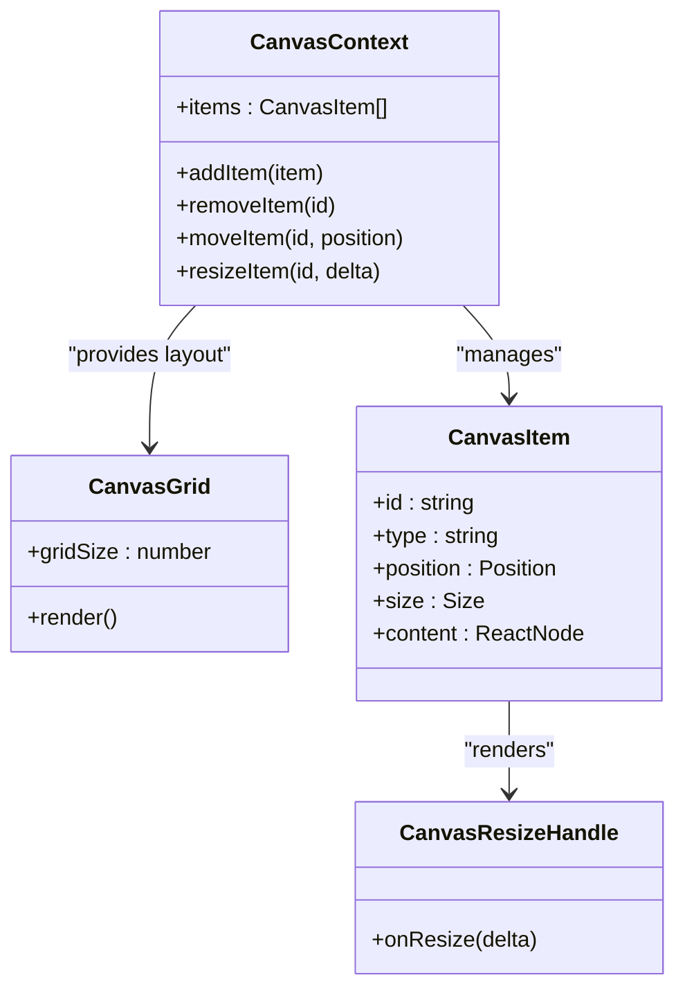

Key composition patterns:
- Canvas wraps children with a context provider to share state across items.
- CanvasGrid renders the underlying grid for alignment and snapping.
- CanvasItem renders individual draggable blocks with resize handles.
- CanvasResizeHandle updates item sizes via context callbacks.

Prop interfaces (descriptive):
- CanvasContext: manages items array and exposes mutation APIs.
- CanvasGrid: accepts grid size and snap thresholds.
- CanvasItem: requires id, type, position, size, and content.
- CanvasResizeHandle: exposes onResize callback.

State management integration:
- Context stores item positions and sizes.
- Store persists layout preferences and restores on mount.
- Hooks coordinate local storage and theme-aware sizing.

**Diagram sources**
- [canvas/canvas-context.tsx](file://midday/apps/dashboard/src/components/canvas/canvas-context.tsx#L1-L200)
- [canvas/canvas-grid.tsx](file://midday/apps/dashboard/src/components/canvas/canvas-grid.tsx#L1-L200)
- [canvas/canvas-item.tsx](file://midday/apps/dashboard/src/components/canvas/canvas-item.tsx#L1-L200)
- [canvas/canvas-resize-handle.tsx](file://midday/apps/dashboard/src/components/canvas/canvas-resize-handle.tsx#L1-L200)
- [canvas/index.tsx](file://midday/apps/dashboard/src/components/canvas/index.tsx#L1-L200)

**Section sources**
- [canvas/index.tsx](file://midday/apps/dashboard/src/components/canvas/index.tsx#L1-L200)
- [canvas/canvas-context.tsx](file://midday/apps/dashboard/src/components/canvas/canvas-context.tsx#L1-L200)
- [canvas/canvas-grid.tsx](file://midday/apps/dashboard/src/components/canvas/canvas-grid.tsx#L1-L200)
- [canvas/canvas-item.tsx](file://midday/apps/dashboard/src/components/canvas/canvas-item.tsx#L1-L200)
- [canvas/canvas-resize-handle.tsx](file://midday/apps/dashboard/src/components/canvas/canvas-resize-handle.tsx#L1-L200)
- [store/dashboard-store.ts](file://midday/apps/dashboard/src/store/dashboard-store.ts#L1-L200)
- [hooks/use-dashboard-store.ts](file://midday/apps/dashboard/src/hooks/use-dashboard-store.ts#L1-L200)

### Charts System
The charts system provides a container with type-specific renderers and a shared props interface.

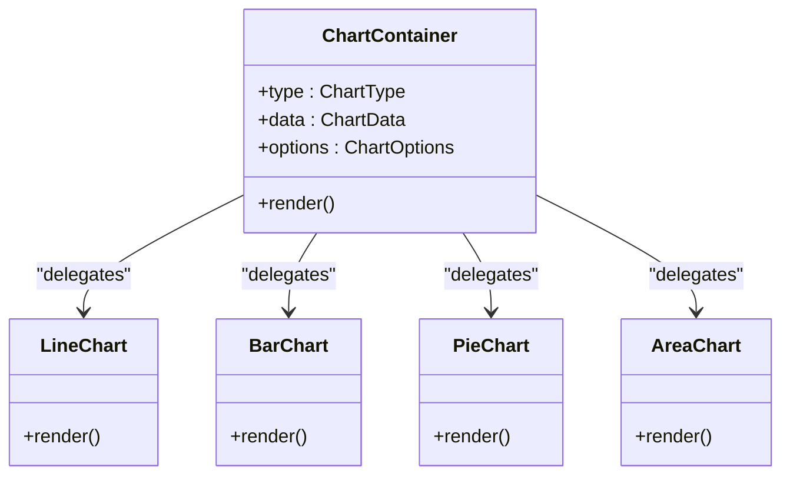

Composition patterns:
- ChartContainer selects renderer based on type and passes data/options.
- Renderers encapsulate chart-specific logic and styling.
- Shared options interface supports common features like tooltips, legends, and axes.

Prop interfaces (descriptive):
- ChartContainer: requires type, data, and options.
- Renderer components: accept normalized data and options.

Integration patterns:
- Store holds chart configurations and selections.
- Hooks subscribe to store changes and re-render containers.

**Diagram sources**
- [charts/chart-container.tsx](file://midday/apps/dashboard/src/components/charts/chart-container.tsx#L1-L200)
- [charts/line-chart.tsx](file://midday/apps/dashboard/src/components/charts/line-chart.tsx#L1-L200)
- [charts/bar-chart.tsx](file://midday/apps/dashboard/src/components/charts/bar-chart.tsx#L1-L200)
- [charts/pie-chart.tsx](file://midday/apps/dashboard/src/components/charts/pie-chart.tsx#L1-L200)
- [charts/area-chart.tsx](file://midday/apps/dashboard/src/components/charts/area-chart.tsx#L1-L200)
- [charts/chart-types.ts](file://midday/apps/dashboard/src/components/charts/chart-types.ts#L1-L200)

**Section sources**
- [charts/chart-container.tsx](file://midday/apps/dashboard/src/components/charts/chart-container.tsx#L1-L200)
- [charts/line-chart.tsx](file://midday/apps/dashboard/src/components/charts/line-chart.tsx#L1-L200)
- [charts/bar-chart.tsx](file://midday/apps/dashboard/src/components/charts/bar-chart.tsx#L1-L200)
- [charts/pie-chart.tsx](file://midday/apps/dashboard/src/components/charts/pie-chart.tsx#L1-L200)
- [charts/area-chart.tsx](file://midday/apps/dashboard/src/components/charts/area-chart.tsx#L1-L200)
- [charts/chart-types.ts](file://midday/apps/dashboard/src/components/charts/chart-types.ts#L1-L200)
- [store/dashboard-store.ts](file://midday/apps/dashboard/src/store/dashboard-store.ts#L1-L200)
- [hooks/use-dashboard-store.ts](file://midday/apps/dashboard/src/hooks/use-dashboard-store.ts#L1-L200)

### Forms System
The forms system provides consistent input controls with shared styling and validation patterns.

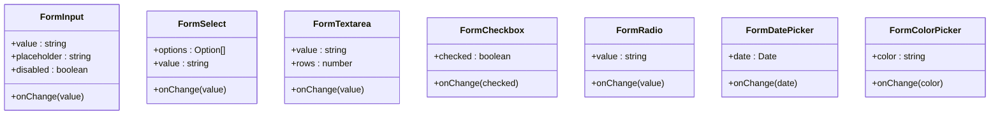

Composition patterns:
- Each control exposes a consistent onChange/value interface.
- Optional disabled and placeholder props unify behavior.
- Color picker integrates with design tokens for swatches.

Prop interfaces (descriptive):
- Inputs: value, onChange, placeholder, disabled.
- Select: options array, value, onChange.
- Textarea: value, onChange, rows.
- Checkbox/Radio: checked/value, onChange.
- DatePicker/ColorPicker: date/color, onChange.

Customization options:
- Pass className overrides for fine-grained styling.
- Integrate with form libraries via controlled props.

**Diagram sources**
- [forms/input.tsx](file://midday/apps/dashboard/src/components/forms/input.tsx#L1-L200)
- [forms/select.tsx](file://midday/apps/dashboard/src/components/forms/select.tsx#L1-L200)
- [forms/textarea.tsx](file://midday/apps/dashboard/src/components/forms/textarea.tsx#L1-L200)
- [forms/checkbox.tsx](file://midday/apps/dashboard/src/components/forms/checkbox.tsx#L1-L200)
- [forms/radio.tsx](file://midday/apps/dashboard/src/components/forms/radio.tsx#L1-L200)
- [forms/date-picker.tsx](file://midday/apps/dashboard/src/components/forms/date-picker.tsx#L1-L200)
- [forms/color-picker.tsx](file://midday/apps/dashboard/src/components/forms/color-picker.tsx#L1-L200)

**Section sources**
- [forms/input.tsx](file://midday/apps/dashboard/src/components/forms/input.tsx#L1-L200)
- [forms/select.tsx](file://midday/apps/dashboard/src/components/forms/select.tsx#L1-L200)
- [forms/textarea.tsx](file://midday/apps/dashboard/src/components/forms/textarea.tsx#L1-L200)
- [forms/checkbox.tsx](file://midday/apps/dashboard/src/components/forms/checkbox.tsx#L1-L200)
- [forms/radio.tsx](file://midday/apps/dashboard/src/components/forms/radio.tsx#L1-L200)
- [forms/date-picker.tsx](file://midday/apps/dashboard/src/components/forms/date-picker.tsx#L1-L200)
- [forms/color-picker.tsx](file://midday/apps/dashboard/src/components/forms/color-picker.tsx#L1-L200)
- [lib/design-system.ts](file://midday/apps/dashboard/src/lib/design-system.ts#L1-L200)

### Modals System
The modals system implements overlay dialogs with trigger, overlay, and close mechanisms.

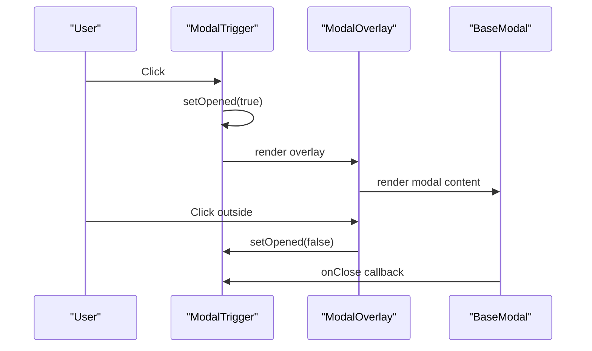

Composition patterns:
- ModalTrigger toggles visibility state.
- ModalOverlay renders backdrop and handles escape/close.
- BaseModal renders content and optionally supports keyboard navigation.

Prop interfaces (descriptive):
- ModalTrigger: onClick, isOpened, children.
- ModalOverlay: isOpened, onClose, onEscape, children.
- BaseModal: isOpened, onClose, children, size.

Customization options:
- Control size and positioning via props.
- Add custom close handlers and escape behavior.

**Diagram sources**
- [modals/modal-trigger.tsx](file://midday/apps/dashboard/src/components/modals/modal-trigger.tsx#L1-L200)
- [modals/modal-overlay.tsx](file://midday/apps/dashboard/src/components/modals/modal-overlay.tsx#L1-L200)
- [modals/base-modal.tsx](file://midday/apps/dashboard/src/components/modals/base-modal.tsx#L1-L200)

**Section sources**
- [modals/modal-trigger.tsx](file://midday/apps/dashboard/src/components/modals/modal-trigger.tsx#L1-L200)
- [modals/modal-overlay.tsx](file://midday/apps/dashboard/src/components/modals/modal-overlay.tsx#L1-L200)
- [modals/base-modal.tsx](file://midday/apps/dashboard/src/components/modals/base-modal.tsx#L1-L200)
- [hooks/use-dashboard-store.ts](file://midday/apps/dashboard/src/hooks/use-dashboard-store.ts#L1-L200)

### Sheets System
The sheets system provides bottom sheets with similar composition to modals but optimized for mobile and vertical space.

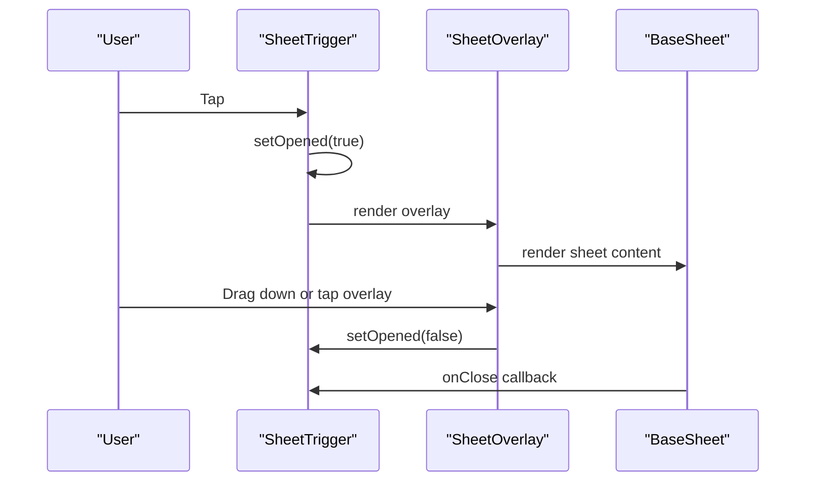

Composition patterns:
- SheetTrigger manages open state.
- SheetOverlay handles dismissal gestures and backdrop.
- BaseSheet renders content with optional drag handle.

Prop interfaces (descriptive):
- SheetTrigger: onClick, isOpened, children.
- SheetOverlay: isOpened, onClose, onEscape, children.
- BaseSheet: isOpened, onClose, children, size.

Customization options:
- Configure sheet height and animation curves.
- Add custom drag behaviors and thresholds.

**Diagram sources**
- [sheets/sheet-trigger.tsx](file://midday/apps/dashboard/src/components/sheets/sheet-trigger.tsx#L1-L200)
- [sheets/sheet-overlay.tsx](file://midday/apps/dashboard/src/components/sheets/sheet-overlay.tsx#L1-L200)
- [sheets/base-sheet.tsx](file://midday/apps/dashboard/src/components/sheets/base-sheet.tsx#L1-L200)

**Section sources**
- [sheets/sheet-trigger.tsx](file://midday/apps/dashboard/src/components/sheets/sheet-trigger.tsx#L1-L200)
- [sheets/sheet-overlay.tsx](file://midday/apps/dashboard/src/components/sheets/sheet-overlay.tsx#L1-L200)
- [sheets/base-sheet.tsx](file://midday/apps/dashboard/src/components/sheets/base-sheet.tsx#L1-L200)
- [hooks/use-dashboard-store.ts](file://midday/apps/dashboard/src/hooks/use-dashboard-store.ts#L1-L200)

### Tables System
The tables system defines a structured table with head, rows, and cells for displaying datasets.

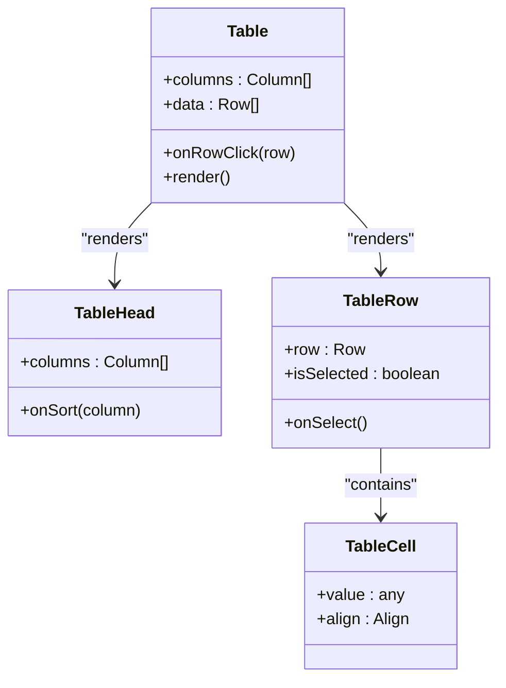

Composition patterns:
- Table orchestrates column definitions and row rendering.
- TableHead handles sorting and column headers.
- TableRow manages selection and click handlers.
- TableCell renders cell content with alignment.

Prop interfaces (descriptive):
- Table: columns, data, onRowClick, onSort.
- TableHead: columns, onSort.
- TableRow: row, isSelected, onSelect.
- TableCell: value, align.

Customization options:
- Define column renderers for complex cells.
- Add selection modes and action menus.

**Diagram sources**
- [tables/table.tsx](file://midday/apps/dashboard/src/components/tables/table.tsx#L1-L200)
- [tables/table-head.tsx](file://midday/apps/dashboard/src/components/tables/table-head.tsx#L1-L200)
- [tables/table-row.tsx](file://midday/apps/dashboard/src/components/tables/table-row.tsx#L1-L200)
- [tables/table-cell.tsx](file://midday/apps/dashboard/src/components/tables/table-cell.tsx#L1-L200)

**Section sources**
- [tables/table.tsx](file://midday/apps/dashboard/src/components/tables/table.tsx#L1-L200)
- [tables/table-head.tsx](file://midday/apps/dashboard/src/components/tables/table-head.tsx#L1-L200)
- [tables/table-row.tsx](file://midday/apps/dashboard/src/components/tables/table-row.tsx#L1-L200)
- [tables/table-cell.tsx](file://midday/apps/dashboard/src/components/tables/table-cell.tsx#L1-L200)
- [store/dashboard-store.ts](file://midday/apps/dashboard/src/store/dashboard-store.ts#L1-L200)
- [hooks/use-dashboard-store.ts](file://midday/apps/dashboard/src/hooks/use-dashboard-store.ts#L1-L200)

### Widgets System
The widgets system powers the dashboard metric grid with context-aware rendering and layout constraints.

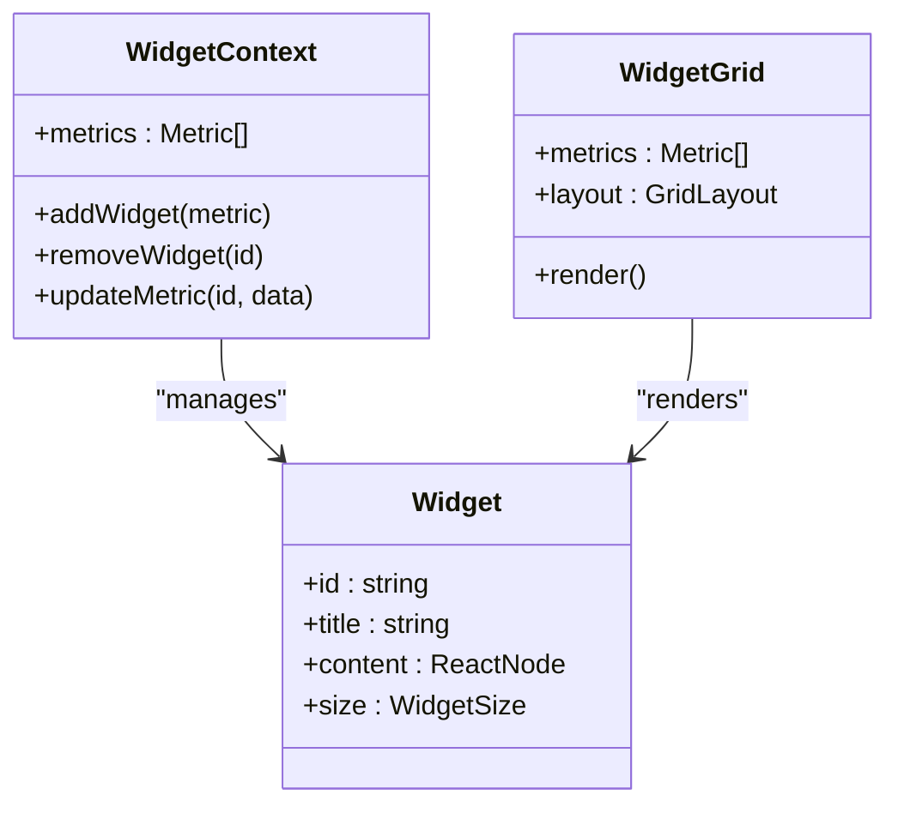

Composition patterns:
- WidgetContext stores and updates metrics.
- Widget renders content with size constraints.
- WidgetGrid arranges widgets in a responsive grid.

Prop interfaces (descriptive):
- WidgetContext: metrics array and mutation APIs.
- Widget: id, title, content, size.
- WidgetGrid: metrics, layout configuration.

State management integration:
- Context persists widget configurations.
- Store coordinates grid layout and metric updates.

**Diagram sources**
- [widgets/widget-context.tsx](file://midday/apps/dashboard/src/components/widgets/widget-context.tsx#L1-L200)
- [widgets/widget.tsx](file://midday/apps/dashboard/src/components/widgets/widget.tsx#L1-L200)
- [widgets/widget-grid.tsx](file://midday/apps/dashboard/src/components/widgets/widget-grid.tsx#L1-L200)

**Section sources**
- [widgets/widget-context.tsx](file://midday/apps/dashboard/src/components/widgets/widget-context.tsx#L1-L200)
- [widgets/widget.tsx](file://midday/apps/dashboard/src/components/widgets/widget.tsx#L1-L200)
- [widgets/widget-grid.tsx](file://midday/apps/dashboard/src/components/widgets/widget-grid.tsx#L1-L200)
- [store/dashboard-store.ts](file://midday/apps/dashboard/src/store/dashboard-store.ts#L1-L200)
- [hooks/use-dashboard-store.ts](file://midday/apps/dashboard/src/hooks/use-dashboard-store.ts#L1-L200)

### Metrics System
The metrics system provides specialized numeric displays with animations and formatting.

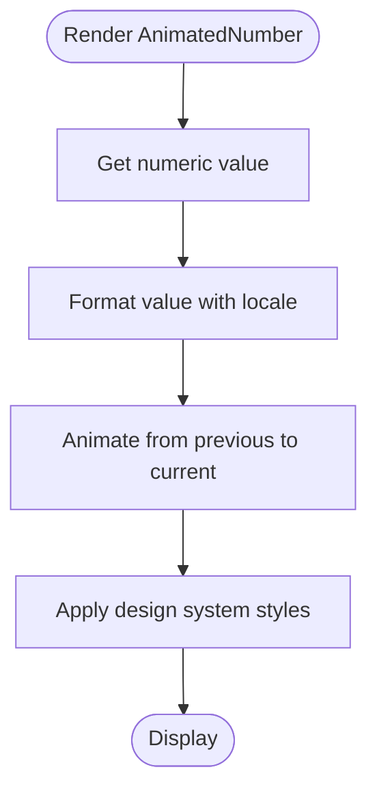

Composition patterns:
- AnimatedNumber reads value from props or store.
- Formats according to locale and unit preferences.
- Animates transitions using easing functions.

Prop interfaces (descriptive):
- AnimatedNumber: value, prefix, suffix, decimals, duration.

Customization options:
- Adjust animation duration and easing.
- Override formatting with custom formatter.

**Diagram sources**
- [metrics/animated-number.tsx](file://midday/apps/dashboard/src/components/metrics/animated-number.tsx#L1-L200)

**Section sources**
- [metrics/animated-number.tsx](file://midday/apps/dashboard/src/components/metrics/animated-number.tsx#L1-L200)
- [lib/design-system.ts](file://midday/apps/dashboard/src/lib/design-system.ts#L1-L200)

## Dependency Analysis
The component architecture exhibits clear separation of concerns with explicit dependencies between layers.

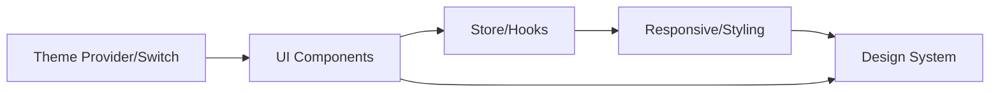

Key observations:
- Theme provider influences all UI components.
- Store and hooks depend on utilities for responsive behavior.
- Utilities depend on design system for tokens and styles.
- Components depend on design system for consistent appearance.

Potential circular dependencies:
- None observed between core layers; contexts and providers are centralized.

External dependencies:
- Tailwind CSS for utility classes.
- React for component model.
- Local storage for persistence.

**Diagram sources**
- [theme-provider.tsx](file://midday/apps/dashboard/src/components/theme-provider.tsx#L1-L200)
- [theme-switch.tsx](file://midday/apps/dashboard/src/components/theme-switch.tsx#L1-L200)
- [store/dashboard-store.ts](file://midday/apps/dashboard/src/store/dashboard-store.ts#L1-L200)
- [hooks/use-dashboard-store.ts](file://midday/apps/dashboard/src/hooks/use-dashboard-store.ts#L1-L200)
- [utils/responsive.ts](file://midday/apps/dashboard/src/utils/responsive.ts#L1-L200)
- [utils/styling.ts](file://midday/apps/dashboard/src/utils/styling.ts#L1-L200)
- [lib/design-system.ts](file://midday/apps/dashboard/src/lib/design-system.ts#L1-L200)

**Section sources**
- [tailwind.config.ts](file://midday/apps/dashboard/tailwind.config.ts#L1-L100)
- [postcss.config.cjs](file://midday/apps/dashboard/postcss.config.cjs#L1-L50)
- [package.json](file://midday/package.json#L1-L50)

## Performance Considerations
- Prefer memoization for expensive computations in charts and tables.
- Use virtualization for large tables and lists.
- Debounce user input in forms to reduce re-renders.
- Split heavy components into smaller chunks for lazy loading.
- Minimize re-renders by isolating state and using shallow comparisons.
- Optimize animations by limiting frame rate and avoiding layout thrashing.

## Troubleshooting Guide
Common issues and resolutions:
- Theme not applying: Verify theme provider is mounted at the root and theme switch updates context.
- Layout shifts: Ensure canvas and widget sizes are constrained and responsive breakpoints are configured.
- Modal/Sheet not closing: Confirm overlay click handlers and escape key bindings are wired correctly.
- Table sorting not working: Check column sort handlers and state updates in the store.
- Form controls not updating: Verify controlled props and onChange handlers are passed consistently.

**Section sources**
- [theme-provider.tsx](file://midday/apps/dashboard/src/components/theme-provider.tsx#L1-L200)
- [theme-switch.tsx](file://midday/apps/dashboard/src/components/theme-switch.tsx#L1-L200)
- [modals/base-modal.tsx](file://midday/apps/dashboard/src/components/modals/base-modal.tsx#L1-L200)
- [sheets/base-sheet.tsx](file://midday/apps/dashboard/src/components/sheets/base-sheet.tsx#L1-L200)
- [tables/table.tsx](file://midday/apps/dashboard/src/components/tables/table.tsx#L1-L200)
- [forms/input.tsx](file://midday/apps/dashboard/src/components/forms/input.tsx#L1-L200)

## Conclusion
The Faworra Dashboard component architecture emphasizes composability, consistency, and scalability. By leveraging context-based state management, a robust design system, and responsive utilities, the system enables rapid development of interactive dashboards. Developers can extend the component library by following established patterns for props, composition, and styling while integrating seamlessly with the store and hooks layer.