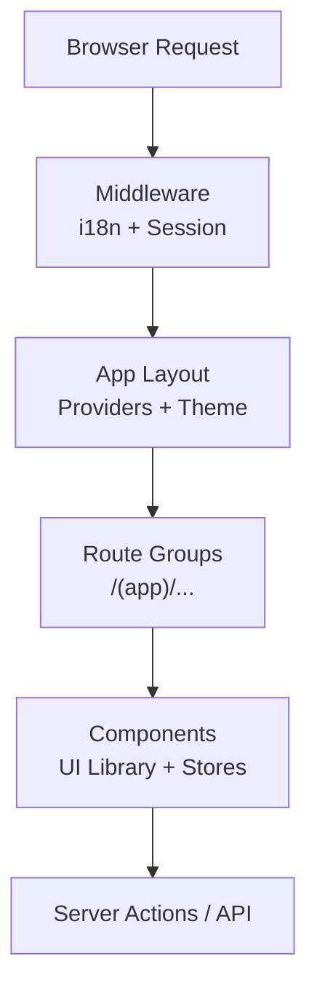
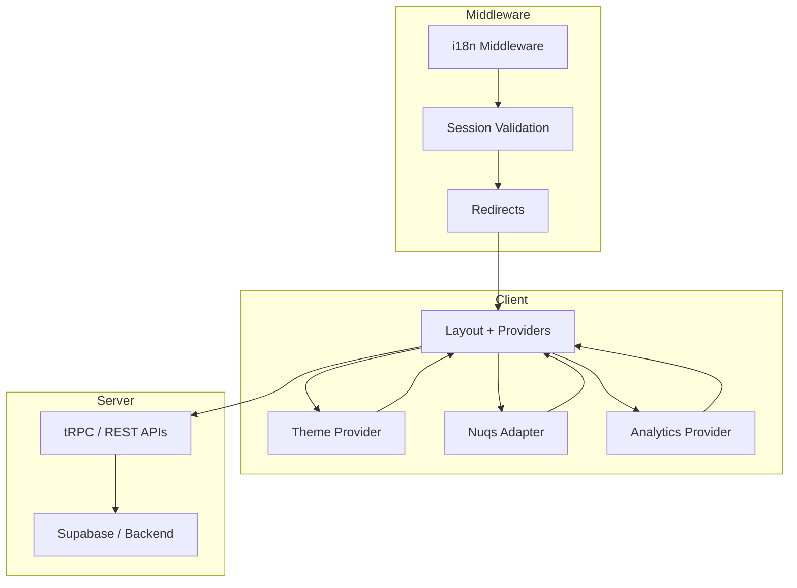
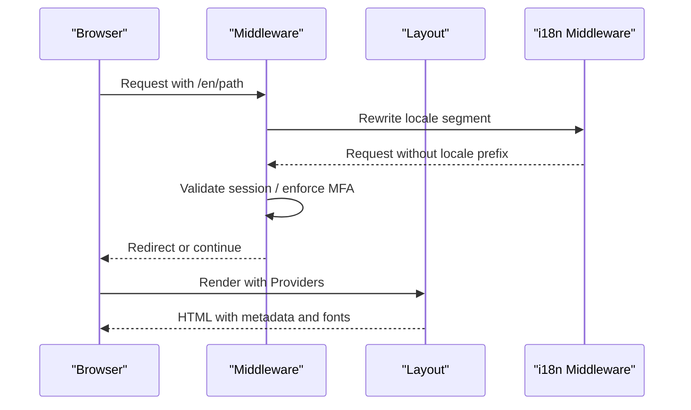
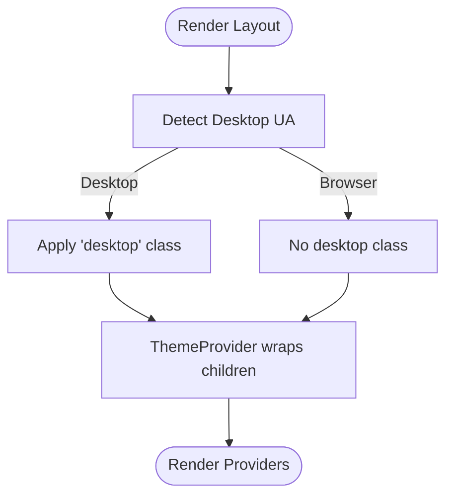
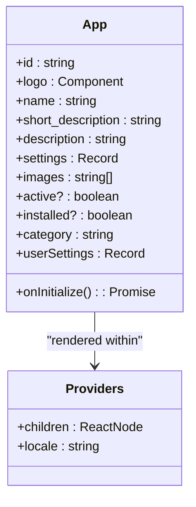
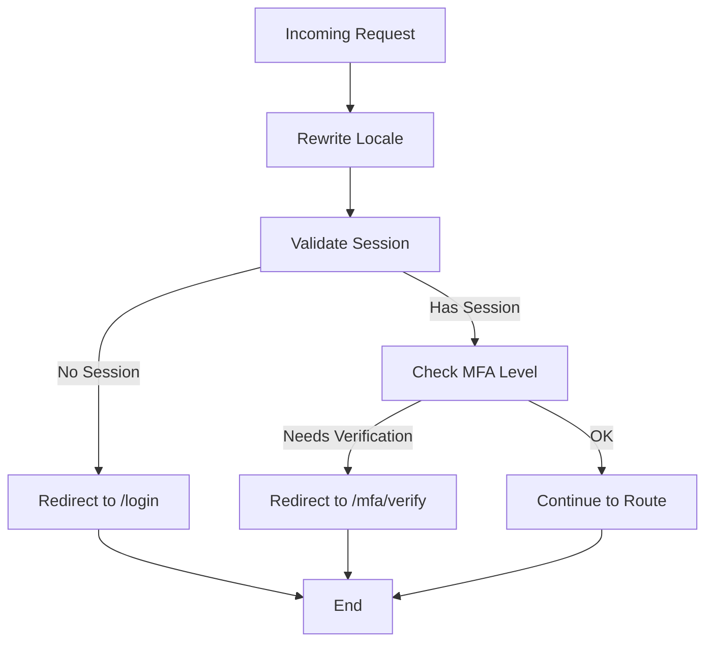
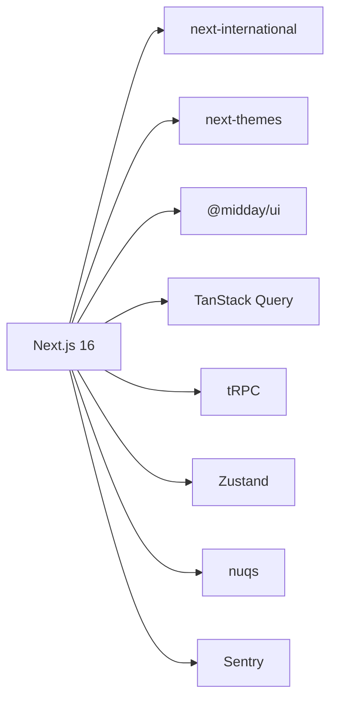

# Dashboard Application

<cite>
**Referenced Files in This Document**
- [package.json](file://midday/apps/dashboard/package.json)
- [next.config.ts](file://midday/apps/dashboard/next.config.ts)
- [middleware.ts](file://midday/apps/dashboard/src/middleware.ts)
- [layout.tsx](file://midday/apps/dashboard/src/app/[locale]/layout.tsx)
- [theme-provider.tsx](file://midday/apps/dashboard/src/components/theme-provider.tsx)
- [en.ts](file://midday/apps/dashboard/src/locales/en.ts)
- [app.tsx](file://midday/apps/dashboard/src/components/app.tsx)
- [desktop.ts](file://midday/apps/dashboard/src/utils/desktop.ts)
</cite>

## Table of Contents
1. [Introduction](#introduction)
2. [Project Structure](#project-structure)
3. [Core Components](#core-components)
4. [Architecture Overview](#architecture-overview)
5. [Detailed Component Analysis](#detailed-component-analysis)
6. [Dependency Analysis](#dependency-analysis)
7. [Performance Considerations](#performance-considerations)
8. [Troubleshooting Guide](#troubleshooting-guide)
9. [Conclusion](#conclusion)
10. [Appendices](#appendices)

## Introduction
This document describes the Faworra Dashboard Application, a Next.js 16-based web interface implementing the App Router. It covers the layout hierarchy, internationalization, theming, responsive design, component library usage, state management with Zustand stores, real-time features, routing strategies, middleware configuration, SEO optimization, build and deployment configuration, performance tuning, and development workflow specifics for the dashboard application.

## Project Structure
The dashboard application is organized under the Next.js App Router convention with locale-aware routes, a dedicated providers wrapper, and a modular component library. Key areas:
- App Router pages under src/app/[locale] with nested route groups for layout segments
- Middleware orchestrating i18n and session checks
- Providers wrapping the app with theme, analytics, and query state adapters
- Component library usage from @midday/ui and third-party libraries
- Internationalization resources under src/locales
- Zustand stores under src/store (referenced in components and middleware)

**Diagram sources**
- [middleware.ts](file://midday/apps/dashboard/src/middleware.ts#L13-L81)
- [layout.tsx](file://midday/apps/dashboard/src/app/[locale]/layout.tsx#L84-L118)

**Section sources**
- [package.json](file://midday/apps/dashboard/package.json#L1-L112)
- [next.config.ts](file://midday/apps/dashboard/next.config.ts#L1-L95)
- [middleware.ts](file://midday/apps/dashboard/src/middleware.ts#L1-L86)
- [layout.tsx](file://midday/apps/dashboard/src/app/[locale]/layout.tsx#L1-L119)

## Core Components
- App layout and providers: Sets metadata, fonts, viewport, desktop detection, and wraps children with Providers for theme, analytics, and query state.
- Theme provider: Uses next-themes to manage light/dark mode persistence and switching.
- Middleware: Implements i18n rewriting, session validation, MFA enforcement, and redirect logic for protected routes.
- Locale resources: English translation dictionary for UI labels, notifications, and structured terms.
- Component library usage: Cards, buttons, accordions, sheets, and scroll areas from @midday/ui; Zustand stores for state management; TanStack Query for caching and mutations; nuqs for URL state parsing.

**Section sources**
- [layout.tsx](file://midday/apps/dashboard/src/app/[locale]/layout.tsx#L14-L118)
- [theme-provider.tsx](file://midday/apps/dashboard/src/components/theme-provider.tsx#L1-L10)
- [middleware.ts](file://midday/apps/dashboard/src/middleware.ts#L1-L86)
- [en.ts](file://midday/apps/dashboard/src/locales/en.ts#L1-L586)
- [app.tsx](file://midday/apps/dashboard/src/components/app.tsx#L1-L253)

## Architecture Overview
The dashboard leverages Next.js 16’s App Router with:
- Locale-aware routing under [locale]
- Route groups for layout segmentation
- Middleware for i18n and session validation
- Providers for theme, analytics, and query state
- Component library integration and Zustand stores for state

**Diagram sources**
- [layout.tsx](file://midday/apps/dashboard/src/app/[locale]/layout.tsx#L84-L118)
- [middleware.ts](file://midday/apps/dashboard/src/middleware.ts#L13-L81)

## Detailed Component Analysis

### Internationalization System
- Middleware uses next-international to rewrite URLs to a single locale and strip the locale prefix for internal routing.
- The app layout sets metadata and Open Graph/Twitter images for SEO.
- Locale resources define UI labels, pluralization keys, and structured terms for notifications and categories.

**Diagram sources**
- [middleware.ts](file://midday/apps/dashboard/src/middleware.ts#L7-L17)
- [layout.tsx](file://midday/apps/dashboard/src/app/[locale]/layout.tsx#L14-L57)

**Section sources**
- [middleware.ts](file://midday/apps/dashboard/src/middleware.ts#L7-L11)
- [layout.tsx](file://midday/apps/dashboard/src/app/[locale]/layout.tsx#L14-L57)
- [en.ts](file://midday/apps/dashboard/src/locales/en.ts#L1-L586)

### Theme Management
- ThemeProvider from next-themes manages theme switching and persistence.
- The layout conditionally applies a desktop class based on user agent detection.

**Diagram sources**
- [layout.tsx](file://midday/apps/dashboard/src/app/[locale]/layout.tsx#L92-L106)
- [theme-provider.tsx](file://midday/apps/dashboard/src/components/theme-provider.tsx#L7-L9)
- [desktop.ts](file://midday/apps/dashboard/src/utils/desktop.ts#L3-L7)

**Section sources**
- [theme-provider.tsx](file://midday/apps/dashboard/src/components/theme-provider.tsx#L1-L10)
- [layout.tsx](file://midday/apps/dashboard/src/app/[locale]/layout.tsx#L92-L106)
- [desktop.ts](file://midday/apps/dashboard/src/utils/desktop.ts#L1-L8)

### Responsive Design Patterns
- The layout defines a fixed viewport and disables user scaling for consistent rendering.
- Fonts are loaded via next/font with swap and CSS variables for optimal performance.
- Desktop vs browser behavior is handled via a UA check and conditional class application.

**Section sources**
- [layout.tsx](file://midday/apps/dashboard/src/app/[locale]/layout.tsx#L73-L106)
- [desktop.ts](file://midday/apps/dashboard/src/utils/desktop.ts#L1-L8)

### Component Library Usage
- UI primitives from @midday/ui are used for cards, buttons, accordions, sheets, and scroll areas.
- Components integrate with TanStack Query for data fetching and mutations, and with Zustand stores for state.
- Example: App component demonstrates sheet, accordion, button, and mutation usage.

**Diagram sources**
- [app.tsx](file://midday/apps/dashboard/src/components/app.tsx#L18-L44)
- [layout.tsx](file://midday/apps/dashboard/src/app/[locale]/layout.tsx#L108-L114)

**Section sources**
- [app.tsx](file://midday/apps/dashboard/src/components/app.tsx#L1-L253)

### State Management with Zustand Stores
- Zustand stores are integrated into the dashboard for state management. Components access stores to manage UI state, selections, and cross-component coordination.
- Stores are referenced in components and middleware where appropriate.

**Section sources**
- [middleware.ts](file://midday/apps/dashboard/src/middleware.ts#L1-L86)
- [app.tsx](file://midday/apps/dashboard/src/components/app.tsx#L1-L253)

### Real-Time Features Implementation
- Real-time updates are implemented using TanStack Query with tRPC for efficient caching and synchronization.
- Components leverage useQuery and useMutation hooks to keep UI state in sync with backend events.

**Section sources**
- [app.tsx](file://midday/apps/dashboard/src/components/app.tsx#L11-L61)

### Routing Strategies
- Locale-aware routing under [locale] with i18n middleware rewriting.
- Protected routes enforced by middleware; redirects to login or MFA verification when required.
- Public routes include login, OAuth callback, and preview endpoints.

**Section sources**
- [middleware.ts](file://midday/apps/dashboard/src/middleware.ts#L13-L81)

### Middleware Configuration
- i18n middleware with rewrite strategy and default locale.
- Session validation via Supabase; MFA assurance level checks.
- Redirect logic for unauthenticated users and MFA verification.

**Diagram sources**
- [middleware.ts](file://midday/apps/dashboard/src/middleware.ts#L13-L81)

**Section sources**
- [middleware.ts](file://midday/apps/dashboard/src/middleware.ts#L1-L86)

### SEO Optimization
- Metadata and Open Graph/Twitter images configured in the root layout.
- Viewport settings ensure consistent presentation across devices.

**Section sources**
- [layout.tsx](file://midday/apps/dashboard/src/app/[locale]/layout.tsx#L14-L82)

## Dependency Analysis
The dashboard integrates several key libraries:
- Next.js 16 with App Router and Turbopack
- next-international for i18n
- next-themes for theme management
- @midday/ui for component primitives
- TanStack Query and tRPC for data fetching and mutations
- Zustand for state management
- nuqs for URL state parsing
- Sentry for error monitoring (conditionally enabled in production)

**Diagram sources**
- [package.json](file://midday/apps/dashboard/package.json#L16-L97)

**Section sources**
- [package.json](file://midday/apps/dashboard/package.json#L1-L112)

## Performance Considerations
- Optimized imports for lucide-react, react-icons, date-fns, framer-motion, recharts, dnd-kit, and usehooks-ts.
- Transpilation of internal packages and externalization of heavy dependencies.
- Image loader configured with custom loader and optimized qualities.
- Build ID derived from git commit SHA to ensure consistent chunk IDs across replicas.
- TypeScript build errors ignored during build to speed up CI.

**Section sources**
- [next.config.ts](file://midday/apps/dashboard/next.config.ts#L14-L46)

## Troubleshooting Guide
Common issues and resolutions:
- Build ID mismatch across replicas: Ensure GIT_COMMIT_SHA is set so all replicas share the same build ID.
- Sentry source map uploads: Configure SENTRY_RELEASE or rely on GIT_COMMIT_SHA; ensure CI environment for logs.
- X-Frame-Options: DENY header prevents embedding; adjust if embedding is required.
- MFA redirect loops: Verify authenticator assurance level and ensure /mfa/verify is accessible.
- Desktop vs browser differences: Confirm desktop UA detection and apply desktop-specific styles.

**Section sources**
- [next.config.ts](file://midday/apps/dashboard/next.config.ts#L9-L13)
- [next.config.ts](file://midday/apps/dashboard/next.config.ts#L48-L60)
- [middleware.ts](file://midday/apps/dashboard/src/middleware.ts#L62-L78)
- [desktop.ts](file://midday/apps/dashboard/src/utils/desktop.ts#L1-L8)

## Conclusion
The Faworra Dashboard Application is built on Next.js 16 with a robust App Router structure, i18n middleware, theme management, and a strong component library foundation. It integrates Zustand for state management, TanStack Query for real-time data, and Sentry for observability. The configuration emphasizes performance, security, and developer productivity through optimized imports, strict mode, and sensible defaults.

## Appendices
- Development scripts: build, dev, lint, format, typecheck, test
- Environment variables: NEXT_PUBLIC_URL, SENTRY_* for production builds

**Section sources**
- [package.json](file://midday/apps/dashboard/package.json#L5-L14)