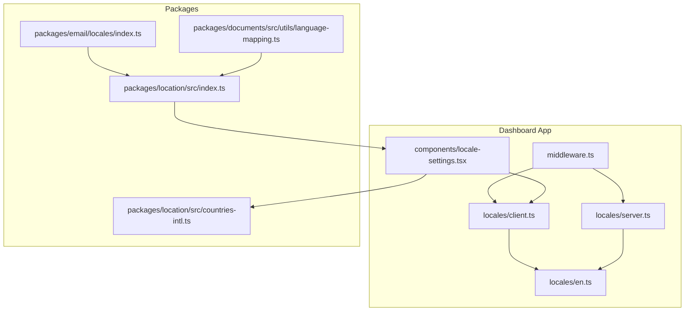
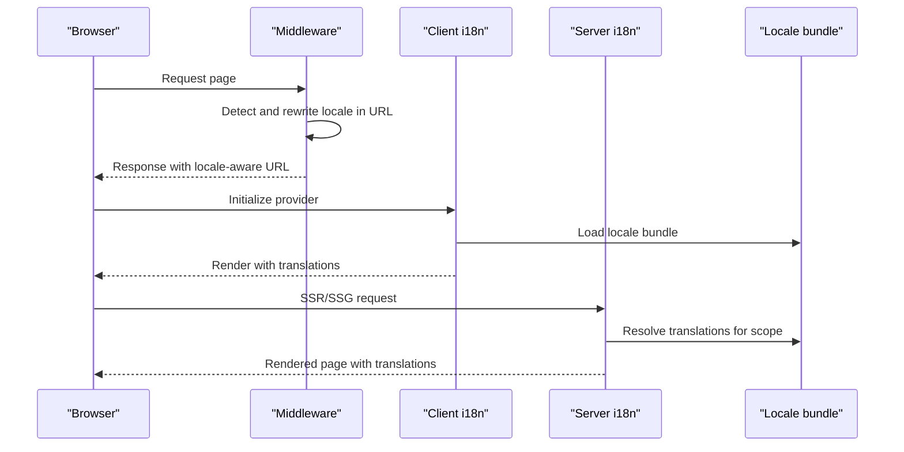
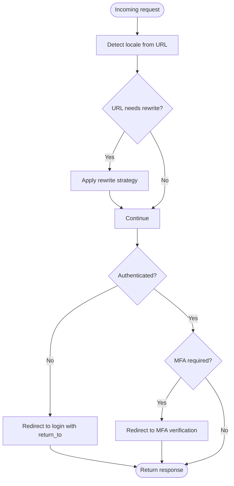
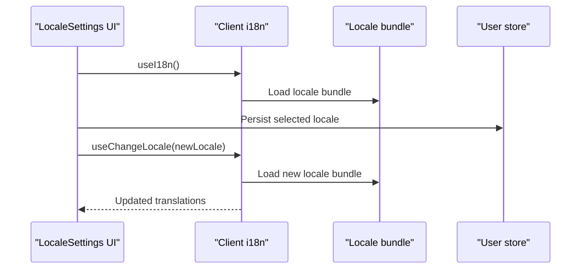
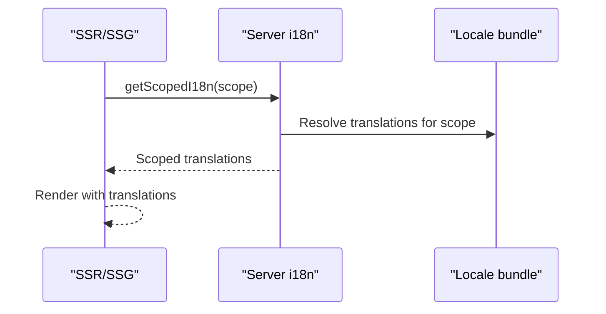
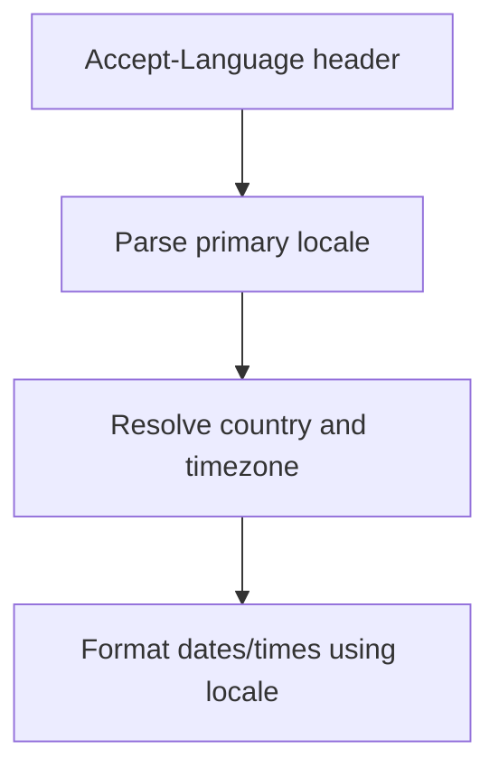
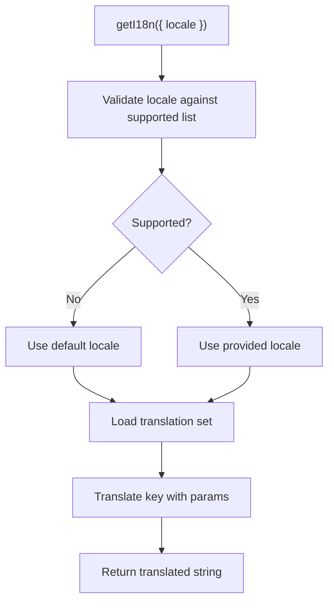
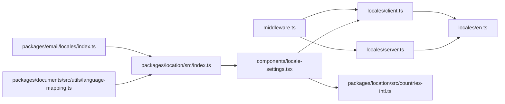

# Internationalization

<cite>
**Referenced Files in This Document**
- [middleware.ts](file://midday/apps/dashboard/src/middleware.ts)
- [client.ts](file://midday/apps/dashboard/src/locales/client.ts)
- [server.ts](file://midday/apps/dashboard/src/locales/server.ts)
- [en.ts](file://midday/apps/dashboard/src/locales/en.ts)
- [locale-settings.tsx](file://midday/apps/dashboard/src/components/locale-settings.tsx)
- [index.ts](file://midday/packages/email/locales/index.ts)
- [index.ts](file://midday/packages/location/src/index.ts)
- [countries-intl.ts](file://midday/packages/location/src/countries-intl.ts)
- [language-mapping.ts](file://midday/packages/documents/src/utils/language-mapping.ts)
</cite>

## Table of Contents
1. [Introduction](#introduction)
2. [Project Structure](#project-structure)
3. [Core Components](#core-components)
4. [Architecture Overview](#architecture-overview)
5. [Detailed Component Analysis](#detailed-component-analysis)
6. [Dependency Analysis](#dependency-analysis)
7. [Performance Considerations](#performance-considerations)
8. [Troubleshooting Guide](#troubleshooting-guide)
9. [Conclusion](#conclusion)
10. [Appendices](#appendices)

## Introduction
This document explains the internationalization (i18n) system in the Faworra Dashboard. It covers locale detection and routing, client-side and server-side translation implementations, locale switching mechanisms, translation key organization, pluralization handling, and date/time formatting considerations. It also documents middleware configuration for locale detection, fallback strategies, and SEO considerations for multi-language content. Practical examples show how to implement translations, handle dynamic content, and manage locale-specific data, along with the relationship between locales and the overall application architecture.

## Project Structure
The i18n implementation centers around three layers:
- Middleware for locale detection and URL rewriting
- Client-side provider for runtime locale switching and translations
- Server-side utilities for static rendering and scoped translations

Key files:
- Middleware: defines supported locales, default locale, and URL rewrite strategy
- Client i18n: exposes hooks for translations and locale switching
- Server i18n: exposes server-side translation functions and static params
- Translation keys: organized per domain (e.g., notifications, categories)
- Locale settings UI: allows users to select locale and persists preferences
- Supporting packages: location utilities for Accept-Language parsing and country/region metadata

**Diagram sources**
- [middleware.ts](file://midday/apps/dashboard/src/middleware.ts#L1-L86)
- [client.ts](file://midday/apps/dashboard/src/locales/client.ts#L1-L18)
- [server.ts](file://midday/apps/dashboard/src/locales/server.ts#L1-L7)
- [en.ts](file://midday/apps/dashboard/src/locales/en.ts#L1-L586)
- [locale-settings.tsx](file://midday/apps/dashboard/src/components/locale-settings.tsx#L1-L51)
- [index.ts](file://midday/packages/location/src/index.ts#L1-L43)
- [countries-intl.ts](file://midday/packages/location/src/countries-intl.ts#L1-L3)
- [index.ts](file://midday/packages/email/locales/index.ts#L1-L28)
- [language-mapping.ts](file://midday/packages/documents/src/utils/language-mapping.ts#L1-L51)

**Section sources**
- [middleware.ts](file://midday/apps/dashboard/src/middleware.ts#L1-L86)
- [client.ts](file://midday/apps/dashboard/src/locales/client.ts#L1-L18)
- [server.ts](file://midday/apps/dashboard/src/locales/server.ts#L1-L7)
- [en.ts](file://midday/apps/dashboard/src/locales/en.ts#L1-L586)
- [locale-settings.tsx](file://midday/apps/dashboard/src/components/locale-settings.tsx#L1-L51)
- [index.ts](file://midday/packages/location/src/index.ts#L1-L43)
- [countries-intl.ts](file://midday/packages/location/src/countries-intl.ts#L1-L3)
- [index.ts](file://midday/packages/email/locales/index.ts#L1-L28)
- [language-mapping.ts](file://midday/packages/documents/src/utils/language-mapping.ts#L1-L51)

## Core Components
- Middleware
  - Defines supported locales and default locale
  - Uses URL rewriting strategy to keep clean URLs while preserving locale awareness
  - Integrates with session management and redirects for authentication and MFA flows
- Client i18n
  - Provides hooks for translations and locale switching
  - Loads locale bundles on demand
- Server i18n
  - Provides server-side translation functions and static params for static generation
- Translation keys
  - Organized by functional domains (e.g., notifications, categories)
  - Supports pluralization via key suffixes
- Locale settings UI
  - Allows users to select locale and persists preference
  - Uses country metadata to present locale options

**Section sources**
- [middleware.ts](file://midday/apps/dashboard/src/middleware.ts#L7-L11)
- [client.ts](file://midday/apps/dashboard/src/locales/client.ts#L5-L17)
- [server.ts](file://midday/apps/dashboard/src/locales/server.ts#L3-L6)
- [en.ts](file://midday/apps/dashboard/src/locales/en.ts#L1-L586)
- [locale-settings.tsx](file://midday/apps/dashboard/src/components/locale-settings.tsx#L15-L50)

## Architecture Overview
The i18n architecture integrates middleware, client, and server layers to deliver localized experiences. The middleware detects and normalizes the locale, the client handles runtime locale switching and translations, and the server supports static rendering and scoped translations.

**Diagram sources**
- [middleware.ts](file://midday/apps/dashboard/src/middleware.ts#L13-L81)
- [client.ts](file://midday/apps/dashboard/src/locales/client.ts#L8-L17)
- [server.ts](file://midday/apps/dashboard/src/locales/server.ts#L3-L6)
- [en.ts](file://midday/apps/dashboard/src/locales/en.ts#L1-L586)

## Detailed Component Analysis

### Middleware: Locale Detection and Routing
- Supported locales and default locale are configured centrally
- URL mapping strategy is set to rewrite, keeping URLs clean
- Middleware integrates with session management and redirects for authentication and MFA flows
- Pathname normalization removes locale prefix for internal routing

**Diagram sources**
- [middleware.ts](file://midday/apps/dashboard/src/middleware.ts#L13-L81)

**Section sources**
- [middleware.ts](file://midday/apps/dashboard/src/middleware.ts#L7-L11)
- [middleware.ts](file://midday/apps/dashboard/src/middleware.ts#L13-L81)

### Client-side Implementation: Translations and Locale Switching
- Client i18n exposes hooks for translations and locale switching
- Locales are loaded on demand
- The locale settings component demonstrates runtime locale selection and persistence

**Diagram sources**
- [client.ts](file://midday/apps/dashboard/src/locales/client.ts#L8-L17)
- [locale-settings.tsx](file://midday/apps/dashboard/src/components/locale-settings.tsx#L15-L50)
- [en.ts](file://midday/apps/dashboard/src/locales/en.ts#L1-L586)

**Section sources**
- [client.ts](file://midday/apps/dashboard/src/locales/client.ts#L5-L17)
- [locale-settings.tsx](file://midday/apps/dashboard/src/components/locale-settings.tsx#L15-L50)

### Server-side Implementation: Static Rendering and Scoped Translations
- Server i18n provides translation functions and static params for static generation
- Enables server-rendered pages to resolve translations for specific scopes

**Diagram sources**
- [server.ts](file://midday/apps/dashboard/src/locales/server.ts#L3-L6)
- [en.ts](file://midday/apps/dashboard/src/locales/en.ts#L1-L586)

**Section sources**
- [server.ts](file://midday/apps/dashboard/src/locales/server.ts#L3-L6)

### Translation Key Organization and Pluralization
- Keys are grouped by functional domains (e.g., notifications, categories)
- Pluralization is handled via key suffixes (e.g., #one, #other, #many, #zero)
- Dynamic content placeholders are used for contextual messages

Examples of pluralization keys:
- invoice_count: "No invoices", "1 invoice", "{count} invoices"
- overdue_invoices: "Oldest {days} {dayText} overdue"
- billable_hours: "{hours} hour tracked", "{hours} hours tracked"

**Section sources**
- [en.ts](file://midday/apps/dashboard/src/locales/en.ts#L418-L420)
- [en.ts](file://midday/apps/dashboard/src/locales/en.ts#L567-L574)
- [en.ts](file://midday/apps/dashboard/src/locales/en.ts#L576-L583)

### Date and Time Formatting for Different Locales
- The location package parses Accept-Language headers to extract primary locale
- Country and timezone metadata are available for locale-aware formatting
- Recommendation: Use locale-aware formatting libraries (e.g., Intl.DateTimeFormat) for rendering dates/times in components

**Diagram sources**
- [index.ts](file://midday/packages/location/src/index.ts#L10-L32)

**Section sources**
- [index.ts](file://midday/packages/location/src/index.ts#L10-L32)
- [countries-intl.ts](file://midday/packages/location/src/countries-intl.ts#L1-L3)

### Email Localization (External Package)
- Email localization provides a simple API with locale fallback
- Ensures missing translations fall back to a default locale

**Diagram sources**
- [index.ts](file://midday/packages/email/locales/index.ts#L10-L27)

**Section sources**
- [index.ts](file://midday/packages/email/locales/index.ts#L1-L28)

### Locale-Specific Data and Search Configuration
- Language mapping utilities map ISO language codes to PostgreSQL text search configurations
- Ensures appropriate stemming and search behavior per language

**Section sources**
- [language-mapping.ts](file://midday/packages/documents/src/utils/language-mapping.ts#L6-L51)

## Dependency Analysis
The i18n system depends on:
- Middleware for locale-aware routing
- Client i18n for runtime locale switching and translations
- Server i18n for SSR/SSG and scoped translations
- Locale bundles for translation keys
- Location utilities for Accept-Language parsing and country metadata
- Email localization for external communications

**Diagram sources**
- [middleware.ts](file://midday/apps/dashboard/src/middleware.ts#L1-L86)
- [client.ts](file://midday/apps/dashboard/src/locales/client.ts#L1-L18)
- [server.ts](file://midday/apps/dashboard/src/locales/server.ts#L1-L7)
- [en.ts](file://midday/apps/dashboard/src/locales/en.ts#L1-L586)
- [locale-settings.tsx](file://midday/apps/dashboard/src/components/locale-settings.tsx#L1-L51)
- [countries-intl.ts](file://midday/packages/location/src/countries-intl.ts#L1-L3)
- [index.ts](file://midday/packages/location/src/index.ts#L1-L43)
- [index.ts](file://midday/packages/email/locales/index.ts#L1-L28)
- [language-mapping.ts](file://midday/packages/documents/src/utils/language-mapping.ts#L1-L51)

**Section sources**
- [middleware.ts](file://midday/apps/dashboard/src/middleware.ts#L1-L86)
- [client.ts](file://midday/apps/dashboard/src/locales/client.ts#L1-L18)
- [server.ts](file://midday/apps/dashboard/src/locales/server.ts#L1-L7)
- [en.ts](file://midday/apps/dashboard/src/locales/en.ts#L1-L586)
- [locale-settings.tsx](file://midday/apps/dashboard/src/components/locale-settings.tsx#L1-L51)
- [index.ts](file://midday/packages/location/src/index.ts#L1-L43)
- [countries-intl.ts](file://midday/packages/location/src/countries-intl.ts#L1-L3)
- [index.ts](file://midday/packages/email/locales/index.ts#L1-L28)
- [language-mapping.ts](file://midday/packages/documents/src/utils/language-mapping.ts#L1-L51)

## Performance Considerations
- On-demand locale loading minimizes initial payload
- URL rewriting keeps URLs clean and improves caching
- Server-side translation functions reduce client-side overhead during SSR/SSG
- Prefer pluralization keys with appropriate suffixes to avoid runtime branching

## Troubleshooting Guide
Common issues and resolutions:
- Missing translations
  - Ensure keys exist in the locale bundle
  - Use pluralization suffixes appropriately
- Locale not applied
  - Verify middleware configuration and URL rewrite strategy
  - Confirm client i18n provider is initialized
- Incorrect Accept-Language handling
  - Validate Accept-Language parsing logic
  - Ensure fallback to default locale when unsupported

**Section sources**
- [en.ts](file://midday/apps/dashboard/src/locales/en.ts#L418-L420)
- [middleware.ts](file://midday/apps/dashboard/src/middleware.ts#L7-L11)
- [client.ts](file://midday/apps/dashboard/src/locales/client.ts#L8-L17)
- [index.ts](file://midday/packages/location/src/index.ts#L10-L14)

## Conclusion
The Faworra Dashboard’s i18n system combines middleware-driven locale routing, client-side runtime switching, and server-side translation resolution. Translation keys are organized by domain with robust pluralization support. The system leverages Accept-Language parsing and country metadata for locale-aware formatting. Email localization and language mapping utilities further enhance internationalization across the platform.

## Appendices

### Implementing Translations
- Add keys to the locale bundle under relevant domains
- Use pluralization suffixes for count-dependent messages
- Reference keys in components via client i18n hooks

**Section sources**
- [en.ts](file://midday/apps/dashboard/src/locales/en.ts#L1-L586)
- [client.ts](file://midday/apps/dashboard/src/locales/client.ts#L8-L17)

### Handling Dynamic Content
- Use placeholders in translation keys for dynamic values
- Pass parameters when resolving translations

**Section sources**
- [en.ts](file://midday/apps/dashboard/src/locales/en.ts#L99-L118)
- [en.ts](file://midday/apps/dashboard/src/locales/en.ts#L223-L240)

### Managing Locale-Specific Data
- Persist user locale preferences
- Use country metadata for locale options
- Map languages to search configurations for optimal search behavior

**Section sources**
- [locale-settings.tsx](file://midday/apps/dashboard/src/components/locale-settings.tsx#L15-L50)
- [countries-intl.ts](file://midday/packages/location/src/countries-intl.ts#L1-L3)
- [language-mapping.ts](file://midday/packages/documents/src/utils/language-mapping.ts#L6-L51)