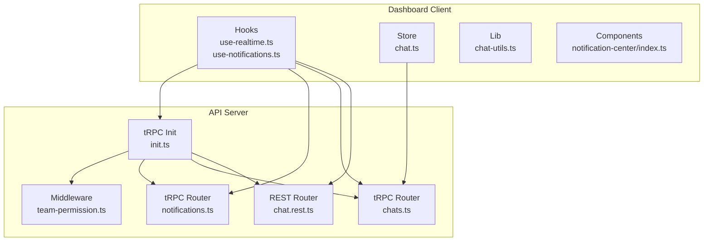
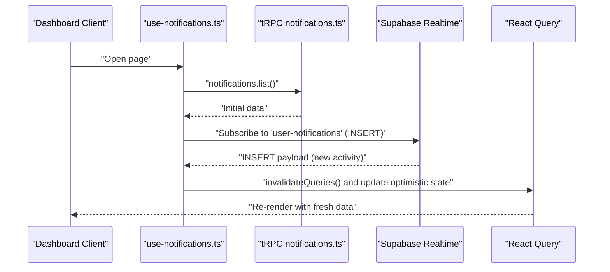
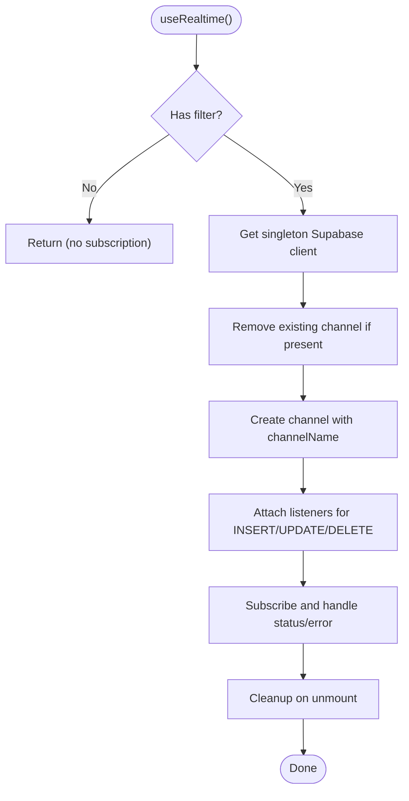
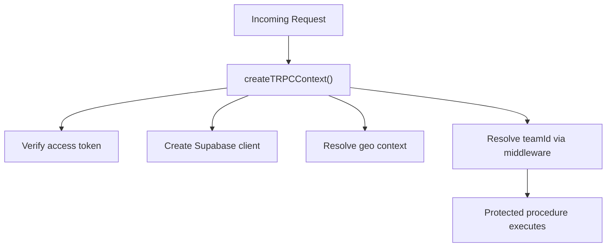
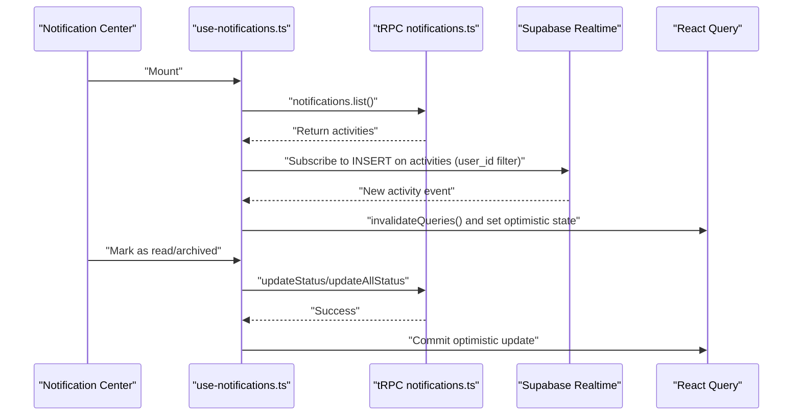
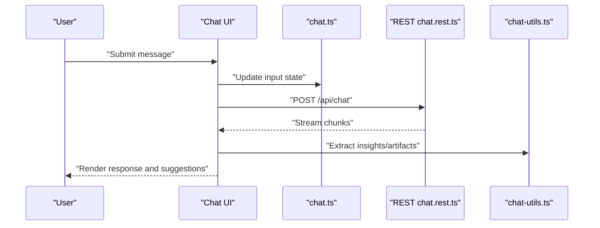
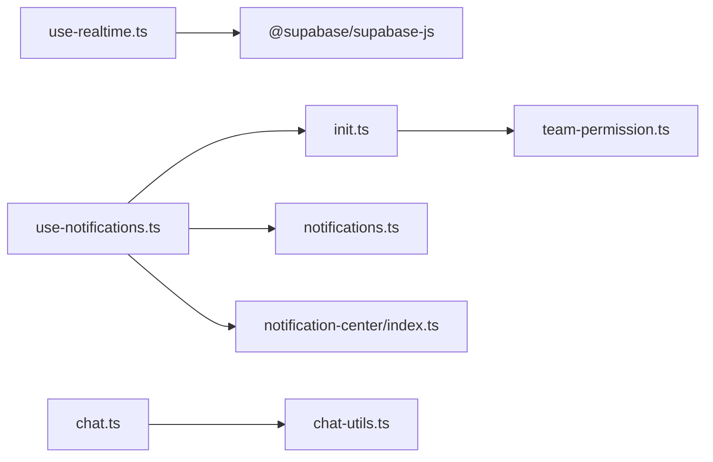

# Real-time Features

<cite>
**Referenced Files in This Document**
- [use-realtime.ts](file://midday/apps/dashboard/src/hooks/use-realtime.ts)
- [use-notifications.ts](file://midday/apps/dashboard/src/hooks/use-notifications.ts)
- [chat.ts](file://midday/apps/dashboard/src/store/chat.ts)
- [chat-utils.ts](file://midday/apps/dashboard/src/lib/chat-utils.ts)
- [notifications.ts](file://midday/apps/api/src/trpc/routers/notifications.ts)
- [chats.ts](file://midday/apps/api/src/trpc/routers/chats.ts)
- [chat.rest.ts](file://midday/apps/api/src/rest/routers/chat.ts)
- [init.ts](file://midday/apps/api/src/trpc/init.ts)
- [team-permission.ts](file://midday/apps/api/src/trpc/middleware/team-permission.ts)
- [index.ts (notification-center)](file://midday/apps/dashboard/src/components/notification-center/index.ts)
</cite>

## Table of Contents
1. [Introduction](#introduction)
2. [Project Structure](#project-structure)
3. [Core Components](#core-components)
4. [Architecture Overview](#architecture-overview)
5. [Detailed Component Analysis](#detailed-component-analysis)
6. [Dependency Analysis](#dependency-analysis)
7. [Performance Considerations](#performance-considerations)
8. [Troubleshooting Guide](#troubleshooting-guide)
9. [Conclusion](#conclusion)

## Introduction
This document explains the real-time features in the Faworra Dashboard, focusing on WebSocket-based real-time data synchronization, live updates, and reactive data flows. It covers:
- Supabase Realtime integration for PostgreSQL changes
- tRPC middleware and procedures enabling secure, team-scoped real-time subscriptions
- Client-side state management for real-time updates
- Chat system implementation and command-driven interactions
- Notification updates and collaborative features
- Practical examples, connection state handling, data consistency, performance, error handling, and fallback strategies

## Project Structure
The real-time system spans the API (tRPC and REST) and the Dashboard (React client):
- API exposes tRPC routers for notifications and chats, with Supabase-backed middleware and context
- Dashboard provides hooks for real-time subscriptions, a notification center, and a chat store with command suggestions

**Diagram sources**
- [use-realtime.ts](file://midday/apps/dashboard/src/hooks/use-realtime.ts#L1-L136)
- [use-notifications.ts](file://midday/apps/dashboard/src/hooks/use-notifications.ts#L1-L338)
- [chat.ts](file://midday/apps/dashboard/src/store/chat.ts#L1-L567)
- [chat-utils.ts](file://midday/apps/dashboard/src/lib/chat-utils.ts#L1-L136)
- [notifications.ts](file://midday/apps/api/src/trpc/routers/notifications.ts#L1-L38)
- [chats.ts](file://midday/apps/api/src/trpc/routers/chats.ts#L1-L58)
- [chat.rest.ts](file://midday/apps/api/src/rest/routers/chat.ts#L1-L83)
- [init.ts](file://midday/apps/api/src/trpc/init.ts#L1-L187)
- [team-permission.ts](file://midday/apps/api/src/trpc/middleware/team-permission.ts#L1-L165)
- [index.ts (notification-center)](file://midday/apps/dashboard/src/components/notification-center/index.ts#L1-L4)

**Section sources**
- [use-realtime.ts](file://midday/apps/dashboard/src/hooks/use-realtime.ts#L1-L136)
- [use-notifications.ts](file://midday/apps/dashboard/src/hooks/use-notifications.ts#L1-L338)
- [chat.ts](file://midday/apps/dashboard/src/store/chat.ts#L1-L567)
- [chat-utils.ts](file://midday/apps/dashboard/src/lib/chat-utils.ts#L1-L136)
- [notifications.ts](file://midday/apps/api/src/trpc/routers/notifications.ts#L1-L38)
- [chats.ts](file://midday/apps/api/src/trpc/routers/chats.ts#L1-L58)
- [chat.rest.ts](file://midday/apps/api/src/rest/routers/chat.ts#L1-L83)
- [init.ts](file://midday/apps/api/src/trpc/init.ts#L1-L187)
- [team-permission.ts](file://midday/apps/api/src/trpc/middleware/team-permission.ts#L1-L165)
- [index.ts (notification-center)](file://midday/apps/dashboard/src/components/notification-center/index.ts#L1-L4)

## Core Components
- Supabase Realtime hook: Provides a singleton Supabase client and subscribes to INSERT/UPDATE/DELETE events on PostgreSQL tables with precise filters
- tRPC context and middleware: Establishes team-scoped permissions and database context for secure, consistent real-time subscriptions
- Notifications: tRPC router for listing and updating activity status; client hook subscribes to new activities and optimistically updates local state
- Chat: tRPC REST endpoint streams AI responses; the client maintains a command-driven chat store with suggestions and state transitions
- Notification Center: Exports UI components for rendering notifications and empty states

**Section sources**
- [use-realtime.ts](file://midday/apps/dashboard/src/hooks/use-realtime.ts#L26-L136)
- [init.ts](file://midday/apps/api/src/trpc/init.ts#L20-L80)
- [team-permission.ts](file://midday/apps/api/src/trpc/middleware/team-permission.ts#L18-L123)
- [notifications.ts](file://midday/apps/api/src/trpc/routers/notifications.ts#L13-L37)
- [use-notifications.ts](file://midday/apps/dashboard/src/hooks/use-notifications.ts#L38-L337)
- [chat.rest.ts](file://midday/apps/api/src/rest/routers/chat.ts#L16-L80)
- [chat.ts](file://midday/apps/dashboard/src/store/chat.ts#L415-L566)
- [index.ts (notification-center)](file://midday/apps/dashboard/src/components/notification-center/index.ts#L1-L4)

## Architecture Overview
The real-time pipeline combines Supabase Realtime with tRPC and client-side state management:
- API tRPC context resolves team membership and attaches a Supabase client
- Client hooks subscribe to Supabase channels for specific tables and filters
- tRPC procedures enforce team permissions and expose CRUD-like operations for notifications and chats
- Client stores and components reactively update UI based on incoming events and mutations

**Diagram sources**
- [use-notifications.ts](file://midday/apps/dashboard/src/hooks/use-notifications.ts#L47-L81)
- [notifications.ts](file://midday/apps/api/src/trpc/routers/notifications.ts#L14-L22)
- [init.ts](file://midday/apps/api/src/trpc/init.ts#L32-L80)

## Detailed Component Analysis

### Supabase Realtime Hook
The hook encapsulates a singleton Supabase client and manages channel lifecycle:
- Ensures a single client instance to avoid duplication
- Subscribes to specific events (INSERT/UPDATE/DELETE) rather than wildcard
- Applies precise Postgres filters (e.g., user_id) to minimize noise
- Handles channel status and errors, with cleanup on unmount

**Diagram sources**
- [use-realtime.ts](file://midday/apps/dashboard/src/hooks/use-realtime.ts#L29-L134)

**Section sources**
- [use-realtime.ts](file://midday/apps/dashboard/src/hooks/use-realtime.ts#L26-L136)

### tRPC Context and Middleware
The tRPC context builds a request-scoped environment:
- Verifies access tokens and creates a Supabase client
- Resolves team membership and caches access decisions
- Enforces team permissions and primary-read-after-write behavior

**Diagram sources**
- [init.ts](file://midday/apps/api/src/trpc/init.ts#L32-L80)
- [team-permission.ts](file://midday/apps/api/src/trpc/middleware/team-permission.ts#L18-L123)

**Section sources**
- [init.ts](file://midday/apps/api/src/trpc/init.ts#L20-L80)
- [team-permission.ts](file://midday/apps/api/src/trpc/middleware/team-permission.ts#L18-L123)

### Notifications: Live Updates and Status Management
The notifications system demonstrates a complete real-time flow:
- tRPC router lists activities scoped to team and user
- Client hook subscribes to new INSERT events and invalidates queries
- Optimistic updates maintain consistency during mutations
- Dedicated mutations update individual or all activities with rollback on error

**Diagram sources**
- [use-notifications.ts](file://midday/apps/dashboard/src/hooks/use-notifications.ts#L47-L337)
- [notifications.ts](file://midday/apps/api/src/trpc/routers/notifications.ts#L14-L37)
- [init.ts](file://midday/apps/api/src/trpc/init.ts#L121-L138)

**Section sources**
- [use-notifications.ts](file://midday/apps/dashboard/src/hooks/use-notifications.ts#L38-L337)
- [notifications.ts](file://midday/apps/api/src/trpc/routers/notifications.ts#L13-L37)

### Chat System: Reactive Streams and Command Suggestions
The chat system integrates two pathways:
- REST endpoint streams AI responses with tool invocation and artifact extraction
- Client-side Zustand store manages input, recording, upload, and command suggestions

**Diagram sources**
- [chat.rest.ts](file://midday/apps/api/src/rest/routers/chat.ts#L16-L80)
- [chat.ts](file://midday/apps/dashboard/src/store/chat.ts#L415-L566)
- [chat-utils.ts](file://midday/apps/dashboard/src/lib/chat-utils.ts#L61-L135)

**Section sources**
- [chat.rest.ts](file://midday/apps/api/src/rest/routers/chat.ts#L16-L80)
- [chat.ts](file://midday/apps/dashboard/src/store/chat.ts#L10-L362)
- [chat-utils.ts](file://midday/apps/dashboard/src/lib/chat-utils.ts#L58-L135)

### Collaborative Features and Filters
- Realtime filters use Postgres column equality (e.g., user_id) to scope events to the current user
- Team scoping is enforced by tRPC middleware, ensuring users only receive events for their team
- Channel names distinguish logical streams (e.g., user-notifications) to prevent cross-channel interference

**Section sources**
- [use-notifications.ts](file://midday/apps/dashboard/src/hooks/use-notifications.ts#L66-L71)
- [team-permission.ts](file://midday/apps/api/src/trpc/middleware/team-permission.ts#L18-L123)
- [use-realtime.ts](file://midday/apps/dashboard/src/hooks/use-realtime.ts#L17-L24)

## Dependency Analysis
The real-time stack connects client hooks, tRPC procedures, and Supabase:
- Client hooks depend on tRPC client and React Query for caching and invalidation
- tRPC routers depend on Supabase client creation and team permission middleware
- Supabase Realtime depends on database tables and row-level security policies

**Diagram sources**
- [use-realtime.ts](file://midday/apps/dashboard/src/hooks/use-realtime.ts#L3-L8)
- [use-notifications.ts](file://midday/apps/dashboard/src/hooks/use-notifications.ts#L3-L9)
- [init.ts](file://midday/apps/api/src/trpc/init.ts#L1-L14)
- [team-permission.ts](file://midday/apps/api/src/trpc/middleware/team-permission.ts#L1-L10)
- [chat.ts](file://midday/apps/dashboard/src/store/chat.ts#L1-L8)
- [chat-utils.ts](file://midday/apps/dashboard/src/lib/chat-utils.ts#L1-L4)
- [index.ts (notification-center)](file://midday/apps/dashboard/src/components/notification-center/index.ts#L1-L4)

**Section sources**
- [use-realtime.ts](file://midday/apps/dashboard/src/hooks/use-realtime.ts#L1-L136)
- [use-notifications.ts](file://midday/apps/dashboard/src/hooks/use-notifications.ts#L1-L338)
- [init.ts](file://midday/apps/api/src/trpc/init.ts#L1-L187)
- [team-permission.ts](file://midday/apps/api/src/trpc/middleware/team-permission.ts#L1-L165)
- [chat.ts](file://midday/apps/dashboard/src/store/chat.ts#L1-L567)
- [chat-utils.ts](file://midday/apps/dashboard/src/lib/chat-utils.ts#L1-L136)
- [index.ts (notification-center)](file://midday/apps/dashboard/src/components/notification-center/index.ts#L1-L4)

## Performance Considerations
- Prefer specific event types (INSERT/UPDATE/DELETE) over wildcards to reduce overhead
- Use precise filters (e.g., user_id) to minimize irrelevant events
- Leverage React Query’s optimistic updates and selective invalidation to avoid full refetches
- Cache team membership decisions to reduce repeated database lookups
- Stream REST responses to keep UI responsive while data arrives incrementally

[No sources needed since this section provides general guidance]

## Troubleshooting Guide
Common issues and remedies:
- Channel errors or timeouts: Check network connectivity and Supabase credentials; inspect status callbacks in the realtime hook
- Permission denied: Ensure team membership middleware resolves correctly and user has access to the target team
- Stale state after RLS policy changes: Use a new channel name to avoid cached filters
- Mutation rollbacks: Confirm optimistic updates are applied and rolled back on error using React Query’s context

**Section sources**
- [use-realtime.ts](file://midday/apps/dashboard/src/hooks/use-realtime.ts#L106-L112)
- [team-permission.ts](file://midday/apps/api/src/trpc/middleware/team-permission.ts#L18-L123)
- [use-notifications.ts](file://midday/apps/dashboard/src/hooks/use-notifications.ts#L172-L186)

## Conclusion
The Faworra Dashboard implements robust real-time features by combining Supabase Realtime with tRPC and React Query. The system ensures secure, team-scoped updates, minimizes network overhead through targeted filters, and maintains UI consistency via optimistic updates. The chat and notification systems demonstrate practical patterns for reactive data, streaming responses, and collaborative filtering.