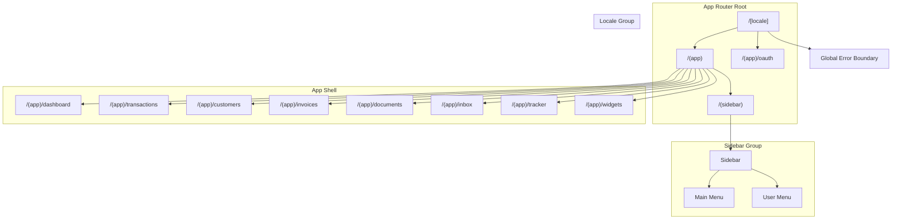
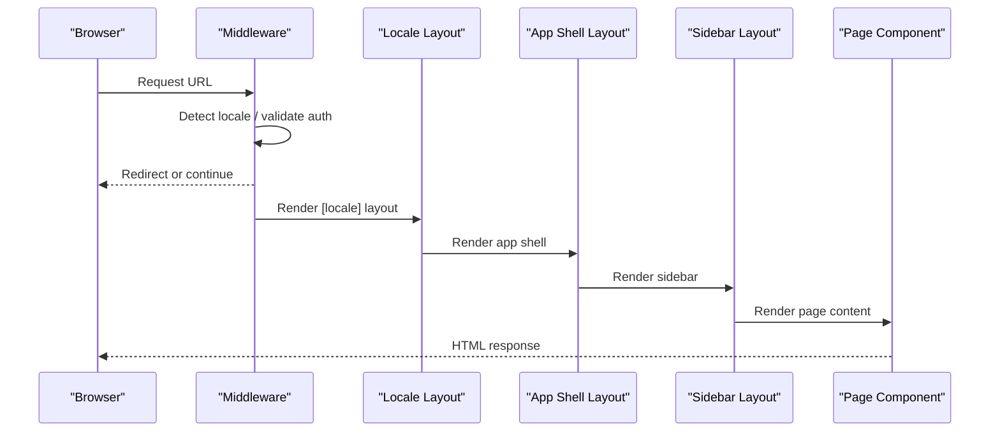
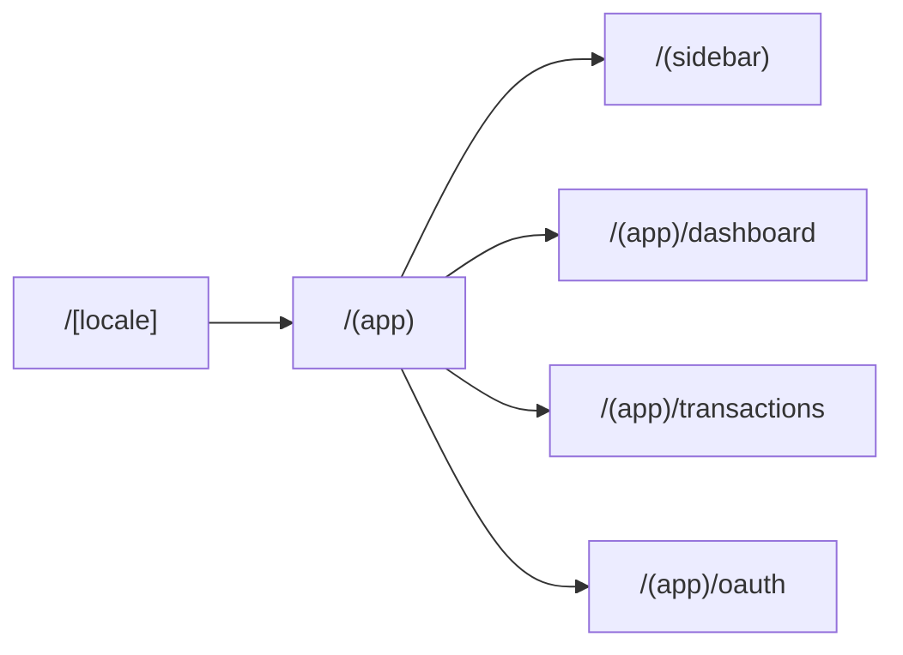
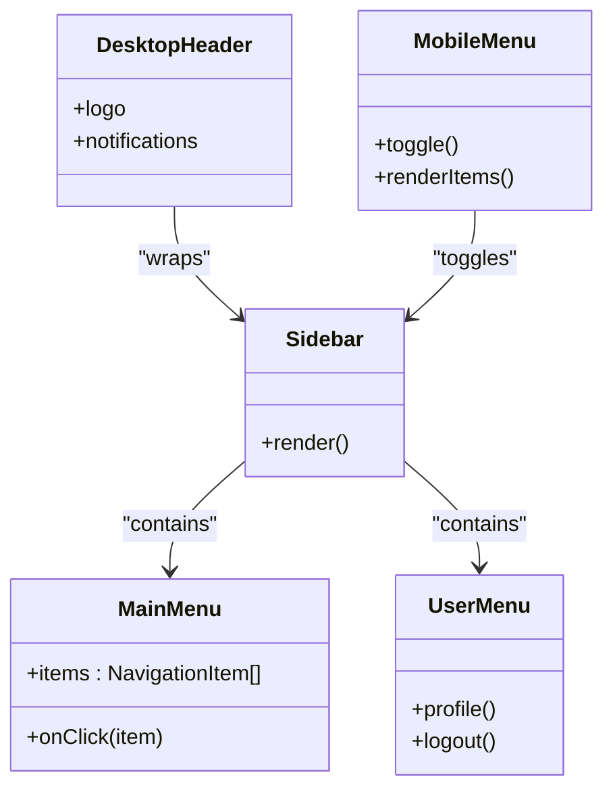
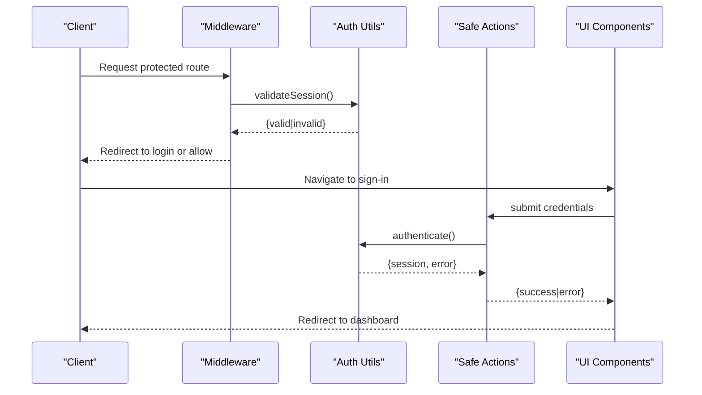
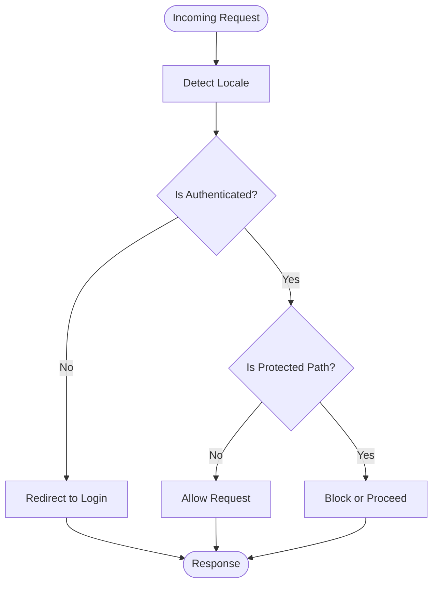
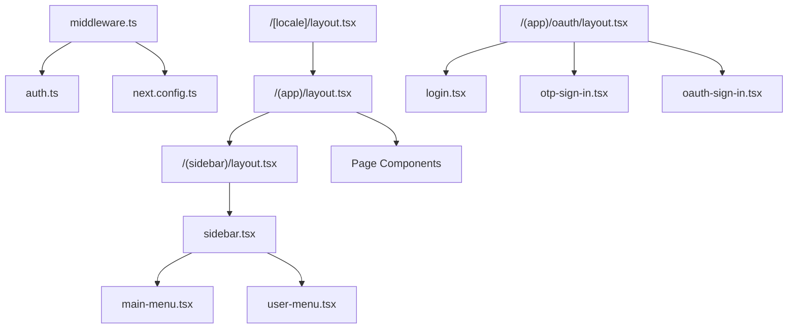

# Routing & Navigation

<cite>
**Referenced Files in This Document**
- [middleware.ts](file://apps/dashboard/src/middleware.ts)
- [layout.tsx](file://apps/dashboard/src/app/[locale]/layout.tsx)
- [layout.tsx](file://apps/dashboard/src/app/[locale]/(app)/(sidebar)/layout.tsx)
- [layout.tsx](file://apps/dashboard/src/app/[locale]/(app)/(sidebar)/account/layout.tsx)
- [layout.tsx](file://apps/dashboard/src/app/[locale]/(app)/(sidebar)/settings/layout.tsx)
- [layout.tsx](file://apps/dashboard/src/app/[locale]/(app)/oauth/layout.tsx)
- [layout.tsx](file://apps/dashboard/src/app/[locale]/(app)/layout.tsx)
- [global-error.tsx](file://apps/dashboard/src/app/global-error.tsx)
- [next.config.ts](file://apps/dashboard/next.config.ts)
- [package.json](file://apps/dashboard/package.json)
- [auth.ts](file://apps/dashboard/src/utils/auth.ts)
- [safe-action.ts](file://apps/dashboard/src/actions/safe-action.ts)
- [revalidate-action.ts](file://apps/dashboard/src/actions/revalidate-action.ts)
- [sidebar.tsx](file://apps/dashboard/src/components/sidebar.tsx)
- [main-menu.tsx](file://apps/dashboard/src/components/main-menu.tsx)
- [desktop-header.tsx](file://apps/dashboard/src/components/desktop-header.tsx)
- [mobile-menu.tsx](file://apps/dashboard/src/components/mobile-menu.tsx)
- [user-menu.tsx](file://apps/dashboard/src/components/user-menu.tsx)
- [login.tsx](file://apps/dashboard/src/components/login.tsx)
- [oauth-sign-in.tsx](file://apps/dashboard/src/components/oauth-sign-in.tsx)
- [otp-sign-in.tsx](file://apps/dashboard/src/components/otp-sign-in.tsx)
- [sign-out.tsx](file://apps/dashboard/src/components/sign-out.tsx)
- [unified-app.tsx](file://apps/dashboard/src/components/unified-app.tsx)
- [theme-provider.tsx](file://apps/dashboard/src/components/theme-provider.tsx)
- [locale-settings.tsx](file://apps/dashboard/src/components/locale-settings.tsx)
- [timezone-detector.tsx](file://apps/dashboard/src/components/timezone-detector.tsx)
- [instrumentation.ts](file://apps/dashboard/src/instrumentation.ts)
- [instrumentation-client.ts](file://apps/dashboard/src/instrumentation-client.ts)
</cite>

## Table of Contents
1. [Introduction](#introduction)
2. [Project Structure](#project-structure)
3. [Core Components](#core-components)
4. [Architecture Overview](#architecture-overview)
5. [Detailed Component Analysis](#detailed-component-analysis)
6. [Dependency Analysis](#dependency-analysis)
7. [Performance Considerations](#performance-considerations)
8. [Troubleshooting Guide](#troubleshooting-guide)
9. [Conclusion](#conclusion)
10. [Appendices](#appendices)

## Introduction
This document explains the Next.js 16 App Router implementation in the Faworra Dashboard, focusing on nested routing, dynamic routes with locale handling, route groups for layout organization, sidebar navigation, protected routes, authentication flow, and middleware configuration. It also covers navigation strategies, route patterns, parameter handling, and the relationships between route groups.

## Project Structure
The dashboard application uses Next.js App Router conventions with:
- Dynamic locale route segments under [locale]
- Route groups to organize layouts without affecting URLs
- Nested layouts for sidebar and app-wide shells
- Middleware for locale detection, authentication checks, and redirects
- Global error handling and instrumentation

Key directories and files:
- apps/dashboard/src/app/[locale]/...: Locale-aware pages and nested layouts
- apps/dashboard/src/app/[locale]/(app): Shared app shell with sidebar group
- apps/dashboard/src/app/[locale]/(app)/(sidebar): Sidebar layout group
- apps/dashboard/src/app/[locale]/(app)/oauth: OAuth-related pages
- apps/dashboard/src/middleware.ts: Middleware for locale and auth checks
- apps/dashboard/src/components/*: UI building blocks including sidebar and menus
- apps/dashboard/next.config.ts: Next.js configuration

**Diagram sources**
- [layout.tsx](file://apps/dashboard/src/app/[locale]/layout.tsx#L1-L200)
- [layout.tsx](file://apps/dashboard/src/app/[locale]/(app)/(sidebar)/layout.tsx#L1-L200)
- [layout.tsx](file://apps/dashboard/src/app/[locale]/(app)/oauth/layout.tsx#L1-L200)
- [global-error.tsx](file://apps/dashboard/src/app/global-error.tsx#L1-L200)

**Section sources**
- [layout.tsx](file://apps/dashboard/src/app/[locale]/layout.tsx#L1-L200)
- [layout.tsx](file://apps/dashboard/src/app/[locale]/(app)/(sidebar)/layout.tsx#L1-L200)
- [layout.tsx](file://apps/dashboard/src/app/[locale]/(app)/oauth/layout.tsx#L1-L200)
- [global-error.tsx](file://apps/dashboard/src/app/global-error.tsx#L1-L200)

## Core Components
- Locale-aware root layout: Defines the [locale] dynamic segment and sets up shared providers and error boundaries.
- App shell layout: Wraps page content with a consistent header, sidebar, and footer structure.
- Sidebar layout: Organizes navigation items and user controls within a persistent sidebar.
- OAuth layout: Provides a dedicated layout for OAuth flows.
- Middleware: Handles locale detection, authentication checks, and redirect logic.
- Protected routes: Enforced via middleware guards and action wrappers.
- Authentication utilities: Helpers for session checks, sign-in/out, and OTP verification.
- Navigation components: Sidebar, main menu, desktop header, mobile menu, and user menu.

**Section sources**
- [layout.tsx](file://apps/dashboard/src/app/[locale]/layout.tsx#L1-L200)
- [layout.tsx](file://apps/dashboard/src/app/[locale]/(app)/(sidebar)/layout.tsx#L1-L200)
- [layout.tsx](file://apps/dashboard/src/app/[locale]/(app)/oauth/layout.tsx#L1-L200)
- [middleware.ts](file://apps/dashboard/src/middleware.ts#L1-L200)
- [auth.ts](file://apps/dashboard/src/utils/auth.ts#L1-L200)
- [safe-action.ts](file://apps/dashboard/src/actions/safe-action.ts#L1-L200)
- [sidebar.tsx](file://apps/dashboard/src/components/sidebar.tsx#L1-L200)
- [main-menu.tsx](file://apps/dashboard/src/components/main-menu.tsx#L1-L200)
- [desktop-header.tsx](file://apps/dashboard/src/components/desktop-header.tsx#L1-L200)
- [mobile-menu.tsx](file://apps/dashboard/src/components/mobile-menu.tsx#L1-L200)
- [user-menu.tsx](file://apps/dashboard/src/components/user-menu.tsx#L1-L200)

## Architecture Overview
The routing architecture leverages:
- Dynamic route segments for locale handling
- Route groups to modularize layout hierarchies
- Middleware for cross-cutting concerns (locale, auth)
- Action wrappers for protected operations
- Centralized navigation components

**Diagram sources**
- [middleware.ts](file://apps/dashboard/src/middleware.ts#L1-L200)
- [layout.tsx](file://apps/dashboard/src/app/[locale]/layout.tsx#L1-L200)
- [layout.tsx](file://apps/dashboard/src/app/[locale]/(app)/(sidebar)/layout.tsx#L1-L200)
- [layout.tsx](file://apps/dashboard/src/app/[locale]/(app)/layout.tsx#L1-L200)

## Detailed Component Analysis

### Locale Handling and Dynamic Routes
- The [locale] dynamic segment enables locale-aware routing without altering visible URLs.
- The root layout initializes providers and error boundaries for the locale context.
- Next.js configuration supports internationalized routing and static generation strategies.

Route patterns and examples:
- Root path: /[locale]/
- Nested pages: /[locale]/dashboard, /[locale]/transactions
- OAuth pages: /[locale]/oauth/signin
- Account settings: /[locale]/account/settings

Parameter handling:
- Locale is extracted from the URL and passed to providers and i18n utilities.
- Dynamic parameters for resource IDs are handled per page route.

**Section sources**
- [layout.tsx](file://apps/dashboard/src/app/[locale]/layout.tsx#L1-L200)
- [next.config.ts](file://apps/dashboard/next.config.ts#L1-L200)

### Route Groups for Layout Organization
Route groups are used to organize layouts without changing URLs:
- (app): Shared app shell with header, sidebar, and page content area
- (sidebar): Sidebar-specific layout for navigation and user controls
- oauth: Dedicated layout for OAuth-related pages

Group relationships:
- (app) contains (sidebar) and page routes
- (sidebar) renders the persistent sidebar and navigation
- oauth layout isolates authentication flows

**Diagram sources**
- [layout.tsx](file://apps/dashboard/src/app/[locale]/layout.tsx#L1-L200)
- [layout.tsx](file://apps/dashboard/src/app/[locale]/(app)/(sidebar)/layout.tsx#L1-L200)
- [layout.tsx](file://apps/dashboard/src/app/[locale]/(app)/oauth/layout.tsx#L1-L200)

**Section sources**
- [layout.tsx](file://apps/dashboard/src/app/[locale]/layout.tsx#L1-L200)
- [layout.tsx](file://apps/dashboard/src/app/[locale]/(app)/(sidebar)/layout.tsx#L1-L200)
- [layout.tsx](file://apps/dashboard/src/app/[locale]/(app)/oauth/layout.tsx#L1-L200)

### Sidebar Navigation System
The sidebar integrates:
- Main menu for primary navigation items
- User menu for profile and logout actions
- Responsive desktop and mobile menu components
- Unified app wrapper for consistent styling

Navigation strategies:
- Programmatic navigation via router.push and navigation helpers
- Persistent sidebar across pages within the app shell
- Mobile-friendly drawer with responsive breakpoints

**Diagram sources**
- [sidebar.tsx](file://apps/dashboard/src/components/sidebar.tsx#L1-L200)
- [main-menu.tsx](file://apps/dashboard/src/components/main-menu.tsx#L1-L200)
- [user-menu.tsx](file://apps/dashboard/src/components/user-menu.tsx#L1-L200)
- [desktop-header.tsx](file://apps/dashboard/src/components/desktop-header.tsx#L1-L200)
- [mobile-menu.tsx](file://apps/dashboard/src/components/mobile-menu.tsx#L1-L200)

**Section sources**
- [sidebar.tsx](file://apps/dashboard/src/components/sidebar.tsx#L1-L200)
- [main-menu.tsx](file://apps/dashboard/src/components/main-menu.tsx#L1-L200)
- [user-menu.tsx](file://apps/dashboard/src/components/user-menu.tsx#L1-L200)
- [desktop-header.tsx](file://apps/dashboard/src/components/desktop-header.tsx#L1-L200)
- [mobile-menu.tsx](file://apps/dashboard/src/components/mobile-menu.tsx#L1-L200)

### Protected Routes and Authentication Flow
Protected routes are enforced through:
- Middleware checks for authentication and locale validity
- Safe action wrappers for protected server actions
- Authentication components for sign-in, OTP verification, and OAuth

Authentication flow:
- Initial sign-in via email/password or OAuth
- Optional OTP verification for MFA
- Session persistence and automatic revalidation

**Diagram sources**
- [middleware.ts](file://apps/dashboard/src/middleware.ts#L1-L200)
- [auth.ts](file://apps/dashboard/src/utils/auth.ts#L1-L200)
- [safe-action.ts](file://apps/dashboard/src/actions/safe-action.ts#L1-L200)
- [login.tsx](file://apps/dashboard/src/components/login.tsx#L1-L200)
- [oauth-sign-in.tsx](file://apps/dashboard/src/components/oauth-sign-in.tsx#L1-L200)
- [otp-sign-in.tsx](file://apps/dashboard/src/components/otp-sign-in.tsx#L1-L200)

**Section sources**
- [middleware.ts](file://apps/dashboard/src/middleware.ts#L1-L200)
- [auth.ts](file://apps/dashboard/src/utils/auth.ts#L1-L200)
- [safe-action.ts](file://apps/dashboard/src/actions/safe-action.ts#L1-L200)
- [login.tsx](file://apps/dashboard/src/components/login.tsx#L1-L200)
- [oauth-sign-in.tsx](file://apps/dashboard/src/components/oauth-sign-in.tsx#L1-L200)
- [otp-sign-in.tsx](file://apps/dashboard/src/components/otp-sign-in.tsx#L1-L200)
- [sign-out.tsx](file://apps/dashboard/src/components/sign-out.tsx#L1-L200)

### Middleware Configuration
Middleware responsibilities:
- Locale detection and redirect logic
- Authentication checks for protected routes
- Redirect handling for login, dashboard, and OAuth flows
- Static asset bypass and trusted host validation

Middleware flow:
- Parse incoming URL and extract locale
- Validate authentication for protected paths
- Redirect to appropriate locale or login page
- Allow or block requests based on rules

**Diagram sources**
- [middleware.ts](file://apps/dashboard/src/middleware.ts#L1-L200)

**Section sources**
- [middleware.ts](file://apps/dashboard/src/middleware.ts#L1-L200)

### Navigation Strategies and Examples
- Programmatic navigation: Use router.push with locale-aware paths
- Parameterized routes: Pass IDs and filters as URL segments or query parameters
- Conditional navigation: Redirect based on authentication state and permissions
- Revalidation: Trigger revalidation actions to refresh cached data

Examples of route patterns:
- Dashboard: /[locale]/dashboard
- Transactions: /[locale]/transactions
- Customers: /[locale]/customers
- Invoices: /[locale]/invoices
- Documents: /[locale]/documents
- Inbox: /[locale]/inbox
- Tracker: /[locale]/tracker
- Widgets: /[locale]/widgets
- Account Settings: /[locale]/account/settings
- OAuth Sign-In: /[locale]/oauth/signin

**Section sources**
- [layout.tsx](file://apps/dashboard/src/app/[locale]/layout.tsx#L1-L200)
- [layout.tsx](file://apps/dashboard/src/app/[locale]/(app)/(sidebar)/account/layout.tsx#L1-L200)
- [layout.tsx](file://apps/dashboard/src/app/[locale]/(app)/(sidebar)/settings/layout.tsx#L1-L200)
- [revalidate-action.ts](file://apps/dashboard/src/actions/revalidate-action.ts#L1-L200)

## Dependency Analysis
Routing dependencies and relationships:
- Root layout depends on providers and error boundaries
- App shell layout depends on sidebar layout and page components
- Middleware depends on authentication utilities and configuration
- Navigation components depend on routing helpers and state stores
- OAuth layout depends on authentication components and safe actions

**Diagram sources**
- [middleware.ts](file://apps/dashboard/src/middleware.ts#L1-L200)
- [auth.ts](file://apps/dashboard/src/utils/auth.ts#L1-L200)
- [layout.tsx](file://apps/dashboard/src/app/[locale]/layout.tsx#L1-L200)
- [layout.tsx](file://apps/dashboard/src/app/[locale]/(app)/layout.tsx#L1-L200)
- [layout.tsx](file://apps/dashboard/src/app/[locale]/(app)/(sidebar)/layout.tsx#L1-L200)
- [sidebar.tsx](file://apps/dashboard/src/components/sidebar.tsx#L1-L200)
- [main-menu.tsx](file://apps/dashboard/src/components/main-menu.tsx#L1-L200)
- [user-menu.tsx](file://apps/dashboard/src/components/user-menu.tsx#L1-L200)
- [layout.tsx](file://apps/dashboard/src/app/[locale]/(app)/oauth/layout.tsx#L1-L200)
- [login.tsx](file://apps/dashboard/src/components/login.tsx#L1-L200)
- [otp-sign-in.tsx](file://apps/dashboard/src/components/otp-sign-in.tsx#L1-L200)
- [oauth-sign-in.tsx](file://apps/dashboard/src/components/oauth-sign-in.tsx#L1-L200)

**Section sources**
- [middleware.ts](file://apps/dashboard/src/middleware.ts#L1-L200)
- [auth.ts](file://apps/dashboard/src/utils/auth.ts#L1-L200)
- [layout.tsx](file://apps/dashboard/src/app/[locale]/layout.tsx#L1-L200)
- [layout.tsx](file://apps/dashboard/src/app/[locale]/(app)/layout.tsx#L1-L200)
- [layout.tsx](file://apps/dashboard/src/app/[locale]/(app)/(sidebar)/layout.tsx#L1-L200)
- [layout.tsx](file://apps/dashboard/src/app/[locale]/(app)/oauth/layout.tsx#L1-L200)
- [sidebar.tsx](file://apps/dashboard/src/components/sidebar.tsx#L1-L200)
- [main-menu.tsx](file://apps/dashboard/src/components/main-menu.tsx#L1-L200)
- [user-menu.tsx](file://apps/dashboard/src/components/user-menu.tsx#L1-L200)
- [login.tsx](file://apps/dashboard/src/components/login.tsx#L1-L200)
- [otp-sign-in.tsx](file://apps/dashboard/src/components/otp-sign-in.tsx#L1-L200)
- [oauth-sign-in.tsx](file://apps/dashboard/src/components/oauth-sign-in.tsx#L1-L200)

## Performance Considerations
- Use route groups to avoid unnecessary re-renders across pages
- Leverage safe actions for protected operations to minimize client-server round trips
- Implement revalidation actions to keep cached data fresh without full page reloads
- Optimize navigation components with memoization and lazy loading
- Utilize Next.js static generation and ISR for locale-aware pages where appropriate

## Troubleshooting Guide
Common issues and resolutions:
- Locale mismatch: Verify middleware locale detection and redirect logic
- Authentication failures: Check session validation and safe action wrappers
- Navigation errors: Confirm route patterns and parameter handling
- Middleware conflicts: Review redirect rules and trusted hosts
- Global errors: Inspect global error boundary and instrumentation

**Section sources**
- [middleware.ts](file://apps/dashboard/src/middleware.ts#L1-L200)
- [global-error.tsx](file://apps/dashboard/src/app/global-error.tsx#L1-L200)
- [instrumentation.ts](file://apps/dashboard/src/instrumentation.ts#L1-L200)
- [instrumentation-client.ts](file://apps/dashboard/src/instrumentation-client.ts#L1-L200)

## Conclusion
The Faworra Dashboard employs Next.js 16 App Router with dynamic locale segments, route groups for layout organization, and middleware-driven locale and authentication enforcement. The sidebar navigation system provides a consistent user experience across pages, while protected routes and safe actions ensure secure and reliable interactions. The architecture balances modularity, maintainability, and performance through strategic use of routing primitives and middleware.

## Appendices
- Additional configuration and instrumentation files support monitoring and analytics across the routing layer.

**Section sources**
- [next.config.ts](file://apps/dashboard/next.config.ts#L1-L200)
- [package.json](file://apps/dashboard/package.json#L1-L200)
- [theme-provider.tsx](file://apps/dashboard/src/components/theme-provider.tsx#L1-L200)
- [locale-settings.tsx](file://apps/dashboard/src/components/locale-settings.tsx#L1-L200)
- [timezone-detector.tsx](file://apps/dashboard/src/components/timezone-detector.tsx#L1-L200)
- [unified-app.tsx](file://apps/dashboard/src/components/unified-app.tsx#L1-L200)