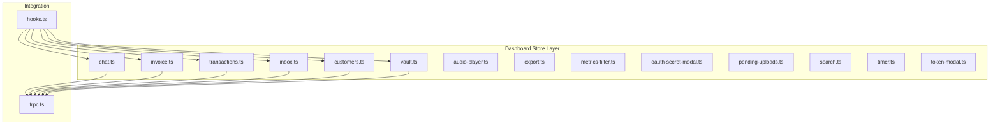
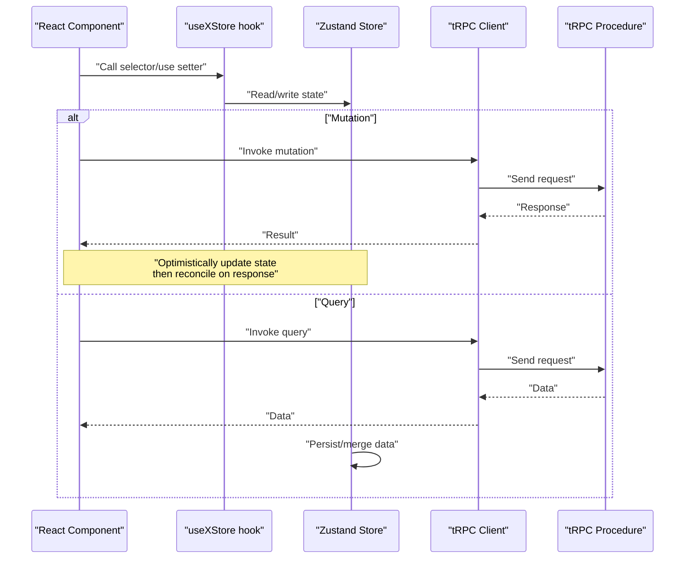
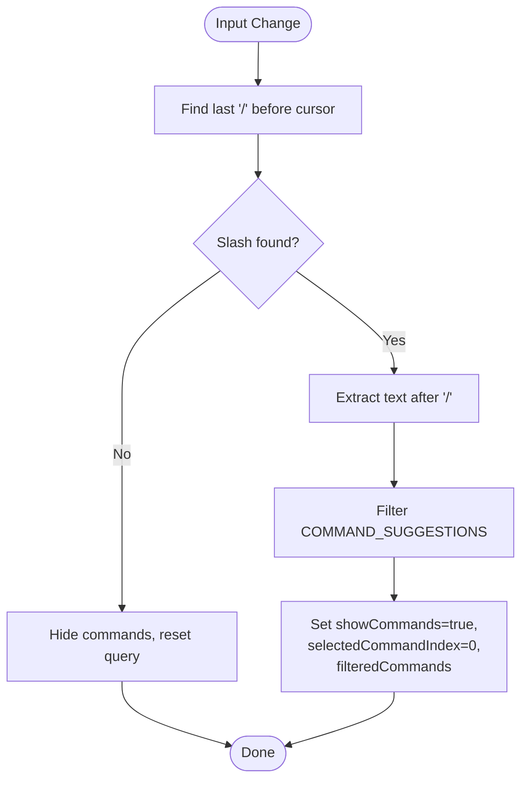
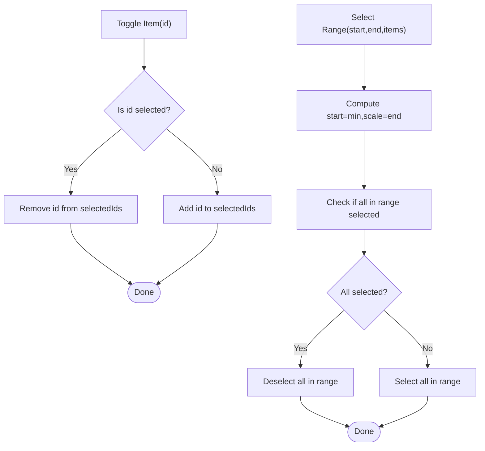
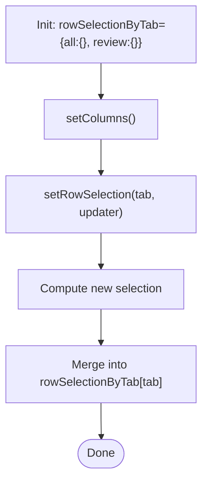
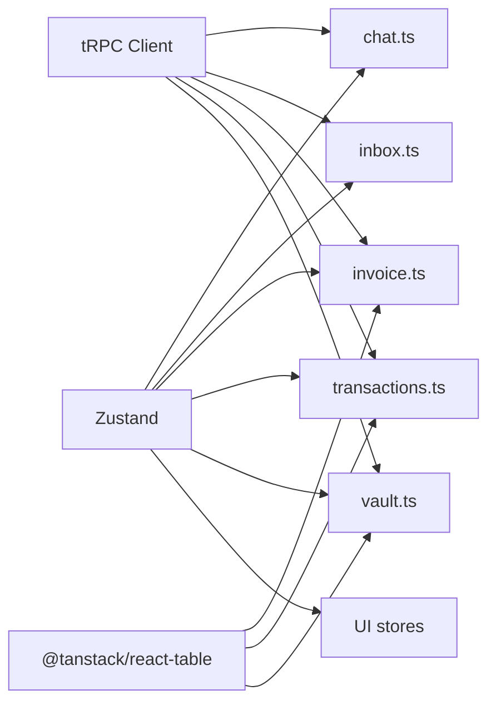

# State Management

<cite>
**Referenced Files in This Document**
- [chat.ts](file://midday/apps/dashboard/src/store/chat.ts)
- [customers.ts](file://midday/apps/dashboard/src/store/customers.ts)
- [inbox.ts](file://midday/apps/dashboard/src/store/inbox.ts)
- [invoice.ts](file://midday/apps/dashboard/src/store/invoice.ts)
- [transactions.ts](file://midday/apps/dashboard/src/store/transactions.ts)
- [vault.ts](file://midday/apps/dashboard/src/store/vault.ts)
- [audio-player.ts](file://midday/apps/dashboard/src/store/audio-player.ts)
- [export.ts](file://midday/apps/dashboard/src/store/export.ts)
- [metrics-filter.ts](file://midday/apps/dashboard/src/store/metrics-filter.ts)
- [oauth-secret-modal.ts](file://midday/apps/dashboard/src/store/oauth-secret-modal.ts)
- [pending-uploads.ts](file://midday/apps/dashboard/src/store/pending-uploads.ts)
- [search.ts](file://midday/apps/dashboard/src/store/search.ts)
- [timer.ts](file://midday/apps/dashboard/src/store/timer.ts)
- [token-modal.ts](file://midday/apps/dashboard/src/store/token-modal.ts)
- [trpc.ts](file://midday/apps/dashboard/src/trpc/trpc.ts)
- [hooks.ts](file://midday/apps/dashboard/src/hooks/hooks.ts)
</cite>

## Table of Contents
1. [Introduction](#introduction)
2. [Project Structure](#project-structure)
3. [Core Components](#core-components)
4. [Architecture Overview](#architecture-overview)
5. [Detailed Component Analysis](#detailed-component-analysis)
6. [Dependency Analysis](#dependency-analysis)
7. [Performance Considerations](#performance-considerations)
8. [Troubleshooting Guide](#troubleshooting-guide)
9. [Conclusion](#conclusion)
10. [Appendices](#appendices)

## Introduction
This document describes the Zustand-based state management system used in the Faworra Dashboard. It covers store architecture, individual stores for chat, customers, inbox, invoices, transactions, and vault, and explains how they integrate with tRPC queries, optimistic updates, and real-time updates. It also documents persistence strategies, async data loading patterns, subscription usage, state composition, performance optimizations, debugging approaches, and best practices.

## Project Structure
The state management layer is organized under the dashboard’s store directory. Stores are thin, focused slices of state powered by Zustand. They encapsulate UI state, selection state, and transient flags. Some stores are dedicated to UI concerns (e.g., audio player, search, timer), while others coordinate table/column state and selection across features like invoices and transactions.

**Diagram sources**
- [chat.ts](file://midday/apps/dashboard/src/store/chat.ts#L1-L567)
- [customers.ts](file://midday/apps/dashboard/src/store/customers.ts#L1-L13)
- [inbox.ts](file://midday/apps/dashboard/src/store/inbox.ts#L1-L64)
- [invoice.ts](file://midday/apps/dashboard/src/store/invoice.ts#L1-L23)
- [transactions.ts](file://midday/apps/dashboard/src/store/transactions.ts#L1-L66)
- [vault.ts](file://midday/apps/dashboard/src/store/vault.ts#L1-L19)
- [audio-player.ts](file://midday/apps/dashboard/src/store/audio-player.ts#L1-L200)
- [export.ts](file://midday/apps/dashboard/src/store/export.ts#L1-L200)
- [metrics-filter.ts](file://midday/apps/dashboard/src/store/metrics-filter.ts#L1-L200)
- [oauth-secret-modal.ts](file://midday/apps/dashboard/src/store/oauth-secret-modal.ts#L1-L200)
- [pending-uploads.ts](file://midday/apps/dashboard/src/store/pending-uploads.ts#L1-L200)
- [search.ts](file://midday/apps/dashboard/src/store/search.ts#L1-L200)
- [timer.ts](file://midday/apps/dashboard/src/store/timer.ts#L1-L200)
- [token-modal.ts](file://midday/apps/dashboard/src/store/token-modal.ts#L1-L200)
- [trpc.ts](file://midday/apps/dashboard/src/trpc/trpc.ts#L1-L200)
- [hooks.ts](file://midday/apps/dashboard/src/hooks/hooks.ts#L1-L200)

**Section sources**
- [chat.ts](file://midday/apps/dashboard/src/store/chat.ts#L1-L567)
- [customers.ts](file://midday/apps/dashboard/src/store/customers.ts#L1-L13)
- [inbox.ts](file://midday/apps/dashboard/src/store/inbox.ts#L1-L64)
- [invoice.ts](file://midday/apps/dashboard/src/store/invoice.ts#L1-L23)
- [transactions.ts](file://midday/apps/dashboard/src/store/transactions.ts#L1-L66)
- [vault.ts](file://midday/apps/dashboard/src/store/vault.ts#L1-L19)
- [audio-player.ts](file://midday/apps/dashboard/src/store/audio-player.ts#L1-L200)
- [export.ts](file://midday/apps/dashboard/src/store/export.ts#L1-L200)
- [metrics-filter.ts](file://midday/apps/dashboard/src/store/metrics-filter.ts#L1-L200)
- [oauth-secret-modal.ts](file://midday/apps/dashboard/src/store/oauth-secret-modal.ts#L1-L200)
- [pending-uploads.ts](file://midday/apps/dashboard/src/store/pending-uploads.ts#L1-L200)
- [search.ts](file://midday/apps/dashboard/src/store/search.ts#L1-L200)
- [timer.ts](file://midday/apps/dashboard/src/store/timer.ts#L1-L200)
- [token-modal.ts](file://midday/apps/dashboard/src/store/token-modal.ts#L1-L200)
- [trpc.ts](file://midday/apps/dashboard/src/trpc/trpc.ts#L1-L200)
- [hooks.ts](file://midday/apps/dashboard/src/hooks/hooks.ts#L1-L200)

## Core Components
- Chat store: Manages input, command suggestions, recording, and upload states for an AI assistant-like experience.
- Customers store: Holds column configuration for the customer table.
- Inbox store: Manages multi-select state and keyboard-driven selection for inbox items.
- Invoice store: Holds column configuration and row selection state for invoices.
- Transactions store: Holds per-tab row selection (all/review), selection utilities, and selection indices.
- Vault store: Holds row selection state for document vault.
- UI/utility stores: Audio player, export, metrics filter, OAuth secret modal, pending uploads, search, timer, token modal.

These stores are thin and cohesive around a single responsibility. They expose setters and computed helpers via Zustand’s functional updates and selectors.

**Section sources**
- [chat.ts](file://midday/apps/dashboard/src/store/chat.ts#L372-L566)
- [customers.ts](file://midday/apps/dashboard/src/store/customers.ts#L4-L12)
- [inbox.ts](file://midday/apps/dashboard/src/store/inbox.ts#L3-L63)
- [invoice.ts](file://midday/apps/dashboard/src/store/invoice.ts#L4-L22)
- [transactions.ts](file://midday/apps/dashboard/src/store/transactions.ts#L11-L65)
- [vault.ts](file://midday/apps/dashboard/src/store/vault.ts#L4-L18)

## Architecture Overview
Zustand stores are consumed by React components through hooks. tRPC is used for server queries and mutations. Stores can be combined to compose UI features (e.g., invoice selection and table columns). Persistence is handled by local storage or URL state depending on the store. Optimistic updates are applied immediately in the store and later reconciled with server responses.

**Diagram sources**
- [hooks.ts](file://midday/apps/dashboard/src/hooks/hooks.ts#L1-L200)
- [trpc.ts](file://midday/apps/dashboard/src/trpc/trpc.ts#L1-L200)
- [chat.ts](file://midday/apps/dashboard/src/store/chat.ts#L415-L566)
- [transactions.ts](file://midday/apps/dashboard/src/store/transactions.ts#L32-L65)
- [invoice.ts](file://midday/apps/dashboard/src/store/invoice.ts#L11-L22)

## Detailed Component Analysis

### Chat Store
The chat store manages:
- Text input and cursor position
- Web search flag
- Upload and recording state
- Command suggestions triggered by typing “/”
- Keyboard navigation and selection of suggestions
- Replacement of typed command fragments with full suggestions

Key behaviors:
- Command filtering is performed on-the-fly based on typed text after the last “/”.
- Selection uses arrow keys and Enter/Escape.
- Input change handler computes text before and after the cursor to replace command placeholders.

**Diagram sources**
- [chat.ts](file://midday/apps/dashboard/src/store/chat.ts#L442-L481)

Usage patterns:
- Subscribe to input and command visibility via selectors.
- Use setters to toggle recording/upload flags.
- Apply optimistic updates when simulating AI responses or command execution.

**Section sources**
- [chat.ts](file://midday/apps/dashboard/src/store/chat.ts#L1-L567)

### Customers Store
Purpose:
- Maintain column configuration for the customer table.
- Provide a setter to update columns.

Composition:
- Integrates with table libraries to persist visible columns and ordering.

**Section sources**
- [customers.ts](file://midday/apps/dashboard/src/store/customers.ts#L1-L13)

### Inbox Store
Purpose:
- Manage multi-selection state for inbox items.
- Support toggling single items and selecting ranges with shift-click.
- Track the last clicked index to support range selection.

Selection logic:
- Toggle selection by ID.
- Select a range by computing min/max indices and toggling all items in between.
- Clear selection resets both selected IDs and last clicked index.

**Diagram sources**
- [inbox.ts](file://midday/apps/dashboard/src/store/inbox.ts#L21-L62)

**Section sources**
- [inbox.ts](file://midday/apps/dashboard/src/store/inbox.ts#L1-L64)

### Invoice Store
Purpose:
- Hold column configuration for the invoice table.
- Manage row selection state for the invoice table.

Selection pattern:
- Accepts an updater function or static value to update selection.
- Supports optimistic selection changes before server reconciliation.

**Section sources**
- [invoice.ts](file://midday/apps/dashboard/src/store/invoice.ts#L1-L23)

### Transactions Store
Purpose:
- Hold column configuration for the transactions table.
- Manage per-tab row selection (all, review).
- Provide helpers to get/clear selection by tab and track last clicked index.

Selection composition:
- Uses a map keyed by tab to keep selections isolated.
- Exposes helpers to compute derived selection states.

**Diagram sources**
- [transactions.ts](file://midday/apps/dashboard/src/store/transactions.ts#L44-L55)

**Section sources**
- [transactions.ts](file://midday/apps/dashboard/src/store/transactions.ts#L1-L66)

### Vault Store
Purpose:
- Hold row selection state for the document vault table.
- Provide a setter that accepts an updater function or static value.

**Section sources**
- [vault.ts](file://midday/apps/dashboard/src/store/vault.ts#L1-L19)

### UI and Utility Stores
Stores like audio-player, export, metrics-filter, oauth-secret-modal, pending-uploads, search, timer, and token-modal encapsulate transient UI flags and ephemeral state. These are typically persisted to localStorage or URL state to maintain continuity across sessions.

Common patterns:
- Persist flags and small state to localStorage.
- Use URL state for filters and views.
- Apply optimistic toggles for immediate UI feedback.

**Section sources**
- [audio-player.ts](file://midday/apps/dashboard/src/store/audio-player.ts#L1-L200)
- [export.ts](file://midday/apps/dashboard/src/store/export.ts#L1-L200)
- [metrics-filter.ts](file://midday/apps/dashboard/src/store/metrics-filter.ts#L1-L200)
- [oauth-secret-modal.ts](file://midday/apps/dashboard/src/store/oauth-secret-modal.ts#L1-L200)
- [pending-uploads.ts](file://midday/apps/dashboard/src/store/pending-uploads.ts#L1-L200)
- [search.ts](file://midday/apps/dashboard/src/store/search.ts#L1-L200)
- [timer.ts](file://midday/apps/dashboard/src/store/timer.ts#L1-L200)
- [token-modal.ts](file://midday/apps/dashboard/src/store/token-modal.ts#L1-L200)

## Dependency Analysis
Stores are loosely coupled and primarily depend on:
- Zustand for state creation and subscriptions
- tRPC client for async data operations
- TanStack Table for column and selection utilities

**Diagram sources**
- [chat.ts](file://midday/apps/dashboard/src/store/chat.ts#L1-L567)
- [inbox.ts](file://midday/apps/dashboard/src/store/inbox.ts#L1-L64)
- [invoice.ts](file://midday/apps/dashboard/src/store/invoice.ts#L1-L23)
- [transactions.ts](file://midday/apps/dashboard/src/store/transactions.ts#L1-L66)
- [vault.ts](file://midday/apps/dashboard/src/store/vault.ts#L1-L19)
- [trpc.ts](file://midday/apps/dashboard/src/trpc/trpc.ts#L1-L200)

**Section sources**
- [chat.ts](file://midday/apps/dashboard/src/store/chat.ts#L1-L567)
- [inbox.ts](file://midday/apps/dashboard/src/store/inbox.ts#L1-L64)
- [invoice.ts](file://midday/apps/dashboard/src/store/invoice.ts#L1-L23)
- [transactions.ts](file://midday/apps/dashboard/src/store/transactions.ts#L1-L66)
- [vault.ts](file://midday/apps/dashboard/src/store/vault.ts#L1-L19)
- [trpc.ts](file://midday/apps/dashboard/src/trpc/trpc.ts#L1-L200)

## Performance Considerations
- Keep stores small and focused to minimize re-renders.
- Use memoized selectors to avoid unnecessary recomputation.
- Prefer functional updates to reduce accidental object churn.
- Debounce heavy computations (e.g., command filtering) to improve responsiveness.
- Persist only essential UI flags to localStorage to avoid bloating storage.
- Batch updates when applying optimistic changes to reduce layout thrashing.

## Troubleshooting Guide
Common issues and remedies:
- Stale UI after mutation: Ensure optimistic updates are followed by server reconciliation and that the store is updated accordingly.
- Selection conflicts: Verify per-tab selection isolation and that last clicked index is tracked correctly for range selection.
- Command suggestions not appearing: Confirm the “/” trigger logic and that filteredCommands is being recomputed on input changes.
- tRPC query not updating store: Check that the query result is merged into the store and that persistence is applied after successful fetch.

Debugging tips:
- Log store updates to trace state transitions.
- Use browser devtools to inspect store snapshots.
- Temporarily disable optimistic updates to isolate server-side issues.

**Section sources**
- [chat.ts](file://midday/apps/dashboard/src/store/chat.ts#L442-L481)
- [transactions.ts](file://midday/apps/dashboard/src/store/transactions.ts#L44-L55)
- [inbox.ts](file://midday/apps/dashboard/src/store/inbox.ts#L31-L62)

## Conclusion
The dashboard leverages Zustand to create modular, composable state slices that align with feature boundaries. Stores integrate with tRPC for async data operations, apply optimistic updates for responsive UX, and persist UI flags for continuity. By keeping stores small, using functional updates, and composing selection logic per feature, the system remains maintainable and performant.

## Appendices

### Integration with tRPC Queries
- Use tRPC client to fetch and mutate data.
- Apply optimistic updates immediately in the store.
- Reconcile with server response to normalize state.

**Section sources**
- [trpc.ts](file://midday/apps/dashboard/src/trpc/trpc.ts#L1-L200)

### Subscription Patterns
- Subscribe to specific slices of state via selectors.
- Combine multiple stores for composite UI features (e.g., invoice selection + columns).
- Use hooks to derive computed values from stores.

**Section sources**
- [hooks.ts](file://midday/apps/dashboard/src/hooks/hooks.ts#L1-L200)
- [invoice.ts](file://midday/apps/dashboard/src/store/invoice.ts#L11-L22)
- [transactions.ts](file://midday/apps/dashboard/src/store/transactions.ts#L56-L65)

### State Composition Examples
- Invoice table: combine columns and rowSelection from the invoice store.
- Transactions table: combine columns, per-tab selection, and lastClickedIndex from the transactions store.
- Inbox: combine selectedIds and range selection helpers from the inbox store.

**Section sources**
- [invoice.ts](file://midday/apps/dashboard/src/store/invoice.ts#L11-L22)
- [transactions.ts](file://midday/apps/dashboard/src/store/transactions.ts#L32-L65)
- [inbox.ts](file://midday/apps/dashboard/src/store/inbox.ts#L17-L63)