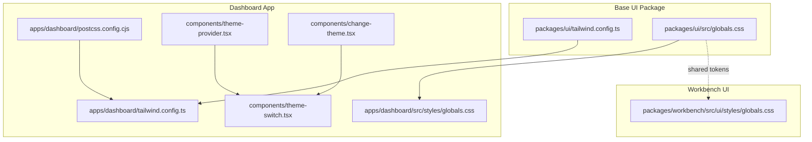
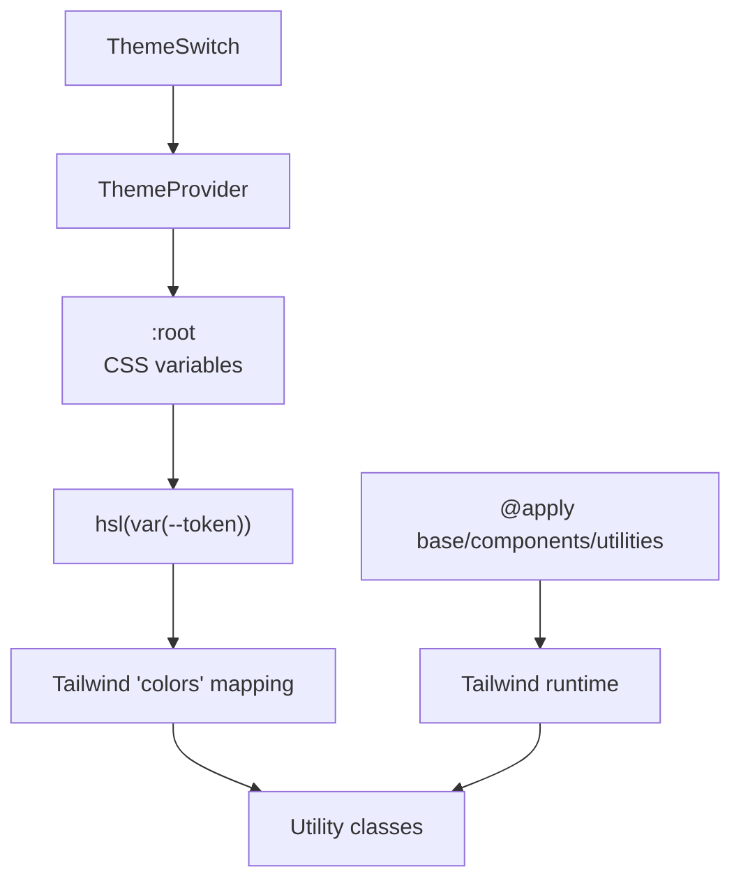
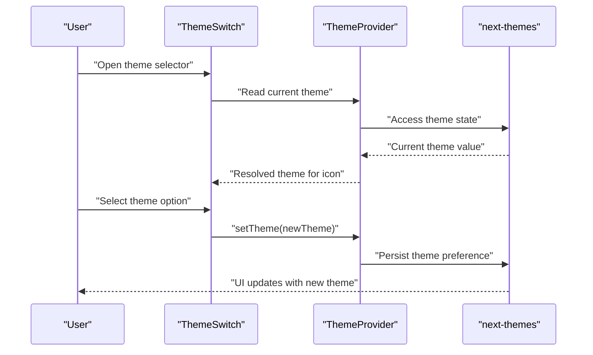
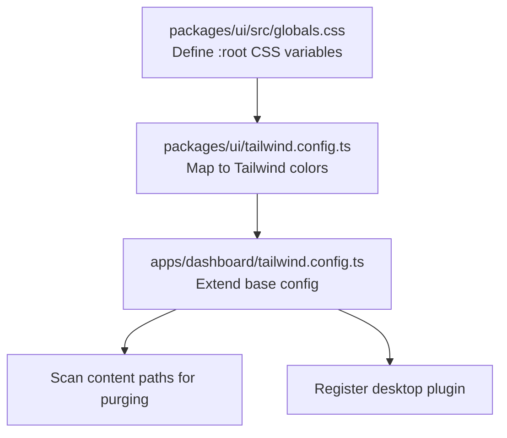
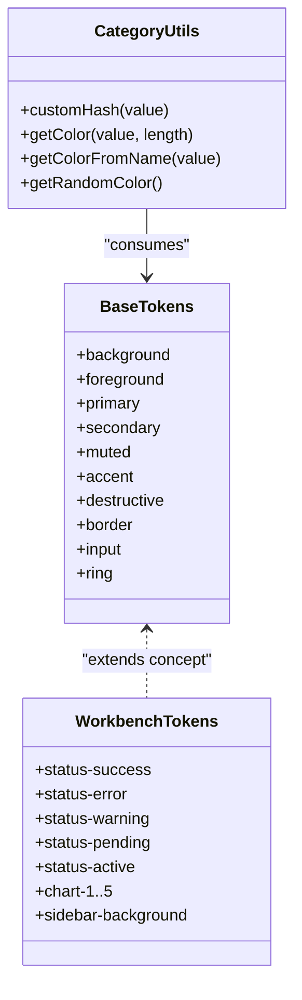
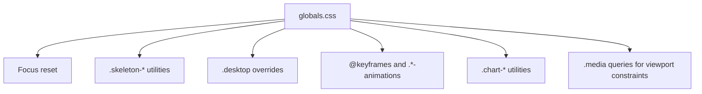
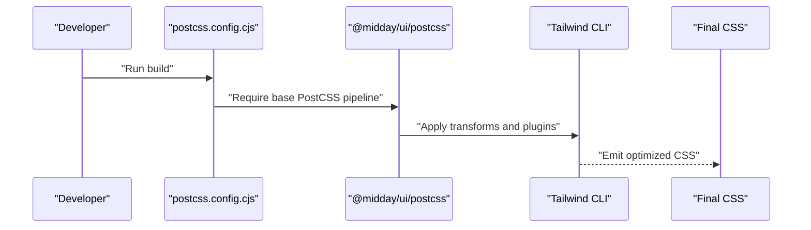
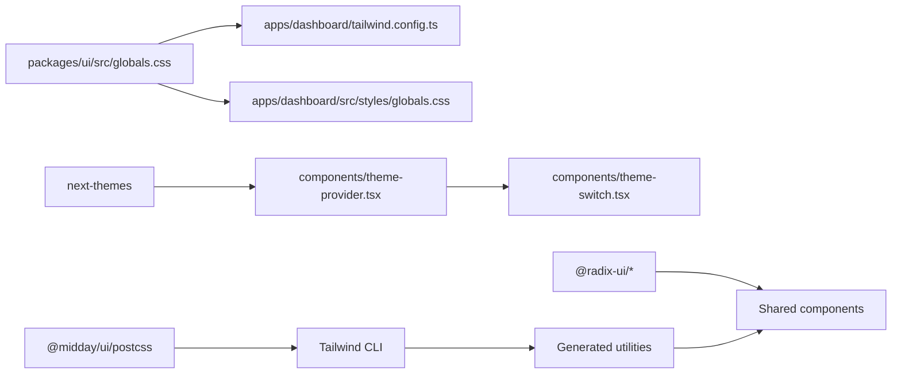

# Theming & Styling

<cite>
**Referenced Files in This Document**
- [tailwind.config.ts](file://midday/apps/dashboard/tailwind.config.ts)
- [postcss.config.cjs](file://midday/apps/dashboard/postcss.config.cjs)
- [globals.css](file://midday/apps/dashboard/src/styles/globals.css)
- [theme-provider.tsx](file://midday/apps/dashboard/src/components/theme-provider.tsx)
- [theme-switch.tsx](file://midday/apps/dashboard/src/components/theme-switch.tsx)
- [change-theme.tsx](file://midday/apps/dashboard/src/components/change-theme.tsx)
- [tailwind.config.ts](file://midday/packages/ui/tailwind.config.ts)
- [globals.css](file://midday/packages/ui/src/globals.css)
- [package.json](file://midday/packages/ui/package.json)
- [globals.css](file://midday/packages/workbench/src/ui/styles/globals.css)
- [categories.ts](file://midday/apps/dashboard/src/utils/categories.ts)
- [color-system.ts](file://midday/packages/categories/src/color-system.ts)
</cite>

## Table of Contents
1. [Introduction](#introduction)
2. [Project Structure](#project-structure)
3. [Core Components](#core-components)
4. [Architecture Overview](#architecture-overview)
5. [Detailed Component Analysis](#detailed-component-analysis)
6. [Dependency Analysis](#dependency-analysis)
7. [Performance Considerations](#performance-considerations)
8. [Troubleshooting Guide](#troubleshooting-guide)
9. [Conclusion](#conclusion)
10. [Appendices](#appendices)

## Introduction
This document explains the theming and styling system in the Faworra Dashboard. It covers Tailwind CSS configuration, theme customization, dark/light mode implementation, the theme provider architecture, color systems, typography scales, component styling patterns, and responsive design. It also provides guidance on building styles, optimization techniques, and browser compatibility considerations.

## Project Structure
The theming system spans three layers:
- Base UI package: Provides shared Tailwind configuration, CSS base layer, and theme tokens.
- Dashboard app: Extends the base configuration, integrates the theme provider, and applies global styles.
- Workbench UI: Defines an alternate theme palette and color tokens for specialized contexts.

**Diagram sources**
- [tailwind.config.ts](file://midday/packages/ui/tailwind.config.ts#L1-L154)
- [globals.css](file://midday/packages/ui/src/globals.css#L1-L179)
- [tailwind.config.ts](file://midday/apps/dashboard/tailwind.config.ts#L1-L14)
- [postcss.config.cjs](file://midday/apps/dashboard/postcss.config.cjs#L1-L3)
- [globals.css](file://midday/apps/dashboard/src/styles/globals.css#L1-L474)
- [theme-provider.tsx](file://midday/apps/dashboard/src/components/theme-provider.tsx#L1-L10)
- [theme-switch.tsx](file://midday/apps/dashboard/src/components/theme-switch.tsx#L1-L74)
- [change-theme.tsx](file://midday/apps/dashboard/src/components/change-theme.tsx#L1-L28)
- [globals.css](file://midday/packages/workbench/src/ui/styles/globals.css#L1-L287)

**Section sources**
- [tailwind.config.ts](file://midday/apps/dashboard/tailwind.config.ts#L1-L14)
- [postcss.config.cjs](file://midday/apps/dashboard/postcss.config.cjs#L1-L3)
- [globals.css](file://midday/apps/dashboard/src/styles/globals.css#L1-L474)
- [theme-provider.tsx](file://midday/apps/dashboard/src/components/theme-provider.tsx#L1-L10)
- [theme-switch.tsx](file://midday/apps/dashboard/src/components/theme-switch.tsx#L1-L74)
- [change-theme.tsx](file://midday/apps/dashboard/src/components/change-theme.tsx#L1-L28)
- [tailwind.config.ts](file://midday/packages/ui/tailwind.config.ts#L1-L154)
- [globals.css](file://midday/packages/ui/src/globals.css#L1-L179)
- [globals.css](file://midday/packages/workbench/src/ui/styles/globals.css#L1-L287)

## Core Components
- Theme provider: Wraps the application with a theme-aware provider to manage light/dark/system modes.
- Theme switch: A UI control to cycle between themes and reflect the resolved theme icon.
- Global CSS: Establishes base styles, skeleton loaders, animations, and desktop-specific overrides.
- Tailwind configuration: Centralizes design tokens, fonts, colors, animations, and responsive breakpoints.

Key responsibilities:
- Theme provider: Delegates theme state to the underlying provider library and exposes a simple wrapper.
- Theme switch: Integrates with the theme hook to read and set the current theme, rendering a compact selector.
- Tailwind base: Defines CSS variables for theme tokens and extends Tailwind with color palettes, radii, and animations.
- Dashboard extension: Extends the base Tailwind config, adds content scanning paths, and registers a desktop plugin.

**Section sources**
- [theme-provider.tsx](file://midday/apps/dashboard/src/components/theme-provider.tsx#L1-L10)
- [theme-switch.tsx](file://midday/apps/dashboard/src/components/theme-switch.tsx#L1-L74)
- [globals.css](file://midday/apps/dashboard/src/styles/globals.css#L1-L474)
- [tailwind.config.ts](file://midday/apps/dashboard/tailwind.config.ts#L1-L14)
- [tailwind.config.ts](file://midday/packages/ui/tailwind.config.ts#L1-L154)

## Architecture Overview
The theming architecture combines CSS custom properties, Tailwind’s design tokens, and a theme provider to deliver a consistent, theme-aware UI.

**Diagram sources**
- [globals.css](file://midday/packages/ui/src/globals.css#L5-L82)
- [tailwind.config.ts](file://midday/packages/ui/tailwind.config.ts#L14-L48)
- [tailwind.config.ts](file://midday/apps/dashboard/tailwind.config.ts#L11-L12)
- [theme-provider.tsx](file://midday/apps/dashboard/src/components/theme-provider.tsx#L7-L9)
- [theme-switch.tsx](file://midday/apps/dashboard/src/components/theme-switch.tsx#L33-L72)
- [postcss.config.cjs](file://midday/apps/dashboard/postcss.config.cjs#L1-L3)

## Detailed Component Analysis

### Theme Provider and Switch
The theme provider wraps the application and the theme switch controls theme selection. The switch reads the current theme and updates it via the theme hook, while displaying an appropriate icon for the resolved theme.

**Diagram sources**
- [theme-provider.tsx](file://midday/apps/dashboard/src/components/theme-provider.tsx#L7-L9)
- [theme-switch.tsx](file://midday/apps/dashboard/src/components/theme-switch.tsx#L33-L72)

Implementation highlights:
- Theme provider is a thin wrapper around the theme provider library.
- Theme switch uses a select component to present available themes and capitalizes the label based on the current value.
- Icons reflect the resolved theme (sun, moon, monitor).

**Section sources**
- [theme-provider.tsx](file://midday/apps/dashboard/src/components/theme-provider.tsx#L1-L10)
- [theme-switch.tsx](file://midday/apps/dashboard/src/components/theme-switch.tsx#L1-L74)
- [change-theme.tsx](file://midday/apps/dashboard/src/components/change-theme.tsx#L1-L28)

### Tailwind Configuration and Design Tokens
The base UI package defines theme tokens as CSS variables and maps them into Tailwind’s color system. The dashboard app extends this configuration and adds content scanning and a desktop plugin.

**Diagram sources**
- [globals.css](file://midday/packages/ui/src/globals.css#L5-L82)
- [tailwind.config.ts](file://midday/packages/ui/tailwind.config.ts#L14-L48)
- [tailwind.config.ts](file://midday/apps/dashboard/tailwind.config.ts#L5-L12)

Key points:
- CSS variables define light and dark tokens for background, foreground, primary, secondary, muted, accent, destructive, borders, input, and ring.
- Tailwind maps these tokens into semantic color groups and supports nested foreground variants per group.
- The dashboard extends the base config, adds content globs for scanning, and registers a desktop plugin.

**Section sources**
- [globals.css](file://midday/packages/ui/src/globals.css#L1-L179)
- [tailwind.config.ts](file://midday/packages/ui/tailwind.config.ts#L1-L154)
- [tailwind.config.ts](file://midday/apps/dashboard/tailwind.config.ts#L1-L14)

### Color Systems and Typography
- Base UI package: Uses a neutral palette with consistent foreground/background relationships and chart-specific tokens.
- Workbench UI: Introduces status and chart color tokens with distinct light/dark variants and explicit font families mapped to Tailwind.
- Dashboard utilities: Provide deterministic color assignment for categories using a hash-based approach.

**Diagram sources**
- [globals.css](file://midday/packages/ui/src/globals.css#L5-L82)
- [globals.css](file://midday/packages/workbench/src/ui/styles/globals.css#L26-L91)
- [categories.ts](file://midday/apps/dashboard/src/utils/categories.ts#L75-L101)

**Section sources**
- [globals.css](file://midday/packages/ui/src/globals.css#L1-L179)
- [globals.css](file://midday/packages/workbench/src/ui/styles/globals.css#L1-L287)
- [categories.ts](file://midday/apps/dashboard/src/utils/categories.ts#L1-L101)
- [color-system.ts](file://midday/packages/categories/src/color-system.ts#L42-L92)

### Global Styles and Responsive Patterns
Global styles establish:
- Base resets and focus outlines.
- Skeleton loaders using border/background tokens and a pulse animation.
- Desktop-specific overrides for windowed app behavior.
- Animations for inputs, overlays, and chart elements.
- Responsive patterns via Tailwind screens and media queries for specific components.

**Diagram sources**
- [globals.css](file://midday/apps/dashboard/src/styles/globals.css#L1-L474)

**Section sources**
- [globals.css](file://midday/apps/dashboard/src/styles/globals.css#L1-L474)

### Build Process and PostCSS Integration
The dashboard delegates PostCSS processing to the base UI package, ensuring consistent transforms and plugins across applications.

**Diagram sources**
- [postcss.config.cjs](file://midday/apps/dashboard/postcss.config.cjs#L1-L3)
- [package.json](file://midday/packages/ui/package.json#L55-L55)

**Section sources**
- [postcss.config.cjs](file://midday/apps/dashboard/postcss.config.cjs#L1-L3)
- [package.json](file://midday/packages/ui/package.json#L1-L179)

## Dependency Analysis
The theming stack depends on:
- Tailwind CSS for utility-first styling and design tokens.
- next-themes for theme persistence and switching.
- PostCSS pipeline from the base UI package for consistent transforms.
- Radix UI primitives and shared components for consistent component styling.

**Diagram sources**
- [tailwind.config.ts](file://midday/packages/ui/tailwind.config.ts#L1-L154)
- [tailwind.config.ts](file://midday/apps/dashboard/tailwind.config.ts#L1-L14)
- [globals.css](file://midday/packages/ui/src/globals.css#L1-L179)
- [globals.css](file://midday/apps/dashboard/src/styles/globals.css#L1-L474)
- [theme-provider.tsx](file://midday/apps/dashboard/src/components/theme-provider.tsx#L1-L10)
- [theme-switch.tsx](file://midday/apps/dashboard/src/components/theme-switch.tsx#L1-L74)
- [postcss.config.cjs](file://midday/apps/dashboard/postcss.config.cjs#L1-L3)
- [package.json](file://midday/packages/ui/package.json#L111-L170)

**Section sources**
- [tailwind.config.ts](file://midday/packages/ui/tailwind.config.ts#L1-L154)
- [tailwind.config.ts](file://midday/apps/dashboard/tailwind.config.ts#L1-L14)
- [globals.css](file://midday/packages/ui/src/globals.css#L1-L179)
- [globals.css](file://midday/apps/dashboard/src/styles/globals.css#L1-L474)
- [theme-provider.tsx](file://midday/apps/dashboard/src/components/theme-provider.tsx#L1-L10)
- [theme-switch.tsx](file://midday/apps/dashboard/src/components/theme-switch.tsx#L1-L74)
- [postcss.config.cjs](file://midday/apps/dashboard/postcss.config.cjs#L1-L3)
- [package.json](file://midday/packages/ui/package.json#L111-L170)

## Performance Considerations
- Purge unused CSS: Tailwind content scanning ensures only used utilities are included in production builds.
- CSS variable usage: Using CSS variables for theme tokens reduces duplication and improves maintainability.
- Minimizing heavy animations: Prefer lightweight animations and avoid excessive keyframes in frequently rendered components.
- Font loading: Ensure font families are efficiently loaded; consider preloading critical font variants.
- PostCSS pipeline: Reuse the base UI PostCSS pipeline to avoid redundant transforms and keep builds fast.

[No sources needed since this section provides general guidance]

## Troubleshooting Guide
Common issues and resolutions:
- Theme not persisting: Verify the theme provider is wrapping the application root and that the theme hook is used within client components.
- Colors not updating: Ensure CSS variables are defined in both light and dark contexts and that Tailwind maps them correctly.
- Utilities not applied: Confirm content paths in the Tailwind configuration include the relevant component directories.
- Desktop app visuals: Review desktop-specific overrides and ensure the desktop variant plugin is registered.

**Section sources**
- [theme-provider.tsx](file://midday/apps/dashboard/src/components/theme-provider.tsx#L1-L10)
- [theme-switch.tsx](file://midday/apps/dashboard/src/components/theme-switch.tsx#L1-L74)
- [tailwind.config.ts](file://midday/apps/dashboard/tailwind.config.ts#L5-L12)
- [globals.css](file://midday/apps/dashboard/src/styles/globals.css#L95-L152)

## Conclusion
The Faworra Dashboard employs a layered theming approach: a shared base UI package defines tokens and Tailwind configuration, the dashboard app extends and applies them, and global styles enforce consistent behavior across components. The theme provider and switch offer a seamless user experience for toggling themes, while CSS variables and Tailwind utilities ensure scalable, maintainable styling.

[No sources needed since this section summarizes without analyzing specific files]

## Appendices

### Customizing Themes
- Extend the base Tailwind configuration in the dashboard app to add new content paths and plugins.
- Override CSS variables in the base UI globals to adjust color palettes or radii.
- Add new tokens in the base UI globals and map them into Tailwind colors for consistent usage across components.

**Section sources**
- [tailwind.config.ts](file://midday/apps/dashboard/tailwind.config.ts#L5-L12)
- [globals.css](file://midday/packages/ui/src/globals.css#L5-L82)
- [tailwind.config.ts](file://midday/packages/ui/tailwind.config.ts#L14-L48)

### Adding New Color Variants
- Define new CSS variables for the desired variant in the base UI globals.
- Map the new tokens into Tailwind colors in the base UI configuration.
- Use the new tokens consistently across components via utility classes.

**Section sources**
- [globals.css](file://midday/packages/ui/src/globals.css#L5-L82)
- [tailwind.config.ts](file://midday/packages/ui/tailwind.config.ts#L14-L48)

### Implementing Consistent Styling Across Components
- Use the base UI components and utilities to ensure consistent spacing, typography, and interactions.
- Leverage the theme tokens to maintain visual coherence in light and dark modes.
- Apply global styles for cross-cutting concerns like skeleton loaders and animations.

**Section sources**
- [globals.css](file://midday/packages/ui/src/globals.css#L84-L92)
- [globals.css](file://midday/apps/dashboard/src/styles/globals.css#L10-L33)

### Responsive Design Breakpoints
- Tailwind screens include a custom breakpoint for very large displays.
- Use responsive utilities alongside media queries for component-specific adjustments.

**Section sources**
- [tailwind.config.ts](file://midday/packages/ui/tailwind.config.ts#L147-L149)
- [globals.css](file://midday/apps/dashboard/src/styles/globals.css#L413-L448)

### Browser Compatibility Considerations
- CSS variables are supported in modern browsers; ensure fallbacks where necessary.
- Tailwind utilities and PostCSS transforms are designed for contemporary environments.
- Test animations and transitions across devices to confirm smooth performance.

[No sources needed since this section provides general guidance]