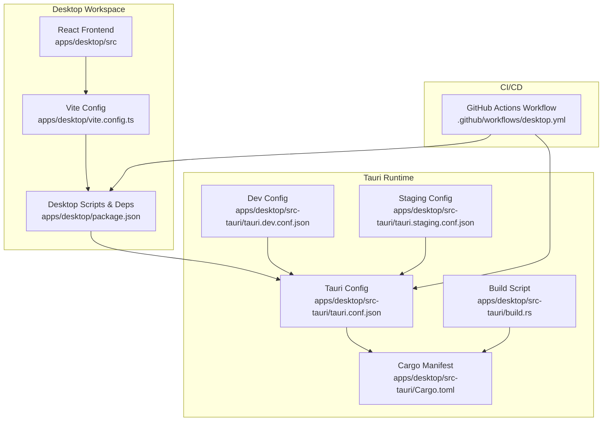
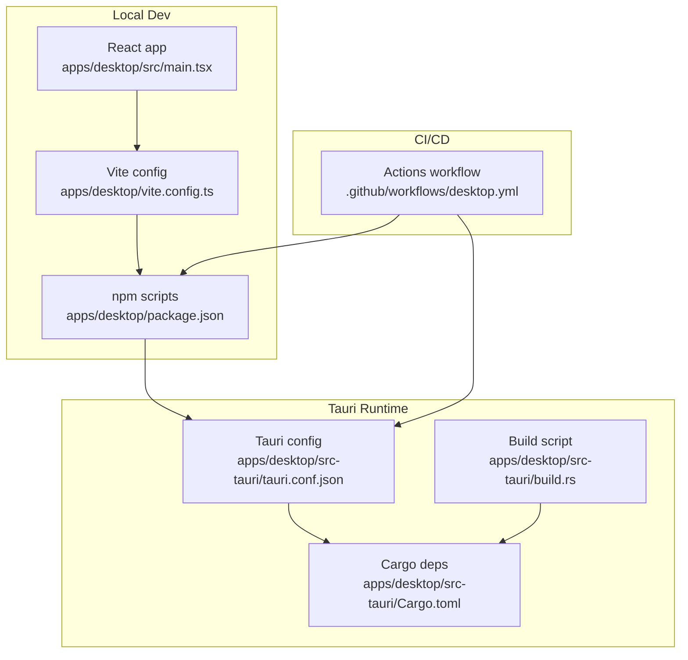
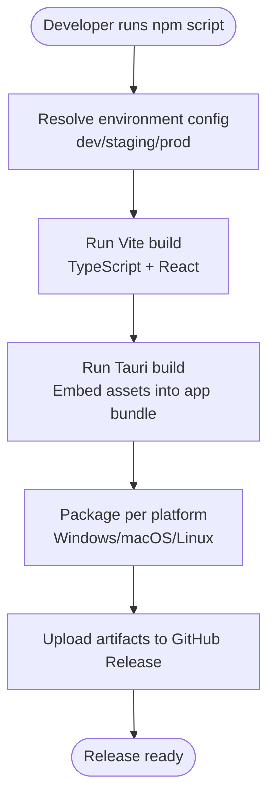
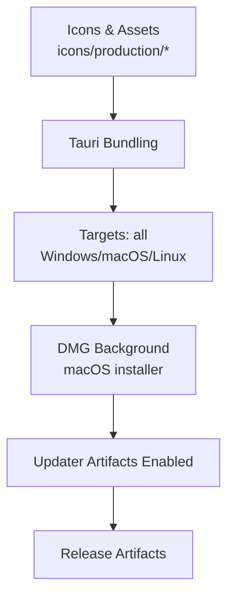
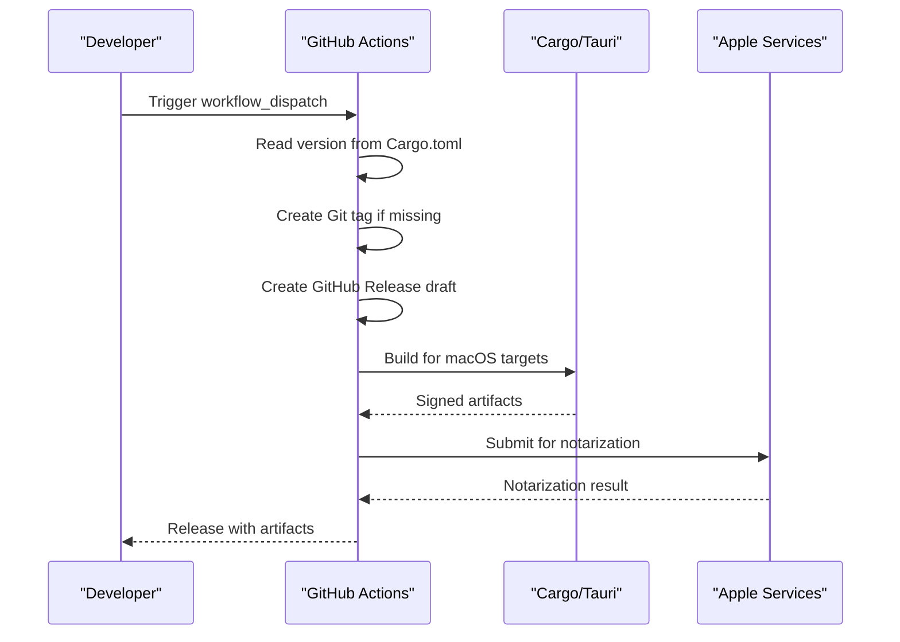
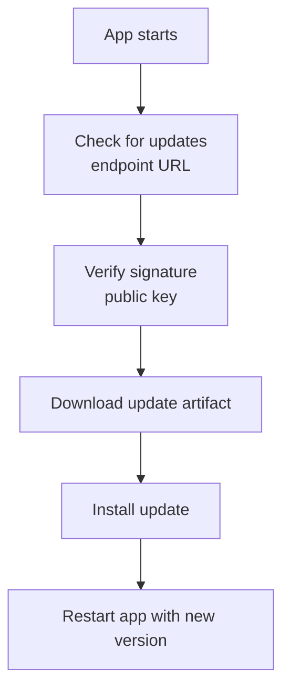
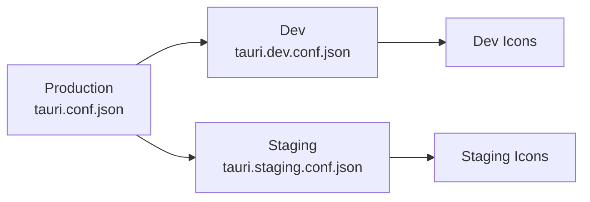
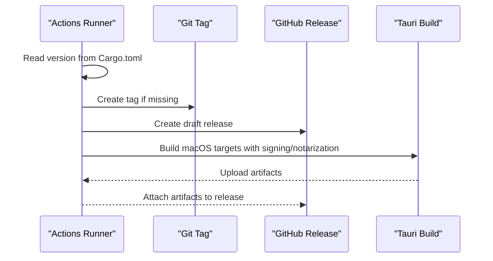
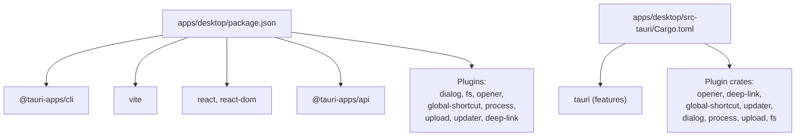

# Cross-Platform Deployment

<cite>
**Referenced Files in This Document**
- [package.json](file://midday/package.json)
- [.github/workflows/desktop.yml](file://midday/.github/workflows/desktop.yml)
- [apps/desktop/package.json](file://midday/apps/desktop/package.json)
- [apps/desktop/vite.config.ts](file://midday/apps/desktop/vite.config.ts)
- [apps/desktop/src/main.tsx](file://midday/apps/desktop/src/main.tsx)
- [apps/desktop/src-tauri/tauri.conf.json](file://midday/apps/desktop/src-tauri/tauri.conf.json)
- [apps/desktop/src-tauri/tauri.dev.conf.json](file://midday/apps/desktop/src-tauri/tauri.dev.conf.json)
- [apps/desktop/src-tauri/tauri.staging.conf.json](file://midday/apps/desktop/src-tauri/tauri.staging.conf.json)
- [apps/desktop/src-tauri/build.rs](file://midday/apps/desktop/src-tauri/build.rs)
- [apps/desktop/src-tauri/Cargo.toml](file://midday/apps/desktop/src-tauri/Cargo.toml)
- [packages/desktop-client/package.json](file://midday/packages/desktop-client/package.json)
</cite>

## Table of Contents
1. [Introduction](#introduction)
2. [Project Structure](#project-structure)
3. [Core Components](#core-components)
4. [Architecture Overview](#architecture-overview)
5. [Detailed Component Analysis](#detailed-component-analysis)
6. [Dependency Analysis](#dependency-analysis)
7. [Performance Considerations](#performance-considerations)
8. [Troubleshooting Guide](#troubleshooting-guide)
9. [Conclusion](#conclusion)
10. [Appendices](#appendices)

## Introduction
This document explains how to deploy the Faworra Desktop Application across Windows, macOS, and Linux. It covers the build pipeline using Vite and Tauri, asset bundling, packaging and distribution, code signing and notarization for macOS, updater configuration, and continuous integration automation. It also outlines release management, platform-specific considerations, and quality assurance practices for reliable multi-platform releases.

## Project Structure
The desktop application is organized as a Tauri-based desktop app with a React frontend and a Rust backend. Build orchestration is handled via npm-style scripts in the desktop workspace and GitHub Actions for CI/CD.

Key elements:
- Frontend: React app under apps/desktop/src
- Bundler: Vite configured for Tauri development and builds
- Desktop runtime: Tauri with plugins for dialogs, filesystem, deep links, global shortcuts, process, upload, and updater
- Packaging: Tauri configuration defines bundle targets, icons, DMG background, and updater endpoints
- CI/CD: GitHub Actions workflow automates tagging, release creation, and cross-platform builds with macOS code signing and notarization

**Diagram sources**
- [apps/desktop/package.json](file://midday/apps/desktop/package.json#L1-L40)
- [apps/desktop/vite.config.ts](file://midday/apps/desktop/vite.config.ts#L1-L32)
- [apps/desktop/src/main.tsx](file://midday/apps/desktop/src/main.tsx#L1-L9)
- [apps/desktop/src-tauri/tauri.conf.json](file://midday/apps/desktop/src-tauri/tauri.conf.json#L1-L46)
- [apps/desktop/src-tauri/tauri.dev.conf.json](file://midday/apps/desktop/src-tauri/tauri.dev.conf.json#L1-L22)
- [apps/desktop/src-tauri/tauri.staging.conf.json](file://midday/apps/desktop/src-tauri/tauri.staging.conf.json#L1-L21)
- [apps/desktop/src-tauri/build.rs](file://midday/apps/desktop/src-tauri/build.rs#L1-L4)
- [apps/desktop/src-tauri/Cargo.toml](file://midday/apps/desktop/src-tauri/Cargo.toml#L1-L40)
- [.github/workflows/desktop.yml](file://midday/.github/workflows/desktop.yml#L1-L144)

**Section sources**
- [apps/desktop/package.json](file://midday/apps/desktop/package.json#L1-L40)
- [apps/desktop/vite.config.ts](file://midday/apps/desktop/vite.config.ts#L1-L32)
- [apps/desktop/src/main.tsx](file://midday/apps/desktop/src/main.tsx#L1-L9)
- [apps/desktop/src-tauri/tauri.conf.json](file://midday/apps/desktop/src-tauri/tauri.conf.json#L1-L46)
- [apps/desktop/src-tauri/tauri.dev.conf.json](file://midday/apps/desktop/src-tauri/tauri.dev.conf.json#L1-L22)
- [apps/desktop/src-tauri/tauri.staging.conf.json](file://midday/apps/desktop/src-tauri/tauri.staging.conf.json#L1-L21)
- [apps/desktop/src-tauri/build.rs](file://midday/apps/desktop/src-tauri/build.rs#L1-L4)
- [apps/desktop/src-tauri/Cargo.toml](file://midday/apps/desktop/src-tauri/Cargo.toml#L1-L40)
- [.github/workflows/desktop.yml](file://midday/.github/workflows/desktop.yml#L1-L144)

## Core Components
- Desktop scripts and dependencies: npm-style scripts for dev, build, preview, and Tauri commands; React and Tauri plugins
- Vite configuration: fixed port for Tauri dev, HMR host configuration, and ignored watch paths
- Tauri configuration: product metadata, bundle targets, icons, DMG background, plugin configurations (deep-link, updater), and CSP/security settings
- Cargo manifest: Tauri crate definitions, plugin dependencies, and target-specific conditions
- CI/CD workflow: version extraction, tag creation, GitHub Release draft, and multi-target macOS builds with Apple signing and notarization

**Section sources**
- [apps/desktop/package.json](file://midday/apps/desktop/package.json#L6-L16)
- [apps/desktop/vite.config.ts](file://midday/apps/desktop/vite.config.ts#L7-L31)
- [apps/desktop/src-tauri/tauri.conf.json](file://midday/apps/desktop/src-tauri/tauri.conf.json#L1-L46)
- [apps/desktop/src-tauri/Cargo.toml](file://midday/apps/desktop/src-tauri/Cargo.toml#L1-L40)
- [.github/workflows/desktop.yml](file://midday/.github/workflows/desktop.yml#L25-L74)

## Architecture Overview
The desktop app architecture integrates a React frontend built by Vite and embedded into a Tauri shell. Tauri manages OS integrations, packaging, and updates. CI/CD automates cross-platform builds and release artifacts.

**Diagram sources**
- [apps/desktop/package.json](file://midday/apps/desktop/package.json#L6-L16)
- [apps/desktop/vite.config.ts](file://midday/apps/desktop/vite.config.ts#L7-L31)
- [apps/desktop/src/main.tsx](file://midday/apps/desktop/src/main.tsx#L1-L9)
- [apps/desktop/src-tauri/tauri.conf.json](file://midday/apps/desktop/src-tauri/tauri.conf.json#L1-L46)
- [apps/desktop/src-tauri/Cargo.toml](file://midday/apps/desktop/src-tauri/Cargo.toml#L1-L40)
- [apps/desktop/src-tauri/build.rs](file://midday/apps/desktop/src-tauri/build.rs#L1-L4)
- [.github/workflows/desktop.yml](file://midday/.github/workflows/desktop.yml#L1-L144)

## Detailed Component Analysis

### Build Pipeline: Vite and Tauri
- Vite is configured for Tauri development with a fixed port and optional HMR host for remote dev. It ignores the Tauri directory to avoid unnecessary rebuilds.
- The desktop package defines scripts to compile TypeScript and run Vite build, and to launch Tauri in dev/staging/production modes using environment-specific configs.

**Diagram sources**
- [apps/desktop/vite.config.ts](file://midday/apps/desktop/vite.config.ts#L7-L31)
- [apps/desktop/package.json](file://midday/apps/desktop/package.json#L6-L16)
- [apps/desktop/src-tauri/tauri.conf.json](file://midday/apps/desktop/src-tauri/tauri.conf.json#L15-L31)

**Section sources**
- [apps/desktop/vite.config.ts](file://midday/apps/desktop/vite.config.ts#L7-L31)
- [apps/desktop/package.json](file://midday/apps/desktop/package.json#L6-L16)

### Asset Bundling and Distribution Preparation
- Tauri configuration specifies bundle targets as "all" and sets icon assets for multiple resolutions and formats.
- macOS DMG background is configured for branded installer visuals.
- Updater artifacts are enabled to support self-updates.

**Diagram sources**
- [apps/desktop/src-tauri/tauri.conf.json](file://midday/apps/desktop/src-tauri/tauri.conf.json#L15-L31)

**Section sources**
- [apps/desktop/src-tauri/tauri.conf.json](file://midday/apps/desktop/src-tauri/tauri.conf.json#L15-L31)

### Packaging and Installer Creation
- Tauri handles packaging for all supported platforms. macOS builds include code signing and notarization via GitHub Actions secrets.
- The CI workflow installs Rust targets, imports Apple certificates, verifies identities, and runs Tauri action to produce signed and notarized binaries.

**Diagram sources**
- [.github/workflows/desktop.yml](file://midday/.github/workflows/desktop.yml#L25-L74)
- [.github/workflows/desktop.yml](file://midday/.github/workflows/desktop.yml#L102-L144)
- [apps/desktop/src-tauri/Cargo.toml](file://midday/apps/desktop/src-tauri/Cargo.toml#L1-L40)

**Section sources**
- [.github/workflows/desktop.yml](file://midday/.github/workflows/desktop.yml#L102-L144)
- [apps/desktop/src-tauri/Cargo.toml](file://midday/apps/desktop/src-tauri/Cargo.toml#L1-L40)

### Auto-Update Mechanism
- The Tauri updater plugin is configured with a public key, endpoint URL, and artifact generation flag.
- The desktop package includes the updater plugin dependency, enabling automatic updates during runtime.

**Diagram sources**
- [apps/desktop/src-tauri/tauri.conf.json](file://midday/apps/desktop/src-tauri/tauri.conf.json#L38-L43)
- [apps/desktop/package.json](file://midday/apps/desktop/package.json#L26-L26)

**Section sources**
- [apps/desktop/src-tauri/tauri.conf.json](file://midday/apps/desktop/src-tauri/tauri.conf.json#L38-L43)
- [apps/desktop/package.json](file://midday/apps/desktop/package.json#L26-L26)

### Environment-Specific Configurations
- Development and staging configurations override product name, identifier, icons, and deep-link schemes. Updater artifacts are disabled for dev environments.

**Diagram sources**
- [apps/desktop/src-tauri/tauri.conf.json](file://midday/apps/desktop/src-tauri/tauri.conf.json#L1-L46)
- [apps/desktop/src-tauri/tauri.dev.conf.json](file://midday/apps/desktop/src-tauri/tauri.dev.conf.json#L1-L22)
- [apps/desktop/src-tauri/tauri.staging.conf.json](file://midday/apps/desktop/src-tauri/tauri.staging.conf.json#L1-L21)

**Section sources**
- [apps/desktop/src-tauri/tauri.dev.conf.json](file://midday/apps/desktop/src-tauri/tauri.dev.conf.json#L1-L22)
- [apps/desktop/src-tauri/tauri.staging.conf.json](file://midday/apps/desktop/src-tauri/tauri.staging.conf.json#L1-L21)

### Platform-Specific Considerations
- macOS:
  - Code signing and notarization are integrated into the CI workflow using Apple certificates and API key.
  - DMG background is configured for branded installer presentation.
- Windows and Linux:
  - Packaging targets "all" and artifacts are produced via Tauri action.
  - No explicit signing steps are defined in the workflow; ensure platform-appropriate signing and distribution channels are configured externally if required.

**Section sources**
- [.github/workflows/desktop.yml](file://midday/.github/workflows/desktop.yml#L113-L144)
- [apps/desktop/src-tauri/tauri.conf.json](file://midday/apps/desktop/src-tauri/tauri.conf.json#L19-L23)

### Continuous Integration Setup and Automated Builds
- The workflow reads the version from Cargo.toml, creates a Git tag if absent, drafts a GitHub Release, and builds for macOS targets with dual architectures.
- Secrets are used for Apple signing and notarization, and for Tauri private key signing.

**Diagram sources**
- [.github/workflows/desktop.yml](file://midday/.github/workflows/desktop.yml#L25-L86)
- [.github/workflows/desktop.yml](file://midday/.github/workflows/desktop.yml#L102-L144)

**Section sources**
- [.github/workflows/desktop.yml](file://midday/.github/workflows/desktop.yml#L1-L144)

### Quality Assurance for Multi-Platform Releases
- Version consistency: CI reads version from Cargo.toml to ensure release tag and app version alignment.
- Artifact verification: Updater artifacts are generated for seamless updates.
- Security: CSP and capability settings are configured in Tauri; updater public key is defined for signed updates.

**Section sources**
- [.github/workflows/desktop.yml](file://midday/.github/workflows/desktop.yml#L25-L30)
- [apps/desktop/src-tauri/tauri.conf.json](file://midday/apps/desktop/src-tauri/tauri.conf.json#L8-L13)
- [apps/desktop/src-tauri/tauri.conf.json](file://midday/apps/desktop/src-tauri/tauri.conf.json#L38-L43)

## Dependency Analysis
The desktop app relies on Tauri plugins for OS integrations and updates. The Cargo manifest declares Tauri and plugin crates, while the desktop package.json lists JavaScript dependencies and CLI tools.

**Diagram sources**
- [apps/desktop/package.json](file://midday/apps/desktop/package.json#L18-L38)
- [apps/desktop/src-tauri/Cargo.toml](file://midday/apps/desktop/src-tauri/Cargo.toml#L20-L35)

**Section sources**
- [apps/desktop/package.json](file://midday/apps/desktop/package.json#L18-L38)
- [apps/desktop/src-tauri/Cargo.toml](file://midday/apps/desktop/src-tauri/Cargo.toml#L20-L35)

## Performance Considerations
- Keep asset sizes minimal to reduce build and update times.
- Use Tauri’s fixed port and strict port mode to avoid conflicts during development.
- Limit watch paths to frontend only to speed up rebuilds.

[No sources needed since this section provides general guidance]

## Troubleshooting Guide
- HMR and host binding:
  - Ensure the host environment variable matches the configured host for remote development.
- Port conflicts:
  - Tauri requires a fixed port; if unavailable, the build will fail. Adjust or free the port.
- CI secrets:
  - Missing Apple certificates or API key will cause signing/notarization failures. Verify secrets are present and correct.
- Version mismatch:
  - If the release tag does not match Cargo.toml version, CI will skip the release. Update the version before triggering a release.

**Section sources**
- [apps/desktop/vite.config.ts](file://midday/apps/desktop/vite.config.ts#L15-L25)
- [.github/workflows/desktop.yml](file://midday/.github/workflows/desktop.yml#L113-L136)

## Conclusion
The Faworra Desktop Application uses a streamlined build and CI/CD pipeline leveraging Vite and Tauri. The configuration supports multi-platform packaging, macOS code signing and notarization, and an integrated updater. By maintaining version consistency, securing signing assets, and validating CI secrets, teams can reliably deliver cross-platform releases.

[No sources needed since this section summarizes without analyzing specific files]

## Appendices

### Appendix A: Desktop Client Package Exports
The desktop-client package exposes platform abstractions and desktop variants for shared logic across environments.

**Section sources**
- [packages/desktop-client/package.json](file://midday/packages/desktop-client/package.json#L13-L18)