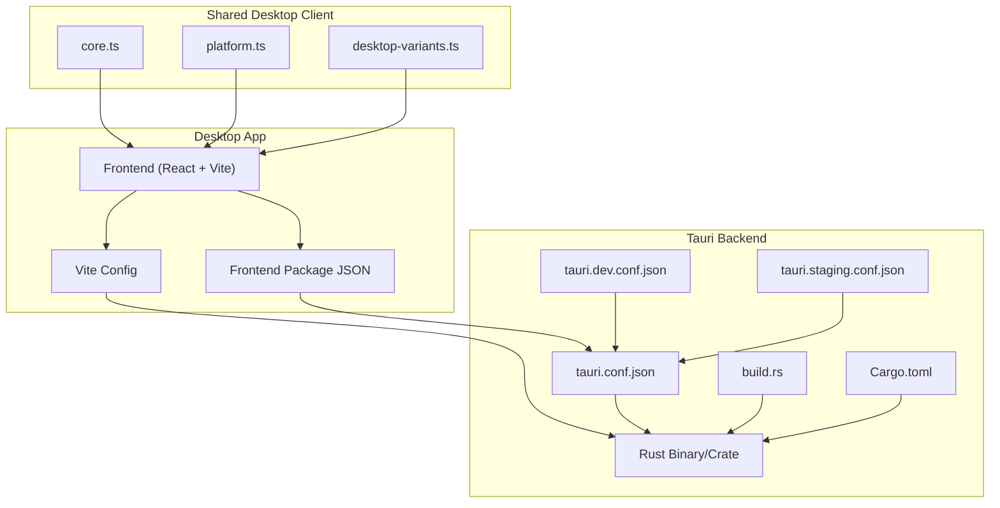
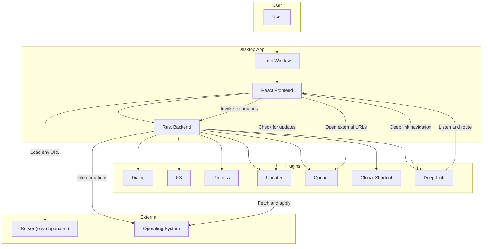
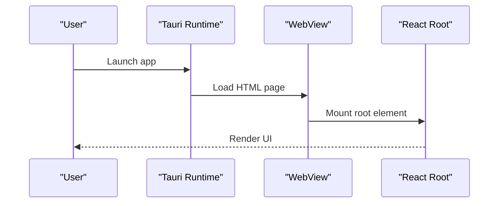
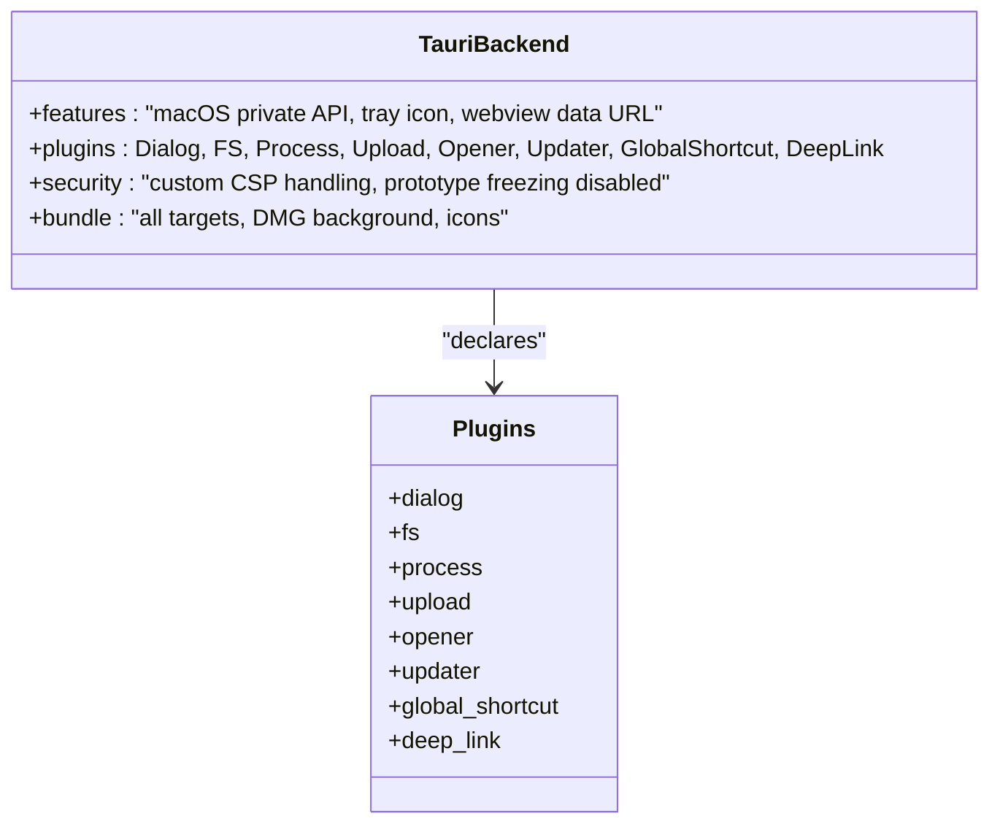
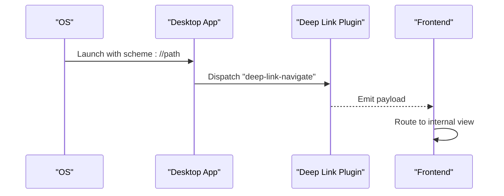
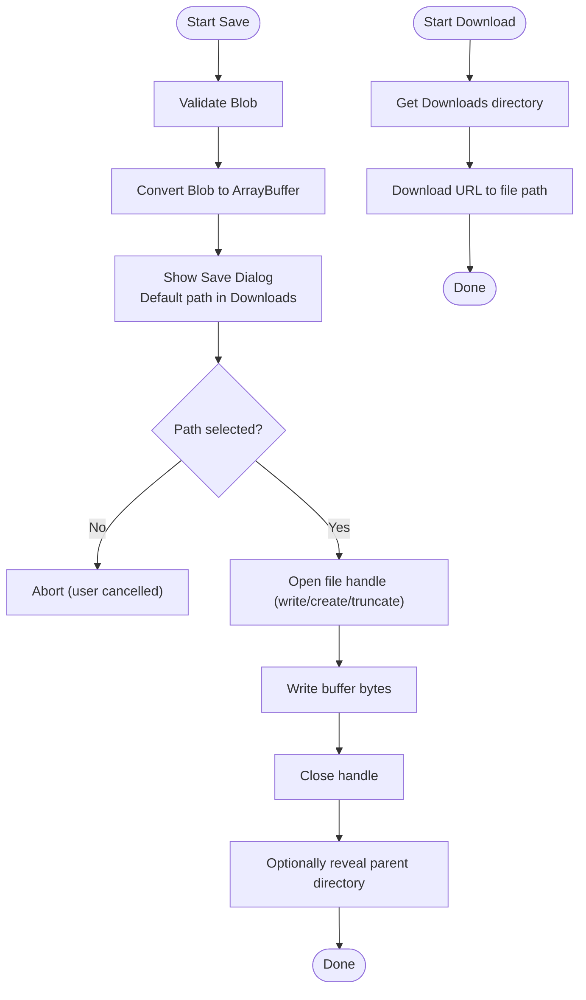
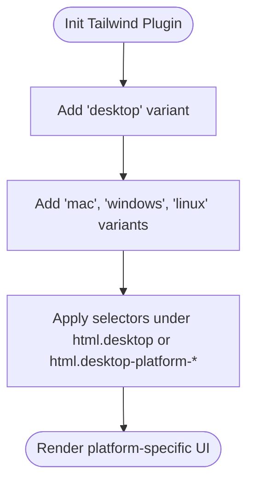
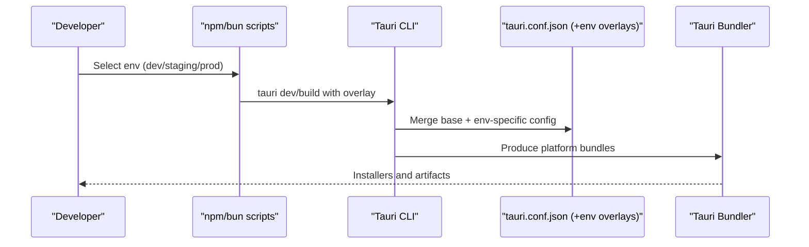
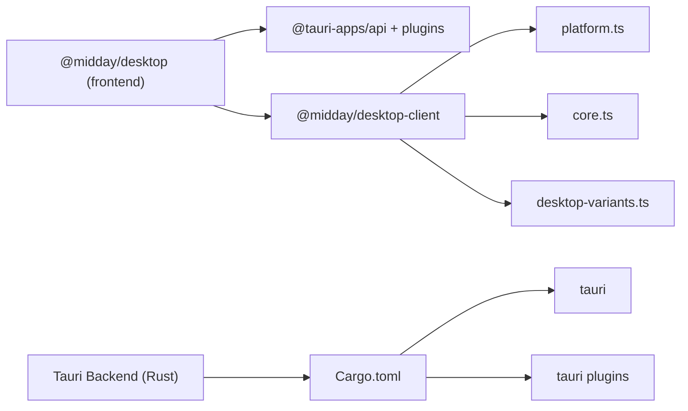

# Desktop Application

<cite>
**Referenced Files in This Document**
- [main.tsx](file://midday/apps/desktop/src/main.tsx)
- [Cargo.toml](file://midday/apps/desktop/src-tauri/Cargo.toml)
- [tauri.conf.json](file://midday/apps/desktop/src-tauri/tauri.conf.json)
- [package.json](file://midday/apps/desktop/package.json)
- [vite.config.ts](file://midday/apps/desktop/vite.config.ts)
- [build.rs](file://midday/apps/desktop/src-tauri/build.rs)
- [tauri.dev.conf.json](file://midday/apps/desktop/src-tauri/tauri.dev.conf.json)
- [tauri.staging.conf.json](file://midday/apps/desktop/src-tauri/tauri.staging.conf.json)
- [README.md](file://midday/apps/desktop/README.md)
- [platform.ts](file://midday/packages/desktop-client/src/platform.ts)
- [core.ts](file://midday/packages/desktop-client/src/core.ts)
- [desktop-variants.ts](file://midday/packages/desktop-client/src/desktop-variants.ts)
</cite>

## Table of Contents
1. [Introduction](#introduction)
2. [Project Structure](#project-structure)
3. [Core Components](#core-components)
4. [Architecture Overview](#architecture-overview)
5. [Detailed Component Analysis](#detailed-component-analysis)
6. [Dependency Analysis](#dependency-analysis)
7. [Performance Considerations](#performance-considerations)
8. [Troubleshooting Guide](#troubleshooting-guide)
9. [Conclusion](#conclusion)
10. [Appendices](#appendices)

## Introduction
This document describes the Faworra Desktop Application, a Tauri-based cross-platform desktop client. It covers the Rust backend configuration, frontend integration with Vite and React, system API access via Tauri plugins, window management, native menu integration, and file system operations. It also documents the build process for Windows, macOS, and Linux, code signing and distribution strategies, security considerations, development workflow, debugging techniques, performance optimization, packaging, auto-updates, and desktop UX considerations.

## Project Structure
The desktop application is organized into:
- Frontend: React + Vite under apps/desktop
- Backend: Tauri Rust application under apps/desktop/src-tauri
- Shared desktop client utilities under packages/desktop-client

Key configuration and build files:
- Frontend build and dev scripts are defined in the desktop app’s package.json
- Vite configuration sets up a fixed port and HMR for Tauri development
- Tauri configuration defines product metadata, bundling, plugins, and updater settings
- Rust Cargo manifest defines Tauri dependencies and plugins
- Environment-specific Tauri configurations for dev/staging

**Diagram sources**
- [package.json](file://midday/apps/desktop/package.json#L1-L40)
- [vite.config.ts](file://midday/apps/desktop/vite.config.ts#L1-L32)
- [tauri.conf.json](file://midday/apps/desktop/src-tauri/tauri.conf.json#L1-L46)
- [tauri.dev.conf.json](file://midday/apps/desktop/src-tauri/tauri.dev.conf.json#L1-L22)
- [tauri.staging.conf.json](file://midday/apps/desktop/src-tauri/tauri.staging.conf.json#L1-L21)
- [Cargo.toml](file://midday/apps/desktop/src-tauri/Cargo.toml#L1-L40)
- [build.rs](file://midday/apps/desktop/src-tauri/build.rs#L1-L4)
- [core.ts](file://midday/packages/desktop-client/src/core.ts#L1-L98)
- [platform.ts](file://midday/packages/desktop-client/src/platform.ts#L1-L69)
- [desktop-variants.ts](file://midday/packages/desktop-client/src/desktop-variants.ts#L1-L52)

**Section sources**
- [package.json](file://midday/apps/desktop/package.json#L1-L40)
- [vite.config.ts](file://midday/apps/desktop/vite.config.ts#L1-L32)
- [tauri.conf.json](file://midday/apps/desktop/src-tauri/tauri.conf.json#L1-L46)
- [Cargo.toml](file://midday/apps/desktop/src-tauri/Cargo.toml#L1-L40)
- [build.rs](file://midday/apps/desktop/src-tauri/build.rs#L1-L4)
- [README.md](file://midday/apps/desktop/README.md#L1-L80)

## Core Components
- Frontend entry and rendering: React root renders inside the Tauri WebView
- Tauri backend: Rust binary with plugins for dialogs, filesystem, process, upload, opener, updater, and global shortcuts
- Desktop client utilities: Cross-platform helpers for deep links, downloads, saves, and Tailwind variants for desktop-specific UI
- Build and dev scripts: Scripts to run dev servers, build binaries, and target different environments

Key responsibilities:
- Frontend: UI rendering, invoking Tauri commands, handling deep links
- Backend: Exposing safe APIs to the frontend, managing windows, handling system integrations
- Shared client: Providing a unified interface for desktop features across environments

**Section sources**
- [main.tsx](file://midday/apps/desktop/src/main.tsx#L1-L9)
- [Cargo.toml](file://midday/apps/desktop/src-tauri/Cargo.toml#L20-L35)
- [platform.ts](file://midday/packages/desktop-client/src/platform.ts#L1-L69)
- [core.ts](file://midday/packages/desktop-client/src/core.ts#L1-L98)
- [package.json](file://midday/apps/desktop/package.json#L6-L17)

## Architecture Overview
The desktop app runs a Tauri window hosting a React/Vite frontend. The Rust backend exposes system capabilities via Tauri plugins. Environment-specific configurations control URLs, icons, and deep link schemes. The updater plugin enables automatic updates.

**Diagram sources**
- [tauri.conf.json](file://midday/apps/desktop/src-tauri/tauri.conf.json#L1-L46)
- [Cargo.toml](file://midday/apps/desktop/src-tauri/Cargo.toml#L20-L35)
- [platform.ts](file://midday/packages/desktop-client/src/platform.ts#L32-L50)
- [core.ts](file://midday/packages/desktop-client/src/core.ts#L9-L15)
- [README.md](file://midday/apps/desktop/README.md#L13-L17)

## Detailed Component Analysis

### Frontend Entry and Rendering
- The React root is mounted in the Tauri WebView and currently renders a placeholder “Hello World” element
- The Vite configuration fixes the dev server port and disables screen clearing to avoid masking Rust build errors
- HMR is configured for remote hosts when TAURI_DEV_HOST is set

**Diagram sources**
- [main.tsx](file://midday/apps/desktop/src/main.tsx#L4-L8)
- [vite.config.ts](file://midday/apps/desktop/vite.config.ts#L10-L30)

**Section sources**
- [main.tsx](file://midday/apps/desktop/src/main.tsx#L1-L9)
- [vite.config.ts](file://midday/apps/desktop/vite.config.ts#L1-L32)

### Tauri Backend and Plugins
- Rust crate exposes multiple plugin features: dialogs, filesystem, process, upload, opener, updater, global shortcut, and deep link
- macOS private API is enabled for advanced integrations
- The updater plugin is configured with a public key and endpoint, and artifacts are generated during bundling

**Diagram sources**
- [Cargo.toml](file://midday/apps/desktop/src-tauri/Cargo.toml#L20-L35)
- [tauri.conf.json](file://midday/apps/desktop/src-tauri/tauri.conf.json#L8-L44)

**Section sources**
- [Cargo.toml](file://midday/apps/desktop/src-tauri/Cargo.toml#L1-L40)
- [tauri.conf.json](file://midday/apps/desktop/src-tauri/tauri.conf.json#L1-L46)

### Deep Link Handling
- The desktop client exposes helpers to detect desktop environment, derive scheme per environment, listen for deep link events, and construct deep link URLs
- The Tauri configuration registers supported schemes per environment

**Diagram sources**
- [platform.ts](file://midday/packages/desktop-client/src/platform.ts#L32-L50)
- [tauri.dev.conf.json](file://midday/apps/desktop/src-tauri/tauri.dev.conf.json#L14-L19)
- [tauri.staging.conf.json](file://midday/apps/desktop/src-tauri/tauri.staging.conf.json#L13-L18)

**Section sources**
- [platform.ts](file://midday/packages/desktop-client/src/platform.ts#L1-L69)
- [tauri.dev.conf.json](file://midday/apps/desktop/src-tauri/tauri.dev.conf.json#L1-L22)
- [tauri.staging.conf.json](file://midday/apps/desktop/src-tauri/tauri.staging.conf.json#L1-L21)

### File System Operations
- Saving files: Uses the dialog plugin to show a save-as dialog and writes the Blob buffer to the chosen path via the filesystem plugin
- Downloading: Uses the upload plugin to download a URL directly to the user’s Downloads folder

**Diagram sources**
- [core.ts](file://midday/packages/desktop-client/src/core.ts#L9-L97)

**Section sources**
- [core.ts](file://midday/packages/desktop-client/src/core.ts#L1-L98)

### Desktop UI Variants
- A Tailwind plugin adds desktop-specific variants to conditionally style UI based on desktop context and platform (macOS, Windows, Linux)

**Diagram sources**
- [desktop-variants.ts](file://midday/packages/desktop-client/src/desktop-variants.ts#L20-L49)

**Section sources**
- [desktop-variants.ts](file://midday/packages/desktop-client/src/desktop-variants.ts#L1-L52)

### Build and Environment Configuration
- Scripts support dev, staging, and production modes with environment-controlled URLs
- Environment variables control the target URL and deep link scheme
- Separate Tauri configuration overlays for dev/staging customize identifiers, icons, and schemes

**Diagram sources**
- [package.json](file://midday/apps/desktop/package.json#L6-L17)
- [tauri.dev.conf.json](file://midday/apps/desktop/src-tauri/tauri.dev.conf.json#L1-L22)
- [tauri.staging.conf.json](file://midday/apps/desktop/src-tauri/tauri.staging.conf.json#L1-L21)
- [README.md](file://midday/apps/desktop/README.md#L56-L79)

**Section sources**
- [package.json](file://midday/apps/desktop/package.json#L1-L40)
- [tauri.dev.conf.json](file://midday/apps/desktop/src-tauri/tauri.dev.conf.json#L1-L22)
- [tauri.staging.conf.json](file://midday/apps/desktop/src-tauri/tauri.staging.conf.json#L1-L21)
- [README.md](file://midday/apps/desktop/README.md#L1-L80)

## Dependency Analysis
- Frontend depends on Tauri JS APIs and plugins for dialogs, filesystem, process, upload, opener, and updater
- Rust backend depends on Tauri core and plugin crates; some plugins are gated behind non-mobile targets
- Desktop client package exports platform detection, deep link helpers, and desktop variants for Tailwind

**Diagram sources**
- [package.json](file://midday/apps/desktop/package.json#L18-L28)
- [Cargo.toml](file://midday/apps/desktop/src-tauri/Cargo.toml#L20-L35)
- [platform.ts](file://midday/packages/desktop-client/src/platform.ts#L1-L69)
- [core.ts](file://midday/packages/desktop-client/src/core.ts#L1-L98)
- [desktop-variants.ts](file://midday/packages/desktop-client/src/desktop-variants.ts#L1-L52)

**Section sources**
- [package.json](file://midday/apps/desktop/package.json#L1-L40)
- [Cargo.toml](file://midday/apps/desktop/src-tauri/Cargo.toml#L1-L40)

## Performance Considerations
- Keep the WebView focused on UI rendering; delegate heavy tasks to Rust plugins or background processes
- Minimize DOM churn in the frontend; leverage Tailwind variants judiciously
- Use lazy-loading for large components and defer non-critical initialization
- Prefer streaming downloads for large files and avoid blocking the UI thread
- Use appropriate buffer sizes when writing files to reduce memory pressure
- Disable unnecessary plugins or features in development builds to speed iteration

## Troubleshooting Guide
Common issues and resolutions:
- Dev server port conflicts: Ensure port 1420 is free; the Vite config enforces strict port usage
- HMR not working remotely: Set TAURI_DEV_HOST to enable HMR over network
- Deep link not handled: Verify scheme registration in the active environment config and ensure the listener is attached
- Save dialog fails silently: Confirm the Blob is valid and non-empty; check filesystem permissions and selected path
- Updater not triggering: Validate the public key and endpoint; ensure artifacts are generated during bundling

**Section sources**
- [vite.config.ts](file://midday/apps/desktop/vite.config.ts#L13-L29)
- [platform.ts](file://midday/packages/desktop-client/src/platform.ts#L32-L50)
- [core.ts](file://midday/packages/desktop-client/src/core.ts#L32-L43)
- [tauri.conf.json](file://midday/apps/desktop/src-tauri/tauri.conf.json#L38-L44)

## Conclusion
The Faworra Desktop Application integrates a React frontend with a Tauri-powered Rust backend to deliver a secure, cross-platform desktop experience. With environment-aware configurations, robust file operations, deep link handling, and an updater, it provides a solid foundation for desktop distribution and maintenance. Following the development workflow and performance guidelines outlined here will help maintain a responsive and reliable application across Windows, macOS, and Linux.

## Appendices

### Security Considerations
- Content Security Policy: The Tauri configuration disables default asset CSP modifications and sets custom settings; ensure routes and assets are trusted
- Prototype freezing: Disabled for compatibility; validate frontend code to prevent prototype pollution
- Capabilities: Default capability set is used; restrict further if needed
- Privilege management: Use minimal required permissions; avoid exposing sensitive system APIs unless necessary

**Section sources**
- [tauri.conf.json](file://midday/apps/desktop/src-tauri/tauri.conf.json#L8-L13)

### Distribution and Auto-Updates
- Bundling: Targets all platforms; DMG background and icons configured for macOS
- Updater: Public key and endpoint configured; artifacts created during build
- Code signing: Configure platform-specific signing in CI/CD; ensure notarization on macOS and signing on Windows

**Section sources**
- [tauri.conf.json](file://midday/apps/desktop/src-tauri/tauri.conf.json#L15-L44)

### Development Workflow and Debugging
- Use environment scripts to launch dev/staging/prod modes
- Leverage Tauri inspector and browser devtools for frontend debugging
- Use Rust logs and Tauri logs for backend diagnostics
- For deep link testing, register schemes locally and simulate callbacks

**Section sources**
- [package.json](file://midday/apps/desktop/package.json#L6-L17)
- [README.md](file://midday/apps/desktop/README.md#L19-L79)