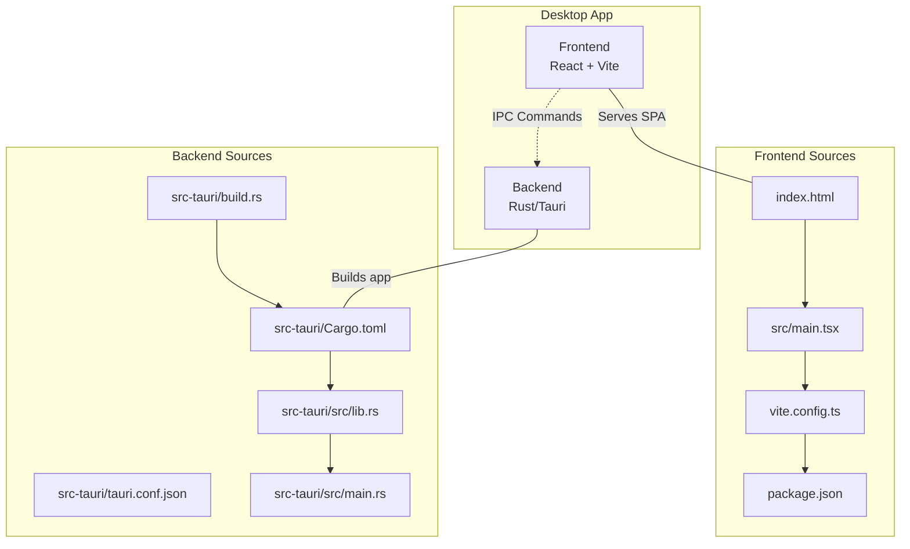
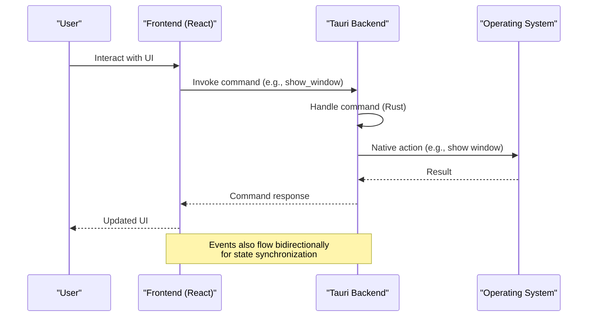
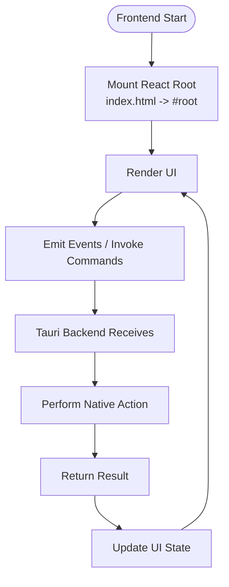
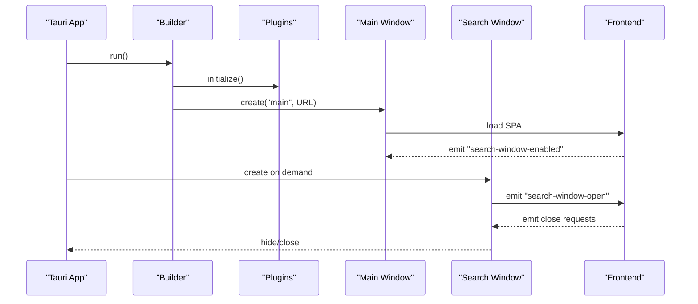
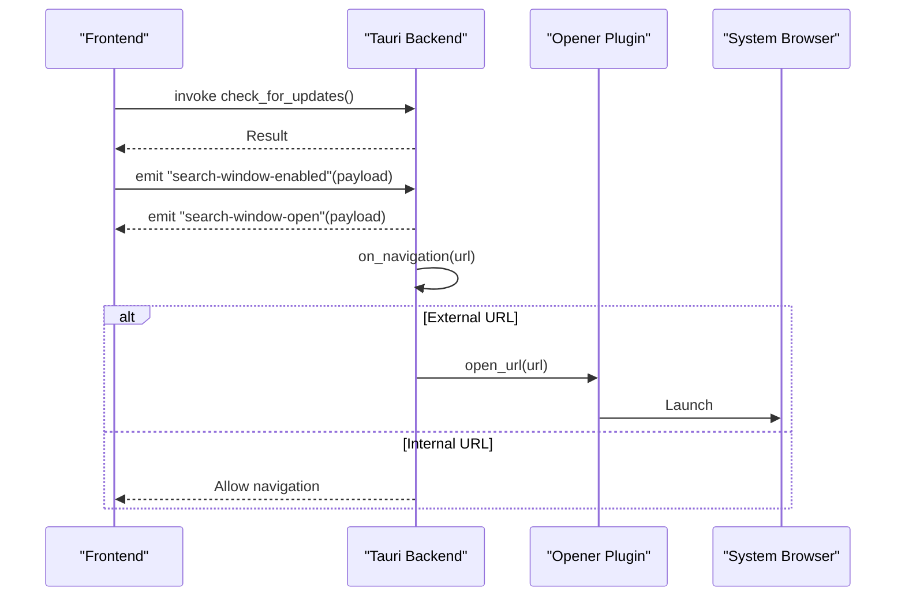
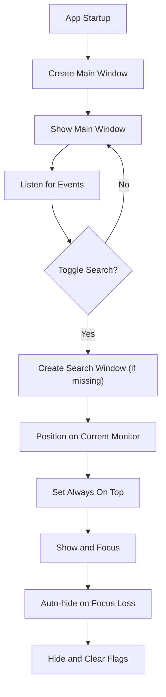
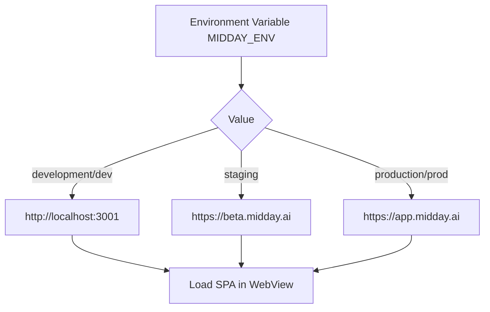
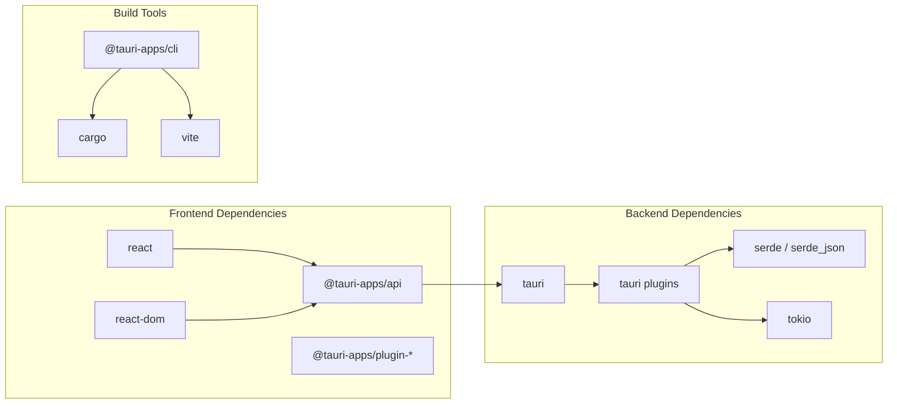

# Desktop Architecture

<cite>
**Referenced Files in This Document**
- [main.tsx](file://midday/apps/desktop/src/main.tsx)
- [index.html](file://midday/apps/desktop/index.html)
- [vite.config.ts](file://midday/apps/desktop/vite.config.ts)
- [package.json](file://midday/apps/desktop/package.json)
- [Cargo.toml](file://midday/apps/desktop/src-tauri/Cargo.toml)
- [tauri.conf.json](file://midday/apps/desktop/src-tauri/tauri.conf.json)
- [lib.rs](file://midday/apps/desktop/src-tauri/src/lib.rs)
- [main.rs](file://midday/apps/desktop/src-tauri/src/main.rs)
- [build.rs](file://midday/apps/desktop/src-tauri/build.rs)
</cite>

## Table of Contents
1. [Introduction](#introduction)
2. [Project Structure](#project-structure)
3. [Core Components](#core-components)
4. [Architecture Overview](#architecture-overview)
5. [Detailed Component Analysis](#detailed-component-analysis)
6. [Dependency Analysis](#dependency-analysis)
7. [Performance Considerations](#performance-considerations)
8. [Troubleshooting Guide](#troubleshooting-guide)
9. [Conclusion](#conclusion)

## Introduction
This document explains the desktop application architecture for Faworra (Midday), focusing on the Tauri v2 implementation that integrates a React frontend with Rust backend logic. It covers the separation of concerns between web technologies and native system access, application entry points, window management, IPC communication, build configuration, development workflow, and debugging setup. The goal is to help developers understand how the desktop app runs locally, how the frontend and backend communicate, and how to extend or troubleshoot the system effectively.

## Project Structure
The desktop application is organized into two primary parts:
- Frontend: React + Vite serving a single-page application
- Backend: Rust/Tauri managing windows, system integrations, and IPC commands

**Diagram sources**
- [index.html](file://midday/apps/desktop/index.html#L1-L15)
- [main.tsx](file://midday/apps/desktop/src/main.tsx#L1-L9)
- [vite.config.ts](file://midday/apps/desktop/vite.config.ts#L1-L32)
- [package.json](file://midday/apps/desktop/package.json#L1-L40)
- [Cargo.toml](file://midday/apps/desktop/src-tauri/Cargo.toml#L1-L40)
- [tauri.conf.json](file://midday/apps/desktop/src-tauri/tauri.conf.json#L1-L46)
- [lib.rs](file://midday/apps/desktop/src-tauri/src/lib.rs#L1-L697)
- [main.rs](file://midday/apps/desktop/src-tauri/src/main.rs#L1-L7)
- [build.rs](file://midday/apps/desktop/src-tauri/build.rs#L1-L4)

**Section sources**
- [index.html](file://midday/apps/desktop/index.html#L1-L15)
- [main.tsx](file://midday/apps/desktop/src/main.tsx#L1-L9)
- [vite.config.ts](file://midday/apps/desktop/vite.config.ts#L1-L32)
- [package.json](file://midday/apps/desktop/package.json#L1-L40)
- [Cargo.toml](file://midday/apps/desktop/src-tauri/Cargo.toml#L1-L40)
- [tauri.conf.json](file://midday/apps/desktop/src-tauri/tauri.conf.json#L1-L46)
- [lib.rs](file://midday/apps/desktop/src-tauri/src/lib.rs#L1-L697)
- [main.rs](file://midday/apps/desktop/src-tauri/src/main.rs#L1-L7)
- [build.rs](file://midday/apps/desktop/src-tauri/build.rs#L1-L4)

## Core Components
- Frontend entry point and rendering: React root mounted in index.html
- Vite configuration for Tauri development server and HMR
- Tauri configuration for bundling, plugins, and security
- Rust backend that initializes windows, registers IPC commands, and manages system integrations
- Build pipeline orchestrated by Tauri CLI and Cargo

Key responsibilities:
- Frontend: UI rendering, user interactions, and emitting events to the backend
- Backend: Window lifecycle, system tray, deep links, updates, and IPC command handlers

**Section sources**
- [main.tsx](file://midday/apps/desktop/src/main.tsx#L1-L9)
- [index.html](file://midday/apps/desktop/index.html#L10-L12)
- [vite.config.ts](file://midday/apps/desktop/vite.config.ts#L7-L31)
- [tauri.conf.json](file://midday/apps/desktop/src-tauri/tauri.conf.json#L1-L46)
- [lib.rs](file://midday/apps/desktop/src-tauri/src/lib.rs#L412-L697)
- [Cargo.toml](file://midday/apps/desktop/src-tauri/Cargo.toml#L17-L35)

## Architecture Overview
The desktop app uses Tauri v2 to embed a webview hosting the React SPA. The Rust backend controls window creation, system integrations, and exposes commands for the frontend to invoke native capabilities. Communication flows through Tauri's IPC channels and event system.

**Diagram sources**
- [lib.rs](file://midday/apps/desktop/src-tauri/src/lib.rs#L20-L39)
- [lib.rs](file://midday/apps/desktop/src-tauri/src/lib.rs#L412-L697)
- [main.tsx](file://midday/apps/desktop/src/main.tsx#L1-L9)

## Detailed Component Analysis

### Frontend: React SPA
- Entry point mounts a minimal React root and renders into the DOM element defined in index.html
- Vite serves the app during development and builds it for production
- The frontend communicates with the backend via Tauri IPC commands and events

**Diagram sources**
- [index.html](file://midday/apps/desktop/index.html#L10-L12)
- [main.tsx](file://midday/apps/desktop/src/main.tsx#L4-L8)
- [vite.config.ts](file://midday/apps/desktop/vite.config.ts#L7-L31)

**Section sources**
- [index.html](file://midday/apps/desktop/index.html#L10-L12)
- [main.tsx](file://midday/apps/desktop/src/main.tsx#L1-L9)
- [vite.config.ts](file://midday/apps/desktop/vite.config.ts#L7-L31)

### Backend: Tauri Initialization and Window Management
The Rust backend initializes the Tauri application, sets up plugins, creates windows, and registers IPC commands. It manages:
- Main window creation and overlay styling
- Search window lifecycle (lazy creation, always-on-top, positioning)
- Deep link handling and navigation decisions
- Global shortcuts and tray interactions
- Update checks and installation prompts
- Environment-aware URL routing for development/staging/production

**Diagram sources**
- [lib.rs](file://midday/apps/desktop/src-tauri/src/lib.rs#L412-L697)
- [lib.rs](file://midday/apps/desktop/src-tauri/src/lib.rs#L269-L333)
- [lib.rs](file://midday/apps/desktop/src-tauri/src/lib.rs#L526-L568)

**Section sources**
- [lib.rs](file://midday/apps/desktop/src-tauri/src/lib.rs#L412-L697)
- [lib.rs](file://midday/apps/desktop/src-tauri/src/lib.rs#L269-L333)
- [lib.rs](file://midday/apps/desktop/src-tauri/src/lib.rs#L526-L568)

### IPC Communication Patterns
- Commands: Explicit invocations from frontend to backend (e.g., show_window, check_for_updates)
- Events: Bidirectional event emission for state synchronization (e.g., search-window-enabled, search-window-open)
- Navigation: on_navigation handler decides whether to open external URLs in the system browser or stay in the webview

**Diagram sources**
- [lib.rs](file://midday/apps/desktop/src-tauri/src/lib.rs#L422-L422)
- [lib.rs](file://midday/apps/desktop/src-tauri/src/lib.rs#L575-L602)
- [lib.rs](file://midday/apps/desktop/src-tauri/src/lib.rs#L547-L568)
- [lib.rs](file://midday/apps/desktop/src-tauri/src/lib.rs#L557-L560)

**Section sources**
- [lib.rs](file://midday/apps/desktop/src-tauri/src/lib.rs#L422-L422)
- [lib.rs](file://midday/apps/desktop/src-tauri/src/lib.rs#L575-L602)
- [lib.rs](file://midday/apps/desktop/src-tauri/src/lib.rs#L547-L568)

### Window Management Details
- Main window: Overlay title bar, transparent background, hidden initially, centered on launch
- Search window: Lazy-created, always-on-top when visible, positioned on the current monitor, auto-hides on focus loss
- Global shortcuts: Toggle search window via keyboard shortcut
- Tray: Minimal tray with update check action and click toggle

**Diagram sources**
- [lib.rs](file://midday/apps/desktop/src-tauri/src/lib.rs#L526-L568)
- [lib.rs](file://midday/apps/desktop/src-tauri/src/lib.rs#L141-L215)
- [lib.rs](file://midday/apps/desktop/src-tauri/src/lib.rs#L217-L267)
- [lib.rs](file://midday/apps/desktop/src-tauri/src/lib.rs#L625-L669)

**Section sources**
- [lib.rs](file://midday/apps/desktop/src-tauri/src/lib.rs#L526-L568)
- [lib.rs](file://midday/apps/desktop/src-tauri/src/lib.rs#L141-L215)
- [lib.rs](file://midday/apps/desktop/src-tauri/src/lib.rs#L217-L267)
- [lib.rs](file://midday/apps/desktop/src-tauri/src/lib.rs#L625-L669)

### Build Configuration and Environment Routing
- Tauri configuration defines product metadata, bundling targets, icons, and plugin endpoints
- Cargo manifest lists Tauri and plugin dependencies, including platform-specific ones
- Environment routing selects development, staging, or production URLs at runtime
- Vite configuration enforces a fixed port for Tauri dev and disables screen clearing to surface Rust errors

**Diagram sources**
- [lib.rs](file://midday/apps/desktop/src-tauri/src/lib.rs#L335-L369)
- [tauri.conf.json](file://midday/apps/desktop/src-tauri/tauri.conf.json#L1-L46)
- [vite.config.ts](file://midday/apps/desktop/vite.config.ts#L14-L25)

**Section sources**
- [tauri.conf.json](file://midday/apps/desktop/src-tauri/tauri.conf.json#L1-L46)
- [Cargo.toml](file://midday/apps/desktop/src-tauri/Cargo.toml#L17-L35)
- [lib.rs](file://midday/apps/desktop/src-tauri/src/lib.rs#L335-L369)
- [vite.config.ts](file://midday/apps/desktop/vite.config.ts#L14-L25)

## Dependency Analysis
The desktop app composes frontend and backend dependencies as follows:

**Diagram sources**
- [package.json](file://midday/apps/desktop/package.json#L18-L29)
- [Cargo.toml](file://midday/apps/desktop/src-tauri/Cargo.toml#L20-L35)
- [lib.rs](file://midday/apps/desktop/src-tauri/src/lib.rs#L1-L16)

**Section sources**
- [package.json](file://midday/apps/desktop/package.json#L18-L29)
- [Cargo.toml](file://midday/apps/desktop/src-tauri/Cargo.toml#L20-L35)
- [lib.rs](file://midday/apps/desktop/src-tauri/src/lib.rs#L1-L16)

## Performance Considerations
- Window creation is deferred for the search window to avoid interfering with login flows
- Always-on-top is toggled only when visible to minimize overhead
- External navigation is intercepted early to prevent unnecessary webview loads
- Fixed port and strict port mode in Vite improve reliability during development
- Environment routing avoids network latency by selecting appropriate endpoints

[No sources needed since this section provides general guidance]

## Troubleshooting Guide
Common areas to inspect:
- Environment routing: Verify MIDDAY_ENV and resulting app URL
- Window visibility: Confirm main window fallback show and search window toggle logic
- Deep links: Check scheme registration and event handling
- Updates: Validate updater plugin initialization and endpoints
- Tray and shortcuts: Ensure global shortcut registration and tray menu events

**Section sources**
- [lib.rs](file://midday/apps/desktop/src-tauri/src/lib.rs#L335-L369)
- [lib.rs](file://midday/apps/desktop/src-tauri/src/lib.rs#L422-L447)
- [lib.rs](file://midday/apps/desktop/src-tauri/src/lib.rs#L518-L524)
- [lib.rs](file://midday/apps/desktop/src-tauri/src/lib.rs#L643-L652)
- [vite.config.ts](file://midday/apps/desktop/vite.config.ts#L14-L25)

## Conclusion
The Faworra desktop application cleanly separates the React frontend from the Rust/Tauri backend, enabling a modern web UI with powerful native capabilities. The backend orchestrates window management, system integrations, and IPC, while the frontend focuses on user interactions and state presentation. The build and development workflow leverages Vite and Tauri CLI to streamline local development and packaging.