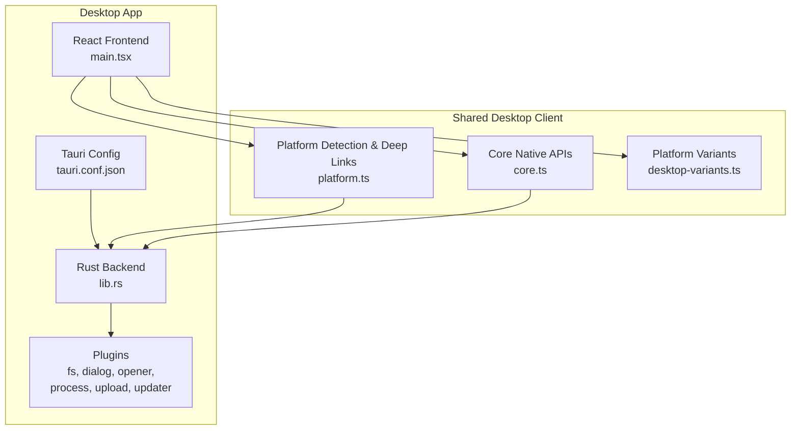
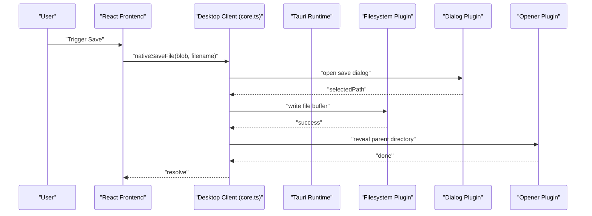
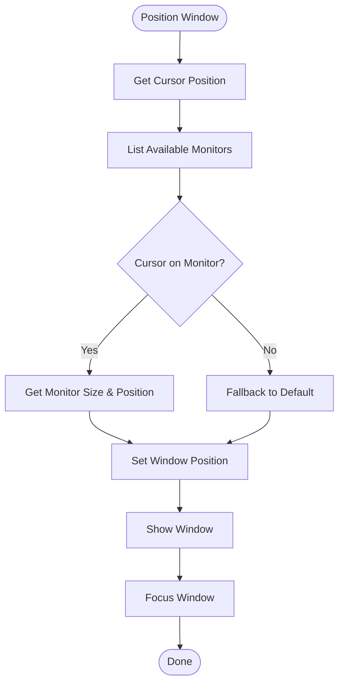
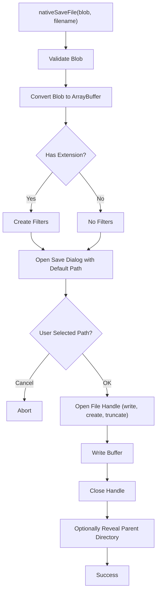
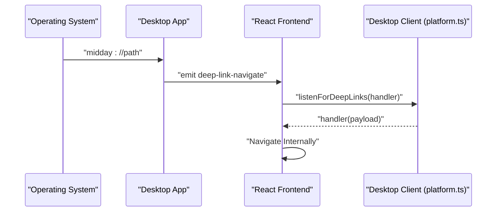
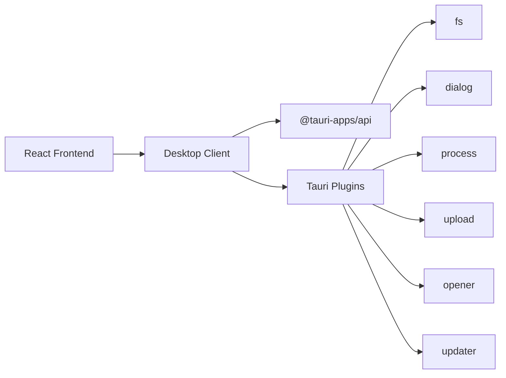

# Native Features & System Integration

<cite>
**Referenced Files in This Document**
- [main.tsx](file://midday/apps/desktop/src/main.tsx)
- [tauri.conf.json](file://midday/apps/desktop/src-tauri/tauri.conf.json)
- [Cargo.toml](file://midday/apps/desktop/src-tauri/Cargo.toml)
- [lib.rs](file://midday/apps/desktop/src-tauri/src/lib.rs)
- [package.json](file://midday/apps/desktop/package.json)
- [platform.ts](file://midday/packages/desktop-client/src/platform.ts)
- [core.ts](file://midday/packages/desktop-client/src/core.ts)
- [desktop-variants.ts](file://midday/packages/desktop-client/src/desktop-variants.ts)
</cite>

## Table of Contents
1. [Introduction](#introduction)
2. [Project Structure](#project-structure)
3. [Core Components](#core-components)
4. [Architecture Overview](#architecture-overview)
5. [Detailed Component Analysis](#detailed-component-analysis)
6. [Dependency Analysis](#dependency-analysis)
7. [Performance Considerations](#performance-considerations)
8. [Troubleshooting Guide](#troubleshooting-guide)
9. [Conclusion](#conclusion)

## Introduction
This document explains the native features and system integration of the desktop application built with Tauri. It covers window management, system tray and notifications, file system access, clipboard operations, native menus and keyboard shortcuts, deep linking, drag-and-drop, file associations, and platform-specific behaviors. It also addresses security considerations, privilege management, accessibility, and user experience optimizations unique to desktop environments.

## Project Structure
The desktop application consists of:
- A React frontend entry point
- A Tauri configuration and Rust backend
- A shared desktop client package exposing native APIs to the frontend

**Diagram sources**
- [main.tsx](file://midday/apps/desktop/src/main.tsx#L1-L9)
- [tauri.conf.json](file://midday/apps/desktop/src-tauri/tauri.conf.json#L1-L46)
- [lib.rs](file://midday/apps/desktop/src-tauri/src/lib.rs#L411-L435)
- [platform.ts](file://midday/packages/desktop-client/src/platform.ts#L1-L69)
- [core.ts](file://midday/packages/desktop-client/src/core.ts#L1-L98)
- [desktop-variants.ts](file://midday/packages/desktop-client/src/desktop-variants.ts#L1-L52)

**Section sources**
- [main.tsx](file://midday/apps/desktop/src/main.tsx#L1-L9)
- [tauri.conf.json](file://midday/apps/desktop/src-tauri/tauri.conf.json#L1-L46)
- [Cargo.toml](file://midday/apps/desktop/src-tauri/Cargo.toml#L1-L200)

## Core Components
- Platform detection and deep link handling for desktop environments
- Native file operations (save dialogs, downloads, reveal in file manager)
- Window management utilities (positioning, focus, visibility)
- Updater integration for desktop builds
- Platform-specific Tailwind variants for UI customization

Key implementation references:
- Platform detection and deep link scheme resolution
- Deep link event listening and navigation
- Native download and save file operations
- Window positioning and focus logic
- Updater plugin initialization and checks
- Platform-aware CSS variants

**Section sources**
- [platform.ts](file://midday/packages/desktop-client/src/platform.ts#L1-L69)
- [core.ts](file://midday/packages/desktop-client/src/core.ts#L1-L98)
- [lib.rs](file://midday/apps/desktop/src-tauri/src/lib.rs#L217-L409)
- [tauri.conf.json](file://midday/apps/desktop/src-tauri/tauri.conf.json#L32-L44)

## Architecture Overview
The desktop app uses Tauri to bridge the React frontend with native OS capabilities. The Rust backend initializes plugins and exposes commands to the frontend. The desktop client package abstracts platform differences and provides typed APIs for file operations, deep links, and window management.

**Diagram sources**
- [core.ts](file://midday/packages/desktop-client/src/core.ts#L20-L97)
- [lib.rs](file://midday/apps/desktop/src-tauri/src/lib.rs#L411-L435)

## Detailed Component Analysis

### Window Management
The backend supports window creation and positioning logic that places windows on the current monitor based on cursor position. It ensures windows are shown and focused appropriately.

**Diagram sources**
- [lib.rs](file://midday/apps/desktop/src-tauri/src/lib.rs#L217-L409)

**Section sources**
- [lib.rs](file://midday/apps/desktop/src-tauri/src/lib.rs#L217-L409)

### System Tray and Notifications
- The configuration enables macOS private APIs and global Tauri features.
- The updater plugin is conditionally loaded for desktop builds.
- Notifications are not explicitly configured in the provided files; typical approaches would involve OS-specific APIs or third-party libraries integrated at the Rust level.

**Section sources**
- [tauri.conf.json](file://midday/apps/desktop/src-tauri/tauri.conf.json#L5-L14)
- [lib.rs](file://midday/apps/desktop/src-tauri/src/lib.rs#L423-L435)

### File System Access
- Save dialog with default path in the user's Downloads folder and optional file extension filters.
- Direct download to the Downloads folder.
- Reveal the saved file by opening its parent directory in the native file manager.

**Diagram sources**
- [core.ts](file://midday/packages/desktop-client/src/core.ts#L20-L97)

**Section sources**
- [core.ts](file://midday/packages/desktop-client/src/core.ts#L1-L98)

### Clipboard Operations
Clipboard operations are not explicitly implemented in the provided files. Typical approaches would integrate with OS-specific APIs via Tauri plugins or Rust bindings.

### Native Menu Integration and Keyboard Shortcuts
- Global shortcuts are supported via the dedicated plugin dependency.
- Menus are not explicitly defined in the provided files; they are commonly implemented in the Rust backend and exposed to the frontend.

**Section sources**
- [package.json](file://midday/apps/desktop/package.json#L23-L23)
- [tauri.conf.json](file://midday/apps/desktop/src-tauri/tauri.conf.json#L1-L46)

### System Notifications
Notifications are not configured in the provided files. Implementation would typically involve OS-specific APIs in the Rust backend.

### Drag-and-Drop Functionality
Drag-and-drop is not explicitly implemented in the provided files. It can be handled in the frontend or via Tauri event handlers in the backend.

### File Association
Deep linking is configured via the deep-link plugin with scheme registration. The desktop client exposes helpers to construct and listen for deep links.

**Diagram sources**
- [tauri.conf.json](file://midday/apps/desktop/src-tauri/tauri.conf.json#L32-L37)
- [platform.ts](file://midday/packages/desktop-client/src/platform.ts#L32-L50)

**Section sources**
- [platform.ts](file://midday/packages/desktop-client/src/platform.ts#L1-L69)
- [tauri.conf.json](file://midday/apps/desktop/src-tauri/tauri.conf.json#L32-L37)

### Context Menu Handling
Context menus are not explicitly defined in the provided files. They are commonly implemented in the Rust backend and exposed to the frontend.

### Examples of System API Calls
- Invoke Tauri commands from the frontend to trigger native behaviors.
- Use the dialog plugin for save/open dialogs.
- Use the fs plugin for file operations.
- Use the opener plugin to open URLs or reveal folders.
- Use the upload plugin for downloads.

**Section sources**
- [core.ts](file://midday/packages/desktop-client/src/core.ts#L1-L98)
- [package.json](file://midday/apps/desktop/package.json#L18-L27)

### Privilege Management and Security Considerations
- The configuration disables asset CSP modification and prototype freezing for development convenience; production builds should enforce stricter policies.
- Capabilities are scoped to a default set; ensure only necessary permissions are granted.
- Environment variables control deep link schemes per environment.
- Updater plugin uses a public key for signature verification.

**Section sources**
- [tauri.conf.json](file://midday/apps/desktop/src-tauri/tauri.conf.json#L8-L13)
- [tauri.conf.json](file://midday/apps/desktop/src-tauri/tauri.conf.json#L38-L43)

### Platform-Specific Features
- macOS private APIs are enabled.
- Platform-specific Tailwind variants allow targeting macOS, Windows, and Linux for UI adjustments.
- Updater is conditionally enabled for desktop platforms.

**Section sources**
- [tauri.conf.json](file://midday/apps/desktop/src-tauri/tauri.conf.json#L6-L6)
- [desktop-variants.ts](file://midday/packages/desktop-client/src/desktop-variants.ts#L29-L48)
- [lib.rs](file://midday/apps/desktop/src-tauri/src/lib.rs#L423-L427)

### Accessibility Support
Accessibility is not explicitly configured in the provided files. Consider integrating OS accessibility APIs in the Rust backend or using web accessibility features in the frontend.

### User Experience Optimizations
- Automatic update checks on startup and periodic intervals.
- Window positioning logic improves usability by aligning windows with the user's current monitor.
- Optional file reveal after save enhances discoverability.

**Section sources**
- [lib.rs](file://midday/apps/desktop/src-tauri/src/lib.rs#L428-L435)
- [core.ts](file://midday/packages/desktop-client/src/core.ts#L78-L92)

## Dependency Analysis
The desktop app relies on Tauri plugins for filesystem, dialogs, process, upload, opener, and updater functionality. The frontend consumes these via the desktop client package.

**Diagram sources**
- [package.json](file://midday/apps/desktop/package.json#L18-L27)
- [core.ts](file://midday/packages/desktop-client/src/core.ts#L1-L98)
- [platform.ts](file://midday/packages/desktop-client/src/platform.ts#L1-L69)

**Section sources**
- [package.json](file://midday/apps/desktop/package.json#L18-L27)
- [Cargo.toml](file://midday/apps/desktop/src-tauri/Cargo.toml#L1-L200)

## Performance Considerations
- Minimize synchronous disk I/O; prefer streaming or chunked writes for large files.
- Debounce frequent window positioning operations.
- Cache frequently accessed paths (e.g., Downloads directory) to avoid repeated filesystem queries.
- Use appropriate dialog filters to reduce user interaction overhead.

## Troubleshooting Guide
- Deep link listener not firing: Verify the deep-link plugin is initialized and the scheme matches the configured value.
- Save dialog returns empty path: Handle cancellation gracefully and avoid attempting to write empty buffers.
- File not revealed after save: The reveal operation is optional; ensure the parent directory path is valid.
- Updater not working: Confirm the updater plugin is enabled for desktop builds and network connectivity is available.

**Section sources**
- [platform.ts](file://midday/packages/desktop-client/src/platform.ts#L32-L50)
- [core.ts](file://midday/packages/desktop-client/src/core.ts#L59-L63)
- [lib.rs](file://midday/apps/desktop/src-tauri/src/lib.rs#L423-L435)

## Conclusion
The desktop application integrates tightly with the operating system through Tauri, providing robust file operations, deep linking, window management, and platform-specific UI enhancements. Security and performance should be prioritized in production configurations, while accessibility and user experience improvements can be added through OS-specific integrations and thoughtful UX patterns.