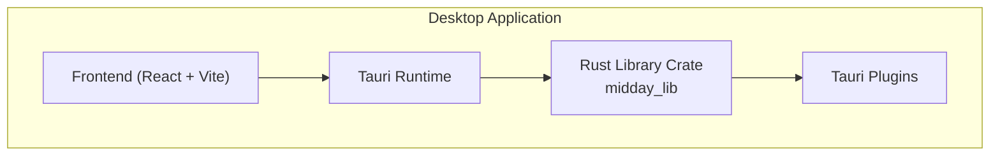
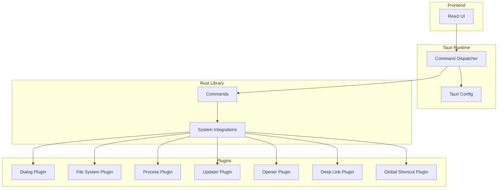
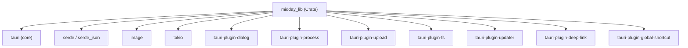

# Rust Backend Implementation

<cite>
**Referenced Files in This Document**
- [Cargo.toml](file://apps/desktop/src-tauri/Cargo.toml)
- [tauri.conf.json](file://apps/desktop/src-tauri/tauri.conf.json)
- [tauri.dev.conf.json](file://apps/desktop/src-tauri/tauri.dev.conf.json)
- [tauri.staging.conf.json](file://apps/desktop/src-tauri/tauri.staging.conf.json)
- [package.json](file://apps/desktop/package.json)
</cite>

## Table of Contents
1. [Introduction](#introduction)
2. [Project Structure](#project-structure)
3. [Core Components](#core-components)
4. [Architecture Overview](#architecture-overview)
5. [Detailed Component Analysis](#detailed-component-analysis)
6. [Dependency Analysis](#dependency-analysis)
7. [Performance Considerations](#performance-considerations)
8. [Troubleshooting Guide](#troubleshooting-guide)
9. [Conclusion](#conclusion)

## Introduction
This document describes the Rust backend implementation powering the desktop application. It focuses on the Tauri-based native runtime, the Rust library crate that bridges to the frontend, and the system integration plugins. It also covers the module structure, dependency management via Cargo, build configuration, and operational guidance for commands, file system operations, and system-level functionality.

## Project Structure
The desktop application is organized as a hybrid TypeScript/Vite frontend with a Rust/Tauri backend. The Rust backend resides under apps/desktop/src-tauri and is packaged as a library crate consumed by the Tauri runtime. The frontend is configured to build and run via Vite and Tauri CLI.

Key elements:
- Rust library crate definition and dependencies
- Tauri configuration files for development, staging, and production
- Frontend build scripts invoking Tauri CLI

**Section sources**
- [Cargo.toml](file://apps/desktop/src-tauri/Cargo.toml#L10-L15)
- [package.json](file://apps/desktop/package.json#L6-L16)

## Core Components
The Rust backend centers around a library crate that exposes Tauri command handlers and integrates system-level plugins. The crate is built as a staticlib, cdylib, and rlib to support various consumption patterns within the Tauri ecosystem.

Primary responsibilities:
- Define Tauri commands for interop with the frontend
- Integrate Tauri plugins for dialogs, process control, file system, upload, updater, deep link, and global shortcuts
- Provide system-level operations and utilities

Module-level characteristics:
- Crate type includes staticlib, cdylib, and rlib for broad compatibility
- Conditional dependencies for non-mobile platforms
- Serde-based serialization for command payloads and responses

**Section sources**
- [Cargo.toml](file://apps/desktop/src-tauri/Cargo.toml#L10-L15)
- [Cargo.toml](file://apps/desktop/src-tauri/Cargo.toml#L20-L39)

## Architecture Overview
The desktop backend architecture connects the frontend to the native OS through Tauri. The Rust library crate defines commands and delegates system tasks to Tauri plugins. The Tauri configuration controls window behavior, permissions, and platform-specific features.

**Diagram sources**
- [Cargo.toml](file://apps/desktop/src-tauri/Cargo.toml#L20-L39)
- [tauri.conf.json](file://apps/desktop/src-tauri/tauri.conf.json)

## Detailed Component Analysis

### Command Handlers and System Integration
Tauri command handlers are defined in the Rust library crate and exposed to the frontend. Typical patterns include:
- Parameter handling via serde-derivable structs
- Return value management using serde_json-compatible types
- Error propagation through Tauri’s error system

Common command categories:
- File system operations (read, write, metadata)
- Process spawning and control
- Dialog interactions (open, save, message)
- Updater checks and installation
- Deep link handling
- Global shortcut registration and events
- Opener integration for external applications

Example patterns (described):
- Define a command function annotated for Tauri
- Accept a payload struct with validated fields
- Return a result type containing either success data or an error
- Use plugin APIs for OS-level tasks

Note: The actual command definitions are implemented in the Rust library crate and are not present in the repository snapshot provided here.

**Section sources**
- [Cargo.toml](file://apps/desktop/src-tauri/Cargo.toml#L20-L39)

### Native API Bindings and Plugins
The backend leverages Tauri plugins for native capabilities:
- Dialog: user-facing dialogs for file selection, alerts, and confirmations
- File System: read/write operations, metadata queries, and directory traversal
- Process: spawn child processes and capture outputs
- Updater: check for updates and apply updates
- Opener: open URLs and files with associated applications
- Deep Link: handle custom URL schemes
- Global Shortcut: register and listen to global keyboard shortcuts

These plugins are declared in the Rust crate dependencies and integrated through Tauri’s plugin system.

**Section sources**
- [Cargo.toml](file://apps/desktop/src-tauri/Cargo.toml#L31-L34)

### Build Configuration and Optimization
Build configuration is managed through Tauri configuration files and Cargo settings:
- Development, staging, and production configurations define environment-specific behavior
- The Rust crate targets modern editions and enables platform-specific features
- Plugins are included conditionally for non-mobile targets

Optimization considerations:
- Enable release builds for production distributions
- Minimize unnecessary plugin usage to reduce binary size
- Use appropriate crate features to avoid unused code

**Section sources**
- [tauri.dev.conf.json](file://apps/desktop/src-tauri/tauri.dev.conf.json)
- [tauri.staging.conf.json](file://apps/desktop/src-tauri/tauri.staging.conf.json)
- [tauri.conf.json](file://apps/desktop/src-tauri/tauri.conf.json)
- [Cargo.toml](file://apps/desktop/src-tauri/Cargo.toml#L1-L8)

### Error Handling and Logging
Error handling in the Rust backend follows Tauri conventions:
- Commands return results with explicit error types
- Plugin calls propagate errors to the caller
- Logging can be integrated via standard Rust logging crates and Tauri’s logging facilities

Best practices:
- Validate inputs early and fail fast
- Provide meaningful error messages for UI presentation
- Log non-sensitive diagnostics for debugging

**Section sources**
- [Cargo.toml](file://apps/desktop/src-tauri/Cargo.toml#L26-L27)

### Performance Considerations
Performance in the Rust layer depends on efficient command design and judicious use of plugins:
- Keep command payloads minimal and structured
- Offload heavy computations to background tasks when possible
- Avoid blocking the main thread; use async where appropriate
- Profile and benchmark long-running operations

[No sources needed since this section provides general guidance]

## Dependency Analysis
The Rust backend declares Tauri and plugin dependencies, enabling system integration and cross-platform compatibility. Dependencies are grouped by core Tauri, serialization, image processing, async runtime, and platform-specific plugins.

**Diagram sources**
- [Cargo.toml](file://apps/desktop/src-tauri/Cargo.toml#L20-L39)

**Section sources**
- [Cargo.toml](file://apps/desktop/src-tauri/Cargo.toml#L20-L39)

## Performance Considerations
- Prefer asynchronous operations for I/O-heavy tasks
- Limit the number of plugin calls per command
- Cache expensive computations when safe and beneficial
- Use appropriate buffer sizes for file operations
- Profile memory usage during long sessions

[No sources needed since this section provides general guidance]

## Troubleshooting Guide
Common issues and resolutions:
- Command not found: ensure the command is properly exported and annotated for Tauri
- Permission denied: verify Tauri configuration allows required capabilities
- Plugin initialization failures: confirm plugin versions match Tauri v2 and are enabled in configuration
- Build errors: check Cargo.toml for correct crate types and target settings

Environment-specific tips:
- Development vs production: review environment variables and configuration files
- Platform differences: validate platform-specific plugin availability

**Section sources**
- [tauri.dev.conf.json](file://apps/desktop/src-tauri/tauri.dev.conf.json)
- [tauri.staging.conf.json](file://apps/desktop/src-tauri/tauri.staging.conf.json)
- [tauri.conf.json](file://apps/desktop/src-tauri/tauri.conf.json)
- [Cargo.toml](file://apps/desktop/src-tauri/Cargo.toml#L10-L15)

## Conclusion
The Rust backend provides a robust foundation for the desktop application through Tauri, offering secure and efficient system integration via a curated set of plugins. The library crate design supports flexible consumption patterns, while the Tauri configuration enables environment-specific behavior. By following the patterns described—command design, plugin usage, error handling, and performance practices—the backend can reliably power the desktop experience across platforms.