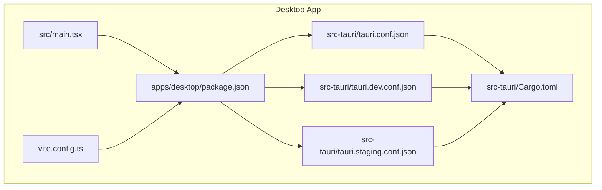
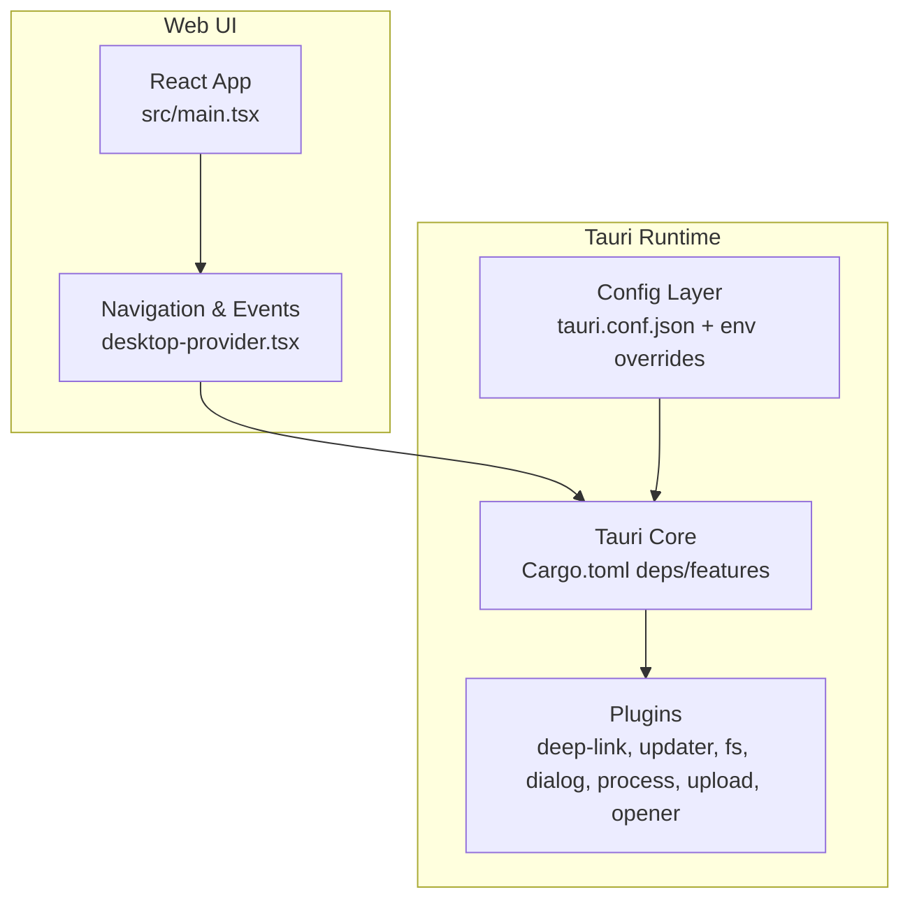
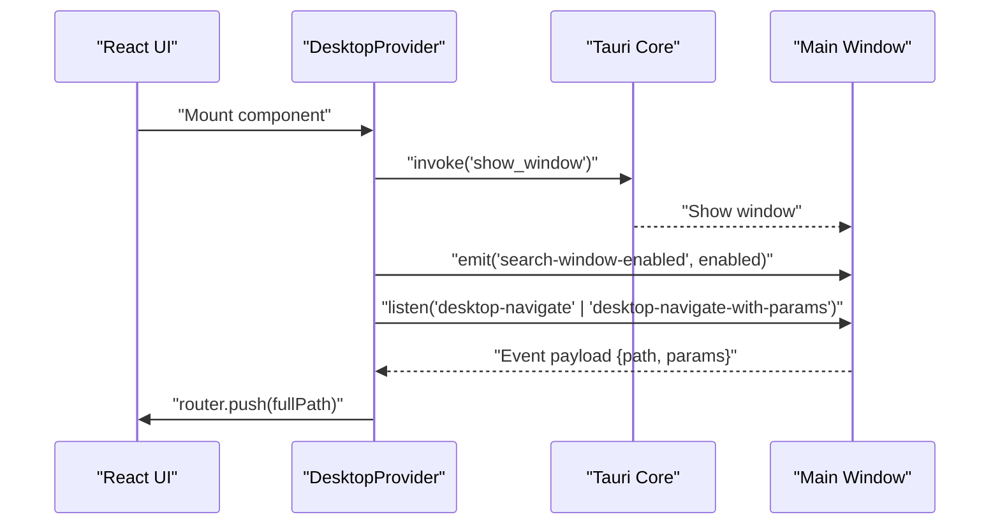
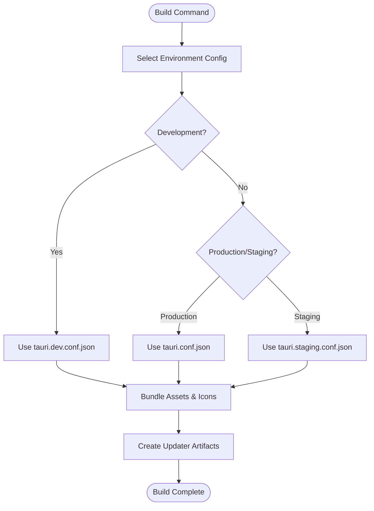
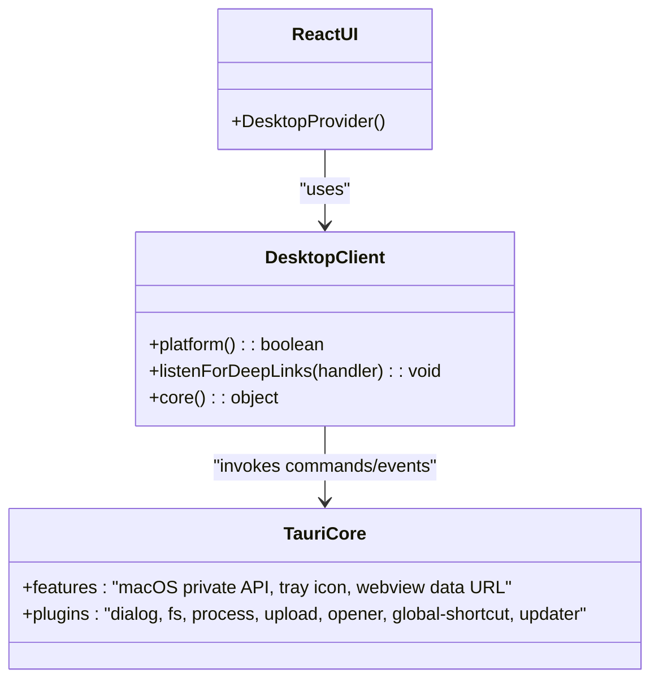
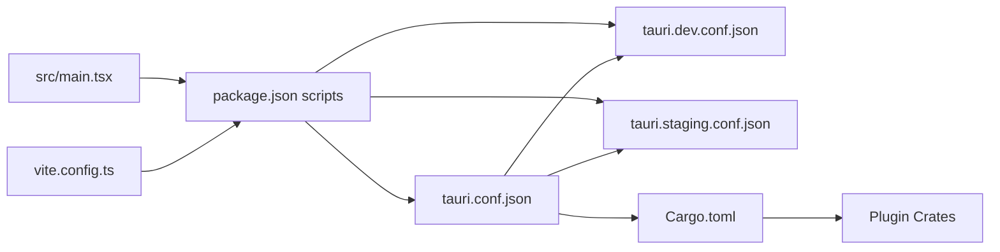

# Tauri Configuration

<cite>
**Referenced Files in This Document**
- [tauri.conf.json](file://midday/apps/desktop/src-tauri/tauri.conf.json)
- [tauri.dev.conf.json](file://midday/apps/desktop/src-tauri/tauri.dev.conf.json)
- [tauri.staging.conf.json](file://midday/apps/desktop/src-tauri/tauri.staging.conf.json)
- [Cargo.toml](file://midday/apps/desktop/src-tauri/Cargo.toml)
- [package.json](file://midday/apps/desktop/package.json)
- [vite.config.ts](file://midday/apps/desktop/vite.config.ts)
- [main.tsx](file://midday/apps/desktop/src/main.tsx)
- [desktop-provider.tsx](file://midday/apps/dashboard/src/components/desktop-provider.tsx)
</cite>

## Table of Contents
1. [Introduction](#introduction)
2. [Project Structure](#project-structure)
3. [Core Components](#core-components)
4. [Architecture Overview](#architecture-overview)
5. [Detailed Component Analysis](#detailed-component-analysis)
6. [Dependency Analysis](#dependency-analysis)
7. [Performance Considerations](#performance-considerations)
8. [Troubleshooting Guide](#troubleshooting-guide)
9. [Conclusion](#conclusion)

## Introduction
This document explains the Tauri configuration and capability management for the desktop application. It covers the tauri.conf.json configuration structure, window and system integration options, security policies, capability-based permissions, development and staging configurations, build settings, asset handling, and native API access controls. It also includes practical examples for window management, deep link handling, and navigation integration between the web UI and the Tauri backend.

## Project Structure
The desktop application is organized into:
- Tauri configuration files under src-tauri
- Frontend application under src
- Vite configuration for development and bundling
- Scripts to run and build the desktop app

**Diagram sources**
- [tauri.conf.json](file://midday/apps/desktop/src-tauri/tauri.conf.json#L1-L46)
- [tauri.dev.conf.json](file://midday/apps/desktop/src-tauri/tauri.dev.conf.json#L1-L22)
- [tauri.staging.conf.json](file://midday/apps/desktop/src-tauri/tauri.staging.conf.json#L1-L21)
- [Cargo.toml](file://midday/apps/desktop/src-tauri/Cargo.toml#L1-L40)
- [main.tsx](file://midday/apps/desktop/src/main.tsx#L1-L9)
- [vite.config.ts](file://midday/apps/desktop/vite.config.ts#L1-L32)
- [package.json](file://midday/apps/desktop/package.json#L1-L40)

**Section sources**
- [tauri.conf.json](file://midday/apps/desktop/src-tauri/tauri.conf.json#L1-L46)
- [tauri.dev.conf.json](file://midday/apps/desktop/src-tauri/tauri.dev.conf.json#L1-L22)
- [tauri.staging.conf.json](file://midday/apps/desktop/src-tauri/tauri.staging.conf.json#L1-L21)
- [Cargo.toml](file://midday/apps/desktop/src-tauri/Cargo.toml#L1-L40)
- [main.tsx](file://midday/apps/desktop/src/main.tsx#L1-L9)
- [vite.config.ts](file://midday/apps/desktop/vite.config.ts#L1-L32)
- [package.json](file://midday/apps/desktop/package.json#L1-L40)

## Core Components
- Application identity and security policy
  - Product name, identifier, macOS private API usage, prototype freezing, and CSP settings
  - Capability list enabling default capabilities
- Bundling and distribution
  - Target platforms, DMG background, icon sets, and updater artifacts
- Plugins
  - Deep link schemes per environment
  - Updater endpoint, public key, and transport settings
- Rust dependencies and features
  - Tauri core features and plugin crates for dialogs, filesystem, process, upload, opener, global shortcuts, and updater
- Web UI and build pipeline
  - Vite configuration with fixed ports and HMR for Tauri development
  - Scripts to run dev and build commands with environment-specific configs

**Section sources**
- [tauri.conf.json](file://midday/apps/desktop/src-tauri/tauri.conf.json#L1-L46)
- [Cargo.toml](file://midday/apps/desktop/src-tauri/Cargo.toml#L1-L40)
- [package.json](file://midday/apps/desktop/package.json#L1-L40)
- [vite.config.ts](file://midday/apps/desktop/vite.config.ts#L1-L32)

## Architecture Overview
The desktop app integrates a React frontend with Tauri runtime. The frontend communicates with native capabilities via Tauri commands and events. Environment-specific configurations are layered over the base configuration to tailor product branding, deep link schemes, and updater behavior.

**Diagram sources**
- [main.tsx](file://midday/apps/desktop/src/main.tsx#L1-L9)
- [desktop-provider.tsx](file://midday/apps/dashboard/src/components/desktop-provider.tsx#L1-L240)
- [tauri.conf.json](file://midday/apps/desktop/src-tauri/tauri.conf.json#L1-L46)
- [Cargo.toml](file://midday/apps/desktop/src-tauri/Cargo.toml#L1-L40)

## Detailed Component Analysis

### Tauri Configuration Structure
- Base configuration
  - Product metadata and identifiers
  - Security policy with CSP disabled and prototype freezing off
  - Capabilities list enabling default capabilities
  - Bundling targets and DMG background
  - Icon assets for multiple sizes and formats
  - Plugins for deep link and updater
- Development configuration
  - Different product name and identifier
  - Environment-specific icon set and updater artifacts disabled
  - Deep link scheme tailored for development
- Staging configuration
  - Version and staging identifier
  - Environment-specific icon set
  - Deep link scheme tailored for staging

Practical implications:
- The base configuration enables default capabilities and disables CSP modifications, allowing broader access to native APIs controlled by capabilities.
- Environment-specific configs override product branding and deep link schemes, supporting isolated development and staging workflows.

**Section sources**
- [tauri.conf.json](file://midday/apps/desktop/src-tauri/tauri.conf.json#L1-L46)
- [tauri.dev.conf.json](file://midday/apps/desktop/src-tauri/tauri.dev.conf.json#L1-L22)
- [tauri.staging.conf.json](file://midday/apps/desktop/src-tauri/tauri.staging.conf.json#L1-L21)

### Window Settings and System Integration
- Window lifecycle and visibility
  - The React component invokes a native command to show the main window after initial render, ensuring the UI appears smoothly.
  - Navigation events are handled in the main window to route deep links and internal navigation.
- Deep link handling
  - Listeners are attached in the main window to intercept deep link events and navigate accordingly.
  - Authentication callbacks and dashboard routes are supported.
- Search window state management
  - A custom event toggles search window availability depending on the current route.

**Diagram sources**
- [desktop-provider.tsx](file://midday/apps/dashboard/src/components/desktop-provider.tsx#L1-L240)

**Section sources**
- [desktop-provider.tsx](file://midday/apps/dashboard/src/components/desktop-provider.tsx#L1-L240)

### Security Policies and Capability Management
- Security policy
  - CSP is set to null and asset CSP modification is disabled, indicating explicit opt-out from automatic CSP hardening.
  - Prototype freezing is disabled, which can simplify JavaScript interop but requires careful input validation.
- Capabilities
  - The configuration enables default capabilities, which grant baseline permissions to native APIs.
  - Additional capabilities can be defined and referenced here to restrict or expand access granularly.

Recommendations:
- Use environment-specific capability sets to limit access in development and staging.
- Validate and sanitize inputs to mitigate risks from disabling CSP and prototype freezing.

**Section sources**
- [tauri.conf.json](file://midday/apps/desktop/src-tauri/tauri.conf.json#L8-L13)

### Build Settings and Asset Handling
- Build targets and bundling
  - Targets are set to all platforms, with DMG background configured for macOS installers.
  - Icons are provided in multiple resolutions and formats for cross-platform compatibility.
- Updater artifacts
  - Updater artifacts are enabled in the base configuration and disabled in the development config.
- Scripts and environment
  - Scripts use environment variables to select the appropriate config file for development and staging builds.

**Diagram sources**
- [package.json](file://midday/apps/desktop/package.json#L11-L16)
- [tauri.conf.json](file://midday/apps/desktop/src-tauri/tauri.conf.json#L15-L31)
- [tauri.dev.conf.json](file://midday/apps/desktop/src-tauri/tauri.dev.conf.json#L4-L13)
- [tauri.staging.conf.json](file://midday/apps/desktop/src-tauri/tauri.staging.conf.json#L1-L21)

**Section sources**
- [package.json](file://midday/apps/desktop/package.json#L1-L40)
- [tauri.conf.json](file://midday/apps/desktop/src-tauri/tauri.conf.json#L15-L31)
- [tauri.dev.conf.json](file://midday/apps/desktop/src-tauri/tauri.dev.conf.json#L1-L22)
- [tauri.staging.conf.json](file://midday/apps/desktop/src-tauri/tauri.staging.conf.json#L1-L21)

### Native API Access Controls
- Plugin dependencies
  - Dialog, filesystem, process, upload, opener, global shortcut, and updater plugins are declared in Cargo.toml.
- Feature flags
  - Tauri features include macOS private API, tray icon, and webview data URLs.
- Frontend usage
  - The desktop client package exports platform detection, deep link handling, and core invocations used by the React UI.

**Diagram sources**
- [Cargo.toml](file://midday/apps/desktop/src-tauri/Cargo.toml#L20-L35)
- [desktop-provider.tsx](file://midday/apps/dashboard/src/components/desktop-provider.tsx#L1-L240)

**Section sources**
- [Cargo.toml](file://midday/apps/desktop/src-tauri/Cargo.toml#L1-L40)
- [desktop-provider.tsx](file://midday/apps/dashboard/src/components/desktop-provider.tsx#L1-L240)

### Examples and Practical Guidance
- Window management
  - Show the main window after initial render using a native command.
  - Emit custom events to toggle search window availability based on route.
- Menu configuration
  - Define menus in Tauri configuration and wire them to commands invoked from the UI.
- System tray integration
  - Use tray icon features and commands to add context menus and notifications.

Note: The provided configuration files do not include explicit menu or tray definitions. These should be added to the base configuration and referenced by the UI via commands.

**Section sources**
- [desktop-provider.tsx](file://midday/apps/dashboard/src/components/desktop-provider.tsx#L1-L240)
- [tauri.conf.json](file://midday/apps/desktop/src-tauri/tauri.conf.json#L1-L46)

## Dependency Analysis
The desktop app’s configuration depends on:
- Base configuration for product identity, security, capabilities, bundling, and plugins
- Environment-specific overlays for branding and deep link schemes
- Rust crate dependencies for Tauri core and plugins
- Frontend scripts and Vite configuration for development and build

**Diagram sources**
- [tauri.conf.json](file://midday/apps/desktop/src-tauri/tauri.conf.json#L1-L46)
- [tauri.dev.conf.json](file://midday/apps/desktop/src-tauri/tauri.dev.conf.json#L1-L22)
- [tauri.staging.conf.json](file://midday/apps/desktop/src-tauri/tauri.staging.conf.json#L1-L21)
- [Cargo.toml](file://midday/apps/desktop/src-tauri/Cargo.toml#L1-L40)
- [package.json](file://midday/apps/desktop/package.json#L1-L40)
- [vite.config.ts](file://midday/apps/desktop/vite.config.ts#L1-L32)
- [main.tsx](file://midday/apps/desktop/src/main.tsx#L1-L9)

**Section sources**
- [tauri.conf.json](file://midday/apps/desktop/src-tauri/tauri.conf.json#L1-L46)
- [tauri.dev.conf.json](file://midday/apps/desktop/src-tauri/tauri.dev.conf.json#L1-L22)
- [tauri.staging.conf.json](file://midday/apps/desktop/src-tauri/tauri.staging.conf.json#L1-L21)
- [Cargo.toml](file://midday/apps/desktop/src-tauri/Cargo.toml#L1-L40)
- [package.json](file://midday/apps/desktop/package.json#L1-L40)
- [vite.config.ts](file://midday/apps/desktop/vite.config.ts#L1-L32)
- [main.tsx](file://midday/apps/desktop/src/main.tsx#L1-L9)

## Performance Considerations
- Keep CSP disabled only when necessary; consider enabling a restrictive CSP in production.
- Limit updater artifacts to production builds to reduce bundle size during development.
- Use environment-specific configs to avoid unnecessary plugin initialization in development.

## Troubleshooting Guide
- Deep link navigation not working
  - Verify the main window is active and the deep link listener is registered.
  - Confirm the deep link scheme matches the environment configuration.
- Window not appearing after launch
  - Ensure the native command to show the window is invoked in the main window context.
- Navigation events not triggering
  - Check that the main window listens for desktop navigation events and that payloads include path and optional params.

**Section sources**
- [desktop-provider.tsx](file://midday/apps/dashboard/src/components/desktop-provider.tsx#L1-L240)
- [tauri.dev.conf.json](file://midday/apps/desktop/src-tauri/tauri.dev.conf.json#L14-L20)
- [tauri.staging.conf.json](file://midday/apps/desktop/src-tauri/tauri.staging.conf.json#L13-L19)

## Conclusion
The desktop application’s Tauri configuration establishes a flexible foundation for development, staging, and production environments. By leveraging environment-specific overlays, capability-based permissions, and a clear separation between web UI and native capabilities, teams can iterate quickly while maintaining strong security posture. Extending the configuration with explicit menu and tray definitions, along with robust input validation and CSP hardening, will further strengthen the application’s reliability and safety.