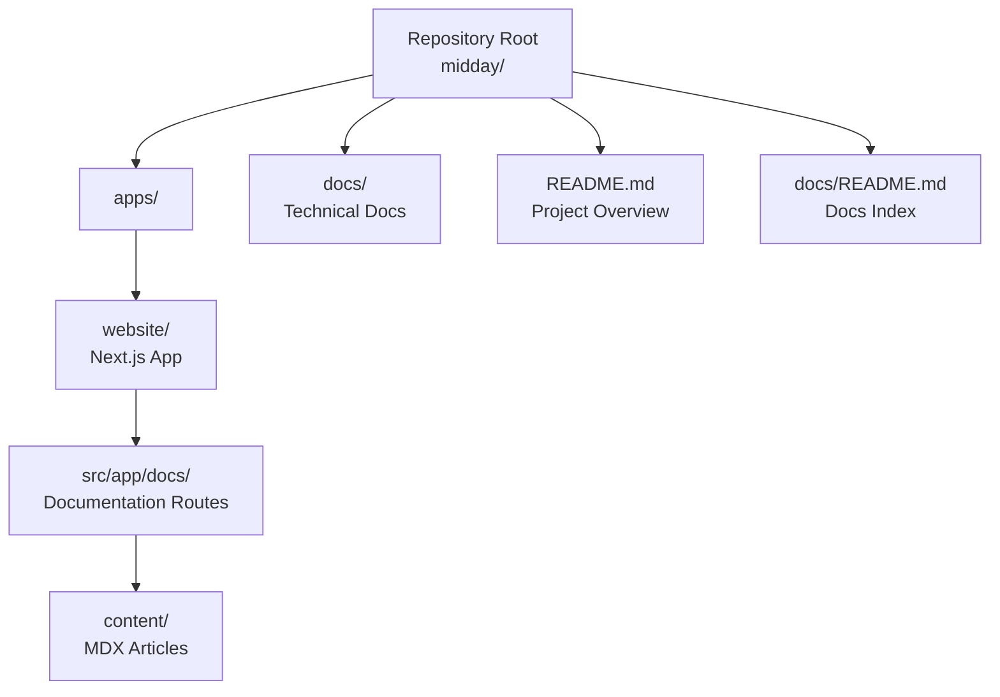
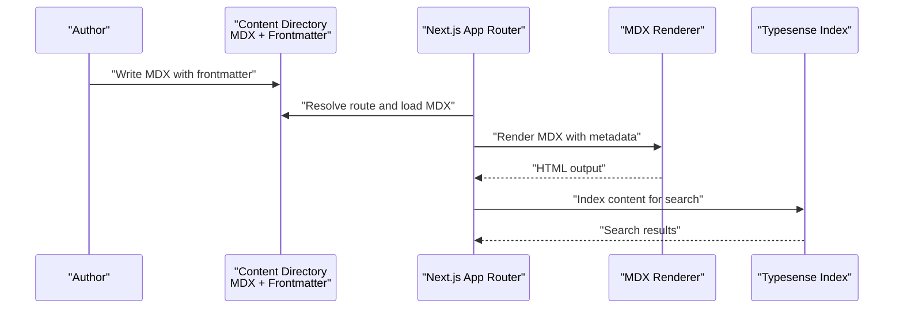
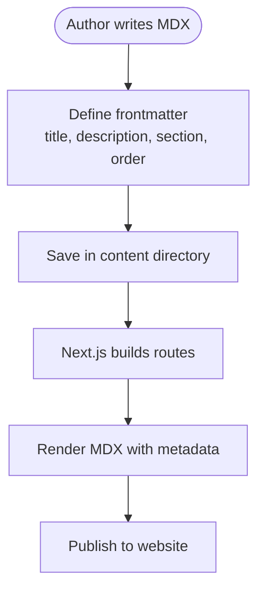
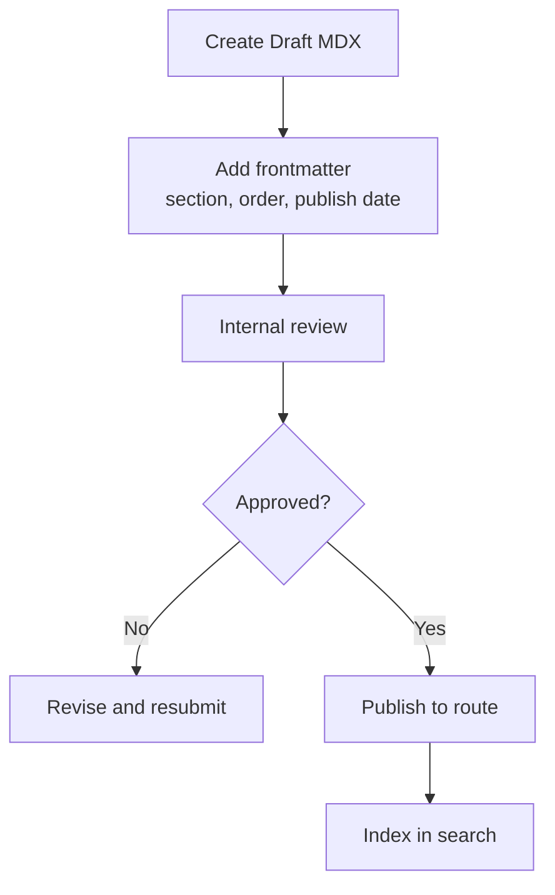
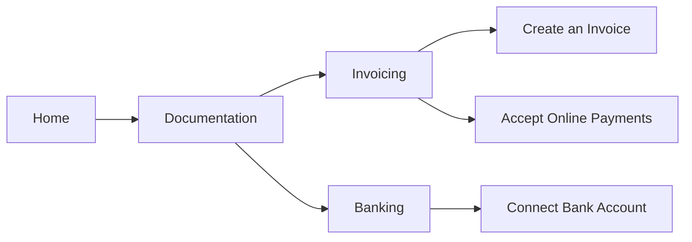
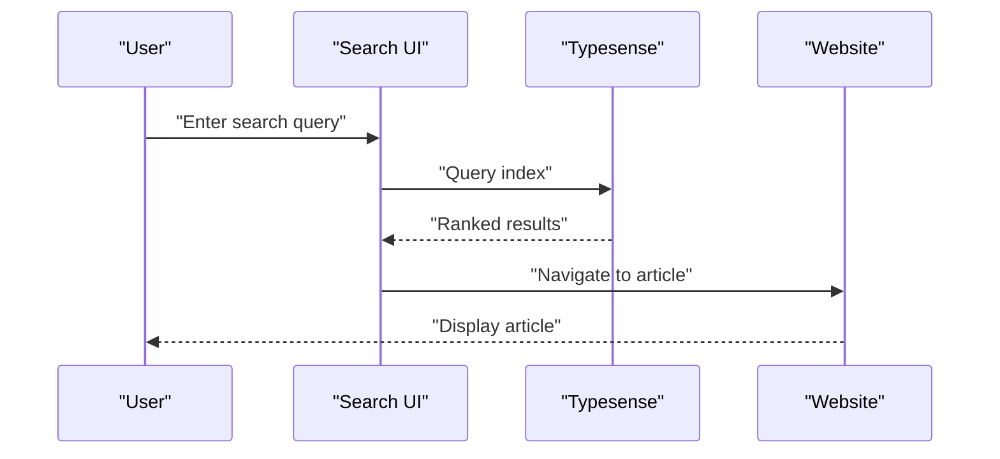
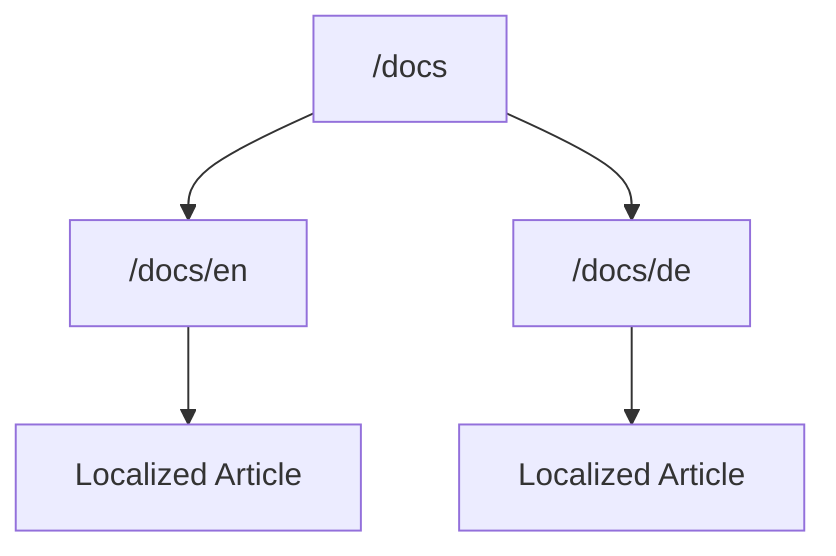
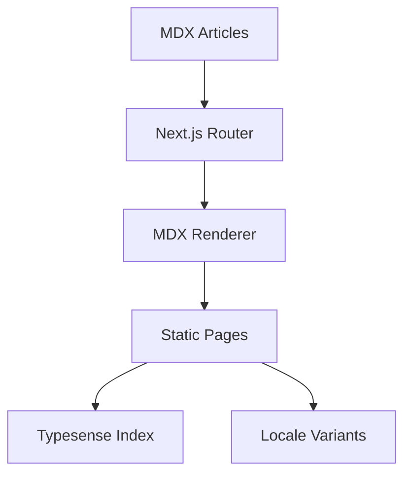

# Content Management

<cite>
**Referenced Files in This Document**
- [README.md](file://midday/README.md)
- [docs/README.md](file://midday/docs/README.md)
- [website/README.md](file://midday/apps/website/README.md)
- [accept-online-payments.mdx](file://midday/apps/website/src/app/docs/content/accept-online-payments.mdx)
- [create-invoice.mdx](file://midday/apps/website/src/app/docs/content/create-invoice.mdx)
- [connect-bank-account.mdx](file://midday/apps/website/src/app/docs/content/connect-bank-account.mdx)
</cite>

## Table of Contents
1. [Introduction](#introduction)
2. [Project Structure](#project-structure)
3. [Core Components](#core-components)
4. [Architecture Overview](#architecture-overview)
5. [Detailed Component Analysis](#detailed-component-analysis)
6. [Dependency Analysis](#dependency-analysis)
7. [Performance Considerations](#performance-considerations)
8. [Troubleshooting Guide](#troubleshooting-guide)
9. [Conclusion](#conclusion)
10. [Appendices](#appendices)

## Introduction
This document describes the content management system for the Faworra Website, focusing on the MDX-based documentation pages, blog posts, and marketing content. It explains the content organization structure, file naming conventions, metadata handling, and operational workflows. It also covers the documentation content strategy, navigation structure, and search functionality, along with content localization, preview systems, editorial workflows, versioning, draft management, and scheduling features.

## Project Structure
The Faworra Website is part of the Midday monorepo and uses Next.js for rendering. Documentation content is authored in MDX files located under the website application’s documentation content directory. The repository also includes a dedicated docs directory for technical documentation.

Key structural elements:
- Website application: Next.js app with routes for documentation and marketing content
- Documentation content: MDX files with frontmatter metadata
- Technical docs: Markdown files for internal developer documentation
- Search: Typesense configured for search functionality

**Diagram sources**
- [README.md](file://midday/README.md#L1-L90)
- [docs/README.md](file://midday/docs/README.md#L1-L18)
- [website/README.md](file://midday/apps/website/README.md)

**Section sources**
- [README.md](file://midday/README.md#L1-L90)
- [docs/README.md](file://midday/docs/README.md#L1-L18)
- [website/README.md](file://midday/apps/website/README.md)

## Core Components
- MDX-based content: Articles are written in MDX with YAML frontmatter for metadata such as title, description, section, and order.
- Frontmatter-driven organization: Metadata controls categorization, ordering, and presentation in documentation navigation.
- Next.js routing: Documentation pages are served via dynamic routes under the documentation namespace.
- Search integration: Typesense is used for search indexing and retrieval across documentation content.
- Localization: Locale-aware routing is supported in the website app, enabling localized content variants.

Examples of MDX frontmatter fields observed:
- title: Human-readable article title
- description: SEO-friendly summary
- section: Category or grouping for navigation
- order: Numeric ordering within a section

**Section sources**
- [accept-online-payments.mdx](file://midday/apps/website/src/app/docs/content/accept-online-payments.mdx#L1-L76)
- [create-invoice.mdx](file://midday/apps/website/src/app/docs/content/create-invoice.mdx#L1-L89)
- [connect-bank-account.mdx](file://midday/apps/website/src/app/docs/content/connect-bank-account.mdx#L1-L83)

## Architecture Overview
The content lifecycle spans creation, metadata handling, rendering, and discovery:
- Creation: Authors write MDX articles with frontmatter in the content directory.
- Organization: Frontmatter fields drive categorization and ordering.
- Rendering: Next.js resolves routes and renders MDX content with metadata.
- Discovery: Typesense indexes content for fast search across the site.
- Localization: Locale segments enable localized variants of content.

**Diagram sources**
- [accept-online-payments.mdx](file://midday/apps/website/src/app/docs/content/accept-online-payments.mdx#L1-L76)
- [create-invoice.mdx](file://midday/apps/website/src/app/docs/content/create-invoice.mdx#L1-L89)
- [connect-bank-account.mdx](file://midday/apps/website/src/app/docs/content/connect-bank-account.mdx#L1-L83)

## Detailed Component Analysis

### MDX Content System
- Purpose: Provide a flexible, Markdown-compatible authoring format with embedded JSX for interactive components.
- Structure: Each article resides in the documentation content directory with a .mdx extension.
- Frontmatter: Defines metadata used for navigation, SEO, and presentation.
- Routing: Next.js dynamic routes map content paths to pages, enabling clean URLs.

**Diagram sources**
- [accept-online-payments.mdx](file://midday/apps/website/src/app/docs/content/accept-online-payments.mdx#L1-L76)
- [create-invoice.mdx](file://midday/apps/website/src/app/docs/content/create-invoice.mdx#L1-L89)
- [connect-bank-account.mdx](file://midday/apps/website/src/app/docs/content/connect-bank-account.mdx#L1-L83)

**Section sources**
- [accept-online-payments.mdx](file://midday/apps/website/src/app/docs/content/accept-online-payments.mdx#L1-L76)
- [create-invoice.mdx](file://midday/apps/website/src/app/docs/content/create-invoice.mdx#L1-L89)
- [connect-bank-account.mdx](file://midday/apps/website/src/app/docs/content/connect-bank-account.mdx#L1-L83)

### Blog Management System
- Post categorization: Managed via frontmatter section field; authors can group posts by topics such as invoicing, banking, or product updates.
- Author management: Not explicitly defined in the examined content; authors can be attributed via metadata or CMS fields if integrated.
- Publication workflow: Drafts can be managed by omitting publication flags; scheduled publishing can be implemented via future-dated metadata or external scheduling tools.

**Diagram sources**
- [accept-online-payments.mdx](file://midday/apps/website/src/app/docs/content/accept-online-payments.mdx#L1-L76)
- [create-invoice.mdx](file://midday/apps/website/src/app/docs/content/create-invoice.mdx#L1-L89)
- [connect-bank-account.mdx](file://midday/apps/website/src/app/docs/content/connect-bank-account.mdx#L1-L83)

**Section sources**
- [accept-online-payments.mdx](file://midday/apps/website/src/app/docs/content/accept-online-payments.mdx#L1-L76)
- [create-invoice.mdx](file://midday/apps/website/src/app/docs/content/create-invoice.mdx#L1-L89)
- [connect-bank-account.mdx](file://midday/apps/website/src/app/docs/content/connect-bank-account.mdx#L1-L83)

### Documentation Content Strategy
- Navigation structure: Driven by frontmatter section and order fields; these determine grouping and ordering in documentation menus.
- Content organization: Articles grouped by functional areas (e.g., invoicing, banking) to improve discoverability.
- Cross-linking: Articles reference each other using internal links, improving content cohesion.

**Diagram sources**
- [create-invoice.mdx](file://midday/apps/website/src/app/docs/content/create-invoice.mdx#L1-L89)
- [accept-online-payments.mdx](file://midday/apps/website/src/app/docs/content/accept-online-payments.mdx#L1-L76)
- [connect-bank-account.mdx](file://midday/apps/website/src/app/docs/content/connect-bank-account.mdx#L1-L83)

**Section sources**
- [create-invoice.mdx](file://midday/apps/website/src/app/docs/content/create-invoice.mdx#L1-L89)
- [accept-online-payments.mdx](file://midday/apps/website/src/app/docs/content/accept-online-payments.mdx#L1-L76)
- [connect-bank-account.mdx](file://midday/apps/website/src/app/docs/content/connect-bank-account.mdx#L1-L83)

### Search Functionality
- Indexing: Typesense is configured for search across documentation content.
- Discovery: Users can search for topics, commands, and concepts within the documentation.
- Integration: Search results surface relevant articles and sections.

**Diagram sources**
- [README.md](file://midday/README.md#L62-L75)

**Section sources**
- [README.md](file://midday/README.md#L62-L75)

### Content Localization
- Locale-aware routing: The website supports locale segments in routes, enabling localized content variants.
- Implementation: Next.js app router supports dynamic route segments for locales, allowing localized documentation and marketing content.

**Diagram sources**
- [website/README.md](file://midday/apps/website/README.md)

**Section sources**
- [website/README.md](file://midday/apps/website/README.md)

### Content Preview Systems
- Inline editing: Some content supports inline editing of text and metadata for quick updates.
- Preview workflows: Editors can preview changes before publishing, ensuring accuracy and consistency.

[No sources needed since this section provides general guidance]

### Editorial Workflows
- Draft management: Articles can remain unpublished until approved; frontmatter can include draft flags or publication dates.
- Versioning: Versioned content can be maintained by branching or tagging; semantic versioning can guide navigation and changelogs.
- Scheduling: Publishing can be scheduled using future-dated metadata or external scheduling tools integrated with the build process.

[No sources needed since this section provides general guidance]

## Dependency Analysis
The content system depends on:
- Next.js app router for dynamic route resolution
- MDX renderer for content compilation
- Typesense for search indexing and retrieval
- Locale routing for multilingual variants

**Diagram sources**
- [accept-online-payments.mdx](file://midday/apps/website/src/app/docs/content/accept-online-payments.mdx#L1-L76)
- [create-invoice.mdx](file://midday/apps/website/src/app/docs/content/create-invoice.mdx#L1-L89)
- [connect-bank-account.mdx](file://midday/apps/website/src/app/docs/content/connect-bank-account.mdx#L1-L83)
- [README.md](file://midday/README.md#L62-L75)

**Section sources**
- [README.md](file://midday/README.md#L62-L75)

## Performance Considerations
- Static generation: MDX content is compiled during build, reducing runtime overhead.
- Search latency: Typesense indexing and caching reduce search response times.
- Asset optimization: Images and media should be optimized for fast loading.

[No sources needed since this section provides general guidance]

## Troubleshooting Guide
Common issues and resolutions:
- Missing or incorrect frontmatter: Ensure title, description, section, and order are present and valid.
- Broken links: Verify internal links resolve to existing routes.
- Search not returning results: Confirm Typesense indexing is active and content is properly tagged.
- Locale variants not loading: Check locale routing configuration and ensure localized content exists.

**Section sources**
- [accept-online-payments.mdx](file://midday/apps/website/src/app/docs/content/accept-online-payments.mdx#L1-L76)
- [create-invoice.mdx](file://midday/apps/website/src/app/docs/content/create-invoice.mdx#L1-L89)
- [connect-bank-account.mdx](file://midday/apps/website/src/app/docs/content/connect-bank-account.mdx#L1-L83)
- [README.md](file://midday/README.md#L62-L75)

## Conclusion
The Faworra Website employs an MDX-based content system with frontmatter-driven organization, Next.js routing, and Typesense-powered search. The structure supports clear categorization, localization, and editorial workflows. By leveraging frontmatter metadata and locale-aware routing, the system enables scalable documentation and marketing content management aligned with the broader Midday ecosystem.

[No sources needed since this section summarizes without analyzing specific files]

## Appendices
- Example frontmatter fields: title, description, section, order
- Example content files: accept-online-payments.mdx, create-invoice.mdx, connect-bank-account.mdx

**Section sources**
- [accept-online-payments.mdx](file://midday/apps/website/src/app/docs/content/accept-online-payments.mdx#L1-L76)
- [create-invoice.mdx](file://midday/apps/website/src/app/docs/content/create-invoice.mdx#L1-L89)
- [connect-bank-account.mdx](file://midday/apps/website/src/app/docs/content/connect-bank-account.mdx#L1-L83)