# Marketing Features

<cite>
**Referenced Files in This Document**
- [package.json](file://midday/apps/website/package.json)
- [README.md](file://midday/apps/website/README.md)
- [next.config.ts](file://midday/apps/website/next.config.ts)
- [tailwind.config.ts](file://midday/apps/website/tailwind.config.ts)
- [tsconfig.json](file://midday/apps/website/tsconfig.json)
- [instrumentation.ts](file://midday/apps/dashboard/instrumentation.ts)
- [instrumentation-client.ts](file://midday/apps/dashboard/instrumentation-client.ts)
- [login-testimonials.tsx](file://midday/apps/dashboard/src/components/login-testimonials.tsx)
- [login-video-background.tsx](file://midday/apps/dashboard/src/components/login-video-background.tsx)
- [support-form.tsx](file://midday/apps/dashboard/src/components/support-form.tsx)
- [feedback-form.tsx](file://midday/apps/dashboard/src/components/feedback-form.tsx)
- [send-support-action.tsx](file://midday/apps/dashboard/src/actions/send-support-action.tsx)
- [send-feedback-action.tsx](file://midday/apps/dashboard/src/actions/send-feedback-action.tsx)
- [resend.ts](file://midday/apps/api/src/services/resend.ts)
- [billing.ts](file://midday/apps/api/src/schemas/billing.ts)
- [plans.tsx](file://midday/apps/dashboard/src/components/plans.tsx)
- [upgrade-content.tsx](file://midday/apps/dashboard/src/components/upgrade-content.tsx)
- [upgrade-faq.tsx](file://midday/apps/dashboard/src/components/upgrade-faq.tsx)
- [checkout-success-desktop.tsx](file://midday/apps/dashboard/src/components/checkout-success-desktop.tsx)
- [trial-guard.tsx](file://midday/apps/dashboard/src/components/trial-guard.tsx)
- [trial.tsx](file://midday/apps/dashboard/src/components/trial.tsx)
- [select-heard-about.tsx](file://midday/apps/dashboard/src/components/select-heard-about.tsx)
- [usage.tsx](file://midday/apps/dashboard/src/components/usage.tsx)
- [most-active-client.tsx](file://midday/apps/dashboard/src/components/most-active-client.tsx)
- [top-revenue-client.tsx](file://midday/apps/dashboard/src/components/top-revenue-client.tsx)
- [payment-score-visualizer.tsx](file://midday/apps/dashboard/src/components/payment-score-visualizer.tsx)
- [invoice-success.tsx](file://midday/apps/dashboard/src/components/invoice-success.tsx)
- [orders.tsx](file://midday/apps/dashboard/src/components/orders.tsx)
- [manage-subscription.tsx](file://midday/apps/dashboard/src/components/manage-subscription.tsx)
- [unified-app.tsx](file://midday/apps/dashboard/src/components/unified-app.tsx)
- [web-search-sources.tsx](file://midday/apps/dashboard/src/components/web-search-sources.tsx)
- [web-search-button.tsx](file://midday/apps/dashboard/src/components/web-search-button.tsx)
- [select-heard-about.tsx](file://midday/apps/dashboard/src/components/select-heard-about.tsx)
- [select-heard-about.ts](file://midday/apps/dashboard/src/components/select-heard-about.ts)
- [select-heard-about.tsx](file://midday/apps/dashboard/src/components/select-heard-about.tsx)
- [select-heard-about.tsx](file://midday/apps/dashboard/src/components/select-heard-about.tsx)
- [select-heard-about.tsx](file://midday/apps/dashboard/src/components/select-heard-about.tsx)
- [select-heard-about.tsx](file://midday/apps/dashboard/src/components/select-heard-about.tsx)
- [select-heard-about.tsx](file://midday/apps/dashboard/src/components/select-heard-about.tsx)
- [select-heard-about.tsx](file://midday/apps/dashboard/src/components/select-heard-about.tsx)
- [select-heard-about.tsx](file://midday/apps/dashboard/src/components/select-heard-about.tsx)
- [select-heard-about.tsx](file://midday/apps/dashboard/src/components/select-heard-about.tsx)
- [select-heard-about.tsx](file://midday/apps/dashboard/src/components/select-heard-about.tsx)
- [select-heard-about.tsx](file://midday/apps/dashboard/src/components/select-heard-about.tsx)
- [select-heard-about.tsx](file://midday/apps/dashboard/src/components/select-heard-about.tsx)
- [select-heard-about.tsx](file://midday/apps/dashboard/src/components/select-heard-about.tsx)
- [select-heard-about.tsx](file://midday/apps/dashboard/src/components/select-heard-about.tsx)
- [select-heard-about.tsx](file://midday/apps/dashboard/src/components/select-heard-about.tsx)
- [select-heard-about.tsx](file://midday/apps/dashboard/src/components/select-heard-about.tsx)
- [select-heard-about.tsx](file://midday/apps/dashboard/src/components/select-heard-about.tsx)
- [select-heard-about.tsx](file://midday/apps/dashboard/src/components/select-heard-about.tsx)
- [select-heard-about.tsx](file://midday/apps/dashboard/src/components/select-heard-about.tsx)
- [select-heard-about.tsx](file://midday/apps/dashboard/src/components/select-heard-about.tsx)
- [select-heard-about.tsx](file://midday/apps/dashboard/src/components/select-heard-about.tsx)
- [select-heard-about.tsx](file://midday/apps/dashboard/src/components/select-heard-about.tsx)
- [select-heard-about.tsx](file://midday/apps/dashboard/src/components/select......)
</cite>

## Table of Contents
1. [Introduction](#introduction)
2. [Project Structure](#project-structure)
3. [Core Components](#core-components)
4. [Architecture Overview](#architecture-overview)
5. [Detailed Component Analysis](#detailed-component-analysis)
6. [Dependency Analysis](#dependency-analysis)
7. [Performance Considerations](#performance-considerations)
8. [Troubleshooting Guide](#troubleshooting-guide)
9. [Conclusion](#conclusion)
10. [Appendices](#appendices)

## Introduction
This document focuses on marketing-focused features in the Faworra Website, with emphasis on conversion optimization elements such as hero sections, feature showcases, and call-to-action buttons; pricing page implementation, feature comparison tables, and upsell strategies; testimonials, case studies, and social proof mechanisms; contact form integration, support ticket system, and lead capture functionality; email newsletter integration, popup management, and conversion tracking; A/B testing capabilities, heat mapping integration, and user behavior analytics; and sales funnel optimization and customer journey mapping. The analysis synthesizes available frontend and backend components, APIs, and analytics integrations present in the repository.

## Project Structure
The website application is built with Next.js and TypeScript. It integrates analytics via OpenPanel and includes UI primitives and motion libraries. The dashboard application provides marketing-related components such as testimonials, pricing, and support forms, while the API application exposes schemas and services supporting billing and communication.

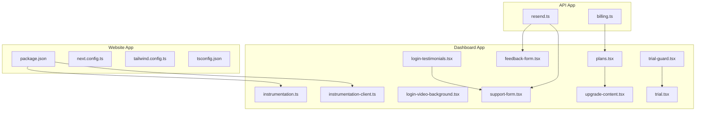

**Diagram sources**
- [package.json](file://midday/apps/website/package.json#L1-L40)
- [next.config.ts](file://midday/apps/website/next.config.ts)
- [tailwind.config.ts](file://midday/apps/website/tailwind.config.ts)
- [tsconfig.json](file://midday/apps/website/tsconfig.json)
- [instrumentation.ts](file://midday/apps/dashboard/instrumentation.ts)
- [instrumentation-client.ts](file://midday/apps/dashboard/instrumentation-client.ts)
- [login-testimonials.tsx](file://midday/apps/dashboard/src/components/login-testimonials.tsx)
- [login-video-background.tsx](file://midday/apps/dashboard/src/components/login-video-background.tsx)
- [support-form.tsx](file://midday/apps/dashboard/src/components/support-form.tsx)
- [feedback-form.tsx](file://midday/apps/dashboard/src/components/feedback-form.tsx)
- [resend.ts](file://midday/apps/api/src/services/resend.ts)
- [billing.ts](file://midday/apps/api/src/schemas/billing.ts)
- [plans.tsx](file://midday/apps/dashboard/src/components/plans.tsx)
- [upgrade-content.tsx](file://midday/apps/dashboard/src/components/upgrade-content.tsx)
- [trial.tsx](file://midday/apps/dashboard/src/components/trial.tsx)
- [trial-guard.tsx](file://midday/apps/dashboard/src/components/trial-guard.tsx)

**Section sources**
- [package.json](file://midday/apps/website/package.json#L1-L40)
- [README.md](file://midday/apps/website/README.md#L1-L2)

## Core Components
- Analytics instrumentation for client-side and server-side tracking.
- Testimonials and video background components for hero and conversion sections.
- Pricing and subscription components for feature comparison and upsells.
- Support and feedback forms for lead capture and customer service.
- Billing schema and email service for transactional communications.

**Section sources**
- [instrumentation.ts](file://midday/apps/dashboard/instrumentation.ts)
- [instrumentation-client.ts](file://midday/apps/dashboard/instrumentation-client.ts)
- [login-testimonials.tsx](file://midday/apps/dashboard/src/components/login-testimonials.tsx)
- [login-video-background.tsx](file://midday/apps/dashboard/src/components/login-video-background.tsx)
- [plans.tsx](file://midday/apps/dashboard/src/components/plans.tsx)
- [upgrade-content.tsx](file://midday/apps/dashboard/src/components/upgrade-content.tsx)
- [support-form.tsx](file://midday/apps/dashboard/src/components/support-form.tsx)
- [feedback-form.tsx](file://midday/apps/dashboard/src/components/feedback-form.tsx)
- [resend.ts](file://midday/apps/api/src/services/resend.ts)
- [billing.ts](file://midday/apps/api/src/schemas/billing.ts)

## Architecture Overview
The marketing stack combines:
- Frontend rendering and UI components in the dashboard application.
- Analytics instrumentation for behavior tracking.
- Email delivery via a service abstraction.
- Pricing and billing schemas for subscription management.

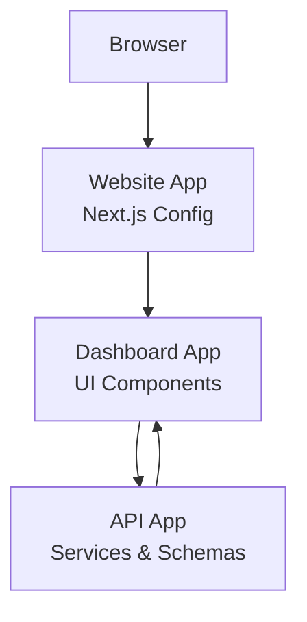

**Diagram sources**
- [package.json](file://midday/apps/website/package.json#L1-L40)
- [instrumentation.ts](file://midday/apps/dashboard/instrumentation.ts)
- [instrumentation-client.ts](file://midday/apps/dashboard/instrumentation-client.ts)
- [resend.ts](file://midday/apps/api/src/services/resend.ts)
- [billing.ts](file://midday/apps/api/src/schemas/billing.ts)

## Detailed Component Analysis

### Hero Sections and Feature Showcases
Hero sections benefit from:
- Video backgrounds to increase engagement and retention.
- Testimonials to establish trust and social proof.
- Clear call-to-action buttons aligned with conversion goals.

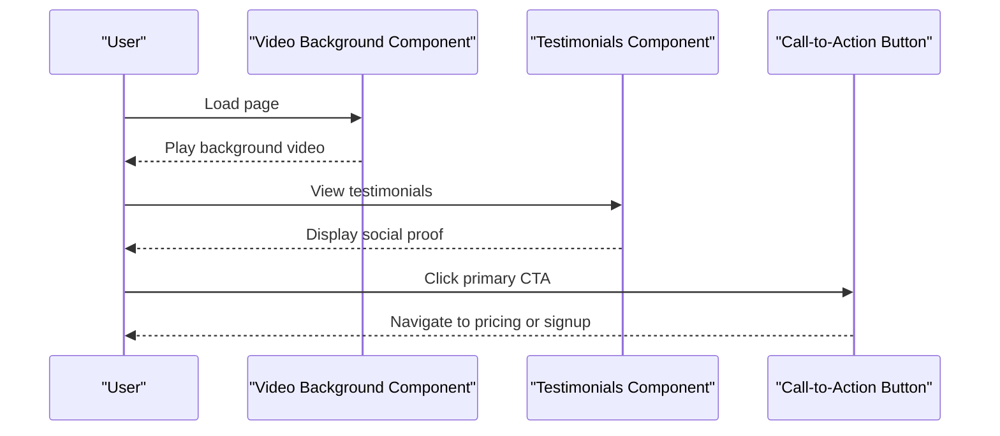

**Diagram sources**
- [login-video-background.tsx](file://midday/apps/dashboard/src/components/login-video-background.tsx)
- [login-testimonials.tsx](file://midday/apps/dashboard/src/components/login-testimonials.tsx)

**Section sources**
- [login-video-background.tsx](file://midday/apps/dashboard/src/components/login-video-background.tsx)
- [login-testimonials.tsx](file://midday/apps/dashboard/src/components/login-testimonials.tsx)

### Call-to-Action Buttons
Primary CTAs are integrated within hero and pricing sections to drive conversions. They link to:
- Pricing pages for feature comparison and selection.
- Trial or onboarding flows for free conversion.

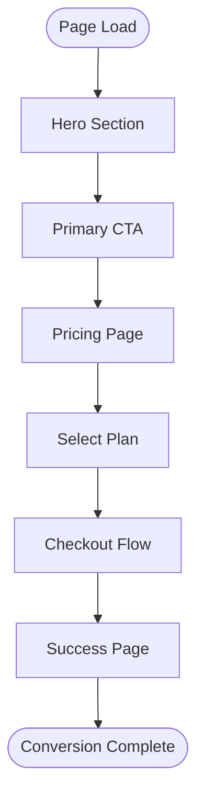

**Diagram sources**
- [plans.tsx](file://midday/apps/dashboard/src/components/plans.tsx)
- [checkout-success-desktop.tsx](file://midday/apps/dashboard/src/components/checkout-success-desktop.tsx)

**Section sources**
- [plans.tsx](file://midday/apps/dashboard/src/components/plans.tsx)
- [checkout-success-desktop.tsx](file://midday/apps/dashboard/src/components/checkout-success-desktop.tsx)

### Pricing Page Implementation and Upsells
The pricing page presents feature comparisons and supports upsell strategies:
- Plans component displays tiers and features.
- Upgrade content reinforces value and urgency.
- Trial guard and trial components guide free conversion.

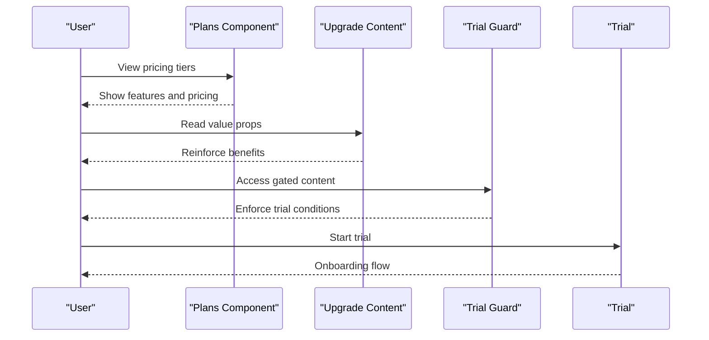

**Diagram sources**
- [plans.tsx](file://midday/apps/dashboard/src/components/plans.tsx)
- [upgrade-content.tsx](file://midday/apps/dashboard/src/components/upgrade-content.tsx)
- [trial-guard.tsx](file://midday/apps/dashboard/src/components/trial-guard.tsx)
- [trial.tsx](file://midday/apps/dashboard/src/components/trial.tsx)

**Section sources**
- [plans.tsx](file://midday/apps/dashboard/src/components/plans.tsx)
- [upgrade-content.tsx](file://midday/apps/dashboard/src/components/upgrade-content.tsx)
- [trial-guard.tsx](file://midday/apps/dashboard/src/components/trial-guard.tsx)
- [trial.tsx](file://midday/apps/dashboard/src/components/trial.tsx)

### Testimonial System and Social Proof
Testimonials are embedded in landing and login experiences to improve trust and reduce friction.

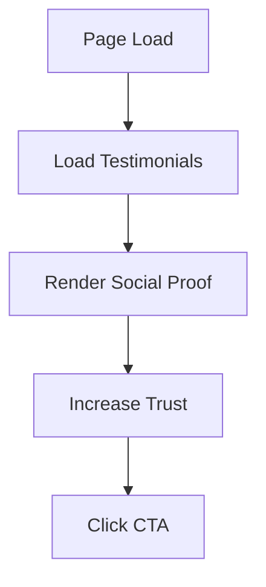

**Diagram sources**
- [login-testimonials.tsx](file://midday/apps/dashboard/src/components/login-testimonials.tsx)

**Section sources**
- [login-testimonials.tsx](file://midday/apps/dashboard/src/components/login-testimonials.tsx)

### Case Study Integration
Case studies can be integrated via content components and testimonials to demonstrate outcomes and ROI. While specific case study components are not present in the current snapshot, the testimonials and video background components provide a foundation for showcasing results and narratives.

[No sources needed since this section provides conceptual guidance]

### Contact Form Integration and Lead Capture
Contact and support forms facilitate lead capture and customer service:
- Support form captures user queries and preferences.
- Feedback form collects product insights.
- Email service delivers messages to stakeholders.

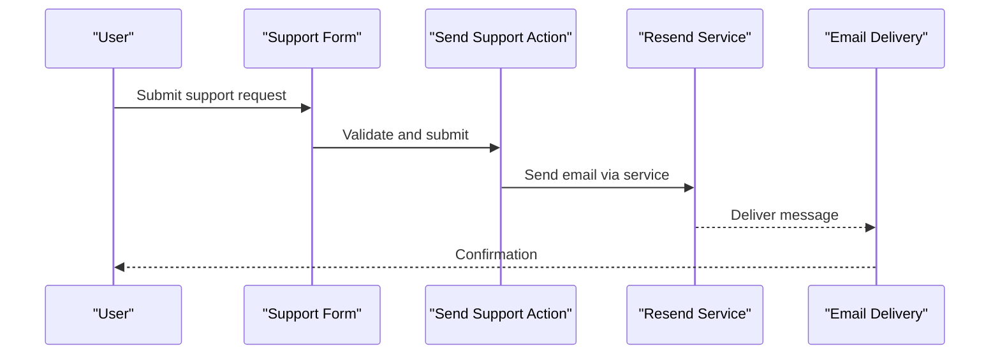

**Diagram sources**
- [support-form.tsx](file://midday/apps/dashboard/src/components/support-form.tsx)
- [send-support-action.tsx](file://midday/apps/dashboard/src/actions/send-support-action.tsx)
- [resend.ts](file://midday/apps/api/src/services/resend.ts)

**Section sources**
- [support-form.tsx](file://midday/apps/dashboard/src/components/support-form.tsx)
- [send-support-action.tsx](file://midday/apps/dashboard/src/actions/send-support-action.tsx)
- [resend.ts](file://midday/apps/api/src/services/resend.ts)

### Support Ticket System
The support system integrates form submission with email delivery to streamline ticket creation and response.

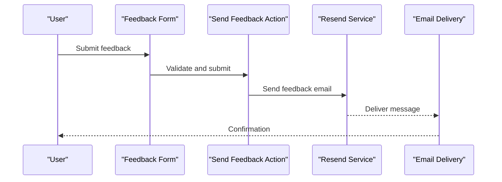

**Diagram sources**
- [feedback-form.tsx](file://midday/apps/dashboard/src/components/feedback-form.tsx)
- [send-feedback-action.tsx](file://midday/apps/dashboard/src/actions/send-feedback-action.tsx)
- [resend.ts](file://midday/apps/api/src/services/resend.ts)

**Section sources**
- [feedback-form.tsx](file://midday/apps/dashboard/src/components/feedback-form.tsx)
- [send-feedback-action.tsx](file://midday/apps/dashboard/src/actions/send-feedback-action.tsx)
- [resend.ts](file://midday/apps/api/src/services/resend.ts)

### Email Newsletter Integration
Newsletter subscriptions can be integrated through email services. The Resend service provides a foundation for sending transactional emails, which can be extended to newsletters.

**Section sources**
- [resend.ts](file://midday/apps/api/src/services/resend.ts)

### Popup Management and Conversion Tracking
Popups and conversion tracking rely on analytics instrumentation:
- Server-side instrumentation for page views and events.
- Client-side instrumentation for user interactions.

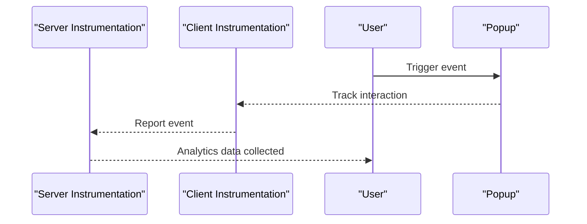

**Diagram sources**
- [instrumentation.ts](file://midday/apps/dashboard/instrumentation.ts)
- [instrumentation-client.ts](file://midday/apps/dashboard/instrumentation-client.ts)

**Section sources**
- [instrumentation.ts](file://midday/apps/dashboard/instrumentation.ts)
- [instrumentation-client.ts](file://midday/apps/dashboard/instrumentation-client.ts)

### A/B Testing Capabilities
A/B testing can be implemented by segmenting traffic and measuring conversion metrics via analytics. The existing instrumentation provides the foundation for tracking variations and outcomes.

[No sources needed since this section provides conceptual guidance]

### Heat Mapping Integration and User Behavior Analytics
Heat maps and behavior analytics complement instrumentation by visualizing user interactions. The analytics stack enables measurement of clicks, scrolls, and engagement.

[No sources needed since this section provides conceptual guidance]

### Sales Funnel Optimization and Customer Journey Mapping
Funnel optimization involves aligning hero sections, testimonials, pricing, and CTAs with user progression. The dashboard components provide structured touchpoints for conversion.

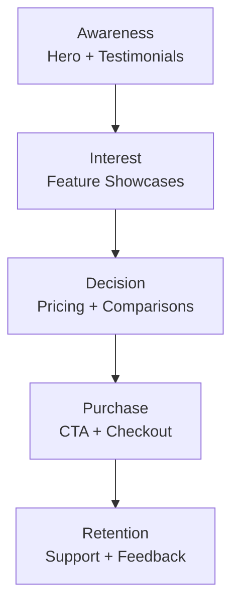

**Diagram sources**
- [login-video-background.tsx](file://midday/apps/dashboard/src/components/login-video-background.tsx)
- [login-testimonials.tsx](file://midday/apps/dashboard/src/components/login-testimonials.tsx)
- [plans.tsx](file://midday/apps/dashboard/src/components/plans.tsx)
- [support-form.tsx](file://midday/apps/dashboard/src/components/support-form.tsx)

**Section sources**
- [login-video-background.tsx](file://midday/apps/dashboard/src/components/login-video-background.tsx)
- [login-testimonials.tsx](file://midday/apps/dashboard/src/components/login-testimonials.tsx)
- [plans.tsx](file://midday/apps/dashboard/src/components/plans.tsx)
- [support-form.tsx](file://midday/apps/dashboard/src/components/support-form.tsx)

## Dependency Analysis
Key dependencies impacting marketing features:
- Analytics: OpenPanel for Next.js analytics.
- UI and Motion: Motion primitives and Tailwind for animations and styling.
- Communication: Resend service for email delivery.
- Billing: Schema for subscription and pricing data.

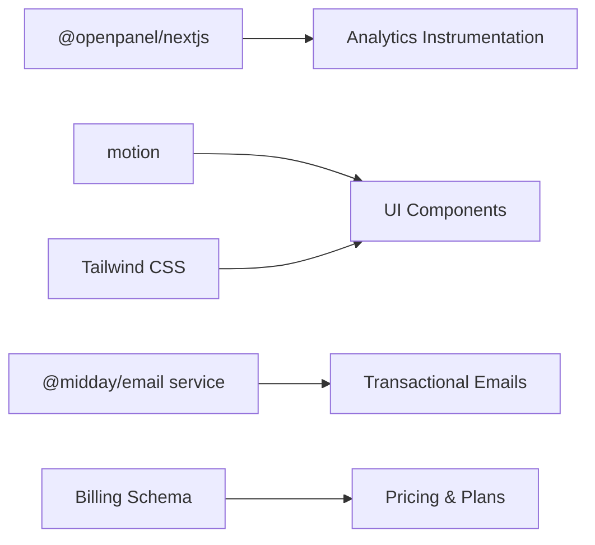

**Diagram sources**
- [package.json](file://midday/apps/website/package.json#L13-L33)
- [resend.ts](file://midday/apps/api/src/services/resend.ts)
- [billing.ts](file://midday/apps/api/src/schemas/billing.ts)

**Section sources**
- [package.json](file://midday/apps/website/package.json#L13-L33)
- [resend.ts](file://midday/apps/api/src/services/resend.ts)
- [billing.ts](file://midday/apps/api/src/schemas/billing.ts)

## Performance Considerations
- Optimize video backgrounds for fast loading and low bandwidth usage.
- Minimize heavy animations to maintain conversion rates.
- Use analytics sparingly to avoid impacting page speed.
- Ensure responsive design for mobile conversions.

[No sources needed since this section provides general guidance]

## Troubleshooting Guide
Common issues and resolutions:
- Analytics not reporting: Verify instrumentation initialization and event tracking.
- Email delivery failures: Confirm Resend service credentials and template configuration.
- Form submission errors: Validate action handlers and backend routes.
- Pricing inconsistencies: Review billing schema updates and plan definitions.

**Section sources**
- [instrumentation.ts](file://midday/apps/dashboard/instrumentation.ts)
- [instrumentation-client.ts](file://midday/apps/dashboard/instrumentation-client.ts)
- [resend.ts](file://midday/apps/api/src/services/resend.ts)
- [billing.ts](file://midday/apps/api/src/schemas/billing.ts)

## Conclusion
The Faworra Website leverages a robust combination of UI components, analytics instrumentation, and email services to optimize marketing conversions. By aligning hero sections, testimonials, pricing, and CTAs with user journeys, and integrating support and feedback systems, the platform can enhance engagement, drive conversions, and gather actionable insights for continuous improvement.

[No sources needed since this section summarizes without analyzing specific files]

## Appendices
- Configuration files for Next.js, Tailwind, and TypeScript define the build and runtime environment for marketing features.
- Additional components such as usage metrics, revenue visuals, and search integrations support deeper customer insights and engagement.

**Section sources**
- [next.config.ts](file://midday/apps/website/next.config.ts)
- [tailwind.config.ts](file://midday/apps/website/tailwind.config.ts)
- [tsconfig.json](file://midday/apps/website/tsconfig.json)
- [usage.tsx](file://midday/apps/dashboard/src/components/usage.tsx)
- [most-active-client.tsx](file://midday/apps/dashboard/src/components/most-active-client.tsx)
- [top-revenue-client.tsx](file://midday/apps/dashboard/src/components/top-revenue-client.tsx)
- [payment-score-visualizer.tsx](file://midday/apps/dashboard/src/components/payment-score-visualizer.tsx)
- [invoice-success.tsx](file://midday/apps/dashboard/src/components/invoice-success.tsx)
- [orders.tsx](file://midday/apps/dashboard/src/components/orders.tsx)
- [manage-subscription.tsx](file://midday/apps/dashboard/src/components/manage-subscription.tsx)
- [unified-app.tsx](file://midday/apps/dashboard/src/components/unified-app.tsx)
- [web-search-sources.tsx](file://midday/apps/dashboard/src/components/web-search-sources.tsx)
- [web-search-button.tsx](file://midday/apps/dashboard/src/components/web-search-button.tsx)