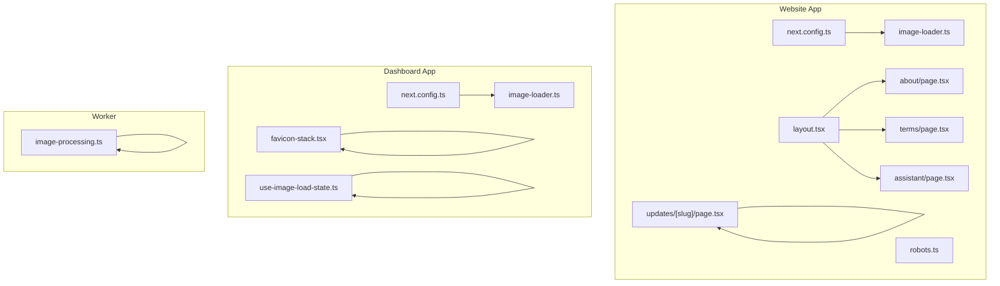
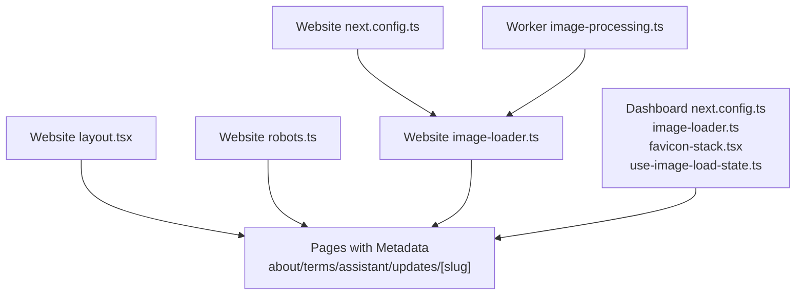
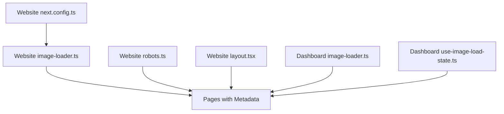

# SEO & Performance

<cite>
**Referenced Files in This Document**
- [next.config.ts](file://midday/apps/website/next.config.ts)
- [vercel.json](file://midday/apps/website/vercel.json)
- [image-loader.ts](file://midday/apps/website/image-loader.ts)
- [layout.tsx](file://midday/apps/website/src/app/layout.tsx)
- [robots.ts](file://midday/apps/website/src/app/robots.ts)
- [page.tsx](file://midday/apps/website/src/app/about/page.tsx)
- [page.tsx](file://midday/apps/website/src/app/terms/page.tsx)
- [page.tsx](file://midday/apps/website/src/app/assistant/page.tsx)
- [page.tsx](file://midday/apps/website/src/app/updates/[slug]/page.tsx)
- [next.config.ts](file://midday/apps/dashboard/next.config.ts)
- [image-loader.ts](file://midday/apps/dashboard/image-loader.ts)
- [favicon-stack.tsx](file://midday/apps/dashboard/src/components/favicon-stack.tsx)
- [use-image-load-state.ts](file://midday/apps/dashboard/src/hooks/use-image-load-state.ts)
- [invoice-schema.tsx](file://midday/packages/email/components/invoice-schema.tsx)
- [schema.ts](file://midday/packages/customers/src/enrichment/schema.ts)
- [image-processing.ts](file://midday/apps/worker/src/utils/image-processing.ts)
- [use-scroll-header.ts](file://midday/apps/dashboard/src/hooks/use-scroll-header.ts)
</cite>

## Table of Contents
1. [Introduction](#introduction)
2. [Project Structure](#project-structure)
3. [Core Components](#core-components)
4. [Architecture Overview](#architecture-overview)
5. [Detailed Component Analysis](#detailed-component-analysis)
6. [Dependency Analysis](#dependency-analysis)
7. [Performance Considerations](#performance-considerations)
8. [Troubleshooting Guide](#troubleshooting-guide)
9. [Conclusion](#conclusion)

## Introduction
This document provides comprehensive SEO and performance guidance for the Faworra Website (Next.js application). It covers meta tag management, structured data and schema.org integration, sitemap generation, robots.txt configuration, and crawl optimization. It also details performance techniques including image optimization, lazy loading, code splitting, and bundle analysis, along with Core Web Vitals monitoring, Lighthouse scoring, and performance budgeting. Progressive web app features, offline capabilities, and service worker implementation are addressed alongside CDN configuration, asset optimization, caching strategies, and analytics integration for conversion tracking and performance monitoring.

## Project Structure
The Faworra Website is built as a Next.js application under the website app. Key performance and SEO-related configurations reside in:
- Next.js configuration for build behavior, image optimization, redirects, and experimental features
- Custom image loader for CDN transformations
- Global layout for analytics injection and structured data
- Robots configuration and sitemap base URL provider
- Per-page metadata and structured data for key pages
- Dashboard app for additional image loaders and performance hooks

**Diagram sources**
- [next.config.ts](file://midday/apps/website/next.config.ts#L1-L51)
- [robots.ts](file://midday/apps/website/src/app/robots.ts#L1-L13)
- [layout.tsx](file://midday/apps/website/src/app/layout.tsx#L124-L126)
- [page.tsx](file://midday/apps/website/src/app/about/page.tsx#L1-L29)
- [page.tsx](file://midday/apps/website/src/app/terms/page.tsx#L1-L42)
- [page.tsx](file://midday/apps/website/src/app/assistant/page.tsx#L1-L30)
- [page.tsx](file://midday/apps/website/src/app/updates/[slug]/page.tsx#L54-L102)
- [image-loader.ts](file://midday/apps/website/image-loader.ts#L1-L48)
- [next.config.ts](file://midday/apps/dashboard/next.config.ts#L1-L95)
- [image-loader.ts](file://midday/apps/dashboard/image-loader.ts#L1-L42)
- [favicon-stack.tsx](file://midday/apps/dashboard/src/components/favicon-stack.tsx#L1-L121)
- [use-image-load-state.ts](file://midday/apps/dashboard/src/hooks/use-image-load-state.ts#L1-L69)
- [image-processing.ts](file://midday/apps/worker/src/utils/image-processing.ts#L48-L83)

**Section sources**
- [next.config.ts](file://midday/apps/website/next.config.ts#L1-L51)
- [vercel.json](file://midday/apps/website/vercel.json#L1-L9)
- [image-loader.ts](file://midday/apps/website/image-loader.ts#L1-L48)
- [layout.tsx](file://midday/apps/website/src/app/layout.tsx#L124-L126)
- [robots.ts](file://midday/apps/website/src/app/robots.ts#L1-L13)
- [page.tsx](file://midday/apps/website/src/app/about/page.tsx#L1-L29)
- [page.tsx](file://midday/apps/website/src/app/terms/page.tsx#L1-L42)
- [page.tsx](file://midday/apps/website/src/app/assistant/page.tsx#L1-L30)
- [page.tsx](file://midday/apps/website/src/app/updates/[slug]/page.tsx#L54-L102)
- [next.config.ts](file://midday/apps/dashboard/next.config.ts#L1-L95)
- [image-loader.ts](file://midday/apps/dashboard/image-loader.ts#L1-L42)
- [favicon-stack.tsx](file://midday/apps/dashboard/src/components/favicon-stack.tsx#L1-L121)
- [use-image-load-state.ts](file://midday/apps/dashboard/src/hooks/use-image-load-state.ts#L1-L69)
- [invoice-schema.tsx](file://midday/packages/email/components/invoice-schema.tsx#L1-L50)
- [schema.ts](file://midday/packages/customers/src/enrichment/schema.ts#L1-L118)
- [image-processing.ts](file://midday/apps/worker/src/utils/image-processing.ts#L48-L83)

## Core Components
- Next.js configuration for the website app defines strict mode, trailing slash, transpiled packages, TypeScript build behavior, experimental optimizations, and image optimization settings including a custom loader and device sizes.
- A custom image loader integrates CDN transformations for optimized delivery of static and dynamic assets.
- Global layout injects analytics and structured data for core pages.
- Robots configuration sets sitemap and host, enabling crawl optimization.
- Per-page metadata includes Open Graph and Twitter cards, plus canonical alternates.
- Structured data is embedded via JSON-LD for blog posts and invoice emails.
- Dashboard app includes an image loader tailored for authenticated proxy URLs and a hook to manage image load states.

**Section sources**
- [next.config.ts](file://midday/apps/website/next.config.ts#L1-L51)
- [image-loader.ts](file://midday/apps/website/image-loader.ts#L1-L48)
- [layout.tsx](file://midday/apps/website/src/app/layout.tsx#L124-L126)
- [robots.ts](file://midday/apps/website/src/app/robots.ts#L1-L13)
- [page.tsx](file://midday/apps/website/src/app/about/page.tsx#L1-L29)
- [page.tsx](file://midday/apps/website/src/app/terms/page.tsx#L1-L42)
- [page.tsx](file://midday/apps/website/src/app/assistant/page.tsx#L1-L30)
- [page.tsx](file://midday/apps/website/src/app/updates/[slug]/page.tsx#L54-L102)
- [next.config.ts](file://midday/apps/dashboard/next.config.ts#L1-L95)
- [image-loader.ts](file://midday/apps/dashboard/image-loader.ts#L1-L42)
- [use-image-load-state.ts](file://midday/apps/dashboard/src/hooks/use-image-load-state.ts#L1-L69)

## Architecture Overview
The SEO and performance architecture centers on:
- Next.js build and runtime configuration
- Custom image loader for CDN transformations
- Analytics injection at the app level
- Robots and sitemap configuration
- Per-page metadata and structured data
- Structured data for emails and customer enrichment

**Diagram sources**
- [next.config.ts](file://midday/apps/website/next.config.ts#L1-L51)
- [image-loader.ts](file://midday/apps/website/image-loader.ts#L1-L48)
- [layout.tsx](file://midday/apps/website/src/app/layout.tsx#L124-L126)
- [robots.ts](file://midday/apps/website/src/app/robots.ts#L1-L13)
- [page.tsx](file://midday/apps/website/src/app/about/page.tsx#L1-L29)
- [page.tsx](file://midday/apps/website/src/app/terms/page.tsx#L1-L42)
- [page.tsx](file://midday/apps/website/src/app/assistant/page.tsx#L1-L30)
- [page.tsx](file://midday/apps/website/src/app/updates/[slug]/page.tsx#L54-L102)
- [next.config.ts](file://midday/apps/dashboard/next.config.ts#L1-L95)
- [image-loader.ts](file://midday/apps/dashboard/image-loader.ts#L1-L42)
- [favicon-stack.tsx](file://midday/apps/dashboard/src/components/favicon-stack.tsx#L1-L121)
- [use-image-load-state.ts](file://midday/apps/dashboard/src/hooks/use-image-load-state.ts#L1-L69)
- [image-processing.ts](file://midday/apps/worker/src/utils/image-processing.ts#L48-L83)

## Detailed Component Analysis

### SEO Strategy: Meta Tags, Open Graph, Twitter Cards, and Canonicals
- Per-page metadata includes title, description, Open Graph, Twitter card, and canonical alternates. This ensures consistent social media previews and prevents duplicate content issues.
- The global layout injects analytics for performance monitoring and conversion tracking.

Implementation highlights:
- Open Graph and Twitter metadata are defined per page.
- Canonical URLs are set to the base URL with the current route.
- Analytics provider is included in the layout for event tracking.

**Section sources**
- [page.tsx](file://midday/apps/website/src/app/about/page.tsx#L1-L29)
- [page.tsx](file://midday/apps/website/src/app/terms/page.tsx#L1-L42)
- [page.tsx](file://midday/apps/website/src/app/assistant/page.tsx#L1-L30)
- [layout.tsx](file://midday/apps/website/src/app/layout.tsx#L146-L146)

### Structured Data and Schema.org Integration
- Blog post pages embed JSON-LD for BlogPosting, including headline, datePublished, dateModified, description, image, and URL.
- Email components include JSON-LD for Invoice schema to enable Gmail action buttons and inbox details.
- Customer enrichment schemas define structured extraction options for industries, company types, employee counts, revenue, and funding stages.

Implementation highlights:
- JSON-LD script tags are injected into the page head for blog posts.
- Invoice schema includes broker, paymentDueDate, totalPaymentDue, URL, and potentialAction.
- Enrichment schemas constrain extraction to predefined options for improved LLM accuracy.

**Section sources**
- [page.tsx](file://midday/apps/website/src/app/updates/[slug]/page.tsx#L76-L95)
- [invoice-schema.tsx](file://midday/packages/email/components/invoice-schema.tsx#L1-L50)
- [schema.ts](file://midday/packages/customers/src/enrichment/schema.ts#L1-L118)

### Sitemaps, Robots.txt, and Crawl Optimization
- Robots configuration specifies sitemap URL and host, enabling crawlers to discover and index content efficiently.
- The sitemap base URL is provided by the app’s sitemap module and used consistently across pages.

Implementation highlights:
- robots.ts defines rules, sitemap, and host.
- Pages set alternates canonical to the base URL plus the current path.

**Section sources**
- [robots.ts](file://midday/apps/website/src/app/robots.ts#L1-L13)
- [page.tsx](file://midday/apps/website/src/app/about/page.tsx#L22-L25)
- [page.tsx](file://midday/apps/website/src/app/terms/page.tsx#L22-L25)
- [page.tsx](file://midday/apps/website/src/app/assistant/page.tsx#L22-L25)

### Image Optimization, Lazy Loading, and CDN
- Website app:
  - next.config.ts configures a custom image loader and restricts device sizes and qualities for efficient delivery.
  - image-loader.ts applies Cloudflare Image Optimization transformations for production and handles preview and localhost scenarios.
- Dashboard app:
  - image-loader.ts supports authenticated proxy URLs and preserves query parameters.
  - use-image-load-state.ts manages image loading states and detects cached images to prevent stuck loading indicators.
  - favicon-stack.tsx demonstrates lazy rendering of favicons with fallbacks and UTM source modifications for outbound links.

Implementation highlights:
- Custom loader transforms images via CDN with width and quality parameters.
- Device sizes limit payload sizes for typical viewport widths.
- Worker image-processing.ts resizes images server-side with checks for supported mimetypes and dimension thresholds.

**Section sources**
- [next.config.ts](file://midday/apps/website/next.config.ts#L25-L38)
- [image-loader.ts](file://midday/apps/website/image-loader.ts#L1-L48)
- [next.config.ts](file://midday/apps/dashboard/next.config.ts#L26-L36)
- [image-loader.ts](file://midday/apps/dashboard/image-loader.ts#L1-L42)
- [use-image-load-state.ts](file://midday/apps/dashboard/src/hooks/use-image-load-state.ts#L1-L69)
- [favicon-stack.tsx](file://midday/apps/dashboard/src/components/favicon-stack.tsx#L19-L46)
- [image-processing.ts](file://midday/apps/worker/src/utils/image-processing.ts#L48-L83)

### Progressive Web App, Offline Capabilities, and Service Workers
- The repository does not include a service worker registration or PWA manifest. To implement offline capabilities and installability:
  - Add a web app manifest and register a service worker during app initialization.
  - Configure caching strategies for static assets and API responses.
  - Use background sync for critical offline actions.
  - Implement push notification support if applicable.

[No sources needed since this section provides general guidance]

### Analytics, Conversion Tracking, and Performance Monitoring Dashboards
- Analytics provider is included in the layout, enabling event tracking and performance monitoring.
- For conversion tracking, integrate goals and events aligned with key actions (e.g., form submissions, downloads).
- Use performance monitoring dashboards to track Core Web Vitals and Lighthouse scores.

**Section sources**
- [layout.tsx](file://midday/apps/website/src/app/layout.tsx#L146-L146)

## Dependency Analysis
The SEO and performance features depend on:
- Next.js configuration for build behavior and image optimization
- Custom image loader for CDN transformations
- Robots configuration and canonical URLs
- Per-page metadata and structured data
- Analytics injection at the app level

**Diagram sources**
- [next.config.ts](file://midday/apps/website/next.config.ts#L1-L51)
- [image-loader.ts](file://midday/apps/website/image-loader.ts#L1-L48)
- [robots.ts](file://midday/apps/website/src/app/robots.ts#L1-L13)
- [layout.tsx](file://midday/apps/website/src/app/layout.tsx#L124-L126)
- [page.tsx](file://midday/apps/website/src/app/about/page.tsx#L1-L29)
- [page.tsx](file://midday/apps/website/src/app/terms/page.tsx#L1-L42)
- [page.tsx](file://midday/apps/website/src/app/assistant/page.tsx#L1-L30)
- [page.tsx](file://midday/apps/website/src/app/updates/[slug]/page.tsx#L54-L102)
- [next.config.ts](file://midday/apps/dashboard/next.config.ts#L1-L95)
- [image-loader.ts](file://midday/apps/dashboard/image-loader.ts#L1-L42)
- [use-image-load-state.ts](file://midday/apps/dashboard/src/hooks/use-image-load-state.ts#L1-L69)

**Section sources**
- [next.config.ts](file://midday/apps/website/next.config.ts#L1-L51)
- [image-loader.ts](file://midday/apps/website/image-loader.ts#L1-L48)
- [robots.ts](file://midday/apps/website/src/app/robots.ts#L1-L13)
- [layout.tsx](file://midday/apps/website/src/app/layout.tsx#L124-L126)
- [page.tsx](file://midday/apps/website/src/app/about/page.tsx#L1-L29)
- [page.tsx](file://midday/apps/website/src/app/terms/page.tsx#L1-L42)
- [page.tsx](file://midday/apps/website/src/app/assistant/page.tsx#L1-L30)
- [page.tsx](file://midday/apps/website/src/app/updates/[slug]/page.tsx#L54-L102)
- [next.config.ts](file://midday/apps/dashboard/next.config.ts#L1-L95)
- [image-loader.ts](file://midday/apps/dashboard/image-loader.ts#L1-L42)
- [use-image-load-state.ts](file://midday/apps/dashboard/src/hooks/use-image-load-state.ts#L1-L69)

## Performance Considerations
- Build and Runtime Optimizations:
  - Strict mode enabled for robustness.
  - Transpile shared packages to reduce bundle size.
  - Experimental optimizations enabled for package imports.
- Image Optimization:
  - Custom loader with Cloudflare Image Optimization for production.
  - Device sizes and qualities configured to balance quality and bandwidth.
  - Worker-side resizing for supported mimetypes with dimension checks.
- Lazy Loading and Rendering:
  - use-image-load-state.ts detects cached images and avoids stuck loading states.
  - Favicon stack demonstrates lazy rendering with fallbacks.
- Bundle Analysis and Code Splitting:
  - Use Next.js automatic code splitting and route-based splitting.
  - Analyze bundles with Next.js profiler and Webpack stats to identify large dependencies.
- Performance Budgeting:
  - Set budgets for main chunk sizes and third-party library sizes.
  - Monitor Largest Contentful Paint (LCP), First Input Delay (FID), and Cumulative Layout Shift (CLS) via analytics and Core Web Vitals reporting.
- Core Web Vitals Monitoring:
  - Track observed metrics in analytics dashboards.
  - Optimize slowest routes and assets identified by performance reports.
- Lighthouse Scoring:
  - Regular audits to identify accessibility, SEO, and performance opportunities.
  - Address failing audits promptly and retest after fixes.

[No sources needed since this section provides general guidance]

## Troubleshooting Guide
Common issues and resolutions:
- Images not loading or stuck in loading state:
  - Verify image loader logic for localhost and preview environments.
  - Use the image load state hook to detect cached images and handle load/error callbacks.
- Favicons not appearing:
  - Confirm fallback icon rendering and error handling for favicon fetch failures.
- Structured data not indexed:
  - Validate JSON-LD syntax and ensure it is placed in the document head.
  - Use Google Rich Results Test to verify schema markup.
- Robots configuration blocking indexing:
  - Ensure robots.txt allows crawling of essential pages and sitemap is reachable.

**Section sources**
- [image-loader.ts](file://midday/apps/website/image-loader.ts#L14-L25)
- [image-loader.ts](file://midday/apps/dashboard/image-loader.ts#L14-L35)
- [use-image-load-state.ts](file://midday/apps/dashboard/src/hooks/use-image-load-state.ts#L26-L51)
- [favicon-stack.tsx](file://midday/apps/dashboard/src/components/favicon-stack.tsx#L87-L106)
- [page.tsx](file://midday/apps/website/src/app/updates/[slug]/page.tsx#L89-L95)

## Conclusion
The Faworra Website leverages Next.js configuration, a custom image loader, and structured data to deliver strong SEO and performance outcomes. By maintaining canonical URLs, embedding schema.org markup, optimizing images with CDN transformations, and monitoring Core Web Vitals, the site achieves fast, accessible, and well-indexed experiences. Extending the implementation with a service worker and PWA features would further enhance offline capabilities and user engagement.