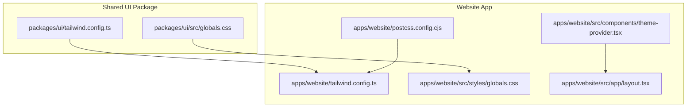
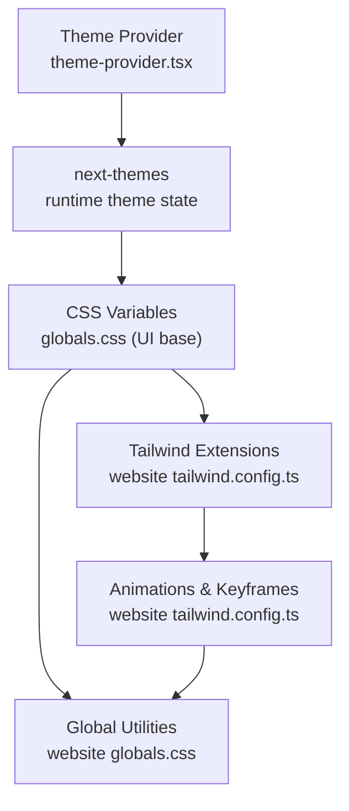
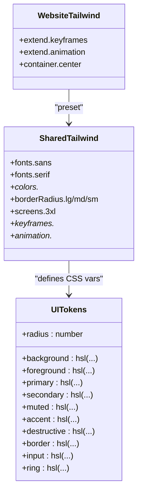
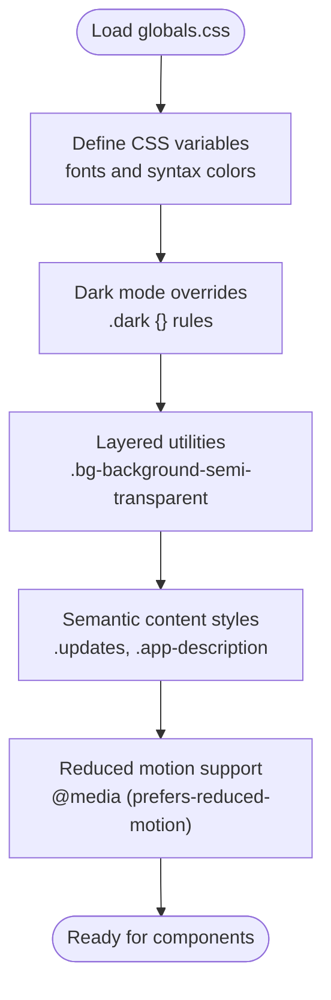
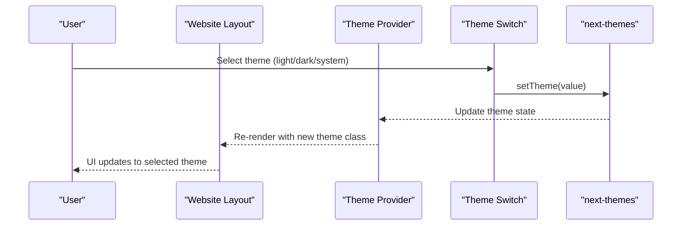
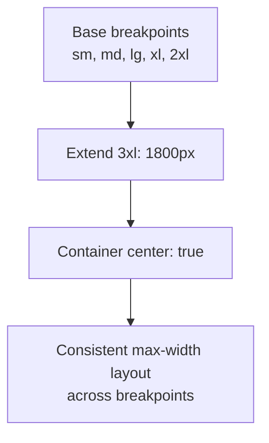
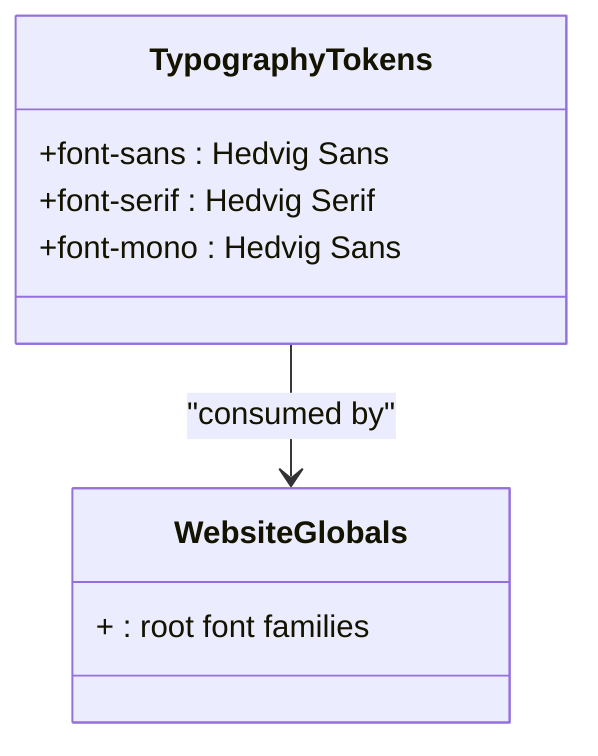
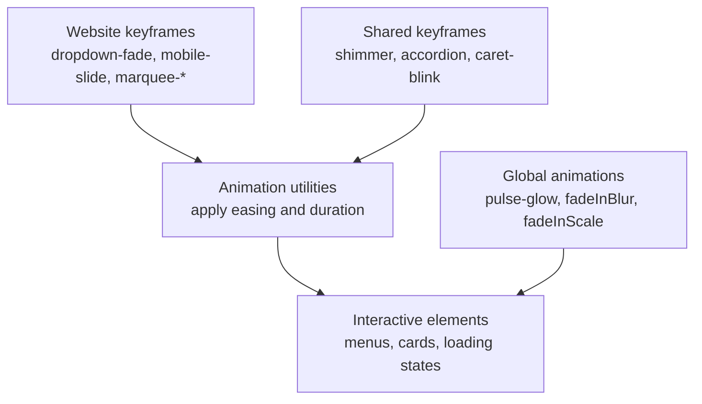
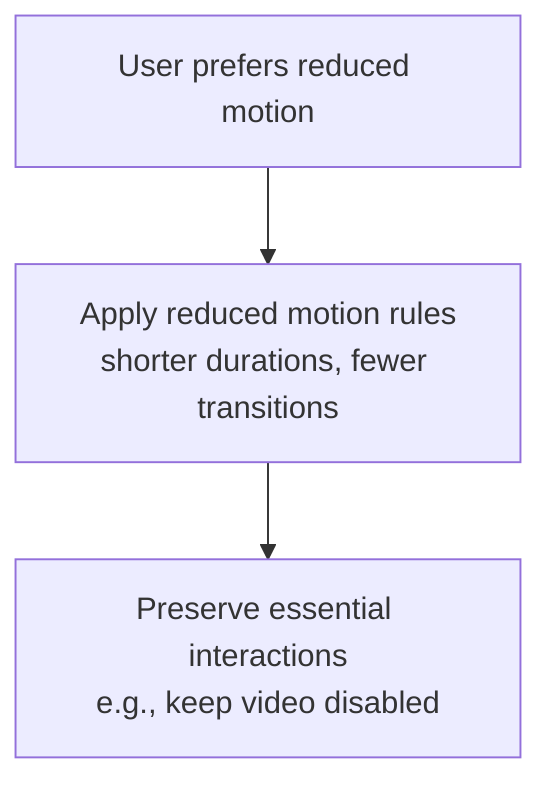
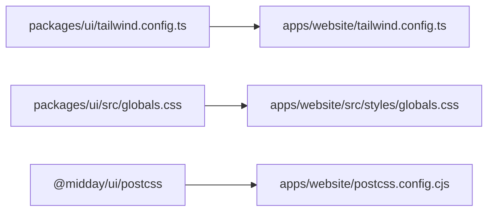

# Styling & Theming

<cite>
**Referenced Files in This Document**
- [tailwind.config.ts](file://midday/apps/website/tailwind.config.ts)
- [postcss.config.cjs](file://midday/apps/website/postcss.config.cjs)
- [globals.css](file://midday/apps/website/src/styles/globals.css)
- [tailwind.config.ts](file://midday/packages/ui/tailwind.config.ts)
- [globals.css](file://midday/packages/ui/src/globals.css)
- [theme-provider.tsx](file://midday/apps/website/src/components/theme-provider.tsx)
- [theme-switch.tsx](file://midday/apps/dashboard/src/components/theme-switch.tsx)
- [layout.tsx](file://midday/apps/website/src/app/layout.tsx)
</cite>

## Table of Contents
1. [Introduction](#introduction)
2. [Project Structure](#project-structure)
3. [Core Components](#core-components)
4. [Architecture Overview](#architecture-overview)
5. [Detailed Component Analysis](#detailed-component-analysis)
6. [Dependency Analysis](#dependency-analysis)
7. [Performance Considerations](#performance-considerations)
8. [Accessibility Compliance](#accessibility-compliance)
9. [Troubleshooting Guide](#troubleshooting-guide)
10. [Conclusion](#conclusion)

## Introduction
This document describes the styling and theming system for the Faworra Website. It explains how Tailwind CSS is configured, how design tokens are defined and consumed, and how the component library architecture supports consistent theming across light and dark modes. It also covers responsive design patterns, breakpoint strategies, animation systems, and accessibility considerations such as reduced motion support. Finally, it outlines performance optimization approaches for CSS delivery and asset bundling.

## Project Structure
The styling system is organized around a shared UI package that defines base design tokens and Tailwind configuration, and an application-specific website package that extends the base configuration and applies site-level styles.

Key elements:
- Shared UI package Tailwind configuration and base design tokens
- Website Tailwind configuration extending the shared base
- Global CSS for site-level utilities, animations, and semantic styles
- Theme provider and theme switch components for runtime theme selection
- PostCSS pipeline configured via a shared plugin chain

**Diagram sources**
- [tailwind.config.ts](file://midday/packages/ui/tailwind.config.ts#L1-L154)
- [globals.css](file://midday/packages/ui/src/globals.css#L1-L179)
- [tailwind.config.ts](file://midday/apps/website/tailwind.config.ts#L1-L50)
- [postcss.config.cjs](file://midday/apps/website/postcss.config.cjs#L1-L2)
- [globals.css](file://midday/apps/website/src/styles/globals.css#L1-L221)
- [theme-provider.tsx](file://midday/apps/website/src/components/theme-provider.tsx#L1-L10)
- [layout.tsx](file://midday/apps/website/src/app/layout.tsx#L10-L150)

**Section sources**
- [tailwind.config.ts](file://midday/apps/website/tailwind.config.ts#L1-L50)
- [postcss.config.cjs](file://midday/apps/website/postcss.config.cjs#L1-L2)
- [globals.css](file://midday/apps/website/src/styles/globals.css#L1-L221)
- [tailwind.config.ts](file://midday/packages/ui/tailwind.config.ts#L1-L154)
- [globals.css](file://midday/packages/ui/src/globals.css#L1-L179)
- [theme-provider.tsx](file://midday/apps/website/src/components/theme-provider.tsx#L1-L10)
- [layout.tsx](file://midday/apps/website/src/app/layout.tsx#L10-L150)

## Core Components
- Tailwind configuration for the website extends the shared UI package configuration and adds site-specific animations and keyframes.
- Global CSS defines design tokens via CSS variables, dark mode variants, reusable utilities, and semantic styles for content areas.
- The theme provider enables runtime switching between light, dark, and system themes.
- The theme switch component exposes a dropdown to choose the active theme.

**Section sources**
- [tailwind.config.ts](file://midday/apps/website/tailwind.config.ts#L1-L50)
- [globals.css](file://midday/apps/website/src/styles/globals.css#L1-L221)
- [theme-provider.tsx](file://midday/apps/website/src/components/theme-provider.tsx#L1-L10)
- [theme-switch.tsx](file://midday/apps/dashboard/src/components/theme-switch.tsx#L1-L74)

## Architecture Overview
The theming architecture combines:
- A shared design token system in the UI package using CSS variables for colors, borders, backgrounds, and chart colors.
- A dark mode class strategy controlled by next-themes.
- Website-specific Tailwind extensions for animations and keyframes.
- Global CSS utilities for layout, typography, and content styling.
- A theme provider component injected at the application root to propagate theme state.

**Diagram sources**
- [theme-provider.tsx](file://midday/apps/website/src/components/theme-provider.tsx#L1-L10)
- [globals.css](file://midday/packages/ui/src/globals.css#L1-L179)
- [tailwind.config.ts](file://midday/apps/website/tailwind.config.ts#L1-L50)
- [globals.css](file://midday/apps/website/src/styles/globals.css#L1-L221)

## Detailed Component Analysis

### Tailwind Configuration and Design Tokens
- The website Tailwind configuration imports the shared UI base and extends it with:
  - Container centering
  - Site-specific keyframes for dropdowns, mobile slides, marquee effects, and fade-blur transitions
  - Animation utilities bound to those keyframes
- The shared UI package defines:
  - CSS variables for background, foreground, borders, inputs, rings, and semantic roles
  - Dark mode variants of all tokens
  - Color families (primary, secondary, muted, accent, destructive, card, popover)
  - Typography families mapped to Hedvig fonts
  - Extended screens (including a 3xl breakpoint)
  - Built-in animations (shimmer, accordion, caret blink, parallax-like motion, scroll marquee)

**Diagram sources**
- [tailwind.config.ts](file://midday/apps/website/tailwind.config.ts#L1-L50)
- [tailwind.config.ts](file://midday/packages/ui/tailwind.config.ts#L1-L154)
- [globals.css](file://midday/packages/ui/src/globals.css#L1-L179)

**Section sources**
- [tailwind.config.ts](file://midday/apps/website/tailwind.config.ts#L1-L50)
- [tailwind.config.ts](file://midday/packages/ui/tailwind.config.ts#L1-L154)
- [globals.css](file://midday/packages/ui/src/globals.css#L1-L179)

### Global Styles and Semantic Content Styling
- Root-level CSS variables define font families and syntax highlighting colors for both light and dark modes.
- Utility classes provide semi-transparent backgrounds using pseudo-elements and layered rendering.
- Content-specific styles target blog/updates and app description sections with consistent spacing and typography.
- Reduced motion media query ensures accessibility by minimizing motion while preserving essential interactions.

**Diagram sources**
- [globals.css](file://midday/apps/website/src/styles/globals.css#L1-L221)

**Section sources**
- [globals.css](file://midday/apps/website/src/styles/globals.css#L1-L221)

### Theme Provider and Runtime Switching
- The theme provider wraps the application to expose theme state and persistence.
- The theme switch component integrates with next-themes to present selectable options (light, dark, system) and reflect the resolved theme icon.
- The website layout injects the theme provider at the root to ensure global theme availability.

**Diagram sources**
- [layout.tsx](file://midday/apps/website/src/app/layout.tsx#L10-L150)
- [theme-provider.tsx](file://midday/apps/website/src/components/theme-provider.tsx#L1-L10)
- [theme-switch.tsx](file://midday/apps/dashboard/src/components/theme-switch.tsx#L1-L74)

**Section sources**
- [layout.tsx](file://midday/apps/website/src/app/layout.tsx#L10-L150)
- [theme-provider.tsx](file://midday/apps/website/src/components/theme-provider.tsx#L1-L10)
- [theme-switch.tsx](file://midday/apps/dashboard/src/components/theme-switch.tsx#L1-L74)

### Responsive Design Patterns and Breakpoints
- The shared Tailwind configuration introduces a 3xl breakpoint at 1800px for large displays.
- The website Tailwind configuration centers containers for consistent max-width layouts.
- Typography and spacing scales are applied via CSS variables and Tailwind utilities to maintain readability across breakpoints.

**Diagram sources**
- [tailwind.config.ts](file://midday/packages/ui/tailwind.config.ts#L147-L149)
- [tailwind.config.ts](file://midday/apps/website/tailwind.config.ts#L8-L10)

**Section sources**
- [tailwind.config.ts](file://midday/packages/ui/tailwind.config.ts#L147-L149)
- [tailwind.config.ts](file://midday/apps/website/tailwind.config.ts#L8-L10)

### Typography Hierarchy and Font Families
- Font families are defined as CSS variables and mapped to Tailwind’s font utilities.
- The shared UI package sets sans, serif, and mono families to Hedvig fonts.
- Website globals define root-level font families and apply them consistently.

**Diagram sources**
- [tailwind.config.ts](file://midday/packages/ui/tailwind.config.ts#L9-L13)
- [globals.css](file://midday/apps/website/src/styles/globals.css#L5-L8)

**Section sources**
- [tailwind.config.ts](file://midday/packages/ui/tailwind.config.ts#L9-L13)
- [globals.css](file://midday/apps/website/src/styles/globals.css#L5-L8)

### Animation Systems and Interactive Elements
- Website Tailwind defines keyframes for dropdowns, mobile slides, marquee scrolling, and fade-blur transitions, plus corresponding animation utilities.
- The shared UI package defines additional animations for shimmer, accordion, caret blinking, and parallax-like motion.
- Global CSS includes custom animations for pulse glow and scale/fade transitions, and a layered utility for semi-transparent backgrounds.

**Diagram sources**
- [tailwind.config.ts](file://midday/apps/website/tailwind.config.ts#L12-L46)
- [tailwind.config.ts](file://midday/packages/ui/tailwind.config.ts#L54-L146)
- [globals.css](file://midday/apps/website/src/styles/globals.css#L34-L68)

**Section sources**
- [tailwind.config.ts](file://midday/apps/website/tailwind.config.ts#L12-L46)
- [tailwind.config.ts](file://midday/packages/ui/tailwind.config.ts#L54-L146)
- [globals.css](file://midday/apps/website/src/styles/globals.css#L34-L68)

### Accessibility Compliance and Reduced Motion
- Reduced motion media query reduces or eliminates non-essential animations and transitions for users who prefer less motion.
- Essential animations remain functional but simplified to preserve usability.

**Diagram sources**
- [globals.css](file://midday/apps/website/src/styles/globals.css#L205-L220)

**Section sources**
- [globals.css](file://midday/apps/website/src/styles/globals.css#L205-L220)

## Dependency Analysis
The website Tailwind configuration depends on the shared UI package for base tokens and animations. The PostCSS pipeline is inherited from the shared UI package. Global CSS in the website consumes tokens from the UI base and augments with site-specific utilities.

**Diagram sources**
- [tailwind.config.ts](file://midday/packages/ui/tailwind.config.ts#L1-L154)
- [tailwind.config.ts](file://midday/apps/website/tailwind.config.ts#L1-L50)
- [globals.css](file://midday/packages/ui/src/globals.css#L1-L179)
- [globals.css](file://midday/apps/website/src/styles/globals.css#L1-L221)
- [postcss.config.cjs](file://midday/apps/website/postcss.config.cjs#L1-L2)

**Section sources**
- [tailwind.config.ts](file://midday/packages/ui/tailwind.config.ts#L1-L154)
- [tailwind.config.ts](file://midday/apps/website/tailwind.config.ts#L1-L50)
- [globals.css](file://midday/packages/ui/src/globals.css#L1-L179)
- [globals.css](file://midday/apps/website/src/styles/globals.css#L1-L221)
- [postcss.config.cjs](file://midday/apps/website/postcss.config.cjs#L1-L2)

## Performance Considerations
- CSS optimization: Prefer using Tailwind utilities and CSS variables to minimize bespoke CSS. Consolidate animations and keyframes to reduce duplication.
- Critical CSS injection: Inline critical above-the-fold CSS in HTML templates to improve First Contentful Paint.
- Asset bundling strategies: Leverage Next.js static generation and CDN caching for CSS assets. Ensure PostCSS and Tailwind builds are optimized for production.
- Minimizing paint: Use transform and opacity for animations to avoid layout thrashing; prefer hardware-accelerated properties.

[No sources needed since this section provides general guidance]

## Accessibility Compliance
- Reduced motion: Implemented via media query to respect user preferences.
- Keyboard navigation: Ensure interactive elements are focusable and operable via keyboard; provide visible focus indicators.
- Screen reader support: Use ARIA attributes and semantic HTML; ensure dynamic content updates announce changes appropriately.
- Contrast and readability: Rely on design tokens to maintain sufficient contrast in both light and dark modes.

**Section sources**
- [globals.css](file://midday/apps/website/src/styles/globals.css#L205-L220)

## Troubleshooting Guide
- Theme not applying: Verify the theme provider is rendered at the application root and that the dark class is toggling on the document element.
- Fonts not loading: Confirm font families are defined in CSS variables and Tailwind’s font configuration.
- Animations not playing: Check that keyframes are defined and animation utilities are applied; ensure no reduced motion overrides are unintentionally enabled.
- Build errors in PostCSS: Confirm the PostCSS configuration references the shared UI package and that dependencies are installed.

**Section sources**
- [layout.tsx](file://midday/apps/website/src/app/layout.tsx#L10-L150)
- [tailwind.config.ts](file://midday/apps/website/tailwind.config.ts#L1-L50)
- [tailwind.config.ts](file://midday/packages/ui/tailwind.config.ts#L1-L154)
- [postcss.config.cjs](file://midday/apps/website/postcss.config.cjs#L1-L2)

## Conclusion
The Faworra Website employs a modular, token-driven styling architecture built on Tailwind CSS and a shared UI package. Design tokens unify color and typography across light and dark modes, while the theme provider and switch enable flexible runtime control. The system balances responsiveness, accessibility, and performance through carefully curated animations, breakpoint extensions, and reduced motion support.