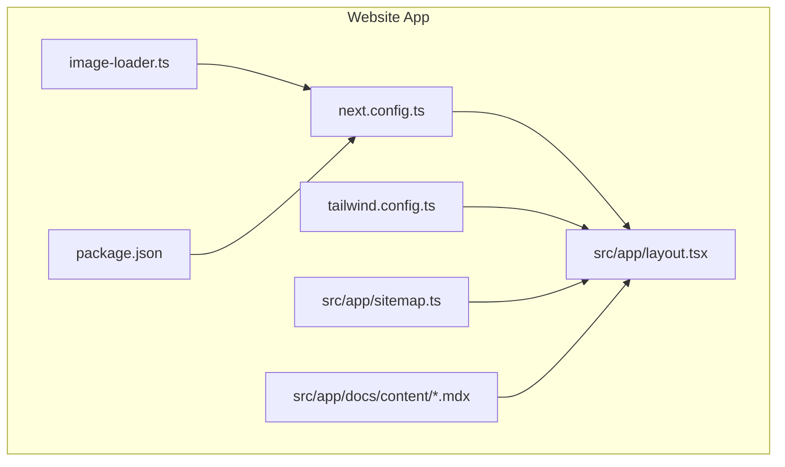
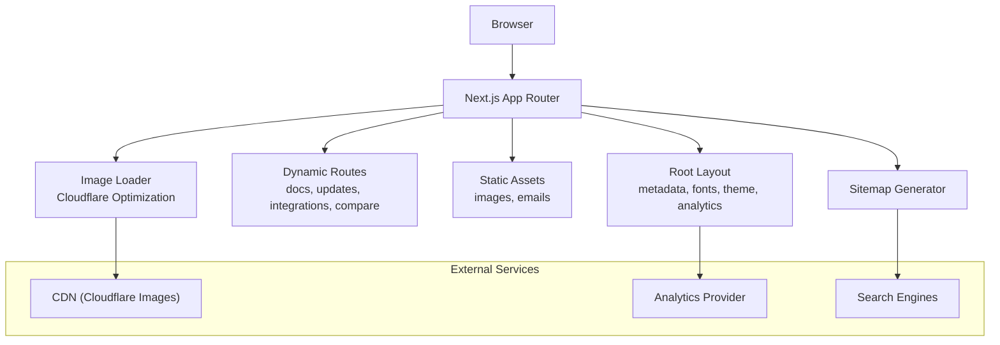
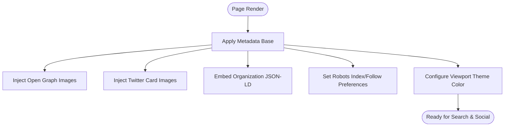
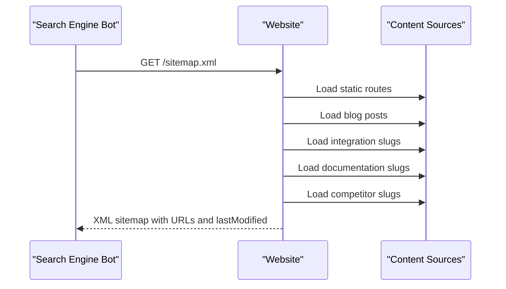
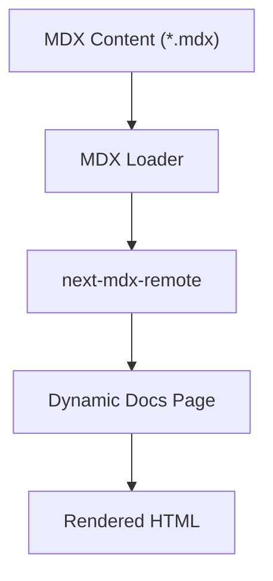
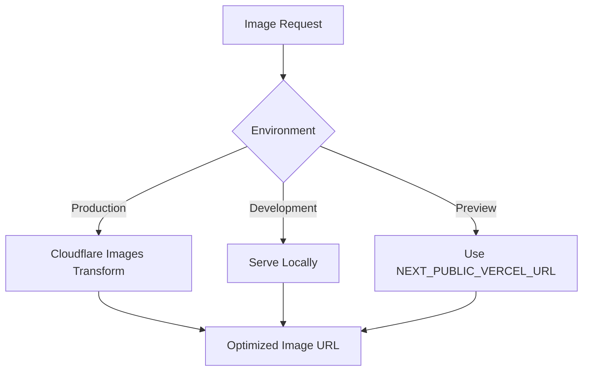
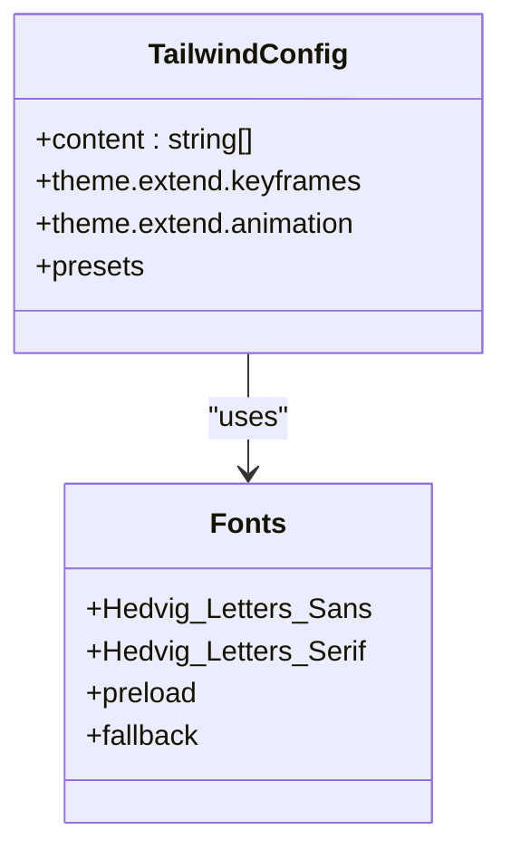
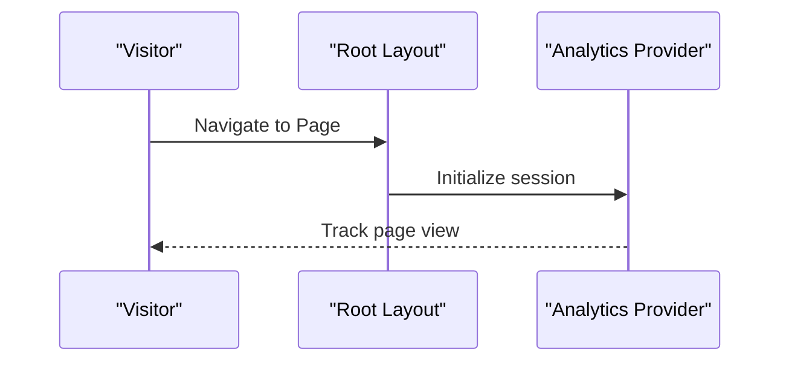
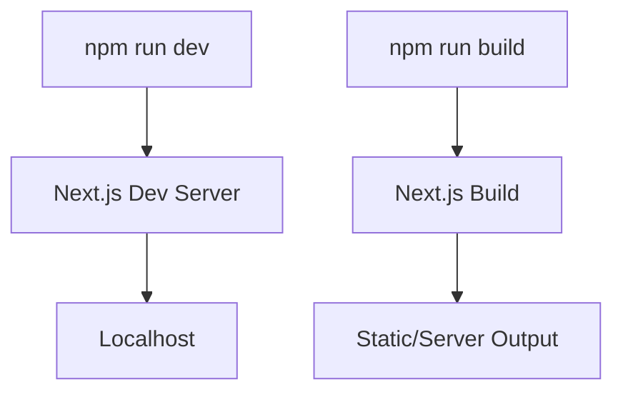
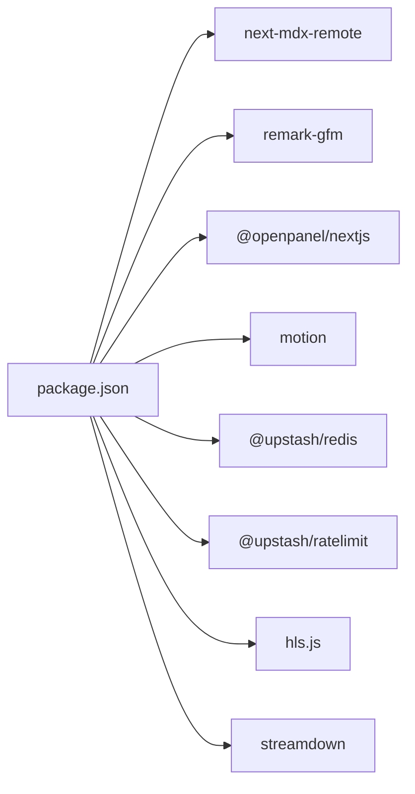

# Website Application

<cite>
**Referenced Files in This Document**
- [package.json](file://midday/apps/website/package.json)
- [next.config.ts](file://midday/apps/website/next.config.ts)
- [tailwind.config.ts](file://midday/apps/website/tailwind.config.ts)
- [layout.tsx](file://midday/apps/website/src/app/layout.tsx)
- [sitemap.ts](file://midday/apps/website/src/app/sitemap.ts)
- [image-loader.ts](file://midday/apps/website/image-loader.ts)
- [README.md](file://midday/apps/website/README.md)
</cite>

## Table of Contents
1. [Introduction](#introduction)
2. [Project Structure](#project-structure)
3. [Core Components](#core-components)
4. [Architecture Overview](#architecture-overview)
5. [Detailed Component Analysis](#detailed-component-analysis)
6. [Dependency Analysis](#dependency-analysis)
7. [Performance Considerations](#performance-considerations)
8. [Troubleshooting Guide](#troubleshooting-guide)
9. [Conclusion](#conclusion)
10. [Appendices](#appendices)

## Introduction
This document describes the Faworra Website Application built with Next.js. It focuses on marketing-oriented features including content management, SEO optimization, performance enhancements, MDX-based documentation and blog rendering, Tailwind CSS styling and responsive design, accessibility, contact and lead capture mechanisms, deployment pipeline, CDN configuration, and analytics integration. The site emphasizes modern frontend practices, automated SEO, and scalable asset delivery.

## Project Structure
The website application resides under midday/apps/website and follows Next.js conventions with an app directory. Key areas:
- Configuration: next.config.ts, tailwind.config.ts, image-loader.ts
- Root layout and metadata: src/app/layout.tsx
- Sitemap generation: src/app/sitemap.ts
- Marketing content: src/app/docs/content (MDX documentation pages)
- Assets and emails: public/images, public/email
- Scripts and dependencies: package.json

**Diagram sources**
- [next.config.ts](file://midday/apps/website/next.config.ts#L1-L51)
- [tailwind.config.ts](file://midday/apps/website/tailwind.config.ts#L1-L50)
- [layout.tsx](file://midday/apps/website/src/app/layout.tsx#L1-L153)
- [sitemap.ts](file://midday/apps/website/src/app/sitemap.ts#L1-L94)
- [image-loader.ts](file://midday/apps/website/image-loader.ts#L1-L49)
- [package.json](file://midday/apps/website/package.json#L1-L40)

**Section sources**
- [package.json](file://midday/apps/website/package.json#L1-L40)
- [next.config.ts](file://midday/apps/website/next.config.ts#L1-L51)
- [tailwind.config.ts](file://midday/apps/website/tailwind.config.ts#L1-L50)
- [layout.tsx](file://midday/apps/website/src/app/layout.tsx#L1-L153)
- [sitemap.ts](file://midday/apps/website/src/app/sitemap.ts#L1-L94)
- [image-loader.ts](file://midday/apps/website/image-loader.ts#L1-L49)
- [README.md](file://midday/apps/website/README.md#L1-L2)

## Core Components
- Next.js configuration: Optimizations for package imports, image loader customization, redirects, and TypeScript behavior.
- Tailwind CSS: Centralized theme extending with motion animations and container utilities.
- Root layout: Global metadata, Open Graph/Twitter cards, structured data, theme provider, and analytics provider.
- Sitemap generator: Dynamic sitemaps covering static routes, blog updates, integrations, documentation, and comparisons.
- Image optimization: Custom loader integrating Cloudflare Image Optimization for production while handling local/preview environments.
- Dependencies: Includes MDX renderer, analytics, UI primitives, and performance libraries.

**Section sources**
- [next.config.ts](file://midday/apps/website/next.config.ts#L1-L51)
- [tailwind.config.ts](file://midday/apps/website/tailwind.config.ts#L1-L50)
- [layout.tsx](file://midday/apps/website/src/app/layout.tsx#L34-L153)
- [sitemap.ts](file://midday/apps/website/src/app/sitemap.ts#L9-L94)
- [image-loader.ts](file://midday/apps/website/image-loader.ts#L9-L49)
- [package.json](file://midday/apps/website/package.json#L13-L33)

## Architecture Overview
The website integrates marketing content, SEO, performance, and analytics into a cohesive Next.js application.

**Diagram sources**
- [layout.tsx](file://midday/apps/website/src/app/layout.tsx#L115-L153)
- [sitemap.ts](file://midday/apps/website/src/app/sitemap.ts#L9-L94)
- [image-loader.ts](file://midday/apps/website/image-loader.ts#L38-L48)

## Detailed Component Analysis

### SEO and Metadata Management
- Metadata base and templates are defined centrally to ensure consistent branding across pages.
- Open Graph and Twitter card images are configured with multiple sizes for optimal sharing.
- Structured Organization data is embedded via JSON-LD for improved search visibility.
- Robots directives allow indexing with preferences for image and video previews.
- Viewport theme color adapts to system preference.

**Diagram sources**
- [layout.tsx](file://midday/apps/website/src/app/layout.tsx#L34-L113)
- [layout.tsx](file://midday/apps/website/src/app/layout.tsx#L93-L98)

**Section sources**
- [layout.tsx](file://midday/apps/website/src/app/layout.tsx#L34-L113)
- [layout.tsx](file://midday/apps/website/src/app/layout.tsx#L93-L98)

### Sitemap Generation
- Generates a comprehensive sitemap including static routes, blog posts, integration pages, documentation pages, and competitor comparison pages.
- Uses a consistent base URL and last modified dates derived from content metadata.

**Diagram sources**
- [sitemap.ts](file://midday/apps/website/src/app/sitemap.ts#L9-L94)

**Section sources**
- [sitemap.ts](file://midday/apps/website/src/app/sitemap.ts#L9-L94)

### MDX-Based Documentation Pages
- Documentation content is stored as MDX files under src/app/docs/content.
- The site leverages next-mdx-remote for rendering MDX content on the server-side, enabling dynamic documentation pages.
- Remark plugins (e.g., GFM) can be integrated to support GitHub-flavored markdown features.

**Diagram sources**
- [package.json](file://midday/apps/website/package.json#L26-L32)

**Section sources**
- [package.json](file://midday/apps/website/package.json#L26-L32)

### Image Optimization and CDN Integration
- Custom image loader supports development, preview, and production scenarios.
- Production uses Cloudflare Image Optimization with width and quality transformations.
- Local images and Vercel preview URLs are handled without CDN overhead.
- Device sizes and qualities are tuned for optimal performance.

**Diagram sources**
- [image-loader.ts](file://midday/apps/website/image-loader.ts#L9-L49)
- [next.config.ts](file://midday/apps/website/next.config.ts#L25-L38)

**Section sources**
- [image-loader.ts](file://midday/apps/website/image-loader.ts#L9-L49)
- [next.config.ts](file://midday/apps/website/next.config.ts#L25-L38)

### Styling and Responsive Design
- Tailwind CSS is extended with custom animations and marquee effects for marketing visuals.
- Fonts are preloaded and fall back gracefully for performance and accessibility.
- Container utilities center content and maintain readable widths across breakpoints.

**Diagram sources**
- [tailwind.config.ts](file://midday/apps/website/tailwind.config.ts#L7-L47)
- [layout.tsx](file://midday/apps/website/src/app/layout.tsx#L14-L32)

**Section sources**
- [tailwind.config.ts](file://midday/apps/website/tailwind.config.ts#L1-L50)
- [layout.tsx](file://midday/apps/website/src/app/layout.tsx#L14-L32)

### Analytics Integration
- Analytics provider is mounted at the root layout level to track page views and user interactions.
- Analytics SDKs are included via dependencies and initialized in the provider.

**Diagram sources**
- [layout.tsx](file://midday/apps/website/src/app/layout.tsx#L4-L146)
- [package.json](file://midday/apps/website/package.json#L18-L21)

**Section sources**
- [layout.tsx](file://midday/apps/website/src/app/layout.tsx#L4-L146)
- [package.json](file://midday/apps/website/package.json#L18-L21)

### Contact Form, Newsletter, and Lead Capture
- The website does not include explicit contact form, newsletter subscription, or lead capture components in the analyzed files.
- These features would typically be implemented as dynamic routes or API handlers and are not present in the current codebase snapshot.

[No sources needed since this section summarizes absence of specific files]

### Deployment Pipeline and Environment Handling
- Development script uses Next.js dev with turbopack and UTC timezone.
- Build script compiles with turbopack for performance.
- Environment variables drive preview/CDN behavior in the image loader.
- Redirects normalize locale paths for SEO consistency.

**Diagram sources**
- [package.json](file://midday/apps/website/package.json#L5-L12)
- [next.config.ts](file://midday/apps/website/next.config.ts#L39-L47)

**Section sources**
- [package.json](file://midday/apps/website/package.json#L5-L12)
- [next.config.ts](file://midday/apps/website/next.config.ts#L39-L47)

## Dependency Analysis
Key runtime dependencies supporting marketing and performance:
- next-mdx-remote: Renders MDX content dynamically.
- remark-gfm: Enables GitHub Flavored Markdown in documentation.
- @openpanel/nextjs: Analytics integration.
- motion: Animation primitives for marketing pages.
- hls.js: Optional for video playback if used.
- @upstash/redis and @upstash/ratelimit: Rate limiting and caching primitives.
- streamdown: Video streaming utilities.

**Diagram sources**
- [package.json](file://midday/apps/website/package.json#L13-L33)

**Section sources**
- [package.json](file://midday/apps/website/package.json#L13-L33)

## Performance Considerations
- Turbopack-enabled builds for faster development and production bundling.
- Package import optimization for react-icons, motion, @midday/ui, and lucide-react.
- Inline CSS optimization for marketing-heavy pages.
- Custom image loader with Cloudflare transformations reduces bandwidth and improves perceived performance.
- Preloading of Google Fonts with fallbacks minimizes FOIT/FOFT.
- Strict mode enabled for early detection of unsafe lifecycles.

[No sources needed since this section provides general guidance]

## Troubleshooting Guide
- Locale redirect normalization: Ensure trailing slash and redirect rules remain consistent to avoid duplicate content.
- Image optimization: Verify CDN transformations only apply in production and that preview URLs are respected.
- Analytics initialization: Confirm analytics provider is mounted at the root layout and environment variables are configured.
- MDX rendering: Validate MDX content paths and ensure remark plugins are configured if markdown features are used.

**Section sources**
- [next.config.ts](file://midday/apps/website/next.config.ts#L39-L47)
- [image-loader.ts](file://midday/apps/website/image-loader.ts#L27-L48)
- [layout.tsx](file://midday/apps/website/src/app/layout.tsx#L4-L146)
- [package.json](file://midday/apps/website/package.json#L26-L32)

## Conclusion
The Faworra Website Application leverages Next.js to deliver a fast, SEO-friendly, and visually engaging marketing site. Its configuration emphasizes performance (turbopack, optimized imports, CDN images), content flexibility (MDX docs), and robust SEO (metadata, sitemaps, structured data). While contact and newsletter features are not present in the current codebase, the architecture supports easy addition of such components.

## Appendices
- Additional assets and emails are served from the public directory for marketing campaigns and internal communications.

[No sources needed since this section provides general guidance]