# Website Architecture

<cite>
**Referenced Files in This Document**
- [next.config.ts](file://midday/apps/website/next.config.ts)
- [vercel.json](file://midday/apps/website/vercel.json)
- [tailwind.config.ts](file://midday/apps/website/tailwind.config.ts)
- [package.json](file://midday/apps/website/package.json)
- [layout.tsx](file://midday/apps/website/src/app/layout.tsx)
- [image-loader.ts](file://midday/apps/website/image-loader.ts)
- [postcss.config.cjs](file://midday/apps/website/postcss.config.cjs)
- [sitemap.ts](file://midday/apps/website/src/app/sitemap.ts)
- [api-reference.mdx](file://midday/apps/website/src/app/docs/content/api-reference.mdx)
</cite>

## Table of Contents
1. [Introduction](#introduction)
2. [Project Structure](#project-structure)
3. [Core Components](#core-components)
4. [Architecture Overview](#architecture-overview)
5. [Detailed Component Analysis](#detailed-component-analysis)
6. [Dependency Analysis](#dependency-analysis)
7. [Performance Considerations](#performance-considerations)
8. [Troubleshooting Guide](#troubleshooting-guide)
9. [Conclusion](#conclusion)

## Introduction
This document describes the architecture of the Faworra Website Application built with Next.js 16. It covers framework setup, routing strategy, build configuration, deployment architecture on Vercel, styling and design system with Tailwind CSS, content management via MDX, performance optimizations, CDN configuration, caching mechanisms, internationalization setup, SEO configuration, and analytics integration patterns.

## Project Structure
The website is organized as a Next.js application under apps/website with:
- Configuration files for Next.js, Tailwind CSS, PostCSS, and Vercel
- Application layout and metadata configuration
- Content in MDX format for documentation pages
- Custom image loader for optimized asset delivery
- Sitemap generation for SEO

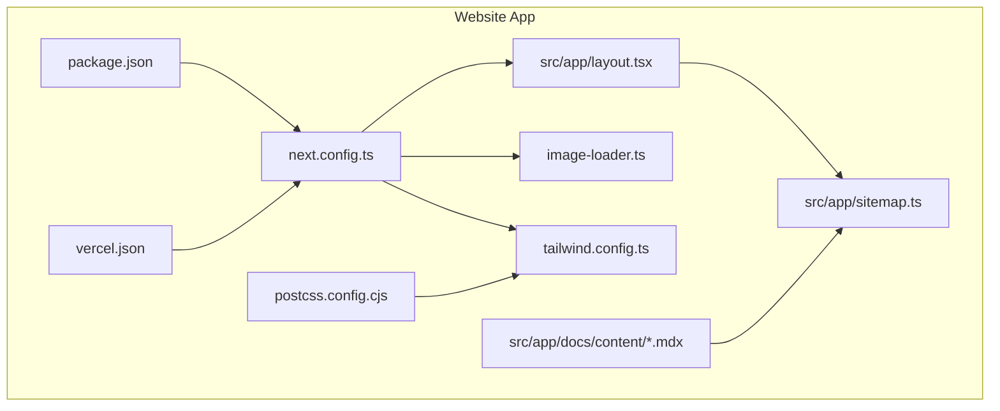

**Diagram sources**
- [next.config.ts](file://midday/apps/website/next.config.ts#L1-L51)
- [vercel.json](file://midday/apps/website/vercel.json#L1-L9)
- [tailwind.config.ts](file://midday/apps/website/tailwind.config.ts#L1-L50)
- [postcss.config.cjs](file://midday/apps/website/postcss.config.cjs#L1-L2)
- [package.json](file://midday/apps/website/package.json#L1-L40)
- [layout.tsx](file://midday/apps/website/src/app/layout.tsx#L1-L153)
- [image-loader.ts](file://midday/apps/website/image-loader.ts#L1-L49)
- [sitemap.ts](file://midday/apps/website/src/app/sitemap.ts#L1-L94)
- [api-reference.mdx](file://midday/apps/website/src/app/docs/content/api-reference.mdx#L1-L96)

**Section sources**
- [next.config.ts](file://midday/apps/website/next.config.ts#L1-L51)
- [vercel.json](file://midday/apps/website/vercel.json#L1-L9)
- [tailwind.config.ts](file://midday/apps/website/tailwind.config.ts#L1-L50)
- [postcss.config.cjs](file://midday/apps/website/postcss.config.cjs#L1-L2)
- [package.json](file://midday/apps/website/package.json#L1-L40)
- [layout.tsx](file://midday/apps/website/src/app/layout.tsx#L1-L153)
- [image-loader.ts](file://midday/apps/website/image-loader.ts#L1-L49)
- [sitemap.ts](file://midday/apps/website/src/app/sitemap.ts#L1-L94)
- [api-reference.mdx](file://midday/apps/website/src/app/docs/content/api-reference.mdx#L1-L96)

## Core Components
- Next.js configuration: strict mode, trailing slash, TypeScript build behavior, experimental optimizations, image loader customization, and redirects
- Vercel deployment: private project, GitHub integration disabled, regional edge placement
- Tailwind CSS: extended animations and keyframes, container centering, and content scanning across local and shared UI packages
- PostCSS pipeline: inherits shared configuration from the UI package
- Application shell: global styles, theme provider, header/footer, analytics provider, and metadata/SEO
- Image optimization: custom loader with Cloudflare CDN transformations and environment-aware behavior
- Sitemap generation: dynamic routes for static pages, blog posts, integrations, documentation, and comparisons
- MDX content: structured documentation pages with frontmatter and Markdown content

**Section sources**
- [next.config.ts](file://midday/apps/website/next.config.ts#L1-L51)
- [vercel.json](file://midday/apps/website/vercel.json#L1-L9)
- [tailwind.config.ts](file://midday/apps/website/tailwind.config.ts#L1-L50)
- [postcss.config.cjs](file://midday/apps/website/postcss.config.cjs#L1-L2)
- [layout.tsx](file://midday/apps/website/src/app/layout.tsx#L1-L153)
- [image-loader.ts](file://midday/apps/website/image-loader.ts#L1-L49)
- [sitemap.ts](file://midday/apps/website/src/app/sitemap.ts#L1-L94)
- [api-reference.mdx](file://midday/apps/website/src/app/docs/content/api-reference.mdx#L1-L96)

## Architecture Overview
The website leverages Next.js App Router with static generation and serverless runtime characteristics typical of Vercel deployments. The architecture emphasizes:
- Centralized configuration via next.config.ts and Tailwind configuration
- Shared UI and design tokens via @midday/ui and related packages
- Optimized image delivery through a custom loader integrated with Cloudflare CDN
- Dynamic sitemaps and metadata for SEO
- MDX-based documentation pages for product and developer guides
- Analytics integration via an events client provider

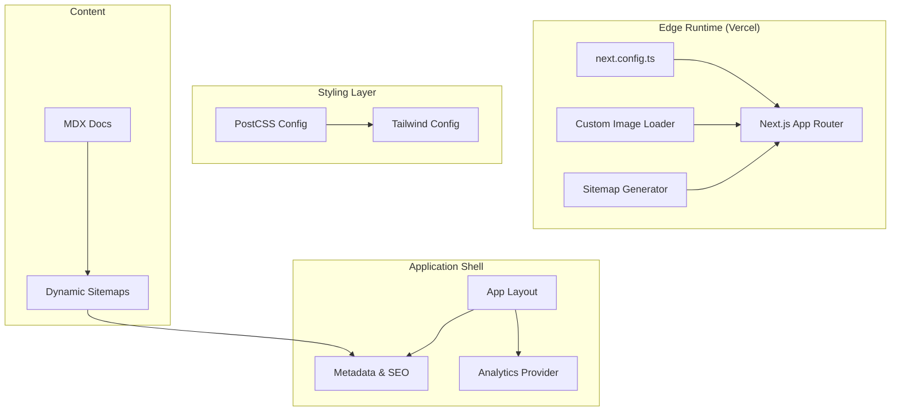

**Diagram sources**
- [next.config.ts](file://midday/apps/website/next.config.ts#L1-L51)
- [image-loader.ts](file://midday/apps/website/image-loader.ts#L1-L49)
- [sitemap.ts](file://midday/apps/website/src/app/sitemap.ts#L1-L94)
- [postcss.config.cjs](file://midday/apps/website/postcss.config.cjs#L1-L2)
- [tailwind.config.ts](file://midday/apps/website/tailwind.config.ts#L1-L50)
- [layout.tsx](file://midday/apps/website/src/app/layout.tsx#L1-L153)
- [api-reference.mdx](file://midday/apps/website/src/app/docs/content/api-reference.mdx#L1-L96)

## Detailed Component Analysis

### Next.js Configuration and Build Pipeline
Key behaviors:
- Strict mode enabled for React
- Trailing slash enforced for canonical URLs
- Transpilation for shared packages and MDX remote
- TypeScript build configured to ignore errors during builds
- Experimental optimizations: inline CSS and selective package imports
- Custom image loader with device sizes and quality profiles
- Redirects to normalize locale paths

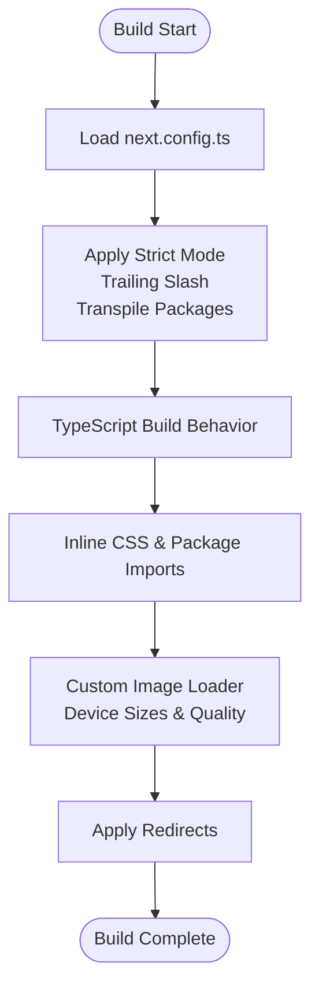

**Diagram sources**
- [next.config.ts](file://midday/apps/website/next.config.ts#L1-L51)

**Section sources**
- [next.config.ts](file://midday/apps/website/next.config.ts#L1-L51)

### Deployment Architecture on Vercel
Deployment characteristics:
- Project visibility: private
- GitHub integration: disabled
- Regional edge placement: fra1, iad1, sfo1

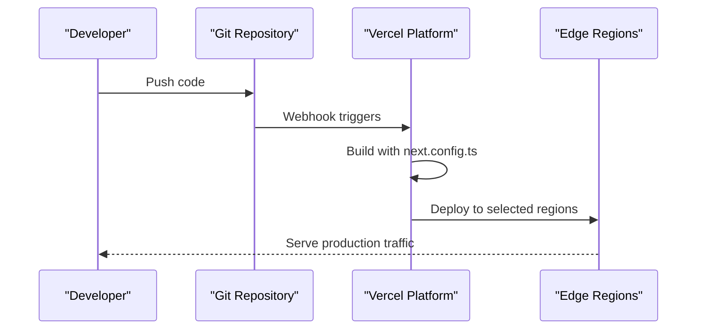

**Diagram sources**
- [vercel.json](file://midday/apps/website/vercel.json#L1-L9)

**Section sources**
- [vercel.json](file://midday/apps/website/vercel.json#L1-L9)

### Styling Architecture with Tailwind CSS and Design System
Implementation highlights:
- Extends shared Tailwind base configuration from @midday/ui
- Scans local and shared UI package sources for class usage
- Adds custom animations and keyframes for UI micro-interactions
- Centers containers and extends theme for brand-specific motion

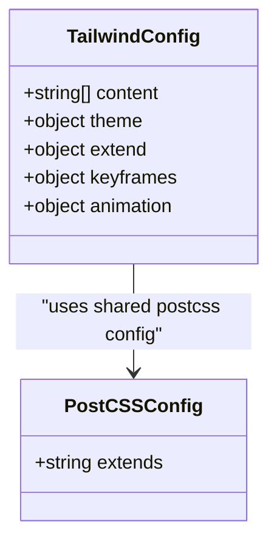

**Diagram sources**
- [tailwind.config.ts](file://midday/apps/website/tailwind.config.ts#L1-L50)
- [postcss.config.cjs](file://midday/apps/website/postcss.config.cjs#L1-L2)

**Section sources**
- [tailwind.config.ts](file://midday/apps/website/tailwind.config.ts#L1-L50)
- [postcss.config.cjs](file://midday/apps/website/postcss.config.cjs#L1-L2)

### Application Shell and Metadata/SEO
The application layout sets:
- Global fonts via Next/font with preloading and fallbacks
- Theme provider for system preference and transitions
- Analytics provider injection
- Structured metadata including OpenGraph and Twitter cards
- Robots directives and viewport configuration
- JSON-LD for schema.org Organization

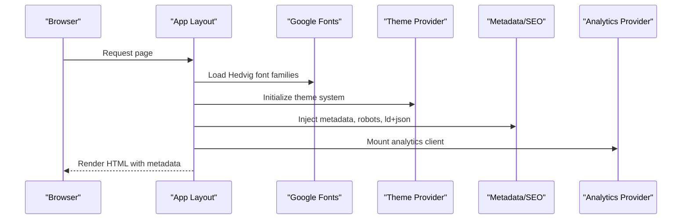

**Diagram sources**
- [layout.tsx](file://midday/apps/website/src/app/layout.tsx#L1-L153)

**Section sources**
- [layout.tsx](file://midday/apps/website/src/app/layout.tsx#L1-L153)

### Image Optimization and CDN Integration
The custom loader:
- Skips CDN optimization for localhost and development
- Uses local query params in development for local images
- Detects preview environments and serves via Vercel URL
- Applies Cloudflare image transformations in production for both internal and external assets

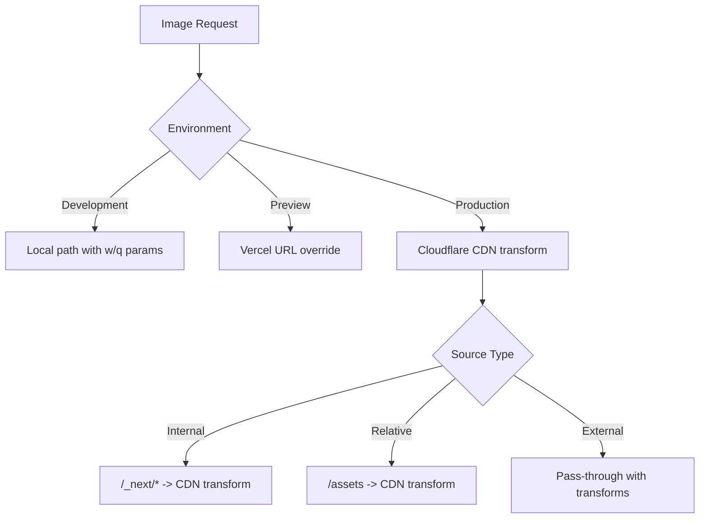

**Diagram sources**
- [image-loader.ts](file://midday/apps/website/image-loader.ts#L1-L49)

**Section sources**
- [image-loader.ts](file://midday/apps/website/image-loader.ts#L1-L49)

### Content Management and MDX Integration
Documentation pages are authored in MDX with frontmatter:
- Title, description, section, and order define content structure
- Mixed Markdown and React components enable interactive documentation
- Dynamic sitemap generation includes documentation slugs

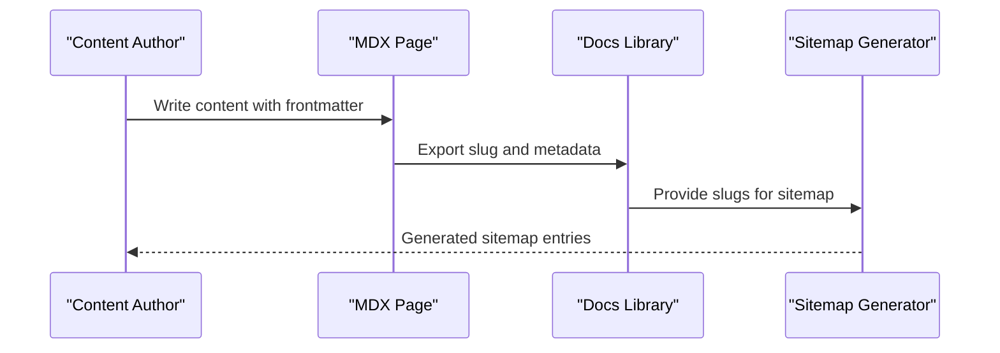

**Diagram sources**
- [api-reference.mdx](file://midday/apps/website/src/app/docs/content/api-reference.mdx#L1-L96)
- [sitemap.ts](file://midday/apps/website/src/app/sitemap.ts#L1-L94)

**Section sources**
- [api-reference.mdx](file://midday/apps/website/src/app/docs/content/api-reference.mdx#L1-L96)
- [sitemap.ts](file://midday/apps/website/src/app/sitemap.ts#L1-L94)

### Internationalization Setup
- Locale normalization redirect: strips "/en/" prefix and redirects to root
- Root layout sets html lang="en"
- No locale-specific routing detected in the website app

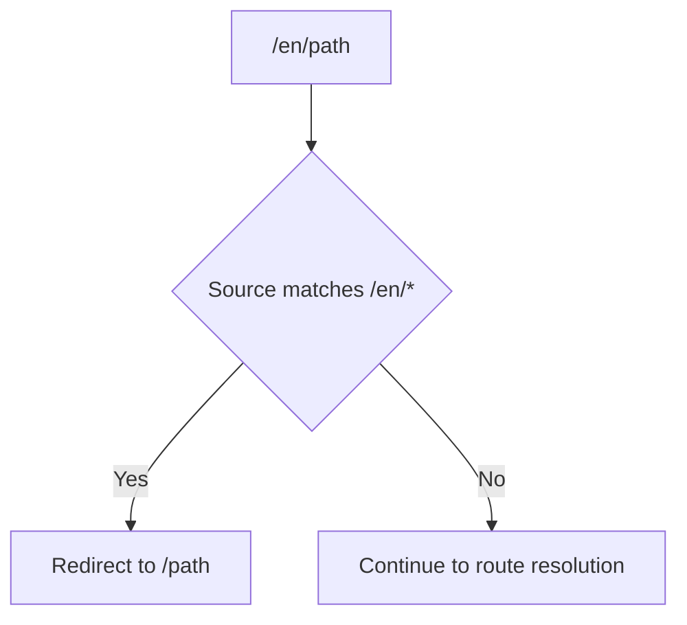

**Diagram sources**
- [next.config.ts](file://midday/apps/website/next.config.ts#L39-L47)
- [layout.tsx](file://midday/apps/website/src/app/layout.tsx#L117-L117)

**Section sources**
- [next.config.ts](file://midday/apps/website/next.config.ts#L39-L47)
- [layout.tsx](file://midday/apps/website/src/app/layout.tsx#L117-L117)

### Analytics Integration Patterns
- Analytics provider mounted in the application shell
- Events client imported from @midday/events
- Used alongside metadata injection for comprehensive observability

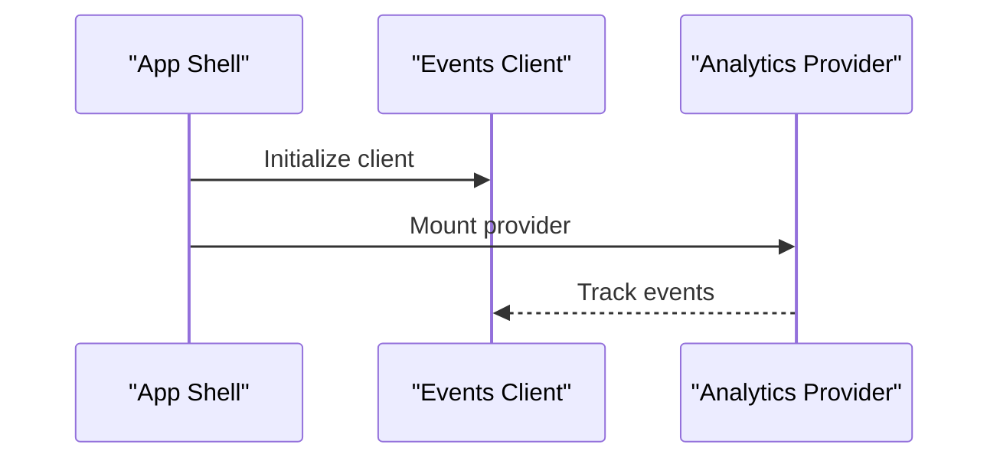

**Diagram sources**
- [layout.tsx](file://midday/apps/website/src/app/layout.tsx#L4-L4)
- [layout.tsx](file://midday/apps/website/src/app/layout.tsx#L146-L146)

**Section sources**
- [layout.tsx](file://midday/apps/website/src/app/layout.tsx#L4-L4)
- [layout.tsx](file://midday/apps/website/src/app/layout.tsx#L146-L146)

## Dependency Analysis
The website depends on:
- Next.js 16.1.6 for the application runtime
- Shared UI packages (@midday/ui, @midday/app-store) for components and design tokens
- MDX ecosystem for documentation authoring
- Analytics and monitoring libraries
- Tailwind CSS and PostCSS for styling

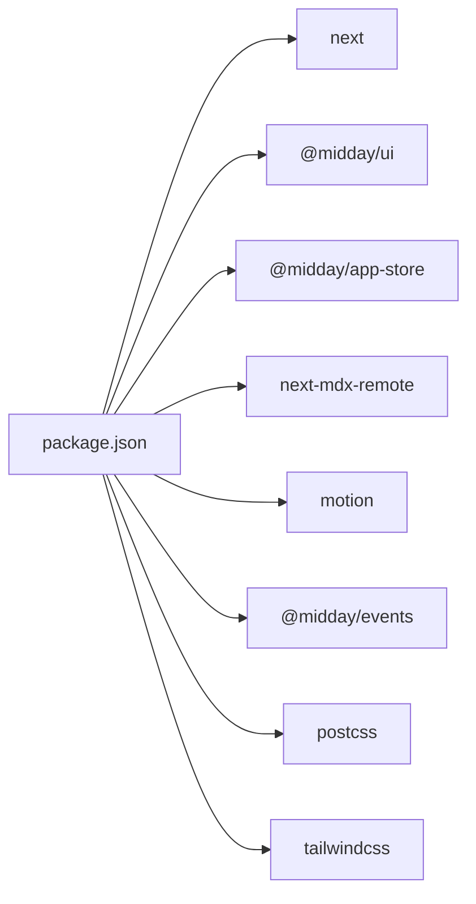

**Diagram sources**
- [package.json](file://midday/apps/website/package.json#L13-L32)
- [postcss.config.cjs](file://midday/apps/website/postcss.config.cjs#L1-L2)
- [tailwind.config.ts](file://midday/apps/website/tailwind.config.ts#L1-L2)

**Section sources**
- [package.json](file://midday/apps/website/package.json#L13-L32)
- [postcss.config.cjs](file://midday/apps/website/postcss.config.cjs#L1-L2)
- [tailwind.config.ts](file://midday/apps/website/tailwind.config.ts#L1-L2)

## Performance Considerations
- Image optimization: device sizes capped at 1200px, reduced quality tiers, and Cloudflare transformations
- Build optimizations: inline CSS and selective package imports
- Strict mode and trailing slash reduce render inconsistencies and duplicate content
- Environment-aware image serving avoids unnecessary CDN overhead during development and preview
- Font preloading and fallbacks minimize layout shifts

**Section sources**
- [next.config.ts](file://midday/apps/website/next.config.ts#L15-L24)
- [next.config.ts](file://midday/apps/website/next.config.ts#L25-L38)
- [image-loader.ts](file://midday/apps/website/image-loader.ts#L14-L25)
- [layout.tsx](file://midday/apps/website/src/app/layout.tsx#L14-L32)

## Troubleshooting Guide
- Redirect anomalies: ensure locale redirect rules align with intended routing behavior
- Image serving issues: verify NODE_ENV and Vercel preview environment variables to confirm loader path selection
- Sitemap completeness: confirm dynamic route generators return expected slugs for documentation, blog, integrations, and comparisons
- Analytics tracking: validate provider initialization and event emission in the application shell

**Section sources**
- [next.config.ts](file://midday/apps/website/next.config.ts#L39-L47)
- [image-loader.ts](file://midday/apps/website/image-loader.ts#L27-L36)
- [sitemap.ts](file://midday/apps/website/src/app/sitemap.ts#L53-L83)
- [layout.tsx](file://midday/apps/website/src/app/layout.tsx#L4-L4)

## Conclusion
The Faworra Website Application is architected for speed, scalability, and maintainability on Vercel using Next.js 16. Its configuration emphasizes performance (image optimization, inline CSS, selective imports), robust SEO (metadata, sitemaps, robots), and a cohesive design system via Tailwind CSS and shared UI packages. MDX enables structured documentation, while analytics integration ensures observability. The deployment profile targets global edge regions with private project settings, and the custom image loader streamlines asset delivery across environments.