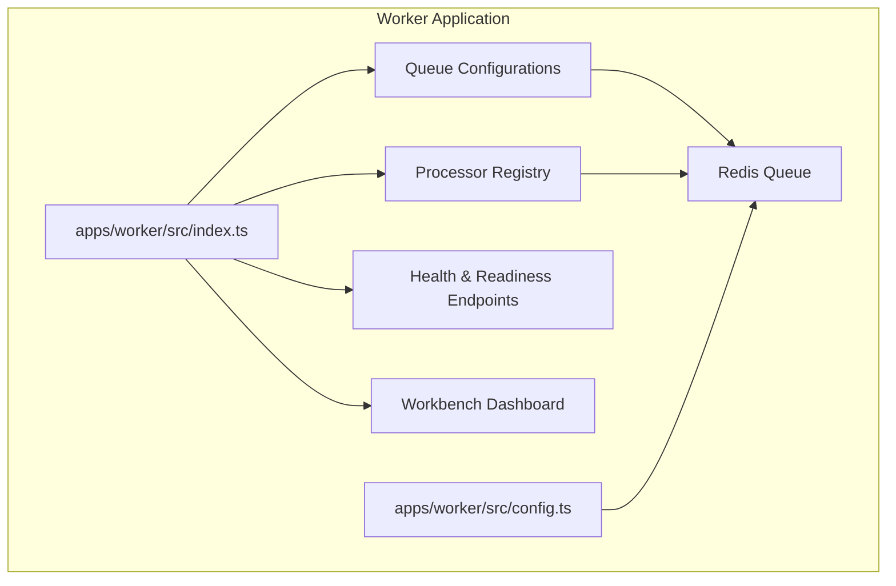
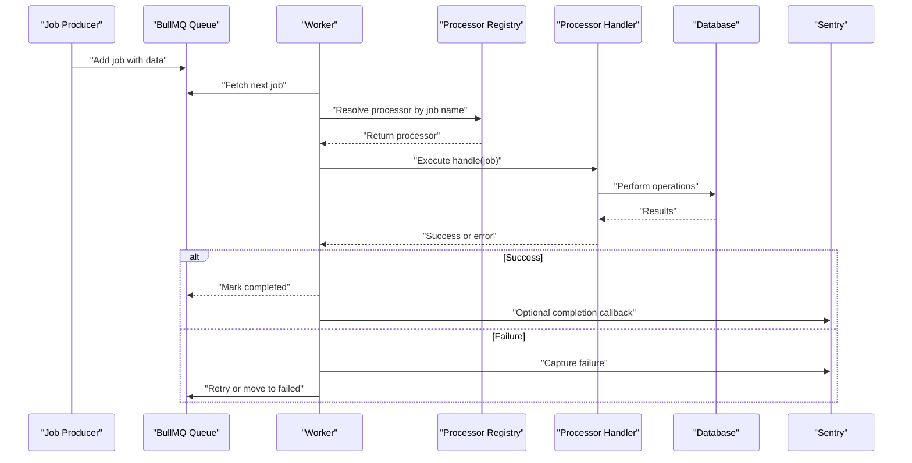
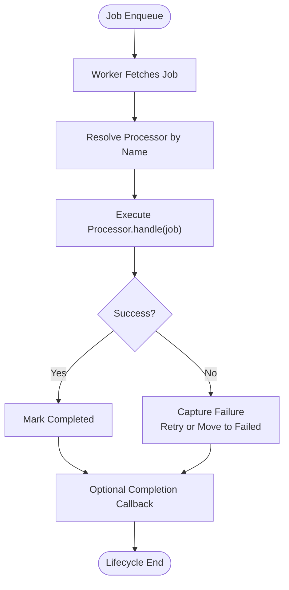
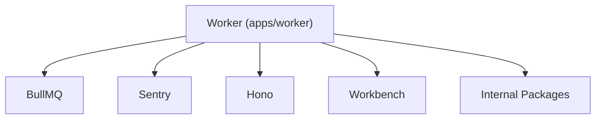

# Processor Implementations

<cite>
**Referenced Files in This Document**
- [index.ts](file://apps/worker/src/index.ts)
- [config.ts](file://apps/worker/src/config.ts)
- [README.md](file://README.md)
- [document-processing.md](file://docs/document-processing.md)
- [inbox-matching.md](file://docs/inbox-matching.md)
- [weekly-insights.md](file://docs/weekly-insights.md)
- [invoice-recurring.md](file://docs/invoice-recurring.md)
- [bank-account-reconnect.md](file://docs/bank-account-reconnect.md)
- [credit-card-transaction-handling.md](file://docs/credit-card-transaction-handling.md)
- [runway-burn-rate-analysis.md](file://docs/runway-burn-rate-analysis.md)
- [generate-test-insight.ts](file://apps/worker/scripts/generate-test-insight.ts)
</cite>

## Table of Contents
1. [Introduction](#introduction)
2. [Project Structure](#project-structure)
3. [Core Components](#core-components)
4. [Architecture Overview](#architecture-overview)
5. [Detailed Component Analysis](#detailed-component-analysis)
6. [Dependency Analysis](#dependency-analysis)
7. [Performance Considerations](#performance-considerations)
8. [Troubleshooting Guide](#troubleshooting-guide)
9. [Conclusion](#conclusion)
10. [Appendices](#appendices)

## Introduction
This document describes the processor implementations powering the Worker Application responsible for background job execution across the Midday platform. It explains the processor architecture pattern, job execution lifecycle, error handling strategies, and operational characteristics. It also covers configuration, resource requirements, performance characteristics, job parameter validation, result handling, failure recovery mechanisms, testing strategies, debugging techniques, and monitoring approaches for reliable background job execution.

The Worker Application uses BullMQ to orchestrate queues and workers, with a registry-driven processor pattern that dispatches jobs to specialized handlers. The system integrates with Redis for persistence and transport, Sentry for observability, and a Hono-based admin dashboard for monitoring via Workbench.

**Section sources**
- [index.ts](file://apps/worker/src/index.ts#L22-L36)
- [README.md](file://README.md#L1-L200)

## Project Structure
The Worker Application is organized around a central entry point that initializes workers, registers schedulers, exposes health endpoints, and mounts a dashboard. The structure supports dynamic worker creation from queue configurations and a processor registry that resolves job names to handlers.

Key elements:
- Entry point initializes workers and attaches centralized error and failure handlers
- Health and readiness endpoints expose service status and dependency checks
- Workbench dashboard provides queue inspection and management
- Redis connection configuration supports production-grade reliability
- Scripts for generating test data and insights

**Diagram sources**
- [index.ts](file://apps/worker/src/index.ts#L25-L118)
- [config.ts](file://apps/worker/src/config.ts#L46-L88)

**Section sources**
- [index.ts](file://apps/worker/src/index.ts#L1-L312)
- [config.ts](file://apps/worker/src/config.ts#L1-L98)

## Core Components
The Worker Application comprises several core components that collectively enable robust background job processing:

- Dynamic Worker Creation: Workers are created per queue configuration, resolving job names to processors via a registry.
- Centralized Error and Failure Handling: Errors are captured centrally, with Sentry integration and optional custom event handlers for completion and failure.
- Health and Readiness Checks: Lightweight endpoints verify service status and dependency availability.
- Workbench Dashboard: An embedded dashboard provides queue inspection and administrative controls.
- Redis Connection Management: Production-grade Redis configuration with exponential backoff and automatic reconnection strategies.
- Graceful Shutdown: Controlled shutdown sequences for workers, database connections, and Sentry flushing.

Operational highlights:
- Job execution lifecycle: Job arrives → Worker resolves processor → Processor executes → Results handled → Optional completion/failure callbacks.
- Error handling: Processor-level errors are captured with context; unhandled worker errors and job failures are logged and reported to Sentry.
- Monitoring: Pool statistics logging, health/readiness endpoints, and Workbench dashboard.

**Section sources**
- [index.ts](file://apps/worker/src/index.ts#L25-L118)
- [index.ts](file://apps/worker/src/index.ts#L167-L191)
- [index.ts](file://apps/worker/src/index.ts#L232-L281)
- [config.ts](file://apps/worker/src/config.ts#L46-L88)

## Architecture Overview
The Worker Application follows a registry-driven architecture with BullMQ-backed queues. The lifecycle spans job submission, worker resolution, processor execution, and result handling.

**Diagram sources**
- [index.ts](file://apps/worker/src/index.ts#L28-L34)
- [index.ts](file://apps/worker/src/index.ts#L53-L103)

## Detailed Component Analysis

### Processor Architecture Pattern
The Worker Application employs a registry-driven processor pattern:
- Job name resolution: Each job carries a type/name that maps to a registered processor.
- Dynamic worker creation: Workers are instantiated per queue configuration, ensuring isolation and scalability.
- Centralized event handling: Errors and failures are captured centrally, with optional custom handlers for completion and failure.

Key behaviors:
- No processor registered: Immediate error thrown and captured.
- Processor execution: Returns a value or throws; failures are captured and retried according to queue configuration.
- Completion and failure callbacks: Optional handlers can update external systems or trigger follow-up actions.

**Section sources**
- [index.ts](file://apps/worker/src/index.ts#L28-L34)
- [index.ts](file://apps/worker/src/index.ts#L53-L103)

### Job Execution Lifecycle
The lifecycle encompasses job submission, fetching, processing, and result handling:
- Submission: Jobs are enqueued with structured data payloads.
- Fetching: Workers pull jobs from Redis-backed queues.
- Processing: Processor handles the job, performing domain-specific operations.
- Result handling: Success or failure is recorded; optional callbacks notify external systems.

**Diagram sources**
- [index.ts](file://apps/worker/src/index.ts#L28-L34)
- [index.ts](file://apps/worker/src/index.ts#L107-L115)

**Section sources**
- [index.ts](file://apps/worker/src/index.ts#L28-L34)
- [index.ts](file://apps/worker/src/index.ts#L107-L115)

### Error Handling Strategies
The Worker Application implements layered error handling:
- Worker-level errors: Captured and reported to Sentry; logs include error details.
- Job failures: Centralized handler records job metadata and triggers optional custom failure handler.
- Unhandled exceptions/rejections: Logged and reported to Sentry; process continues to allow restart by process manager.

Recovery mechanisms:
- Retry policies: Governed by queue configuration; failures are retried until successful or exhausted.
- Automatic reconnection: Redis client reconnects on network errors and failover scenarios.
- Graceful shutdown: Ensures in-flight jobs complete, database connections close, and Sentry flushes pending events.

**Section sources**
- [index.ts](file://apps/worker/src/index.ts#L40-L48)
- [index.ts](file://apps/worker/src/index.ts#L53-L103)
- [index.ts](file://apps/worker/src/index.ts#L286-L311)
- [config.ts](file://apps/worker/src/config.ts#L73-L86)

### Accounting Processors
Responsibilities:
- Financial data processing and reconciliation
- Transaction categorization and enrichment
- Bank feed synchronization and validation

Processing characteristics:
- Parameter validation: Validates account identifiers, date ranges, and transaction payloads
- Result handling: Updates ledger entries and maintains audit trails
- Failure recovery: Retries transient errors; escalates persistent failures to monitoring

Resource requirements:
- CPU: Moderate for parsing and categorization
- Memory: Scales with batch sizes
- Storage: Temporary staging for reconciliation artifacts

Performance characteristics:
- Batch processing for high-throughput reconciliation
- Parallelizable per account or dataset
- Idempotent operations to support retries

Monitoring:
- Metrics on job duration, success rate, and retry counts
- Alerts for sustained failure rates or timeouts

### Customer Enrichment
Responsibilities:
- Enhance customer profiles with external data
- Standardize addresses and contact information
- Match customers to existing records

Processing characteristics:
- Parameter validation: Validates customer identifiers and enrichment criteria
- Result handling: Merges enriched fields while preserving original data
- Failure recovery: Handles missing external data gracefully

Resource requirements:
- Network I/O: External API calls for enrichment
- Rate limiting: Respects provider quotas and backoff strategies

Performance characteristics:
- Asynchronous processing with batching
- Deduplication and conflict resolution

Monitoring:
- API latency and error rates
- Duplicate detection and merge success metrics

### Document Classification and Processing Pipelines
Responsibilities:
- Extract text and metadata from documents
- Apply classification models for categorization
- Generate derived insights and summaries

Processing characteristics:
- Parameter validation: Validates document URLs, MIME types, and classification preferences
- Result handling: Stores extracted data and classification results
- Failure recovery: Retries OCR and classification steps

Resource requirements:
- GPU/CPU: Model inference and OCR
- Storage: Temporary files and cached embeddings

Performance characteristics:
- Streaming extraction for large documents
- Parallel processing per document

Monitoring:
- Inference latency and throughput
- Classification accuracy metrics

**Section sources**
- [document-processing.md](file://docs/document-processing.md#L1-L200)

### Inbox Matching Algorithms
Responsibilities:
- Match incoming emails to relevant accounts and transactions
- Extract line items and totals for automated posting
- Maintain match history and reconcile mismatches

Processing characteristics:
- Parameter validation: Validates email headers, attachments, and account filters
- Result handling: Creates matches and updates transaction states
- Failure recovery: Retries on temporary parsing errors

Resource requirements:
- CPU: Text parsing and matching algorithms
- Memory: Caching of recent matches and templates

Performance characteristics:
- Real-time matching with precomputed rules
- Fallback to manual review for ambiguous cases

Monitoring:
- Match accuracy and recall
- Reconciliation speed and completeness

**Section sources**
- [inbox-matching.md](file://docs/inbox-matching.md#L1-L200)

### Insight Generation
Responsibilities:
- Generate periodic insights from financial data
- Produce summaries and recommendations
- Trigger follow-up actions based on thresholds

Processing characteristics:
- Parameter validation: Validates reporting periods and filters
- Result handling: Stores insights and associated metadata
- Failure recovery: Retries on data inconsistencies

Resource requirements:
- CPU: Statistical computations and model inference
- Memory: Aggregations and rolling windows

Performance characteristics:
- Scheduled execution with configurable cadence
- Incremental updates for efficiency

Monitoring:
- Insight freshness and coverage
- Action completion rates

**Section sources**
- [weekly-insights.md](file://docs/weekly-insights.md#L1-L200)

### Invoice Automation
Responsibilities:
- Automate invoice creation from templates and transaction data
- Apply pricing rules and tax calculations
- Manage approval workflows and reminders

Processing characteristics:
- Parameter validation: Validates template IDs, customer data, and pricing rules
- Result handling: Persists invoices and links to underlying transactions
- Failure recovery: Retries on validation errors

Resource requirements:
- CPU: Template rendering and calculation engines
- Storage: Invoice PDFs and metadata

Performance characteristics:
- Batch processing for recurring invoices
- Parallelization per customer or template

Monitoring:
- Invoice generation throughput and error rates
- Approval cycle durations

**Section sources**
- [invoice-recurring.md](file://docs/invoice-recurring.md#L1-L200)

### Notification Delivery
Responsibilities:
- Send notifications for completed jobs and alerts
- Support multiple channels (email, in-app, push)
- Manage opt-out preferences and rate limits

Processing characteristics:
- Parameter validation: Validates recipient lists and channel preferences
- Result handling: Records delivery statuses and retries on failures
- Failure recovery: Implements exponential backoff for throttled providers

Resource requirements:
- Network I/O: SMTP/email APIs and push gateways
- Rate limiting: Adheres to provider SLAs

Performance characteristics:
- Queued delivery with batching
- Idempotent operations to prevent duplicates

Monitoring:
- Delivery success rates and latency
- Provider quota utilization

### Team Management
Responsibilities:
- Manage team memberships and permissions
- Sync external identity providers
- Audit access and changes

Processing characteristics:
- Parameter validation: Validates user IDs, roles, and team identifiers
- Result handling: Updates membership records and emits audit events
- Failure recovery: Handles partial failures during bulk operations

Resource requirements:
- Database writes: Membership and audit tables
- Network I/O: Identity provider APIs

Performance characteristics:
- Bulk operations with transactional guarantees
- Conflict resolution for concurrent updates

Monitoring:
- Sync success rates and lag
- Audit trail completeness

### Transaction Enrichment
Responsibilities:
- Enrich transactions with merchant categories and geolocation
- Apply custom rules for categorization
- Maintain enrichment caches

Processing characteristics:
- Parameter validation: Validates transaction IDs and enrichment rules
- Result handling: Updates categories and metadata
- Failure recovery: Falls back to default categories

Resource requirements:
- CPU: Rule evaluation and geolocation lookups
- Memory: Enrichment caches and rule sets

Performance characteristics:
- Streaming enrichment for real-time feeds
- Batch updates for historical data

Monitoring:
- Category accuracy and rule coverage
- Cache hit rates

### Transaction Imports
Responsibilities:
- Import transactions from various file formats and bank feeds
- Normalize and validate imported data
- Detect and resolve duplicates

Processing characteristics:
- Parameter validation: Validates file types, encoding, and mapping rules
- Result handling: Inserts normalized transactions and logs discrepancies
- Failure recovery: Supports partial imports and correction workflows

Resource requirements:
- CPU: Parsing and normalization
- Storage: Temporary staging and deduplication indices

Performance characteristics:
- Parallel parsing for large files
- Incremental deduplication

Monitoring:
- Import throughput and error rates
- Duplicate detection and resolution metrics

## Dependency Analysis
The Worker Application depends on several internal packages and external libraries to implement its processor ecosystem:

- BullMQ: Queue and worker management
- Sentry: Error capture and performance monitoring
- Hono: Web framework for health and dashboard endpoints
- Workbench: Embedded dashboard for queue inspection
- Internal packages: Accounting, Banking, Customers, Documents, Insights, Invoice, Notifications, and others provide domain-specific processors and utilities

**Diagram sources**
- [index.ts](file://apps/worker/src/index.ts#L1-L20)
- [package.json](file://apps/worker/package.json#L13-L48)

**Section sources**
- [package.json](file://apps/worker/package.json#L13-L48)

## Performance Considerations
- Redis configuration: Exponential backoff and automatic reconnection improve resilience during failovers and upgrades.
- Worker concurrency: Tune per-queue concurrency based on workload characteristics and resource availability.
- Batch sizes: Optimize batch sizes for processors that handle large datasets to balance throughput and memory usage.
- Idempotency: Design processors to be idempotent to safely retry jobs without side effects.
- Resource limits: Monitor CPU, memory, and storage usage; scale workers horizontally as needed.
- Monitoring cadence: Adjust DB pool stats logging interval to balance observability and overhead.

[No sources needed since this section provides general guidance]

## Troubleshooting Guide
Common issues and remedies:
- No processor registered: Verify job names and ensure processors are registered in the registry.
- Redis connectivity issues: Check Redis URL and credentials; confirm TLS settings for production.
- Job timeouts: Review processor logic for long-running operations; consider breaking into smaller tasks.
- Sentry reporting: Ensure Sentry DSN is configured; verify error tags and contexts.
- Dashboard access: Confirm Workbench credentials and route mounting.

Debugging techniques:
- Enable verbose logging for specific processors and queues.
- Use Workbench to inspect job states, delays, and failures.
- Generate test insights to validate pipeline behavior.

Monitoring approaches:
- Health and readiness endpoints for service status.
- Pool stats logging for database connection insights.
- Sentry for error aggregation and performance tracing.

**Section sources**
- [index.ts](file://apps/worker/src/index.ts#L167-L191)
- [index.ts](file://apps/worker/src/index.ts#L205-L226)
- [generate-test-insight.ts](file://apps/worker/scripts/generate-test-insight.ts#L1-L200)

## Conclusion
The Worker Application provides a robust, registry-driven foundation for background job processing across diverse domains. Its architecture emphasizes reliability through centralized error handling, production-grade Redis configuration, and comprehensive monitoring. By following the documented patterns for parameter validation, result handling, and failure recovery, teams can implement resilient processors that scale with demand while maintaining observability and operability.

[No sources needed since this section summarizes without analyzing specific files]

## Appendices

### Processor Configuration Reference
- Redis connection options: Host, port, credentials, TLS, retry strategy, and reconnection behavior.
- Worker options: Concurrency, lock duration, and event handlers.
- Queue configurations: Per-queue settings for retries, delays, and priorities.

**Section sources**
- [config.ts](file://apps/worker/src/config.ts#L46-L88)
- [index.ts](file://apps/worker/src/index.ts#L25-L36)

### Testing Strategies
- Unit tests: Validate processor logic in isolation with mocked dependencies.
- Integration tests: End-to-end flows with test queues and databases.
- Load tests: Simulate high-throughput scenarios to identify bottlenecks.
- Chaos engineering: Introduce controlled failures to validate resilience.

[No sources needed since this section provides general guidance]

### Debugging Techniques
- Use Workbench to inspect job queues, failed jobs, and worker activity.
- Leverage Sentry for stack traces and contextual error data.
- Add structured logs around critical sections of processors.
- Generate synthetic jobs and insights for targeted debugging.

**Section sources**
- [index.ts](file://apps/worker/src/index.ts#L134-L162)
- [generate-test-insight.ts](file://apps/worker/scripts/generate-test-insight.ts#L1-L200)