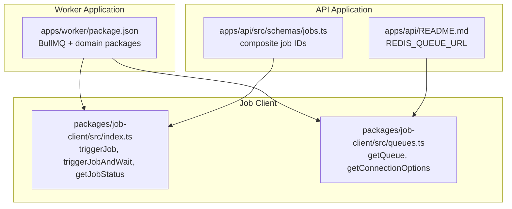
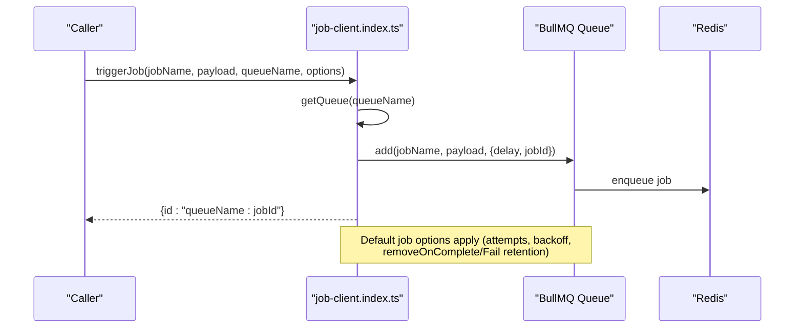
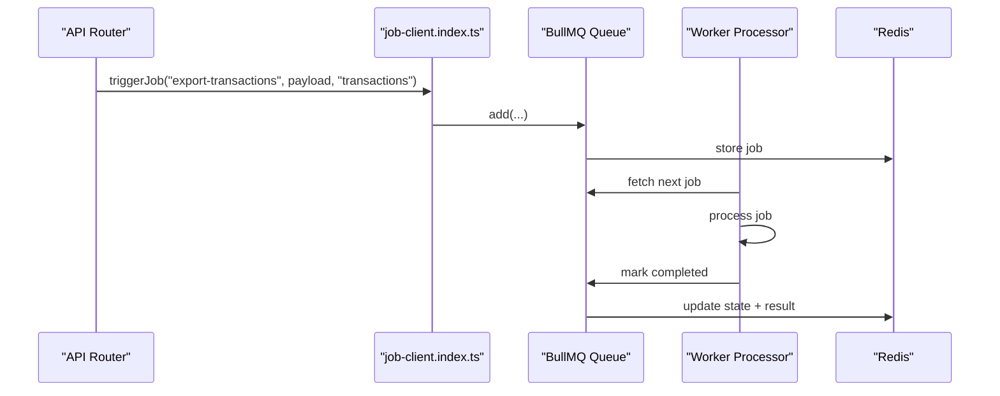
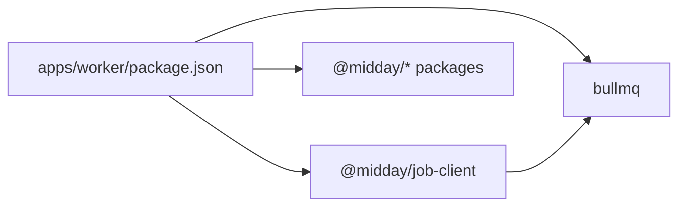

# Queue Management

<cite>
**Referenced Files in This Document**
- [package.json](file://apps/worker/package.json)
- [index.ts](packages/job-client/src/index.ts)
- [queues.ts](packages/job-client/src/queues.ts)
- [README.md](apps/api/README.md)
- [jobs.ts](apps/api/src/schemas/jobs.ts)
</cite>

## Table of Contents
1. [Introduction](#introduction)
2. [Project Structure](#project-structure)
3. [Core Components](#core-components)
4. [Architecture Overview](#architecture-overview)
5. [Detailed Component Analysis](#detailed-component-analysis)
6. [Dependency Analysis](#dependency-analysis)
7. [Performance Considerations](#performance-considerations)
8. [Troubleshooting Guide](#troubleshooting-guide)
9. [Conclusion](#conclusion)

## Introduction
This document describes the BullMQ queue management system used by the Worker Application. It explains how queues are configured, initialized, and connected to Redis, how jobs are enqueued and processed, and how queue-specific settings are applied across domains such as accounting, customers, documents, inbox, insights, institutions, invoices, notifications, rates, teams, and transactions. It also covers job serialization/deserialization, monitoring, statistics, performance optimization, scaling, backpressure handling, persistence, recovery, and operational best practices.

## Project Structure
The queue system spans two primary areas:
- The Worker Application (apps/worker) depends on BullMQ and job-domain packages to process jobs.
- The shared job client (packages/job-client) encapsulates Redis connectivity, queue creation, and job orchestration APIs.

Key elements:
- Worker application declares BullMQ as a dependency and integrates multiple domain packages.
- The job client provides queue creation, job triggering, status retrieval, and connection configuration.
- The API application documents the Redis queue URL and references the job client.

**Diagram sources**
- [package.json](file://apps/worker/package.json#L13-L48)
- [index.ts](packages/job-client/src/index.ts#L1-L324)
- [queues.ts](packages/job-client/src/queues.ts#L1-L102)
- [README.md](apps/api/README.md#L14-L14)
- [README.md](apps/api/README.md#L67-L67)
- [jobs.ts](apps/api/src/schemas/jobs.ts#L4-L7)

**Section sources**
- [package.json](file://apps/worker/package.json#L1-L57)
- [index.ts](packages/job-client/src/index.ts#L1-L324)
- [queues.ts](packages/job-client/src/queues.ts#L1-L102)
- [README.md](apps/api/README.md#L14-L14)
- [README.md](apps/api/README.md#L67-L67)
- [jobs.ts](apps/api/src/schemas/jobs.ts#L4-L7)

## Core Components
- Queue creation and connection management:
  - Redis connection options are parsed from REDIS_QUEUE_URL and applied consistently across queues.
  - Queue instances are cached in a Map keyed by queue name to avoid duplication.
  - Default job options include retry attempts, exponential backoff, and retention policies for completed/failed jobs.
  - Error handlers are attached to each queue to log and prevent unhandled exceptions.

- Job orchestration:
  - triggerJob enqueues jobs with optional delay and deduplication via custom jobId.
  - triggerJobAndWait enqueues and polls for completion with exponential backoff and a configurable timeout.
  - getJobStatus resolves composite job IDs to queue and job identifiers, validates team ownership, and returns normalized status, progress, and result/error metadata.

- Payload handling:
  - Jobs carry arbitrary payloads; the job client does not mutate payload content.
  - Progress and result metadata are extracted from job state for monitoring.

**Section sources**
- [queues.ts](packages/job-client/src/queues.ts#L14-L49)
- [queues.ts](packages/job-client/src/queues.ts#L54-L89)
- [index.ts](packages/job-client/src/index.ts#L31-L76)
- [index.ts](packages/job-client/src/index.ts#L88-L208)
- [index.ts](packages/job-client/src/index.ts#L219-L323)

## Architecture Overview
The queue architecture centers on a single BullMQ Queue per logical queue name. The job client manages Redis connectivity and queue lifecycle, while callers enqueue jobs and optionally await completion. Workers consume queues independently and process jobs based on domain-specific processor implementations.

**Diagram sources**
- [index.ts](packages/job-client/src/index.ts#L31-L76)
- [queues.ts](packages/job-client/src/queues.ts#L54-L89)

## Detailed Component Analysis

### Queue Initialization and Connection Management
- Redis URL parsing:
  - Reads REDIS_QUEUE_URL from environment and extracts host, port, credentials, and protocol.
  - Applies production-specific settings when NODE_ENV or RAILWAY_ENVIRONMENT indicates production.
  - Enables TLS for rediss:// URLs; sets IPv4-only family for Railway private networking.

- Queue creation:
  - getQueue caches queue instances by name.
  - Attaches a queue-level error listener to log errors and avoid unhandled exceptions.
  - Applies default job options globally to all jobs enqueued on the queue.

- Connection tuning:
  - Disables maxRetriesPerRequest and enableReadyCheck to reduce overhead.
  - Configures keepAlive and network family for stable connections.
  - Production mode adds connectTimeout, retryStrategy, and disables offline queue.

**Section sources**
- [queues.ts](packages/job-client/src/queues.ts#L14-L49)
- [queues.ts](packages/job-client/src/queues.ts#L54-L89)

### Job Enqueueing and Execution Flow
- triggerJob:
  - Enqueues a job with optional delay and custom jobId for deduplication.
  - Logs enqueue duration and composite job ID for observability.
  - Throws if job creation fails.

- triggerJobAndWait:
  - Enqueues a job and polls for completion with exponential backoff.
  - Uses a capped poll interval to reduce Redis load for long-running jobs.
  - Retrieves final result by refetching the completed job.

- getJobStatus:
  - Decodes composite IDs into queueName:jobId.
  - Validates team ownership when requested.
  - Returns normalized status, progress, and result/error metadata.

**Diagram sources**
- [index.ts](packages/job-client/src/index.ts#L31-L76)
- [index.ts](packages/job-client/src/index.ts#L88-L208)
- [index.ts](packages/job-client/src/index.ts#L219-L323)

**Section sources**
- [index.ts](packages/job-client/src/index.ts#L31-L76)
- [index.ts](packages/job-client/src/index.ts#L88-L208)
- [index.ts](packages/job-client/src/index.ts#L219-L323)

### Queue-Specific Settings Across Domains
- Default job options apply uniformly to all queues:
  - Attempts: 3 with exponential backoff starting at 1 second.
  - Completed job retention: 24 hours or 1000 jobs (whichever is reached first).
  - Failed job retention: 7 days.
- No per-queue overrides are present in the job client; all queues share the same defaults.

Operational implications:
- Consistent reliability and cleanup behavior across domains.
- To customize per-domain behavior, extend the queue creation logic to accept domain-specific options.

**Section sources**
- [queues.ts](packages/job-client/src/queues.ts#L59-L75)

### Job Serialization, Deserialization, and Payload Handling
- Serialization:
  - Jobs are enqueued with arbitrary payloads; the job client does not transform payload content.
  - Composite job IDs combine queue name and job ID for cross-domain identification.

- Deserialization:
  - Workers receive payloads as provided by the enqueuer.
  - Progress and result metadata are stored on the job object and surfaced via status queries.

- Payload contracts:
  - Domain routers and services pass domain-specific data structures to the job client.
  - The job client schema documents composite IDs used for status queries.

**Section sources**
- [index.ts](packages/job-client/src/index.ts#L31-L76)
- [jobs.ts](apps/api/src/schemas/jobs.ts#L4-L7)

### Monitoring, Statistics, and Observability
- Built-in logging:
  - Enqueue operations log queue name, job ID, and duration.
  - Completion polling logs wait durations and total elapsed time.
  - Queue-level error events are captured and logged.

- Status reporting:
  - getJobStatus returns normalized status, progress, and result/error fields.
  - Progress can be a numeric value or an object with progress and step fields.

- Metrics opportunities:
  - Track enqueue latency, completion latency, and failure rates per queue.
  - Monitor queue length and job throughput to inform scaling decisions.

**Section sources**
- [index.ts](packages/job-client/src/index.ts#L54-L60)
- [index.ts](packages/job-client/src/index.ts#L135-L142)
- [index.ts](packages/job-client/src/index.ts#L184-L191)
- [index.ts](packages/job-client/src/index.ts#L268-L322)

### Performance Optimization Strategies
- Backpressure and polling:
  - triggerJobAndWait uses exponential backoff polling to reduce Redis load for long-running jobs.
  - Caps poll intervals to balance responsiveness and efficiency.

- Retry and retention:
  - Exponential backoff reduces immediate retries under failure.
  - Controlled retention of completed and failed jobs prevents Redis bloat.

- Connection tuning:
  - Production settings optimize connection timeouts and retry behavior.
  - KeepAlive and IPv4-only family improve stability in containerized environments.

**Section sources**
- [index.ts](packages/job-client/src/index.ts#L119-L163)
- [queues.ts](packages/job-client/src/queues.ts#L43-L47)
- [queues.ts](packages/job-client/src/queues.ts#L35-L37)

### Scaling, Backpressure, and Resource Allocation
- Horizontal scaling:
  - Multiple workers can consume from the same queue; BullMQ distributes jobs among workers.
  - Each worker should initialize queues independently using the shared job client.

- Backpressure handling:
  - Use triggerJobAndWait judiciously; prefer asynchronous triggerJob for non-blocking flows.
  - For long-running jobs, rely on polling with exponential backoff to minimize Redis pressure.

- Resource allocation:
  - Tune worker concurrency per domain based on workload characteristics.
  - Monitor queue depth and job processing times to adjust worker counts.

[No sources needed since this section provides general guidance]

### Persistence, Recovery, and Operational Best Practices
- Persistence:
  - Completed jobs are retained for 24 hours or up to 1000 entries; failed jobs for 7 days.
  - This enables post-mortem analysis and reprocessing windows.

- Recovery:
  - Automatic retries with exponential backoff handle transient failures.
  - Use getJobStatus to detect and recover from failed jobs by resubmitting with corrected inputs.

- Best practices:
  - Always provide meaningful custom jobId for deduplication.
  - Log and monitor queue errors; ensure error handlers are attached.
  - Use composite job IDs for cross-domain status queries and team-scoped access checks.

**Section sources**
- [queues.ts](packages/job-client/src/queues.ts#L67-L74)
- [index.ts](packages/job-client/src/index.ts#L219-L323)

## Dependency Analysis
The Worker Application depends on BullMQ and multiple domain packages. The job client encapsulates BullMQ usage and provides a stable API for enqueueing and querying jobs.

**Diagram sources**
- [package.json](file://apps/worker/package.json#L13-L48)
- [index.ts](packages/job-client/src/index.ts#L1-L11)

**Section sources**
- [package.json](file://apps/worker/package.json#L1-L57)
- [index.ts](packages/job-client/src/index.ts#L1-L11)

## Performance Considerations
- Prefer asynchronous job triggering for UI-driven flows; reserve synchronous waiting for controlled scenarios.
- Use exponential backoff polling to reduce Redis load during extended waits.
- Monitor queue depths and job latencies to right-size worker pools and adjust retry/backoff parameters.
- Ensure production Redis settings are applied (TLS, timeouts, retry strategy) for resilient operations.

[No sources needed since this section provides general guidance]

## Troubleshooting Guide
Common issues and resolutions:
- Missing REDIS_QUEUE_URL:
  - Ensure REDIS_QUEUE_URL is set; the queue client throws if missing.
- Queue errors:
  - Queue-level error events are logged; inspect logs for underlying causes.
- Job not found:
  - Verify composite job ID format and queue name; confirm the job exists in Redis.
- Unauthorized access:
  - getJobStatus enforces team ownership; ensure teamId matches the job’s teamId.

**Section sources**
- [queues.ts](packages/job-client/src/queues.ts#L17-L19)
- [index.ts](packages/job-client/src/index.ts#L219-L323)

## Conclusion
The BullMQ queue system in the Worker Application is built around a shared job client that centralizes Redis connectivity, queue creation, and job orchestration. Default job options provide consistent reliability and retention across domains, while composite job IDs enable robust monitoring and access control. By leveraging asynchronous triggers, exponential backoff polling, and production-grade Redis settings, the system achieves scalable, observable, and resilient background processing.