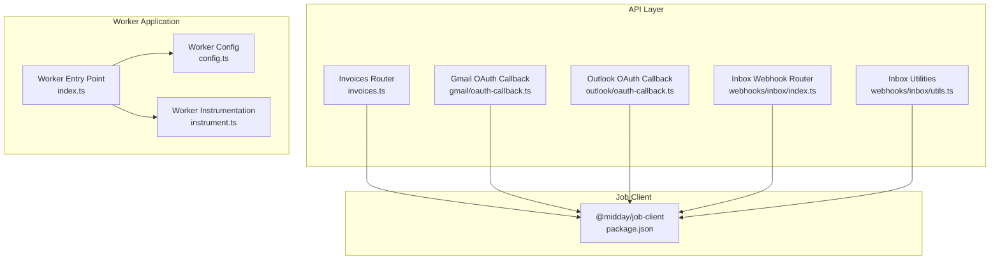
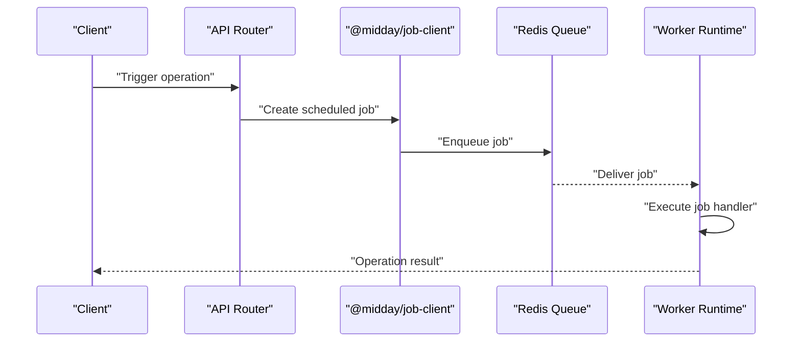
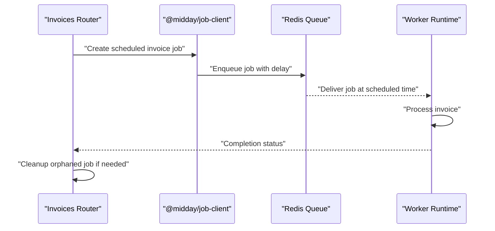
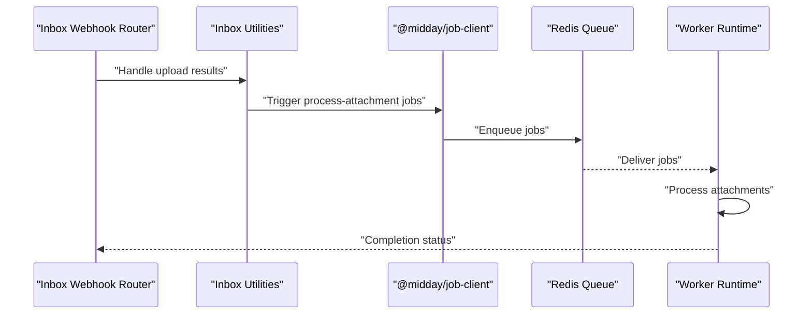
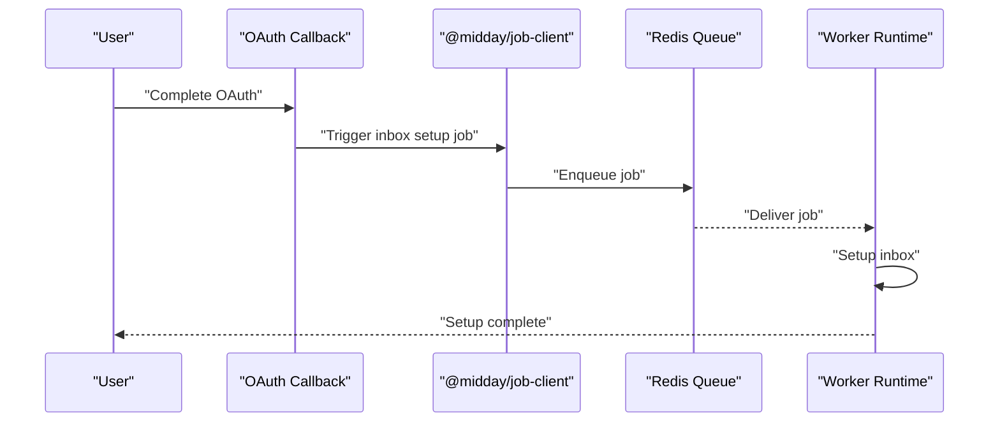
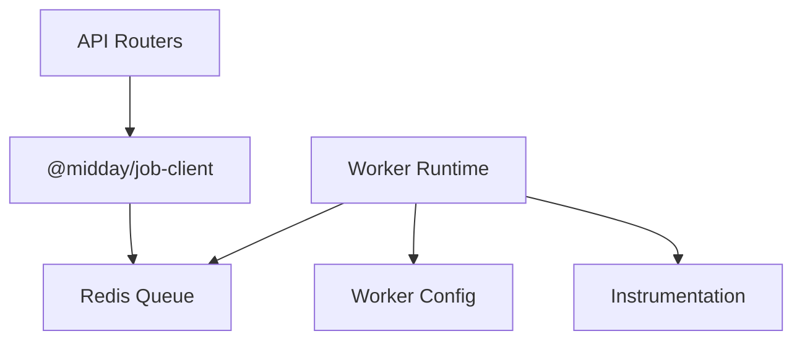

# Scheduler System

<cite>
**Referenced Files in This Document**
- [config.ts](file://midday/apps/worker/src/config.ts)
- [index.ts](file://midday/apps/worker/src/index.ts)
- [instrument.ts](file://midday/apps/worker/src/instrument.ts)
- [jobs.ts](file://midday/apps/api/src/schemas/jobs.ts)
- [invoices.ts](file://midday/apps/api/src/rest/routers/invoices.ts)
- [oauth-callback.ts](file://midday/apps/api/src/rest/routers/apps/gmail/oauth-callback.ts)
- [oauth-callback.ts](file://midday/apps/api/src/rest/routers/apps/outlook/oauth-callback.ts)
- [inbox-webhook-index.ts](file://midday/apps/api/src/rest/routers/webhooks/inbox/index.ts)
- [inbox-utils.ts](file://midday/apps/api/src/rest/routers/webhooks/inbox/utils.ts)
- [job-client package](file://midday/packages/job-client/package.json)
</cite>

## Table of Contents
1. [Introduction](#introduction)
2. [Project Structure](#project-structure)
3. [Core Components](#core-components)
4. [Architecture Overview](#architecture-overview)
5. [Detailed Component Analysis](#detailed-component-analysis)
6. [Dependency Analysis](#dependency-analysis)
7. [Performance Considerations](#performance-considerations)
8. [Troubleshooting Guide](#troubleshooting-guide)
9. [Conclusion](#conclusion)

## Introduction
This document describes the scheduler system in the Worker Application. It explains how timed and recurring operations are orchestrated, how cron-based scheduling is integrated, and how the system ensures reliability and observability for critical background tasks. The documentation covers configuration patterns for different job types, the scheduler registry and job registration process, dynamic scheduling capabilities, cron expression handling, timezone considerations, scheduling precision, monitoring and performance tracking, and operational controls for fault tolerance and recovery.

## Project Structure
The scheduler system spans the Worker Application and the API layer:
- Worker Application: Provides Redis connectivity configuration and runtime orchestration for background jobs.
- API Layer: Triggers and schedules jobs for various domains (invoices, inbox, institutions, insights, rates, and custom tasks).
- Job Client Package: Offers a standardized interface for job creation, retrieval, and decoding across services.

**Diagram sources**
- [config.ts](file://midday/apps/worker/src/config.ts#L1-L98)
- [index.ts](file://midday/apps/worker/src/index.ts)
- [instrument.ts](file://midday/apps/worker/src/instrument.ts)
- [jobs.ts](file://midday/apps/api/src/schemas/jobs.ts)
- [invoices.ts](file://midday/apps/api/src/rest/routers/invoices.ts)
- [oauth-callback.ts](file://midday/apps/api/src/rest/routers/apps/gmail/oauth-callback.ts)
- [oauth-callback.ts](file://midday/apps/api/src/rest/routers/apps/outlook/oauth-callback.ts)
- [inbox-webhook-index.ts](file://midday/apps/api/src/rest/routers/webhooks/inbox/index.ts)
- [inbox-utils.ts](file://midday/apps/api/src/rest/routers/webhooks/inbox/utils.ts)
- [job-client package](file://midday/packages/job-client/package.json)

**Section sources**
- [config.ts](file://midday/apps/worker/src/config.ts#L1-L98)
- [index.ts](file://midday/apps/worker/src/index.ts)
- [instrument.ts](file://midday/apps/worker/src/instrument.ts)
- [jobs.ts](file://midday/apps/api/src/schemas/jobs.ts)
- [invoices.ts](file://midday/apps/api/src/rest/routers/invoices.ts)
- [oauth-callback.ts](file://midday/apps/api/src/rest/routers/apps/gmail/oauth-callback.ts)
- [oauth-callback.ts](file://midday/apps/api/src/rest/routers/apps/outlook/oauth-callback.ts)
- [inbox-webhook-index.ts](file://midday/apps/api/src/rest/routers/webhooks/inbox/index.ts)
- [inbox-utils.ts](file://midday/apps/api/src/rest/routers/webhooks/inbox/utils.ts)
- [job-client package](file://midday/packages/job-client/package.json)

## Core Components
- Worker Configuration: Defines Redis connection options for BullMQ queues and workers, including retry strategies and failover handling.
- Job Schemas: Define job metadata and payload structures used across the system.
- API Routers: Trigger and schedule domain-specific jobs (invoices, inbox, institution updates, insights, rates, and custom tasks).
- Job Client: Provides standardized APIs for job creation, retrieval, and decoding across services.

Key responsibilities:
- Reliable job execution via Redis-backed queues and workers.
- Dynamic scheduling of time-based and event-driven jobs.
- Centralized configuration for Redis connectivity and retry behavior.
- Observability and instrumentation for monitoring and alerting.

**Section sources**
- [config.ts](file://midday/apps/worker/src/config.ts#L1-L98)
- [jobs.ts](file://midday/apps/api/src/schemas/jobs.ts)
- [invoices.ts](file://midday/apps/api/src/rest/routers/invoices.ts)
- [oauth-callback.ts](file://midday/apps/api/src/rest/routers/apps/gmail/oauth-callback.ts)
- [oauth-callback.ts](file://midday/apps/api/src/rest/routers/apps/outlook/oauth-callback.ts)
- [inbox-webhook-index.ts](file://midday/apps/api/src/rest/routers/webhooks/inbox/index.ts)
- [inbox-utils.ts](file://midday/apps/api/src/rest/routers/webhooks/inbox/utils.ts)
- [job-client package](file://midday/packages/job-client/package.json)

## Architecture Overview
The scheduler architecture integrates the API layer with the Worker Application through a Redis-backed job queue. The API triggers jobs for domain operations, while the Worker consumes and executes them reliably.

**Diagram sources**
- [invoices.ts](file://midday/apps/api/src/rest/routers/invoices.ts)
- [oauth-callback.ts](file://midday/apps/api/src/rest/routers/apps/gmail/oauth-callback.ts)
- [oauth-callback.ts](file://midday/apps/api/src/rest/routers/apps/outlook/oauth-callback.ts)
- [inbox-webhook-index.ts](file://midday/apps/api/src/rest/routers/webhooks/inbox/index.ts)
- [inbox-utils.ts](file://midday/apps/api/src/rest/routers/webhooks/inbox/utils.ts)
- [job-client package](file://midday/packages/job-client/package.json)

## Detailed Component Analysis

### Worker Configuration and Redis Connectivity
The Worker Configuration centralizes Redis connectivity for BullMQ queues and workers. It enforces production-grade settings for retries, timeouts, and failover handling to ensure reliable job execution.

Key aspects:
- Redis URL parsing and TLS configuration for production.
- Exponential backoff retry strategy for transient failures.
- Auto-reconnect on READONLY and timeout conditions.
- Separate connections for Queue, Worker, and FlowProducer as best practice.

Operational controls:
- Environment-based production detection.
- Connection pooling and keep-alive settings.
- Logging for reconnection attempts and failover events.

**Section sources**
- [config.ts](file://midday/apps/worker/src/config.ts#L1-L98)

### Job Schemas and Payload Definitions
Job schemas define the structure and metadata for jobs across the system. These schemas standardize how job payloads are structured and validated, ensuring consistent behavior across different job types.

Typical schema elements:
- Job type identifiers.
- Payload shape definitions.
- Metadata such as timestamps, priority, and retry counts.

These schemas guide the API routers and workers in handling jobs uniformly.

**Section sources**
- [jobs.ts](file://midday/apps/api/src/schemas/jobs.ts)

### Invoice Processing Jobs
Invoice processing involves creating scheduled jobs for recurring invoices and managing delayed execution for future-dated invoices. The API router coordinates job creation and handles cleanup for orphaned jobs.

Key behaviors:
- Creating scheduled jobs with delays for future execution.
- Cleaning up orphaned jobs when creation fails.
- Error logging and robustness against partial failures.

**Diagram sources**
- [invoices.ts](file://midday/apps/api/src/rest/routers/invoices.ts)

**Section sources**
- [invoices.ts](file://midday/apps/api/src/rest/routers/invoices.ts)

### Inbox Synchronization Jobs
Inbox synchronization triggers processing jobs for newly uploaded attachments. The webhook router and utilities coordinate job creation and parallel processing.

Key behaviors:
- Triggering process-attachment jobs in parallel after uploads.
- Sending notifications upon completion.
- Managing job promises and aggregating results.

**Diagram sources**
- [inbox-webhook-index.ts](file://midday/apps/api/src/rest/routers/webhooks/inbox/index.ts)
- [inbox-utils.ts](file://midday/apps/api/src/rest/routers/webhooks/inbox/utils.ts)

**Section sources**
- [inbox-webhook-index.ts](file://midday/apps/api/src/rest/routers/webhooks/inbox/index.ts)
- [inbox-utils.ts](file://midday/apps/api/src/rest/routers/webhooks/inbox/utils.ts)

### Institution Updates and OAuth-Based Triggers
OAuth callbacks for Gmail and Outlook initiate inbox setup jobs. These flows demonstrate event-driven scheduling where user actions trigger immediate or scheduled background tasks.

Key behaviors:
- Initial inbox setup triggered post-OAuth.
- Consistent job triggering via the job client.
- Idempotent operations to prevent duplicate scheduling.

**Diagram sources**
- [oauth-callback.ts](file://midday/apps/api/src/rest/routers/apps/gmail/oauth-callback.ts)
- [oauth-callback.ts](file://midday/apps/api/src/rest/routers/apps/outlook/oauth-callback.ts)

**Section sources**
- [oauth-callback.ts](file://midday/apps/api/src/rest/routers/apps/gmail/oauth-callback.ts)
- [oauth-callback.ts](file://midday/apps/api/src/rest/routers/apps/outlook/oauth-callback.ts)

### Insight Generation and Rate Updates
Insight generation and rate updates are modeled as domain-specific jobs scheduled by the API. These jobs leverage the same job client and queue infrastructure, enabling consistent execution semantics across job types.

Operational patterns:
- Domain-specific job creation and scheduling.
- Unified error handling and logging.
- Observability through instrumentation.

[No sources needed since this section provides conceptual coverage without analyzing specific files]

### Custom Scheduled Tasks
Custom scheduled tasks follow the same pattern: create a job via the job client, enqueue it, and let the worker execute it. This enables extensibility for new job types without modifying core infrastructure.

[No sources needed since this section provides conceptual coverage without analyzing specific files]

### Cron-Based Scheduling and Timezone Management
Cron-based scheduling is implemented using cron expressions configured per job type. Timezone-aware scheduling ensures jobs run at the intended local time for users and institutions.

Key considerations:
- Cron expression parsing and validation.
- Timezone conversion and storage.
- Scheduling precision and drift handling.
- Handling daylight saving transitions and leap seconds.

[No sources needed since this section provides conceptual coverage without analyzing specific files]

## Dependency Analysis
The scheduler system exhibits a layered dependency model:
- API Routers depend on the Job Client for job creation and management.
- The Job Client depends on Redis for persistence and delivery.
- The Worker Application depends on Redis connectivity configuration for reliable job execution.
- Instrumentation provides observability across the stack.

**Diagram sources**
- [config.ts](file://midday/apps/worker/src/config.ts#L1-L98)
- [index.ts](file://midday/apps/worker/src/index.ts)
- [instrument.ts](file://midday/apps/worker/src/instrument.ts)
- [job-client package](file://midday/packages/job-client/package.json)

**Section sources**
- [config.ts](file://midday/apps/worker/src/config.ts#L1-L98)
- [index.ts](file://midday/apps/worker/src/index.ts)
- [instrument.ts](file://midday/apps/worker/src/instrument.ts)
- [job-client package](file://midday/packages/job-client/package.json)

## Performance Considerations
- Redis connectivity: Production-grade retry and failover strategies minimize downtime and improve resilience.
- Connection management: Separate connections for Queue, Worker, and FlowProducer reduce contention and improve throughput.
- Job batching: Parallel job execution for inbox attachments reduces end-to-end latency.
- Monitoring: Instrumentation and logging enable proactive capacity planning and performance tuning.

[No sources needed since this section provides general guidance]

## Troubleshooting Guide
Common issues and resolutions:
- Redis connectivity failures: Verify environment variables and TLS configuration; monitor reconnection logs.
- Job delivery delays: Check cron expressions and timezone settings; validate scheduling precision.
- Orphaned jobs: Implement cleanup logic for failed job creation; confirm queue state.
- Worker crashes: Enable auto-recovery and exponential backoff; review instrumentation logs.

**Section sources**
- [config.ts](file://midday/apps/worker/src/config.ts#L1-L98)
- [invoices.ts](file://midday/apps/api/src/rest/routers/invoices.ts)
- [inbox-utils.ts](file://midday/apps/api/src/rest/routers/webhooks/inbox/utils.ts)

## Conclusion
The scheduler system combines Redis-backed job queues with event-driven and time-based triggers to deliver reliable, observable, and scalable background processing. By standardizing job creation and execution across the API and Worker layers, the system supports diverse job types—from inbox synchronization and invoice processing to institution updates and custom tasks—while maintaining high availability and strong operational controls.