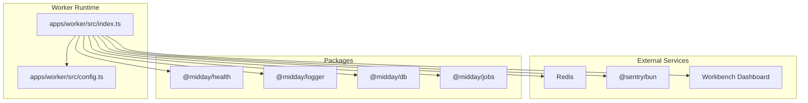
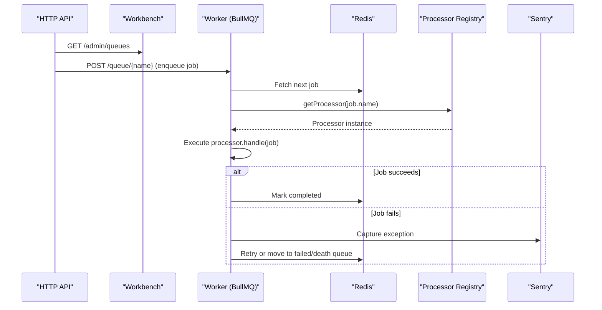
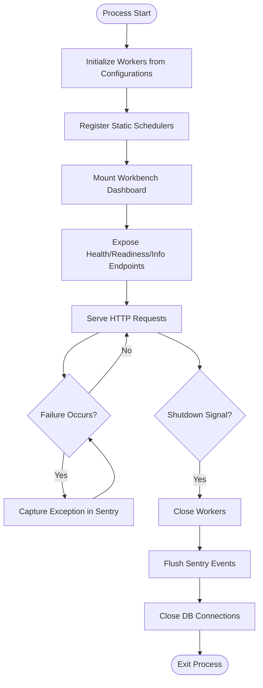
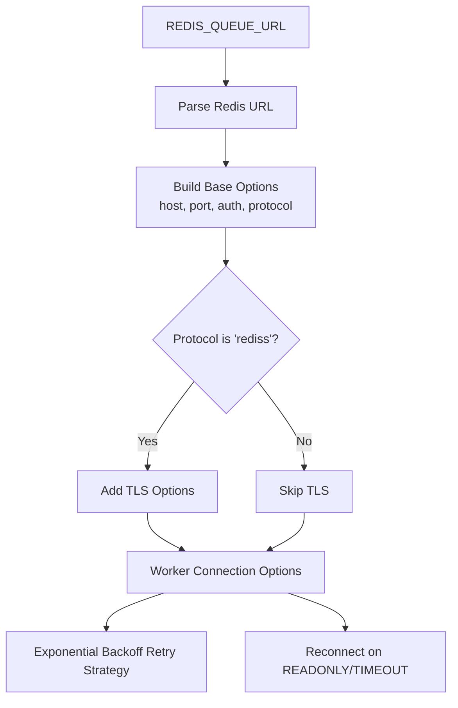
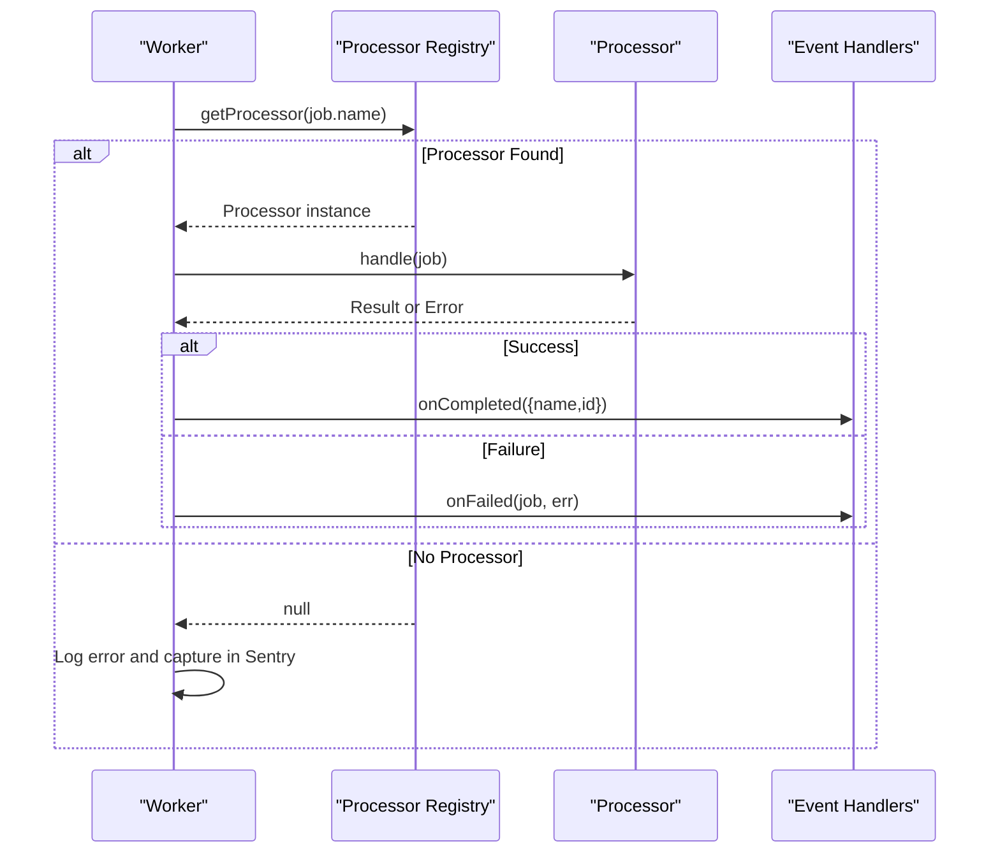
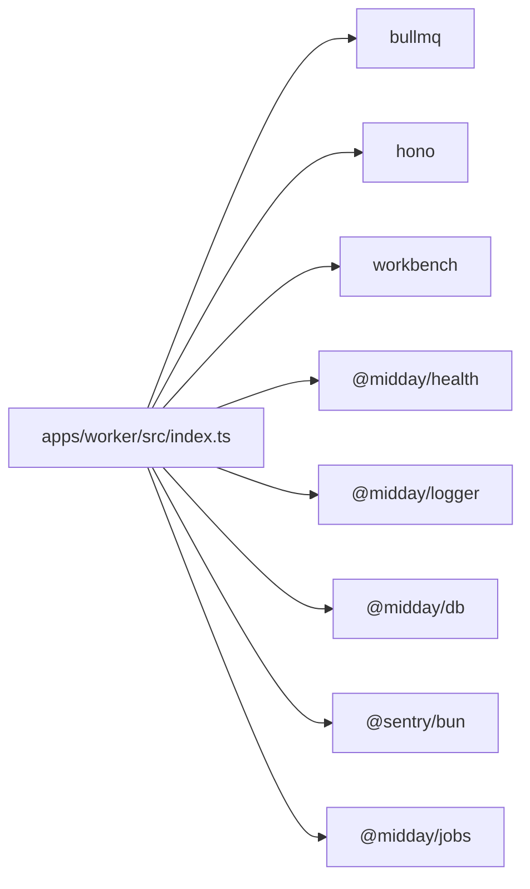

# Worker Application

<cite>
**Referenced Files in This Document**
- [index.ts](file://apps/worker/src/index.ts)
- [config.ts](file://apps/worker/src/config.ts)
- [package.json](file://apps/worker/package.json)
- [README.md](file://README.md)
</cite>

## Table of Contents
1. [Introduction](#introduction)
2. [Project Structure](#project-structure)
3. [Core Components](#core-components)
4. [Architecture Overview](#architecture-overview)
5. [Detailed Component Analysis](#detailed-component-analysis)
6. [Dependency Analysis](#dependency-analysis)
7. [Performance Considerations](#performance-considerations)
8. [Troubleshooting Guide](#troubleshooting-guide)
9. [Conclusion](#conclusion)

## Introduction
This document describes the Faworra Worker Application, a BullMQ-based background job processing system responsible for orchestrating asynchronous tasks across multiple functional domains. It covers queue configuration, dynamic worker creation, job scheduling, processor architecture, retry and error handling, monitoring, and operational controls. The worker exposes a lightweight HTTP server with a built-in dashboard for operational visibility and integrates health checks and graceful shutdown procedures.

## Project Structure
The worker application is organized around a central entry point that initializes BullMQ workers, registers schedulers, mounts a dashboard, and exposes health/readiness endpoints. Configuration utilities define Redis connectivity tailored for Workers and FlowProducer. The application relies on a registry pattern to dynamically route jobs to processors and supports centralized event handlers for completion and failure.

**Diagram sources**
- [index.ts](file://apps/worker/src/index.ts#L1-L312)
- [config.ts](file://apps/worker/src/config.ts#L1-L98)

**Section sources**
- [index.ts](file://apps/worker/src/index.ts#L1-L312)
- [config.ts](file://apps/worker/src/config.ts#L1-L98)
- [package.json](file://apps/worker/package.json#L1-L57)

## Core Components
- Dynamic Worker Creation: Workers are instantiated per queue configuration, with a shared processor lookup mechanism delegating job execution to registered processors.
- Event Handling: Centralized error and failure handlers capture exceptions and send structured telemetry to Sentry, while also invoking optional queue-specific event handlers.
- Scheduler Registration: Static schedulers are registered at startup to support recurring and time-based tasks.
- Dashboard and Monitoring: A Workbench-powered dashboard is mounted under a configurable base path with optional credentials, exposing queue and job statistics.
- Health and Readiness: Lightweight endpoints report service status and verify core dependencies (database and Redis).
- Graceful Shutdown: Controlled shutdown sequence closes workers, flushes Sentry, and tears down database connections with a bounded timeout.
- Operational Telemetry: Periodic database connection pool statistics are logged at a configurable interval.

**Section sources**
- [index.ts](file://apps/worker/src/index.ts#L25-L118)
- [index.ts](file://apps/worker/src/index.ts#L120-L126)
- [index.ts](file://apps/worker/src/index.ts#L134-L162)
- [index.ts](file://apps/worker/src/index.ts#L167-L182)
- [index.ts](file://apps/worker/src/index.ts#L232-L281)
- [index.ts](file://apps/worker/src/index.ts#L205-L226)

## Architecture Overview
The worker runtime composes BullMQ Workers with a registry-driven processor model. Redis serves as the persistent job store. Sentry provides error telemetry, while the Workbench dashboard offers operational insight. Health probes validate readiness of essential dependencies.

**Diagram sources**
- [index.ts](file://apps/worker/src/index.ts#L25-L118)
- [index.ts](file://apps/worker/src/index.ts#L134-L162)

## Detailed Component Analysis

### Worker Initialization and Lifecycle
- Worker Construction: For each queue configuration, a Worker is created with a function that resolves the appropriate processor and delegates execution.
- Error Handling: Dedicated error and failed event handlers log and capture exceptions via Sentry, including contextual details such as job attempts and options.
- Event Handlers: Optional onCompleted/onFailed handlers can be supplied per queue configuration to integrate external systems (e.g., status updates).
- Graceful Shutdown: A controlled sequence ensures workers stop accepting new jobs, allows in-flight jobs to finish, closes database connections, and flushes Sentry events before process exit.

**Diagram sources**
- [index.ts](file://apps/worker/src/index.ts#L25-L118)
- [index.ts](file://apps/worker/src/index.ts#L120-L126)
- [index.ts](file://apps/worker/src/index.ts#L134-L162)
- [index.ts](file://apps/worker/src/index.ts#L167-L191)
- [index.ts](file://apps/worker/src/index.ts#L232-L281)

**Section sources**
- [index.ts](file://apps/worker/src/index.ts#L25-L118)
- [index.ts](file://apps/worker/src/index.ts#L120-L126)
- [index.ts](file://apps/worker/src/index.ts#L134-L162)
- [index.ts](file://apps/worker/src/index.ts#L167-L191)
- [index.ts](file://apps/worker/src/index.ts#L232-L281)

### Redis Configuration and Connectivity
- Redis URL Parsing: Extracts host, port, credentials, and TLS settings from the configured URL, supporting both redis and rediss schemes.
- Worker Connection Options: Enforces recommended settings for Workers, including null max retries per request, exponential backoff retry strategy, and reconnect-on-error handling for failover scenarios.
- FlowProducer Connection: Provides a separate connection factory for FlowProducer, ensuring distinct connection lifecycles.

**Diagram sources**
- [config.ts](file://apps/worker/src/config.ts#L13-L32)
- [config.ts](file://apps/worker/src/config.ts#L46-L88)

**Section sources**
- [config.ts](file://apps/worker/src/config.ts#L13-L32)
- [config.ts](file://apps/worker/src/config.ts#L46-L88)

### Processor Architecture and Routing
- Registry Pattern: Jobs are routed to processors by name via a central registry. If no processor is registered for a given job type, the worker emits an error and logs accordingly.
- Centralized Failure Handling: Even if a processor is missing, the worker’s failed handler captures the event and forwards it to queue-specific handlers if present.
- Completion Hooks: Optional onCompleted handlers receive job metadata for downstream integration.

**Diagram sources**
- [index.ts](file://apps/worker/src/index.ts#L28-L34)
- [index.ts](file://apps/worker/src/index.ts#L53-L103)
- [index.ts](file://apps/worker/src/index.ts#L107-L115)

**Section sources**
- [index.ts](file://apps/worker/src/index.ts#L28-L34)
- [index.ts](file://apps/worker/src/index.ts#L53-L103)
- [index.ts](file://apps/worker/src/index.ts#L107-L115)

### Retry Mechanisms, Error Handling, and Dead Letter Strategies
- Worker-Level Retries: BullMQ Worker instances are configured with an exponential backoff retry strategy and automatic reconnection on transient network errors. This provides resilience against temporary failures.
- Processor-Level Retries: While not explicitly shown in the worker entry point, processors can implement retry logic internally when appropriate to their domain.
- Dead Letter Handling: The worker attaches a centralized failed handler that captures exceptions and forwards to queue-specific onFailed handlers. Implementations can choose to move failing jobs to dead-letter queues or mark statuses externally.
- Sentry Integration: All errors and unhandled exceptions are captured with contextual tags and extra metadata, enabling robust observability.

**Section sources**
- [config.ts](file://apps/worker/src/config.ts#L61-L86)
- [index.ts](file://apps/worker/src/index.ts#L40-L48)
- [index.ts](file://apps/worker/src/index.ts#L53-L103)
- [index.ts](file://apps/worker/src/index.ts#L286-L311)

### Scheduler Implementation for Recurring Tasks
- Static Scheduler Registration: At startup, the worker registers static schedulers to enqueue recurring or time-based jobs. Failures during registration cause a fatal exit to prevent inconsistent scheduling state.
- Cron and Time-Based Jobs: Schedulers are responsible for enqueueing jobs on cadence; the worker’s role is to process these jobs reliably through the established pipeline.

**Section sources**
- [index.ts](file://apps/worker/src/index.ts#L120-L126)

### Monitoring, Dashboards, and Operational Controls
- Workbench Dashboard: Mounted under a configurable base path with optional basic authentication. It surfaces queue lists and job statistics for operational oversight.
- Health and Readiness: A simple status endpoint confirms liveness, while a readiness probe validates connectivity to core dependencies.
- Info Endpoint: Returns queue metadata and the dashboard URL for quick navigation.
- DB Pool Stats: Periodic logging of database connection pool statistics is configurable via an environment variable.

**Section sources**
- [index.ts](file://apps/worker/src/index.ts#L134-L162)
- [index.ts](file://apps/worker/src/index.ts#L167-L191)
- [index.ts](file://apps/worker/src/index.ts#L205-L226)

### Worker Scaling and Resource Management
- Horizontal Scaling: Multiple worker processes can be deployed behind a single Redis backend; BullMQ distributes jobs across available workers automatically.
- Concurrency Control: Worker concurrency is determined by queue configuration and environment; adjust accordingly to balance throughput and resource utilization.
- Resource Limits: Configure process limits and container resource caps to avoid contention; monitor CPU/memory usage alongside DB pool stats.

[No sources needed since this section provides general guidance]

### Performance Optimization
- Redis Tuning: Use rediss URLs in production for TLS, and ensure low-latency connectivity to minimize queue round-trips.
- Retry Strategy: The exponential backoff reduces load spikes during transient failures; tune retry intervals based on job characteristics.
- Processor Efficiency: Keep processors idempotent and optimized; avoid long-running synchronous operations inside processors.
- Monitoring Cadence: Adjust DB pool stats logging interval to balance observability and overhead.

[No sources needed since this section provides general guidance]

## Dependency Analysis
The worker depends on BullMQ for queueing, Sentry for error reporting, Workbench for dashboards, and internal packages for health checks, logging, and database utilities. The package manifest enumerates these dependencies and scripts for development and production.

**Diagram sources**
- [package.json](file://apps/worker/package.json#L13-L48)
- [index.ts](file://apps/worker/src/index.ts#L1-L20)

**Section sources**
- [package.json](file://apps/worker/package.json#L13-L48)
- [index.ts](file://apps/worker/src/index.ts#L1-L20)

## Performance Considerations
- Queue Throughput: Scale workers horizontally and vertically based on job volume; monitor queue lengths and job latency.
- Redis Latency: Ensure low-latency access to Redis; prefer dedicated clusters for production.
- Idempotency: Design processors to tolerate duplicates to simplify retry semantics.
- Memory Footprint: Limit concurrent jobs per worker and avoid memory leaks in processors.
- Observability: Use Sentry tags and Workbench metrics to identify hotspots and bottlenecks.

[No sources needed since this section provides general guidance]

## Troubleshooting Guide
- Missing Processor: If a job type lacks a registered processor, the worker logs an error and captures it in Sentry. Verify the processor registry and job names.
- Redis Connectivity: If workers fail to reconnect, inspect Redis URL, credentials, and TLS settings; confirm network policies and firewall rules.
- Handler Failures: If a queue’s onFailed/onCompleted handler throws, the worker logs and captures the error separately; fix handler logic to avoid cascading failures.
- Shutdown Delays: If shutdown appears blocked, check for long-running jobs or database locks; reduce concurrency or increase timeouts cautiously.
- Sentry Reporting: Confirm Sentry DSN and tags are configured; review captured exceptions for root causes.

**Section sources**
- [index.ts](file://apps/worker/src/index.ts#L30-L32)
- [index.ts](file://apps/worker/src/index.ts#L40-L48)
- [index.ts](file://apps/worker/src/index.ts#L88-L102)
- [index.ts](file://apps/worker/src/index.ts#L232-L281)
- [config.ts](file://apps/worker/src/config.ts#L13-L32)

## Conclusion
The Faworra Worker Application provides a robust, production-ready foundation for background job processing using BullMQ. Its registry-driven processor model, centralized error handling, and integrated monitoring make it suitable for diverse workloads. By leveraging Redis-backed queues, Sentry telemetry, and Workbench dashboards, operators can maintain visibility and reliability across accounting, documents, inbox, insights, invoices, notifications, teams, and transactions domains.

[No sources needed since this section summarizes without analyzing specific files]